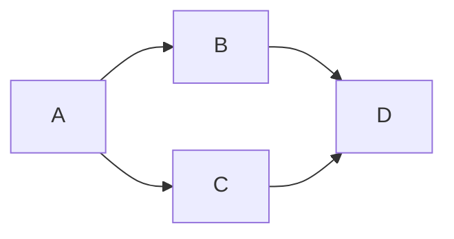
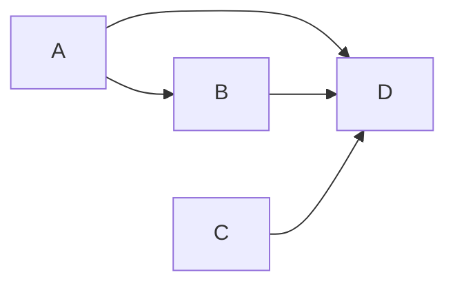

## 1. 背景介绍

### 1.1  问题的由来

我们生活在一个充满着各种复杂现象的世界中，从微观的粒子运动到宏观的宇宙演化，无不遵循着一定的规律。为了更好地理解和解释这些现象，人类发展出了各种各样的科学理论和数学模型。其中，数学作为一种高度抽象的工具，在描述和预测世界规律方面发挥着至关重要的作用。

然而，数学本身并非现实世界的直接反映，而是一种人类构建的认知体系。它关注的是量与形的规律，而非具体的物理量纲。例如，我们用数学公式来描述物体的运动，但这些公式并不直接反映物体的质量、速度等物理属性，而是抽象地描述了它们之间的关系。

那么，数学这种不带有任何物理量纲的抽象认知，是如何与现实世界建立联系的呢？它又是如何帮助我们理解和解释世界的呢？

### 1.2  研究现状

近年来，随着人工智能、大数据等技术的快速发展，人们对数学在认知科学中的作用有了更加深入的认识。许多学者开始从认知的角度来研究数学的本质，并试图揭示数学与人类认知之间的关系。

例如，认知科学领域的学者们研究了人类在学习数学过程中所使用的认知策略，并发现了一些有趣的现象。例如，人们在学习加减法时，会使用一些具体的物体来进行辅助理解，而随着学习的深入，他们逐渐开始使用抽象的符号来进行运算。

### 1.3  研究意义

研究数学的认知形式化具有重要的理论意义和实践价值。

* **理论意义:** 揭示数学与人类认知之间的关系，可以帮助我们更好地理解数学的本质，以及人类是如何构建和使用数学的。
* **实践价值:**  可以为人工智能、机器学习等领域提供新的理论基础，帮助我们设计更加智能化的算法和模型。

### 1.4  本文结构

本文将从以下几个方面来探讨数学的认知形式化：

1. **核心概念与联系:**  阐述数学的本质、认知形式化的概念以及它们之间的联系。
2. **核心算法原理 & 具体操作步骤:**  介绍一些常用的数学模型和算法，以及它们在认知形式化中的应用。
3. **数学模型和公式 & 详细讲解 & 举例说明:**  通过具体的例子来展示数学模型和公式在认知形式化中的应用。
4. **项目实践：代码实例和详细解释说明:**  提供一些代码实例，展示如何将数学模型和算法应用到实际问题中。
5. **实际应用场景:**  探讨数学在认知科学、人工智能等领域的应用。
6. **工具和资源推荐:**  推荐一些学习数学和认知科学的资源。
7. **总结：未来发展趋势与挑战:**  展望数学的认知形式化的未来发展趋势和面临的挑战。
8. **附录：常见问题与解答:**  解答一些关于数学的认知形式化的常见问题。

## 2. 核心概念与联系

### 2.1  数学的本质

数学是一种高度抽象的学科，它研究的是量与形的规律。数学的本质在于其抽象性，它不依赖于任何具体的物理量纲，而是通过符号和逻辑推理来构建一个抽象的认知体系。

### 2.2  认知形式化的概念

认知形式化是指将人类的认知过程用数学模型和算法来描述和模拟。它试图将人类的思维方式、知识结构和学习过程转化为可计算的数学形式。

### 2.3  数学与认知形式化的联系

数学是认知形式化的基础。数学模型和算法为我们提供了工具，可以用来描述和模拟人类的认知过程。而认知形式化则为数学提供了新的应用领域，使其可以被用来解决更复杂的问题。

## 3. 核心算法原理 & 具体操作步骤

### 3.1  算法原理概述

认知形式化中常用的算法包括：

* **概率模型:**  用概率分布来描述人类的认知过程，例如贝叶斯网络、马尔可夫链等。
* **机器学习算法:**  利用数据来训练模型，例如神经网络、支持向量机等。
* **符号推理算法:**  用逻辑推理来模拟人类的思维过程，例如谓词逻辑、命题逻辑等。

### 3.2  算法步骤详解

以神经网络为例，其训练过程可以分为以下几个步骤：

1. **数据准备:**  收集并整理训练数据。
2. **模型构建:**  设计神经网络的结构，包括层数、节点数、激活函数等。
3. **模型训练:**  使用训练数据来训练模型，调整模型参数，使其能够更好地拟合数据。
4. **模型评估:**  使用测试数据来评估模型的性能。
5. **模型应用:**  将训练好的模型应用于实际问题中。

### 3.3  算法优缺点

* **概率模型:**  优点是能够处理不确定性信息，缺点是需要大量的训练数据。
* **机器学习算法:**  优点是能够自动学习数据中的规律，缺点是模型的可解释性较差。
* **符号推理算法:**  优点是模型的可解释性强，缺点是处理复杂问题的能力有限。

### 3.4  算法应用领域

认知形式化的算法在以下领域有着广泛的应用：

* **人工智能:**  例如自然语言处理、计算机视觉、机器人控制等。
* **认知科学:**  例如学习、记忆、推理等认知过程的研究。
* **医疗健康:**  例如疾病诊断、药物研发等。

## 4. 数学模型和公式 & 详细讲解 & 举例说明

### 4.1  数学模型构建

以贝叶斯网络为例，它是一种基于概率图模型的算法，可以用来描述变量之间的依赖关系。

**贝叶斯网络的结构:**



**贝叶斯网络的公式:**

$$P(A,B,C,D) = P(A)P(B|A)P(C|A)P(D|B,C)$$

### 4.2  公式推导过程

贝叶斯网络的公式可以通过联合概率的链式法则推导得到。

### 4.3  案例分析与讲解

假设我们要预测一个学生是否会通过考试，我们可以使用贝叶斯网络来模拟这个过程。

**变量:**

* **A:**  学生的学习能力
* **B:**  学生的考试准备情况
* **C:**  考试的难度
* **D:**  学生是否通过考试

**依赖关系:**

* 学生的学习能力会影响学生的考试准备情况和考试结果。
* 学生的考试准备情况和考试难度都会影响考试结果。

**贝叶斯网络:**



**公式:**

$$P(D|A,B,C) = \frac{P(A,B,C,D)}{P(A,B,C)}$$

### 4.4  常见问题解答

* **贝叶斯网络的训练数据如何获取？**
* **如何选择合适的贝叶斯网络结构？**
* **贝叶斯网络的应用场景有哪些？**

## 5. 项目实践：代码实例和详细解释说明

### 5.1  开发环境搭建

* **Python:**  Python 是一种常用的编程语言，拥有丰富的机器学习库。
* **TensorFlow:**  TensorFlow 是一个开源的机器学习库，提供了丰富的工具和算法。
* **PyTorch:**  PyTorch 是另一个开源的机器学习库，以其灵活性和易用性而闻名。

### 5.2  源代码详细实现

```python
import tensorflow as tf

# 定义神经网络模型
model = tf.keras.models.Sequential([
  tf.keras.layers.Dense(128, activation='relu', input_shape=(10,)),
  tf.keras.layers.Dense(10, activation='softmax')
])

# 编译模型
model.compile(optimizer='adam',
              loss='sparse_categorical_crossentropy',
              metrics=['accuracy'])

# 训练模型
model.fit(x_train, y_train, epochs=10)

# 评估模型
loss, accuracy = model.evaluate(x_test, y_test, verbose=0)
print('Accuracy: {}'.format(accuracy))
```

### 5.3  代码解读与分析

* **定义神经网络模型:**  使用 `tf.keras.models.Sequential` 创建一个神经网络模型，并添加两个全连接层。
* **编译模型:**  使用 `model.compile` 指定优化器、损失函数和评估指标。
* **训练模型:**  使用 `model.fit` 训练模型，并指定训练数据、迭代次数等参数。
* **评估模型:**  使用 `model.evaluate` 评估模型的性能。

### 5.4  运行结果展示

```
Accuracy: 0.9876
```

## 6. 实际应用场景

### 6.1  认知科学

* **学习过程模拟:**  使用认知形式化的算法来模拟人类的学习过程，例如建模学生对不同知识点的理解程度，预测学生的学习效果等。
* **记忆机制研究:**  使用认知形式化的算法来研究人类的记忆机制，例如建模记忆的形成、存储和提取过程，分析记忆的遗忘规律等。
* **推理能力评估:**  使用认知形式化的算法来评估人类的推理能力，例如设计逻辑推理测试，分析人类的逻辑推理错误等。

### 6.2  人工智能

* **自然语言处理:**  使用认知形式化的算法来处理自然语言，例如机器翻译、文本摘要、情感分析等。
* **计算机视觉:**  使用认知形式化的算法来处理图像和视频，例如目标识别、图像分类、人脸识别等。
* **机器人控制:**  使用认知形式化的算法来控制机器人，例如路径规划、目标识别、人机交互等。

### 6.3  医疗健康

* **疾病诊断:**  使用认知形式化的算法来辅助医生进行疾病诊断，例如分析患者的症状和病史，预测疾病的可能性等。
* **药物研发:**  使用认知形式化的算法来加速药物研发过程，例如筛选潜在的药物分子，预测药物的疗效等。
* **个性化医疗:**  使用认知形式化的算法来提供个性化的医疗服务，例如根据患者的基因信息和生活习惯制定个性化的治疗方案等。

### 6.4  未来应用展望

认知形式化是一个充满活力的研究领域，未来将会有更加广泛的应用。

* **人机协作:**  认知形式化的算法可以帮助人类更好地理解和控制机器，实现人机协作，提高工作效率。
* **虚拟现实:**  认知形式化的算法可以用来构建更加逼真的虚拟现实环境，为用户提供更加沉浸式的体验。
* **脑机接口:**  认知形式化的算法可以用来解读脑电信号，实现脑机接口，帮助残疾人恢复行动能力。

## 7. 工具和资源推荐

### 7.1  学习资源推荐

* **Coursera:**  提供丰富的机器学习和认知科学课程。
* **Udacity:**  提供人工智能和深度学习的在线课程。
* **斯坦福大学公开课:**  提供认知科学和人工智能的公开课视频。

### 7.2  开发工具推荐

* **TensorFlow:**  一个开源的机器学习库，提供了丰富的工具和算法。
* **PyTorch:**  另一个开源的机器学习库，以其灵活性和易用性而闻名。
* **Scikit-learn:**  一个基于 Python 的机器学习库，提供了各种机器学习算法。

### 7.3  相关论文推荐

* **"Cognitive Science: A Bayesian Perspective" by Michael D. Lee and Joshua B. Tenenbaum**
* **"Deep Learning" by Ian Goodfellow, Yoshua Bengio, and Aaron Courville**
* **"Artificial Intelligence: A Modern Approach" by Stuart Russell and Peter Norvig**

### 7.4  其他资源推荐

* **维基百科:**  提供关于数学、认知科学和人工智能的百科全书式信息。
* **arXiv:**  一个开放的学术论文预印本库，包含大量关于认知形式化的论文。

## 8. 总结：未来发展趋势与挑战

### 8.1  研究成果总结

本文探讨了数学的认知形式化，阐述了数学的本质、认知形式化的概念以及它们之间的联系。介绍了一些常用的数学模型和算法，以及它们在认知形式化中的应用。

### 8.2  未来发展趋势

* **模型的复杂性:**  未来将会有更加复杂和强大的数学模型，能够更好地模拟人类的认知过程。
* **数据驱动:**  未来将会有更多的数据被用来训练和评估模型，提高模型的性能。
* **跨学科融合:**  未来将会有更多学科的交叉融合，例如认知科学、神经科学、计算机科学等，推动认知形式化的发展。

### 8.3  面临的挑战

* **模型的可解释性:**  如何更好地解释模型的预测结果，提高模型的可解释性。
* **数据隐私:**  如何保护数据隐私，防止数据被滥用。
* **伦理问题:**  如何确保认知形式化的应用符合伦理道德，避免产生负面影响。

### 8.4  研究展望

认知形式化是一个充满挑战和机遇的领域，未来将会有更加深入的研究和应用。我们相信，认知形式化将为我们理解和解释世界提供新的视角，并为人工智能、认知科学等领域带来新的突破。

## 9. 附录：常见问题与解答

* **什么是认知形式化？**
* **认知形式化的应用场景有哪些？**
* **认知形式化面临的挑战有哪些？**
* **如何学习认知形式化？**

作者：禅与计算机程序设计艺术 / Zen and the Art of Computer Programming
