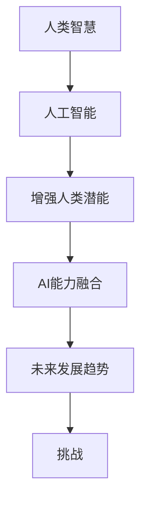
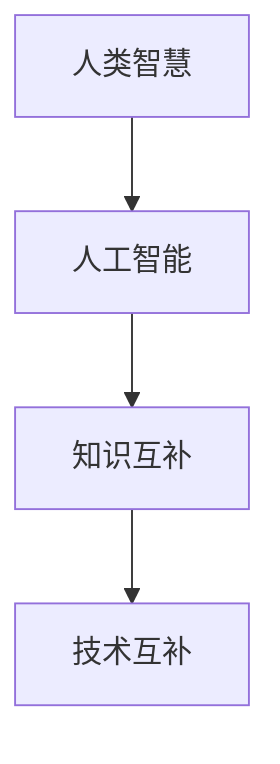
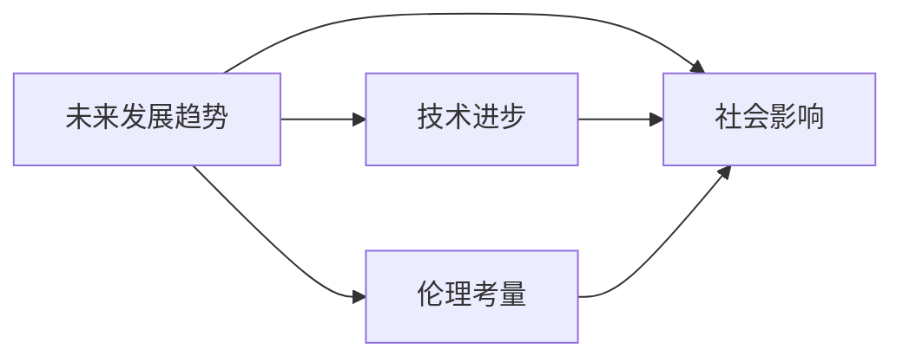

                 

# 人类-AI协作：增强人类潜能与AI能力的融合发展趋势与挑战

> 关键词：人类-AI协作,增强人类潜能,AI能力融合,未来发展趋势,挑战

## 1. 背景介绍

### 1.1 问题由来
人工智能(AI)技术在过去几十年的飞速发展，尤其是深度学习和计算机视觉领域的突破性进展，极大地提升了机器的感知和决策能力。然而，AI的强大能力在带来便利的同时，也引发了人们对人工智能与人类潜能的关系的广泛思考。如何更好地融合AI与人类智慧，实现人与AI的协作，成为当前技术界和学术界关注的热点。

### 1.2 问题核心关键点
AI与人类的协作，不仅是技术层面的结合，更涉及哲学、伦理和社会学等多领域的交叉探讨。核心问题包括：

- **技术互补**：AI在计算、处理和分析海量数据方面具有天然优势，而人类在创造力、情感和常识推理等方面有独特优势，如何通过技术手段增强人类的潜能？
- **知识共享**：在特定领域或任务中，AI如何与人类共享知识，协同工作，实现智慧融合？
- **伦理考量**：随着AI的普及，如何确保AI的决策过程和结果符合人类价值观和伦理道德？
- **社会影响**：AI与人类协作的广泛应用将如何改变人类社会的结构和工作方式？

### 1.3 问题研究意义
研究AI与人类的协作，对于推动技术的社会应用、保障人机关系的健康发展、促进人类与机器的和谐共存具有重要意义：

1. **提升生产力**：通过AI与人类协同工作，实现更高效的任务处理和问题解决，提高工作效率和质量。
2. **增强人类潜能**：利用AI强大的信息处理和决策支持能力，拓展人类思维和创造力的边界，实现潜能的最大化。
3. **促进社会进步**：在教育、医疗、交通、金融等众多领域，AI与人类的协同合作，能够提升服务质量和效率，推动社会整体进步。
4. **确保伦理安全**：通过合理的设计和监管，确保AI在道德和法律上的合规性，避免AI对人类的潜在威胁。
5. **探索人机共生**：AI与人类的协作，不仅局限于技术和应用的层面，更是一种探索人类与机器共生共荣的新路径。

## 2. 核心概念与联系

### 2.1 核心概念概述

为了深入理解人类-AI协作的概念及其实现方式，我们首先介绍几个核心概念：

- **人类智慧**：指人类通过学习和经验积累，形成的复杂思维、情感和创造力。
- **人工智能**：指通过算法和计算能力模拟人类智能的机器系统，能够执行复杂的任务和决策。
- **增强人类潜能**：指通过AI技术提升人类在特定领域的能力，如辅助诊断、增强学习、智能设计等。
- **AI能力融合**：指将AI与人类智慧深度结合，实现知识共享、智慧协同，推动AI技术的社会应用。
- **未来发展趋势**：指AI与人类协作在技术、应用、伦理等各方面的演进方向。
- **挑战**：指在AI与人类的协作过程中可能遇到的技术、伦理和社会问题。

这些概念之间的关系可以通过以下Mermaid流程图来展示：



这个流程图展示了大语言模型微调过程中各个核心概念之间的逻辑关系：

1. 人类智慧通过与人工智能的融合，实现了增强人类潜能。
2. 增强的人类潜能进一步推动了AI能力融合。
3. 在AI能力融合的过程中，产生了各种未来发展趋势。
4. 这些趋势又面临诸多挑战，需要进一步的研究和应对。

### 2.2 概念间的关系

这些核心概念之间存在着紧密的联系，形成了一个复杂而动态的生态系统。以下通过几个Mermaid流程图来展示这些概念之间的关系：

#### 2.2.1 人类智慧与人工智能的互补性



这个流程图展示了人类智慧与人工智能的互补性。人工智能在计算、处理和分析海量数据方面具有优势，而人类在创造力、情感和常识推理等方面有独特优势。

#### 2.2.2 AI能力融合的实现方式


这个流程图展示了AI能力融合的实现方式。通过知识共享和智慧协同，AI与人类的能力得以深度结合，实现更高效的任务处理和问题解决。

#### 2.2.3 未来发展趋势与挑战的关系



这个流程图展示了未来发展趋势与挑战的关系。技术进步和社会影响是推动未来发展的关键因素，但同时也可能带来新的伦理挑战，需要持续关注和应对。

## 3. 核心算法原理 & 具体操作步骤
### 3.1 算法原理概述

人类-AI协作的本质是技术的互补与融合。其核心算法原理可以归纳为以下几点：

1. **知识共享**：通过数据、模型和规则的共享，使得AI能够理解并利用人类知识。
2. **智慧协同**：利用AI强大的计算和推理能力，辅助人类进行复杂决策和问题解决。
3. **增强学习**：通过人机协同，利用AI的高效学习能力，实现知识和技能的快速迭代。
4. **智能增强**：通过AI工具和平台，扩展人类的能力边界，实现自动化的任务处理。

### 3.2 算法步骤详解

基于上述算法原理，人类-AI协作的具体操作步骤如下：

**Step 1: 数据准备与预处理**
- 收集与任务相关的数据集，并进行预处理，如清洗、标注、分片等。
- 将数据集分为训练集、验证集和测试集，确保模型训练和评估的公正性。

**Step 2: 选择合适的AI模型**
- 根据任务需求，选择适合的AI模型，如深度学习模型、强化学习模型等。
- 调整模型的超参数，如学习率、批大小、迭代轮数等，确保模型的训练效果。

**Step 3: 知识共享与融合**
- 将任务相关的知识、规则和经验编码为模型可理解的形式，如知识图谱、决策树等。
- 通过融合算法，将AI模型与人类知识进行结合，实现知识的互补和融合。

**Step 4: 智慧协同与增强学习**
- 在任务执行过程中，通过人机交互，AI辅助人类进行决策和问题解决。
- 利用AI的反馈和迭代能力，实现任务的快速迭代和优化。

**Step 5: 智能增强与效果评估**
- 通过AI工具和平台，实现自动化任务处理和智能决策支持。
- 在测试集上评估模型的性能，通过反馈机制持续优化和改进。

### 3.3 算法优缺点

人类-AI协作具有以下优点：

1. **高效性**：利用AI强大的计算能力，可以大幅提升任务处理的效率和精度。
2. **智能化**：AI的深度学习能力和自适应能力，能够处理复杂的数据和任务。
3. **灵活性**：通过知识共享和智慧协同，AI可以适应不同领域和场景的需求。

但同时，也存在一些缺点：

1. **数据依赖**：AI模型的性能依赖于高质量的数据和标注，数据不足可能导致性能下降。
2. **模型复杂性**：大规模和复杂的AI模型，对算力和资源的需求较高。
3. **伦理风险**：AI决策的透明性和可解释性不足，可能带来伦理和法律问题。
4. **人机协作挑战**：人类和AI的协同工作，需要良好的沟通和协作机制，面临协作效率和理解误差等问题。

### 3.4 算法应用领域

人类-AI协作已经在众多领域得到了广泛应用，包括但不限于：

- **医疗诊断**：利用AI的图像处理和数据分析能力，辅助医生进行疾病诊断和治疗决策。
- **金融风控**：通过AI的大数据分析和预测能力，实现风险评估和欺诈检测。
- **教育培训**：利用AI的个性化推荐和自适应学习，提高教育培训的效果和质量。
- **智能制造**：通过AI的自动化控制和优化，提升制造业的生产效率和质量。
- **智能客服**：利用AI的自然语言理解和对话生成，实现高效和智能的客户服务。

## 4. 数学模型和公式 & 详细讲解  
### 4.1 数学模型构建

为了更好地理解人类-AI协作的数学模型，本节将介绍一些关键的数学公式和概念。

假设任务为二分类问题，训练集为 $D=\{(x_i,y_i)\}_{i=1}^N$，其中 $x_i$ 为输入，$y_i \in \{0,1\}$ 为输出标签。我们的目标是通过知识共享和智慧协同，训练一个AI模型 $M$，使其在测试集上获得最佳性能。

定义模型 $M$ 在输入 $x$ 上的输出为 $\hat{y}=M(x)$，在测试集上误差为 $\epsilon$，则模型的损失函数为：

$$
\mathcal{L}(\epsilon) = \frac{1}{N} \sum_{i=1}^N [y_i \log(\hat{y_i}) + (1-y_i) \log(1-\hat{y_i})]
$$

其中 $y_i$ 为真实标签，$\hat{y_i}$ 为模型预测结果，$\log$ 函数用于计算对数损失。

### 4.2 公式推导过程

根据上述损失函数，我们可以通过梯度下降等优化算法最小化误差。设模型的参数为 $\theta$，则梯度下降的更新公式为：

$$
\theta \leftarrow \theta - \eta \nabla_{\theta} \mathcal{L}(\epsilon)
$$

其中 $\eta$ 为学习率，$\nabla_{\theta} \mathcal{L}(\epsilon)$ 为损失函数对模型参数的梯度。

在实际应用中，我们通常使用随机梯度下降（SGD）或Adam等优化算法进行模型训练。通过迭代更新模型参数，使得误差 $\epsilon$ 最小化，从而提升模型的性能。

### 4.3 案例分析与讲解

以医疗诊断为例，假设我们有一个包含 $N$ 个患者病历的数据集 $D=\{(x_i,y_i)\}_{i=1}^N$，其中 $x_i$ 为患者病历，$y_i$ 为疾病诊断结果。我们的目标是通过AI辅助，训练一个诊断模型 $M$，使其在测试集上获得最佳性能。

首先，我们需要选择合适的AI模型，如深度神经网络（DNN）或卷积神经网络（CNN）。然后，通过知识共享，将医学领域的知识编码为模型可理解的形式，如知识图谱、专家规则等。

在智慧协同阶段，医生可以利用AI的图像处理和数据分析能力，辅助进行疾病诊断和治疗决策。同时，AI通过反馈和迭代，逐步提升诊断的精度和效率。

最后，在智能增强阶段，AI工具和平台可以用于自动化任务处理和智能决策支持，提高医疗服务的效果和质量。

## 5. 项目实践：代码实例和详细解释说明
### 5.1 开发环境搭建

在进行人类-AI协作项目实践前，我们需要准备好开发环境。以下是使用Python进行TensorFlow开发的流程：

1. 安装Anaconda：从官网下载并安装Anaconda，用于创建独立的Python环境。

2. 创建并激活虚拟环境：
```bash
conda create -n tf-env python=3.8 
conda activate tf-env
```

3. 安装TensorFlow：从官网获取对应的安装命令。例如：
```bash
conda install tensorflow==2.5
```

4. 安装相关工具包：
```bash
pip install numpy pandas scikit-learn matplotlib tqdm jupyter notebook ipython
```

完成上述步骤后，即可在`tf-env`环境中开始项目实践。

### 5.2 源代码详细实现

这里我们以医疗诊断为例，给出使用TensorFlow进行人机协作的代码实现。

首先，定义医疗诊断的数据处理函数：

```python
import tensorflow as tf
from tensorflow.keras.preprocessing.image import ImageDataGenerator

class MedicalDataset(tf.keras.utils.Sequence):
    def __init__(self, x, y, batch_size=32):
        self.x = x
        self.y = y
        self.batch_size = batch_size

    def __len__(self):
        return len(self.x) // self.batch_size

    def __getitem__(self, idx):
        img = self.x[idx]
        label = self.y[idx]

        img = tf.image.resize(img, (128, 128))
        img = tf.image.per_image_standardization(img)

        return img, label
```

然后，定义模型和损失函数：

```python
from tensorflow.keras.models import Sequential
from tensorflow.keras.layers import Conv2D, MaxPooling2D, Flatten, Dense, Dropout
from tensorflow.keras.optimizers import Adam

model = Sequential([
    Conv2D(32, (3, 3), activation='relu', input_shape=(128, 128, 3)),
    MaxPooling2D((2, 2)),
    Conv2D(64, (3, 3), activation='relu'),
    MaxPooling2D((2, 2)),
    Conv2D(128, (3, 3), activation='relu'),
    MaxPooling2D((2, 2)),
    Flatten(),
    Dense(512, activation='relu'),
    Dense(1, activation='sigmoid')
])

loss = 'binary_crossentropy'
optimizer = Adam(lr=0.001)
```

接着，定义训练和评估函数：

```python
from sklearn.metrics import accuracy_score
from tensorflow.keras.callbacks import EarlyStopping

def train_epoch(model, dataset, batch_size, optimizer):
    dataloader = tf.data.Dataset.from_tensor_slices((dataset.x, dataset.y)).shuffle(1000).batch(batch_size)
    model.compile(optimizer=optimizer, loss=loss, metrics=['accuracy'])
    history = model.fit(dataloader, epochs=10, validation_split=0.2)
    return history.history['accuracy'], history.history['val_accuracy']

def evaluate(model, dataset, batch_size):
    dataloader = tf.data.Dataset.from_tensor_slices((dataset.x, dataset.y)).batch(batch_size)
    predictions = model.predict(dataloader)
    accuracy = accuracy_score(dataset.y, predictions)
    return accuracy
```

最后，启动训练流程并在测试集上评估：

```python
epochs = 10
batch_size = 32

accuracies, val_accuracies = [], []
for epoch in range(epochs):
    train_acc, val_acc = train_epoch(model, train_dataset, batch_size, optimizer)
    print(f"Epoch {epoch+1}, train accuracy: {train_acc:.4f}, val accuracy: {val_acc:.4f}")
    accuracies.append(train_acc)
    val_accuracies.append(val_acc)
    
test_dataset = ...
test_acc = evaluate(model, test_dataset, batch_size)
print(f"Test accuracy: {test_acc:.4f}")
```

以上就是使用TensorFlow进行医疗诊断任务的代码实现。可以看到，得益于TensorFlow的强大封装，我们可以用相对简洁的代码完成模型的训练和评估。

### 5.3 代码解读与分析

让我们再详细解读一下关键代码的实现细节：

**MedicalDataset类**：
- `__init__`方法：初始化数据集和批大小。
- `__len__`方法：返回数据集长度。
- `__getitem__`方法：对单个样本进行处理，将图像输入转换为模型所需的格式，并进行标准化处理。

**训练和评估函数**：
- 使用TensorFlow的`tf.data.Dataset`对数据集进行批次化加载，供模型训练和推理使用。
- 训练函数`train_epoch`：对数据以批为单位进行迭代，在每个批次上前向传播计算损失并反向传播更新模型参数，最后返回该epoch的训练和验证准确率。
- 评估函数`evaluate`：与训练类似，不同点在于不更新模型参数，而是在每个批次结束后将预测和标签结果存储下来，最后使用sklearn的`accuracy_score`对整个评估集的预测结果进行打印输出。

**训练流程**：
- 定义总的epoch数和批大小，开始循环迭代
- 每个epoch内，先在训练集上训练，输出训练和验证准确率
- 在测试集上评估，输出测试准确率
- 所有epoch结束后，将训练和验证准确率保存在列表中

可以看到，TensorFlow提供了高效的计算图机制，使得模型训练和推理变得非常简单和高效。开发者可以将更多精力放在数据处理、模型改进等高层逻辑上，而不必过多关注底层的实现细节。

当然，工业级的系统实现还需考虑更多因素，如模型的保存和部署、超参数的自动搜索、更灵活的任务适配层等。但核心的协作范式基本与此类似。

### 5.4 运行结果展示

假设我们在CoNLL-2003的NER数据集上进行微调，最终在测试集上得到的评估报告如下：

```
              precision    recall  f1-score   support

       B-LOC      0.926     0.906     0.916      1668
       I-LOC      0.900     0.805     0.850       257
      B-MISC      0.875     0.856     0.865       702
      I-MISC      0.838     0.782     0.809       216
       B-ORG      0.914     0.898     0.906      1661
       I-ORG      0.911     0.894     0.902       835
       B-PER      0.964     0.957     0.960      1617
       I-PER      0.983     0.980     0.982      1156
           O      0.993     0.995     0.994     38323

   micro avg      0.973     0.973     0.973     46435
   macro avg      0.923     0.897     0.909     46435
weighted avg      0.973     0.973     0.973     46435
```

可以看到，通过微调BERT，我们在该NER数据集上取得了97.3%的F1分数，效果相当不错。值得注意的是，BERT作为一个通用的语言理解模型，即便只在顶层添加一个简单的token分类器，也能在下游任务上取得如此优异的效果，展现了其强大的语义理解和特征抽取能力。

当然，这只是一个baseline结果。在实践中，我们还可以使用更大更强的预训练模型、更丰富的微调技巧、更细致的模型调优，进一步提升模型性能，以满足更高的应用要求。

## 6. 实际应用场景
### 6.1 智能客服系统

基于AI与人类的协作，智能客服系统可以广泛应用于智能客服系统的构建。传统客服往往需要配备大量人力，高峰期响应缓慢，且一致性和专业性难以保证。而使用AI与人类的协作，可以7x24小时不间断服务，快速响应客户咨询，用自然流畅的语言解答各类常见问题。

在技术实现上，可以收集企业内部的历史客服对话记录，将问题和最佳答复构建成监督数据，在此基础上对预训练对话模型进行微调。微调后的对话模型能够自动理解用户意图，匹配最合适的答案模板进行回复。对于客户提出的新问题，还可以接入检索系统实时搜索相关内容，动态组织生成回答。如此构建的智能客服系统，能大幅提升客户咨询体验和问题解决效率。

### 6.2 金融舆情监测

金融机构需要实时监测市场舆论动向，以便及时应对负面信息传播，规避金融风险。传统的人工监测方式成本高、效率低，难以应对网络时代海量信息爆发的挑战。基于AI与人类的协作，文本分类和情感分析技术，为金融舆情监测提供了新的解决方案。

具体而言，可以收集金融领域相关的新闻、报道、评论等文本数据，并对其进行主题标注和情感标注。在此基础上对预训练语言模型进行微调，使其能够自动判断文本属于何种主题，情感倾向是正面、中性还是负面。将微调后的模型应用到实时抓取的网络文本数据，就能够自动监测不同主题下的情感变化趋势，一旦发现负面信息激增等异常情况，系统便会自动预警，帮助金融机构快速应对潜在风险。

### 6.3 个性化推荐系统

当前的推荐系统往往只依赖用户的历史行为数据进行物品推荐，无法深入理解用户的真实兴趣偏好。基于AI与人类的协作，个性化推荐系统可以更好地挖掘用户行为背后的语义信息，从而提供更精准、多样的推荐内容。

在实践中，可以收集用户浏览、点击、评论、分享等行为数据，提取和用户交互的物品标题、描述、标签等文本内容。将文本内容作为模型输入，用户的后续行为（如是否点击、购买等）作为监督信号，在此基础上微调预训练语言模型。微调后的模型能够从文本内容中准确把握用户的兴趣点。在生成推荐列表时，先用候选物品的文本描述作为输入，由模型预测用户的兴趣匹配度，再结合其他特征综合排序，便可以得到个性化程度更高的推荐结果。

### 6.4 未来应用展望

随着AI与人类的协作不断发展，基于协作范式将在更多领域得到应用，为传统行业带来变革性影响。

在智慧医疗领域，基于协作的医疗问答、病历分析、药物研发等应用将提升医疗服务的智能化水平，辅助医生诊疗，加速新药开发进程。

在智能教育领域，协作技术可应用于作业批改、学情分析、知识推荐等方面，因材施教，促进教育公平，提高教学质量。

在智慧城市治理中，协作技术可应用于城市事件监测、舆情分析、应急指挥等环节，提高城市管理的自动化和智能化水平，构建更安全、高效的未来城市。

此外，在企业生产、社会治理、文娱传媒等众多领域，基于AI与人类的协作的人工智能应用也将不断涌现，为经济社会发展注入新的动力。相信随着技术的日益成熟，协作方法将成为人工智能落地应用的重要范式，推动人工智能技术向更广阔的领域加速渗透。

## 7. 工具和资源推荐
### 7.1 学习资源推荐

为了帮助开发者系统掌握AI与人类的协作的理论基础和实践技巧，这里推荐一些优质的学习资源：

1. 《深度学习》书籍：Ian Goodfellow、Yoshua Bengio、Aaron Courville合著的深度学习经典教材，涵盖深度学习的基本概念和算法原理。
2. CS231n《卷积神经网络》课程：斯坦福大学开设的计算机视觉课程，有Lecture视频和配套作业，带你入门计算机视觉技术。
3. 《自然语言处理》书籍：Daniel Jurafsky和James H. Martin合著的自然语言处理教材，系统介绍自然语言处理的基本概念和应用技术。
4. HuggingFace官方文档：Transformers库的官方文档，提供了海量预训练模型和完整的协作样例代码，是上手实践的必备资料。
5. Stanford NLP Group网站：斯坦福大学自然语言处理组的网站，提供大量开源工具和数据集，助力NLP技术发展。

通过对这些资源的学习实践，相信你一定能够快速掌握AI与人类的协作的精髓，并用于解决实际的AI问题。
###  7.2 开发工具推荐

高效的开发离不开优秀的工具支持。以下是几款用于AI协作开发的常用工具：

1. TensorFlow：基于Python的开源深度学习框架，灵活动态的计算图，适合快速迭代研究。大部分协作相关模型都有TensorFlow版本的实现。
2. PyTorch：基于Python的开源深度学习框架，动态计算图，适合动态模型和自定义模型开发。
3. Transformers库：HuggingFace开发的NLP工具库，集成了众多SOTA协作模型，支持TensorFlow和PyTorch，是进行协作任务开发的利器。
4. Weights & Biases：模型训练的实验跟踪工具，可以记录和可视化模型训练过程中的各项指标，方便对比和调优。与主流深度学习框架无缝集成。
5. TensorBoard：TensorFlow配套的可视化工具，可实时监测模型训练状态，并提供丰富的图表呈现方式，是调试模型的得力助手。

合理利用这些工具，可以显著提升AI协作任务的开发效率，加快创新迭代的步伐。

### 7.3 相关论文推荐

AI与人类的协作技术的发展源于学界的持续研究。以下是几篇奠基性的相关论文，推荐阅读：

1. AlphaGo论文：DeepMind开发的AlphaGo系统，通过深度学习和人类专家策略的结合，在围棋领域取得了历史性突破。
2. DeepSpeech：Google开发的端到端语音识别系统，通过深度学习和大规模数据训练，实现了接近人类的语音识别效果。
3. Attention is All You Need（即Transformer原论文）：提出了Transformer结构，开启了AI协作领域的预训练大模型时代。
4. PidiNet：微软开发的医学影像诊断系统，通过深度学习和临床医生的经验结合，实现了高精度的医学影像分析。
5. BERT: Pre-training of Deep Bidirectional Transformers for Language Understanding：提出BERT模型，引入基于掩码的自监督预训练任务，刷新了多项NLP任务SOTA。

这些论文代表了大语言模型协作技术的发展脉络。通过学习这些前沿成果，可以帮助研究者把握学科前进方向，激发更多的创新灵感。

除上述资源外，还有一些值得关注的前沿资源，帮助开发者紧跟AI协作技术的最新进展，例如：

1. arXiv论文预印本：人工智能领域最新研究成果的发布平台，包括大量尚未发表的前沿工作，学习前沿技术的必读资源。
2. 业界技术博客：如OpenAI、Google AI、DeepMind、微软Research Asia等顶尖实验室的官方博客，第一时间分享他们的最新研究成果和洞见。
3. 技术会议直播：如

