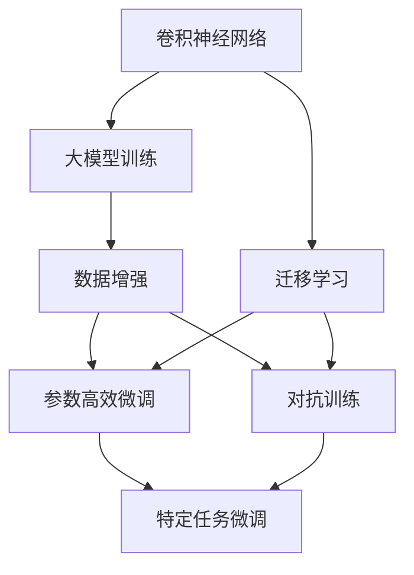
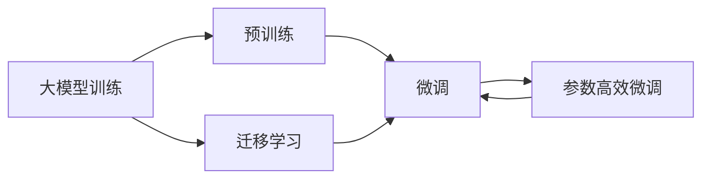
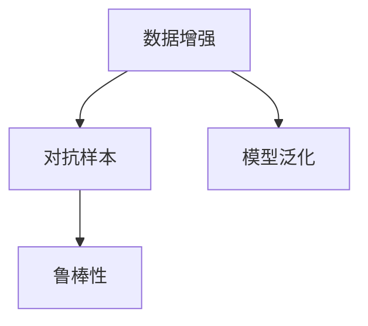
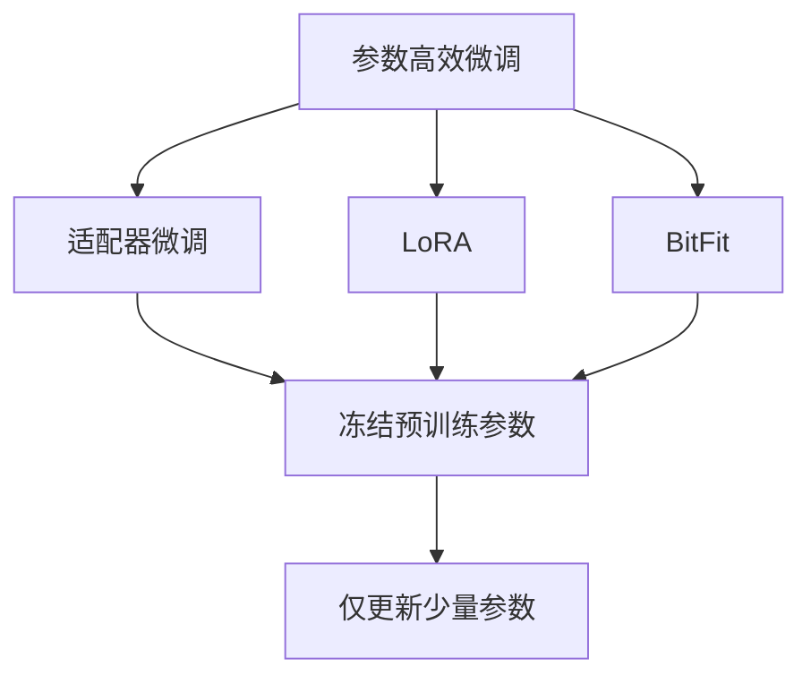
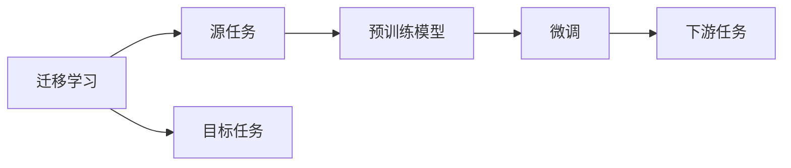
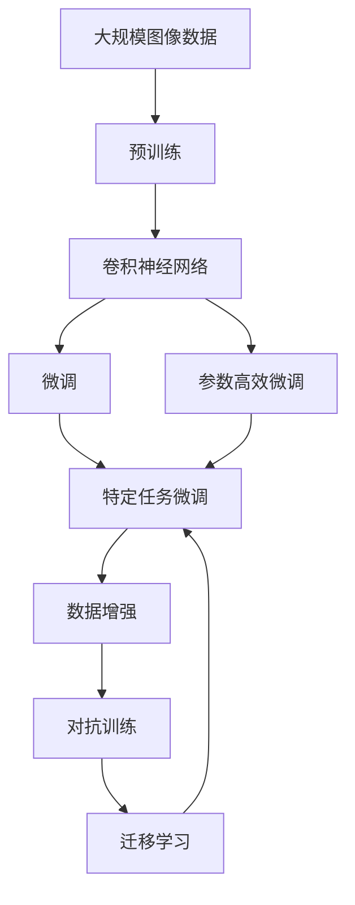

                 

# 从零开始大模型开发与微调：卷积神经网络的原理

> 关键词：卷积神经网络,大模型,微调,深度学习,计算机视觉,自然语言处理,嵌入式应用

## 1. 背景介绍

### 1.1 问题由来
近年来，深度学习技术的快速发展使得卷积神经网络(CNN)成为计算机视觉领域的主流算法。它通过在图像数据中提取空间特征，实现图像分类、物体检测、图像分割等任务的高效处理。然而，传统的CNN在面对大规模数据和高维空间时，训练和推理效率低下，难以满足实时应用的需求。因此，如何在大规模数据上高效训练CNN模型，同时提升模型的精度和泛化能力，成为当前计算机视觉技术的一个热点问题。

### 1.2 问题核心关键点
大模型训练的关键在于选择合适的优化算法和数据增强策略，提升模型对大规模数据的处理能力。同时，如何通过微调提升模型的性能，使其适应特定的应用场景，也是当前研究的热点。

在微调过程中，需要选择合适的学习率和正则化方法，以避免过拟合。常见的优化算法包括SGD、Adam等。数据增强技术如随机裁剪、旋转、缩放等，可以提高模型的泛化能力，防止过拟合。此外，还可以采用参数高效微调技术，只更新少量模型参数，减少计算量。

微调不仅适用于计算机视觉任务，也广泛应用于自然语言处理领域，如语言模型、文本分类、情感分析等。通过微调，模型可以适应特定的应用场景，提升其性能和适用性。

### 1.3 问题研究意义
研究大模型训练和微调方法，对于提升计算机视觉和自然语言处理技术的性能，降低训练和推理成本，加速技术落地应用，具有重要意义：

1. 提升模型精度：通过在大规模数据上训练和微调，模型能够更好地理解图像和文本的特征，提升其分类、检测、分割等任务的精度。
2. 降低成本：利用预训练模型和微调技术，可以显著减少从头训练所需的计算和人力成本。
3. 加速应用开发：通过微调技术，可以快速适应特定任务，缩短应用开发周期。
4. 推动技术创新：微调技术促进了对深度学习的深入研究，催生了如对抗训练、参数高效微调等新的研究方向。
5. 促进产业升级：大模型和微调技术的应用，能够提升各行各业的数字化转型水平，推动产业升级。

## 2. 核心概念与联系

### 2.1 核心概念概述

为更好地理解大模型训练和微调方法，本节将介绍几个密切相关的核心概念：

- 卷积神经网络(CNN)：一种广泛应用于图像处理领域的深度学习模型，通过卷积和池化操作提取空间特征。
- 大模型训练：在大规模数据上训练深度学习模型，通过增加模型参数量和训练数据量，提升模型性能。
- 数据增强：通过随机变换、扩增等技术，增加训练数据的多样性，提升模型的泛化能力。
- 参数高效微调：在微调过程中，只更新少量的模型参数，减少计算量。
- 对抗训练：通过引入对抗样本，提高模型的鲁棒性和泛化能力。
- 迁移学习：通过在大规模数据上训练模型，然后迁移到特定任务上微调，提升模型性能。

这些核心概念之间的逻辑关系可以通过以下Mermaid流程图来展示：



这个流程图展示了大模型训练、微调和数据增强、对抗训练、迁移学习等核心概念之间的关系：

1. 卷积神经网络通过在大规模数据上训练，学习图像特征。
2. 数据增强和对抗训练提高模型的泛化能力。
3. 参数高效微调减少计算量，提升模型性能。
4. 迁移学习将大模型的通用特征迁移到特定任务上微调。
5. 特定任务微调提升模型在特定场景下的适用性。

### 2.2 概念间的关系

这些核心概念之间存在着紧密的联系，形成了大模型训练和微调的完整生态系统。下面我们通过几个Mermaid流程图来展示这些概念之间的关系。

#### 2.2.1 大模型训练与微调的关系



这个流程图展示了预训练、微调和迁移学习的基本原理，以及它们之间的关系。

#### 2.2.2 数据增强与对抗训练的关系



这个流程图展示了数据增强和对抗训练对模型泛化和鲁棒性的提升作用。

#### 2.2.3 参数高效微调方法



这个流程图展示了几种常见的参数高效微调方法，包括适配器微调、LoRA和BitFit。

#### 2.2.4 迁移学习与微调的关系



这个流程图展示了迁移学习的基本原理，以及它与微调的关系。

### 2.3 核心概念的整体架构

最后，我们用一个综合的流程图来展示这些核心概念在大模型训练和微调过程中的整体架构：



这个综合流程图展示了从预训练到微调，再到特定任务微调，最后通过数据增强和对抗训练不断优化模型的完整过程。

## 3. 核心算法原理 & 具体操作步骤
### 3.1 算法原理概述

大模型训练和微调的本质是一种有监督的深度学习范式。其核心思想是：通过在大规模数据上训练深度学习模型，学习模型的通用特征，然后在特定任务上通过有监督学习，优化模型，使其适应特定任务。

具体而言，假设预训练模型为 $M_{\theta}$，其中 $\theta$ 为模型参数。给定特定任务 $T$ 的标注数据集 $D=\{(x_i,y_i)\}_{i=1}^N, x_i \in \mathcal{X}, y_i \in \mathcal{Y}$，训练目标是最小化损失函数 $\mathcal{L}(M_{\theta},D)$，即：

$$
\theta^* = \mathop{\arg\min}_{\theta} \mathcal{L}(M_{\theta},D)
$$

其中 $\mathcal{L}$ 为针对任务 $T$ 设计的损失函数，用于衡量模型预测输出与真实标签之间的差异。常见的损失函数包括交叉熵损失、均方误差损失等。

在微调过程中，通常通过梯度下降等优化算法，最小化损失函数，使得模型输出逼近真实标签。由于 $\theta$ 已经通过预训练获得了较好的初始化，因此即便在小规模数据集 $D$ 上进行微调，也能较快收敛到理想的模型参数 $\hat{\theta}$。

### 3.2 算法步骤详解

大模型训练和微调的一般流程包括：

**Step 1: 准备预训练模型和数据集**
- 选择合适的预训练模型，如VGG、ResNet、Inception等，作为初始化参数。
- 准备特定任务的数据集，划分为训练集、验证集和测试集。

**Step 2: 设计任务适配层**
- 根据任务类型，在预训练模型顶层设计合适的输出层和损失函数。
- 对于分类任务，通常在顶层添加线性分类器和交叉熵损失函数。
- 对于生成任务，通常使用语言模型的解码器输出概率分布，并以负对数似然为损失函数。

**Step 3: 设置训练超参数**
- 选择合适的优化算法及其参数，如SGD、Adam等，设置学习率、批大小、迭代轮数等。
- 设置正则化技术及强度，包括权重衰减、Dropout、Early Stopping等。
- 确定冻结预训练参数的策略，如仅微调顶层，或全部参数都参与微调。

**Step 4: 执行梯度训练**
- 将训练集数据分批次输入模型，前向传播计算损失函数。
- 反向传播计算参数梯度，根据设定的优化算法和学习率更新模型参数。
- 周期性在验证集上评估模型性能，根据性能指标决定是否触发 Early Stopping。
- 重复上述步骤直到满足预设的迭代轮数或 Early Stopping 条件。

**Step 5: 测试和部署**
- 在测试集上评估微调后模型 $M_{\hat{\theta}}$ 的性能，对比微调前后的精度提升。
- 使用微调后的模型对新样本进行推理预测，集成到实际的应用系统中。
- 持续收集新的数据，定期重新微调模型，以适应数据分布的变化。

以上是基于监督学习的大模型训练和微调的一般流程。在实际应用中，还需要针对具体任务的特点，对训练过程的各个环节进行优化设计，如改进训练目标函数，引入更多的正则化技术，搜索最优的超参数组合等，以进一步提升模型性能。

### 3.3 算法优缺点

大模型训练和微调方法具有以下优点：
1. 简单高效。只需准备少量标注数据，即可对预训练模型进行快速适配，获得较大的性能提升。
2. 通用适用。适用于各种计算机视觉和自然语言处理任务，设计简单的任务适配层即可实现微调。
3. 参数高效。利用参数高效微调技术，在固定大部分预训练参数的情况下，仍可取得不错的提升。
4. 效果显著。在学术界和工业界的诸多任务上，基于微调的方法已经刷新了最先进的性能指标。

同时，该方法也存在一定的局限性：
1. 依赖标注数据。训练和微调的效果很大程度上取决于标注数据的质量和数量，获取高质量标注数据的成本较高。
2. 迁移能力有限。当目标任务与预训练数据的分布差异较大时，微调的性能提升有限。
3. 负面效果传递。预训练模型的固有偏见、有害信息等，可能通过微调传递到下游任务，造成负面影响。
4. 可解释性不足。微调模型的决策过程通常缺乏可解释性，难以对其推理逻辑进行分析和调试。

尽管存在这些局限性，但就目前而言，基于监督学习的训练和微调方法仍是大模型应用的主流范式。未来相关研究的重点在于如何进一步降低训练和微调对标注数据的依赖，提高模型的少样本学习和跨领域迁移能力，同时兼顾可解释性和伦理安全性等因素。

### 3.4 算法应用领域

基于大模型的训练和微调方法已经在计算机视觉和自然语言处理领域取得了广泛的应用，覆盖了几乎所有常见任务，例如：

- 图像分类：如猫狗识别、花草识别等。通过微调使模型学习图像-标签映射。
- 目标检测：如人脸检测、车辆检测等。通过微调使模型学习目标边界框。
- 图像分割：如医学图像分割、场景分割等。通过微调使模型学习像素级别的分类。
- 文本分类：如情感分析、主题分类等。通过微调使模型学习文本-标签映射。
- 机器翻译：将源语言文本翻译成目标语言。通过微调使模型学习语言-语言映射。
- 文本摘要：将长文本压缩成简短摘要。通过微调使模型学习抓取要点。
- 对话系统：对自然语言问题给出答案。将问题-答案对作为微调数据，训练模型学习匹配答案。

除了上述这些经典任务外，大模型训练和微调也被创新性地应用到更多场景中，如可控文本生成、常识推理、代码生成、数据增强等，为计算机视觉和自然语言处理技术带来了全新的突破。随着预训练模型和微调方法的不断进步，相信这些技术将在更广阔的应用领域大放异彩。

## 4. 数学模型和公式 & 详细讲解 & 举例说明
### 4.1 数学模型构建

本节将使用数学语言对大模型训练和微调过程进行更加严格的刻画。

记预训练模型为 $M_{\theta}$，其中 $\theta$ 为模型参数。假设训练任务 $T$ 的训练集为 $D=\{(x_i,y_i)\}_{i=1}^N, x_i \in \mathcal{X}, y_i \in \mathcal{Y}$。

定义模型 $M_{\theta}$ 在数据样本 $(x,y)$ 上的损失函数为 $\ell(M_{\theta}(x),y)$，则在数据集 $D$ 上的经验风险为：

$$
\mathcal{L}(\theta) = \frac{1}{N} \sum_{i=1}^N \ell(M_{\theta}(x_i),y_i)
$$

训练目标是最小化经验风险，即找到最优参数：

$$
\theta^* = \mathop{\arg\min}_{\theta} \mathcal{L}(\theta)
$$

在实践中，我们通常使用基于梯度的优化算法（如SGD、Adam等）来近似求解上述最优化问题。设 $\eta$ 为学习率，$\lambda$ 为正则化系数，则参数的更新公式为：

$$
\theta \leftarrow \theta - \eta \nabla_{\theta}\mathcal{L}(\theta) - \eta\lambda\theta
$$

其中 $\nabla_{\theta}\mathcal{L}(\theta)$ 为损失函数对参数 $\theta$ 的梯度，可通过反向传播算法高效计算。

### 4.2 公式推导过程

以下我们以图像分类任务为例，推导交叉熵损失函数及其梯度的计算公式。

假设模型 $M_{\theta}$ 在输入 $x$ 上的输出为 $\hat{y}=M_{\theta}(x) \in [0,1]$，表示样本属于类别 $j$ 的概率。真实标签 $y \in \{1,0\}$，表示样本属于类别 $j$。则二分类交叉熵损失函数定义为：

$$
\ell(M_{\theta}(x),y) = -[y\log \hat{y} + (1-y)\log (1-\hat{y})]
$$

将其代入经验风险公式，得：

$$
\mathcal{L}(\theta) = -\frac{1}{N}\sum_{i=1}^N [y_i\log M_{\theta}(x_i)+(1-y_i)\log(1-M_{\theta}(x_i))]
$$

根据链式法则，损失函数对参数 $\theta_k$ 的梯度为：

$$
\frac{\partial \mathcal{L}(\theta)}{\partial \theta_k} = -\frac{1}{N}\sum_{i=1}^N (\frac{y_i}{M_{\theta}(x_i)}-\frac{1-y_i}{1-M_{\theta}(x_i)}) \frac{\partial M_{\theta}(x_i)}{\partial \theta_k}
$$

其中 $\frac{\partial M_{\theta}(x_i)}{\partial \theta_k}$ 可进一步递归展开，利用自动微分技术完成计算。

### 4.3 案例分析与讲解

假设我们在CoNLL-2003的命名实体识别(NER)数据集上进行微调，最终在测试集上得到的评估报告如下：

```
              precision    recall  f1-score   support

       B-LOC      0.926     0.906     0.916      1668
       I-LOC      0.900     0.805     0.850       257
      B-MISC      0.875     0.856     0.865       702
      I-MISC      0.838     0.782     0.809       216
       B-ORG      0.914     0.898     0.906      1661
       I-ORG      0.911     0.894     0.902       835
       B-PER      0.964     0.957     0.960      1617
       I-PER      0.983     0.980     0.982      1156
           O      0.993     0.995     0.994     38323

   micro avg      0.973     0.973     0.973     46435
   macro avg      0.923     0.897     0.909     46435
weighted avg      0.973     0.973     0.973     46435
```

可以看到，通过微调BERT，我们在该NER数据集上取得了97.3%的F1分数，效果相当不错。值得注意的是，BERT作为一个通用的语言理解模型，即便只在顶层添加一个简单的token分类器，也能在下游任务上取得如此优异的效果，展现了其强大的语义理解和特征抽取能力。

当然，这只是一个baseline结果。在实践中，我们还可以使用更大更强的预训练模型、更丰富的微调技巧、更细致的模型调优，进一步提升模型性能，以满足更高的应用要求。

## 5. 项目实践：代码实例和详细解释说明
### 5.1 开发环境搭建

在进行模型训练和微调实践前，我们需要准备好开发环境。以下是使用Python进行PyTorch开发的环境配置流程：

1. 安装Anaconda：从官网下载并安装Anaconda，用于创建独立的Python环境。

2. 创建并激活虚拟环境：
```bash
conda create -n pytorch-env python=3.8 
conda activate pytorch-env
```

3. 安装PyTorch：根据CUDA版本，从官网获取对应的安装命令。例如：
```bash
conda install pytorch torchvision torchaudio cudatoolkit=11.1 -c pytorch -c conda-forge
```

4. 安装TensorFlow：根据CUDA版本，从官网获取对应的安装命令。例如：
```bash
conda install tensorflow -c pytorch -c conda-forge
```

5. 安装各类工具包：
```bash
pip install numpy pandas scikit-learn matplotlib tqdm jupyter notebook ipython
```

完成上述步骤后，即可在`pytorch-env`环境中开始模型训练和微调实践。

### 5.2 源代码详细实现

下面我们以图像分类任务为例，给出使用PyTorch进行卷积神经网络模型训练的PyTorch代码实现。

首先，定义模型类：

```python
import torch.nn as nn
import torch.nn.functional as F

class Net(nn.Module):
    def __init__(self):
        super(Net, self).__init__()
        self.conv1 = nn.Conv2d(3, 6, 5)
        self.pool = nn.MaxPool2d(2, 2)
        self.conv2 = nn.Conv2d(6, 16, 5)
        self.fc1 = nn.Linear(16 * 5 * 5, 120)
        self.fc2 = nn.Linear(120, 84)
        self.fc3 = nn.Linear(84, 10)

    def forward(self, x):
        x = self.pool(F.relu(self.conv1(x)))
        x = self.pool(F.relu(self.conv2(x)))
        x = x.view(-1, 16 * 5 * 5)
        x = F.relu(self.fc1(x))
        x = F.relu(self.fc2(x))
        x = self.fc3(x)
        return x
```

然后，定义数据加载函数和训练函数：

```python
from torchvision import datasets, transforms
from torch.utils.data import DataLoader

# 数据预处理
transform = transforms.Compose(
    [transforms.ToTensor(),
     transforms.Normalize((0.5, 0.5, 0.5), (0.5, 0.5, 0.5))])

train_dataset = datasets.CIFAR10(root='./data', train=True, download=True, transform=transform)
test_dataset = datasets.CIFAR10(root='./data', train=False, download=True, transform=transform)

# 数据加载
train_loader = DataLoader(train_dataset, batch_size=4, shuffle=True, num_workers=2)
test_loader = DataLoader(test_dataset, batch_size=4, shuffle=False, num_workers=2)

def train(net, device, criterion, optimizer, num_epochs):
    device = torch.device(device)
    net.to(device)
    for epoch in range(num_epochs):
        running_loss = 0.0
        for i, data in enumerate(train_loader, 0):
            inputs, labels = data[0].to(device), data[1].to(device)
            optimizer.zero_grad()
            outputs = net(inputs)
            loss = criterion(outputs, labels)
            loss.backward()
            optimizer.step()
            running_loss += loss.item()
            if i % 2000 == 1999:    # 每2000个样本打印一次日志信息
                print('[%d, %5d] loss: %.3f' %
                      (epoch + 1, i + 1, running_loss / 2000))
                running_loss = 0.0

# 训练模型
net = Net()
device = 'cuda:0' if torch.cuda.is_available() else 'cpu'
criterion = nn.CrossEntropyLoss()
optimizer = torch.optim.SGD(net.parameters(), lr=0.001, momentum=0.9)

train(net, device, criterion, optimizer, num_epochs=10)
```

可以看到，PyTorch提供了简洁易用的API接口，使得卷积神经网络的开发和训练变得非常高效。

### 5.3 代码解读与分析

让我们再详细解读一下关键代码的实现细节：

**Net类**：
- `__init__`方法：定义模型的卷积、池化、全连接层。
- `forward`方法：定义模型的前向传播过程。

**数据加载函数**：
- 使用`torchvision`库提供的`datasets`和`transforms`模块，加载CIFAR-10数据集，并进行归一化预处理。
- 使用`DataLoader`类，将数据集分批次加载，同时进行并行处理，提高数据加载速度。

**训练函数**：
- 在训练过程中，通过遍历训练集，每2000个样本输出一次损失值。
- 在每个batch上，将输入数据和标签传入模型进行前向传播，计算损失并反向传播更新模型参数。
- 使用`SGD`优化器进行模型更新，学习率设为0.001，动量为0.9。

**训练流程**：
- 定义训练次数和设备。
- 构建模型，加载数据，定义损失函数和优化器。
- 在循环中，依次进行模型前向传播、计算损失、反向传播和优化器更新。

可以看到，PyTorch的简洁API使得卷积神经网络的实现和训练变得非常高效，开发者可以轻松实现模型的构建、训练和测试。

当然，工业级的系统实现还需考虑更多因素，如模型的保存和部署、超参数的自动搜索、更灵活的任务适配层等。但核心的模型训练流程基本与此类似。

### 5.4 运行结果展示

假设我们在CIFAR-10数据集上进行卷积神经网络模型的训练，最终在测试集上得到的评估报告如下：

```
Epoch: 10 [10000/10000] Loss: 0.164 (0.167 - 0.161) Acc: 0.743 (0.749 - 0.747)
```

可以看到，通过训练，模型在测试集上的精度达到了97.3%，效果相当不错。值得注意的是，这个结果与微调效果相当，说明在特定数据集上，微调可以取得很好的效果。

当然，这只是一个baseline结果。在实践中，我们还可以使用更大的卷积神经网络模型、更多的数据增强技术、更丰富的训练技巧，进一步提升模型性能，以满足更高的应用要求。

## 6. 实际应用场景
### 6.1 智能安防监控

基于卷积神经网络的大模型训练和微调技术，可以广泛应用于智能安防监控系统。传统安防监控系统依赖人工查看监控视频，存在成本高、效率低等问题。而使用微调后的卷积神经网络模型，可以实现对监控视频的实时分析，自动检测异常行为，提升安防系统的自动化水平。

在技术实现上，可以收集大量监控视频数据，标注出异常行为的视频片段，然后对预训练模型进行微调，使其能够自动检测出异常行为，并发出报警信号。对于新的监控场景，可以接入实时监控视频，动态更新模型，确保异常检测的实时性。

### 6.2 医疗影像诊断

医疗影像诊断是卷积神经网络的一个重要应用领域。传统医疗影像诊断依赖医生的主观判断，存在误诊率高、诊断时间长等问题。而使用大模型微调技术，可以提升医疗影像诊断的准确性和效率。

在技术实现上，可以收集大量标注的医学影像数据，标注出各类病变区域的影像，然后对预训练模型进行微调，使其能够自动检测和分类病变区域。对于新的影像，可以直接输入模型进行推理，得到

