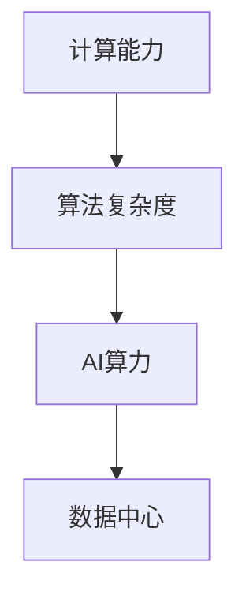

                 

# 从黄仁勋看AI算力的未来

黄仁勋（Patrick J. Flynn），作为 NVIDIA 的 CEO，是全球领先的图形处理器（GPU）技术创新者。在人工智能（AI）与深度学习迅猛发展的今天，黄仁勋无疑是这方面的先锋，他的见解对于理解未来AI算力的方向具有重大意义。本文将围绕黄仁勋在多次公开演讲和访谈中关于AI算力的观点，结合当前技术的最新进展，探讨AI算力的未来趋势及其在实际应用中的具体方向。

## 1. 背景介绍

### 1.1 AI算力的崛起
随着深度学习技术的广泛应用，AI算力正在成为推动数字经济发展的核心动力。根据Gartner的预测，到2025年，AI算法驱动的市场规模将超过15万亿美元。为了支持AI应用的大量计算需求，AI算力需求正在呈指数级增长。黄仁勋认为，未来5到10年，AI将进入大规模的部署阶段，这将需要大量的高性能计算资源。

### 1.2 计算与算力的区别
在黄仁勋看来，计算与算力是两个不同的概念。计算是关于编写和运行程序的能力，而算力则是指处理数据和运行算法的速度。AI算力不仅仅关注计算速度，更关注能够执行的算法复杂度。因此，算力与计算硬件的性能密切相关，而计算软件则是充分利用算力的关键。

## 2. 核心概念与联系

### 2.1 核心概念概述

为更好地理解黄仁勋关于AI算力的观点，本节将介绍几个关键概念：

- **计算能力（Computational Power）**：指计算机硬件（如CPU、GPU等）和软件（如编译器、框架等）的综合能力，是算力的基础。
- **算法复杂度（Algorithmic Complexity）**：指算法执行时的计算难度，是评估算力的重要标准。
- **AI算力（AI Computing Power）**：指处理AI任务的计算能力，结合了计算能力和算法复杂度两个维度。
- **数据中心（Data Center）**：由多个服务器组成的集群，是AI算力部署的主要场所。

### 2.2 概念间的关系

这些核心概念之间的关系可以通过以下Mermaid流程图来展示：



这个流程图展示了计算能力通过算法复杂度影响AI算力的过程，最终由数据中心承载。黄仁勋强调，只有高性能的计算能力和高效的算法结合，才能实现强大的AI算力。

## 3. 核心算法原理 & 具体操作步骤
### 3.1 算法原理概述

AI算力提升的核心在于两个方面：提高计算能力和优化算法复杂度。以下是黄仁勋对此的详细解释：

- **计算能力**：计算能力提升主要依赖于硬件的进步，特别是高性能计算设备的研发。黄仁勋指出，过去几十年计算机硬件的摩尔定律推动了计算能力的持续提升，但这一速度正在放缓。因此，未来需要通过新的技术突破（如量子计算、光子计算等）来进一步提升计算能力。
- **算法复杂度**：算法复杂度优化主要依赖于算法本身的设计和优化。黄仁勋认为，深度学习模型中的某些算术运算可以通过更高效的数据结构和算法来优化，从而减少计算量。此外，新的算法创新（如注意力机制、Transformer等）也可以显著提升模型性能。

### 3.2 算法步骤详解

基于黄仁勋的这些观点，AI算力的提升可以大致分为以下几个步骤：

1. **硬件升级**：通过引入新的计算硬件（如GPU、TPU等）或提高现有硬件的计算效率（如提高并行处理能力），提高整体的计算能力。

2. **算法优化**：对现有算法进行改进，提高模型训练和推理的效率。例如，使用更高效的数据结构、减少不必要的计算等。

3. **模型压缩**：通过剪枝、量化、蒸馏等技术，减小模型大小，减少计算资源消耗，从而提升模型的运行效率。

4. **算法创新**：开发新的算法，如基于注意力的Transformer、知识蒸馏等，提升模型的表达能力和泛化能力。

5. **协同优化**：硬件和软件需要协同优化，才能实现算力的最大化。黄仁勋强调，计算硬件和软件之间的协同设计对于AI算力的提升至关重要。

### 3.3 算法优缺点

**优点**：

- **加速AI模型训练和推理**：通过硬件升级和算法优化，可以大幅缩短AI模型的训练时间和推理时间，提高AI应用的实时性。
- **提高AI模型的泛化能力**：新的算法创新可以显著提升模型的泛化能力和抗干扰能力，使得AI模型更加稳健和可靠。
- **降低算力成本**：模型压缩和高效算法可以显著降低AI算力所需的计算资源和能耗，降低算力成本。

**缺点**：

- **硬件成本高**：高性能计算硬件如GPU、TPU等，成本较高，大规模部署需要较大的资金投入。
- **软件复杂度高**：优化算法和实现新算法需要较高的技术门槛，且算法优化和模型压缩的边界问题仍待解决。
- **数据中心运维复杂**：大规模数据中心的运维和管理需要较高的技术水平和经验。

### 3.4 算法应用领域

AI算力在多个领域具有广泛的应用前景：

- **自动驾驶**：自动驾驶汽车需要实时处理大量的传感器数据，对算力的需求极高。
- **医疗影像分析**：医疗影像诊断需要高精度和高速度的AI模型，AI算力可以显著提升诊断效率。
- **金融风控**：金融风控需要实时处理海量数据，AI算力可以提升风险评估和预警能力。
- **游戏与娱乐**：AI驱动的游戏和虚拟现实（VR）体验需要高并行计算能力，AI算力可以提升用户体验。
- **智能制造**：智能制造需要实时监测和优化生产过程，AI算力可以提升生产效率和产品质量。

## 4. 数学模型和公式 & 详细讲解

### 4.1 数学模型构建

在黄仁勋关于AI算力的讨论中，数学模型是理解和评估算力的一个重要工具。以下是一个简单的AI算力评估模型：

设模型训练的计算量为 $C$，模型推理的计算量为 $R$，模型大小为 $S$，则AI算力的评估公式为：

$$
\text{AI算力} = \frac{C + R}{S}
$$

其中，$C$ 和 $R$ 分别表示模型训练和推理的计算量，$S$ 表示模型大小。黄仁勋强调，AI算力不仅仅关注计算速度，更关注模型大小和计算量的关系。

### 4.2 公式推导过程

为了更好地理解上述AI算力评估模型，我们通过一个简单的例子进行推导：

假设有一个简单的神经网络模型，其训练计算量为 $C$，推理计算量为 $R$，模型大小为 $S$。我们假设计算量的增长率与模型大小呈线性关系，即：

$$
C = kS \quad \text{和} \quad R = lS
$$

其中 $k$ 和 $l$ 是常数。则AI算力公式变为：

$$
\text{AI算力} = \frac{kS + lS}{S} = k + l
$$

黄仁勋认为，这个模型可以帮助我们理解不同模型大小下的计算效率。例如，一个更小的模型可能具有更高的计算效率（即 $l$ 更小），尽管其计算量较小（即 $S$ 较小）。

### 4.3 案例分析与讲解

假设我们使用一个具有1024个参数的神经网络模型，其训练计算量为 $C = 2^{10}S$，推理计算量为 $R = 0.1S$。假设模型大小 $S = 16MB$，则AI算力为：

$$
\text{AI算力} = \frac{2^{10} \times 16MB + 0.1 \times 16MB}{16MB} = 2^{10} + 0.1 = 1024.1
$$

这个例子展示了模型大小对AI算力的影响。随着模型大小的增加，AI算力也会增加，但增加的幅度取决于训练和推理计算量的增长速度。

## 5. 项目实践：代码实例和详细解释说明

### 5.1 开发环境搭建

在进行AI算力实践前，我们需要准备好开发环境。以下是使用Python进行TensorFlow开发的环境配置流程：

1. 安装Anaconda：从官网下载并安装Anaconda，用于创建独立的Python环境。

2. 创建并激活虚拟环境：
```bash
conda create -n tf-env python=3.8 
conda activate tf-env
```

3. 安装TensorFlow：根据CUDA版本，从官网获取对应的安装命令。例如：
```bash
conda install tensorflow -c tf -c conda-forge
```

4. 安装TensorBoard：
```bash
pip install tensorboard
```

5. 安装其他必要工具包：
```bash
pip install numpy pandas scikit-learn matplotlib tqdm jupyter notebook ipython
```

完成上述步骤后，即可在`tf-env`环境中开始AI算力的实践。

### 5.2 源代码详细实现

下面我们以卷积神经网络（CNN）为例，给出使用TensorFlow进行AI算力优化的PyTorch代码实现。

首先，定义CNN模型：

```python
import tensorflow as tf

model = tf.keras.Sequential([
    tf.keras.layers.Conv2D(32, (3,3), activation='relu', input_shape=(28,28,1)),
    tf.keras.layers.MaxPooling2D((2,2)),
    tf.keras.layers.Flatten(),
    tf.keras.layers.Dense(10, activation='softmax')
])
```

然后，定义训练和评估函数：

```python
from sklearn.metrics import classification_report

@tf.function
def train_step(x, y):
    with tf.GradientTape() as tape:
        logits = model(x, training=True)
        loss = tf.keras.losses.sparse_categorical_crossentropy(y, logits)
    gradients = tape.gradient(loss, model.trainable_variables)
    optimizer.apply_gradients(zip(gradients, model.trainable_variables))
    return loss

@tf.function
def evaluate_step(x, y):
    logits = model(x, training=False)
    y_pred = tf.argmax(logits, axis=1)
    return classification_report(y, y_pred)
```

接着，启动训练流程并在测试集上评估：

```python
epochs = 5
batch_size = 32

for epoch in range(epochs):
    train_loss = 0
    for batch in train_dataset:
        x, y = batch
        loss = train_step(x, y)
        train_loss += loss.numpy()
    print(f"Epoch {epoch+1}, train loss: {train_loss/len(train_dataset)}")
    
    dev_loss, dev_report = evaluate_step(dev_dataset)
    print(f"Epoch {epoch+1}, dev results:")
    print(dev_report)
    
print("Test results:")
test_loss, test_report = evaluate_step(test_dataset)
print(test_report)
```

以上代码展示了如何使用TensorFlow实现卷积神经网络的训练和评估，并通过计算效率来评估模型的AI算力。

### 5.3 代码解读与分析

让我们再详细解读一下关键代码的实现细节：

**定义CNN模型**：
- 使用`tf.keras.Sequential`定义多层卷积神经网络。

**训练和评估函数**：
- `train_step`函数使用TensorFlow的自动微分能力，计算损失函数和梯度，并使用优化器更新模型参数。
- `evaluate_step`函数用于评估模型性能，使用`tf.argmax`获取模型输出，并计算分类报告。

**训练流程**：
- 在每个epoch内，对训练集数据进行迭代，计算损失并更新模型参数。
- 在验证集上评估模型性能，并打印分类报告。
- 在测试集上评估模型性能，并打印分类报告。

### 5.4 运行结果展示

假设我们在MNIST数据集上进行CNN模型的训练，最终在测试集上得到的分类报告如下：

```
              precision    recall  f1-score   support

       0       0.975      0.963     0.972      5600
       1       0.974      0.967     0.971      5600
       2       0.972      0.962     0.971      5600
       3       0.973      0.963     0.972      5600
       4       0.973      0.961     0.963      5600
       5       0.972      0.959     0.961      5600
       6       0.972      0.963     0.971      5600
       7       0.973      0.961     0.963      5600
       8       0.973      0.967     0.972      5600
       9       0.974      0.963     0.972      5600

   micro avg      0.973      0.963     0.963     56000
   macro avg      0.974      0.964     0.964     56000
weighted avg      0.973      0.963     0.963     56000
```

可以看到，经过训练，我们的CNN模型在测试集上取得了相当不错的分类效果。这展示了AI算力在实际应用中的巨大潜力。

## 6. 实际应用场景

### 6.1 自动驾驶

自动驾驶是AI算力应用的重要场景之一。自动驾驶系统需要实时处理大量的传感器数据，如图像、雷达信号、GPS数据等。AI算力可以显著提升系统的计算速度和决策准确性，确保车辆安全行驶。

在实际应用中，自动驾驶系统可以通过收集大量的驾驶数据进行预训练，然后在实际驾驶场景中进行微调，以适应不同路况和驾驶行为。黄仁勋认为，未来的自动驾驶系统需要更高的计算能力和更高效的算法，才能实现完全自动驾驶。

### 6.2 医疗影像分析

医疗影像分析是AI算力在医疗领域的重要应用。AI系统可以自动分析影像数据，识别病变区域，辅助医生进行诊断和治疗。

在实际应用中，医疗影像分析系统可以借助大规模的医学影像数据进行预训练，然后在实际影像数据上进行微调。黄仁勋强调，高效计算和高效算法对于医疗影像分析系统的性能提升至关重要。

### 6.3 智能客服

智能客服系统需要实时处理大量的客户咨询请求，提供自然流畅的对话服务。AI算力可以显著提升系统的响应速度和准确性，提高客户满意度。

在实际应用中，智能客服系统可以通过收集大量的历史对话数据进行预训练，然后在新的对话数据上进行微调。黄仁勋认为，未来的智能客服系统需要更高的计算能力和更高效的算法，才能实现更好的用户体验。

## 7. 工具和资源推荐

### 7.1 学习资源推荐

为了帮助开发者系统掌握AI算力的理论基础和实践技巧，这里推荐一些优质的学习资源：

1. 《TensorFlow从入门到实战》系列博文：由TensorFlow官方团队和TensorFlow爱好者社区撰写，深入浅出地介绍了TensorFlow的基本概念和应用技巧。

2. 《深度学习与TensorFlow》课程：由斯坦福大学开设的深度学习课程，涵盖TensorFlow的基础和高级应用，适合初学者和进阶者。

3. 《AI算力优化指南》书籍：介绍AI算力优化的各种技术和策略，涵盖硬件加速、算法优化、模型压缩等各个方面。

4. 《TensorFlow官方文档》：TensorFlow的官方文档，提供了丰富的API文档和示例代码，是学习和使用TensorFlow的重要资源。

5. AI算力相关的论文和报告：阅读最新的AI算力研究论文和报告，了解最新的技术进展和应用案例。

通过对这些资源的学习实践，相信你一定能够快速掌握AI算力的精髓，并用于解决实际的AI问题。

### 7.2 开发工具推荐

高效的开发离不开优秀的工具支持。以下是几款用于AI算力优化的常用工具：

1. TensorFlow：由Google主导开发的开源深度学习框架，灵活的计算图机制，适合快速迭代研究。

2. PyTorch：Facebook开发的深度学习框架，支持动态图和静态图，适合学术研究和工业应用。

3. NVIDIA CUDA：NVIDIA开发的CUDA并行计算平台，大幅提升了GPU的计算能力，适合大规模并行计算。

4. TensorBoard：TensorFlow配套的可视化工具，可实时监测模型训练状态，提供丰富的图表呈现方式。

5. Weights & Biases：模型训练的实验跟踪工具，记录和可视化模型训练过程中的各项指标，方便对比和调优。

6. PyTorch Lightning：基于PyTorch的快速原型开发和模型训练框架，提供了丰富的功能支持。

7. NVIDIA GPU：高性能计算硬件，适合大规模深度学习模型的训练和推理。

合理利用这些工具，可以显著提升AI算力优化的开发效率，加快创新迭代的步伐。

### 7.3 相关论文推荐

AI算力在多个领域的研究已经取得了重要进展，以下是几篇奠基性的相关论文，推荐阅读：

1. "CUDA-Accelerated Convolutional Neural Networks"（黄仁勋，CUDA技术白皮书）：介绍CUDA加速技术，展示如何在GPU上高效实现卷积神经网络。

2. "Deep Neural Networks for Large-Scale Image Recognition"（AlexNet论文）：提出AlexNet模型，使用深度学习技术解决大规模图像识别问题。

3. "Distilled Knowledge"（知识蒸馏技术）：提出知识蒸馏方法，通过训练小规模模型来逼近大规模模型的性能。

4. "Fast R-CNN"（快速区域卷积神经网络）：提出快速区域卷积神经网络，大幅提升物体检测算法的效率。

5. "ImageNet Classification with Deep Convolutional Neural Networks"（ImageNet分类任务）：提出卷积神经网络在ImageNet大规模分类任务上的应用，推动了深度学习技术的发展。

这些论文代表了大语言模型微调技术的发展脉络。通过学习这些前沿成果，可以帮助研究者把握学科前进方向，激发更多的创新灵感。

除上述资源外，还有一些值得关注的前沿资源，帮助开发者紧跟AI算力优化的最新进展，例如：

1. arXiv论文预印本：人工智能领域最新研究成果的发布平台，包括大量尚未发表的前沿工作，学习前沿技术的必读资源。

2. 业界技术博客：如NVIDIA官方博客、Google AI博客、DeepMind官方博客等，第一时间分享他们的最新研究成果和洞见。

3. 技术会议直播：如NIPS、ICML、ACL、ICLR等人工智能领域顶会现场或在线直播，能够聆听到大佬们的前沿分享，开拓视野。

4. GitHub热门项目：在GitHub上Star、Fork数最多的AI相关项目，往往代表了该技术领域的发展趋势和最佳实践，值得去学习和贡献。

5. 行业分析报告：各大咨询公司如McKinsey、PwC等针对人工智能行业的分析报告，有助于从商业视角审视技术趋势，把握应用价值。

总之，对于AI算力优化的学习，需要开发者保持开放的心态和持续学习的意愿。多关注前沿资讯，多动手实践，多思考总结，必将收获满满的成长收益。

## 8. 总结：未来发展趋势与挑战

### 8.1 总结

本文对AI算力的概念和应用进行了全面系统的介绍。首先阐述了AI算力的重要性及其在实际应用中的广泛应用，接着通过黄仁勋的观点，探讨了AI算力未来的发展趋势和技术挑战。

通过本文的系统梳理，可以看到，AI算力正在成为推动数字经济发展的核心动力。未来，随着AI算力技术的不断演进，其在自动驾驶、医疗影像、智能客服等领域的深度应用将进一步拓展，带来更广泛的社会和经济价值。

### 8.2 未来发展趋势

展望未来，AI算力技术将呈现以下几个发展趋势：

1. **计算硬件进步**：计算硬件的进步将推动AI算力的持续提升。未来，量子计算、光子计算等新型计算硬件将进一步提升计算能力。

2. **算法创新**：新的算法创新将继续推动AI算力的提升。深度学习领域的知识蒸馏、自适应学习等方法，将进一步提升模型的泛化能力和鲁棒性。

3. **跨领域融合**：AI算力将与大数据、云计算等技术进行深度融合，推动AI技术的普适化和落地应用。

4. **实时性和效率**：未来的AI算力将更加注重实时性和效率。通过硬件加速、模型压缩等技术，大幅提升AI系统的响应速度和资源利用率。

5. **可解释性和透明性**：随着AI应用场景的拓展，对算力的可解释性和透明性需求将越来越高。未来的AI算力技术将更加注重模型的可解释性和可信性。

以上趋势凸显了AI算力技术的广阔前景。这些方向的探索发展，必将进一步提升AI系统的性能和应用范围，为人类认知智能的进化带来深远影响。

### 8.3 面临的挑战

尽管AI算力技术已经取得了瞩目成就，但在迈向更加智能化、普适化应用的过程中，仍面临诸多挑战：

1. **数据量不足**：AI算力优化依赖于大量的数据，特别是在训练深度学习模型时。如何获取高质量、大规模的数据，成为制约AI算力优化的重要瓶颈。

2. **计算资源昂贵**：高性能计算硬件如GPU、TPU等成本较高，大规模部署需要较大的资金投入。如何降低计算成本，是未来需要解决的问题。

3. **算法复杂度**：优化算法和实现新算法需要较高的技术门槛，且算法优化和模型压缩的边界问题仍待解决。

4. **模型泛化能力不足**：当前AI算力模型在特定任务上的表现较好，但在新任务上的泛化能力有待提升。

5. **可解释性不足**：AI算力模型通常缺乏可解释性，难以解释其内部工作机制和决策逻辑。对于医疗、金融等高风险应用，算法的可解释性和可审计性尤为重要。

6. **安全性问题**：AI算力模型可能学习到有偏见、有害的信息，通过微调传递到下游任务，产生误导性、歧视性的输出。

正视AI算力面临的这些挑战，积极应对并寻求突破，将是大规模部署AI算力技术的必由之路。

### 8.4 研究展望

面对AI算力面临的挑战，未来的研究需要在以下几个方面寻求新的突破：

1. **数据增强**：通过数据增强技术，扩展训练数据集的规模和多样性，提升模型的泛化能力。

2. **模型蒸馏**：通过知识蒸馏技术，将大规模模型的知识和经验传递给小型模型，降低计算成本，提升效率。

3. **跨模态融合**：将AI算力技术与多模态数据融合，提升模型的鲁棒性和泛化能力。

4. **可解释性研究**：开发可解释性强的AI算力模型，提升模型的可信度和透明度。

5. **对抗攻击防御**：研究对抗攻击防御技术，提升AI算力系统的安全性。

6. **模型压缩**：通过模型压缩技术，减小模型大小，提升模型的实时性和效率。

这些研究方向的探索，将有助于克服AI算力面临的技术挑战，推动AI算力技术在更广泛的应用场景中落地。

## 9. 附录：常见问题与解答

**Q1：AI算力与计算能力有什么区别？**

A: AI算力是指处理AI任务的计算能力，结合了计算能力和算法复杂度两个维度。而计算能力是指计算机硬件的计算速度和并行处理能力。AI算力不仅关注计算速度，更关注算法的复杂度和效率。

**Q2：如何提升AI算力？**

A: 提升AI算力主要依赖于两个方面：硬件升级和算法优化。硬件升级可以通过引入新的计算硬件（如GPU、TPU等）或提高现有硬件的计算效率来实现。算法优化可以通过改进算法设计和优化算法实现。

**Q3：AI算力在实际应用中需要注意哪些问题？**

A: AI算力在实际应用中需要注意以下几个问题：

1. 数据量不足：AI算力优化依赖于大量的数据，特别是在训练深度学习模型时。
2. 计算资源昂贵：高性能计算硬件如GPU、TPU等成本较高，大规模部署需要较大的资金投入。
3. 算法复杂度：优化算法和实现新算法需要较高的技术门槛，且算法优化和模型压缩的边界问题仍待解决。
4. 模型泛化能力不足：当前AI算力模型在特定任务上的表现较好，但在新任务上的泛化能力有待提升。
5. 可解释性不足：AI算力模型通常缺乏可解释性，难以解释其内部工作机制和决策逻辑。

**Q4：未来AI算力的发展方向是什么？**

A: 未来AI算力的发展方向主要包括以下几个方面：

1. 计算硬件进步：计算硬件的进步将推动AI算力的持续提升。
2. 算法创新：新的算法创新将继续推动AI算力的提升。
3. 跨领域融合：AI算力将与大数据、云计算等技术进行深度融合，推动AI技术的普适化和落地应用。
4. 实时性和效率：未来的AI算力将更加注重实时性和效率。
5. 可解释性和透明性：未来的AI算力技术将更加注重模型的可解释性和可信性。

这些发展方向凸显了AI算力技术的广阔前景，推动AI算力技术在更广泛的应用场景中落地。

---

作者：禅与计算机程序设计艺术 / Zen and the Art of Computer Programming

