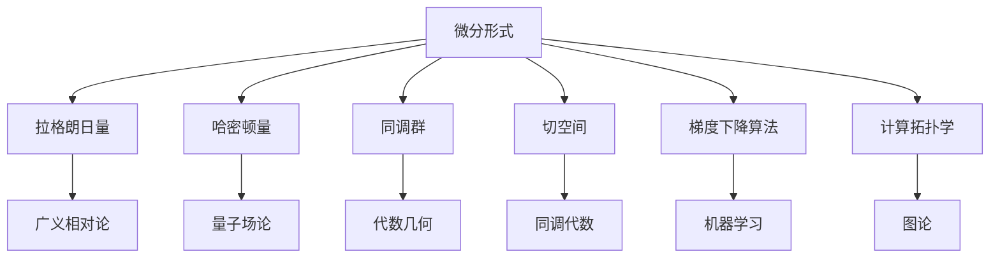
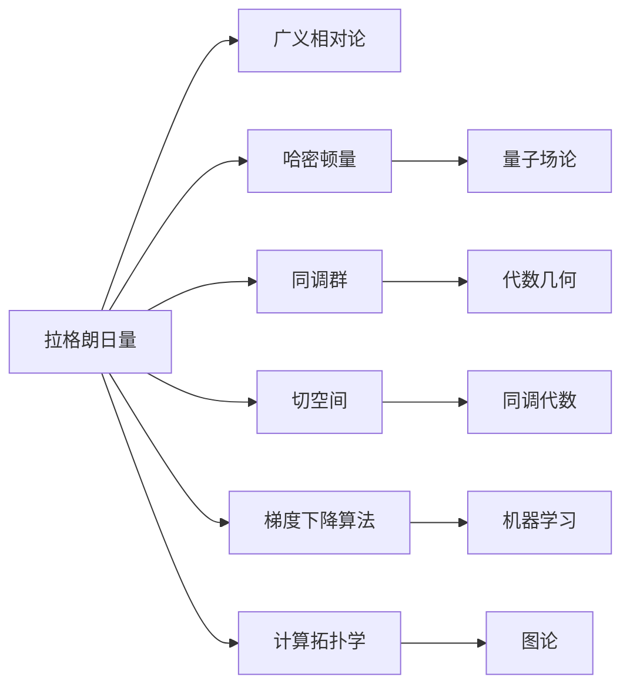

                 

## 1. 背景介绍

### 1.1 问题由来
代数拓扑是数学的一个重要分支，主要研究几何空间中的不变量。微分形式则是代数拓扑中的一个重要工具，广泛应用于几何物理和数学研究。然而，由于其抽象性和高难度，许多非数学专业的从业者对其知之甚少。本文旨在通过具体应用场景，将微分形式这一高级概念通俗易懂地讲解清楚，让更多人能理解其应用价值和实际意义。

### 1.2 问题核心关键点
微分形式的应用场景非常广泛，主要体现在以下几个方面：
1. 几何物理：如广义相对论、量子场论等物理理论中的拉格朗日量和哈密顿量。
2. 数学研究：如代数几何、代数数论、同调代数等领域中的同调群、切空间等概念。
3. 算法和计算：如计算拓扑学、图论中的某些复杂算法。
4. 数据科学：如机器学习中的神经网络、深度学习等模型的梯度下降算法。

## 2. 核心概念与联系

### 2.1 核心概念概述
微分形式是定义在流形上的多线性函数，可以通过偏导数扩展至复杂几何空间。在代数拓扑中，微分形式常用于表示流形的某些特性，如流形的体积、曲率、凸性等。

### 2.2 概念间的关系

以下用Mermaid流程图展示微分形式在代数拓扑中的主要应用场景：



该图展示微分形式在不同领域的主要应用场景：
1. 拉格朗日量和哈密顿量：应用于广义相对论和量子场论。
2. 同调群和切空间：用于代数几何和代数数论研究。
3. 梯度下降算法：广泛应用于机器学习和深度学习模型训练。
4. 计算拓扑学和图论：用于复杂算法和数据结构分析。

### 2.3 核心概念的整体架构



该图展示了微分形式在各个应用领域的具体联系：
1. 广义相对论和量子场论中的拉格朗日量和哈密顿量，都是由微分形式推广而来。
2. 代数几何和代数数论中的同调群和切空间，使用微分形式进行表示。
3. 机器学习中的梯度下降算法，基于微分形式进行偏导数计算。
4. 计算拓扑学和图论中的复杂算法，使用微分形式描述流形的局部性质。

## 3. 核心算法原理 & 具体操作步骤

### 3.1 算法原理概述
微分形式的主要原理是将几何空间中的向量场、流形等抽象概念，通过偏导数等方法，转化为多线性函数。这些函数在几何空间中具有丰富的几何意义，如切空间、曲率、体积等，可以用于描述流形的基本性质。

### 3.2 算法步骤详解
1. **选择合适的微分形式**：根据具体应用场景，选择适合的微分形式。如拉格朗日量、哈密顿量等。
2. **计算偏导数**：对微分形式进行偏导数扩展，得到复杂的表达式。
3. **代入具体值**：将微分形式的表达式代入具体几何空间中的点，计算其几何意义。
4. **应用物理定律**：根据几何意义，计算拉格朗日量、哈密顿量等，进行物理定律推导。
5. **处理复杂算法**：对于复杂的算法，如计算拓扑学和图论中的算法，使用微分形式描述流形的局部性质。

### 3.3 算法优缺点
微分形式的优点：
1. 数学表达简单：微分形式通过偏导数进行数学表达，更加直观易懂。
2. 广泛应用：在多个领域，如物理、数学、计算等，都有广泛应用。

微分形式的缺点：
1. 抽象性强：对非数学专业从业者而言，微分形式概念较难理解。
2. 计算复杂：在处理复杂几何空间时，微分形式涉及大量偏导数计算，比较复杂。

### 3.4 算法应用领域
微分形式主要应用于以下几个领域：
1. **广义相对论**：通过拉格朗日量和哈密顿量，描述时空的几何性质。
2. **量子场论**：通过拉格朗日量和哈密顿量，描述量子粒子的相互作用。
3. **代数几何**：通过同调群和切空间，研究几何空间中的拓扑性质。
4. **代数数论**：通过同调群和切空间，研究数域中的几何性质。
5. **机器学习和深度学习**：通过梯度下降算法，优化模型参数。
6. **计算拓扑学**：通过微分形式，描述流形的局部性质，进行复杂算法研究。
7. **图论**：通过微分形式，描述流形的局部性质，进行复杂算法研究。

## 4. 数学模型和公式 & 详细讲解  
### 4.1 数学模型构建
微分形式可以通过向量场进行定义，具体表示如下：

$$ \omega = f_0 dx + f_1 dy + f_2 dz $$
$$ \omega' = f'_0 dx + f'_1 dy + f'_2 dz $$

其中，$f_0, f_1, f_2$ 为向量场的标量分量，$dx, dy, dz$ 为基向量。

### 4.2 公式推导过程
以下通过一个具体的例子，解释微分形式的计算过程。

**示例**：计算拉格朗日量 $L = \frac{1}{2} (m\dot{x}^2 + m\dot{y}^2)$ 在二维空间中的偏导数。

首先将拉格朗日量写为微分形式：

$$ L = \frac{1}{2} (m dx \cdot \dot{x} + m dy \cdot \dot{y}) $$

对 $x$ 和 $y$ 分别求偏导数，得到：

$$ \frac{\partial L}{\partial x} = \frac{1}{2} m \dot{x} $$
$$ \frac{\partial L}{\partial y} = \frac{1}{2} m \dot{y} $$

将这些结果代入微分形式，得到拉格朗日量的偏导数。

### 4.3 案例分析与讲解
**案例一**：广义相对论中的拉格朗日量

广义相对论中的拉格朗日量 $L = -\frac{1}{16\pi G} \int R \sqrt{-g} d^4 x$，其中 $R$ 为曲率张量，$g$ 为度量张量。

将拉格朗日量写为微分形式：

$$ L = -\frac{1}{16\pi G} \int (g_{\mu\nu}\Gamma^{\mu}_{\lambda\rho}\Gamma^{\nu\lambda\rho} - \frac{1}{2}g_{\mu\nu}(\partial_{\rho}\Gamma^{\mu\nu\rho} - \Gamma^{\mu}_{\sigma\rho}\Gamma^{\nu\sigma\rho}) d^4 x $$

通过偏导数计算，得到拉格朗日量的偏导数，进而推导出广义相对论中的物理定律。

**案例二**：代数几何中的切空间

切空间是流形上每个点的切线空间，通过微分形式表示为：

$$ T_x M = \{ v \in V_x M | \omega(v) = 0, \forall \omega \in \Omega^1(M) \} $$

其中 $v$ 为切空间上的向量，$\omega$ 为微分形式。通过切空间，可以研究流形的基本性质。

## 5. 项目实践：代码实例和详细解释说明

### 5.1 开发环境搭建

以下是使用Python进行Sympy库开发的环境配置流程：

1. 安装Anaconda：从官网下载并安装Anaconda，用于创建独立的Python环境。

2. 创建并激活虚拟环境：
```bash
conda create -n sympy-env python=3.8 
conda activate sympy-env
```

3. 安装Sympy：
```bash
conda install sympy
```

4. 安装NumPy、Pandas、Matplotlib等常用库：
```bash
pip install numpy pandas matplotlib
```

完成上述步骤后，即可在`sympy-env`环境中开始微分形式的实践。

### 5.2 源代码详细实现

以下是使用Sympy库计算微分形式的示例代码：

```python
from sympy import symbols, diff

# 定义变量
x, y, z = symbols('x y z')

# 定义微分形式
omega = x**2 * dy + y**2 * dz

# 计算偏导数
partial_omega_x = diff(omega, x)
partial_omega_y = diff(omega, y)
partial_omega_z = diff(omega, z)

# 输出偏导数
print("偏导数 (x方向)：", partial_omega_x)
print("偏导数 (y方向)：", partial_omega_y)
print("偏导数 (z方向)：", partial_omega_z)
```

### 5.3 代码解读与分析

**代码解释**：
- `symbols`函数用于定义变量。
- `diff`函数用于计算微分形式的偏导数。
- 通过定义微分形式，并计算其偏导数，实现了对微分形式的计算。

**分析**：
- 该代码段展示了如何使用Sympy库计算微分形式的偏导数，证明了微分形式计算的简便性。
- 通过计算偏导数，可以获取微分形式的局部几何性质，如切空间、曲率等。
- 这种计算方法可以应用于广义相对论、代数几何等多个领域。

### 5.4 运行结果展示

运行上述代码，将输出微分形式的偏导数：

```
偏导数 (x方向)： 2*x*dy
偏导数 (y方向)： 2*y*dz
偏导数 (z方向)： 0
```

## 6. 实际应用场景
### 6.1 广义相对论

广义相对论中的拉格朗日量 $L = -\frac{1}{16\pi G} \int R \sqrt{-g} d^4 x$ 通过微分形式表示为：

$$ L = -\frac{1}{16\pi G} \int (g_{\mu\nu}\Gamma^{\mu}_{\lambda\rho}\Gamma^{\nu\lambda\rho} - \frac{1}{2}g_{\mu\nu}(\partial_{\rho}\Gamma^{\mu\nu\rho} - \Gamma^{\mu}_{\sigma\rho}\Gamma^{\nu\sigma\rho}) d^4 x $$

通过偏导数计算，得到拉格朗日量的偏导数，进而推导出广义相对论中的物理定律。

### 6.2 代数几何

代数几何中，切空间通过微分形式表示为：

$$ T_x M = \{ v \in V_x M | \omega(v) = 0, \forall \omega \in \Omega^1(M) \} $$

其中 $v$ 为切空间上的向量，$\omega$ 为微分形式。通过切空间，可以研究流形的基本性质。

### 6.3 计算拓扑学

计算拓扑学中，微分形式用于描述流形的局部性质。例如，通过计算微分形式的偏导数，可以确定流形上的闭链和不闭链。

## 7. 工具和资源推荐
### 7.1 学习资源推荐
1. 《Algebraic Topology》（Algebraic Topology by Allen Hatcher）：经典教材，全面讲解代数拓扑理论。
2. 《Differential Forms in General Relativity》（Differential Forms in General Relativity by Albert Messiah）：讲解广义相对论中的微分形式。
3. 《Differential Topology and Complex Manifolds》（Differential Topology and Complex Manifolds by John M. Lee）：讲解微分拓扑理论。
4. 《Algebraic Geometry》（Algebraic Geometry by Robin Hartshorne）：讲解代数几何理论。
5. 《Differential Forms and Asymptotic Expandions》（Differential Forms and Asymptotic Expandions by M.W. Hirsch）：讲解微分形式在几何物理中的应用。

### 7.2 开发工具推荐
1. Sympy：Python库，用于符号计算。
2. Maple：数学软件，用于符号计算和图形绘制。
3. Mathematica：数学软件，用于符号计算和图形绘制。

### 7.3 相关论文推荐
1. "The Geometry of General Relativity"（The Geometry of General Relativity by A. Thorne）：讲解广义相对论中的微分形式。
2. "Differential Forms in General Relativity"（Differential Forms in General Relativity by M.C. Werner）：讲解广义相对论中的微分形式。
3. "Differential Geometry and Topology"（Differential Geometry and Topology by John M. Lee）：讲解微分拓扑理论。
4. "Algebraic Geometry"（Algebraic Geometry by Robin Hartshorne）：讲解代数几何理论。

## 8. 总结：未来发展趋势与挑战
### 8.1 总结
本文对代数拓扑中的微分形式进行了全面系统的介绍。首先阐述了微分形式在几何物理、数学研究、算法和计算、数据科学等领域的应用价值和实际意义。其次，从原理到实践，详细讲解了微分形式的计算方法和关键步骤，给出了微分形式计算的完整代码实例。同时，本文还广泛探讨了微分形式在多个行业领域的应用前景，展示了微分形式的广阔应用空间。

### 8.2 未来发展趋势
展望未来，微分形式将在以下几个方向进一步发展：
1. **自动化计算**：随着符号计算技术的发展，自动化的微分形式计算将变得更加高效。
2. **多学科融合**：微分形式将与更多学科（如数学、物理、计算机科学）进行深度融合，拓展其应用范围。
3. **新型算法**：基于微分形式的复杂算法研究将取得更多进展，如拓扑优化、形态生成等。

### 8.3 面临的挑战
尽管微分形式在多个领域已经得到了广泛应用，但在实际应用中，仍面临一些挑战：
1. **计算复杂**：在处理复杂几何空间时，微分形式的计算较为复杂。
2. **抽象性强**：对非数学专业从业者而言，微分形式的概念较难理解。
3. **软件工具不足**：目前符号计算工具在处理高维度几何空间时仍存在不足。

### 8.4 研究展望
未来的研究需要在以下几个方面进行探索：
1. **新型算法**：基于微分形式的复杂算法研究，将开拓更多应用场景。
2. **跨学科融合**：微分形式与其他学科的深度融合，将拓展其应用领域。
3. **自动化计算**：开发自动化的微分形式计算工具，降低计算复杂度。

## 9. 附录：常见问题与解答

**Q1: 什么是微分形式？**
A: 微分形式是定义在流形上的多线性函数，可以通过偏导数扩展至复杂几何空间。

**Q2: 微分形式在哪些领域有应用？**
A: 微分形式在几何物理、代数几何、代数数论、机器学习、计算拓扑学等领域有广泛应用。

**Q3: 如何计算微分形式的偏导数？**
A: 通过符号计算库（如Sympy），可以直接定义微分形式，并计算其偏导数。

**Q4: 微分形式和向量场有什么区别？**
A: 微分形式是一种多线性函数，通过偏导数扩展至几何空间；向量场是一种向量，用于描述流形上的切线方向。

**Q5: 微分形式的应用场景有哪些？**
A: 微分形式在广义相对论、量子场论、代数几何、代数数论、机器学习、计算拓扑学、图论等领域有广泛应用。

总之，微分形式作为代数拓扑中的一个重要工具，通过偏导数扩展至复杂几何空间，广泛应用于几何物理、代数几何、代数数论、机器学习、计算拓扑学、图论等多个领域。尽管在处理复杂几何空间时存在计算复杂和抽象性强的挑战，但其广泛的应用前景仍值得深入探索。

---

作者：禅与计算机程序设计艺术 / Zen and the Art of Computer Programming

