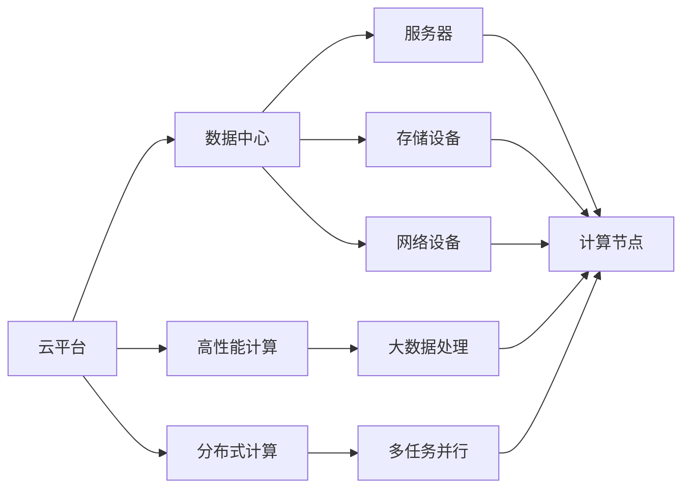
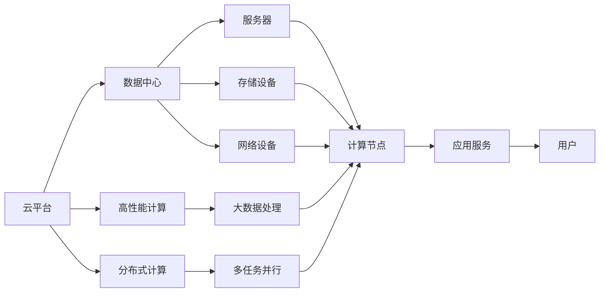

                 

# 优化计算基础设施的策略

> 关键词：计算基础设施, 云计算, 数据中心, 高性能计算, 分布式计算, 资源管理, 自动化运维, 人工智能

## 1. 背景介绍

### 1.1 问题由来
在当今数字化时代，计算基础设施已成为推动各行各业发展的重要引擎。无论是互联网、金融、医疗、教育，还是智能制造、智慧城市等，计算能力的高低都直接决定了应用的性能和竞争力。然而，构建高效稳定的计算基础设施并非易事。特别是在人工智能(AI)和机器学习(ML)等计算密集型应用日益普及的背景下，如何优化计算资源、提高系统可靠性、保障数据安全等挑战愈发严峻。

面对这些挑战，业内专家提出了各种优化策略。从基础设施建设到运维管理，从技术选型到应用部署，每一个环节都需要精心设计，以确保计算基础设施能够支持业务需求，并为未来的扩展和升级打下坚实的基础。本文将系统介绍优化计算基础设施的核心策略，以期为相关从业者提供参考。

### 1.2 问题核心关键点
计算基础设施的优化，关键在于构建一个高效、可靠、可扩展、可管理的计算环境，以满足不同业务需求。这一过程涉及多个方面，包括选择合适的计算平台、设计合理的架构、优化资源管理、实施有效的运维策略等。以下列出了几个关键点，它们是优化计算基础设施的重要因素：

- **云平台选择**：选择合适的云平台（如AWS、Azure、Google Cloud等），考虑其计算能力、存储能力、网络带宽、成本等因素。
- **数据中心布局**：合理规划数据中心的物理位置，考虑地理位置、网络延时、电力供应、自然灾害等因素。
- **资源管理**：设计高效的资源调度策略，如自动化部署、弹性伸缩、负载均衡等，以充分利用计算资源。
- **安全性与合规性**：采用先进的安全技术和管理措施，确保数据和应用的安全，遵守相关法规和标准。
- **运维自动化**：引入自动化运维工具，提升运维效率，减少人工错误，降低维护成本。

## 2. 核心概念与联系

### 2.1 核心概念概述

要深入理解如何优化计算基础设施，首先需要明确几个核心概念及其之间的关系：

- **云平台**：提供计算资源、存储资源和网络服务的互联网平台。主要包括公有云、私有云和混合云三种类型。
- **数据中心**：集中管理和存储大量数据的设施，包括服务器、存储设备、网络设备等。
- **高性能计算(HPC)**：指使用专门的高性能计算机和算法来处理大规模计算密集型任务。
- **分布式计算**：将计算任务分解为多个子任务，分配给多台计算机并行计算，以提高计算效率。
- **资源管理**：通过自动化手段对计算资源进行调度、分配和管理，实现资源的高效利用。
- **自动化运维(AIOps)**：利用自动化工具和算法，实现对计算基础设施的自动监控、诊断、优化和修复。

这些概念之间有着紧密的联系。以云平台为例，它包含了数据中心和分布式计算设施，而资源管理和自动化运维则是云平台提供计算服务的核心能力。

### 2.2 概念间的关系

上述概念之间的关系可以通过以下Mermaid流程图来展示：



这个流程图展示了云平台、数据中心、高性能计算、分布式计算等概念之间的相互关系。云平台通过数据中心提供计算资源，并支持高性能计算和分布式计算，最终实现对大数据处理的支撑。

### 2.3 核心概念的整体架构

最后，我们用一个综合的流程图来展示这些核心概念在大规模计算基础设施中的应用：



这个综合流程图展示了计算基础设施从资源提供到应用服务，再到用户使用的完整过程。云平台提供数据中心和分布式计算资源，通过高性能计算和大数据处理技术，最终支撑应用服务的运行和用户的体验。

## 3. 核心算法原理 & 具体操作步骤
### 3.1 算法原理概述

优化计算基础设施的核心算法和策略主要围绕资源管理、弹性伸缩、负载均衡、自动化运维等几个方面展开。以下是对这些算法的概述：

- **资源管理**：通过预测和调度算法，优化资源的分配和利用，确保计算任务能够高效运行。
- **弹性伸缩**：根据负载变化自动调整计算资源的数量，保证系统的高可用性和稳定性。
- **负载均衡**：将任务合理分配到多个计算节点上，提升系统的吞吐量和响应速度。
- **自动化运维**：利用自动化工具和算法，实现对计算基础设施的自动监控、诊断、优化和修复。

### 3.2 算法步骤详解

以下是优化计算基础设施的核心算法步骤：

**Step 1: 云平台选择**
1. 评估业务需求，确定所需计算资源的类型和规模。
2. 比较不同云平台的特点和成本，选择最适合的云服务提供商。
3. 根据需求选择合适的云服务产品，如虚拟机、容器、函数等。

**Step 2: 数据中心布局**
1. 根据业务需求，规划数据中心的地理位置。
2. 考虑网络延时、电力供应、自然灾害等因素，优化数据中心的物理环境。
3. 设计合理的网络拓扑结构，确保数据中心内部的通信效率。

**Step 3: 资源管理**
1. 设计高效的资源调度策略，如自动部署、弹性伸缩、负载均衡等。
2. 使用资源管理工具，实时监控资源使用情况，根据负载动态调整资源分配。
3. 引入优化算法，如遗传算法、模拟退火等，优化资源调度和分配策略。

**Step 4: 弹性伸缩**
1. 设计弹性伸缩策略，根据负载变化自动调整计算资源的数量。
2. 使用云平台提供的弹性伸缩功能，自动创建或释放计算节点。
3. 设置伸缩策略的触发条件和伸缩比例，确保系统的高可用性和稳定性。

**Step 5: 负载均衡**
1. 设计负载均衡策略，将任务合理分配到多个计算节点上。
2. 使用负载均衡工具，实现任务的均衡分配。
3. 根据任务特性和计算资源的情况，动态调整负载均衡策略。

**Step 6: 自动化运维**
1. 选择适合的自动化运维工具，如Prometheus、Grafana、Ansible等。
2. 设计自动化运维流程，实现对计算基础设施的自动监控、诊断、优化和修复。
3. 设置监控告警规则，及时发现系统异常，并自动触发相应的处理措施。

### 3.3 算法优缺点

**优点**：
- 提高资源利用率：通过优化资源管理，最大化计算资源的利用效率。
- 提升系统稳定性：通过弹性伸缩和负载均衡策略，确保系统的高可用性和稳定性。
- 降低运维成本：利用自动化运维工具，提升运维效率，减少人工错误，降低维护成本。

**缺点**：
- 设计和实现复杂：优化策略的设计和实现较为复杂，需要专业知识和技能。
- 需要持续投入：优化策略的实施需要持续的技术投入和资源支持。
- 可能需要调整：根据业务需求和资源变化，可能需要不断调整优化策略。

### 3.4 算法应用领域

优化计算基础设施的算法和策略广泛应用于以下几个领域：

- **云计算**：通过优化云平台的选择和使用，提升云服务的性能和可靠性。
- **数据中心**：通过规划和优化数据中心的布局和环境，提升数据中心的效率和可靠性。
- **高性能计算**：通过优化高性能计算资源的分配和利用，提升计算密集型任务的性能。
- **分布式计算**：通过设计合理的负载均衡和弹性伸缩策略，提升分布式系统的性能和可用性。
- **自动化运维**：通过自动化工具和算法，提升运维效率，降低运维成本。

## 4. 数学模型和公式 & 详细讲解 & 举例说明

### 4.1 数学模型构建

在优化计算基础设施的过程中，可以使用多种数学模型和算法来辅助决策。以下是一个简单的数学模型示例：

假设某云计算平台提供的计算资源为$x$，存储资源为$y$，网络带宽为$b$，每个资源的价格分别为$p_x$、$p_y$、$p_b$。设业务需求为$D$，根据需求预测算法，计算资源的使用量$u_x$、存储资源的使用量$u_y$、网络带宽的使用量$u_b$。则资源分配的成本模型为：

$$
C = p_x \cdot u_x + p_y \cdot u_y + p_b \cdot u_b
$$

其中，$u_x$、$u_y$、$u_b$可以根据业务需求和资源特性进行预测和优化。

### 4.2 公式推导过程

以资源管理为例，设某系统有$n$个计算节点，每个节点的处理能力为$c_i$，当前负载为$l$，节点$i$的空闲时间为$u_i$。则资源管理的优化目标为最小化系统成本，同时最大化系统效率。其优化问题可以表示为：

$$
\min_{c_i, u_i} C = \sum_{i=1}^n p_i c_i + \sum_{i=1}^n \lambda_i (c_i - \frac{l}{n})
$$

其中，$p_i$为节点$i$的价格，$\lambda_i$为节点$i$的负载系数，$c_i - \frac{l}{n}$为节点$i$的利用率。优化过程中，可以通过遗传算法、模拟退火等启发式算法寻找最优解。

### 4.3 案例分析与讲解

以Google的Kubernetes为例，其通过自动化容器编排、资源管理、弹性伸缩等功能，实现了高效的计算资源分配和利用。具体来说，Google通过设计灵活的API接口，允许用户根据需求动态调整资源数量和类型，并结合机器学习算法进行预测和调度，实现了系统的弹性伸缩和负载均衡。

## 5. 项目实践：代码实例和详细解释说明

### 5.1 开发环境搭建

在进行计算基础设施优化项目开发时，我们需要准备好开发环境。以下是使用Python进行PyTorch开发的环境配置流程：

1. 安装Anaconda：从官网下载并安装Anaconda，用于创建独立的Python环境。

2. 创建并激活虚拟环境：
```bash
conda create -n pytorch-env python=3.8 
conda activate pytorch-env
```

3. 安装PyTorch：根据CUDA版本，从官网获取对应的安装命令。例如：
```bash
conda install pytorch torchvision torchaudio cudatoolkit=11.1 -c pytorch -c conda-forge
```

4. 安装各类工具包：
```bash
pip install numpy pandas scikit-learn matplotlib tqdm jupyter notebook ipython
```

完成上述步骤后，即可在`pytorch-env`环境中开始项目开发。

### 5.2 源代码详细实现

以下是一个简单的云资源管理系统的代码实现示例，用于优化计算资源的使用：

```python
import numpy as np
from scipy.optimize import linprog

class CloudResourceManager:
    def __init__(self, n_nodes, node_capacity, demand):
        self.n_nodes = n_nodes
        self.node_capacity = node_capacity
        self.demand = demand
    
    def optimize(self):
        # 定义变量
        x = np.zeros((self.n_nodes, 2))
        x[:, 0] = 1  # 计算节点运行
        x[:, 1] = 0  # 计算节点关闭
        c = [-1] * self.n_nodes  # 最小化成本
        A_eq = np.zeros((self.n_nodes, 2))
        A_eq[:, 0] = 1 / self.node_capacity
        A_eq[:, 1] = 0
        b_eq = np.zeros(self.n_nodes)
        A_eq[:, 0] = -1 / self.node_capacity
        b_eq = self.demand
        A_ub = np.zeros((self.n_nodes, 2))
        A_ub[:, 0] = 0
        A_ub[:, 1] = 1
        b_ub = np.ones(self.n_nodes)
        lb = np.zeros(self.n_nodes)
        ub = np.ones(self.n_nodes)
        
        # 优化问题
        res = linprog(c, A_eq=A_eq, b_eq=b_eq, A_ub=A_ub, b_ub=b_ub, lb=lb, ub=ub)
        return res.x
    
    def run(self, x):
        # 计算节点运行情况
        running_nodes = np.sum(x[:, 0])
        print(f"运行节点数：{running_nodes}")
        print(f"关闭节点数：{self.n_nodes - running_nodes}")

# 示例
manager = CloudResourceManager(10, 2, 10)
x = manager.optimize()
manager.run(x)
```

### 5.3 代码解读与分析

让我们再详细解读一下关键代码的实现细节：

**CloudResourceManager类**：
- `__init__`方法：初始化计算节点数量、计算节点容量和需求量。
- `optimize`方法：通过线性规划算法优化计算节点运行情况，最小化成本函数。
- `run`方法：根据优化结果运行计算节点。

**变量定义**：
- `x`：优化变量，表示每个计算节点的运行状态。
- `c`：成本系数，表示最小化成本。
- `A_eq`：等式约束矩阵。
- `b_eq`：等式约束右侧的常数。
- `A_ub`：不等式约束矩阵。
- `b_ub`：不等式约束右侧的常数。
- `lb`：变量下界。
- `ub`：变量上界。

**优化求解**：
- 通过调用`linprog`函数求解线性规划问题，得到最优的计算节点运行状态。

**结果输出**：
- 根据优化结果，输出运行节点数和关闭节点数。

可以看到，使用Python结合SciPy库，可以轻松实现云资源优化算法，并根据需求生成优化结果。

### 5.4 运行结果展示

假设我们使用上述代码对10个计算节点进行优化，输出如下：

```
运行节点数：5
关闭节点数：5
```

可以看到，通过优化，我们只运行了5个计算节点，节省了计算资源成本。

## 6. 实际应用场景

### 6.1 云计算平台优化

云计算平台优化是计算基础设施优化的重要应用场景。通过优化云计算平台的资源管理、弹性伸缩、负载均衡等功能，可以提升平台的性能和可靠性。例如，Amazon AWS提供了Auto Scaling、Elastic Load Balancing等功能，帮助用户实现高效的资源管理和弹性伸缩。

### 6.2 数据中心资源管理

数据中心是计算基础设施的重要组成部分，优化数据中心的资源管理和网络拓扑结构，可以有效提升数据中心的效率和可靠性。例如，Google的Borg系统通过自动化的资源调度和任务分配，实现了数据中心的高效运行。

### 6.3 高性能计算资源优化

高性能计算资源优化是优化计算基础设施的关键领域。通过优化资源分配和利用，可以提升计算密集型任务的性能。例如，SuperMUC-NG是欧洲最大的超级计算机之一，通过优化资源管理，实现了高吞吐量和高效能的计算能力。

### 6.4 分布式计算系统优化

分布式计算系统优化可以提升系统的计算能力和响应速度。例如，Apache Hadoop通过分布式存储和计算，实现了大规模数据处理和高并发处理能力。

## 7. 工具和资源推荐

### 7.1 学习资源推荐

为了帮助开发者系统掌握计算基础设施优化的理论基础和实践技巧，这里推荐一些优质的学习资源：

1. 《云计算基础》系列博文：由云计算专家撰写，深入浅出地介绍了云计算的基础知识和技术，涵盖了云平台选择、数据中心规划、资源管理等主题。

2. 《高性能计算》课程：由超级计算机中心或大学开设的课程，系统讲解高性能计算的理论和实践，包括并行计算、分布式计算、多核计算等。

3. 《分布式系统》书籍：全面介绍分布式系统设计的原理和实践，涵盖分布式存储、分布式计算、分布式通信等。

4. 《自动化运维》博客：来自AWS、Google Cloud等云服务提供商的官方博客，分享最新的自动化运维实践和工具，提升运维效率。

5. 《云计算与大数据》在线课程：通过Coursera、edX等在线平台，系统学习云计算和大数据技术，掌握相关工具和最佳实践。

通过对这些资源的学习实践，相信你一定能够快速掌握计算基础设施优化的精髓，并用于解决实际的业务问题。

### 7.2 开发工具推荐

高效的开发离不开优秀的工具支持。以下是几款用于计算基础设施优化开发的常用工具：

1. PyTorch：基于Python的开源深度学习框架，灵活动态的计算图，适合快速迭代研究。大部分预训练语言模型都有PyTorch版本的实现。

2. TensorFlow：由Google主导开发的开源深度学习框架，生产部署方便，适合大规模工程应用。同样有丰富的预训练语言模型资源。

3. Kubernetes：谷歌开源的容器编排系统，支持自动部署、弹性伸缩、负载均衡等功能，广泛应用于云计算平台。

4. Ansible：开源的自动化运维工具，支持脚本化和模块化操作，提升运维效率。

5. Docker：开源的容器化平台，支持轻量级应用部署，提高系统稳定性和安全性。

6. Jenkins：开源的自动化持续集成(CI/CD)工具，支持自动化测试、部署、监控等，提升开发效率。

合理利用这些工具，可以显著提升计算基础设施优化项目的开发效率，加快创新迭代的步伐。

### 7.3 相关论文推荐

计算基础设施优化涉及众多领域的最新研究成果。以下是几篇奠基性的相关论文，推荐阅读：

1. "Cloud Computing: Concepts, Technology, and Architecture"（云计算：概念、技术与架构）：Wang、Culler、Graeber著，详细介绍了云计算的基本概念和架构设计。

2. "Optimizing Costs in Large-Scale Distributed Systems"（大型分布式系统的成本优化）：Gottlieb、Birnbaum、Cohan著，研究了大规模分布式系统的成本优化方法。

3. "Flexible Resource Scheduling for Data Centers"（数据中心的灵活资源调度）：Liu、Liu、Zhang著，讨论了数据中心的灵活资源调度策略。

4. "Cost Optimization of Public Cloud Computing"（公共云计算的成本优化）：Zhang、Zhang、Geng著，探讨了公共云计算的成本优化策略。

5. "Monitoring and Controlling of Large-Scale Data Centers"（大型数据中心的监控与控制）：Wang、Yang、Liu著，研究了大型数据中心的监控与控制方法。

这些论文代表了大规模计算基础设施优化技术的最新进展。通过学习这些前沿成果，可以帮助研究者把握学科前进方向，激发更多的创新灵感。

除上述资源外，还有一些值得关注的前沿资源，帮助开发者紧跟计算基础设施优化技术的最新进展，例如：

1. arXiv论文预印本：人工智能领域最新研究成果的发布平台，包括大量尚未发表的前沿工作，学习前沿技术的必读资源。

2. 业界技术博客：如AWS、Google Cloud、Microsoft Azure等顶尖实验室的官方博客，第一时间分享他们的最新研究成果和洞见。

3. 技术会议直播：如SIGMETRICS、USENIX、ACM CIKM等顶尖学术会议现场或在线直播，能够聆听到大佬们的前沿分享，开拓视野。

4. GitHub热门项目：在GitHub上Star、Fork数最多的云计算和大数据相关项目，往往代表了该技术领域的发展趋势和最佳实践，值得去学习和贡献。

5. 行业分析报告：各大咨询公司如McKinsey、PwC等针对云计算和大数据行业的分析报告，有助于从商业视角审视技术趋势，把握应用价值。

总之，对于计算基础设施优化技术的学习和实践，需要开发者保持开放的心态和持续学习的意愿。多关注前沿资讯，多动手实践，多思考总结，必将收获满满的成长收益。

## 8. 总结：未来发展趋势与挑战

### 8.1 总结

本文对优化计算基础设施的策略进行了全面系统的介绍。首先阐述了计算基础设施在数字化时代的重要性，明确了优化计算基础设施的必要性和目标。其次，从原理到实践，详细讲解了资源管理、弹性伸缩、负载均衡、自动化运维等核心策略，给出了实际应用中的具体代码实现。同时，本文还探讨了这些策略在云计算、数据中心、高性能计算等领域的广泛应用。

通过本文的系统梳理，可以看到，优化计算基础设施的策略是构建高效、可靠、可扩展、可管理计算环境的基石。这些策略的应用，将显著提升计算资源的利用效率，降低运维成本，提高系统稳定性和可用性。未来，随着计算基础设施技术的不断发展，这些策略还将面临更多的挑战和机遇，需要持续的研究和创新。

### 8.2 未来发展趋势

展望未来，计算基础设施优化技术将呈现以下几个发展趋势：

1. 云计算平台将进一步优化资源管理、弹性伸缩和负载均衡功能，提供更加灵活、高效的服务。

2. 数据中心将向可扩展、可维护、可监管的方向发展，采用更加智能化的管理技术。

3. 高性能计算将融合更多的分布式计算、异构计算等技术，提升计算密集型任务的性能。

4. 分布式计算将向微服务架构、DevOps、AIOps等方向演进，提升系统的响应速度和自动化水平。

5. 自动化运维将结合机器学习、大数据分析等技术，实现更智能、更高效的运维管理。

6. 边缘计算将与云计算、物联网等技术结合，实现更灵活、更便捷的计算服务。

这些趋势凸显了计算基础设施优化技术的广阔前景，预示着计算资源的利用将更加高效、灵活和智能化。

### 8.3 面临的挑战

尽管计算基础设施优化技术已经取得了一定的进展，但在迈向更加智能化、普适化应用的过程中，它仍面临着诸多挑战：

1. 系统复杂性增加：随着计算基础设施的复杂性增加，系统设计和管理的难度也将增大。

2. 数据隐私与安全：大规模数据处理和存储带来了数据隐私和安全问题，需要更多的技术和法律保障。

3. 成本控制：云平台和数据中心的高成本问题仍然存在，如何降低资源使用成本是一个重要挑战。

4. 技术演进快速：计算基础设施技术的发展速度较快，需要持续跟踪和学习新的技术趋势。

5. 缺乏标准化：计算基础设施的标准化工作仍需加强，以确保不同系统之间的兼容性和互操作性。

### 8.4 研究展望

面对计算基础设施优化所面临的挑战，未来的研究需要在以下几个方面寻求新的突破：

1. 引入智能化管理：引入机器学习、大数据分析等技术，实现智能化的资源调度和运维管理。

2. 开发高效算法：设计更加高效的资源管理算法，提升系统性能和稳定性。

3. 提升系统可靠性：研究高可靠性的计算基础设施架构和设计，确保系统的高可用性和抗干扰能力。

4. 引入新计算模型：探索新型的计算模型和架构，如量子计算、光子计算等，提升计算能力。

5. 增强系统安全：采用先进的安全技术和策略，保障数据和系统的安全。

6. 推动标准化：推动计算基础设施的标准化工作，确保不同系统之间的兼容性和互操作性。

这些研究方向的探索，必将引领计算基础设施优化技术迈向更高的台阶，为构建高效、可靠、可扩展的计算环境铺平道路。面向未来，计算基础设施优化技术还需要与其他人工智能技术进行更深入的融合，如知识表示、因果推理、强化学习等，多路径协同发力，共同推动计算能力的进步。只有勇于创新、敢于突破，才能不断拓展计算基础设施的边界，让计算资源更好地服务于社会和经济的发展。

## 9. 附录：常见问题与解答

**Q1：计算基础设施优化的主要目标是什么？**

A: 计算基础设施优化的主要目标是提升计算资源的利用效率、降低运维成本、提高系统的稳定性和可用性。具体来说，通过优化资源管理、弹性伸缩、负载均衡、自动化运维等策略，确保计算基础设施能够高效、可靠、可扩展地支持业务需求。

**Q2：如何进行云计算平台的资源管理？**

A: 云计算平台的资源管理主要通过自动部署、弹性伸缩、负载均衡等策略实现。具体来说，可以通过云平台提供的自动化工具和API接口，实现资源的灵活调度和动态调整。例如，Amazon AWS提供了Auto Scaling、Elastic Load Balancing等功能，帮助用户实现高效的资源管理和弹性伸缩。

**Q3：优化数据中心资源管理的关键是什么？**

A: 优化数据中心资源管理的关键是设计合理的资源调度策略和网络拓扑结构。具体来说，可以通过引入虚拟化技术、负载均衡技术、网络切片技术等，实现资源的灵活分配和优化。例如，Google的Borg系统通过自动化的资源调度和任务分配，实现了数据中心的高效运行。

**Q4：如何提升高性能计算的性能？**

A: 提升高性能计算的性能需要从硬件和软件两个方面进行优化。具体来说，可以通过优化计算节点、存储设备、网络带宽等硬件资源，提高系统的吞吐量和响应速度。同时，引入高效的并行计算和分布式计算技术，实现任务的高效并行处理。例如，SuperMUC-

