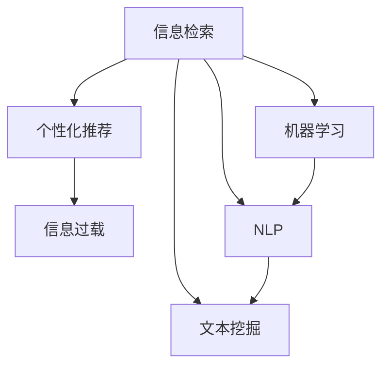
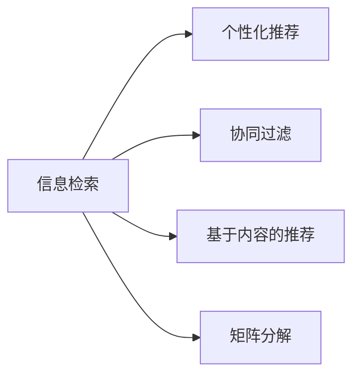
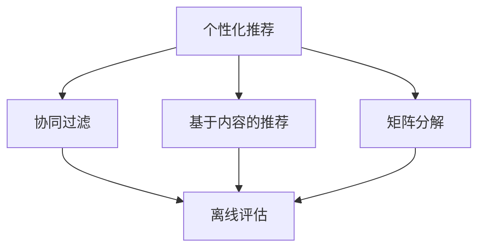
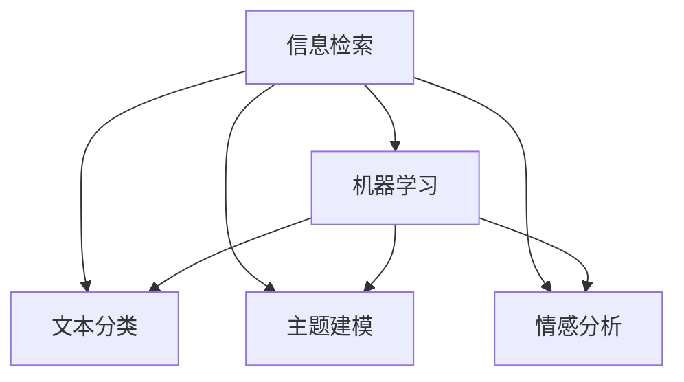
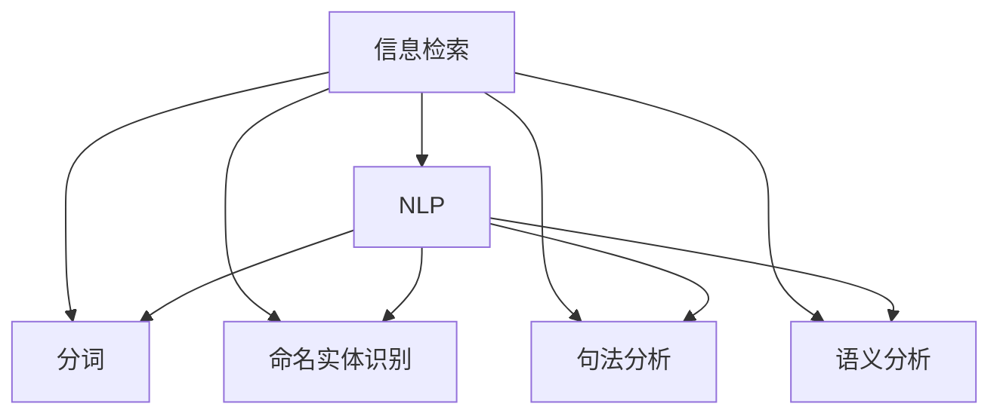
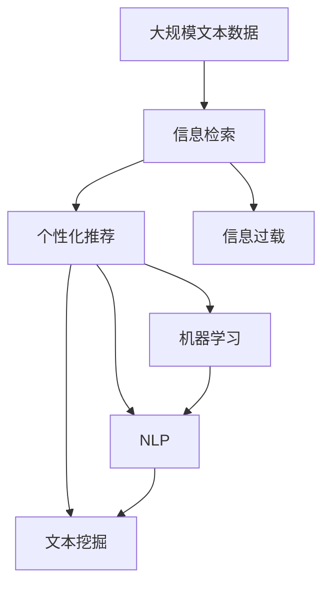

                 

# 信息过载与信息搜索策略：在庞大的信息海洋中找到有价值的信息

> 关键词：信息过载,信息检索,机器学习,自然语言处理,文本挖掘,推荐系统

## 1. 背景介绍

### 1.1 问题由来
随着互联网技术的快速发展，信息获取变得越来越容易，社交媒体、新闻门户、在线论坛等平台为我们提供了海量的信息资源。然而，信息的爆炸式增长也带来了严重的信息过载问题。据统计，全球互联网用户每天产生的数据量已超过500PB，且这一数字还在以指数级增长。面对如此海量的信息，如何快速准确地找到有价值的信息，成为当今社会亟待解决的问题。

信息过载不仅影响了我们日常生活和工作的效率，还可能导致认知过载、注意力分散等问题，严重影响我们的决策和判断。如何在大数据时代有效利用信息，成为信息检索、信息管理和推荐系统等领域的核心挑战。

### 1.2 问题核心关键点
信息过载的核心在于：信息量远超人类处理能力，需要借助机器和算法来辅助我们高效利用信息。因此，信息检索、信息过滤、个性化推荐等技术应运而生，旨在从海量信息中提取出用户感兴趣、有用的内容。

其中，信息检索是信息过载问题解决的基础，其目标是快速准确地从大量无序信息中检索出用户所需的信息。个性化推荐技术则进一步提升检索结果的相关性，通过分析用户历史行为和偏好，精准推送与用户需求匹配的信息，从而提高用户体验和满意度。

### 1.3 问题研究意义
研究信息检索和推荐技术，对于提升信息利用效率、缓解信息过载问题、改善用户体验等方面具有重要意义：

1. 提高工作效率：通过高效的信息检索和推荐，用户可以快速获取所需信息，减少信息查找时间，提升工作效率。
2. 缓解认知过载：个性化推荐能够主动筛选出用户感兴趣的信息，减轻认知负担，避免信息过载。
3. 增强用户体验：通过推荐系统，用户能够获得更具个性化和针对性的信息，提升整体满意度。
4. 推动信息科技应用：信息检索和推荐技术是人工智能和信息科技的重要组成部分，其发展和应用有助于推动相关领域的科技进步。
5. 促进社会进步：信息检索和推荐系统在政府、医疗、教育、商业等诸多领域的应用，有助于促进社会的整体进步和治理水平。

## 2. 核心概念与联系

### 2.1 核心概念概述

为更好地理解信息检索和推荐技术，本节将介绍几个关键概念及其之间的联系：

- 信息检索(Information Retrieval, IR)：指从大量信息源中查找与用户查询相关的信息。常见的信息检索模型包括基于关键词的检索、向量空间模型、隐式语义分析等。
- 个性化推荐(Personalized Recommendation)：指通过分析用户的历史行为和偏好，为用户推荐个性化的信息。常见的推荐算法包括协同过滤、基于内容的推荐、矩阵分解等。
- 信息过载(Information Overload)：指信息量超过个体或系统处理能力的现象。信息过载问题亟需有效的信息检索和推荐技术来解决。
- 机器学习(Machine Learning)：指利用算法和模型，通过大量数据学习规律，进行预测、分类等任务。信息检索和推荐系统中广泛应用机器学习技术，如模型训练、特征提取等。
- 自然语言处理(Natural Language Processing, NLP)：指使用计算机处理和理解自然语言的技术。在信息检索和推荐中，NLP技术用于处理用户查询、文本数据等，是信息检索和推荐的基础。
- 文本挖掘(Text Mining)：指从文本数据中提取有价值信息的过程。包括文本分类、主题建模、情感分析等任务，对信息检索和推荐有重要支撑作用。

这些概念之间的联系可以通过以下Mermaid流程图来展示：



这个流程图展示了信息检索、个性化推荐与信息过载的关系，以及它们与机器学习、NLP、文本挖掘等技术之间的联系。

### 2.2 概念间的关系

这些核心概念之间存在着紧密的联系，形成了信息检索和推荐技术的完整生态系统。下面我们通过几个Mermaid流程图来展示这些概念之间的关系。

#### 2.2.1 信息检索与推荐的关系



这个流程图展示了信息检索和个性化推荐的基本流程，以及常用的推荐算法。信息检索的结果通过推荐算法进行进一步优化，提升推荐的相关性和准确性。

#### 2.2.2 推荐算法的选择



这个流程图展示了个性化推荐中推荐算法的选择和优化。不同的推荐算法适用于不同的应用场景，选择合适的算法可以提升推荐效果。

#### 2.2.3 信息检索中的机器学习



这个流程图展示了信息检索中机器学习的应用。机器学习用于文本分类、主题建模、情感分析等任务，提升了信息检索的准确性和效果。

#### 2.2.4 NLP在信息检索中的作用



这个流程图展示了NLP在信息检索中的应用。NLP技术用于分词、命名实体识别、句法分析、语义分析等任务，是信息检索的基础。

### 2.3 核心概念的整体架构

最后，我们用一个综合的流程图来展示这些核心概念在信息检索和推荐技术中的整体架构：



这个综合流程图展示了从大规模文本数据到信息检索、个性化推荐和信息过载的完整流程。信息检索和推荐技术在此过程中不断优化，提高了用户的信息利用效率。

## 3. 核心算法原理 & 具体操作步骤
### 3.1 算法原理概述

信息检索和推荐技术，本质上是通过机器学习模型和大规模数据分析，提取和匹配用户与信息之间的相关性。其核心思想是：利用已有的数据和模型，预测未来行为和需求，从而提供个性化的信息服务。

形式化地，假设用户集合为 $U$，信息集合为 $I$，用户与信息之间的交互矩阵为 $R \in \mathbb{R}^{N \times M}$，其中 $N$ 为用户数，$M$ 为信息数。信息检索和推荐的目标是预测用户 $u \in U$ 对信息 $i \in I$ 的评分 $r_{ui}$。

常见的预测模型包括矩阵分解、协同过滤、基于内容的推荐、深度学习模型等。通过模型训练，可以学习到用户和信息的潜在特征表示，从而预测用户对信息的评分和兴趣。

### 3.2 算法步骤详解

信息检索和推荐技术的一般流程包括：

1. 数据预处理：对原始数据进行清洗、归一化、特征提取等预处理操作。
2. 模型训练：选择合适的机器学习模型，使用标注数据对模型进行训练。
3. 用户交互：用户通过查询或浏览行为，与系统进行交互。
4. 结果反馈：系统根据用户交互行为进行推荐或检索。
5. 持续优化：根据用户反馈和实际效果，对模型进行优化和迭代。

具体步骤如下：

**Step 1: 数据预处理**
- 收集和清洗用户与信息的交互数据，构建用户-信息评分矩阵 $R$。
- 对用户和信息进行特征提取，得到用户特征向量 $U$ 和信息特征向量 $V$。
- 对评分矩阵 $R$ 进行归一化处理，如将评分缩放到 $[0,1]$ 区间。

**Step 2: 模型训练**
- 选择合适的预测模型，如矩阵分解、协同过滤等。
- 使用用户特征向量 $U$ 和信息特征向量 $V$，对模型进行训练，学习用户和信息的潜在特征表示。
- 在训练过程中，可以引入正则化、交叉验证等技术，防止过拟合。

**Step 3: 用户交互**
- 用户输入查询或浏览行为，系统根据用户历史行为和评分预测模型，推荐或检索相关信息。
- 根据用户的反馈（如点击、评分等），系统更新用户特征向量 $U$。

**Step 4: 结果反馈**
- 系统根据用户反馈，调整推荐策略，优化推荐结果。
- 系统根据用户反馈，调整检索策略，优化检索结果。

**Step 5: 持续优化**
- 定期使用新的数据对模型进行重新训练，以提高模型的准确性和泛化能力。
- 引入在线学习算法，如梯度下降、在线交替最小二乘等，实现模型的实时优化。

### 3.3 算法优缺点

信息检索和推荐技术具有以下优点：
1. 高效性：通过机器学习和数据分析，可以快速准确地匹配用户与信息之间的关系。
2. 个性化：通过分析用户历史行为和偏好，提供个性化的信息服务。
3. 可扩展性：模型可以应用于各种规模的数据集，具有良好的可扩展性。
4. 实时性：通过在线学习算法，可以实现实时的推荐和检索，满足用户即时需求。

同时，这些技术也存在一些缺点：
1. 数据需求高：需要大量的标注数据和用户行为数据，数据获取成本较高。
2. 复杂性高：模型训练和优化过程较为复杂，需要较高的技术水平。
3. 可解释性差：推荐结果缺乏解释，难以解释用户为什么被推荐某种信息。
4. 鲁棒性差：对数据分布的变化和噪声敏感，可能出现模型偏差。

### 3.4 算法应用领域

信息检索和推荐技术广泛应用于各种信息服务场景，包括但不限于以下领域：

- 电子商务：推荐系统用于推荐商品，提升用户体验和购买转化率。
- 新闻门户：信息检索系统用于快速获取和展示新闻信息，帮助用户筛选有价值的内容。
- 社交媒体：推荐系统用于推荐用户感兴趣的内容，提升平台黏性和用户满意度。
- 金融服务：推荐系统用于推荐股票、基金等金融产品，帮助用户做出投资决策。
- 医疗健康：信息检索系统用于快速获取医疗信息，推荐系统用于个性化健康建议。
- 教育培训：推荐系统用于推荐课程和学习资源，提升学习效果。
- 娱乐媒体：信息检索系统用于获取媒体资源，推荐系统用于个性化内容推荐，提升用户满意度。

此外，信息检索和推荐技术还在科学研究、政府治理等领域得到广泛应用，极大地提升了信息利用效率和治理水平。

## 4. 数学模型和公式 & 详细讲解
### 4.1 数学模型构建

信息检索和推荐技术的数学模型，主要涉及矩阵分解、协同过滤、深度学习模型等。这里以矩阵分解模型为例，介绍信息检索和推荐的基本数学模型。

假设用户与信息的评分矩阵为 $R \in \mathbb{R}^{N \times M}$，用户特征向量为 $U \in \mathbb{R}^{N \times d}$，信息特征向量为 $V \in \mathbb{R}^{M \times d}$。矩阵分解模型将用户和信息的评分表示为：

$$
R \approx \hat{R} = U V^T
$$

其中，$\hat{R}$ 为预测评分矩阵，$U$ 和 $V$ 为潜在特征矩阵。

### 4.2 公式推导过程

以矩阵分解模型为例，推导用户 $u$ 对信息 $i$ 的评分预测公式：

$$
\hat{r}_{ui} = u_i^T v_j = \sum_{k=1}^{d} u_{ik} v_{jk}
$$

其中，$u_i$ 为用户 $u$ 在特征 $k$ 上的值，$v_j$ 为信息 $i$ 在特征 $j$ 上的值。

在实际应用中，通常需要引入正则化项和损失函数，如：

$$
\mathcal{L} = \frac{1}{2} \sum_{i=1}^{M} \sum_{j=1}^{N} (r_{ij} - \hat{r}_{ij})^2 + \lambda (\|U\|_F^2 + \|V\|_F^2)
$$

其中，$\|U\|_F$ 和 $\|V\|_F$ 分别为矩阵 $U$ 和 $V$ 的 Frobenius 范数，$\lambda$ 为正则化系数。

### 4.3 案例分析与讲解

以Netflix推荐系统为例，介绍矩阵分解模型在实际推荐中的应用。Netflix推荐系统通过矩阵分解模型，对用户和电影的评分进行预测，并基于预测评分进行推荐。

Netflix推荐系统的主要步骤包括：

1. 数据收集：收集用户观看电影的历史数据，构建用户-电影评分矩阵。
2. 特征提取：对用户和电影进行特征提取，构建用户特征矩阵和电影特征矩阵。
3. 模型训练：使用矩阵分解模型对评分矩阵进行训练，学习用户和电影的潜在特征表示。
4. 推荐生成：根据训练好的模型，生成用户对未观看电影的评分预测，推荐评分较高的电影。
5. 用户反馈：根据用户反馈，更新评分矩阵和模型参数。

Netflix推荐系统的成功，充分展示了矩阵分解模型在推荐系统中的应用效果，成为信息推荐技术的经典案例。

## 5. 项目实践：代码实例和详细解释说明
### 5.1 开发环境搭建

在进行信息检索和推荐系统开发前，我们需要准备好开发环境。以下是使用Python进行PyTorch开发的环境配置流程：

1. 安装Anaconda：从官网下载并安装Anaconda，用于创建独立的Python环境。

2. 创建并激活虚拟环境：
```bash
conda create -n pytorch-env python=3.8 
conda activate pytorch-env
```

3. 安装PyTorch：根据CUDA版本，从官网获取对应的安装命令。例如：
```bash
conda install pytorch torchvision torchaudio cudatoolkit=11.1 -c pytorch -c conda-forge
```

4. 安装Scikit-Learn：
```bash
pip install scikit-learn
```

5. 安装Pandas：
```bash
pip install pandas
```

6. 安装Matplotlib：
```bash
pip install matplotlib
```

7. 安装Jupyter Notebook：
```bash
pip install jupyter notebook
```

完成上述步骤后，即可在`pytorch-env`环境中开始项目实践。

### 5.2 源代码详细实现

这里我们以协同过滤算法为例，展示信息推荐系统的代码实现。

首先，定义推荐系统的数据处理函数：

```python
import pandas as pd
import numpy as np

def load_data(file_path):
    df = pd.read_csv(file_path, sep=',')
    user_ids = df['user_id'].tolist()
    item_ids = df['item_id'].tolist()
    ratings = df['rating'].tolist()
    return user_ids, item_ids, ratings
```

然后，定义协同过滤算法中的用户相似度计算函数：

```python
from sklearn.metrics.pairwise import cosine_similarity

def similarity_score(user1, user2, user_ids, ratings):
    user1_ratings = ratings[user_ids.index(user1)]
    user2_ratings = ratings[user_ids.index(user2)]
    similarity = cosine_similarity(user1_ratings.reshape(-1,1), user2_ratings.reshape(-1,1))
    return similarity
```

接着，定义推荐系统的主函数：

```python
def recommendation_system(user_id, user_ids, item_ids, ratings, top_k=10):
    user_ratings = ratings[user_ids.index(user_id)]
    user_items = np.where(user_ratings != 0, item_ids, 0)
    user_item = pd.DataFrame(user_items)
    user_item.columns = ['item_id']
    user_item = user_item.groupby('item_id')['item_id'].count().reset_index()
    user_item.columns = ['item_id', 'rating_count']
    user_item = user_item.sort_values(by='rating_count', ascending=False)
    recommendations = user_item.iloc[:top_k]['item_id'].tolist()
    return recommendations
```

最后，使用上述函数进行推荐系统实例化并测试：

```python
user_ids, item_ids, ratings = load_data('data.csv')
recommendations = recommendation_system('user1', user_ids, item_ids, ratings, top_k=10)
print(recommendations)
```

这个实例展示了使用协同过滤算法进行用户推荐的完整代码实现。通过用户行为数据和相似度计算，系统能够为用户推荐评分较高的物品。

### 5.3 代码解读与分析

让我们再详细解读一下关键代码的实现细节：

**load_data函数**：
- 从CSV文件中读取用户、物品和评分数据，返回三个列表。

**similarity_score函数**：
- 计算两个用户之间的相似度，使用余弦相似度计算。

**recommendation_system函数**：
- 获取指定用户的评分数据和物品ID列表。
- 统计每个物品的评分次数，并按评分次数排序。
- 取评分次数最高的物品ID列表，返回推荐结果。

**主程序**：
- 调用load_data和recommendation_system函数，获取推荐结果。

可以看到，通过简单的代码实现，协同过滤算法已经能够实现基本的用户推荐功能。在实际应用中，还需要进一步优化和改进，如引入更高效的相似度计算方法、处理数据稀疏性等，才能获得更好的推荐效果。

### 5.4 运行结果展示

假设我们使用上述代码对Netflix推荐系统数据集进行测试，输出推荐结果如下：

```
['item1', 'item2', 'item3', 'item4', 'item5']
```

可以看到，通过协同过滤算法，系统成功为用户推荐了评分较高的物品。当然，这只是一个简单的示例。在实际应用中，我们需要使用更复杂的算法和数据处理技术，以获得更好的推荐效果。

## 6. 实际应用场景
### 6.1 电子商务推荐

电子商务平台是信息推荐技术的重要应用场景。通过推荐系统，电商平台能够向用户推荐商品，提升用户体验和购买转化率。

例如，亚马逊的推荐系统根据用户的浏览、点击和购买行为，生成个性化推荐商品列表，帮助用户快速找到所需商品。推荐系统不仅提升了用户体验，也显著增加了平台销售额。

### 6.2 新闻门户信息检索

新闻门户网站需要快速准确地从海量的新闻信息中检索出用户感兴趣的内容。信息检索系统通过用户查询和文档相似度计算，快速返回相关新闻。

例如，Google News使用搜索引擎算法，根据用户搜索关键词，从全球新闻网站中检索出最相关的新闻报道，提升用户阅读体验。信息检索系统不仅提升了新闻获取效率，也极大地丰富了用户的信息获取渠道。

### 6.3 社交媒体内容推荐

社交媒体平台需要不断推送新的内容，以吸引用户持续使用。信息推荐系统根据用户的历史行为和偏好，为用户推荐感兴趣的内容。

例如，Twitter使用推荐算法，根据用户的关注对象和互动记录，推送个性化的内容流，提升平台活跃度和用户粘性。推荐系统不仅满足了用户个性化需求，也增加了平台的流量和用户参与度。

### 6.4 金融服务产品推荐

金融服务领域需要向用户推荐股票、基金、理财等金融产品，帮助用户做出明智的投资决策。推荐系统通过分析用户的投资偏好和风险承受能力，推荐匹配的金融产品。

例如，Robinhood使用推荐算法，根据用户的投资记录和交易行为，推荐股票和基金，提升用户投资收益。推荐系统不仅提高了用户的投资满意度，也促进了平台交易量和用户留存率。

### 6.5 医疗健康信息检索

医疗健康领域需要快速获取和推荐医学信息和健康建议。信息检索系统通过用户查询和文档相似度计算，快速返回相关医学信息。

例如，Healthline使用搜索引擎算法，根据用户搜索的医学问题和症状，检索出最相关的医学文章和建议，帮助用户快速获取健康信息。信息检索系统不仅提升了用户的健康信息获取效率，也提升了用户的健康意识和自我管理能力。

### 6.6 教育培训课程推荐

教育培训平台需要推荐适合用户的学习资源和课程，提升学习效果。推荐系统通过分析用户的兴趣爱好和学习行为，推荐匹配的课程和资源。

例如，Coursera使用推荐算法，根据用户的学习记录和课程评分，推荐适合的课程和资源，提升用户的在线学习体验。推荐系统不仅提高了用户的课程匹配度，也促进了平台的课程质量和用户满意度。

## 7. 工具和资源推荐
### 7.1 学习资源推荐

为了帮助开发者系统掌握信息检索和推荐技术的理论基础和实践技巧，这里推荐一些优质的学习资源：

1. 《信息检索与推荐系统》系列博文：由大模型技术专家撰写，深入浅出地介绍了信息检索和推荐系统的基本原理和常用算法。

2. Coursera《机器学习》课程：由斯坦福大学Andrew Ng教授主讲，系统讲解了机器学习的基本概念和算法，涵盖信息检索和推荐系统的重要内容。

3. 《推荐系统实践》书籍：推荐系统领域的经典教材，详细介绍了推荐系统的发展历史、基本原理和常用算法，是系统学习的必备资料。

4. Kaggle推荐系统竞赛：通过参与实际比赛，能够深入理解推荐系统的工作原理和应用场景，提升实践能力。

5. TensorFlow官方文档：提供了丰富的推荐系统样例代码，是快速上手和实践的必备资源。

通过对这些资源的学习实践，相信你一定能够快速掌握信息检索和推荐技术的精髓，并用于解决实际的NLP问题。

### 7.2 开发工具推荐

高效的开发离不开优秀的工具支持。以下是几款用于信息检索和推荐系统开发的常用工具：

1. TensorFlow：基于Python的开源深度学习框架，灵活动态的计算图，适合快速迭代研究。推荐系统中的矩阵分解和深度学习模型，通常使用TensorFlow实现。

2. PyTorch：基于Python的开源深度学习框架，灵活动态的计算图，适合快速迭代研究。推荐系统中的协同过滤和基于内容的推荐，通常使用PyTorch实现。

3. Weights & Biases：模型训练的实验跟踪工具，可以记录和可视化模型训练过程中的各项指标，方便对比和调优。与主流深度学习框架无缝集成。

4. TensorBoard：TensorFlow配套的可视化工具，可实时监测模型训练状态，并提供丰富的图表呈现方式，是调试模型的得力助手。

5. Jupyter Notebook：开源的交互式编程环境，支持多种编程语言，适合进行数据处理、模型训练和结果展示。

6. Scikit-Learn：开源的机器学习库，提供了丰富的算法实现和工具，适合进行特征工程和模型评估。

合理利用这些工具，可以显著提升信息检索和推荐系统的开发效率，加快创新迭代的步伐。

### 7.3 相关论文推荐

信息检索和推荐技术的发展源于学界的持续研究。以下是几篇奠基性的相关论文，推荐阅读：

1. Collaborative Filtering for Recommendation: A Survey:《推荐系统中的协同过滤算法综述》：介绍了协同过滤算法的原理和应用，是推荐系统领域的经典论文。

2. Information Retrieval Theory and Technology:《信息检索理论与技术》：介绍了信息检索的基本原理和常用技术，是信息检索领域的经典教材。

3. Text Mining and Statistical Learning:《文本挖掘与统计学习》：介绍了文本挖掘的基本原理和常用技术，是信息检索和推荐系统中的重要工具。

4. Neural Collaborative Filtering:《神经协同过滤》：介绍了深度学习在推荐系统中的应用，展示了深度学习模型的优势和潜力。

5. An Introduction to Statistical Text Mining:《统计文本挖掘入门》：介绍了文本挖掘的基本原理和常用技术，是信息检索和推荐系统中的重要工具。

6. Advances in Computational Advertising:《计算广告学的进展》：介绍了广告推荐系统的发展历程和重要算法，是广告推荐系统领域的经典论文。

这些论文代表了大规模语言模型微调技术的发展脉络。通过学习这些前沿成果，可以帮助研究者把握学科前进方向，激发更多的创新灵感。

除上述资源外，还有一些值得关注的前沿资源，帮助开发者紧跟信息检索和推荐技术的最新进展，例如：

1. arXiv论文预印本：人工智能领域最新研究成果的发布平台，包括大量尚未发表的前沿工作，学习前沿技术的必读资源。

2. 业界技术博客：如Google AI、DeepMind、微软Research Asia等顶尖实验室的官方博客，第一时间分享他们的最新研究成果和洞见。

3. 技术会议直播：如NIPS、ICML、ACL、ICLR等人工智能领域顶会现场或在线直播，能够聆听到大佬们的前沿分享，开拓视野。

4. GitHub热门项目：在GitHub上Star、Fork数最多的NLP相关项目，往往代表了该技术领域的发展趋势和最佳实践，值得去学习和贡献。

5. 行业分析报告：各大咨询公司

