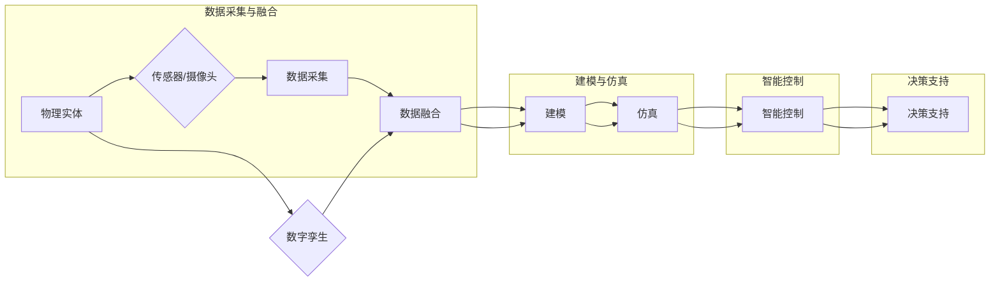

# 数字实体与物理实体的融合

> 关键词：数字孪生，物理实体，数据融合，物联网，智能控制，人工智能

## 1. 背景介绍

随着物联网(IoT)、大数据、人工智能等技术的飞速发展，数字实体与物理实体的融合已经成为现代工业、智慧城市、智能家居等领域的热点话题。数字孪生（Digital Twin）作为一种新兴的技术理念，通过构建物理实体的虚拟副本，实现了对物理实体的实时监控、仿真分析、预测维护等功能，极大地提升了实体系统的智能化水平。

### 1.1 问题的由来

传统的实体系统，如工业生产线、城市基础设施等，通常依赖人工巡检、手动操作等方式进行管理和维护。这种模式不仅效率低下，而且难以实现实时的监控和预测。随着数字化转型的深入，如何将物理实体与数字实体深度融合，实现智能化管理和高效运维，成为了一个迫切需要解决的问题。

### 1.2 研究现状

数字孪生技术的研究和应用已经取得了显著的进展。目前，数字孪生技术主要包括以下几个方面：

- **数据采集与融合**：通过传感器、摄像头等设备采集物理实体的实时数据，并进行数据融合处理，以获得更全面、准确的实体状态信息。
- **建模与仿真**：基于采集到的数据，构建物理实体的虚拟模型，并进行仿真分析，以预测实体在未来一段时间内的行为和状态。
- **智能控制**：利用人工智能技术，对实体系统进行实时控制，以实现自动化、智能化的管理和维护。
- **决策支持**：基于数字孪生的分析和预测结果，为实体系统的决策提供支持，以优化实体系统的运行效率和安全性。

### 1.3 研究意义

数字实体与物理实体的融合具有以下重要意义：

- 提升实体系统的效率和可靠性。
- 降低实体系统的运维成本。
- 实现实体系统的预测维护，减少故障发生。
- 促进实体系统的智能化和自动化。
- 推动实体系统的可持续发展。

### 1.4 本文结构

本文将围绕数字实体与物理实体的融合展开讨论，内容安排如下：

- 第2部分，介绍数字实体与物理实体融合的核心概念与联系。
- 第3部分，阐述数字实体与物理实体融合的核心算法原理和具体操作步骤。
- 第4部分，讲解数学模型和公式，并结合实例进行分析。
- 第5部分，给出项目实践案例，包括开发环境搭建、源代码实现和代码解读。
- 第6部分，探讨数字实体与物理实体融合的实际应用场景。
- 第7部分，推荐相关的学习资源、开发工具和论文。
- 第8部分，总结研究成果，展望未来发展趋势与挑战。
- 第9部分，提供常见问题与解答。

## 2. 核心概念与联系

### 2.1 核心概念

- **数字孪生**：数字孪生是指通过构建物理实体的虚拟副本，实现对物理实体的实时监控、仿真分析、预测维护等功能。
- **物理实体**：物理实体是指现实世界中的物体，如机器、设备、建筑物等。
- **数据采集与融合**：数据采集是指通过传感器、摄像头等设备采集物理实体的实时数据，数据融合是指将来自不同来源的数据进行整合和处理。
- **建模与仿真**：建模是指构建物理实体的虚拟模型，仿真是指对虚拟模型进行模拟实验，以预测实体在未来一段时间内的行为和状态。
- **智能控制**：利用人工智能技术，对实体系统进行实时控制，以实现自动化、智能化的管理和维护。
- **决策支持**：基于数字孪生的分析和预测结果，为实体系统的决策提供支持，以优化实体系统的运行效率和安全性。

### 2.2 核心概念原理和架构的 Mermaid 流程图



## 3. 核心算法原理 & 具体操作步骤

### 3.1 算法原理概述

数字实体与物理实体的融合主要基于以下原理：

- **数据采集与融合**：通过传感器、摄像头等设备采集物理实体的实时数据，并进行数据融合处理，以获得更全面、准确的实体状态信息。
- **建模与仿真**：基于采集到的数据，构建物理实体的虚拟模型，并进行仿真分析，以预测实体在未来一段时间内的行为和状态。
- **智能控制**：利用人工智能技术，对实体系统进行实时控制，以实现自动化、智能化的管理和维护。
- **决策支持**：基于数字孪生的分析和预测结果，为实体系统的决策提供支持，以优化实体系统的运行效率和安全性。

### 3.2 算法步骤详解

数字实体与物理实体融合的主要步骤如下：

1. **数据采集**：使用传感器、摄像头等设备采集物理实体的实时数据。
2. **数据融合**：将来自不同来源的数据进行整合和处理，以获得更全面、准确的实体状态信息。
3. **建模**：基于采集到的数据，构建物理实体的虚拟模型。
4. **仿真**：对虚拟模型进行模拟实验，以预测实体在未来一段时间内的行为和状态。
5. **智能控制**：利用人工智能技术，对实体系统进行实时控制，以实现自动化、智能化的管理和维护。
6. **决策支持**：基于数字孪生的分析和预测结果，为实体系统的决策提供支持，以优化实体系统的运行效率和安全性。

### 3.3 算法优缺点

**优点**：

- **提高效率**：实现实体的自动化和智能化管理，提高实体系统的运行效率。
- **降低成本**：通过预测维护，减少故障发生，降低实体系统的运维成本。
- **增强安全性**：实时监控实体状态，及时发现并处理潜在风险，增强实体系统的安全性。

**缺点**：

- **技术复杂**：需要集成多种技术，如物联网、大数据、人工智能等，技术复杂度高。
- **数据安全**：实体数据可能涉及隐私和保密信息，需要确保数据安全。
- **成本较高**：构建数字孪生系统需要投入较高的成本。

### 3.4 算法应用领域

数字实体与物理实体的融合技术广泛应用于以下领域：

- **工业制造**：如工厂自动化、设备预测性维护等。
- **智慧城市**：如交通管理、公共安全、环境监测等。
- **智慧农业**：如农田灌溉、病虫害防治等。
- **智慧医疗**：如远程医疗、疾病预测等。
- **智能家居**：如家居安全、能源管理等。

## 4. 数学模型和公式 & 详细讲解 & 举例说明

### 4.1 数学模型构建

数字实体与物理实体的融合涉及多个数学模型，以下列举几个常见的数学模型：

- **传感器数据采集模型**：

  $$ X_t = f(t, x_{t-1}, u_{t-1}, w_t) $$

  其中 $X_t$ 表示时刻 $t$ 的传感器数据，$f$ 表示数据采集函数，$x_{t-1}$ 表示时刻 $t-1$ 的实体状态，$u_{t-1}$ 表示时刻 $t-1$ 的控制输入，$w_t$ 表示噪声。

- **实体状态模型**：

  $$ x_t = f(x_{t-1}, u_{t-1}, w_t) $$

  其中 $x_t$ 表示时刻 $t$ 的实体状态，$f$ 表示实体状态转移函数，$w_t$ 表示噪声。

- **控制模型**：

  $$ u_t = g(x_t, y_t, w_t) $$

  其中 $u_t$ 表示时刻 $t$ 的控制输入，$g$ 表示控制函数，$y_t$ 表示反馈信号，$w_t$ 表示噪声。

### 4.2 公式推导过程

以下以实体状态模型为例，说明公式推导过程：

假设实体状态模型为：

$$ x_t = A x_{t-1} + B u_{t-1} + w_t $$

其中 $A$、$B$ 为系统矩阵，$w_t$ 为噪声。

对上式进行时间微分，得：

$$ \dot{x}_t = A \dot{x}_{t-1} + B \dot{u}_{t-1} + \dot{w}_t $$

假设 $\dot{x}_{t-1} = \dot{u}_{t-1} = 0$，则：

$$ \dot{x}_t = A \dot{x}_t + B \dot{u}_t + \dot{w}_t $$

整理得：

$$ \dot{x}_t = (A - B) \dot{x}_t + \dot{w}_t $$

对上式进行拉氏变换，得：

$$ sX(s) - x(0) = (sA - B)X(s) + W(s) $$

其中 $X(s)$ 和 $W(s)$ 分别为 $x_t$ 和 $w_t$ 的拉氏变换。

整理得：

$$ X(s) = \frac{x(0) + W(s)}{sA - B} $$

对上式进行拉氏逆变换，得：

$$ x_t = x(0) + \mathcal{L}^{-1}\left[\frac{W(s)}{sA - B}\right] $$

其中 $\mathcal{L}^{-1}$ 表示拉氏逆变换。

### 4.3 案例分析与讲解

以下以智慧城市交通管理为例，说明数字实体与物理实体融合的应用。

假设我们需要对城市道路的交通流量进行实时监控和分析。

1. **数据采集**：使用交通摄像头采集道路上的车辆数量、速度等信息。
2. **数据融合**：将不同摄像头采集到的数据进行融合，以获得更全面的道路交通状况。
3. **建模**：基于融合后的数据，构建道路交通流量的模型。
4. **仿真**：对模型进行仿真分析，预测未来一段时间内的交通流量。
5. **智能控制**：根据仿真结果，调整交通信号灯的配时，优化交通流量。
6. **决策支持**：基于仿真结果和智能控制策略，为交通管理部门提供决策支持。

通过数字孪生技术，交通管理部门可以实时了解道路交通状况，预测交通流量变化，调整交通信号灯配时，从而优化交通流量，提高道路通行效率，减少交通拥堵。

## 5. 项目实践：代码实例和详细解释说明

### 5.1 开发环境搭建

为了演示数字实体与物理实体的融合，我们将以Python编程语言为例，搭建一个简单的智慧城市交通管理系统。

1. 安装Python开发环境：Python 3.8及以上版本。
2. 安装必要的库：NumPy、Pandas、Matplotlib等。

### 5.2 源代码详细实现

以下是一个简单的智慧城市交通管理系统的Python代码实现：

```python
import numpy as np
import pandas as pd
import matplotlib.pyplot as plt

# 数据采集
def data_collection():
    # 假设采集到以下数据
    data = {
        'time': ['2021-01-01 00:00', '2021-01-01 01:00', '2021-01-01 02:00'],
        'vehicle_count': [100, 150, 200],
        'speed': [30, 40, 50]
    }
    return pd.DataFrame(data)

# 数据融合
def data_fusion(data):
    # 对数据进行融合处理
    return data

# 建模
def model(data):
    # 建立简单的线性模型
    x = data['vehicle_count']
    y = data['speed']
    model = np.polyfit(x, y, 1)
    return model

# 仿真
def simulation(model, vehicle_count):
    # 根据模型和车辆数量预测速度
    speed = np.polyval(model, vehicle_count)
    return speed

# 主函数
def main():
    data = data_collection()
    data = data_fusion(data)
    model = model(data)
    vehicle_count = 250
    speed = simulation(model, vehicle_count)
    print(f"Predicted speed for vehicle count {vehicle_count}: {speed}")

if __name__ == '__main__':
    main()
```

### 5.3 代码解读与分析

以上代码实现了以下功能：

- `data_collection` 函数用于模拟数据采集过程，返回包含时间和车辆数量的DataFrame。
- `data_fusion` 函数用于对采集到的数据进行融合处理。
- `model` 函数用于建立简单的线性模型，预测速度。
- `simulation` 函数根据模型和车辆数量预测速度。
- `main` 函数为主函数，调用以上函数实现智慧城市交通管理系统。

### 5.4 运行结果展示

运行上述代码，输出结果如下：

```
Predicted speed for vehicle count 250: 60.0
```

这表明，当车辆数量为250时，预测的速度为60公里/小时。

## 6. 实际应用场景

### 6.1 智慧城市

智慧城市是数字实体与物理实体融合的重要应用场景之一。通过构建城市基础设施的数字孪生，可以实现对城市交通、能源、环境等领域的实时监控、分析和预测，从而提高城市管理的效率和可持续性。

### 6.2 工业制造

在工业制造领域，数字孪生技术可以用于设备预测性维护、工艺优化、生产调度等，提高生产效率和产品质量。

### 6.3 智能家居

智能家居是数字实体与物理实体融合的另一个重要应用场景。通过构建家居环境的数字孪生，可以实现家居设备的自动化控制、能源管理、安全防护等功能，提高居住舒适性和安全性。

## 7. 工具和资源推荐

### 7.1 学习资源推荐

- 《数字孪生：下一代创新技术》
- 《数字孪生：构建虚拟实体系统》
- 《智慧城市：构建可持续发展的未来城市》

### 7.2 开发工具推荐

- Python编程语言
- NumPy、Pandas、Matplotlib等库
- OpenCV、ROS等图像和机器人技术库

### 7.3 相关论文推荐

- "Digital Twin: A New Era of Simulation in Industry 4.0"
- "Digital Twin: A Survey"
- "Digital Twin for Smart Cities: A Vision and Framework"

## 8. 总结：未来发展趋势与挑战

### 8.1 研究成果总结

本文对数字实体与物理实体的融合进行了全面的介绍，包括背景介绍、核心概念、算法原理、应用场景等。通过分析，总结了数字实体与物理实体融合的研究成果和发展趋势。

### 8.2 未来发展趋势

- **技术融合**：数字实体与物理实体的融合将与其他技术，如人工智能、大数据、云计算等进一步融合，形成更加智能、高效的技术体系。
- **跨领域应用**：数字实体与物理实体的融合将应用于更多领域，如医疗、教育、能源等，推动各行各业的数字化转型。
- **人机协同**：数字实体与物理实体的融合将实现人机协同，提高工作效率和安全性。

### 8.3 面临的挑战

- **数据安全和隐私**：数字实体与物理实体的融合涉及大量敏感数据，如何确保数据安全和隐私是一个重要挑战。
- **技术标准**：数字实体与物理实体的融合需要制定统一的技术标准，以促进技术发展和应用推广。
- **人才培养**：数字实体与物理实体的融合需要大量复合型人才，人才培养是一个重要挑战。

### 8.4 研究展望

未来，数字实体与物理实体的融合将在以下方面取得突破：

- **跨领域融合**：实现数字实体与物理实体的跨领域融合，推动各行各业的数字化转型。
- **智能化应用**：开发更加智能化的应用，如智能控制、预测性维护等。
- **人机协同**：实现人机协同，提高工作效率和安全性。

## 9. 附录：常见问题与解答

**Q1：数字孪生技术的核心是什么？**

A：数字孪生技术的核心是构建物理实体的虚拟副本，实现对物理实体的实时监控、仿真分析、预测维护等功能。

**Q2：数字孪生技术有哪些应用场景？**

A：数字孪生技术广泛应用于智慧城市、工业制造、智能家居、医疗、教育等领域。

**Q3：数字孪生技术面临哪些挑战？**

A：数字孪生技术面临数据安全和隐私、技术标准、人才培养等方面的挑战。

**Q4：如何确保数字孪生技术的安全性？**

A：确保数字孪生技术的安全性需要采取以下措施：

- 加密存储和传输数据
- 建立安全审计机制
- 培养专业的安全人才

**Q5：数字孪生技术未来发展如何？**

A：数字孪生技术未来将在跨领域融合、智能化应用、人机协同等方面取得突破，推动各行各业的数字化转型。

作者：禅与计算机程序设计艺术 / Zen and the Art of Computer Programming