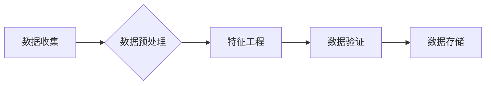

# 数据集工程的重要性与方法

> 关键词：数据集工程，数据质量，数据预处理，特征工程，数据清洗，模型训练，模型评估

## 1. 背景介绍

在人工智能和机器学习领域，数据集是构建和训练模型的基础。然而，数据集的质量和准备过程对模型的性能和可靠性有着至关重要的影响。数据集工程（Data Engineering）作为数据科学和机器学习的重要环节，旨在确保数据集的质量、可靠性和适用性。本文将探讨数据集工程的重要性，介绍其核心概念、方法和技术，并展望其未来发展趋势。

### 1.1 问题的由来

随着大数据时代的到来，数据在机器学习中的应用越来越广泛。然而，现实世界中的数据往往存在噪声、缺失值、异常值等问题，这些数据质量问题会对模型的训练和预测带来负面影响。因此，数据集工程成为了保证模型性能的关键步骤。

### 1.2 研究现状

目前，数据集工程已经成为数据科学和机器学习领域的研究热点。研究者们提出了许多数据预处理、特征工程和数据清洗的方法，以提高数据集的质量和模型的性能。同时，随着深度学习技术的发展，数据集工程的方法也在不断演进。

### 1.3 研究意义

数据集工程对于机器学习项目的成功至关重要，其意义体现在以下几个方面：

- 提高模型性能：高质量的数据集可以显著提高模型的准确性和泛化能力。
- 优化训练效率：合理的预处理和特征工程可以减少训练时间和计算资源消耗。
- 降低错误率：数据清洗可以减少噪声和异常值对模型预测的影响，降低错误率。
- 提升数据可解释性：数据集工程可以帮助理解数据特征，提高模型的可解释性。

### 1.4 本文结构

本文将按照以下结构展开：

- 介绍数据集工程的核心概念和方法。
- 深入探讨数据预处理、特征工程和数据清洗的技术细节。
- 分析数据集工程在实际应用中的案例。
- 探讨数据集工程的未来发展趋势与挑战。

## 2. 核心概念与联系

### 2.1 数据集工程流程

数据集工程流程可以分为以下几个阶段：

1. 数据收集：从不同来源收集原始数据。
2. 数据预处理：清洗、转换和格式化数据。
3. 特征工程：提取和构造有助于模型学习的特征。
4. 数据验证：检查数据集的质量和一致性。
5. 数据存储：将处理后的数据存储在合适的位置。

Mermaid流程图如下：



### 2.2 核心概念

- **数据清洗**：删除或修正数据集中的错误、异常值和噪声。
- **数据预处理**：将数据转换为模型所需的格式，如归一化、标准化等。
- **特征工程**：从原始数据中提取或构造有助于模型学习的特征。
- **数据验证**：检查数据集的质量和一致性，确保数据满足模型训练的需求。

## 3. 核心算法原理 & 具体操作步骤

### 3.1 算法原理概述

数据集工程的核心算法包括数据清洗、数据预处理和特征工程。

- **数据清洗**：常用的算法包括删除重复记录、填充缺失值、异常值检测和修正等。
- **数据预处理**：常用的算法包括归一化、标准化、编码和特征缩放等。
- **特征工程**：常用的算法包括特征提取、特征选择和特征构造等。

### 3.2 算法步骤详解

#### 3.2.1 数据清洗

1. **删除重复记录**：使用Pandas库的`drop_duplicates`函数删除重复的记录。
2. **填充缺失值**：使用均值、中位数、众数或插值等方法填充缺失值。
3. **异常值检测和修正**：使用Z-score、IQR等方法检测异常值，并进行修正或删除。

#### 3.2.2 数据预处理

1. **归一化**：将数据缩放到0和1之间，使用MinMaxScaler或StandardScaler。
2. **标准化**：将数据转换为均值为0、标准差为1的分布，使用StandardScaler。
3. **编码**：将类别数据转换为数值数据，使用OneHotEncoder或LabelEncoder。

#### 3.2.3 特征工程

1. **特征提取**：从文本数据中提取关键词、主题和情感等特征。
2. **特征选择**：选择对模型预测最重要的特征，使用递归特征消除（RFE）等方法。
3. **特征构造**：构造新的特征，如交乘、多项式等。

### 3.3 算法优缺点

#### 3.3.1 数据清洗

- 优点：可以显著提高数据质量，降低模型训练的难度。
- 缺点：可能引入偏差，需要根据具体情况进行调整。

#### 3.3.2 数据预处理

- 优点：可以将数据转换为模型所需的格式，提高模型训练的效率。
- 缺点：可能降低数据的丰富性，需要根据具体情况进行调整。

#### 3.3.3 特征工程

- 优点：可以提取和构造有助于模型学习的特征，提高模型的性能。
- 缺点：需要丰富的领域知识和经验，且特征工程的效果难以评估。

### 3.4 算法应用领域

数据集工程在以下领域有着广泛的应用：

- 机器学习：用于构建和训练机器学习模型。
- 数据挖掘：用于挖掘数据中的模式和知识。
- 人工智能：用于构建和训练人工智能系统。

## 4. 数学模型和公式 & 详细讲解 & 举例说明

### 4.1 数学模型构建

数据集工程中的数学模型主要包括：

- **归一化**：将数据缩放到0和1之间，公式如下：

  $$
 X_{\text{norm}} = \frac{X - X_{\text{min}}}{X_{\text{max}} - X_{\text{min}}} 
$$

- **标准化**：将数据转换为均值为0、标准差为1的分布，公式如下：

  $$
 X_{\text{std}} = \frac{X - \mu}{\sigma} 
$$

### 4.2 公式推导过程

#### 4.2.1 归一化

归一化公式将原始数据缩放到0和1之间，其中 $X$ 为原始数据，$X_{\text{min}}$ 和 $X_{\text{max}}$ 分别为数据的最小值和最大值。

#### 4.2.2 标准化

标准化公式将原始数据转换为均值为0、标准差为1的分布，其中 $X$ 为原始数据，$\mu$ 为数据的均值，$\sigma$ 为数据的标准差。

### 4.3 案例分析与讲解

假设我们有以下一组数据：

$$
 X = [1, 2, 3, 4, 5] 
$$

#### 4.3.1 归一化

将数据归一化后，得到：

$$
 X_{\text{norm}} = \left[0.0, 0.25, 0.5, 0.75, 1.0\right] 
$$

#### 4.3.2 标准化

将数据标准化后，得到：

$$
 X_{\text{std}} = \left[-1.264, -0.816, 0.0, 0.816, 1.264\right] 
$$

## 5. 项目实践：代码实例和详细解释说明

### 5.1 开发环境搭建

使用Python进行数据集工程实践，需要安装以下库：

- Pandas：用于数据处理和分析。
- NumPy：用于数值计算。
- Scikit-learn：用于机器学习和数据预处理。
- Matplotlib：用于数据可视化。

### 5.2 源代码详细实现

以下是一个简单的数据集工程代码示例：

```python
import pandas as pd
import numpy as np
from sklearn.preprocessing import StandardScaler, MinMaxScaler
from sklearn.model_selection import train_test_split

# 创建示例数据集
data = {
    'age': [25, 30, 35, 40, 45],
    'salary': [50000, 60000, 70000, 80000, 90000],
    'department': ['sales', 'sales', 'HR', 'HR', 'IT']
}

df = pd.DataFrame(data)

# 特征工程
df['salary_scaled'] = MinMaxScaler().fit_transform(df[['salary']])
df['age_std'] = StandardScaler().fit_transform(df[['age']]).ravel()

# 数据预处理
X_train, X_test, y_train, y_test = train_test_split(df[['age_scaled', 'age_std']], df['department'], test_size=0.2)

# 可视化
import matplotlib.pyplot as plt

plt.scatter(X_train['age_scaled'], X_train['age_std'])
plt.xlabel('Age Scaled')
plt.ylabel('Age Standardized')
plt.show()
```

### 5.3 代码解读与分析

- 首先，导入所需的库。
- 创建一个包含年龄、薪资和部门信息的示例数据集。
- 对薪资数据进行归一化处理，对年龄数据进行标准化处理。
- 使用Scikit-learn的`train_test_split`函数将数据集划分为训练集和测试集。
- 使用Matplotlib的可视化功能，将归一化和标准化后的年龄数据可视化。

### 5.4 运行结果展示

运行上述代码后，会生成一个散点图，展示归一化和标准化后的年龄数据。

## 6. 实际应用场景

### 6.1 金融风险评估

在金融风险评估中，数据集工程可以用于处理客户信用评分、贷款审批等任务。通过数据清洗和特征工程，可以提高模型的准确性和可靠性，降低信用风险。

### 6.2 医疗诊断

在医疗诊断中，数据集工程可以用于处理医学影像、病历等数据。通过数据清洗和特征工程，可以辅助医生进行疾病诊断，提高诊断的准确性和效率。

### 6.3 智能推荐

在智能推荐中，数据集工程可以用于处理用户行为数据、商品信息等。通过数据清洗和特征工程，可以构建更精准的推荐系统，提高用户的满意度。

## 7. 工具和资源推荐

### 7.1 学习资源推荐

- 《数据科学入门》
- 《机器学习实战》
- 《Python数据科学手册》

### 7.2 开发工具推荐

- Jupyter Notebook：用于编写和执行Python代码。
- Pandas：用于数据处理和分析。
- NumPy：用于数值计算。
- Scikit-learn：用于机器学习和数据预处理。

### 7.3 相关论文推荐

- "Data Preprocessing for Machine Learning" by莫哈默德·萨拉姆
- "The Unimportance of Preprocessing" by Andrew Ng
- "Feature Engineering for Machine Learning" by Andriy Burkov

## 8. 总结：未来发展趋势与挑战

### 8.1 研究成果总结

本文介绍了数据集工程的重要性，阐述了数据清洗、数据预处理和特征工程的核心概念和方法，并分析了数据集工程在实际应用中的案例。

### 8.2 未来发展趋势

随着人工智能和机器学习技术的不断发展，数据集工程将呈现出以下发展趋势：

- 自动化：数据集工程将更加自动化，减少人工干预。
- 模型可解释性：数据集工程将更加注重模型可解释性，提高模型的透明度。
- 跨学科融合：数据集工程将与其他学科（如统计学、心理学等）进行融合，提高数据集工程的质量和效率。

### 8.3 面临的挑战

数据集工程在发展过程中也面临着以下挑战：

- 数据质量：如何保证数据质量，减少噪声和异常值。
- 特征工程：如何选择和构造有效的特征，提高模型的性能。
- 模型可解释性：如何提高模型的可解释性，增强用户对模型的信任。

### 8.4 研究展望

未来，数据集工程的研究将更加注重以下几个方面：

- 开发更有效的数据预处理和特征工程方法。
- 提高数据集工程的可解释性和透明度。
- 探索自动化数据集工程的方法和工具。

通过不断的研究和创新，数据集工程将为人工智能和机器学习领域的发展提供更加坚实的基础。

## 9. 附录：常见问题与解答

**Q1：数据集工程和特征工程有什么区别？**

A1：数据集工程和特征工程是数据科学和机器学习中的两个相关概念。数据集工程主要关注数据的质量、可靠性和适用性，包括数据清洗、数据预处理和特征工程等步骤。而特征工程则专注于从原始数据中提取或构造有助于模型学习的特征。

**Q2：数据清洗和数据预处理有什么区别？**

A2：数据清洗和数据预处理是数据集工程中的两个步骤。数据清洗主要关注删除或修正数据集中的错误、异常值和噪声，以提高数据质量。而数据预处理则关注将数据转换为模型所需的格式，如归一化、标准化等，以提高模型训练的效率。

**Q3：特征工程有哪些常用的方法？**

A3：特征工程常用的方法包括特征提取、特征选择和特征构造等。特征提取可以从原始数据中提取新的特征，如文本数据的关键词提取、情感分析等。特征选择可以从多个特征中选择对模型预测最重要的特征。特征构造可以构造新的特征，如交乘、多项式等。

**Q4：如何保证数据集工程的质量？**

A4：为了保证数据集工程的质量，可以采取以下措施：
- 使用高质量的数据源。
- 对数据进行严格的清洗和预处理。
- 使用有效的特征工程方法。
- 定期检查和验证数据集的质量。

**Q5：数据集工程在机器学习项目中的重要性是什么？**

A5：数据集工程在机器学习项目中的重要性体现在以下几个方面：
- 提高模型性能：高质量的数据集可以显著提高模型的准确性和泛化能力。
- 优化训练效率：合理的预处理和特征工程可以减少训练时间和计算资源消耗。
- 降低错误率：数据清洗可以减少噪声和异常值对模型预测的影响，降低错误率。
- 提升数据可解释性：数据集工程可以帮助理解数据特征，提高模型的可解释性。

---

作者：禅与计算机程序设计艺术 / Zen and the Art of Computer Programming