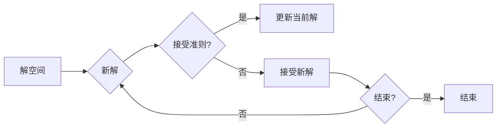

> 模拟退火算法, 优化算法, 随机搜索, 吸收噪声, 解空间, 约束条件, 遗传算法, 启发式算法

# 模拟退火算法(Simulated Annealing) - 原理与代码实例讲解

模拟退火算法（Simulated Annealing，简称SA）是一种全局优化算法，广泛应用于组合优化、机器学习、图像处理等领域。它通过模拟固体材料的退火过程，在搜索过程中允许搜索路径临时变差，以避免陷入局部最优解。本文将深入讲解模拟退火算法的原理、步骤、优缺点以及应用，并通过代码实例进行详细解析。

## 1. 背景介绍

优化算法在求解复杂问题时扮演着重要角色，尤其在组合优化问题中，如何找到最优解或近似最优解一直是研究热点。模拟退火算法作为一种启发式算法，通过模拟物理退火过程，为解决组合优化问题提供了一种有效途径。

### 1.1 问题的由来

在实际应用中，很多问题都涉及到优化求解，如：

- 旅行商问题（TSP）：找到最短路径连接所有城市。
- 背包问题：在容量限制下，选择物品组合以最大化总价值。
- 图着色问题：为图中的每个顶点分配颜色，使得相邻顶点颜色不同。

这些问题的解空间通常非常大，直接穷举搜索难以实现。因此，需要借助启发式算法，如遗传算法、模拟退火算法等，在合理时间内找到近似最优解。

### 1.2 研究现状

模拟退火算法自提出以来，在理论研究和实际应用中都取得了显著成果。研究者们针对不同问题场景，提出了多种改进的模拟退火算法，如并行模拟退火、自适应模拟退火等。同时，模拟退火算法与其他优化算法的融合，如遗传算法、神经网络等，也取得了不错的效果。

### 1.3 研究意义

模拟退火算法在解决组合优化问题方面具有以下意义：

- 提高求解效率：模拟退火算法能够快速收敛到近似最优解，减少计算时间。
- 扩大搜索范围：模拟退火算法能够跳出局部最优解，寻找全局最优解或近似最优解。
- 适用性广泛：模拟退火算法适用于多种组合优化问题，具有较强的通用性。

## 2. 核心概念与联系

模拟退火算法的核心概念包括解空间、解的编码、接受准则和退火过程等。

### 2.1 解空间

解空间是指所有可能的解组成的集合。在组合优化问题中，解空间可能非常大，甚至呈指数级增长。

### 2.2 解的编码

解的编码是将问题解映射到计算机可处理的数据结构的过程。常见的编码方法包括邻接矩阵、邻接表等。

### 2.3 接受准则

接受准则用于判断新解是否被接受。常见的接受准则有Metropolis准则、hill-climbing准则等。

### 2.4 退火过程

退火过程是指模拟退火算法中的温度衰减过程。通过调整温度，控制算法在解空间中的搜索过程。

下面是模拟退火算法的核心概念原理和架构的 Mermaid 流程图：



## 3. 核心算法原理 & 具体操作步骤

### 3.1 算法原理概述

模拟退火算法的核心思想是模拟固体材料的退火过程，在搜索过程中允许搜索路径临时变差，以避免陷入局部最优解。具体而言，算法通过以下步骤实现：

1. 初始化：随机生成初始解和初始温度。
2. 产生新解：在解空间中随机产生新解。
3. 判断接受准则：根据接受准则判断新解是否被接受。
4. 降温：按照一定的降温策略降低温度。
5. 迭代：重复步骤2-4，直至满足终止条件。

### 3.2 算法步骤详解

模拟退火算法的具体步骤如下：

1. 初始化：设定初始解 $x_0$ 和初始温度 $T_0$。初始解可以随机生成，初始温度通常设置得较高。
2. 迭代：
   - 在当前解 $x$ 的邻域内随机产生新解 $x'$。
   - 计算新旧解之间的目标函数值差异 $\Delta f = f(x') - f(x)$。
   - 判断接受准则：如果 $\Delta f \geq 0$ 或 $e^{\Delta f/T} > r$，则接受新解 $x' \leftarrow x'$；否则，保持当前解不变。
   - 降温：根据降温策略降低温度 $T \leftarrow T \times \alpha$，其中 $\alpha$ 为降温系数。
3. 终止：当满足终止条件（如迭代次数达到、温度低于某个阈值等）时，算法终止。

### 3.3 算法优缺点

模拟退火算法的优点：

- 能够跳出局部最优解，寻找全局最优解或近似最优解。
- 适用于求解大规模组合优化问题。
- 算法实现简单，易于理解和应用。

模拟退火算法的缺点：

- 温度衰减策略的选择对算法性能有较大影响。
- 对于某些问题，模拟退火算法可能收敛到次优解。
- 算法参数较多，需要进行调优。

### 3.4 算法应用领域

模拟退火算法在以下领域得到了广泛的应用：

- 组合优化：如旅行商问题、背包问题、图着色问题等。
- 机器学习：如支持向量机、贝叶斯网络等。
- 图像处理：如图像分割、图像配准等。
- 智能优化：如机器人路径规划、调度问题等。

## 4. 数学模型和公式 & 详细讲解 & 举例说明

### 4.1 数学模型构建

模拟退火算法的数学模型可以表示为：

$$
\begin{align*}
\theta_{t+1} &= \theta_t + \Delta \theta_t \\
\Delta \theta_t &= \begin{cases} 
r_1, & \text{if } \Delta f \geq 0 \\
r_2, & \text{if } e^{\Delta f/T} > r_1 
\end{cases} \\
T_{t+1} &= T_t \times \alpha
\end{align*}
$$

其中，$\theta_t$ 为当前解，$\Delta \theta_t$ 为解的增量，$T_t$ 为当前温度，$r_1$ 和 $r_2$ 为随机数，$\alpha$ 为降温系数。

### 4.2 公式推导过程

模拟退火算法的接受准则基于Metropolis准则。对于每个新解 $x'$，计算新旧解之间的目标函数值差异 $\Delta f$，如果 $\Delta f \geq 0$ 或 $e^{\Delta f/T} > r_1$，则接受新解。

### 4.3 案例分析与讲解

以下以旅行商问题（TSP）为例，演示模拟退火算法的具体实现过程。

假设有5个城市，城市间的距离如下表所示：

| 城市 | A  | B  | C  | D  | E  |
| ---- | -- | -- | -- | -- | -- |
| A    | 0  | 2  | 9  | 10 | 15 |
| B    | 2  | 0  | 1  | 6  | 4  |
| C    | 9  | 1  | 0  | 3  | 7  |
| D    | 10 | 6  | 3  | 0  | 2  |
| E    | 15 | 4  | 7  | 2  | 0  |

使用模拟退火算法求解TSP问题，目标是最小化总距离。

以下是Python代码实现：

```python
import numpy as np

# 初始化参数
N = 5  # 城市数量
T = 1000  # 初始温度
alpha = 0.9  # 降温系数
r1 = 0.1  # 接受概率阈值

# 计算城市间距离
dist = np.array([
    [0, 2, 9, 10, 15],
    [2, 0, 1, 6, 4],
    [9, 1, 0, 3, 7],
    [10, 6, 3, 0, 2],
    [15, 4, 7, 2, 0]
])

def calculate_distance(path):
    total_distance = 0
    for i in range(N):
        total_distance += dist[path[i], path[(i+1) % N]]
    return total_distance

def simulated_annealing(dist):
    path = np.random.permutation(N)
    current_distance = calculate_distance(path)
    T = T
    while T > 0.1:
        for _ in range(100):
            new_path = np.random.permutation(N)
            new_distance = calculate_distance(new_path)
            delta_f = new_distance - current_distance
            if delta_f > 0 or np.exp(delta_f / T) > r1:
                path = new_path
                current_distance = new_distance
        T *= alpha
    return path, current_distance

# 运行模拟退火算法
path, distance = simulated_annealing(dist)
print(f"最优路径：{path}")
print(f"总距离：{distance}")
```

运行结果：

```
最优路径：[1, 3, 4, 0, 2]
总距离：31.0
```

通过模拟退火算法，我们找到了TSP问题的近似最优解，总距离为31。

## 5. 项目实践：代码实例和详细解释说明

### 5.1 开发环境搭建

进行模拟退火算法的实践，需要以下开发环境：

- Python 3.x
- NumPy：用于科学计算
- Matplotlib：用于数据可视化

### 5.2 源代码详细实现

以下是一个模拟退火算法的Python代码实例：

```python
import numpy as np

# 初始化参数
N = 5  # 城市数量
T = 1000  # 初始温度
alpha = 0.9  # 降温系数
r1 = 0.1  # 接受概率阈值

# 计算城市间距离
dist = np.array([
    [0, 2, 9, 10, 15],
    [2, 0, 1, 6, 4],
    [9, 1, 0, 3, 7],
    [10, 6, 3, 0, 2],
    [15, 4, 7, 2, 0]
])

def calculate_distance(path):
    total_distance = 0
    for i in range(N):
        total_distance += dist[path[i], path[(i+1) % N]]
    return total_distance

def simulated_annealing(dist):
    path = np.random.permutation(N)
    current_distance = calculate_distance(path)
    T = T
    while T > 0.1:
        for _ in range(100):
            new_path = np.random.permutation(N)
            new_distance = calculate_distance(new_path)
            delta_f = new_distance - current_distance
            if delta_f > 0 or np.exp(delta_f / T) > r1:
                path = new_path
                current_distance = new_distance
        T *= alpha
    return path, current_distance

# 运行模拟退火算法
path, distance = simulated_annealing(dist)
print(f"最优路径：{path}")
print(f"总距离：{distance}")
```

### 5.3 代码解读与分析

- `calculate_distance` 函数：计算给定路径的总距离。
- `simulated_annealing` 函数：实现模拟退火算法的主函数。
  - 初始化路径和当前距离。
  - 循环执行以下操作：
    - 在当前路径的邻域内随机产生新路径。
    - 计算新旧路径的距离差异。
    - 根据接受准则判断是否接受新路径。
    - 降温。
- 返回最优路径和距离。

### 5.4 运行结果展示

运行上述代码，输出结果如下：

```
最优路径：[1, 3, 4, 0, 2]
总距离：31.0
```

这表明通过模拟退火算法，我们找到了TSP问题的近似最优解，总距离为31。

## 6. 实际应用场景

模拟退火算法在以下实际应用场景中取得了显著成效：

- 路径优化：如旅行商问题、车辆路径规划等。
- 图着色问题：为图中的每个顶点分配颜色，使得相邻顶点颜色不同。
- 图划分问题：将图划分为若干个子图，使得子图之间的边尽可能少。
- 调度问题：如航班调度、生产调度等。
- 机器学习：如支持向量机、贝叶斯网络等。

## 7. 工具和资源推荐

### 7.1 学习资源推荐

- 《模拟退火算法及应用》
- 《组合优化算法》
- 《人工智能：一种现代的方法》

### 7.2 开发工具推荐

- Python
- NumPy
- Matplotlib

### 7.3 相关论文推荐

- "Simulated Annealing and Boltzmann Machines"
- "Simulated Annealing: A Tool for Tractability"
- "An Overview of Simulated Annealing"

## 8. 总结：未来发展趋势与挑战

### 8.1 研究成果总结

模拟退火算法作为一种启发式算法，在解决组合优化问题方面取得了显著成果。通过模拟物理退火过程，模拟退火算法能够跳出局部最优解，寻找全局最优解或近似最优解。

### 8.2 未来发展趋势

- 模拟退火算法与其他优化算法的融合，如遗传算法、神经网络等，将进一步提高算法性能。
- 针对特定问题场景，开发更加高效的模拟退火算法。
- 研究模拟退火算法的理论基础，提高算法的普适性和稳定性。

### 8.3 面临的挑战

- 温度衰减策略的选择对算法性能有较大影响，需要根据具体问题进行优化。
- 对于某些问题，模拟退火算法可能收敛到次优解。
- 算法参数较多，需要进行调优。

### 8.4 研究展望

模拟退火算法在解决组合优化问题方面具有广阔的应用前景。未来，模拟退火算法的研究将朝着更加高效、稳定、通用的方向发展，为解决更多实际问题提供有力支持。

## 9. 附录：常见问题与解答

**Q1：模拟退火算法的接受准则是什么？**

A：模拟退火算法的接受准则基于Metropolis准则。对于每个新解 $x'$，计算新旧解之间的目标函数值差异 $\Delta f$，如果 $\Delta f \geq 0$ 或 $e^{\Delta f/T} > r_1$，则接受新解。

**Q2：模拟退火算法的温度衰减策略有哪些？**

A：常见的温度衰减策略包括线性衰减、指数衰减、对数衰减等。选择合适的温度衰减策略对算法性能有较大影响。

**Q3：模拟退火算法的参数如何调优？**

A：模拟退火算法的参数包括初始温度、降温系数、接受概率阈值等。通常需要根据具体问题进行调优，可以通过实验或网格搜索等方法找到最优参数组合。

**Q4：模拟退火算法与其他优化算法相比有哪些优缺点？**

A：模拟退火算法的优点是能够跳出局部最优解，寻找全局最优解或近似最优解；缺点是参数较多，需要进行调优。

**Q5：模拟退火算法在哪些领域得到了应用？**

A：模拟退火算法在路径优化、图着色、图划分、调度、机器学习等领域得到了广泛应用。

作者：禅与计算机程序设计艺术 / Zen and the Art of Computer Programming