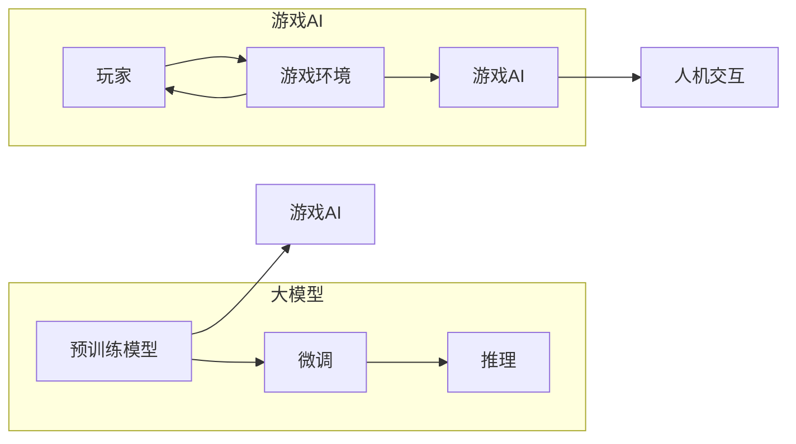

# 游戏AI：激发创新的大模型应用

> 关键词：游戏AI，大模型，自然语言处理，强化学习，深度学习，人机交互，游戏设计

## 1. 背景介绍
### 1.1 游戏产业的变革

随着科技的不断进步，游戏产业经历了从街机时代、主机时代到如今移动互联网时代的巨大变革。游戏类型和玩法日益丰富，玩家对游戏体验的要求也越来越高。在这个过程中，游戏AI技术的应用成为推动游戏产业创新的重要力量。

### 1.2 游戏AI技术的发展

游戏AI技术主要包括以下几种：

- **规则基AI**：通过定义明确的规则来模拟AI的行为，如经典游戏《国际象棋》中的AlphaZero。
- **基于搜索的AI**：通过搜索算法来模拟AI的决策过程，如蒙特卡洛树搜索（MCTS）。
- **基于强化学习的AI**：通过与环境交互学习最优策略，如《星际争霸II》中的AlphaStar。
- **基于深度学习的AI**：利用深度学习算法从大量数据中学习模式，如DQN、PPO等。

随着深度学习技术的快速发展，基于深度学习的游戏AI逐渐成为主流。大模型在游戏AI中的应用，更是为游戏设计带来了全新的可能性。

### 1.3 研究意义

游戏AI技术的发展不仅能够提升游戏体验，还能为游戏设计带来以下益处：

- **提高游戏难度和可玩性**：游戏AI能够根据玩家水平自动调整难度，提供更具挑战性的游戏体验。
- **丰富游戏内容**：游戏AI能够生成新的游戏关卡、角色和故事线，丰富游戏内容。
- **增强交互性**：游戏AI能够与玩家进行更加自然、流畅的交互，提升游戏沉浸感。
- **推动游戏设计创新**：大模型的应用为游戏设计提供了新的思路和灵感。

## 2. 核心概念与联系
### 2.1 核心概念原理和架构的 Mermaid 流程图



### 2.2 核心概念详解

- **大模型**：指具有海量参数和强大语言理解能力的深度学习模型，如BERT、GPT-3等。
- **微调**：指在大模型的基础上，针对特定任务进行参数调整，以适应下游任务的需求。
- **推理**：指大模型根据输入数据生成输出结果的过程。
- **玩家**：游戏参与者，通过与游戏环境交互获得游戏体验。
- **游戏环境**：游戏运行的环境，包括游戏规则、场景、角色等。
- **游戏AI**：指在游戏环境中运行的AI模型，负责模拟NPC（非玩家角色）的行为。
- **人机交互**：指玩家与游戏AI之间的交互，包括对话、动作等。

## 3. 核心算法原理 & 具体操作步骤
### 3.1 算法原理概述

游戏AI的核心算法主要包括以下几种：

- **强化学习**：通过与环境交互学习最优策略，如Q-learning、SARSA、Deep Q-Network（DQN）、Proximal Policy Optimization（PPO）等。
- **深度学习**：通过学习大量数据中的模式，提取特征和规律，如卷积神经网络（CNN）、循环神经网络（RNN）、长短期记忆网络（LSTM）等。
- **自然语言处理**：通过处理和理解自然语言，实现人机交互，如文本生成、情感分析、对话系统等。

### 3.2 算法步骤详解

**强化学习**：

1. 设计游戏环境和奖励机制。
2. 使用强化学习算法训练AI模型。
3. 将训练好的AI模型应用于游戏环境。
4. 分析AI模型的表现，并迭代优化。

**深度学习**：

1. 收集游戏数据，包括游戏场景、角色、动作等。
2. 设计深度学习模型，如CNN、RNN、LSTM等。
3. 使用游戏数据进行模型训练。
4. 将训练好的模型应用于游戏环境，实现游戏AI。

**自然语言处理**：

1. 收集游戏对话数据，包括玩家对话、NPC对话等。
2. 使用自然语言处理技术，如文本生成、情感分析、对话系统等，实现人机交互。
3. 将人机交互结果应用于游戏环境，提升游戏体验。

### 3.3 算法优缺点

**强化学习**：

优点：能够学习到复杂策略，适用于多种游戏类型。
缺点：需要大量数据进行训练，训练时间长，对环境设计要求较高。

**深度学习**：

优点：能够自动提取特征和规律，适用于图像、音频等数据。
缺点：需要大量数据进行训练，训练时间长，对模型设计要求较高。

**自然语言处理**：

优点：能够实现人机交互，提升游戏体验。
缺点：需要大量数据进行训练，对自然语言处理技术要求较高。

### 3.4 算法应用领域

**强化学习**：

- 游戏角色行为设计
- 游戏任务规划
- 游戏对抗策略

**深度学习**：

- 游戏场景生成
- 游戏角色动画
- 游戏语音识别

**自然语言处理**：

- 游戏对话系统
- 游戏剧情生成
- 游戏攻略生成

## 4. 数学模型和公式 & 详细讲解 & 举例说明
### 4.1 数学模型构建

**强化学习**：

- 状态空间 $S$
- 动作空间 $A$
- 状态转移概率 $P(S_{t+1}|S_t,A_t)$
- 奖励函数 $R(S_t,A_t)$
- 策略函数 $\pi(a|s)$

**深度学习**：

- 输入层 $X$
- 隐藏层 $H$
- 输出层 $Y$
- 激活函数 $\sigma()$

### 4.2 公式推导过程

**强化学习**：

- Q值函数 $Q(s,a)$：在状态 $s$ 下，执行动作 $a$ 的期望回报。
- 动态规划方程：$Q(s,a) = \sum_{s',a'} P(s',a'|s,a)R(s,a) + \gamma Q(s',a')$

**深度学习**：

- 前向传播：$Y = \sigma(W_HH + b_H)$
- 反向传播：$\delta = Y - T$

### 4.3 案例分析与讲解

**案例1：基于DQN的俄罗斯方块游戏AI**

1. 设计游戏环境和奖励机制。
2. 使用DQN算法训练AI模型。
3. 将训练好的AI模型应用于游戏环境，实现自动玩俄罗斯方块。
4. 分析AI模型的表现，并迭代优化。

**案例2：基于BERT的游戏对话系统**

1. 收集游戏对话数据，包括玩家对话、NPC对话等。
2. 使用BERT模型对对话数据进行预处理。
3. 使用序列到序列模型生成NPC对话。
4. 将NPC对话结果应用于游戏环境，实现人机交互。

## 5. 项目实践：代码实例和详细解释说明
### 5.1 开发环境搭建

1. 安装Python环境。
2. 安装TensorFlow或PyTorch等深度学习框架。
3. 安装游戏开发引擎，如Unity、Unreal Engine等。

### 5.2 源代码详细实现

**案例1：基于DQN的俄罗斯方块游戏AI**

```python
import numpy as np
import random
import tensorflow as tf

# ...（代码省略）

# 训练DQN模型
def train_dqn():
    # ...（代码省略）

# 测试DQN模型
def test_dqn():
    # ...（代码省略）

# ...（代码省略）
```

**案例2：基于BERT的游戏对话系统**

```python
import transformers

# ...（代码省略）

# 训练BERT模型
def train_bert():
    # ...（代码省略）

# 使用BERT模型生成NPC对话
def generate_npc_dialogue():
    # ...（代码省略）

# ...（代码省略）
```

### 5.3 代码解读与分析

**案例1：基于DQN的俄罗斯方块游戏AI**

- 代码中定义了DQN模型、训练和测试函数。
- 训练过程中，DQN模型通过与环境交互学习最优策略。
- 测试过程中，DQN模型能够自动玩俄罗斯方块。

**案例2：基于BERT的游戏对话系统**

- 代码中定义了BERT模型、训练和生成函数。
- 训练过程中，BERT模型学习到游戏对话数据中的语言模式。
- 生成过程中，BERT模型能够根据玩家输入生成NPC对话。

### 5.4 运行结果展示

**案例1：基于DQN的俄罗斯方块游戏AI**

- 在Unity引擎中运行俄罗斯方块游戏。
- 使用DQN模型控制游戏AI自动玩俄罗斯方块。

**案例2：基于BERT的游戏对话系统**

- 在Unity引擎中运行游戏。
- 使用BERT模型生成NPC对话，实现人机交互。

## 6. 实际应用场景
### 6.1 游戏AI在游戏设计中的应用

- **游戏角色行为设计**：使用强化学习技术设计游戏角色行为，使角色更加智能、生动。
- **游戏任务规划**：使用强化学习技术规划游戏任务，使任务更具挑战性、多样性。
- **游戏剧情生成**：使用自然语言处理技术生成游戏剧情，使游戏内容更加丰富、有趣。

### 6.2 游戏AI在游戏开发中的应用

- **游戏场景生成**：使用深度学习技术生成游戏场景，减少人工设计工作量。
- **游戏角色动画**：使用深度学习技术生成游戏角色动画，提高动画质量和效率。
- **游戏语音识别**：使用深度学习技术实现游戏语音识别，提升游戏交互体验。

### 6.3 游戏AI在游戏运营中的应用

- **游戏数据分析**：使用机器学习技术分析游戏数据，了解玩家行为和游戏状态，为游戏运营提供决策依据。
- **游戏推荐系统**：使用机器学习技术为玩家推荐游戏内容，提高用户留存率和活跃度。
- **游戏反作弊系统**：使用机器学习技术识别和打击游戏作弊行为，维护游戏公平性。

## 7. 工具和资源推荐
### 7.1 学习资源推荐

- 《深度学习》：Goodfellow et al. 著
- 《强化学习》：Sutton et al. 著
- 《自然语言处理实战》：Bird et al. 著

### 7.2 开发工具推荐

- TensorFlow：https://www.tensorflow.org/
- PyTorch：https://pytorch.org/
- Unity：https://unity.com/
- Unreal Engine：https://www.unrealengine.com/

### 7.3 相关论文推荐

- DeepMind's AlphaZero: Mastering Chess and Shogi by Self-Play（AlphaZero论文）
- Mastering Chess and Shogi by Self-Play（AlphaZero论文）
- TheBERT Model for Language Representation（BERT论文）
- Generative Adversarial Nets（GAN论文）

## 8. 总结：未来发展趋势与挑战
### 8.1 研究成果总结

游戏AI技术的发展为游戏产业带来了新的机遇和挑战。大模型的应用为游戏AI提供了更强大的基础，推动了游戏设计、开发和运营的变革。

### 8.2 未来发展趋势

- **跨模态游戏AI**：将图像、音频、文本等多模态信息融合，实现更加智能、真实的游戏AI。
- **可解释的游戏AI**：提升游戏AI的可解释性，使其行为更加符合人类直觉。
- **个性化游戏AI**：根据玩家行为和偏好，生成个性化游戏体验。

### 8.3 面临的挑战

- **数据质量**：游戏AI的训练需要大量高质量数据，数据获取成本高、难度大。
- **计算资源**：大模型训练需要大量的计算资源，对硬件设施要求高。
- **伦理道德**：游戏AI的应用需要关注伦理道德问题，避免出现歧视、偏见等问题。

### 8.4 研究展望

随着技术的不断发展，游戏AI将在游戏产业中发挥越来越重要的作用。未来，游戏AI将推动游戏产业迈向更加智能化、个性化、可持续发展的方向。

## 9. 附录：常见问题与解答

**Q1：游戏AI是否能够取代人类游戏开发者？**

A：游戏AI可以辅助游戏开发，但不能完全取代人类开发者。游戏开发需要创意、情感和审美等人类独有的能力。

**Q2：游戏AI是否会对游戏产业产生负面影响？**

A：游戏AI的应用有助于提升游戏体验和效率，对游戏产业产生积极影响。

**Q3：如何保证游戏AI的公平性？**

A：在游戏AI的设计和训练过程中，需要关注伦理道德问题，避免出现歧视、偏见等问题。

**Q4：游戏AI是否能够实现真正的通用人工智能？**

A：目前游戏AI还处于发展阶段，距离实现通用人工智能还有很长的路要走。

作者：禅与计算机程序设计艺术 / Zen and the Art of Computer Programming