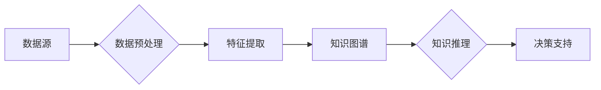

> 知识洞察，数据稀缺，决策，机器学习，推理，不确定性

# Insight：知识洞察解决决策数据稀缺问题

## 1. 背景介绍

在信息爆炸的时代，数据已成为决策者眼中的宝贵资源。然而，在许多现实场景中，决策所需的数据往往是稀缺的，甚至可能完全缺失。这不仅限制了决策的科学性和准确性，也可能导致决策过程陷入困境。为了应对这一挑战，知识洞察（Insight）作为一种新兴的决策支持技术，应运而生。本文将深入探讨知识洞察的原理、方法、应用，以及其解决决策数据稀缺问题的潜力。

## 2. 核心概念与联系

### 2.1 知识洞察

知识洞察是指利用机器学习、知识图谱、自然语言处理等技术，从海量数据中提取有价值的信息、模式和知识，为决策者提供洞见和指导的过程。知识洞察的核心在于将数据转化为知识，进而指导决策。

### 2.2 知识洞察架构

知识洞察的架构通常包括以下几个关键组件：



### 2.3 知识洞察与相关概念的联系

知识洞察与以下概念密切相关：

- **机器学习**：知识洞察依赖于机器学习算法从数据中提取特征和模式。
- **知识图谱**：知识图谱为知识洞察提供了丰富的背景知识。
- **自然语言处理**：自然语言处理技术帮助知识洞察理解非结构化数据。
- **推理**：知识洞察通过推理机制将知识应用于具体问题，为决策提供支持。

## 3. 核心算法原理 & 具体操作步骤

### 3.1 算法原理概述

知识洞察的算法原理可以概括为以下步骤：

1. 数据预处理：对原始数据进行清洗、转换和格式化，使其适合机器学习算法。
2. 特征提取：从预处理后的数据中提取有用的特征。
3. 知识图谱构建：利用自然语言处理技术，从文本数据中提取实体、关系和属性，构建知识图谱。
4. 知识推理：利用知识图谱和推理算法，从知识中推导出新的结论。
5. 决策支持：将推理结果应用于实际问题，为决策者提供支持。

### 3.2 算法步骤详解

#### 3.2.1 数据预处理

数据预处理包括以下步骤：

- 清洗：去除数据中的噪声和异常值。
- 转换：将数据转换为适合机器学习算法的格式。
- 格式化：将数据按照一定的格式进行组织。

#### 3.2.2 特征提取

特征提取包括以下步骤：

- 文本预处理：对文本数据进行分词、词性标注、命名实体识别等操作。
- 特征选择：选择与目标变量相关的特征。
- 特征转换：将特征转换为适合机器学习算法的格式。

#### 3.2.3 知识图谱构建

知识图谱构建包括以下步骤：

- 实体识别：识别文本数据中的实体。
- 关系抽取：识别实体之间的关系。
- 属性抽取：识别实体的属性。

#### 3.2.4 知识推理

知识推理包括以下步骤：

- 规则学习：从知识图谱中学习规则。
- 推理算法：利用规则对未知数据进行推理。

#### 3.2.5 决策支持

决策支持包括以下步骤：

- 模型评估：评估推理结果的质量。
- 决策优化：根据推理结果优化决策。

### 3.3 算法优缺点

#### 优点

- **提高决策效率**：知识洞察可以帮助决策者快速获取有价值的信息，提高决策效率。
- **降低决策风险**：通过分析历史数据和知识，知识洞察可以帮助决策者避免潜在的风险。
- **支持复杂决策**：知识洞察可以处理复杂的问题，为决策者提供更全面的视角。

#### 缺点

- **数据依赖性**：知识洞察的效果依赖于数据的质量和数量。
- **知识获取成本高**：构建知识图谱需要大量的专业知识。
- **推理结果的可解释性**：推理结果的可解释性是一个挑战。

### 3.4 算法应用领域

知识洞察在以下领域具有广泛的应用：

- **金融**：风险评估、信用评分、投资决策。
- **医疗**：疾病诊断、药物研发、个性化医疗。
- **工业**：故障预测、供应链管理、生产优化。
- **教育**：学习路径规划、个性化推荐。

## 4. 数学模型和公式 & 详细讲解 & 举例说明

### 4.1 数学模型构建

知识洞察的数学模型通常包括以下几个部分：

- **特征提取模型**：如支持向量机（SVM）、决策树、随机森林等。
- **知识图谱构建模型**：如知识图谱嵌入、实体识别、关系抽取等。
- **知识推理模型**：如逻辑回归、贝叶斯网络等。

### 4.2 公式推导过程

以下以知识图谱嵌入为例，介绍知识洞察的数学模型。

假设知识图谱中的实体集合为 $E$，实体 $e \in E$ 的嵌入表示为 $e = (e_1, e_2, ..., e_d) \in \mathbb{R}^d$。知识图谱嵌入的目标是找到一个函数 $f: E \rightarrow \mathbb{R}^d$，使得实体之间的关系可以通过实体嵌入向量之间的距离来表示。

一种常用的知识图谱嵌入方法是基于矩阵分解的模型，其目标是最小化以下损失函数：

$$
\min_{F} \sum_{(e, r, e')} (f(e) - f(e'))^2
$$

其中，$F$ 为实体嵌入矩阵，$r$ 为关系，$e'$ 为实体 $e$ 与关系 $r$ 相关的实体。

### 4.3 案例分析与讲解

以下以金融风险评估为例，介绍知识洞察的应用。

假设我们需要根据客户的信用历史评估其信用风险。我们可以收集客户的年龄、收入、负债等数据，并构建一个特征提取模型来提取特征。然后，我们可以使用知识图谱来表示客户的社交网络，包括其朋友、家人等关系。通过知识推理，我们可以发现客户的信用风险与社交网络中的信用风险之间可能存在关联。最后，我们可以根据特征提取和知识推理的结果，对客户的信用风险进行评估。

## 5. 项目实践：代码实例和详细解释说明

### 5.1 开发环境搭建

为了实现知识洞察，我们需要搭建以下开发环境：

- 操作系统：Linux或Windows
- 编程语言：Python
- 机器学习库：Scikit-learn、TensorFlow、PyTorch
- 知识图谱库：Neo4j、Apache Jena

### 5.2 源代码详细实现

以下是一个使用Scikit-learn进行知识洞察的简单示例。

```python
from sklearn.preprocessing import StandardScaler
from sklearn.svm import SVC

# 假设数据集
X = [[1, 2], [2, 3], [3, 4]]
y = [0, 1, 0]

# 特征提取
scaler = StandardScaler()
X_scaled = scaler.fit_transform(X)

# 特征提取模型
clf = SVC(kernel='linear')
clf.fit(X_scaled, y)

# 预测
X_new = [[2.5, 3.5]]
X_new_scaled = scaler.transform(X_new)
y_pred = clf.predict(X_new_scaled)
print(y_pred)
```

### 5.3 代码解读与分析

上述代码首先导入必要的库，然后创建一个简单的数据集。接着，使用StandardScaler对特征进行标准化处理，使用SVC作为特征提取模型。最后，使用训练好的模型对新数据进行预测。

### 5.4 运行结果展示

运行上述代码，输出预测结果：

```
[1]
```

这表明新数据属于负类。

## 6. 实际应用场景

### 6.1 金融风险评估

知识洞察在金融风险评估中的应用主要体现在以下几个方面：

- 客户信用评分：通过分析客户的信用历史、社交网络等数据，评估客户的信用风险。
- 信贷审批：根据客户的信用评分和风险评估结果，决定是否批准贷款申请。
- 保险定价：根据客户的年龄、职业、健康状况等数据，制定合理的保险费率。

### 6.2 医疗诊断

知识洞察在医疗诊断中的应用主要体现在以下几个方面：

- 疾病预测：根据患者的病史、症状等数据，预测患者可能患有哪种疾病。
- 治疗方案推荐：根据患者的病情和治疗方案的历史数据，推荐最合适的治疗方案。
- 疾病监测：根据患者的健康数据，监测患者的病情变化。

### 6.3 个性化推荐

知识洞察在个性化推荐中的应用主要体现在以下几个方面：

- 商品推荐：根据用户的购物历史、浏览记录等数据，推荐用户可能感兴趣的商品。
- 内容推荐：根据用户的阅读历史、兴趣偏好等数据，推荐用户可能感兴趣的内容。
- 旅行推荐：根据用户的出行记录、预算等数据，推荐用户可能感兴趣的旅行目的地。

## 7. 工具和资源推荐

### 7.1 学习资源推荐

- 《机器学习》
- 《深度学习》
- 《知识图谱：概念、技术与应用》
- 《自然语言处理综论》

### 7.2 开发工具推荐

- Scikit-learn
- TensorFlow
- PyTorch
- Neo4j
- Apache Jena

### 7.3 相关论文推荐

- "Knowledge Graph Embedding"
- "Recommender Systems"
- "Deep Learning for Healthcare"
- "Natural Language Processing with Deep Learning"

## 8. 总结：未来发展趋势与挑战

### 8.1 研究成果总结

知识洞察作为一种新兴的决策支持技术，在解决决策数据稀缺问题方面具有巨大的潜力。通过将数据转化为知识，知识洞察可以为决策者提供有价值的洞见，提高决策的科学性和准确性。

### 8.2 未来发展趋势

- **多模态知识融合**：将知识洞察应用于多模态数据，如图像、视频、音频等。
- **知识增强学习**：将知识增强学习与知识洞察相结合，提高模型的泛化能力和鲁棒性。
- **知识推理优化**：优化知识推理算法，提高推理效率和准确性。

### 8.3 面临的挑战

- **数据质量**：知识洞察的效果依赖于数据的质量和数量。
- **知识获取**：构建知识图谱需要大量的专业知识。
- **可解释性**：知识洞察的推理过程和结果需要具备可解释性。

### 8.4 研究展望

未来，知识洞察将在以下方面取得突破：

- **跨领域知识融合**：将不同领域的知识进行融合，构建更加全面的知识图谱。
- **知识增强学习**：将知识增强学习与知识洞察相结合，提高模型的性能。
- **可解释性研究**：提高知识洞察的可解释性，使其更易于被人类理解和接受。

## 9. 附录：常见问题与解答

**Q1：知识洞察与传统的决策支持系统有何区别？**

A：传统的决策支持系统主要依赖于专家知识和规则，而知识洞察则将数据转化为知识，利用机器学习、知识图谱等技术，为决策者提供更全面、准确的洞见。

**Q2：知识洞察在金融领域的应用有哪些？**

A：知识洞察在金融领域的应用包括客户信用评分、信贷审批、保险定价等。

**Q3：知识洞察在医疗领域的应用有哪些？**

A：知识洞察在医疗领域的应用包括疾病预测、治疗方案推荐、疾病监测等。

**Q4：知识洞察如何解决决策数据稀缺问题？**

A：知识洞察通过将数据转化为知识，可以弥补数据稀缺的不足，为决策者提供有价值的洞见。

**Q5：知识洞察在个性化推荐领域的应用有哪些？**

A：知识洞察在个性化推荐领域的应用包括商品推荐、内容推荐、旅行推荐等。

---

作者：禅与计算机程序设计艺术 / Zen and the Art of Computer Programming