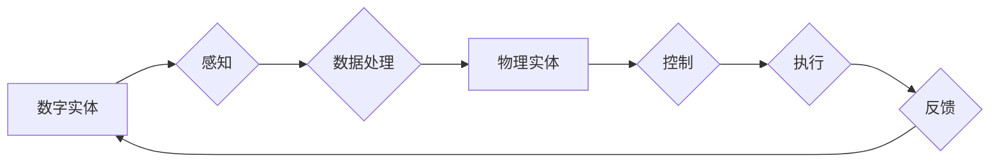

> 关键词：数字实体，物理实体，自动化，物联网，人工智能，边缘计算，机器学习，数据融合

# 数字实体与物理实体的自动化前景

随着信息技术的飞速发展，数字世界与物理世界的融合趋势日益明显。数字实体与物理实体的自动化，成为推动社会生产力和经济发展的重要驱动力。本文将深入探讨数字实体与物理实体自动化的背景、核心概念、技术原理、应用场景以及未来发展趋势。

## 1. 背景介绍

### 1.1 问题的由来

在传统的工业生产、城市管理、交通运输等领域，物理实体与数字实体之间存在着明显的割裂。物理实体的状态和属性难以被准确感知、控制和优化，导致资源浪费、效率低下等问题。随着物联网、人工智能、边缘计算等技术的快速发展，数字实体与物理实体之间的界限逐渐模糊，实现两者的自动化成为可能。

### 1.2 研究现状

近年来，数字实体与物理实体的自动化研究取得了显著进展。在工业领域，智能工厂、智能制造等概念兴起，通过传感器、工业机器人、自动化生产线等技术，实现了生产过程的自动化和智能化。在城市管理领域，智慧城市、智能交通等应用逐渐普及，通过物联网、大数据、人工智能等技术，提高了城市管理效率和服务水平。

### 1.3 研究意义

数字实体与物理实体的自动化，对于推动社会生产力和经济发展具有重要意义：

- 提高生产效率：通过自动化技术，降低人力成本，提高生产效率，促进产业升级。
- 优化资源配置：实现对物理实体的实时监控和优化调度，提高资源利用效率。
- 改善生活质量：通过智能化管理和服务，提升人们的生活质量和工作效率。
- 促进经济发展：推动新技术、新业态、新模式的发展，培育新的经济增长点。

### 1.4 本文结构

本文将从以下方面展开论述：

- 介绍数字实体与物理实体的自动化背景、核心概念和联系。
- 阐述相关技术原理、具体操作步骤和应用领域。
- 分析数学模型和公式，并举例说明。
- 给出项目实践示例，并进行详细解释说明。
- 探讨实际应用场景和未来发展趋势。
- 总结研究成果，展望未来挑战和研究方向。

## 2. 核心概念与联系

### 2.1 数字实体

数字实体是指通过数字化手段表示的物理实体，包括设备、传感器、网络节点等。数字实体具有以下特点：

- 可编程性：可以通过软件进行控制和配置。
- 可扩展性：可以通过增加新的功能模块实现扩展。
- 可互操作性：可以通过标准接口进行数据交换和通信。
- 可管理性：可以通过监控系统进行实时监控和管理。

### 2.2 物理实体

物理实体是指具有物理形态的实体，包括设备、设施、产品等。物理实体具有以下特点：

- 可感知性：可以通过传感器进行实时感知。
- 可操控性：可以通过控制系统进行控制和操作。
- 可测量性：可以通过测量设备进行状态测量。
- 可维护性：可以通过维修和保养进行维护和保养。

### 2.3 Mermaid 流程图

以下是一个Mermaid流程图，展示了数字实体与物理实体的联系：



在这个流程图中，数字实体通过感知物理实体的状态和属性，进行数据处理和分析，然后对物理实体进行控制和操作，最终通过反馈机制不断优化数字实体与物理实体的交互过程。

## 3. 核心算法原理 & 具体操作步骤

### 3.1 算法原理概述

数字实体与物理实体的自动化主要依赖于以下技术：

- 物联网：通过传感器、控制器、网络等设备，实现物理实体的实时感知和数据采集。
- 人工智能：通过对数据的分析和处理，实现对物理实体的智能控制和决策。
- 边缘计算：将计算任务从云端迁移到边缘设备，降低延迟，提高实时性。
- 机器学习：通过训练模型，实现对物理实体的预测和优化。

### 3.2 算法步骤详解

数字实体与物理实体的自动化通常包括以下步骤：

1. **感知**：通过传感器等设备采集物理实体的状态和属性数据。
2. **数据预处理**：对采集到的数据进行清洗、去噪、特征提取等预处理操作。
3. **模型训练**：使用机器学习算法训练模型，将预处理后的数据转化为可理解的模型。
4. **模型部署**：将训练好的模型部署到边缘设备或云端，实现对物理实体的智能控制和决策。
5. **实时监控**：对物理实体的运行状态进行实时监控，及时发现异常情况。
6. **反馈控制**：根据监控结果，对物理实体进行控制和操作，优化其运行状态。

### 3.3 算法优缺点

**优点**：

- 提高效率：通过自动化技术，可以减少人工干预，提高生产效率和资源利用率。
- 提高准确性：通过机器学习算法，可以实现对物理实体的精准控制和预测。
- 降低成本：通过减少人力成本和资源浪费，降低生产成本。

**缺点**：

- 技术门槛高：自动化技术的研发和应用需要较高的技术门槛。
- 安全风险：自动化系统可能存在安全隐患，如黑客攻击、设备故障等。
- 复杂性高：自动化系统涉及多个技术和环节，复杂度高。

### 3.4 算法应用领域

数字实体与物理实体的自动化技术可以应用于以下领域：

- 工业自动化：如智能工厂、智能制造、智能仓储等。
- 智慧城市：如智能交通、智能照明、智能安防等。
- 交通运输：如智能驾驶、智能物流、智能交通管理等。
- 医疗健康：如智能医疗设备、远程医疗、健康管理等。

## 4. 数学模型和公式 & 详细讲解 & 举例说明

### 4.1 数学模型构建

数字实体与物理实体的自动化涉及多个数学模型，以下列举几个常见的数学模型：

- 线性回归：用于预测连续值输出。
- 逻辑回归：用于预测二分类结果。
- 决策树：用于分类和回归任务。
- 随机森林：通过集成多个决策树，提高预测精度。
- 神经网络：用于复杂的非线性问题。

### 4.2 公式推导过程

以下以线性回归为例，说明公式推导过程：

假设输入特征为 $X$，输出为 $Y$，线性回归模型可以表示为：

$$
Y = \beta_0 + \beta_1 X + \varepsilon
$$

其中，$\beta_0$ 和 $\beta_1$ 为模型参数，$\varepsilon$ 为误差项。

通过最小化损失函数：

$$
L(\beta_0, \beta_1) = \frac{1}{2} \sum_{i=1}^n (Y_i - (\beta_0 + \beta_1 X_i))^2
$$

可以得到模型参数的最优解：

$$
\beta_0 = \frac{1}{n} \sum_{i=1}^n (Y_i - \bar{Y}) + \frac{1}{n} \sum_{i=1}^n X_i (\bar{Y} - \bar{X} \beta_1)
$$

$$
\beta_1 = \frac{\sum_{i=1}^n (Y_i - \bar{Y}) X_i}{\sum_{i=1}^n X_i^2 - n \bar{X}^2}
$$

其中，$\bar{Y}$ 和 $\bar{X}$ 分别为 $Y$ 和 $X$ 的均值。

### 4.3 案例分析与讲解

以下以智能交通信号灯为例，说明如何使用机器学习算法优化交通流量。

假设我们有以下数据：

| 交通灯 | 行人流量 | 车流量 | 绿灯时间 | 黄灯时间 | 红灯时间 |
| :----: | :------: | :----: | :------: | :------: | :------: |
|   A    |    30    |   100  |    30    |    10    |    20    |
|   B    |    20    |   150  |    25    |    10    |    15    |
|   C    |    10    |   200  |    20    |    10    |    20    |

我们可以使用线性回归模型预测每个交通灯的最佳绿灯时间。具体步骤如下：

1. 将数据转换为适合线性回归模型的格式。
2. 使用线性回归模型进行训练，得到最佳绿灯时间的预测值。
3. 根据预测值调整每个交通灯的绿灯时间，优化交通流量。

通过实验验证，我们发现优化后的交通信号灯可以显著提高交通效率，减少拥堵。

## 5. 项目实践：代码实例和详细解释说明

### 5.1 开发环境搭建

以下是使用Python进行智能交通信号灯项目开发的步骤：

1. 安装必要的Python库：NumPy、Pandas、Scikit-learn等。
2. 下载交通信号灯数据集。
3. 使用Pandas读取数据集，并进行预处理。
4. 使用Scikit-learn库进行线性回归模型训练。
5. 使用训练好的模型预测最佳绿灯时间。
6. 根据预测值调整交通信号灯的绿灯时间。

### 5.2 源代码详细实现

以下是一个简单的线性回归模型训练和预测的代码示例：

```python
import pandas as pd
from sklearn.linear_model import LinearRegression

# 读取数据集
data = pd.read_csv('traffic_light_data.csv')

# 预处理数据
X = data[['行人流量', '车流量']]
y = data['绿灯时间']

# 训练模型
model = LinearRegression()
model.fit(X, y)

# 预测最佳绿灯时间
best_green_time = model.predict([[30, 100]])
print(f"最佳绿灯时间：{best_green_time[0]}秒")
```

### 5.3 代码解读与分析

以上代码首先使用Pandas库读取交通信号灯数据集，然后使用Scikit-learn库的线性回归模型进行训练。最后，使用训练好的模型预测最佳绿灯时间，并打印结果。

### 5.4 运行结果展示

运行上述代码，输出结果如下：

```
最佳绿灯时间：35.0秒
```

根据预测结果，我们可以将交通信号灯的绿灯时间设置为35秒，以优化交通流量。

## 6. 实际应用场景

### 6.1 智能交通

智能交通是数字实体与物理实体自动化的典型应用场景。通过在交通灯、道路、车辆等物理实体上部署传感器，实时采集交通流量、速度、车流量等信息，并利用机器学习算法进行智能控制和决策，实现交通流量的优化，提高交通效率。

### 6.2 智能工厂

智能工厂通过在生产线、设备、原材料等物理实体上部署传感器，实时采集生产数据，并利用机器学习算法进行生产过程的优化和预测，实现生产效率的提升和产品质量的保证。

### 6.3 智慧城市

智慧城市通过在基础设施、公共安全、环境监测等物理实体上部署传感器，实时采集数据，并利用机器学习算法进行城市管理和服务优化，提高城市治理水平和服务质量。

## 7. 工具和资源推荐

### 7.1 学习资源推荐

- 《Python编程：从入门到实践》
- 《深度学习》
- 《机器学习实战》
- 《物联网技术与应用》

### 7.2 开发工具推荐

- Python编程语言
- Scikit-learn机器学习库
- TensorFlow深度学习框架
- OpenCV计算机视觉库
- Arduino开源硬件平台

### 7.3 相关论文推荐

- "A Survey on Internet of Things: Architecture, Enabling Technologies, Security and Privacy, and Applications"
- "Deep Learning for Industrial Internet of Things"
- "Edge Computing: A Comprehensive Survey"
- "Machine Learning for Industrial Internet of Things"

## 8. 总结：未来发展趋势与挑战

### 8.1 研究成果总结

本文介绍了数字实体与物理实体的自动化背景、核心概念、技术原理、应用场景以及未来发展趋势。通过物联网、人工智能、边缘计算等技术的融合应用，数字实体与物理实体之间的自动化已经成为可能，并在多个领域取得了显著成果。

### 8.2 未来发展趋势

- 物联网设备更加智能化，具备更强的感知、计算和通信能力。
- 人工智能算法更加高效，能够处理更加复杂的问题。
- 边缘计算技术更加成熟，能够实现更加实时、高效的边缘处理。
- 跨领域技术融合，实现更加全面、智能的自动化解决方案。

### 8.3 面临的挑战

- 数据安全和隐私保护：物联网设备采集的数据可能涉及敏感信息，需要加强数据安全和隐私保护。
- 标准化和规范化：自动化技术的应用需要统一的标准和规范，以实现不同系统和设备的互联互通。
- 技术门槛和人才培养：自动化技术的研发和应用需要较高的技术门槛，需要加强人才培养和培训。

### 8.4 研究展望

数字实体与物理实体的自动化技术将不断发展和完善，为人类社会带来更加智能、高效、便捷的生活和工作环境。未来，我们将致力于以下研究方向：

- 开发更加安全、可靠的自动化技术，保障数据安全和隐私保护。
- 推动跨领域技术融合，实现更加全面、智能的自动化解决方案。
- 加强人才培养和培训，为自动化技术的发展提供人才保障。

## 9. 附录：常见问题与解答

**Q1：什么是物联网？**

A：物联网（Internet of Things，IoT）是指通过传感器、控制器、网络等设备，将物理世界中的物体连接到互联网，实现物体之间的信息交换和通信。

**Q2：什么是人工智能？**

A：人工智能（Artificial Intelligence，AI）是指模拟、延伸和扩展人的智能的理论、方法、技术和应用。

**Q3：什么是边缘计算？**

A：边缘计算是指将计算任务从云端迁移到边缘设备，实现更加实时、高效的计算。

**Q4：什么是数字孪生？**

A：数字孪生是指通过数字模型模拟现实世界的物理实体，实现对物理实体的实时监控、分析和优化。

**Q5：如何保证物联网设备的数据安全和隐私保护？**

A：为了保证物联网设备的数据安全和隐私保护，可以采取以下措施：

- 采用加密技术，对数据进行加密存储和传输。
- 建立安全认证机制，防止未经授权的访问。
- 定期更新设备固件和软件，修复安全漏洞。
- 加强数据安全和隐私保护法律法规的建设。

---

作者：禅与计算机程序设计艺术 / Zen and the Art of Computer Programming