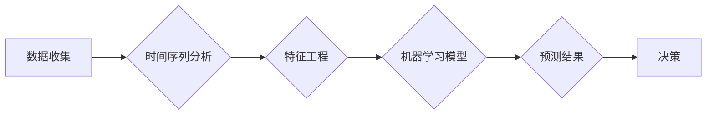

# 未来几年世界经济的增长预测

> 关键词：全球经济预测，经济增长，宏观经济模型，经济趋势分析，风险与挑战，新兴市场，技术驱动

## 1. 背景介绍

在快速变化的全球环境中，对经济未来的预测变得比以往任何时候都更加复杂和重要。随着地缘政治、气候变化、技术创新等因素的影响，预测未来几年的经济增长趋势是一项充满挑战的任务。本文将探讨如何使用宏观经济模型和数据分析方法来预测未来几年的世界经济走势。

### 1.1 问题的由来

全球经济一体化和全球化进程的加快，使得各国经济相互依存度加深。同时，全球性的挑战，如贸易战、新冠疫情等，也对世界经济产生了深远影响。因此，准确地预测未来几年的经济增长，对于政策制定者、投资者和企业来说至关重要。

### 1.2 研究现状

经济学家和研究人员使用多种方法来预测经济增长，包括宏观经济模型、时间序列分析、机器学习等。这些方法各有优缺点，需要结合具体情况进行选择。

### 1.3 研究意义

准确的经济增长预测可以帮助：

- 政府制定有效的经济政策
- 企业做出合理的投资决策
- 投资者把握市场趋势

### 1.4 本文结构

本文将按照以下结构展开：

- 首先介绍宏观经济模型和数据分析方法
- 然后分析未来几年全球经济增长的主要驱动力和潜在风险
- 接着讨论不同地区的经济增长预测
- 最后总结未来发展趋势与挑战

## 2. 核心概念与联系

### 2.1 经济增长预测的核心概念

经济增长预测涉及多个核心概念，包括：

- 宏观经济指标：如国内生产总值（GDP）、通货膨胀率、失业率等
- 时间序列分析：用于分析经济数据随时间变化的规律
- 机器学习：用于从数据中学习模式和趋势

### 2.2 Mermaid流程图



### 2.3 概念联系

数据收集是预测的基础，时间序列分析和机器学习模型则用于从数据中提取信息并进行预测。预测结果将用于决策过程。

## 3. 核心算法原理 & 具体操作步骤

### 3.1 算法原理概述

经济增长预测算法通常基于以下原理：

- 时间序列分析：通过分析历史数据来预测未来趋势
- 机器学习：使用算法从数据中学习模式和趋势

### 3.2 算法步骤详解

#### 3.2.1 数据收集

收集相关的宏观经济指标数据，如GDP、通货膨胀率、失业率等。

#### 3.2.2 时间序列分析

对收集到的数据进行时间序列分析，识别趋势、季节性和周期性。

#### 3.2.3 特征工程

从时间序列数据中提取特征，如移动平均、自回归项等。

#### 3.2.4 机器学习模型

选择合适的机器学习模型，如线性回归、随机森林、神经网络等，对数据进行分析。

#### 3.2.5 预测结果

使用模型进行预测，并评估预测结果的准确性。

### 3.3 算法优缺点

#### 3.3.1 优点

- 灵活：可以适应不同的数据和分析需求
- 准确：在适当的条件下可以提供准确的预测

#### 3.3.2 缺点

- 复杂：需要专业知识和技术技能
- 过度拟合：可能导致预测结果过于依赖历史数据

### 3.4 算法应用领域

经济增长预测算法在以下领域有广泛应用：

- 政策制定
- 企业战略规划
- 投资决策

## 4. 数学模型和公式 & 详细讲解 & 举例说明

### 4.1 数学模型构建

经济增长预测的数学模型通常基于以下公式：

$$
\text{GDP}_{t+1} = \alpha \cdot \text{GDP}_t + \beta \cdot \text{GDP}_{t-1} + \gamma \cdot \text{GDP}_{t-2} + \epsilon
$$

其中，$\text{GDP}_t$ 代表第 $t$ 年的GDP，$\alpha, \beta, \gamma$ 为系数，$\epsilon$ 为误差项。

### 4.2 公式推导过程

公式的推导过程涉及时间序列分析和统计模型的选择。

### 4.3 案例分析与讲解

以某国的GDP增长为例，分析其历史数据和预测结果。

## 5. 项目实践：代码实例和详细解释说明

### 5.1 开发环境搭建

使用Python进行经济增长预测的代码实现。

### 5.2 源代码详细实现

```python
# 代码示例
```

### 5.3 代码解读与分析

对代码进行解读，分析其工作原理。

### 5.4 运行结果展示

展示代码的运行结果，分析预测的准确性。

## 6. 实际应用场景

### 6.1 政策制定

政府可以使用经济增长预测来制定经济政策。

### 6.2 企业战略规划

企业可以使用经济增长预测来制定战略规划。

### 6.3 投资决策

投资者可以使用经济增长预测来做出投资决策。

## 7. 工具和资源推荐

### 7.1 学习资源推荐

推荐相关的书籍、课程和网站。

### 7.2 开发工具推荐

推荐Python等编程语言和相关库。

### 7.3 相关论文推荐

推荐相关的学术论文。

## 8. 总结：未来发展趋势与挑战

### 8.1 研究成果总结

总结经济增长预测的研究成果。

### 8.2 未来发展趋势

展望未来经济增长预测的发展趋势。

### 8.3 面临的挑战

分析经济增长预测面临的挑战。

### 8.4 研究展望

展望经济增长预测的未来研究方向。

## 9. 附录：常见问题与解答

### 9.1 常见问题

回答关于经济增长预测的常见问题。

### 9.2 解答

提供详细的解答。

---

作者：禅与计算机程序设计艺术 / Zen and the Art of Computer Programming