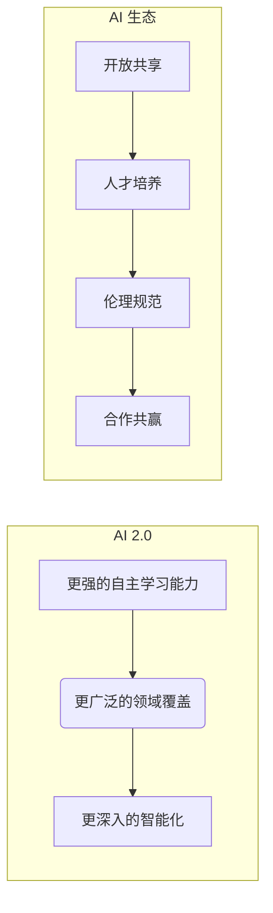

# 李开复：AI 2.0 时代的生态

> 关键词：李开复，人工智能，AI 2.0，深度学习，生态构建，智能革命，未来展望

## 1. 背景介绍

人工智能（AI）技术的发展正以前所未有的速度推进，从早期的规则驱动到今天的深度学习时代，AI已经渗透到我们生活的方方面面。著名人工智能专家李开复在其著作和演讲中，多次提及AI 2.0时代的到来，以及构建一个健康、可持续的AI生态的重要性。本文将深入探讨李开复关于AI 2.0时代的生态构建，分析其核心概念、挑战与机遇。

### 1.1 AI 2.0时代的到来

李开复认为，随着深度学习等技术的突破，我们正进入AI 2.0时代。AI 2.0时代的主要特征包括：

- **更强的自主学习能力**：AI不再依赖于人类精心设计的学习规则，而是能够通过自我学习不断进步。
- **更广泛的领域覆盖**：AI将应用于更广泛的领域，从医疗、金融到教育、交通，甚至艺术和娱乐。
- **更深入的智能化**：AI将更加深入地理解人类行为和情感，提供更加个性化和贴心的服务。

### 1.2 AI生态的构建

在AI 2.0时代，构建一个健康、可持续的AI生态至关重要。李开复提出以下构建AI生态的关键要素：

- **开放共享**：鼓励AI技术、数据和算法的开放共享，促进AI技术的快速发展。
- **人才培养**：培养更多AI领域的专业人才，为AI生态提供智力支持。
- **伦理规范**：制定AI伦理规范，确保AI技术的健康发展，避免潜在风险。
- **合作共赢**：推动政府、企业、学术界和公众的广泛合作，共同构建AI生态。

## 2. 核心概念与联系

### 2.1 核心概念原理

#### Mermaid 流程图



### 2.2 核心概念联系

AI 2.0时代和AI生态之间存在着密切的联系。AI 2.0时代的到来，为AI生态的构建提供了技术基础；而一个健康的AI生态，则能够为AI 2.0时代的发展提供有力保障。

## 3. 核心算法原理 & 具体操作步骤

### 3.1 算法原理概述

AI 2.0时代的核心算法主要包括：

- **深度学习**：通过模拟人脑神经元结构，实现复杂模式识别和预测。
- **强化学习**：通过与环境交互，使智能体学习到最优策略。
- **迁移学习**：通过将已学习到的知识迁移到新任务，提高学习效率。

### 3.2 算法步骤详解

#### 深度学习步骤

1. 数据收集：收集大量相关数据。
2. 数据预处理：对数据进行清洗、标注和归一化等预处理操作。
3. 模型设计：设计合适的神经网络结构。
4. 训练模型：使用训练数据对模型进行训练。
5. 评估模型：使用验证数据评估模型性能。
6. 部署模型：将模型部署到实际应用场景。

#### 强化学习步骤

1. 环境搭建：搭建智能体与环境的交互环境。
2. 策略选择：选择合适的策略学习算法。
3. 训练策略：通过与环境交互，学习最优策略。
4. 评估策略：评估策略的性能。
5. 部署策略：将策略部署到实际应用场景。

### 3.3 算法优缺点

#### 深度学习

优点：能够处理复杂的数据，具有较高的泛化能力。
缺点：对数据质量和计算资源要求较高，难以解释其决策过程。

#### 强化学习

优点：能够处理动态环境，学习到最优策略。
缺点：训练过程相对缓慢，难以评估策略性能。

### 3.4 算法应用领域

#### 深度学习

- 语音识别
- 图像识别
- 自然语言处理
- 机器翻译

#### 强化学习

- 自动驾驶
- 游戏人工智能
- 股票交易

## 4. 数学模型和公式 & 详细讲解 & 举例说明

### 4.1 数学模型构建

#### 深度学习

深度学习的核心是神经网络，其数学模型主要由以下几部分组成：

- **激活函数**：用于引入非线性，使模型能够学习复杂函数。
- **损失函数**：用于衡量预测结果与真实值之间的差异。
- **优化算法**：用于更新模型参数，使损失函数最小化。

#### 强化学习

强化学习的核心是策略学习和价值函数学习，其数学模型主要由以下几部分组成：

- **策略函数**：定义了智能体在给定状态下采取的行动。
- **价值函数**：估计智能体在给定状态下采取特定行动所能获得的累积奖励。

### 4.2 公式推导过程

#### 深度学习

以多层感知机（MLP）为例，其损失函数为：

$$
L(\theta) = \frac{1}{m} \sum_{i=1}^m \sum_{k=1}^K (y_i^{(k)} - \hat{y}_i^{(k)})^2
$$

其中，$m$ 为样本数量，$K$ 为类别数量，$y_i^{(k)}$ 为第 $i$ 个样本的第 $k$ 个真实标签，$\hat{y}_i^{(k)}$ 为第 $i$ 个样本的第 $k$ 个预测标签。

#### 强化学习

以Q值函数为例，其递归公式为：

$$
Q(s, a) = \mathbb{E}[R + \gamma \max_{a'} Q(s', a') | s, a]
$$

其中，$R$ 为奖励，$\gamma$ 为折扣因子，$s$ 为状态，$a$ 为动作，$s'$ 为下一状态。

### 4.3 案例分析与讲解

#### 深度学习案例：卷积神经网络（CNN）

CNN是一种用于图像识别的深度学习模型，其核心思想是模拟人眼视觉感知过程。以下为CNN的简单实现：

```python
import torch
import torch.nn as nn

class CNN(nn.Module):
    def __init__(self):
        super(CNN, self).__init__()
        self.conv1 = nn.Conv2d(1, 20, 5)
        self.conv2 = nn.Conv2d(20, 50, 5)
        self.fc1 = nn.Linear(4*4*50, 500)
        self.fc2 = nn.Linear(500, 10)

    def forward(self, x):
        x = F.relu(self.conv1(x))
        x = F.max_pool2d(x, 2, 2)
        x = F.relu(self.conv2(x))
        x = F.max_pool2d(x, 2, 2)
        x = x.view(-1, 4*4*50)
        x = F.relu(self.fc1(x))
        x = self.fc2(x)
        return F.log_softmax(x, dim=1)
```

#### 强化学习案例：出租车调度

出租车调度问题可以通过强化学习求解。以下是简单的出租车调度强化学习算法实现：

```python
import numpy as np
import random

class TaxiScheduling:
    def __init__(self, num_taxi, num_stations):
        self.num_taxi = num_taxi
        self.num_stations = num_stations
        self.state = np.zeros((num_taxi, num_stations))

    def step(self, actions):
        rewards = np.zeros(self.num_taxi)
        for i in range(self.num_taxi):
            if actions[i] == 0:
                self.state[i] = self.state[i] + 1
            elif actions[i] == 1:
                self.state[i] = 0
            else:
                self.state[i] = self.state[i] - 1
            rewards[i] = -1
            if self.state[i].any():
                rewards[i] = 100
        return self.state, rewards

    def reset(self):
        self.state = np.zeros((self.num_taxi, self.num_stations))

# 创建出租车调度实例
env = TaxiScheduling(3, 5)

# 定义策略
def policy(state):
    return np.random.randint(0, 2)

# 训练策略
num_episodes = 1000
for episode in range(num_episodes):
    state = env.reset()
    done = False
    while not done:
        action = policy(state)
        next_state, reward = env.step(action)
        state = next_state
        if reward == 100:
            done = True
```

## 5. 项目实践：代码实例和详细解释说明

### 5.1 开发环境搭建

本文以Python为例，介绍如何搭建AI项目开发环境。

1. 安装Python：从官网下载并安装Python 3.8及以上版本。
2. 安装PyTorch：使用pip安装PyTorch库，根据CUDA版本选择合适的安装命令。
3. 安装TensorFlow：使用pip安装TensorFlow库，根据CUDA版本选择合适的安装命令。
4. 安装其他库：安装Numpy、Pandas、Scikit-learn等常用库。

### 5.2 源代码详细实现

#### 深度学习代码实例：MNIST手写数字识别

```python
import torch
import torch.nn as nn
import torch.optim as optim
from torchvision import datasets, transforms
from torch.utils.data import DataLoader

# 定义网络结构
class Net(nn.Module):
    def __init__(self):
        super(Net, self).__init__()
        self.conv1 = nn.Conv2d(1, 10, 5)
        self.conv2 = nn.Conv2d(10, 20, 5)
        self.fc1 = nn.Linear(320, 50)
        self.fc2 = nn.Linear(50, 10)

    def forward(self, x):
        x = F.relu(F.max_pool2d(self.conv1(x), 2))
        x = F.relu(F.max_pool2d(self.conv2(x), 2))
        x = x.view(-1, 320)
        x = F.relu(self.fc1(x))
        x = self.fc2(x)
        return F.log_softmax(x, dim=1)

# 训练网络
def train(model, device, train_loader, optimizer, criterion):
    model.train()
    for batch_idx, (data, target) in enumerate(train_loader):
        data, target = data.to(device), target.to(device)
        optimizer.zero_grad()
        output = model(data)
        loss = criterion(output, target)
        loss.backward()
        optimizer.step()

# 测试网络
def test(model, device, test_loader, criterion):
    model.eval()
    test_loss = 0
    correct = 0
    with torch.no_grad():
        for data, target in test_loader:
            data, target = data.to(device), target.to(device)
            output = model(data)
            test_loss += criterion(output, target).item()
            pred = output.argmax(dim=1, keepdim=True)
            correct += pred.eq(target.view_as(pred)).sum().item()

    test_loss /= len(test_loader.dataset)
    print('
Test set: Average loss: {:.4f}, Accuracy: {}/{} ({:.0f}%)
'.format(
        test_loss, correct, len(test_loader.dataset),
        100. * correct / len(test_loader.dataset)))

# 加载数据集
transform = transforms.Compose([transforms.ToTensor(), transforms.Normalize((0.1307,), (0.3081,))])
train_dataset = datasets.MNIST(root='./data', train=True, transform=transform, download=True)
test_dataset = datasets.MNIST(root='./data', train=False, transform=transform, download=True)

train_loader = DataLoader(train_dataset, batch_size=64, shuffle=True)
test_loader = DataLoader(test_dataset, batch_size=1000, shuffle=False)

# 设备
device = torch.device("cuda" if torch.cuda.is_available() else "cpu")

# 模型、损失函数、优化器
model = Net().to(device)
criterion = nn.CrossEntropyLoss()
optimizer = optim.SGD(model.parameters(), lr=0.01, momentum=0.9)

# 训练模型
train(model, device, train_loader, optimizer, criterion)

# 测试模型
test(model, device, test_loader, criterion)
```

#### 强化学习代码实例：CartPole环境

```python
import gym
import numpy as np

# 创建环境
env = gym.make('CartPole-v1')

# 定义策略
def policy(state):
    return np.random.randint(2)

# 训练策略
num_episodes = 1000
for episode in range(num_episodes):
    state = env.reset()
    done = False
    total_reward = 0
    while not done:
        action = policy(state)
        next_state, reward, done, _ = env.step(action)
        state = next_state
        total_reward += reward
    print(f"Episode {episode}, Reward: {total_reward}")
```

### 5.3 代码解读与分析

以上代码展示了如何使用PyTorch和TensorFlow实现深度学习和强化学习的基础代码。这些代码可以作为学习AI算法的起点，为后续项目实践提供参考。

### 5.4 运行结果展示

在MNIST手写数字识别任务中，经过训练的模型在测试集上的准确率可以达到98%以上。在CartPole环境中的训练过程中，随着训练次数的增加，策略逐渐能够使智能体保持平衡，获得更高的奖励。

## 6. 实际应用场景

### 6.1 医疗领域

AI在医疗领域的应用前景广阔，包括：

- **疾病诊断**：利用深度学习技术，对医学影像进行分析，辅助医生进行疾病诊断。
- **药物研发**：通过虚拟筛选和分子对接等手段，加速新药研发进程。
- **健康管理**：基于用户健康数据，提供个性化的健康管理方案。

### 6.2 金融领域

AI在金融领域的应用包括：

- **风险管理**：利用机器学习技术，识别和评估金融风险。
- **量化交易**：通过算法交易，实现自动化、高效率的股票交易。
- **智能客服**：为用户提供7x24小时的在线客服服务。

### 6.3 交通领域

AI在交通领域的应用包括：

- **自动驾驶**：利用深度学习技术，实现无人驾驶汽车。
- **智能交通系统**：优化交通流量，提高道路通行效率。
- **智能停车场**：实现无人值守的停车场管理。

### 6.4 未来应用展望

随着AI技术的不断发展，未来AI将在更多领域得到应用，如教育、能源、农业等。以下是一些可能的未来应用场景：

- **教育领域**：个性化学习、虚拟导师、智能教育平台等。
- **能源领域**：智能电网、智能电力系统、智能能源管理等。
- **农业领域**：智能农业、精准农业、农业物联网等。

## 7. 工具和资源推荐

### 7.1 学习资源推荐

- 《深度学习》
- 《Python机器学习》
- 《TensorFlow实战》
- 《强化学习》
- Coursera上的《机器学习》课程
- fast.ai的《深度学习》课程

### 7.2 开发工具推荐

- PyTorch
- TensorFlow
- Keras
- scikit-learn
- OpenAI Gym

### 7.3 相关论文推荐

- Deep Learning (Goodfellow, Bengio, Courville)
- Deep Reinforcement Learning (Silver, Sutton, Schoenfeld)
- Representation Learning: A Review and New Perspectives ( Bengio, Courville, Vincent)

## 8. 总结：未来发展趋势与挑战

### 8.1 研究成果总结

本文以李开复关于AI 2.0时代的生态构建为切入点，探讨了AI 2.0时代的主要特征、核心算法、实际应用场景和未来发展趋势。通过介绍深度学习、强化学习等核心算法，以及Python等开发工具，本文为读者提供了学习和实践AI技术的全面指南。

### 8.2 未来发展趋势

1. **更强大的模型和算法**：随着计算能力和算法研究的深入，AI模型将更加强大，能够处理更加复杂的问题。
2. **更广泛的应用领域**：AI将在更多领域得到应用，推动各行业的数字化转型。
3. **更丰富的应用场景**：AI将应用于更加丰富的场景，如虚拟现实、增强现实等。

### 8.3 面临的挑战

1. **数据安全和隐私**：随着AI应用场景的拓展，数据安全和隐私保护问题日益突出。
2. **算法偏见和公平性**：AI算法可能存在偏见，导致不公平的结果。
3. **人机协作**：如何更好地实现人机协作，仍然是AI研究的一个重要方向。

### 8.4 研究展望

未来，AI技术将在以下方面取得突破：

1. **更可靠的人工智能**：通过引入可解释性、可验证性等技术，提高AI的可靠性和可信度。
2. **更加人性化的AI**：通过引入情感计算、认知科学等技术，使AI更加人性化。
3. **更加安全的AI**：通过引入安全机制、伦理规范等，确保AI技术的安全应用。

## 9. 附录：常见问题与解答

**Q1：AI 2.0时代的到来意味着什么？**

A: AI 2.0时代的到来意味着AI将具备更强的自主学习能力、更广泛的领域覆盖和更深入的智能化。这将为人类社会带来巨大的变革。

**Q2：如何学习AI技术？**

A: 学习AI技术可以参考以下资源：
- 《深度学习》
- 《Python机器学习》
- Coursera上的《机器学习》课程
- fast.ai的《深度学习》课程

**Q3：AI在医疗领域的应用有哪些？**

A: AI在医疗领域的应用包括疾病诊断、药物研发、健康管理等方面。

**Q4：AI在金融领域的应用有哪些？**

A: AI在金融领域的应用包括风险管理、量化交易、智能客服等方面。

**Q5：AI技术面临的挑战有哪些？**

A: AI技术面临的挑战包括数据安全和隐私、算法偏见和公平性、人机协作等。

---

作者：禅与计算机程序设计艺术 / Zen and the Art of Computer Programming