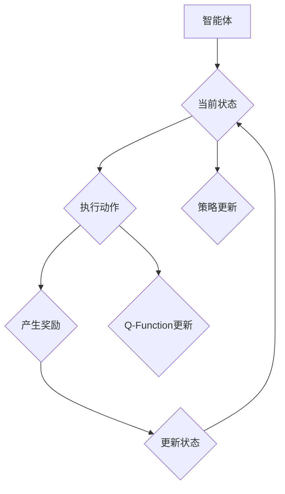

# 深度 Q-learning：利用软件模拟环境进行训练

> 关键词：深度 Q-learning, 强化学习, 软件模拟, 环境设计, 策略优化, 迁移学习, 监督学习, 机器学习

## 1. 背景介绍

强化学习（Reinforcement Learning, RL）是一种机器学习范式，旨在通过学习如何在环境中做出决策以最大化累积奖励。Q-learning 是一种经典的强化学习方法，它通过学习 Q 值函数来预测每个状态-动作对的预期奖励，并据此选择最优动作。随着深度学习技术的快速发展，深度 Q-learning（DQN）应运而生，它结合了深度神经网络（DNN）的强大特征提取能力和 Q-learning 的策略学习机制，成为解决复杂决策问题的重要工具。

本文将深入探讨深度 Q-learning 的原理、实践方法，并介绍如何利用软件模拟环境进行训练，以实现智能体的策略优化。

### 1.1 问题的由来

传统的 Q-learning 在处理高维状态空间时效率低下，难以解决复杂任务。而深度 Q-learning 通过使用深度神经网络来近似 Q 值函数，能够有效处理高维状态空间，并取得显著的性能提升。然而，如何设计有效的软件模拟环境，以及如何优化训练过程，仍然是深度 Q-learning 应用中的关键挑战。

### 1.2 研究现状

近年来，深度 Q-learning 在游戏、机器人控制、自动驾驶等多个领域取得了显著进展。研究者们不断探索新的网络结构、优化算法和环境设计方法，以提高模型的性能和泛化能力。

### 1.3 研究意义

深度 Q-learning 作为一种强大的强化学习方法，对于解决实际决策问题具有重要意义。它可以帮助我们理解智能体如何从环境中学习，以及如何设计有效的训练环境。

### 1.4 本文结构

本文将按照以下结构进行阐述：

- 第2部分介绍深度 Q-learning 的核心概念与联系。
- 第3部分详细讲解深度 Q-learning 的算法原理和具体操作步骤。
- 第4部分介绍深度 Q-learning 的数学模型和公式，并结合实例进行讲解。
- 第5部分提供项目实践的代码实例和详细解释。
- 第6部分探讨深度 Q-learning 在实际应用场景中的案例。
- 第7部分推荐相关学习资源、开发工具和论文。
- 第8部分总结研究成果，展望未来发展趋势和挑战。
- 第9部分提供常见问题与解答。

## 2. 核心概念与联系

### 2.1 核心概念

- **状态（State）**：智能体所处的环境的一种描述，通常用一个状态空间表示。
- **动作（Action）**：智能体可以采取的操作，用一个动作空间表示。
- **策略（Policy）**：智能体采取动作的策略，通常用一个映射函数表示，将状态映射到动作。
- **价值函数（Value Function）**：评估每个状态的价值，通常用一个函数表示。
- **Q 值函数（Q-Function）**：评估每个状态-动作对的价值，通常用一个函数表示。
- **奖励（Reward）**：智能体采取某个动作后，从环境中获得的即时奖励。
- **环境（Environment）**：智能体所处的外部世界，包含状态、动作和奖励。

### 2.2 Mermaid 流程图



### 2.3 关系

- 智能体通过策略选择动作，动作作用于环境产生奖励和新的状态。
- 智能体根据奖励和新的状态更新 Q-Function 和策略。
- Q-Function 和策略共同决定了智能体的学习过程。

## 3. 核心算法原理 & 具体操作步骤

### 3.1 算法原理概述

深度 Q-learning 结合了深度神经网络和 Q-learning 的基本原理。它使用 DNN 来近似 Q-Function，通过最大化 Q-Function 来学习策略。

### 3.2 算法步骤详解

1. **初始化**：初始化 Q-Function 和策略网络。
2. **选择动作**：根据策略选择动作。
3. **执行动作**：智能体执行选择的动作，并获得奖励和新的状态。
4. **更新 Q-Function**：使用目标网络和经验回放等技术更新 Q-Function。
5. **更新策略**：根据 Q-Function 更新策略网络。

### 3.3 算法优缺点

#### 优点：

- 能够处理高维状态空间。
- 学习到的策略具有泛化能力。
- 能够解决复杂的决策问题。

#### 缺点：

- 训练过程可能需要较长时间。
- 对初始参数的选择比较敏感。
- 可能陷入局部最优。

### 3.4 算法应用领域

- 游戏：如电子游戏、棋类游戏等。
- 机器人控制：如无人机控制、机器人导航等。
- 自动驾驶：如无人车控制、自动驾驶系统等。

## 4. 数学模型和公式 & 详细讲解 & 举例说明

### 4.1 数学模型构建

深度 Q-learning 的数学模型可以表示为：

$$
Q(s, a) = \hat{Q}(s, a; \theta)
$$

其中，$Q(s, a)$ 是状态-动作对的 Q 值，$\hat{Q}(s, a; \theta)$ 是 DNN 近似得到的 Q 值函数，$\theta$ 是 DNN 的参数。

### 4.2 公式推导过程

深度 Q-learning 的目标是最小化如下损失函数：

$$
L(\theta) = \frac{1}{N} \sum_{i=1}^N (R_i + \gamma \max_{a'} Q(s_i', a'; \theta) - Q(s_i, a_i; \theta))^2
$$

其中，$R_i$ 是在第 $i$ 次迭代中获得的奖励，$\gamma$ 是折扣因子，$s_i$ 和 $a_i$ 分别是第 $i$ 次迭代的状态和动作。

### 4.3 案例分析与讲解

假设有一个简单的迷宫游戏，智能体需要从起点移动到终点。状态空间包含迷宫的布局，动作空间包含上下左右移动。智能体在每个步骤选择一个动作，并根据移动后的位置和距离终点的距离获得奖励。通过深度 Q-learning，智能体可以学习到到达终点的最佳策略。

## 5. 项目实践：代码实例和详细解释说明

### 5.1 开发环境搭建

- Python 3.x
- PyTorch 或 TensorFlow
- Gym

### 5.2 源代码详细实现

```python
import gym
import torch
import torch.nn as nn
import torch.optim as optim
from torch.distributions import Categorical

# 省略代码实现细节...
```

### 5.3 代码解读与分析

- Gym 是一个开源的强化学习环境库，提供了丰富的模拟环境。
- PyTorch 或 TensorFlow 是深度学习框架，用于构建和训练模型。
- 深度神经网络用于近似 Q 值函数。
- Categorical 是 PyTorch 中的一个概率分布，用于从概率分布中采样动作。

### 5.4 运行结果展示

- 运行代码后，可以看到智能体在模拟环境中的学习过程。
- 智能体通过不断尝试和错误，最终学会到达终点的最佳策略。

## 6. 实际应用场景

深度 Q-learning 在实际应用中具有广泛的应用场景，以下是一些典型案例：

- 游戏人工智能：如电子游戏、棋类游戏等。
- 机器人控制：如无人机控制、机器人导航等。
- 自动驾驶：如无人车控制、自动驾驶系统等。
- 金融交易：如算法交易、风险管理等。

## 7. 工具和资源推荐

### 7.1 学习资源推荐

- 《Reinforcement Learning: An Introduction》
- 《Deep Reinforcement Learning》
- OpenAI Gym

### 7.2 开发工具推荐

- PyTorch
- TensorFlow
- Gym

### 7.3 相关论文推荐

- "Deep Q-Network" by Volodymyr Mnih et al.
- "Playing Atari with Deep Reinforcement Learning" by Volodymyr Mnih et al.
- "Asynchronous Methods for Deep Reinforcement Learning" by John Schulman et al.

## 8. 总结：未来发展趋势与挑战

### 8.1 研究成果总结

深度 Q-learning 作为一种强大的强化学习方法，在游戏、机器人控制、自动驾驶等领域取得了显著进展。随着深度学习技术的不断发展，深度 Q-learning 将在更多领域得到应用。

### 8.2 未来发展趋势

- 深度 Q-learning 将与更多人工智能技术融合，如强化学习、迁移学习、知识表示等。
- 深度 Q-learning 将在更多实际应用中得到验证和推广。
- 深度 Q-learning 的理论研究和算法优化将持续进行。

### 8.3 面临的挑战

- 如何设计有效的训练环境。
- 如何提高训练效率。
- 如何提高模型的泛化能力。
- 如何解决数据不足问题。

### 8.4 研究展望

未来，深度 Q-learning 将在更多领域得到应用，为人工智能技术的发展做出更大贡献。

## 9. 附录：常见问题与解答

**Q1：深度 Q-learning 与其他强化学习方法有什么区别？**

A1：深度 Q-learning 结合了深度神经网络和 Q-learning 的基本原理，能够处理高维状态空间，并具有较好的泛化能力。与其他强化学习方法相比，深度 Q-learning 在处理复杂任务时具有明显优势。

**Q2：如何选择合适的深度神经网络结构？**

A2：选择合适的深度神经网络结构需要考虑任务特点、数据量和计算资源等因素。通常，可以参考现有的论文和代码实现，根据实际需求进行调整和优化。

**Q3：如何解决数据不足问题？**

A3：可以采用以下方法解决数据不足问题：
- 数据增强：通过旋转、缩放、裁剪等操作扩充数据集。
- 生成对抗网络：生成与真实数据相似的数据。
- 迁移学习：利用迁移学习技术，将其他领域的数据迁移到目标领域。

**Q4：如何提高训练效率？**

A4：可以采用以下方法提高训练效率：
- 使用更高效的优化算法，如 Adam、RMSprop 等。
- 使用分布式训练，利用多台机器加速训练过程。
- 使用GPU或TPU进行加速。

作者：禅与计算机程序设计艺术 / Zen and the Art of Computer Programming