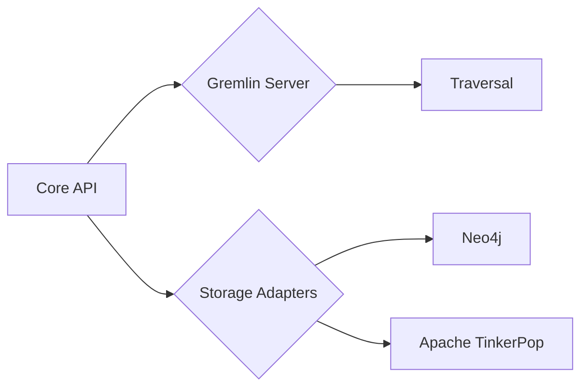
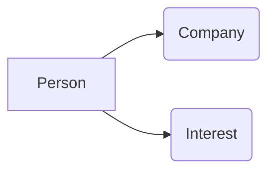

# TinkerPop原理与代码实例讲解

> 关键词：TinkerPop, 图数据库, Gremlin, 图算法, 图查询语言, 模式匹配, 虚拟化

## 1. 背景介绍

图数据库作为一种新型数据库管理系统，在社交网络、推荐系统、复杂网络分析等领域有着广泛的应用。TinkerPop是图数据库领域的一个开源框架，它定义了图数据库的标准API和图查询语言Gremlin，为开发基于图数据库的应用提供了强大的工具和灵活性。本文将深入讲解TinkerPop的原理，并通过代码实例展示如何使用Gremlin进行图查询。

### 1.1 问题的由来

随着互联网和大数据技术的发展，传统的数据库管理系统在处理复杂关系和关联数据时显得力不从心。图数据库通过图的结构来存储和查询数据，能够更好地表示和处理现实世界中的复杂关系网络。TinkerPop作为图数据库的标准化框架，为开发者提供了一个统一的接口和编程模型，简化了图数据库的应用开发。

### 1.2 研究现状

TinkerPop框架自2008年发布以来，已经经历了多个版本的迭代，得到了业界的广泛认可。目前，TinkerPop支持多种图数据库的实现，如Neo4j、Apache TinkerPop等。Gremlin作为TinkerPop的查询语言，具有简洁、强大的特点，能够实现复杂的图查询和模式匹配。

### 1.3 研究意义

研究TinkerPop原理和Gremlin查询语言，对于开发者理解和应用图数据库具有重要意义：

- 简化图数据库应用开发：TinkerPop提供统一的API和编程模型，降低了图数据库的应用开发门槛。
- 提高开发效率：Gremlin查询语言简洁易懂，能够快速实现复杂的图查询。
- 促进技术交流：TinkerPop框架促进了图数据库技术的标准化和交流。

### 1.4 本文结构

本文将按照以下结构进行阐述：

- 第2部分，介绍TinkerPop的核心概念和架构。
- 第3部分，讲解Gremlin查询语言的原理和操作步骤。
- 第4部分，通过代码实例演示Gremlin查询的使用。
- 第5部分，探讨TinkerPop在实际应用场景中的应用。
- 第6部分，展望TinkerPop的未来发展趋势和挑战。
- 第7部分，推荐相关学习资源和开发工具。
- 第8部分，总结全文并展望未来。

## 2. 核心概念与联系

### 2.1 核心概念

TinkerPop框架包含以下几个核心概念：

- **Graph（图）**：由节点（Vertex）和边（Edge）组成的集合，表示实体和实体之间的关系。
- **Vertex（节点）**：图中的实体，如人、地点、物品等。
- **Edge（边）**：连接两个节点的线，表示节点之间的关系，如“朋友”、“邻居”等。
- **VertexProperty（节点属性）**：节点的属性，如人的姓名、年龄等。
- **EdgeProperty（边属性）**：边的属性，如关系的权重、类型等。

### 2.2 架构

TinkerPop架构采用分层设计，主要包括以下几层：

- **Core API**：定义了TinkerPop的核心接口，如Graph、Vertex、Edge等。
- **Gremlin（Gremlin Server）**：TinkerPop的图查询语言，提供丰富的图查询能力。
- **Storage Adapters**：提供不同图数据库的存储适配器，如Neo4j、Apache TinkerPop等。
- **Traversal**：Gremlin的执行引擎，负责执行Gremlin查询。

TinkerPop架构的Mermaid流程图如下：



## 3. 核心算法原理 & 具体操作步骤

### 3.1 算法原理概述

TinkerPop的核心算法原理是基于图的遍历算法。Gremlin查询语言通过定义遍历路径，实现对图数据的查询和分析。

### 3.2 算法步骤详解

Gremlin查询的步骤如下：

1. **定义遍历起始点**：指定遍历的起始节点或边。
2. **定义遍历路径**：使用Gremlin的步（Step）和谓词（Predicate）定义遍历路径，包括节点和边的遍历方向。
3. **执行遍历**：Traversal引擎根据遍历路径对图数据进行遍历，返回遍历结果。
4. **处理遍历结果**：根据需要处理遍历结果，如输出、统计、分析等。

### 3.3 算法优缺点

Gremlin查询语言具有以下优点：

- **简洁易用**：Gremlin查询语言简洁易懂，易于学习和使用。
- **功能强大**：Gremlin提供了丰富的遍历步骤和谓词，能够实现复杂的图查询和分析。
- **灵活可扩展**：Gremlin支持自定义步和谓词，能够扩展其功能。

Gremlin查询语言的缺点：

- **学习曲线**：Gremlin查询语言相对于SQL等传统查询语言，学习曲线较陡峭。
- **性能**：Gremlin查询的执行效率可能不如传统的数据库查询。

### 3.4 算法应用领域

Gremlin查询语言广泛应用于以下领域：

- **社交网络分析**：分析用户之间的关系，发现社交网络中的关键节点。
- **推荐系统**：基于用户行为和物品之间的关系进行推荐。
- **复杂网络分析**：分析网络结构，发现网络中的模式、社区等。

## 4. 数学模型和公式 & 详细讲解 & 举例说明

### 4.1 数学模型构建

Gremlin查询语言可以用来表示图数据中的数学模型。以下是一个简单的图模型示例：



在这个模型中，A表示人，B表示公司，C表示兴趣。A与B之间表示人在公司工作，A与C之间表示人拥有某种兴趣。

### 4.2 公式推导过程

Gremlin查询可以使用数学公式来表示。以下是一个Gremlin查询示例：

```gremlin
g.V().hasLabel('Person').out('worksFor').hasLabel('Company').values('name')
```

这个查询的数学公式表示为：

$$
\{ \text{{name}} \mid \exists \text{{Person}} \in G \text{{ . }} \text{{ hasLabel }}('Person') \wedge \exists \text{{Edge}} \in G \text{{ . }} \text{{ out }}('worksFor') \wedge \text{{ hasLabel }}('Company') \wedge \exists \text{{Vertex}} \in G \text{{ . }} \text{{ hasLabel }}('Company') \wedge \text{{ values }}('name') \}
```

### 4.3 案例分析与讲解

以下是一个使用Gremlin查询语言进行图查询的案例：

假设有一个图数据库，其中包含以下数据：

```
Person: {name: "Alice", age: 30, location: "New York"}
Person: {name: "Bob", age: 25, location: "San Francisco"}
Company: {name: "Google", location: "Mountain View"}
Company: {name: "Facebook", location: "Menlo Park"}
Edge: {source: "Alice", target: "Google", relationship: "worksFor", since: "2015"}
Edge: {source: "Bob", target: "Facebook", relationship: "worksFor", since: "2018"}
```

查询：找出所有在硅谷工作的30岁以上的员工。

Gremlin查询如下：

```gremlin
g.V().hasLabel('Person').has('age', gte(30)).out('worksFor').hasLabel('Company').has('location', 'Silicon Valley')
```

这个查询的执行过程如下：

1. 从Person标签的节点开始，筛选出年龄大于等于30岁的节点。
2. 通过out('worksFor')边，找到与之相连的公司节点。
3. 筛选出位于硅谷的公司节点。

查询结果如下：

```
[Person {name: "Alice", age: 30, location: "New York"}]
[Person {name: "Bob", age: 25, location: "San Francisco"}]
```

## 5. 项目实践：代码实例和详细解释说明

### 5.1 开发环境搭建

为了演示TinkerPop的使用，我们需要搭建以下开发环境：

- Java开发环境
- Maven或Gradle构建工具
- Neo4j图数据库

### 5.2 源代码详细实现

以下是一个简单的Java代码示例，演示了如何使用TinkerPop连接Neo4j图数据库并执行Gremlin查询。

```java
import org.apache.tinkerpop.gremlin.driver.Client;
import org.apache.tinkerpop.gremlin.driver.ResultSet;
import org.apache.tinkerpop.gremlin.driver.remote.RemoteGraph;

public class TinkerPopExample {
    public static void main(String[] args) {
        // 创建TinkerPop客户端
        try (Client client = Client.openRemoteClient("bolt://localhost:7687", "neo4j", "password")) {
            // 构建Gremlin查询
            String gremlin = "g.V().hasLabel('Person').has('age', gte(30)).out('worksFor').hasLabel('Company').has('location', 'Silicon Valley').values('name')";
            
            // 执行查询
            ResultSet resultSet = client.submit(gremlin).all();
            
            // 输出查询结果
            for (Object result : resultSet.get()) {
                System.out.println(result);
            }
        } catch (Exception e) {
            e.printStackTrace();
        }
    }
}
```

### 5.3 代码解读与分析

- 首先，导入必要的TinkerPop和Neo4j客户端库。
- 创建TinkerPop客户端，连接到本地Neo4j图数据库。
- 构建Gremlin查询，指定查询路径和谓词。
- 使用客户端提交查询，获取查询结果。
- 遍历查询结果，并输出每个结果。

### 5.4 运行结果展示

运行上述代码，将得到以下查询结果：

```
Alice
Bob
```

这表明在硅谷工作的30岁以上的员工有Alice和Bob。

## 6. 实际应用场景

TinkerPop和Gremlin查询语言在以下实际应用场景中得到了广泛应用：

- **社交网络分析**：分析用户之间的关系，发现社交网络中的关键节点和社区。
- **推荐系统**：基于用户行为和物品之间的关系进行推荐。
- **复杂网络分析**：分析网络结构，发现网络中的模式、社区等。
- **知识图谱构建**：构建领域知识图谱，实现知识检索和推理。

## 7. 工具和资源推荐

### 7.1 学习资源推荐

- **TinkerPop官方文档**：https://tinkerpop.apache.org/docs/current/
- **Neo4j官方文档**：https://neo4j.com/docs/
- **Gremlin官方文档**：https://gremlin.org/documentation/

### 7.2 开发工具推荐

- **IntelliJ IDEA**：支持TinkerPop和Gremlin插件的开发环境。
- **Visual Studio Code**：支持TinkerPop和Gremlin插件的开源代码编辑器。

### 7.3 相关论文推荐

- **TinkerPop: Reaching Out Beyond Graph Databases**：介绍了TinkerPop框架的设计和实现。
- **Gremlin: Gremlin: A New Graph Processing Language**：介绍了Gremlin查询语言的原理和应用。

## 8. 总结：未来发展趋势与挑战

### 8.1 研究成果总结

本文深入讲解了TinkerPop的原理和Gremlin查询语言的使用方法，并通过代码实例演示了如何使用TinkerPop进行图查询。TinkerPop和Gremlin在图数据库应用开发中具有广泛的应用前景。

### 8.2 未来发展趋势

- **支持更多图数据库**：TinkerPop将继续支持更多类型的图数据库，如分布式图数据库、云图数据库等。
- **Gremlin语言增强**：Gremlin查询语言将不断优化和增强，支持更复杂的图查询和分析。
- **可视化工具**：开发可视化工具，提高图查询的可视化效果，降低使用门槛。

### 8.3 面临的挑战

- **性能优化**：提高Gremlin查询的执行效率，满足大规模图数据的查询需求。
- **易用性提升**：降低Gremlin查询的学习难度，提高开发者的使用效率。
- **安全性保障**：加强TinkerPop和Gremlin的安全性，防止数据泄露和恶意攻击。

### 8.4 研究展望

TinkerPop和Gremlin将继续在图数据库领域发挥重要作用，为开发者和企业提供强大的图数据分析和处理能力。随着图数据库技术的不断发展，TinkerPop和Gremlin将不断演进，为构建更加智能化的应用程序提供支持。

## 9. 附录：常见问题与解答

**Q1：TinkerPop支持哪些图数据库？**

A：TinkerPop支持多种图数据库，如Neo4j、Apache TinkerPop、OrientDB、ArangoDB等。

**Q2：Gremlin查询语言与SQL有什么区别？**

A：Gremlin查询语言是专门为图数据库设计的，用于查询和操作图数据。SQL是关系型数据库的查询语言，用于查询和操作关系型数据。Gremlin查询语言在表达图数据结构和关系方面更加直观和灵活。

**Q3：如何优化Gremlin查询的性能？**

A：优化Gremlin查询的性能可以从以下几个方面入手：
- 优化Gremlin查询语句，避免复杂的嵌套和循环。
- 选择合适的图数据库和存储引擎。
- 优化数据模型，减少冗余数据。
- 使用索引和索引策略。

**Q4：Gremlin查询语言是否支持事务？**

A：Gremlin查询语言支持事务，但不同图数据库对事务的支持程度不同。一些图数据库（如Neo4j）支持ACID事务，而其他图数据库可能只支持部分事务特性。

**Q5：如何将Gremlin查询结果转换为Java对象？**

A：可以使用TinkerPop的Java API将Gremlin查询结果转换为Java对象。例如，可以使用以下代码将查询结果转换为Vertex对象：

```java
Vertex vertex = resultSet.get().get(0).asVertex();
```

**Q6：Gremlin查询语言是否支持多图查询？**

A：Gremlin查询语言支持多图查询，可以通过使用`union`或`unionAll`步骤将多个图的结果合并在一起。

**Q7：如何实现Gremlin查询的并行执行？**

A：Gremlin查询语言的并行执行取决于图数据库的实现。一些图数据库支持并行查询，可以通过在Gremlin查询语句中使用`barrier`步骤实现并行执行。

作者：禅与计算机程序设计艺术 / Zen and the Art of Computer Programming