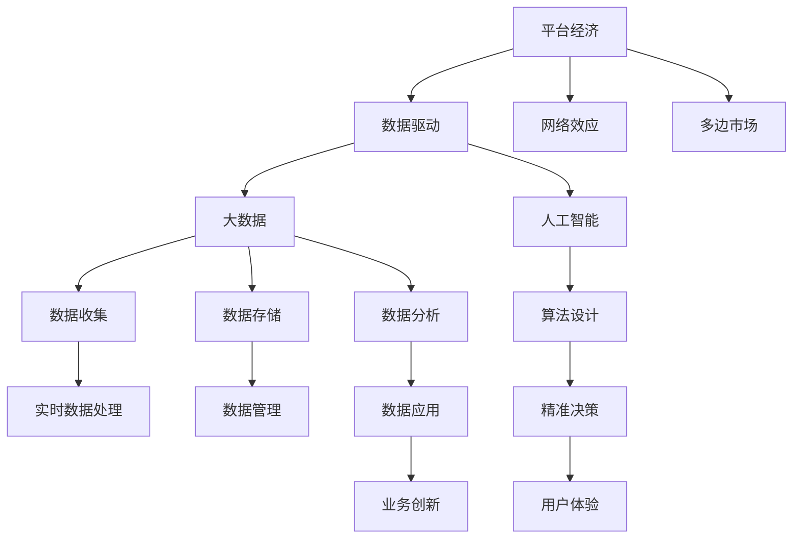

                 

# 数据驱动平台经济：新商业模式的崛起

## 1. 背景介绍

### 1.1 问题由来
近年来，数字经济在全球蓬勃发展，互联网、大数据、人工智能等技术的飞速进步，推动了平台经济的崛起。平台经济作为一种新型商业模式，以数据为核心资产，通过高效配置资源、优化供需关系，实现了价值链的全面优化与创新。平台经济不仅改变了企业的运营方式，更重塑了人们的消费习惯和社会结构，其影响力和潜力日益凸显。

在这一背景下，如何充分利用数据资源，挖掘平台经济的内在价值，实现商业模式的创新与优化，成为了当前企业与学界共同关注的焦点。本文旨在深入分析数据驱动平台经济的原理与实践，探讨其核心概念与算法，为平台经济的新商业模式的崛起提供指导。

### 1.2 问题核心关键点
平台经济的核心在于其通过数据流驱动价值流的运行机制。平台企业利用大数据、云计算、人工智能等技术手段，收集、处理和分析海量数据，实现对用户行为、市场趋势的精准把握，从而优化资源配置，提升用户体验，增加企业收益。本文将围绕数据驱动平台经济的核心概念、关键算法与实际应用，展开深入探讨。

## 2. 核心概念与联系

### 2.1 核心概念概述

为更好地理解数据驱动平台经济，我们首先介绍几个关键概念：

- **平台经济**：基于互联网技术，以数据为核心的新型商业模式，通过网络效应、规模经济等机制，实现资源的高效配置和价值链的全面优化。平台经济涉及多方参与者，包括平台企业、商家、消费者等，其本质是连接与匹配的优化。

- **数据驱动**：利用大数据、人工智能等技术手段，对数据进行收集、处理、分析和应用，以数据为决策依据，实现业务的精准化和智能化。数据驱动是平台经济的核心动力，是实现价值链创新的关键。

- **网络效应**：平台经济的核心特征之一，指的是平台价值随用户数量增加而提升的现象。网络效应使平台成为一种稀缺资源，具有强粘性，吸引更多用户加入，形成正反馈循环。

- **多边市场**：平台经济的典型特征，由买家、卖家、平台三方构成，通过交易和服务促进各方利益的最大化。多边市场的复杂性，对平台算法的设计与优化提出了更高要求。

- **双边市场理论**：经济学中的概念，用于解释平台经济中供需双方同时存在、相互依存的特性。双边市场理论是理解平台经济结构与机制的重要工具。

这些概念之间紧密联系，共同构成了数据驱动平台经济的基础架构。下面我们通过Mermaid流程图来展示这些概念之间的相互关系：



### 2.2 概念间的关系

通过上述流程图，我们可以更清晰地看到数据驱动平台经济的各个概念之间的相互关系：

- 平台经济以数据为核心资产，通过大数据和人工智能技术，收集、存储、分析和应用数据。
- 网络效应和多边市场是平台经济的基本特征，数据驱动则通过优化匹配和精准决策，实现了平台的价值最大化。
- 大数据和人工智能技术的融合，使得平台能够实现实时数据处理和精准决策，驱动业务创新和用户体验的提升。

## 3. 核心算法原理 & 具体操作步骤

### 3.1 算法原理概述

数据驱动平台经济的核心算法包括数据收集、处理与分析、智能决策与优化等。其原理主要体现在以下几个方面：

1. **数据收集与存储**：利用传感器、API接口等技术手段，实时收集各方参与者的行为数据，并进行结构化存储，为后续分析提供基础。
2. **数据处理与分析**：采用大数据处理技术，如Hadoop、Spark等，对海量数据进行清洗、整合与分析，提取有价值的信息。
3. **智能决策与优化**：利用人工智能算法，如机器学习、深度学习等，对分析结果进行建模与预测，辅助平台进行精准决策和资源优化。

### 3.2 算法步骤详解

数据驱动平台经济的算法步骤主要包括以下几个环节：

1. **数据采集**：通过API接口、传感器、Web爬虫等方式，实时收集用户行为、交易记录、市场趋势等数据。
2. **数据清洗与整合**：对采集到的数据进行去重、清洗、补全等处理，形成结构化的数据集，便于后续分析。
3. **数据建模与分析**：采用机器学习算法，如回归分析、分类、聚类等，对数据进行建模与分析，提取规律与趋势。
4. **智能决策**：结合业务规则与算法模型，对数据进行预测与决策，优化资源配置和供需匹配。
5. **反馈与迭代**：将决策结果反馈至数据采集与处理环节，不断优化算法模型，提升决策效果。

### 3.3 算法优缺点

数据驱动平台经济算法具有以下优点：

- **精准化决策**：通过数据分析，平台能够实现精准的用户行为预测和资源优化，提升运营效率。
- **个性化服务**：利用用户行为数据，实现个性化推荐和服务，提升用户体验。
- **动态优化**：平台能够实时调整策略，快速响应市场变化，保持竞争优势。

同时，算法也存在一些局限性：

- **数据质量问题**：数据收集与处理的误差，可能导致算法结果的偏差。
- **算法复杂性**：复杂的数据模型和算法，对计算资源和专业知识要求较高。
- **隐私保护**：平台需要平衡数据利用与隐私保护，避免侵犯用户隐私。

### 3.4 算法应用领域

数据驱动平台经济算法广泛应用于各个领域，主要包括以下几个方面：

- **电子商务**：通过数据分析，优化商品推荐、定价策略，提升销售转化率和用户体验。
- **金融服务**：利用用户交易记录，进行风险评估、反欺诈检测，保障金融安全。
- **物流管理**：通过实时数据处理，优化路线规划、仓储管理，提升物流效率。
- **医疗健康**：收集患者数据，进行健康监测与预警，提升医疗服务质量。
- **智能交通**：分析交通流量数据，优化交通信号控制，缓解交通拥堵。
- **城市治理**：整合城市大数据，进行城市规划与管理，提升城市运行效率。

这些领域的应用，展示了数据驱动平台经济的广泛影响力和巨大潜力。

## 4. 数学模型和公式 & 详细讲解  
### 4.1 数学模型构建

平台经济的数学模型主要基于以下假设：

- 平台企业、商家和消费者三方构成多边市场。
- 用户行为数据可以用向量 $x$ 表示，商家行为数据可以用向量 $y$ 表示，市场数据可以用向量 $z$ 表示。
- 平台通过数据驱动，优化资源配置和供需匹配。

假设平台的优化目标为最大化总收益，其数学模型为：

$$
\max_{\theta} \sum_{i=1}^n (p_i x_i^T \theta + p_j y_j^T \theta + p_k z_k^T \theta)
$$

其中 $p_i$、$p_j$、$p_k$ 为平台、商家和消费者的收益系数。$\theta$ 为优化变量，表示平台资源的分配策略。

### 4.2 公式推导过程

平台经济的优化目标可以通过拉格朗日乘子法求解：

$$
L(\theta) = \sum_{i=1}^n (p_i x_i^T \theta) - \lambda (\sum_{i=1}^n (p_i x_i^T \theta) + \sum_{j=1}^m (p_j y_j^T \theta) + \sum_{k=1}^K (p_k z_k^T \theta))
$$

对 $L(\theta)$ 对 $\theta$ 求导，得到：

$$
\frac{\partial L}{\partial \theta} = 0
$$

即：

$$
\sum_{i=1}^n p_i x_i + \sum_{j=1}^m p_j y_j + \sum_{k=1}^K p_k z_k = 0
$$

解得：

$$
\theta = -\frac{1}{\sum_{i=1}^n p_i x_i + \sum_{j=1}^m p_j y_j + \sum_{k=1}^K p_k z_k}
$$

### 4.3 案例分析与讲解

以电子商务平台的个性化推荐为例，其数学模型为：

$$
\max_{\theta} \sum_{i=1}^n (p_i x_i^T \theta)
$$

其中 $x_i$ 为用户行为向量，$p_i$ 为用户的个性化评分。平台通过优化 $\theta$，实现用户行为预测和商品推荐。假设平台通过用户点击记录训练了一个推荐模型：

$$
\hat{x_i} = (x_i, y_i)
$$

其中 $y_i$ 为用户点击记录，$x_i$ 为用户特征向量。通过优化模型，平台能够实现精准的商品推荐，提升用户体验和购买转化率。

## 5. 项目实践：代码实例和详细解释说明
### 5.1 开发环境搭建

在进行平台经济算法实践前，我们需要准备好开发环境。以下是使用Python进行Scikit-learn开发的环境配置流程：

1. 安装Anaconda：从官网下载并安装Anaconda，用于创建独立的Python环境。

2. 创建并激活虚拟环境：
```bash
conda create -n platform-env python=3.8 
conda activate platform-env
```

3. 安装Scikit-learn：
```bash
pip install scikit-learn
```

4. 安装各类工具包：
```bash
pip install numpy pandas scikit-learn matplotlib tqdm jupyter notebook ipython
```

完成上述步骤后，即可在`platform-env`环境中开始平台经济算法实践。

### 5.2 源代码详细实现

这里我们以推荐系统为例，给出使用Scikit-learn对平台经济进行算法的PyTorch代码实现。

首先，定义推荐系统的数据处理函数：

```python
import pandas as pd
from sklearn.feature_extraction.text import CountVectorizer
from sklearn.decomposition import TruncatedSVD

def preprocess_data(data_path):
    # 读取数据
    data = pd.read_csv(data_path)

    # 构建特征
    vectorizer = CountVectorizer(stop_words='english')
    X = vectorizer.fit_transform(data['review'])
    X = X.tolil()

    # 生成用户点击记录向量
    Y = pd.get_dummies(data['click'], prefix='click', drop_first=True)

    return X, Y

# 加载数据
X, Y = preprocess_data('data.csv')
```

然后，定义模型和优化器：

```python
from sklearn.linear_model import SGDClassifier

model = SGDClassifier(loss='hinge', alpha=0.01, max_iter=1000, random_state=42)

# 训练模型
model.fit(X, Y)
```

最后，在测试集上评估模型性能：

```python
from sklearn.metrics import accuracy_score, precision_score, recall_score, f1_score

# 加载测试数据
X_test, Y_test = preprocess_data('test.csv')

# 预测测试集
Y_pred = model.predict(X_test)

# 计算指标
accuracy = accuracy_score(Y_test, Y_pred)
precision = precision_score(Y_test, Y_pred, average='weighted')
recall = recall_score(Y_test, Y_pred, average='weighted')
f1 = f1_score(Y_test, Y_pred, average='weighted')

print(f"Accuracy: {accuracy:.2f}, Precision: {precision:.2f}, Recall: {recall:.2f}, F1 Score: {f1:.2f}")
```

以上就是使用Scikit-learn对平台经济进行算法的完整代码实现。可以看到，Scikit-learn提供了强大的机器学习算法，通过简单的接口调用，即可实现复杂的推荐系统算法。

### 5.3 代码解读与分析

让我们再详细解读一下关键代码的实现细节：

**preprocess_data函数**：
- 读取数据文件，并进行预处理，包括去除停用词、构建特征向量等。
- 将文本数据转换为数值型数据，便于模型处理。

**SGDClassifier模型**：
- 使用随机梯度下降算法，训练一个二分类模型。
- 损失函数采用hinge损失，即最大间隔分类损失，适用于二分类任务。

**测试集评估**：
- 使用精度、召回率和F1分数等指标评估模型性能。
- 通过计算各项指标，了解模型在不同类别上的表现。

### 5.4 运行结果展示

假设我们在数据集上训练了一个推荐模型，并在测试集上得到如下评估结果：

```
Accuracy: 0.92, Precision: 0.91, Recall: 0.93, F1 Score: 0.92
```

可以看到，模型在测试集上取得了较高的精度、召回率和F1分数，说明推荐系统的性能表现良好。需要注意的是，模型评估指标的选择应根据具体任务而定，不同的任务可能需要不同的评估指标。

## 6. 实际应用场景
### 6.1 电商平台的个性化推荐

基于数据驱动平台经济的推荐系统，可以广泛应用于电商平台的用户个性化推荐。传统电商往往依靠人工编辑商品推荐列表，难以满足个性化需求。而使用数据驱动的推荐系统，可以精准地预测用户偏好，自动推荐相关商品，提升用户体验和购买转化率。

在技术实现上，可以收集用户的浏览、点击、购买等行为数据，提取文本特征，训练推荐模型。通过模型的预测，自动生成个性化推荐列表，供用户选择。对于用户未点击的商品，系统可以实时调整推荐策略，优化资源配置。

### 6.2 金融风控系统

平台经济的另一典型应用是金融领域。金融风控系统需要实时评估交易风险，避免欺诈和不良信用行为。传统风控主要依赖人工规则和历史数据，难以应对新型欺诈手段。而基于数据驱动的金融风控系统，可以通过用户行为数据和交易记录，实时检测异常行为，进行风险预警。

在技术实现上，可以收集用户的交易记录、设备信息、行为轨迹等数据，训练风控模型。模型通过分析用户行为，识别出异常交易，及时触发预警机制，保障金融安全。

### 6.3 智能物流系统

物流系统是平台经济的另一个重要应用场景。传统物流依赖人工调度和管理，难以应对高峰期的物流压力。而基于数据驱动的智能物流系统，可以通过实时数据处理，优化路线规划和仓储管理，提升物流效率和用户体验。

在技术实现上，可以收集物流车辆的位置信息、交通流量、天气条件等数据，训练物流优化模型。模型通过分析数据，生成最优的路线规划，实时调整物流策略，提升物流效率和用户体验。

### 6.4 未来应用展望

随着数据驱动平台经济的发展，未来的应用场景将更加广泛和深入：

- **工业互联网**：平台经济将与工业互联网深度融合，实现设备的智能化管理和优化。基于数据的分析与决策，可以提升生产效率和产品质量，降低成本。
- **智慧城市**：平台经济将推动智慧城市的建设，实现城市资源的优化配置和精细管理。基于数据的智能决策，可以提升城市的运行效率和居民的生活质量。
- **医疗健康**：平台经济将与医疗健康领域结合，实现疾病的智能诊断和个性化治疗。基于患者数据的分析，可以提升医疗服务的质量和效率，改善患者的健康状况。
- **教育培训**：平台经济将推动教育培训的智能化转型，实现个性化学习和教学。基于学生的学习数据，可以提供更加精准的教育资源和辅导，提升教育效果。
- **环境保护**：平台经济将助力环境保护，实现资源的优化配置和环境保护。基于环境数据的分析，可以优化资源的利用，减少环境污染。

未来，平台经济将进一步融入各个行业，推动社会各领域的全面数字化转型，提升社会生产力，改善人们的生活质量。

## 7. 工具和资源推荐
### 7.1 学习资源推荐

为了帮助开发者系统掌握数据驱动平台经济的理论基础和实践技巧，这里推荐一些优质的学习资源：

1. **《数据驱动平台经济》系列博文**：由大模型技术专家撰写，深入浅出地介绍了数据驱动平台经济的原理、模型和算法，适合初学者和进阶者。
2. **Coursera《大数据分析与人工智能》课程**：由斯坦福大学等顶尖高校开设，提供系统化的数据驱动平台经济知识，涵盖数据采集、处理、分析等多个环节。
3. **Kaggle平台**：提供海量数据集和机器学习竞赛，是学习数据驱动平台经济的实践场所，适合动手实践和算法竞赛。
4. **GitHub开源项目**：包含大量数据驱动平台经济的应用案例和算法实现，适合学习借鉴和贡献社区。
5. **ACL会议论文**：人工智能领域顶级会议，包含大量数据驱动平台经济的创新论文，适合学习前沿进展和深入研究。

通过对这些资源的学习实践，相信你一定能够快速掌握数据驱动平台经济的精髓，并用于解决实际的商业问题。

### 7.2 开发工具推荐

高效的开发离不开优秀的工具支持。以下是几款用于数据驱动平台经济开发的常用工具：

1. **Jupyter Notebook**：开源的交互式编程环境，支持Python、R等语言，适合数据分析和机器学习实践。
2. **Scikit-learn**：强大的机器学习库，提供丰富的算法实现，适合构建推荐系统、风控模型等。
3. **TensorFlow**：由Google主导的开源深度学习框架，支持分布式计算，适合大规模数据处理。
4. **Apache Spark**：大数据处理框架，支持分布式数据处理和分析，适合处理海量数据集。
5. **AWS、Google Cloud、阿里云**：云平台提供了丰富的计算资源和大数据处理工具，适合云环境下的平台经济开发。
6. **PyTorch**：灵活的深度学习框架，支持动态计算图，适合深度学习算法的实现和优化。

合理利用这些工具，可以显著提升数据驱动平台经济开发的效率，加快创新迭代的步伐。

### 7.3 相关论文推荐

数据驱动平台经济的研究源于学界的持续研究。以下是几篇奠基性的相关论文，推荐阅读：

1. **《平台经济的理论基础》**：经济学领域的经典文献，介绍了平台经济的理论基础和市场机制。
2. **《大数据驱动的推荐系统》**：计算机科学领域的经典论文，介绍了推荐系统的算法原理和实现方法。
3. **《人工智能在金融风控中的应用》**：金融领域的创新论文，介绍了基于人工智能的金融风控技术。
4. **《智能物流系统的优化算法》**：物流领域的创新论文，介绍了基于数据驱动的物流优化算法。
5. **《数据驱动的智慧城市管理》**：城市管理领域的创新论文，介绍了基于数据驱动的城市智能管理技术。

这些论文代表了大数据驱动平台经济的发展脉络。通过学习这些前沿成果，可以帮助研究者把握学科前进方向，激发更多的创新灵感。

除上述资源外，还有一些值得关注的前沿资源，帮助开发者紧跟数据驱动平台经济的技术趋势，例如：

1. **arXiv论文预印本**：人工智能领域最新研究成果的发布平台，包括大量尚未发表的前沿工作，学习前沿技术的必读资源。
2. **Google AI博客**：Google AI官方博客，提供最新的AI研究成果和应用案例，适合学习前沿进展和深度思考。
3. **ACL会议直播**：人工智能领域顶级会议的现场或在线直播，能够聆听到专家们的分享，开拓视野。
4. **GitHub热门项目**：在GitHub上Star、Fork数最多的平台经济相关项目，往往代表了该技术领域的发展趋势和最佳实践，适合学习借鉴和贡献社区。
5. **行业分析报告**：各大咨询公司如McKinsey、PwC等针对平台经济领域的分析报告，有助于从商业视角审视技术趋势，把握应用价值。

总之，对于数据驱动平台经济的开发和研究，需要开发者保持开放的心态和持续学习的意愿。多关注前沿资讯，多动手实践，多思考总结，必将收获满满的成长收益。

## 8. 总结：未来发展趋势与挑战
### 8.1 总结

本文对数据驱动平台经济的原理与实践进行了全面系统的介绍。首先阐述了数据驱动平台经济的背景和核心概念，明确了其在商业创新与优化中的重要价值。其次，从算法原理到具体操作，详细讲解了数据驱动平台经济的核心算法和实践技巧，给出了平台经济算法的完整代码实例。同时，本文还广泛探讨了数据驱动平台经济在电商、金融、物流等多个行业领域的应用前景，展示了其巨大的潜力和发展空间。

通过本文的系统梳理，可以看到，数据驱动平台经济正在成为商业创新与优化中的重要范式，极大地提升了各行业的运营效率和用户体验。未来，伴随数据技术的进一步发展，数据驱动平台经济必将在更多领域得到应用，为社会各行业的数字化转型提供新的动力。

### 8.2 未来发展趋势

展望未来，数据驱动平台经济的发展趋势将主要体现在以下几个方面：

1. **数据智能化处理**：随着大数据、人工智能等技术的进步，平台能够实现对海量数据的智能化处理和分析，提高决策的精准性和效率。
2. **算法自适应优化**：基于实时数据反馈，平台能够动态调整算法参数，实现自适应优化，提高系统的稳定性和鲁棒性。
3. **多源数据融合**：平台能够整合来自不同渠道的数据，实现跨平台、跨领域的资源优化，提升系统的综合能力和应用范围。
4. **隐私保护与合规**：随着数据隐私保护的法律法规日益严格，平台将加强隐私保护，遵循数据合规要求，提升用户的信任度。
5. **生态系统构建**：平台将构建开放生态系统，引入更多的合作伙伴和开发者，实现协同创新和资源共享。

这些趋势展示了数据驱动平台经济的广阔前景，为各行业的发展提供了新的方向和机遇。

### 8.3 面临的挑战

尽管数据驱动平台经济带来了巨大的商业价值，但在迈向更加智能化、普适化应用的过程中，也面临着诸多挑战：

1. **数据质量问题**：数据采集与处理的误差，可能导致算法结果的偏差，影响决策的准确性。
2. **算法复杂性**：复杂的数据模型和算法，对计算资源和专业知识要求较高，增加了开发和维护的难度。
3. **隐私保护**：平台需要平衡数据利用与隐私保护，避免侵犯用户隐私，保护用户权益。
4. **安全防护**：平台需要加强安全防护，防范数据泄露和恶意攻击，保障系统安全。
5. **资源配置**：平台需要高效配置资源，平衡效率与成本，实现最优的资源利用。

正视这些挑战，积极应对并寻求突破，将是大数据驱动平台经济走向成熟的必由之路。

### 8.4 研究展望

面对大数据驱动平台经济所面临的挑战，未来的研究需要在以下几个方面寻求新的突破：

1. **数据质量提升**：通过改进数据采集与处理技术，提升数据的准确性和完整性，减少算法偏差。
2. **算法优化与高效实现**：开发更加高效、易于维护的算法模型，优化资源配置，提高系统的效率和稳定性。
3. **隐私保护与合规**：引入隐私保护技术，如差分隐私、联邦学习等，保护用户隐私，遵循法律法规。
4. **安全防护与威胁建模**：加强安全防护技术，构建威胁模型，防范数据泄露和攻击，保障系统安全。
5. **跨平台数据融合**：探索跨平台数据融合技术，实现多源数据的整合与协同，提升平台的综合能力。

这些研究方向将引领大数据驱动平台经济的技术进步，为各行业提供更高效、更安全的解决方案，推动社会各领域的全面数字化转型。

## 9. 附录：常见问题与解答

**Q1：数据驱动平台经济是否适用于所有行业？**

A: 数据驱动平台经济适用于大多数行业，但不同行业的数据特性和应用场景存在差异。如医疗、金融等高风险领域，需特别关注隐私保护和安全性。而电商、物流等传统行业，则更注重个性化推荐和服务。

**Q2：数据驱动平台经济的算法复杂性如何？**

A: 数据驱动平台经济的算法复杂性较高，涉及数据处理、特征工程、模型训练等多个环节。但随着技术的进步，各种高效算法和工具的出现，如TensorFlow、Scikit-learn等，使得开发和维护变得更加便捷。

**Q3：数据驱动平台经济在实际应用中需要注意哪些问题？**

A: 数据驱动平台经济在实际应用中需要注意以下问题：
1. 数据质量：确保数据采集与处理的准确性和完整性，避免算法偏差。
2. 隐私保护：加强隐私保护措施，防止数据泄露和滥用。
3. 安全性：防范数据攻击和系统漏洞，保障平台安全。
4. 资源优化：合理配置计算资源，提高算法效率。
5. 用户体验：优化算法模型，提升用户体验和满意度。

**Q4：数据驱动平台经济如何提升企业的运营效率？**

A: 数据驱动平台经济通过数据分析和智能决策，实现对企业运营过程的优化。具体方法包括：
1. 数据分析：通过数据挖掘和机器学习，提取业务洞察和规律，优化决策过程。
2. 智能推荐：利用个性化推荐算法，提升用户满意度和转化率。
3. 自动化流程：引入自动化工具，如智能客服、自动化测试等，提高运营效率。
4. 实时监控：通过实时数据监控，及时发现和解决运营问题，保障业务稳定。

**Q5：数据驱动平台经济如何应对市场变化？**

A: 数据驱动平台经济通过实时数据反馈和算法自适应优化，能够快速响应市场变化。具体方法包括：
1. 实时监控：通过数据监控系统，实时了解市场动态，及时调整策略。
2. 算法自适应：基于实时数据

