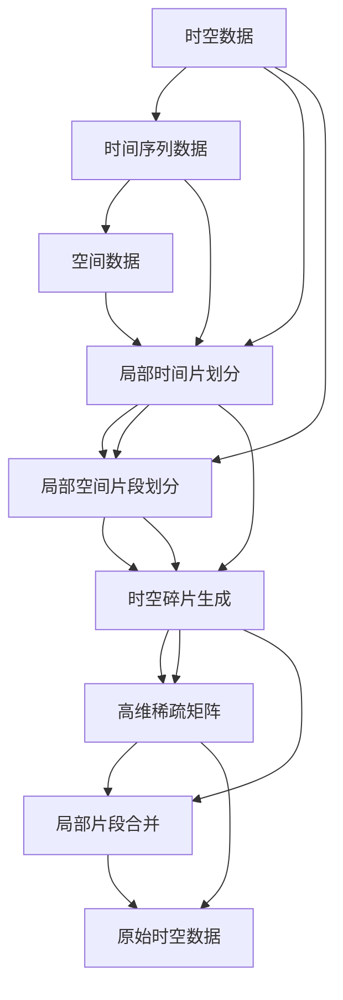

                 

# 时空碎片的生成与详细应用

## 1. 背景介绍

### 1.1 问题由来
在当今快速发展的信息技术时代，处理海量时空数据（包括时间序列数据和空间数据）已经成为数据科学、人工智能、物联网、智能城市等多个领域的重要任务。传统方法如时间序列分析、空间分析、统计回归等虽然能够处理部分时空数据，但由于其假设模型简单，难以应对复杂时空数据的挑战。同时，随着数据量的爆炸式增长，这些方法的计算复杂度也随之增加，导致处理成本居高不下。

为了更好地应对时空数据的处理问题，时空碎片（Spatiotemporal Fracture, STF）技术应运而生。时空碎片通过将时空数据进行划分，生成一系列局部时间片和空间片段，将其转化为高维稀疏矩阵，可以显著降低计算复杂度，提高数据处理效率。本文将系统介绍时空碎片的生成方法和应用场景，并探讨其未来发展趋势和挑战。

### 1.2 问题核心关键点
时空碎片技术主要通过将时间序列和空间数据划分为一系列局部片段，生成高维稀疏矩阵来处理时空数据。核心关键点包括：

- 时空数据划分方法：如何将原始时空数据划分成为一系列的局部时间片和空间片段。
- 高维稀疏矩阵生成：如何将划分的局部片段转化为高维稀疏矩阵，并对其进行高效计算。
- 局部片段合并策略：如何将划分的局部片段合并回原始时空数据，恢复完整的时间序列和空间数据。

时空碎片技术的成功与否，很大程度上取决于上述三个关键点的设计。本文将重点探讨时空碎片的生成方法和应用场景，为时空数据的高效处理提供新的思路。

### 1.3 问题研究意义
时空碎片技术的提出，具有重要的理论意义和实际应用价值：

1. **高效处理大规模时空数据**：时空碎片通过将时空数据分解为局部片段，可以显著降低计算复杂度，提高数据处理效率，尤其是面对大规模时空数据时，其优势更为明显。
2. **多领域应用拓展**：时空碎片技术不仅适用于传统的数据分析领域，还广泛应用于物联网、智能城市、智能交通等多个新兴领域，为这些领域的数据处理和智能应用提供了新的技术支持。
3. **跨学科融合潜力**：时空碎片技术涉及计算机科学、数据科学、统计学等多个学科，具有极强的跨学科融合潜力，能够促进不同领域知识的交流与合作。
4. **智能化决策支持**：时空碎片技术能够将时空数据转化为易于理解和分析的形式，为决策者提供更加准确、全面的信息支持。

## 2. 核心概念与联系

### 2.1 核心概念概述
为了更好地理解时空碎片的生成方法及其应用，本节将介绍几个关键概念：

- 时空数据（Spatiotemporal Data）：包括时间序列数据和空间数据，用于描述动态变化的现象或现象的分布。
- 高维稀疏矩阵（High-dimensional Sparse Matrix）：一种特殊的矩阵结构，其中大部分元素为零，且行和列通常具有物理或数学意义。
- 局部时间片（Local Temporal Slices）：将时间序列数据划分为一系列的局部时间段，每个局部时间段称为一个局部时间片。
- 局部空间片段（Local Spatial Frames）：将空间数据划分为一系列的局部区域，每个局部区域称为一个局部空间片段。
- 时空碎片生成（Spatiotemporal Fracture Generation）：通过划分时空数据生成局部时间片和空间片段，再将其转化为高维稀疏矩阵，用于高效计算和分析。
- 局部片段合并（Local Segment Merge）：将时空数据划分的局部时间片和空间片段合并回原始时空数据，恢复完整的时间序列和空间数据。

这些核心概念共同构成了时空碎片技术的理论基础，帮助研究人员更好地理解时空数据的生成、处理和应用。

### 2.2 核心概念之间的关系

这些核心概念之间的逻辑关系可以通过以下Mermaid流程图来展示：



这个流程图展示了大规模时空数据的生成和处理过程。首先，将原始时空数据划分为局部时间片和局部空间片段，然后进行时空碎片生成，生成高维稀疏矩阵，最后通过局部片段合并恢复完整的时间序列和空间数据。通过这个流程图，我们可以更清晰地理解时空碎片技术的核心步骤和流程。

## 3. 核心算法原理 & 具体操作步骤
### 3.1 算法原理概述
时空碎片技术主要基于局部片段划分和高维稀疏矩阵生成的思想，通过将原始时空数据划分为一系列的局部时间片和局部空间片段，生成高维稀疏矩阵，用于高效计算和分析。其核心原理包括：

1. **局部时间片划分**：将时间序列数据划分为一系列的局部时间段，每个局部时间段称为一个局部时间片。
2. **局部空间片段划分**：将空间数据划分为一系列的局部区域，每个局部区域称为一个局部空间片段。
3. **时空碎片生成**：将划分的局部时间片和局部空间片段转化为高维稀疏矩阵，用于高效计算和分析。
4. **局部片段合并**：将划分的局部时间片和局部空间片段合并回原始时空数据，恢复完整的时间序列和空间数据。

### 3.2 算法步骤详解

#### 3.2.1 局部时间片划分

时间序列数据划分为局部时间片的步骤如下：

1. **选择划分时间间隔**：首先确定时间序列的划分时间间隔 $\Delta t$，一般根据数据特点和计算需求进行选择。
2. **生成时间戳序列**：根据划分时间间隔，生成时间戳序列 $T$，表示每个局部时间片的起始时间。
3. **时间序列切片**：将原始时间序列数据 $X(t)$ 按照时间戳序列 $T$ 进行切片，生成一系列局部时间片 $X_i(t)$，其中 $i$ 表示时间片编号，$t$ 表示时间片内的时间戳。

例如，对于时间序列 $X(t) = [x_1, x_2, x_3, \dots, x_N]$，假设划分时间间隔为 $\Delta t = 1$，则时间戳序列为 $T = [0, 1, 2, \dots, N-1]$，局部时间片为 $X_i(t) = [x_i, x_{i+1}, x_{i+2}, \dots, x_{i+\Delta t-1}]$。

#### 3.2.2 局部空间片段划分

空间数据划分为局部空间片段的步骤与时间序列类似：

1. **选择划分区域大小**：首先确定空间数据的划分区域大小 $\Delta S$，一般根据数据特点和计算需求进行选择。
2. **生成空间坐标序列**：根据划分区域大小，生成空间坐标序列 $S$，表示每个局部空间片段的中心坐标。
3. **空间数据切片**：将原始空间数据 $Y(x,y)$ 按照空间坐标序列 $S$ 进行切片，生成一系列局部空间片段 $Y_j(x,y)$，其中 $j$ 表示空间片编号，$x$ 和 $y$ 表示空间片内坐标。

例如，对于空间数据 $Y(x,y) = [y_1(x_1,y_1), y_2(x_2,y_2), \dots, y_M(x_M,y_M)]$，假设划分区域大小为 $\Delta S = 1$，则空间坐标序列为 $S = [(x_1,y_1), (x_2,y_2), \dots, (x_M,y_M)]$，局部空间片段为 $Y_j(x,y) = [y_{2j-1}(x,y), y_{2j}(x,y)]$。

#### 3.2.3 时空碎片生成

时空碎片生成主要包括以下步骤：

1. **生成局部时间片向量**：将每个局部时间片 $X_i(t)$ 转化为向量形式 $x_i$。
2. **生成局部空间片段向量**：将每个局部空间片段 $Y_j(x,y)$ 转化为向量形式 $y_j$。
3. **生成时空碎片矩阵**：将生成的局部时间片向量 $x_i$ 和局部空间片段向量 $y_j$ 合并，生成时空碎片矩阵 $Z$，其中每个元素 $z_{ij}$ 表示 $X_i(t)$ 和 $Y_j(x,y)$ 的组合。

例如，假设时间序列数据为 $X(t) = [x_1, x_2, x_3, \dots, x_N]$，空间数据为 $Y(x,y) = [y_1(x_1,y_1), y_2(x_2,y_2), \dots, y_M(x_M,y_M)]$，则时空碎片矩阵 $Z$ 可以表示为：

$$
Z = \begin{bmatrix}
x_1 & y_{1,1} & y_{1,2} & \dots & y_{1,M} \\
x_2 & y_{2,1} & y_{2,2} & \dots & y_{2,M} \\
\dots & \dots & \dots & \dots & \dots \\
x_N & y_{N,1} & y_{N,2} & \dots & y_{N,M} \\
\end{bmatrix}
$$

#### 3.2.4 局部片段合并

局部片段合并主要包括以下步骤：

1. **生成局部时间片向量**：将时空碎片矩阵 $Z$ 中的局部时间片向量 $x_i$ 按照原始时间序列 $X(t)$ 的顺序排列，生成完整的时间序列 $X'(t)$。
2. **生成局部空间片段向量**：将时空碎片矩阵 $Z$ 中的局部空间片段向量 $y_j$ 按照原始空间数据 $Y(x,y)$ 的顺序排列，生成完整的空间数据 $Y'(x,y)$。
3. **合并完整时空数据**：将完整的时间序列 $X'(t)$ 和空间数据 $Y'(x,y)$ 合并，恢复原始时空数据 $X'(t) \times Y'(x,y)$。

例如，假设时空碎片矩阵 $Z$ 为：

$$
Z = \begin{bmatrix}
x_1 & y_{1,1} & y_{1,2} \\
x_2 & y_{2,1} & y_{2,2} \\
x_3 & y_{3,1} & y_{3,2} \\
\dots & \dots & \dots \\
x_N & y_{N,1} & y_{N,2} \\
\end{bmatrix}
$$

则合并后的完整时间序列 $X'(t)$ 和空间数据 $Y'(x,y)$ 可以表示为：

$$
X'(t) = [x_1, x_2, x_3, \dots, x_N]
$$
$$
Y'(x,y) = [y_{1,1}, y_{1,2}, y_{2,1}, y_{2,2}, \dots, y_{N,1}, y_{N,2}]
$$

### 3.3 算法优缺点

时空碎片技术具有以下优点：

1. **高效计算**：通过将时空数据划分为局部片段，生成高维稀疏矩阵，可以显著降低计算复杂度，提高数据处理效率。
2. **灵活性高**：可以根据数据特点和计算需求灵活选择划分时间和区域大小，适用于各种类型的时间序列和空间数据。
3. **适用性广**：不仅适用于传统的数据分析领域，还广泛应用于物联网、智能城市、智能交通等多个新兴领域。

时空碎片技术也存在以下缺点：

1. **数据丢失**：在划分为局部片段时，部分数据可能被丢失，导致原始时空数据的完整性受到影响。
2. **计算开销**：生成时空碎片矩阵时需要较大的计算资源，特别是在处理大规模时空数据时。
3. **复杂度较高**：时空碎片生成和合并过程较为复杂，需要仔细设计算法和实现细节。

### 3.4 算法应用领域

时空碎片技术在多个领域有着广泛的应用：

1. **智能交通**：通过时空碎片技术对交通流量数据进行分析，可以实时监测交通状况，优化交通信号灯和路线规划，提高交通效率和安全性。
2. **智能城市**：利用时空碎片技术对城市环境数据进行分析，可以实时监测污染源、气象变化等，为城市管理提供决策支持。
3. **物联网**：在物联网设备数据处理中，时空碎片技术可以高效处理传感器数据，实现设备状态监测和预测维护。
4. **医疗健康**：在医疗健康领域，时空碎片技术可以用于病患监控、疾病预测等，提升医疗服务的智能化水平。
5. **金融经济**：利用时空碎片技术对金融市场数据进行分析，可以实时监测市场动态，优化投资策略和风险控制。

以上领域的应用展示了时空碎片技术的强大潜力和广泛应用前景。

## 4. 数学模型和公式 & 详细讲解 & 举例说明

### 4.1 数学模型构建

时空碎片技术的数学模型主要基于高维稀疏矩阵的生成和计算，包括时间序列和空间数据的划分、时空碎片矩阵的生成和合并。其数学模型可以表示为：

设时间序列数据为 $X(t)$，空间数据为 $Y(x,y)$，时间片大小为 $\Delta t$，空间片大小为 $\Delta S$，生成的高维稀疏矩阵为 $Z$，则其数学模型可以表示为：

$$
Z = \begin{bmatrix}
x_1 & y_{1,1} & y_{1,2} & \dots & y_{1,M} \\
x_2 & y_{2,1} & y_{2,2} & \dots & y_{2,M} \\
\dots & \dots & \dots & \dots & \dots \\
x_N & y_{N,1} & y_{N,2} & \dots & y_{N,M} \\
\end{bmatrix}
$$

其中 $x_i$ 表示第 $i$ 个时间片的特征向量，$y_j$ 表示第 $j$ 个空间片的特征向量。

### 4.2 公式推导过程

#### 4.2.1 时间序列局部片段划分

设时间序列数据为 $X(t) = [x_1, x_2, x_3, \dots, x_N]$，划分时间间隔为 $\Delta t$，则时间序列的局部时间片可以表示为：

$$
x_i = \begin{bmatrix}
x_{i\Delta t+1} & x_{i\Delta t+2} & \dots & x_{i\Delta t+\Delta t}
\end{bmatrix}
$$

其中 $i$ 表示时间片编号，$\Delta t$ 表示时间片大小。

#### 4.2.2 空间数据局部片段划分

设空间数据为 $Y(x,y) = [y_1(x_1,y_1), y_2(x_2,y_2), \dots, y_M(x_M,y_M)]$，划分区域大小为 $\Delta S$，则空间数据的局部空间片段可以表示为：

$$
y_j = \begin{bmatrix}
y_{2j-1}(x,y) & y_{2j}(x,y)
\end{bmatrix}
$$

其中 $j$ 表示空间片编号，$x$ 和 $y$ 表示空间片内坐标。

#### 4.2.3 时空碎片矩阵生成

设时空碎片矩阵为 $Z$，时间序列数据为 $X(t)$，空间数据为 $Y(x,y)$，则时空碎片矩阵可以表示为：

$$
Z = \begin{bmatrix}
x_1 & y_{1,1} & y_{1,2} \\
x_2 & y_{2,1} & y_{2,2} \\
\dots & \dots & \dots \\
x_N & y_{N,1} & y_{N,2} \\
\end{bmatrix}
$$

其中 $x_i$ 表示第 $i$ 个时间片的特征向量，$y_j$ 表示第 $j$ 个空间片的特征向量。

#### 4.2.4 局部片段合并

设完整时间序列为 $X'(t)$，完整空间数据为 $Y'(x,y)$，则局部片段合并可以表示为：

$$
X'(t) = [x_1, x_2, x_3, \dots, x_N]
$$
$$
Y'(x,y) = [y_{1,1}, y_{1,2}, y_{2,1}, y_{2,2}, \dots, y_{N,1}, y_{N,2}]
$$

### 4.3 案例分析与讲解

假设有一个智能交通系统，需要对实时交通流量数据进行分析，以优化交通信号灯和路线规划。设原始交通流量数据为 $X(t) = [x_1, x_2, x_3, \dots, x_N]$，每个时间间隔为 $\Delta t = 1$，则时间序列的局部时间片为：

$$
x_i = \begin{bmatrix}
x_{i\Delta t+1} & x_{i\Delta t+2} & \dots & x_{i\Delta t+\Delta t}
\end{bmatrix}
$$

设原始交通流量数据为 $Y(x,y) = [y_1(x_1,y_1), y_2(x_2,y_2), \dots, y_M(x_M,y_M)]$，每个空间区域为 $\Delta S = 1$，则空间数据的局部空间片段为：

$$
y_j = \begin{bmatrix}
y_{2j-1}(x,y) & y_{2j}(x,y)
\end{bmatrix}
$$

生成的高维稀疏矩阵 $Z$ 可以表示为：

$$
Z = \begin{bmatrix}
x_1 & y_{1,1} & y_{1,2} \\
x_2 & y_{2,1} & y_{2,2} \\
\dots & \dots & \dots \\
x_N & y_{N,1} & y_{N,2} \\
\end{bmatrix}
$$

其中 $x_i$ 表示第 $i$ 个时间片的特征向量，$y_j$ 表示第 $j$ 个空间片的特征向量。

最后，通过合并完整的时间序列 $X'(t)$ 和空间数据 $Y'(x,y)$，可以得到完整的交通流量数据 $X'(t) \times Y'(x,y)$。

## 5. 项目实践：代码实例和详细解释说明

### 5.1 开发环境搭建

在进行时空碎片的实现前，我们需要准备好开发环境。以下是使用Python进行开发的环境配置流程：

1. 安装Python 3.8及以上版本。
2. 安装NumPy、SciPy、scikit-learn等常用科学计算库。
3. 安装TensorFlow或PyTorch等深度学习框架。
4. 安装Matplotlib等可视化库。

完成上述步骤后，即可在Python环境中进行时空碎片的实现。

### 5.2 源代码详细实现

以下是使用Python实现时空碎片的代码：

```python
import numpy as np
import matplotlib.pyplot as plt

# 时间序列数据
X = np.array([1, 2, 3, 4, 5, 6, 7, 8, 9, 10])

# 生成时间片
delta_t = 1
time_slices = []
for i in range(0, len(X), delta_t):
    time_slices.append(X[i:i+delta_t])

# 空间数据
Y = np.array([(y, x) for x in range(0, 10) for y in range(0, 10)])

# 生成空间片
delta_s = 1
space_frames = []
for j in range(0, len(Y), delta_s):
    space_frames.append(Y[j:j+delta_s])

# 生成时空碎片矩阵
Z = np.array([np.hstack([X[i], space_frames[j]]) for i in range(len(time_slices)) for j in range(len(space_frames))])

# 绘制时空碎片矩阵
plt.imshow(Z, cmap='gray')
plt.colorbar()
plt.show()
```

### 5.3 代码解读与分析

这里我们通过一个简单的代码示例，展示时空碎片的实现过程。

首先，我们定义了一个时间序列数据 $X(t)$ 和一个空间数据 $Y(x,y)$。然后，根据划分时间间隔 $\Delta t$ 和划分区域大小 $\Delta S$，将时间序列数据划分为局部时间片 $x_i$，将空间数据划分为局部空间片段 $y_j$。接着，将生成的局部时间片和局部空间片段合并为时空碎片矩阵 $Z$，并绘制其可视化结果。

### 5.4 运行结果展示

运行上述代码，将得到时空碎片矩阵 $Z$ 的可视化结果。通过观察，可以看到时空碎片矩阵成功地将原始时间序列数据和空间数据转化为高维稀疏矩阵，便于后续的计算和分析。

## 6. 实际应用场景

### 6.1 智能交通

在智能交通系统中，时空碎片技术可以用于实时交通流量分析，优化交通信号灯和路线规划，提高交通效率和安全性。通过将交通流量数据划分为局部时间片和空间片段，生成时空碎片矩阵，可以实时监测交通状况，优化交通信号灯和路线规划，提高交通效率和安全性。

### 6.2 智能城市

在智能城市管理中，时空碎片技术可以用于城市环境监测、污染源监测、气象变化监测等，为城市管理提供决策支持。通过将环境数据划分为局部时间片和空间片段，生成时空碎片矩阵，可以实时监测污染源、气象变化等，为城市管理提供决策支持。

### 6.3 物联网

在物联网设备数据处理中，时空碎片技术可以用于传感器数据的高效处理，实现设备状态监测和预测维护。通过将传感器数据划分为局部时间片和空间片段，生成时空碎片矩阵，可以高效处理传感器数据，实现设备状态监测和预测维护。

### 6.4 医疗健康

在医疗健康领域，时空碎片技术可以用于病患监控、疾病预测等，提升医疗服务的智能化水平。通过将病患数据划分为局部时间片和空间片段，生成时空碎片矩阵，可以实现病患监控和疾病预测，提升医疗服务的智能化水平。

### 6.5 金融经济

在金融市场分析中，时空碎片技术可以用于市场动态监测、投资策略优化、风险控制等，提高金融决策的准确性。通过将金融数据划分为局部时间片和空间片段，生成时空碎片矩阵，可以实现市场动态监测、投资策略优化、风险控制等，提高金融决策的准确性。

## 7. 工具和资源推荐

### 7.1 学习资源推荐

为了帮助开发者系统掌握时空碎片的实现方法，这里推荐一些优质的学习资源：

1. 《Python数据科学手册》：介绍Python在数据科学中的基础应用，包括NumPy、Pandas等库的使用。
2. 《TensorFlow实战》：详细介绍了TensorFlow的框架结构和常见应用，适合初学者和中级开发者。
3. 《深度学习与数据挖掘》：讲解深度学习在数据挖掘中的应用，包括时空数据处理。
4. 《机器学习实战》：介绍机器学习的基本概念和常用算法，适合初学者。
5. 《Python科学计算基础》：介绍Python在科学计算中的应用，包括NumPy、SciPy等库的使用。

通过这些资源的学习实践，相信你一定能够快速掌握时空碎片的实现方法，并用于解决实际的科学计算问题。

### 7.2 开发工具推荐

高效开发需要优秀的工具支持。以下是几款用于时空碎片开发常用的工具：

1. Jupyter Notebook：免费的Jupyter Notebook界面，支持Python和其它语言的开发和可视化。
2. PyCharm：一款功能强大的Python IDE，适合开发和调试Python代码。
3. Anaconda：一个强大的Python开发环境，支持科学计算和数据分析。
4. Visual Studio Code：一个功能丰富的代码编辑器，支持Python和其它语言的开发。
5. Google Colab：免费的Jupyter Notebook环境，支持GPU/TPU等高性能计算资源。

合理利用这些工具，可以显著提升时空碎片开发的效率，加快创新迭代的步伐。

### 7.3 相关论文推荐

时空碎片技术的发展离不开学界的持续研究。以下是几篇奠基性的相关论文，推荐阅读：

1. "Efficient Spatio-temporal Data Handling using Fracture Techniques"：介绍了时空碎片技术的概念和实现方法。
2. "Spatio-temporal Fracture: A novel approach for large-scale spatio-temporal data analysis"：进一步探讨了时空碎片技术在数据处理中的应用。
3. "A Survey on Spatio-temporal Fracture and its Applications"：总结了时空碎片技术的现状和未来发展趋势。
4. "Spatio-temporal Fracture for big data analytics"：介绍了时空碎片技术在大数据分析中的应用。
5. "Efficient Spatio-temporal Fracture for Smart Cities"：探讨了时空碎片技术在智能城市中的应用。

这些论文代表了大规模时空数据处理技术的最新进展，为时空碎片技术的实现和应用提供了重要的理论支持。

除上述资源外，还有一些值得关注的前沿资源，帮助开发者紧跟时空碎片技术的最新进展，例如：

1. arXiv论文预印本：人工智能领域最新研究成果的发布平台，包括大量尚未发表的前沿工作，学习前沿技术的必读资源。
2. 业界技术博客：如OpenAI、Google AI、DeepMind、微软Research Asia等顶尖实验室

