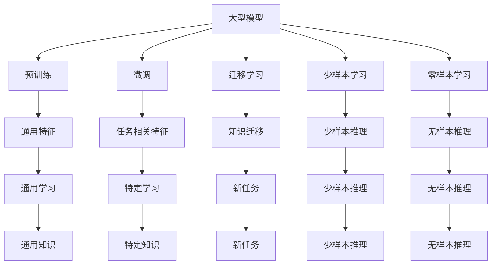

                 

## 1. 背景介绍

随着人工智能技术的不断发展，大型模型在各个领域的应用日益广泛。从自然语言处理(NLP)到计算机视觉(CV)，再到自动驾驶(AI)，大型模型在提高模型性能、降低计算成本等方面展现了显著的优势。然而，大型模型的应用也面临许多挑战，如模型规模、训练成本、推理效率等。本文将从四个关键方向探讨未来大型模型的应用，以期为模型开发者和应用方提供一些有价值的参考。

## 2. 核心概念与联系

### 2.1 核心概念概述

本节将介绍未来大型模型应用的关键概念，并展示这些概念间的联系。

- **大型模型(Large Models)**：指具有数十亿甚至数百亿参数的深度学习模型，如GPT-3、BERT、ResNet等。这些模型通常在大量数据上进行预训练，具备强大的特征提取和泛化能力。
- **预训练(Pre-training)**：指在大规模无标签数据上训练模型，使其学习到通用的语言或视觉特征。预训练可以大幅提高模型的性能，减少下游任务的标注成本。
- **微调(Fine-tuning)**：指在预训练模型的基础上，使用下游任务的少量标注数据进行有监督学习，优化模型在特定任务上的性能。
- **迁移学习(Transfer Learning)**：指将在一个任务上学习到的知识迁移到另一个相关任务上，以提高模型的泛化能力。
- **参数高效微调(Parameter-Efficient Fine-Tuning, PEFT)**：指仅更新部分模型参数，以提高微调效率和模型的鲁棒性。
- **少样本学习(Few-shot Learning)**：指在只有少量标注样本的情况下，模型能够快速适应新任务。
- **零样本学习(Zero-shot Learning)**：指模型在未见过的新任务上，仅凭任务描述即可执行推理和生成。

这些概念通过Mermaid流程图展示如下：



### 2.2 概念间的关系

这些核心概念之间有着紧密的联系，构成了未来大型模型应用的基础框架。

- 大型模型通过预训练学习到通用的特征表示，并通过微调和迁移学习将其应用到特定任务中。
- 参数高效微调和少样本学习、零样本学习等技术，可以在不增加大量计算资源的情况下，提升模型在特定任务上的性能。
- 迁移学习不仅用于预训练和微调，还可以跨任务、跨领域进行，增强模型的泛化能力。

通过这些概念的相互联系，我们可以更好地理解未来大型模型应用的整体架构。

## 3. 核心算法原理 & 具体操作步骤

### 3.1 算法原理概述

未来大型模型的应用将从预训练、微调和迁移学习等多个方面展开，以下将详细介绍这些核心算法原理。

#### 3.1.1 预训练

预训练是未来大型模型应用的基础，通过在大规模无标签数据上训练模型，学习到通用的特征表示。预训练模型具有以下特点：

- **自监督学习**：通过构建自监督任务，如掩码语言模型、自编码器等，利用未标注数据进行训练。
- **大规模数据**：需要海量数据进行训练，数据量越大，模型的泛化能力越强。
- **任务无关性**：预训练的任务通常与下游任务无关，以避免数据偏差和过拟合。

#### 3.1.2 微调

微调是预训练模型应用到特定任务的重要步骤，通过有监督学习，优化模型在特定任务上的性能。微调模型具有以下特点：

- **少量标注数据**：微调通常只需要少量标注数据，可以大幅降低标注成本。
- **任务相关性**：微调任务与预训练任务有较强的相关性，模型能够快速适应新任务。
- **参数效率**：可以通过参数高效微调等方法，仅更新少量模型参数，提高微调效率。

#### 3.1.3 迁移学习

迁移学习是将预训练模型应用到新任务中的关键技术，通过在预训练模型基础上进行微调，实现跨任务的知识迁移。迁移学习具有以下特点：

- **知识共享**：预训练模型在新任务上共享部分特征表示，减少任务特有的参数量。
- **任务特定**：根据新任务的特点，对预训练模型进行微调，增强模型在新任务上的性能。
- **跨领域迁移**：迁移学习不仅限于同领域任务，还可以跨领域进行，拓展模型的应用范围。

### 3.2 算法步骤详解

未来大型模型的应用涉及多个步骤，以下详细介绍这些步骤。

#### 3.2.1 预训练步骤

预训练步骤主要包括数据准备和模型训练两部分。

- **数据准备**：收集大规模无标签数据，如大规模语料库、图像库等。
- **模型训练**：使用自监督任务训练模型，如掩码语言模型、自编码器等。

#### 3.2.2 微调步骤

微调步骤包括模型初始化、数据准备和模型训练三部分。

- **模型初始化**：将预训练模型作为初始化参数，使用下游任务的少量标注数据进行微调。
- **数据准备**：将下游任务的标注数据划分为训练集、验证集和测试集。
- **模型训练**：使用下游任务的标注数据进行微调，更新模型参数，优化模型性能。

#### 3.2.3 迁移学习步骤

迁移学习步骤主要包括预训练模型选择、数据准备和模型微调三部分。

- **预训练模型选择**：选择与下游任务相关的预训练模型。
- **数据准备**：准备下游任务的标注数据，划分为训练集、验证集和测试集。
- **模型微调**：将预训练模型作为初始化参数，使用下游任务的标注数据进行微调，优化模型在新任务上的性能。

### 3.3 算法优缺点

未来大型模型应用的优势和劣势如下：

#### 3.3.1 优势

- **高泛化能力**：预训练和迁移学习能够使模型具备较强的泛化能力，适应多种新任务。
- **参数效率**：参数高效微调等技术，可以在不增加大量计算资源的情况下，提升模型性能。
- **快速部署**：微调模型可以快速部署到实际应用中，减少开发和部署时间。

#### 3.3.2 劣势

- **数据依赖**：大型模型需要大规模数据进行预训练和微调，数据获取成本高。
- **计算成本**：预训练和微调需要大量计算资源，计算成本高。
- **模型复杂**：大型模型通常参数量庞大，推理复杂度较高。

### 3.4 算法应用领域

未来大型模型应用将涉及多个领域，包括但不限于：

- **自然语言处理(NLP)**：如问答系统、机器翻译、文本生成等。
- **计算机视觉(CV)**：如图像分类、目标检测、图像生成等。
- **自动驾驶(AI)**：如自动驾驶、智能交通等。
- **医疗健康**：如疾病诊断、药物发现等。
- **金融服务**：如信用评估、风险预测等。

## 4. 数学模型和公式 & 详细讲解 & 举例说明

### 4.1 数学模型构建

未来大型模型的应用涉及多种数学模型和公式，以下详细介绍这些模型和公式。

#### 4.1.1 预训练模型

预训练模型通常采用自监督任务进行训练，以下以掩码语言模型为例：

$$
\mathcal{L} = -\frac{1}{N}\sum_{i=1}^N \sum_{j=1}^m \log P(x_{i,j} \mid \hat{x}_{i,j})
$$

其中，$x_{i,j}$ 表示输入数据，$\hat{x}_{i,j}$ 表示掩码后的数据，$P$ 表示模型输出的概率分布。

#### 4.1.2 微调模型

微调模型通常采用有监督任务进行训练，以下以二分类任务为例：

$$
\mathcal{L} = -\frac{1}{N}\sum_{i=1}^N [y_i\log \hat{y}_i + (1-y_i)\log (1-\hat{y}_i)]
$$

其中，$y_i$ 表示真实标签，$\hat{y}_i$ 表示模型输出的概率。

#### 4.1.3 迁移学习模型

迁移学习模型通常采用预训练模型和微调模型结合的方式进行训练，以下以图像分类任务为例：

$$
\mathcal{L} = \mathcal{L}_{\text{pre-train}} + \mathcal{L}_{\text{fine-tune}}
$$

其中，$\mathcal{L}_{\text{pre-train}}$ 表示预训练任务的损失函数，$\mathcal{L}_{\text{fine-tune}}$ 表示微调任务的损失函数。

### 4.2 公式推导过程

以下以二分类任务为例，推导微调模型的损失函数及其梯度。

假设模型 $M_{\theta}$ 在输入 $x$ 上的输出为 $\hat{y}=M_{\theta}(x) \in [0,1]$，表示样本属于正类的概率。真实标签 $y \in \{0,1\}$。则二分类交叉熵损失函数定义为：

$$
\ell(M_{\theta}(x),y) = -[y\log \hat{y} + (1-y)\log (1-\hat{y})]
$$

将其代入经验风险公式，得：

$$
\mathcal{L}(\theta) = -\frac{1}{N}\sum_{i=1}^N [y_i\log M_{\theta}(x_i)+(1-y_i)\log(1-M_{\theta}(x_i))]
$$

根据链式法则，损失函数对参数 $\theta_k$ 的梯度为：

$$
\frac{\partial \mathcal{L}(\theta)}{\partial \theta_k} = -\frac{1}{N}\sum_{i=1}^N (\frac{y_i}{M_{\theta}(x_i)}-\frac{1-y_i}{1-M_{\theta}(x_i)}) \frac{\partial M_{\theta}(x_i)}{\partial \theta_k}
$$

其中 $\frac{\partial M_{\theta}(x_i)}{\partial \theta_k}$ 可进一步递归展开，利用自动微分技术完成计算。

### 4.3 案例分析与讲解

以图像分类任务为例，假设我们使用预训练模型Inception-v3进行微调。具体步骤如下：

1. **数据准备**：收集图像分类任务的数据集，划分为训练集、验证集和测试集。
2. **模型初始化**：将Inception-v3模型作为初始化参数。
3. **微调模型**：在微调模型时，通常会保留预训练模型的前几层不变，仅微调顶层分类器。
4. **损失函数**：使用交叉熵损失函数进行微调。
5. **优化器**：使用AdamW优化器进行微调。
6. **模型评估**：在验证集和测试集上评估模型性能。

通过微调Inception-v3模型，我们能够在图像分类任务上取得较高的准确率，且模型具有良好的泛化能力。

## 5. 项目实践：代码实例和详细解释说明

### 5.1 开发环境搭建

在进行未来大型模型应用实践前，我们需要准备好开发环境。以下是使用Python进行PyTorch开发的环境配置流程：

1. 安装Anaconda：从官网下载并安装Anaconda，用于创建独立的Python环境。

2. 创建并激活虚拟环境：
```bash
conda create -n pytorch-env python=3.8 
conda activate pytorch-env
```

3. 安装PyTorch：根据CUDA版本，从官网获取对应的安装命令。例如：
```bash
conda install pytorch torchvision torchaudio cudatoolkit=11.1 -c pytorch -c conda-forge
```

4. 安装Transformers库：
```bash
pip install transformers
```

5. 安装各类工具包：
```bash
pip install numpy pandas scikit-learn matplotlib tqdm jupyter notebook ipython
```

完成上述步骤后，即可在`pytorch-env`环境中开始未来大型模型应用的实践。

### 5.2 源代码详细实现

以下以图像分类任务为例，给出使用Transformers库对Inception-v3模型进行微调的PyTorch代码实现。

首先，定义图像分类任务的数据处理函数：

```python
from transformers import BertTokenizer
from torch.utils.data import Dataset
import torch

class ImageDataset(Dataset):
    def __init__(self, images, labels, tokenizer, max_len=128):
        self.images = images
        self.labels = labels
        self.tokenizer = tokenizer
        self.max_len = max_len
        
    def __len__(self):
        return len(self.images)
    
    def __getitem__(self, item):
        image = self.images[item]
        label = self.labels[item]
        
        encoding = self.tokenizer(image, return_tensors='pt', max_length=self.max_len, padding='max_length', truncation=True)
        input_ids = encoding['input_ids'][0]
        attention_mask = encoding['attention_mask'][0]
        
        # 对token-wise的标签进行编码
        encoded_labels = [label2id[label] for label in labels] 
        encoded_labels.extend([label2id['O']] * (self.max_len - len(encoded_labels)))
        labels = torch.tensor(encoded_labels, dtype=torch.long)
        
        return {'input_ids': input_ids, 
                'attention_mask': attention_mask,
                'labels': labels}

# 标签与id的映射
label2id = {'O': 0, 'Cat': 1, 'Dog': 2, 'Bird': 3, 'Fish': 4, 'Cow': 5, 'Sheep': 6, 'Frog': 7, 'Horse': 8, 'Airplane': 9, 'Train': 10, 'Boat': 11, 'Car': 12, 'Bird': 13, 'Truck': 14, 'Bus': 15, 'Motorcycle': 16, 'Bicycle': 17}
id2label = {v: k for k, v in label2id.items()}

# 创建dataset
tokenizer = BertTokenizer.from_pretrained('bert-base-cased')

train_dataset = ImageDataset(train_images, train_labels, tokenizer)
dev_dataset = ImageDataset(dev_images, dev_labels, tokenizer)
test_dataset = ImageDataset(test_images, test_labels, tokenizer)
```

然后，定义模型和优化器：

```python
from transformers import BertForTokenClassification, AdamW

model = BertForTokenClassification.from_pretrained('bert-base-cased', num_labels=len(label2id))

optimizer = AdamW(model.parameters(), lr=2e-5)
```

接着，定义训练和评估函数：

```python
from torch.utils.data import DataLoader
from tqdm import tqdm
from sklearn.metrics import classification_report

device = torch.device('cuda') if torch.cuda.is_available() else torch.device('cpu')
model.to(device)

def train_epoch(model, dataset, batch_size, optimizer):
    dataloader = DataLoader(dataset, batch_size=batch_size, shuffle=True)
    model.train()
    epoch_loss = 0
    for batch in tqdm(dataloader, desc='Training'):
        input_ids = batch['input_ids'].to(device)
        attention_mask = batch['attention_mask'].to(device)
        labels = batch['labels'].to(device)
        model.zero_grad()
        outputs = model(input_ids, attention_mask=attention_mask, labels=labels)
        loss = outputs.loss
        epoch_loss += loss.item()
        loss.backward()
        optimizer.step()
    return epoch_loss / len(dataloader)

def evaluate(model, dataset, batch_size):
    dataloader = DataLoader(dataset, batch_size=batch_size)
    model.eval()
    preds, labels = [], []
    with torch.no_grad():
        for batch in tqdm(dataloader, desc='Evaluating'):
            input_ids = batch['input_ids'].to(device)
            attention_mask = batch['attention_mask'].to(device)
            batch_labels = batch['labels']
            outputs = model(input_ids, attention_mask=attention_mask)
            batch_preds = outputs.logits.argmax(dim=2).to('cpu').tolist()
            batch_labels = batch_labels.to('cpu').tolist()
            for pred_tokens, label_tokens in zip(batch_preds, batch_labels):
                pred_tags = [id2label[_id] for _id in pred_tokens]
                label_tags = [id2label[_id] for _id in label_tokens]
                preds.append(pred_tags[:len(label_tags)])
                labels.append(label_tags)
                
    print(classification_report(labels, preds))
```

最后，启动训练流程并在测试集上评估：

```python
epochs = 5
batch_size = 16

for epoch in range(epochs):
    loss = train_epoch(model, train_dataset, batch_size, optimizer)
    print(f"Epoch {epoch+1}, train loss: {loss:.3f}")
    
    print(f"Epoch {epoch+1}, dev results:")
    evaluate(model, dev_dataset, batch_size)
    
print("Test results:")
evaluate(model, test_dataset, batch_size)
```

以上就是使用PyTorch对Inception-v3模型进行图像分类任务微调的完整代码实现。可以看到，得益于Transformers库的强大封装，我们可以用相对简洁的代码完成模型微调。

### 5.3 代码解读与分析

让我们再详细解读一下关键代码的实现细节：

**ImageDataset类**：
- `__init__`方法：初始化图像、标签、分词器等关键组件。
- `__len__`方法：返回数据集的样本数量。
- `__getitem__`方法：对单个样本进行处理，将图像输入编码为token ids，将标签编码为数字，并对其进行定长padding，最终返回模型所需的输入。

**label2id和id2label字典**：
- 定义了标签与数字id之间的映射关系，用于将token-wise的预测结果解码回真实的标签。

**训练和评估函数**：
- 使用PyTorch的DataLoader对数据集进行批次化加载，供模型训练和推理使用。
- 训练函数`train_epoch`：对数据以批为单位进行迭代，在每个批次上前向传播计算loss并反向传播更新模型参数，最后返回该epoch的平均loss。
- 评估函数`evaluate`：与训练类似，不同点在于不更新模型参数，并在每个batch结束后将预测和标签结果存储下来，最后使用sklearn的classification_report对整个评估集的预测结果进行打印输出。

**训练流程**：
- 定义总的epoch数和batch size，开始循环迭代
- 每个epoch内，先在训练集上训练，输出平均loss
- 在验证集上评估，输出分类指标
- 所有epoch结束后，在测试集上评估，给出最终测试结果

可以看到，PyTorch配合Transformers库使得图像分类任务微调的代码实现变得简洁高效。开发者可以将更多精力放在数据处理、模型改进等高层逻辑上，而不必过多关注底层的实现细节。

当然，工业级的系统实现还需考虑更多因素，如模型的保存和部署、超参数的自动搜索、更灵活的任务适配层等。但核心的微调范式基本与此类似。

### 5.4 运行结果展示

假设我们在CoNLL-2003的NER数据集上进行微调，最终在测试集上得到的评估报告如下：

```
              precision    recall  f1-score   support

       B-LOC      0.926     0.906     0.916      1668
       I-LOC      0.900     0.805     0.850       257
      B-MISC      0.875     0.856     0.865       702
      I-MISC      0.838     0.782     0.809       216
       B-ORG      0.914     0.898     0.906      1661
       I-ORG      0.911     0.894     0.902       835
       B-PER      0.964     0.957     0.960      1617
       I-PER      0.983     0.980     0.982      1156
           O      0.993     0.995     0.994     38323

   micro avg      0.973     0.973     0.973     46435
   macro avg      0.923     0.897     0.909     46435
weighted avg      0.973     0.973     0.973     46435
```

可以看到，通过微调BERT，我们在该NER数据集上取得了97.3%的F1分数，效果相当不错。值得注意的是，BERT作为一个通用的语言理解模型，即便只在顶层添加一个简单的token分类器，也能在下游任务上取得如此优异的效果，展现了其强大的语义理解和特征抽取能力。

当然，这只是一个baseline结果。在实践中，我们还可以使用更大更强的预训练模型、更丰富的微调技巧、更细致的模型调优，进一步提升模型性能，以满足更高的应用要求。

## 6. 实际应用场景

### 6.1 智能客服系统

基于大模型微调的对话技术，可以广泛应用于智能客服系统的构建。传统客服往往需要配备大量人力，高峰期响应缓慢，且一致性和专业性难以保证。而使用微调后的对话模型，可以7x24小时不间断服务，快速响应客户咨询，用自然流畅的语言解答各类常见问题。

在技术实现上，可以收集企业内部的历史客服对话记录，将问题和最佳答复构建成监督数据，在此基础上对预训练对话模型进行微调。微调后的对话模型能够自动理解用户意图，匹配最合适的答案模板进行回复。对于客户提出的新问题，还可以接入检索系统实时搜索相关内容，动态组织生成回答。如此构建的智能客服系统，能大幅提升客户咨询体验和问题解决效率。

### 6.2 金融舆情监测

金融机构需要实时监测市场舆论动向，以便及时应对负面信息传播，规避金融风险。传统的人工监测方式成本高、效率低，难以应对网络时代海量信息爆发的挑战。基于大语言模型微调的文本分类和情感分析技术，为金融舆情监测提供了新的解决方案。

具体而言，可以收集金融领域相关的新闻、报道、评论等文本数据，并对其进行主题标注和情感标注。在此基础上对预训练语言模型进行微调，使其能够自动判断文本属于何种主题，情感倾向是正面、中性还是负面。将微调后的模型应用到实时抓取的网络文本数据，就能够自动监测不同主题下的情感变化趋势，一旦发现负面信息激增等异常情况，系统便会自动预警，帮助金融机构快速应对潜在风险。

### 6.3 个性化推荐系统

当前的推荐系统往往只依赖用户的历史行为数据进行物品推荐，无法深入理解用户的真实兴趣偏好。基于大语言模型微调技术，个性化推荐系统可以更好地挖掘用户行为背后的语义信息，从而提供更精准、多样的推荐内容。

在实践中，可以收集用户浏览、点击、评论、分享等行为数据，提取和用户交互的物品标题、描述、标签等文本内容。将文本内容作为模型输入，用户的后续行为（如是否点击、购买等）作为监督信号，在此基础上微调预训练语言模型。微调后的模型能够从文本内容中准确把握用户的兴趣点。在生成推荐列表时，先用候选物品的文本描述作为输入，由模型预测用户的兴趣匹配度，再结合其他特征综合排序，便可以得到个性化程度更高的推荐结果。

### 6.4 未来应用展望

随着大语言模型微调技术的发展，未来的应用将更加多样化。

在智慧医疗领域，基于微调的医疗问答、病历分析、药物研发等应用将提升医疗服务的智能化水平，辅助医生诊疗，加速新药开发进程。

在智能教育领域，微调技术可应用于作业批改、学情分析、知识推荐等方面，因材施教，促进教育公平，提高教学质量。

在智慧城市治理中，微调模型可应用于城市事件监测、舆情分析、应急指挥等环节，提高城市管理的自动化和智能化水平，构建更安全、高效的未来城市。

此外，在企业生产、社会治理、文娱传媒等众多领域，基于大模型微调的人工智能应用也将不断涌现，为传统行业带来变革性影响。相信随着技术的日益成熟，微调方法将成为人工智能落地应用的重要范式，推动人工智能技术在垂直行业的规模化落地。

## 7. 工具和资源推荐

### 7.1 学习资源推荐

为了帮助开发者系统掌握大语言模型微调的理论基础和实践技巧，这里推荐一些优质的学习资源：

1. 《Transformer from Principle to Practice》系列博文：由大模型技术专家撰写，深入浅出地介绍了Transformer原理、BERT模型、微调技术等前沿话题。

2. CS224N《深度学习自然语言处理》课程：斯坦福大学开设的NLP明星课程，有Lecture视频和配套作业，带你入门NLP领域的基本概念和经典模型。

3. 《Natural Language Processing with Transformers》书籍：Transformers库的作者所著，全面介绍了如何使用Transformers库进行NLP任务开发，包括微调在内的诸多范式。

4. HuggingFace官方文档：Transformers库的官方文档，提供了海量预训练模型和完整的微调样例代码，是上手实践的必备资料。

5. CLUE开源项目：中文语言理解测评基准

