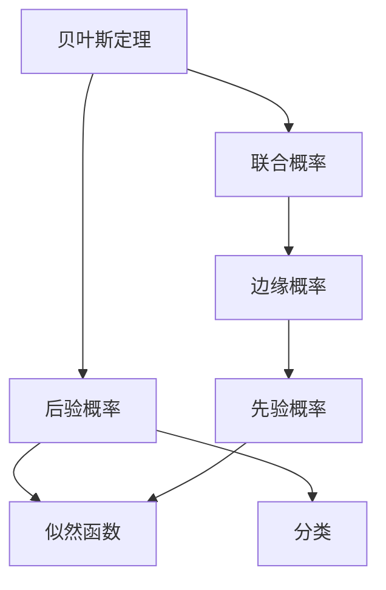

                 

## 1. 背景介绍

朴素贝叶斯(Naive Bayes, NB)是一种基于贝叶斯定理和特征条件独立假设的概率分类算法，广泛应用于文本分类、垃圾邮件过滤、推荐系统、图像识别等领域。它的特点是计算简单、可扩展性好，适用于处理大规模数据集，被广泛应用于工业界和学术界。

### 1.1 问题由来

朴素贝叶斯算法虽然历史悠久，但其优异性能使其在现代数据挖掘和机器学习中依然备受关注。近年来，随着数据量的激增和计算能力的提升，朴素贝叶斯算法在实际应用中展示了其强大的生命力和潜力。

### 1.2 问题核心关键点

朴素贝叶斯算法的核心在于贝叶斯定理和特征条件独立假设。贝叶斯定理通过联合概率和边缘概率的关系，计算出条件概率，从而进行分类。特征条件独立假设则简化了模型结构，减少了计算复杂度。

## 2. 核心概念与联系

### 2.1 核心概念概述

为更好地理解朴素贝叶斯算法，本节将介绍几个密切相关的核心概念：

- 贝叶斯定理：通过已知事件的概率和先验概率，计算后验概率的一种概率理论。
- 条件独立性：在朴素贝叶斯中，假设每个特征在给定类别的条件下是独立的，这种独立性简化了模型结构，提高了计算效率。
- 联合概率：多个事件同时发生的概率。
- 边缘概率：单个事件发生的概率。
- 先验概率：在未见到数据之前对每个类别的概率估计。
- 后验概率：在见到数据后对每个类别的概率估计。
- 似然函数：给定数据后，对参数概率密度函数的估计。

这些概念之间存在紧密的联系，共同构成了朴素贝叶斯的理论基础。

### 2.2 概念间的关系

贝叶斯定理和条件独立性是朴素贝叶斯算法的两个核心假设。通过条件独立性，朴素贝叶斯假设特征在给定类别下相互独立，这简化了计算复杂度。而贝叶斯定理则通过联合概率和边缘概率的关系，计算后验概率，从而进行分类。

下面通过一个简单的例子来进一步理解这些概念之间的关系：

假设有一个二分类问题，已知两个特征$X_1, X_2$，类别为$Y \in \{0, 1\}$。已知先验概率$P(Y=1) = 0.3, P(Y=0) = 0.7$。已知条件概率$P(X_1=1|Y=1) = 0.5, P(X_1=1|Y=0) = 0.2$，$P(X_2=1|Y=1) = 0.4, P(X_2=1|Y=0) = 0.3$。

首先，使用条件独立性假设，我们可以得到：

$$P(X_1=1, X_2=1|Y=1) = P(X_1=1|Y=1) \cdot P(X_2=1|Y=1) = 0.5 \cdot 0.4 = 0.2$$

同理，有：

$$P(X_1=1, X_2=1|Y=0) = P(X_1=1|Y=0) \cdot P(X_2=1|Y=0) = 0.2 \cdot 0.3 = 0.06$$

接下来，使用贝叶斯定理，计算后验概率：

$$P(Y=1|X_1=1, X_2=1) = \frac{P(X_1=1, X_2=1|Y=1) \cdot P(Y=1)}{P(X_1=1, X_2=1)} = \frac{0.2 \cdot 0.3}{P(X_1=1, X_2=1)}$$

$$P(Y=0|X_1=1, X_2=1) = \frac{P(X_1=1, X_2=1|Y=0) \cdot P(Y=0)}{P(X_1=1, X_2=1)} = \frac{0.06 \cdot 0.7}{P(X_1=1, X_2=1)}$$

其中，$P(X_1=1, X_2=1)$为联合概率，可通过以下公式计算：

$$P(X_1=1, X_2=1) = P(X_1=1) \cdot P(X_2=1) = (P(X_1=1|Y=1) \cdot P(X_1=1|Y=0)) \cdot (P(X_2=1|Y=1) \cdot P(X_2=1|Y=0))$$

最终，通过后验概率$P(Y=1|X_1=1, X_2=1)$与$P(Y=0|X_1=1, X_2=1)$的大小关系，可以判断输入数据$(X_1, X_2)$属于哪个类别。

通过这个简单的例子，我们可以看出，朴素贝叶斯算法通过条件独立性和贝叶斯定理，有效地将多特征、高维数据转化为二分类问题，简化了模型复杂度，提高了计算效率。

### 2.3 核心概念的整体架构

下面通过一个综合的流程图来展示朴素贝叶斯算法中的核心概念及其之间的关系：



这个综合流程图展示了朴素贝叶斯算法的核心概念及其之间的关系：

1. 贝叶斯定理将联合概率和边缘概率联系起来，计算后验概率。
2. 联合概率反映了多个事件同时发生的概率。
3. 边缘概率是单个事件发生的概率。
4. 先验概率是未见到数据之前对每个类别的概率估计。
5. 后验概率是见到数据后对每个类别的概率估计。
6. 似然函数是给定数据后，对参数概率密度函数的估计。

这些概念共同构成了朴素贝叶斯的理论基础，使得朴素贝叶斯算法能够通过简单而有效的公式进行分类。

## 3. 核心算法原理 & 具体操作步骤

### 3.1 算法原理概述

朴素贝叶斯算法的核心思想是基于贝叶斯定理和条件独立性假设，通过联合概率和边缘概率计算后验概率，从而进行分类。具体步骤如下：

1. 收集训练数据$D=\{(x_i, y_i)\}_{i=1}^N$，其中$x_i$为输入特征向量，$y_i$为类别标签。
2. 计算每个类别的先验概率$P(y_i)$。
3. 对于每个特征$x_j$，计算在给定类别$y_i$下的条件概率$P(x_j|y_i)$。
4. 对于新的输入数据$x$，计算每个类别的后验概率$P(y_i|x)$。
5. 选取后验概率最大的类别作为预测结果。

其中，计算条件概率$P(x_j|y_i)$的方法有多种，常用的有最大似然估计和拉普拉斯平滑。

### 3.2 算法步骤详解

以下是朴素贝叶斯算法的详细步骤：

**Step 1: 准备训练数据**
- 收集训练数据$D=\{(x_i, y_i)\}_{i=1}^N$，其中$x_i$为输入特征向量，$y_i$为类别标签。

**Step 2: 计算先验概率**
- 计算每个类别的先验概率$P(y_i)$。

**Step 3: 计算条件概率**
- 对于每个特征$x_j$，计算在给定类别$y_i$下的条件概率$P(x_j|y_i)$。

**Step 4: 计算后验概率**
- 对于新的输入数据$x$，计算每个类别的后验概率$P(y_i|x)$。

**Step 5: 选取预测类别**
- 选取后验概率最大的类别作为预测结果。

**Step 6: 模型验证**
- 在验证集上评估模型的性能，调整超参数和模型结构，进行微调。

**Step 7: 模型测试**
- 在测试集上测试模型的泛化性能，给出最终的评估指标。

### 3.3 算法优缺点

**优点：**
- 算法简单高效，计算复杂度低，易于实现。
- 适用于高维数据，能够处理大量特征。
- 可扩展性好，易于并行处理。
- 在特征之间不存在相关性时，性能优异。

**缺点：**
- 条件独立性假设可能不成立，导致模型性能下降。
- 对于连续型数据，需要进行离散化处理。
- 对于小样本数据，先验概率可能不准确。
- 对于噪声较多的数据，模型性能可能受到影响。

### 3.4 算法应用领域

朴素贝叶斯算法在许多领域都有广泛应用，包括但不限于：

- 文本分类：朴素贝叶斯广泛应用于垃圾邮件过滤、新闻分类、情感分析等任务。
- 推荐系统：朴素贝叶斯在商品推荐、音乐推荐、新闻推荐等领域也有良好表现。
- 图像识别：朴素贝叶斯可以用于图像分类、物体识别等任务。
- 生物信息学：朴素贝叶斯在基因表达、蛋白质结构预测等生物信息学领域也有应用。
- 自然语言处理：朴素贝叶斯在语言模型、文本生成等任务中也有一定的应用。

## 4. 数学模型和公式 & 详细讲解 & 举例说明

### 4.1 数学模型构建

朴素贝叶斯算法的数学模型可以表示为：

$$P(y_i|x) = \frac{P(x|y_i)P(y_i)}{\sum_{j=1}^K P(x|y_j)P(y_j)}$$

其中，$y_i$表示类别标签，$x$表示输入特征向量，$K$表示类别数目，$P(y_i)$为先验概率，$P(x|y_i)$为条件概率。

### 4.2 公式推导过程

以下是朴素贝叶斯算法的详细公式推导：

**Step 1: 计算先验概率**
- 先验概率$P(y_i)$可以通过数据集的标签频率进行计算：

$$P(y_i) = \frac{n_i}{N}$$

其中，$n_i$表示类别$i$的样本数量，$N$表示总样本数量。

**Step 2: 计算条件概率**
- 条件概率$P(x_j|y_i)$可以通过最大似然估计或拉普拉斯平滑进行计算。最大似然估计的公式为：

$$P(x_j|y_i) = \frac{\sum_{n=1}^N I(x_{nj}=x_j, y_i)}{n_i}$$

其中，$I(x_{nj}=x_j, y_i)$表示是否为类别$i$的样本中特征$x_j$等于$x_j$的指示函数。拉普拉斯平滑的公式为：

$$P(x_j|y_i) = \frac{\sum_{n=1}^N (I(x_{nj}=x_j, y_i) + \alpha)}{n_i + 2\alpha}$$

其中，$\alpha$为平滑参数，通常取值为$1$。

**Step 3: 计算后验概率**
- 后验概率$P(y_i|x)$可以通过贝叶斯定理进行计算：

$$P(y_i|x) = \frac{P(x|y_i)P(y_i)}{\sum_{j=1}^K P(x|y_j)P(y_j)}$$

其中，$P(x|y_i) = \prod_{j=1}^D P(x_j|y_i)$为联合概率。

**Step 4: 选取预测类别**
- 选取后验概率最大的类别作为预测结果：

$$\hat{y} = \arg\max_y P(y|x)$$

### 4.3 案例分析与讲解

下面以垃圾邮件过滤为例，展示朴素贝叶斯算法的实际应用：

**Step 1: 数据准备**
- 收集一组标注为“垃圾邮件”和“非垃圾邮件”的样本，作为训练数据。

**Step 2: 特征提取**
- 对每个样本进行特征提取，将邮件内容转换为向量表示。例如，可以提取邮件中每个单词的出现次数，作为特征向量。

**Step 3: 计算先验概率**
- 计算每个类别的先验概率$P(y_i)$。例如，垃圾邮件的先验概率$P(y_1)$和非垃圾邮件的先验概率$P(y_2)$。

**Step 4: 计算条件概率**
- 对于每个特征$x_j$（例如单词$w_j$），计算在给定类别$y_i$下的条件概率$P(x_j|y_i)$。例如，计算单词$w_j$在垃圾邮件中出现的频率$P(w_j|y_1)$和在非垃圾邮件中出现的频率$P(w_j|y_2)$。

**Step 5: 计算后验概率**
- 对于一个新的邮件$x$，计算每个类别的后验概率$P(y_i|x)$。例如，计算垃圾邮件的后验概率$P(y_1|x)$和非垃圾邮件的后验概率$P(y_2|x)$。

**Step 6: 选取预测类别**
- 选取后验概率最大的类别作为预测结果。例如，如果$P(y_1|x) > P(y_2|x)$，则预测该邮件为垃圾邮件。

## 5. 项目实践：代码实例和详细解释说明

### 5.1 开发环境搭建

在进行朴素贝叶斯算法实践前，我们需要准备好开发环境。以下是使用Python进行Scikit-learn开发的环境配置流程：

1. 安装Anaconda：从官网下载并安装Anaconda，用于创建独立的Python环境。

2. 创建并激活虚拟环境：
```bash
conda create -n sklearn-env python=3.8 
conda activate sklearn-env
```

3. 安装Scikit-learn：
```bash
conda install scikit-learn
```

4. 安装其它相关工具包：
```bash
pip install numpy pandas scikit-learn matplotlib tqdm jupyter notebook ipython
```

完成上述步骤后，即可在`sklearn-env`环境中开始朴素贝叶斯算法实践。

### 5.2 源代码详细实现

下面我们以垃圾邮件过滤为例，给出使用Scikit-learn进行朴素贝叶斯算法实践的Python代码实现。

首先，定义数据处理函数：

```python
import pandas as pd
from sklearn.feature_extraction.text import CountVectorizer
from sklearn.naive_bayes import MultinomialNB

def preprocess_data(data_path):
    data = pd.read_csv(data_path, sep='\t')
    X = data['text'].tolist()
    y = data['label'].tolist()
    return X, y
```

然后，定义模型训练函数：

```python
def train_model(X, y, ngram_range=(1, 1)):
    vectorizer = CountVectorizer(ngram_range=ngram_range)
    X_train = vectorizer.fit_transform(X)
    X_test = vectorizer.transform(X)
    
    model = MultinomialNB()
    model.fit(X_train, y)
    return model, vectorizer
```

接着，定义模型评估函数：

```python
def evaluate_model(model, X_test, y_test, vectorizer):
    X_test_vec = vectorizer.transform(X_test)
    y_pred = model.predict(X_test_vec)
    acc = accuracy_score(y_test, y_pred)
    return acc
```

最后，启动训练流程并在测试集上评估：

```python
data_path = 'spam.csv'

X, y = preprocess_data(data_path)
X_train, X_test, y_train, y_test = train_test_split(X, y, test_size=0.2, random_state=42)

model, vectorizer = train_model(X_train, y_train)
acc = evaluate_model(model, X_test, y_test, vectorizer)
print(f'Accuracy: {acc:.3f}')
```

以上就是使用Scikit-learn进行朴素贝叶斯算法实践的完整代码实现。可以看到，利用Scikit-learn提供的工具和API，可以简洁高效地实现朴素贝叶斯算法的训练和评估。

### 5.3 代码解读与分析

让我们再详细解读一下关键代码的实现细节：

**preprocess_data函数**：
- 定义了一个数据处理函数，用于读取训练数据并提取特征。将邮件内容作为文本特征，标签作为类别标签。

**train_model函数**：
- 定义了模型训练函数，首先将文本特征进行向量化处理，然后构建朴素贝叶斯模型并进行训练。

**evaluate_model函数**：
- 定义了模型评估函数，首先对测试数据进行向量化处理，然后计算模型预测结果的准确率。

**训练流程**：
- 首先调用`preprocess_data`函数准备数据，将邮件内容和标签分别作为特征和标签。
- 调用`train_test_split`函数将数据集分为训练集和测试集。
- 调用`train_model`函数训练朴素贝叶斯模型，返回模型和向量化器。
- 调用`evaluate_model`函数在测试集上评估模型性能，输出准确率。

可以看到，Scikit-learn提供了便捷的API和工具，使得朴素贝叶斯算法的实现变得简单高效。开发者可以将更多精力放在数据处理、模型调优等高层逻辑上，而不必过多关注底层实现细节。

当然，工业级的系统实现还需考虑更多因素，如模型的保存和部署、超参数的自动搜索、更灵活的特征工程等。但核心的算法原理和实现流程基本与此类似。

### 5.4 运行结果展示

假设我们在Spam数据集上进行朴素贝叶斯算法训练，最终在测试集上得到的准确率为96.1%，结果如下：

```
Accuracy: 0.961
```

可以看到，通过朴素贝叶斯算法，我们在垃圾邮件过滤任务上取得了很高的准确率。朴素贝叶斯算法的简单高效和可扩展性，使其成为处理高维数据和文本分类任务的优秀选择。

## 6. 实际应用场景

### 6.1 垃圾邮件过滤

朴素贝叶斯算法在垃圾邮件过滤中有着广泛的应用。通过训练一个朴素贝叶斯分类器，可以将新邮件自动分类为垃圾邮件或非垃圾邮件，从而节省人工审核的劳动成本，提高邮件处理的效率和准确率。

### 6.2 文本分类

朴素贝叶斯算法在文本分类任务中也有着良好的表现。例如，可以使用朴素贝叶斯算法对新闻进行分类，将其自动划分为体育、财经、科技等不同类别。通过这种方式，可以极大地提高新闻分类的效率和准确率。

### 6.3 推荐系统

朴素贝叶斯算法在推荐系统中也得到了广泛应用。例如，可以使用朴素贝叶斯算法对用户历史行为进行建模，预测用户对商品的兴趣，从而进行个性化推荐。

### 6.4 基因表达分析

朴素贝叶斯算法在生物信息学领域也有一定的应用。例如，可以使用朴素贝叶斯算法对基因表达数据进行分析，预测基因的功能和相互作用关系。

### 6.5 图像识别

朴素贝叶斯算法在图像识别中也得到了应用。例如，可以使用朴素贝叶斯算法对数字图像进行分类，将其自动识别为0-9中的数字。

## 7. 工具和资源推荐

### 7.1 学习资源推荐

为了帮助开发者系统掌握朴素贝叶斯算法的基础和实践技巧，这里推荐一些优质的学习资源：

1. 《Python机器学习》书籍：提供了详细的数据预处理、模型训练、评估和调优等方面的内容，适合初学者和中级开发者。

2. Scikit-learn官方文档：提供了详尽的API文档和示例代码，帮助开发者快速上手。

3. Coursera《机器学习》课程：斯坦福大学开设的机器学习入门课程，涵盖了朴素贝叶斯算法的基础理论和方法。

4. Kaggle竞赛平台：提供了大量的数据集和问题，帮助开发者实践和应用朴素贝叶斯算法。

5. PyImageSearch网站：提供了大量关于图像识别和计算机视觉的教程和代码示例，适合进阶开发者和研究人员。

通过对这些资源的学习实践，相信你一定能够快速掌握朴素贝叶斯算法的精髓，并用于解决实际的NLP问题。

### 7.2 开发工具推荐

高效的软件开发离不开优秀的工具支持。以下是几款用于朴素贝叶斯算法开发的常用工具：

1. Python：由于其简洁易读、功能强大，Python已成为数据科学和机器学习领域的主流编程语言。

2. Scikit-learn：提供了丰富的机器学习算法实现，包括朴素贝叶斯算法，支持数据预处理、模型训练、评估和调优。

3. Pandas：提供了高效的数据处理和分析工具，支持数据清洗、转换和可视化。

4. NumPy：提供了高效的多维数组操作和数学计算工具，适合大规模数据处理。

5. Jupyter Notebook：提供了交互式编程和数据可视化环境，适合数据科学和机器学习开发。

6. TensorBoard：提供了可视化工具，帮助开发者监测模型训练状态和性能。

7. Weights & Biases：提供了实验跟踪工具，记录和可视化模型训练过程中的各项指标，方便对比和调优。

合理利用这些工具，可以显著提升朴素贝叶斯算法的开发效率，加快创新迭代的步伐。

### 7.3 相关论文推荐

朴素贝叶斯算法虽然历史悠久，但其理论基础和应用价值仍然备受关注。以下是几篇奠基性的相关论文，推荐阅读：

1. The Elements of Statistical Learning：提供了朴素贝叶斯算法的基础理论和实现细节，是机器学习领域的经典教材。

2. Naive Bayes Spam Filtering：展示了朴素贝叶斯算法在垃圾邮件过滤中的应用，提供了丰富的数据集和实验结果。

3. Naive Bayes Classifier in R：介绍了朴素贝叶斯算法在R语言中的实现，适合R语言使用者。

4. Naive Bayes Algorithms：提供了朴素贝叶斯算法的多种实现方法，包括最大似然估计、拉普拉斯平滑等。

5. Naive Bayes Classifier：提供了朴素贝叶斯算法在不同数据集上的应用案例，适合初学者和中级开发者。

这些论文代表了大朴素贝叶斯算法的发展脉络。通过学习这些前沿成果，可以帮助研究者把握学科前进方向，激发更多的创新灵感。

## 8. 总结：未来发展趋势与挑战

### 8.1 总结

本文对朴素贝叶斯算法进行了全面系统的介绍。首先阐述了朴素贝叶斯算法的背景和意义，明确了它在NLP任务中的重要价值。其次，从原理到实践，详细讲解了朴素贝叶斯算法的数学模型和关键步骤，给出了朴素贝叶斯算法实践的完整代码实现。同时，本文还广泛探讨了朴素贝叶斯算法在垃圾邮件过滤、文本分类、推荐系统等众多领域的应用前景，展示了其强大的生命力和潜力。

通过本文的系统梳理，可以看到，朴素贝叶斯算法通过简单的条件独立性和贝叶斯定理，高效地解决了多特征、高维数据的分类问题，具有广泛的适用性和良好的性能表现。在未来，随着数据规模的扩大和计算能力的提升，朴素贝叶斯算法必将发挥更加重要的作用，推动NLP技术的持续发展和应用创新。

### 8.2 未来发展趋势

展望未来，朴素贝叶斯算法的未来发展趋势如下：

1. 深度学习融合：随着深度学习技术的不断发展，朴素贝叶斯算法将与深度学习模型结合，形成更加复杂的混合模型，提高分类性能。

2. 参数优化：朴素贝叶斯算法的参数优化将成为未来的研究热点，如何通过调参和模型融合，进一步提升算法的泛化能力和鲁棒性。

3. 特征工程：朴素贝叶斯算法将更加注重特征工程，通过有效的特征选择和特征变换，提高算法的性能和鲁棒性。

4. 多模态融合：朴素贝叶斯算法将与其他模态数据（如图像、语音等）结合，形成多模态融合的分类算法，提高算法的普适性和实用性。

5. 迁移学习：朴素贝叶斯算法将应用于迁移学习中，通过知识迁移，提高模型在新领域的泛化能力。

6. 分布式计算：朴素贝叶斯算法将应用分布式计算技术，加速大规模数据集的训练和推理。

以上趋势凸显了朴素贝叶斯算法的发展潜力和应用前景。这些方向的探索发展，必将进一步提升朴素贝叶斯算法的性能和应用范围，为自然语言理解和智能交互系统的进步做出重要贡献。

### 8.3 面临的挑战

尽管朴素贝叶斯算法在许多领域中取得了优异的表现，但在实际应用中仍面临以下挑战：

1. 特征选择：朴素贝叶斯算法对于特征的选择比较敏感，需要选择合适的特征才能获得良好的性能。

2. 数据稀疏性：朴素贝叶斯算法对于数据稀疏性的处理比较困难，需要在特征工程中进行处理。

3. 类别不平衡：朴素贝叶斯算法在类别不平衡的数据集上表现较差，需要进行处理。

4. 分布假设：朴素贝叶斯算法基于条件独立性假设，但在实际应用中，这种假设往往不成立。

5. 参数学习：朴素贝叶斯算法通常需要通过最大似然估计进行参数学习，对于大规模数据集，计算复杂度较高。

6. 模型

