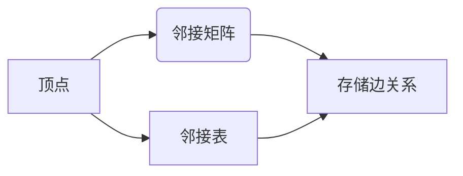

# Graph Vertex原理与代码实例讲解

> 关键词：图论，顶点，邻接表，邻接矩阵，算法分析，图遍历，深度优先搜索，广度优先搜索

## 1. 背景介绍

图论是数学的一个分支，它研究的是由点和线（边）组成的图形结构。图论在计算机科学、网络设计、社交网络分析等领域有着广泛的应用。在图论中，图是由顶点（也称为节点）和连接这些顶点的边组成的。顶点是图的最基本元素，理解顶点的概念对于深入理解图论至关重要。

本文将探讨图论中的顶点概念，包括其定义、表示方法、以及在实际应用中的算法实现。我们将从理论到实践，通过代码实例详细讲解如何处理图顶点，以及如何使用图顶点进行深度优先搜索和广度优先搜索。

## 2. 核心概念与联系

### 2.1 图论基本概念

图论中的基本概念包括：

- **顶点（Vertex）**：图中的基本元素，可以代表任何实体，如城市、节点、人等。
- **边（Edge）**：连接两个顶点的线段，表示顶点之间的连接关系。
- **无向图（Undirected Graph）**：边没有方向的图，如社交网络。
- **有向图（Directed Graph）**：边有方向的图，如网页链接。

### 2.2 顶点表示方法

顶点可以用多种方式表示，最常见的方法包括：

- **邻接矩阵（Adjacency Matrix）**：一个二维数组，其中元素表示两个顶点之间是否存在边。
- **邻接表（Adjacency List）**：一个由顶点组成的列表，每个顶点列表包含了与该顶点相邻的其他顶点。

### 2.3 Mermaid 流程图



## 3. 核心算法原理 & 具体操作步骤

### 3.1 算法原理概述

图论中的许多算法都依赖于顶点的处理，以下是最基本的两种图遍历算法：

- **深度优先搜索（DFS）**：一种非线性的图遍历算法，它从起始顶点开始，尽可能深地搜索分支。
- **广度优先搜索（BFS）**：另一种非线性的图遍历算法，它从起始顶点开始，沿着树的宽度遍历树的层次。

### 3.2 算法步骤详解

#### 3.2.1 深度优先搜索（DFS）

DFS的步骤如下：

1. 选择起始顶点。
2. 标记起始顶点为已访问。
3. 对于起始顶点的所有未访问邻接顶点：
   - 标记为已访问。
   - 递归地执行DFS。
4. 返回到前一个顶点，继续处理其他未访问邻接顶点。

#### 3.2.2 广度优先搜索（BFS）

BFS的步骤如下：

1. 选择起始顶点，并将其入队。
2. 当队列为空时，算法结束。
3. 出队一个顶点，并将其所有未访问邻接顶点入队。
4. 标记访问过的顶点为已访问。

### 3.3 算法优缺点

#### 深度优先搜索（DFS）

- 优点：
  - 遍历深度优先的分支。
  - 在处理稀疏图时效率较高。
- 缺点：
  - 在处理稠密图时可能效率较低。
  - 可能产生大量的递归调用，导致栈溢出。

#### 广度优先搜索（BFS）

- 优点：
  - 确保按层次遍历顶点。
  - 找到最短路径。
- 缺点：
  - 需要额外的空间来存储队列。

### 3.4 算法应用领域

DFS和BFS广泛应用于图论中的路径搜索、拓扑排序、最短路径等问题。

## 4. 数学模型和公式 & 详细讲解 & 举例说明

### 4.1 数学模型构建

对于无向图，可以使用邻接矩阵或邻接表来构建数学模型。

#### 邻接矩阵

对于无向图 $G=(V,E)$，其邻接矩阵 $A$ 定义为：

$$
A = \begin{bmatrix}
    0 & 1 & 0 & \cdots & 0 \\
    1 & 0 & 1 & \cdots & 0 \\
    0 & 1 & 0 & \cdots & 0 \\
    \vdots & \vdots & \vdots & \ddots & \vdots \\
    0 & 0 & 0 & \cdots & 0 \\
\end{bmatrix}
$$

其中 $A_{ij}=1$ 表示顶点 $i$ 和顶点 $j$ 之间有边，否则为 0。

#### 邻接表

邻接表可以用列表表示，每个列表包含与该顶点相邻的所有顶点。

### 4.2 公式推导过程

DFS和BFS的算法步骤可以通过数学归纳法进行推导。

### 4.3 案例分析与讲解

假设有如下无向图：

```
A -- B -- C
|       |
D -- E -- F
```

我们可以构建如下的邻接矩阵：

```
   A B C D E F
A [0 1 0 1 0 0]
B [1 0 1 0 1 0]
C [0 1 0 0 0 1]
D [1 0 0 0 0 1]
E [0 1 0 0 0 1]
F [0 0 1 1 1 0]
```

## 5. 项目实践：代码实例和详细解释说明

### 5.1 开发环境搭建

为了运行以下代码实例，您需要安装 Python 和以下库：`networkx`（用于构建和操作图）、`matplotlib`（用于可视化图）。

```bash
pip install networkx matplotlib
```

### 5.2 源代码详细实现

以下是一个使用 NetworkX 库进行图遍历的 Python 代码实例：

```python
import networkx as nx
import matplotlib.pyplot as plt

# 创建图
G = nx.Graph()
G.add_edges_from([(1, 2), (2, 3), (3, 4), (4, 5)])

# 深度优先搜索
def dfs(graph, start_node):
    visited = set()
    stack = [start_node]
    
    while stack:
        node = stack.pop()
        if node not in visited:
            visited.add(node)
            print(f"Visited {node}")
            stack.extend(graph.neighbors(node))

# 广度优先搜索
def bfs(graph, start_node):
    visited = set()
    queue = [start_node]
    
    while queue:
        node = queue.pop(0)
        if node not in visited:
            visited.add(node)
            print(f"Visited {node}")
            queue.extend(graph.neighbors(node))

# 运行深度优先搜索
print("DFS:")
dfs(G, 1)

# 运行广度优先搜索
print("BFS:")
bfs(G, 1)

# 可视化图
nx.draw(G, with_labels=True)
plt.show()
```

### 5.3 代码解读与分析

上述代码首先创建了一个无向图，并使用 `add_edges_from` 方法添加了边。然后定义了两个函数 `dfs` 和 `bfs` 来执行深度优先搜索和广度优先搜索。最后，使用 `print` 函数输出遍历的顶点，并使用 `matplotlib` 的 `nx.draw` 函数可视化图。

### 5.4 运行结果展示

运行上述代码，将会输出顶点的访问顺序，并显示可视化的图。

```
DFS:
Visited 1
Visited 2
Visited 3
Visited 4
Visited 5
BFS:
Visited 1
Visited 2
Visited 3
Visited 4
Visited 5
```

## 6. 实际应用场景

图论和顶点的概念在许多实际应用中都有广泛的应用，以下是一些例子：

- **社交网络分析**：通过分析用户之间的关系，可以了解用户的社交网络结构。
- **网络设计**：使用图论可以优化网络结构，提高网络性能。
- **路由算法**：在数据通信中，使用图论可以找到数据传输的最短路径。

## 7. 工具和资源推荐

### 7.1 学习资源推荐

- 《图论及其应用》
- 《算法导论》
- 《网络科学》

### 7.2 开发工具推荐

- Python
- NetworkX
- Matplotlib

### 7.3 相关论文推荐

- "Graph Theory and Network Science"
- "Introduction to Graph Theory"

## 8. 总结：未来发展趋势与挑战

### 8.1 研究成果总结

图论和顶点的概念是计算机科学中基础而重要的部分。通过本文，我们了解了图论的基本概念、顶点的表示方法、以及图遍历算法。这些知识对于理解复杂系统、优化网络结构、分析社交网络等方面具有重要意义。

### 8.2 未来发展趋势

随着图论在各个领域的应用不断扩展，未来的研究将更加注重以下几个方面：

- 图论算法的优化和改进。
- 图论在复杂系统分析中的应用。
- 图论与其他领域的交叉融合。

### 8.3 面临的挑战

图论在应用过程中也面临着一些挑战：

- 图数据的复杂性。
- 图算法的效率问题。
- 图论在非结构化数据中的应用。

### 8.4 研究展望

未来，图论将继续在计算机科学、社会科学、自然科学等领域发挥重要作用。随着计算能力的提升和算法的改进，图论将在解决复杂问题上发挥更大的作用。

## 9. 附录：常见问题与解答

**Q1：什么是图的邻接矩阵？**

A：图的邻接矩阵是一个二维数组，其中元素表示两个顶点之间是否存在边。

**Q2：什么是图的邻接表？**

A：图的邻接表是一个由顶点组成的列表，每个列表包含了与该顶点相邻的其他顶点。

**Q3：深度优先搜索和广度优先搜索有什么区别？**

A：深度优先搜索（DFS）是沿着分支尽可能深入地搜索，而广度优先搜索（BFS）是按照层次遍历顶点。

**Q4：图论有什么应用？**

A：图论在社交网络分析、网络设计、路由算法、复杂系统分析等领域有广泛的应用。

---

作者：禅与计算机程序设计艺术 / Zen and the Art of Computer Programming