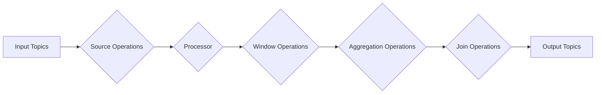

# Kafka Streams原理与代码实例讲解

> 关键词：Kafka Streams, 消息队列, 实时处理, 流式计算, Java API, 源操作, 转换操作, 聚合操作, 窗口操作, 连接操作

## 1. 背景介绍

随着大数据时代的到来，实时数据处理成为企业级应用的重要需求。Kafka Streams是Apache Kafka官方提供的流式处理框架，它允许开发者使用Java和Scala语言构建端到端的流式处理应用。Kafka Streams提供了一个简单、可扩展的平台，可以处理来自Kafka消息队列的数据流，并执行各种复杂的数据处理任务。

### 1.1 问题的由来

传统的数据处理架构通常采用批处理模式，这种模式在处理大量数据时效率低下，且难以实现实时性。随着实时数据处理的兴起，需要一种新的数据处理框架来支持实时数据的高效处理和分析。

### 1.2 研究现状

Kafka Streams自2014年开源以来，已经成为了流式处理领域的明星框架。它基于Kafka的分布式存储能力，提供了一种简单、高效、可扩展的实时数据处理解决方案。

### 1.3 研究意义

Kafka Streams的研究和应用具有重要意义，它可以帮助企业：

- 实现实时数据处理和分析，提高业务响应速度。
- 构建复杂的数据处理流程，实现数据清洗、转换、聚合等功能。
- 易于集成到现有的Kafka生态系统中，实现数据流的统一管理和监控。

### 1.4 本文结构

本文将分为以下几个部分：

- 核心概念与联系
- 核心算法原理与具体操作步骤
- 数学模型和公式
- 项目实践：代码实例和详细解释说明
- 实际应用场景
- 工具和资源推荐
- 总结：未来发展趋势与挑战
- 附录：常见问题与解答

## 2. 核心概念与联系

### 2.1 核心概念

- **Kafka消息队列**：一个分布式的发布/订阅消息系统，可以存储和处理大量数据。
- **流式计算**：对实时数据流进行处理和分析的计算范式。
- **源操作**：从Kafka主题中读取数据流的操作。
- **转换操作**：对数据流进行格式转换、过滤等操作。
- **聚合操作**：对数据流进行分组、计数、求和等聚合操作。
- **窗口操作**：对数据流进行时间窗口或计数窗口操作。
- **连接操作**：连接两个或多个数据流，并进行联合处理。

### 2.2 架构流程图



### 2.3 关系联系

Kafka Streams通过一系列操作将输入的主题（Input Topics）转换为输出的主题（Output Topics），中间经过源操作、转换操作、聚合操作、窗口操作和连接操作等多个处理步骤。

## 3. 核心算法原理与具体操作步骤

### 3.1 算法原理概述

Kafka Streams使用一个声明式的API来定义数据处理逻辑，然后将这些逻辑转换为高效的分布式执行计划。Kafka Streams内部使用Apache Flink作为底层执行引擎，利用其强大的流式处理能力来执行这些计划。

### 3.2 算法步骤详解

1. 定义源操作：指定输入主题，并配置如何读取数据。
2. 定义转换操作：对数据进行格式转换、过滤等操作。
3. 定义聚合操作：对数据进行分组、计数、求和等聚合操作。
4. 定义窗口操作：对数据进行时间窗口或计数窗口操作。
5. 定义连接操作：连接两个或多个数据流，并进行联合处理。
6. 定义输出操作：指定输出主题，并将处理后的数据写入到输出主题中。

### 3.3 算法优缺点

**优点**：

- 简单易用：使用声明式API定义数据处理逻辑，易于理解和使用。
- 高效可扩展：基于Apache Flink，能够高效地处理大规模数据流，并支持水平扩展。
- 易于监控和维护：Kafka Streams提供了丰富的监控指标，方便对系统进行监控和维护。

**缺点**：

- 学习曲线：Kafka Streams的学习曲线相对较陡峭，需要一定的Java或Scala编程基础。
- 性能开销：与纯Java或Scala应用程序相比，Kafka Streams会有一定的性能开销。

### 3.4 算法应用领域

Kafka Streams适用于以下应用领域：

- 实时数据监控和分析
- 实时数据转换和传输
- 实时事件处理
- 实时数据聚合

## 4. 数学模型和公式

### 4.1 数学模型构建

Kafka Streams中的数据处理过程可以抽象为一个数学模型，包括以下几个部分：

- **数据流**：表示输入和输出的数据流。
- **操作符**：表示对数据流进行操作的函数。
- **状态**：表示存储在Kafka Streams中的数据。

### 4.2 公式推导过程

假设有一个数据流 $X$，经过一系列操作符 $F_1, F_2, ..., F_n$ 后，得到新的数据流 $Y$。则数学模型可以表示为：

$$
Y = F_n(F_{n-1}(...(F_2(F_1(X)))...)
$$

### 4.3 案例分析与讲解

假设我们需要对Kafka中某个主题的数据进行过滤，只保留特定字段的数据，并将结果输出到另一个主题。可以使用以下代码实现：

```java
KStream<String, String> input = streamBuilder.stream("input_topic");
KStream<String, String> filteredStream = input.filter((key, value) -> value.contains("keyword"));
filteredStream.to("output_topic");
```

在这个例子中，`filter`操作符用于过滤数据流，只保留包含"keyword"字段的数据。`to`操作符用于将过滤后的数据流输出到"output_topic"主题。

## 5. 项目实践：代码实例和详细解释说明

### 5.1 开发环境搭建

要开始使用Kafka Streams，需要以下开发环境：

- Java或Scala开发环境
- Maven或SBT构建工具
- Kafka集群

### 5.2 源代码详细实现

以下是一个简单的Kafka Streams应用程序，它从Kafka主题中读取数据，过滤特定字段，并将结果输出到另一个主题：

```java
import org.apache.kafka.streams.KafkaStreams;
import org.apache.kafka.streams.StreamsBuilder;
import org.apache.kafka.streams.StreamsConfig;
import org.apache.kafka.streams.kstream.KStream;
import org.apache.kafka.streams.kstream.KStreamBuilder;

public class SimpleKafkaStreamsExample {
    public static void main(String[] args) {
        StreamsBuilder builder = new StreamsBuilder();

        KStream<String, String> input = builder.stream("input_topic");

        KStream<String, String> filteredStream = input.filter((key, value) -> value.contains("keyword"));

        filteredStream.to("output_topic");

        Properties props = new Properties();
        props.put(StreamsConfig.APPLICATION_ID_CONFIG, "simple-kafka-streams");
        props.put(StreamsConfig.BOOTSTRAP_SERVERS_CONFIG, "localhost:9092");
        props.put(StreamsConfig.DEFAULT_KEY_SERDE_CLASS_CONFIG, Serdes.String().getClass());
        props.put(StreamsConfig.DEFAULT_VALUE_SERDE_CLASS_CONFIG, Serdes.String().getClass());

        KafkaStreams streams = new KafkaStreams(builder.build(), props);
        streams.start();

        // Add shutdown hook to respond to SIGTERM and gracefully close Kafka Streams
        Runtime.getRuntime().addShutdownHook(new Thread(streams::close));
    }
}
```

### 5.3 代码解读与分析

- `StreamsBuilder`：用于构建Kafka Streams应用程序。
- `stream`：从Kafka主题中读取数据流。
- `filter`：对数据流进行过滤操作。
- `to`：将过滤后的数据流输出到另一个主题。
- `Properties`：配置Kafka Streams应用程序的属性。
- `KafkaStreams`：启动Kafka Streams应用程序。

### 5.4 运行结果展示

假设Kafka主题"input_topic"中的数据如下：

```
key1: value1
key2: value2
key3: keyword value3
key4: value4
```

经过过滤操作后，只有包含"keyword"字段的记录会被输出到"output_topic"主题：

```
key3: keyword value3
```

## 6. 实际应用场景

### 6.1 实时数据监控

Kafka Streams可以用于实时监控系统性能、用户行为等数据，并及时发出警报。

### 6.2 实时数据转换

Kafka Streams可以用于实时转换数据格式，例如将JSON数据转换为CSV格式。

### 6.3 实时事件处理

Kafka Streams可以用于实时处理和分析事件数据，例如检测异常交易、用户流失等。

### 6.4 实时数据聚合

Kafka Streams可以用于实时聚合数据，例如计算每小时的流量统计。

## 7. 工具和资源推荐

### 7.1 学习资源推荐

- Apache Kafka Streams官方文档
- 《Kafka Streams: Building Real-Time Applications Using the Kafka Streams API》书籍
- Kafka Streams社区论坛

### 7.2 开发工具推荐

- Maven或SBT构建工具
- IntelliJ IDEA或Eclipse集成开发环境

### 7.3 相关论文推荐

- Apache Kafka Streams论文
- Apache Flink论文

## 8. 总结：未来发展趋势与挑战

### 8.1 研究成果总结

Kafka Streams作为一种高效的流式处理框架，已经成为了实时数据处理领域的明星框架。它提供了一种简单、易用、可扩展的解决方案，可以帮助开发者快速构建实时数据处理应用。

### 8.2 未来发展趋势

- 支持更多编程语言
- 提高易用性和性能
- 加强与其他大数据技术的集成

### 8.3 面临的挑战

- 代码复杂度
- 性能优化
- 与其他大数据技术的集成

### 8.4 研究展望

Kafka Streams将继续发展，为实时数据处理领域提供更加强大的功能和更丰富的生态支持。

## 9. 附录：常见问题与解答

### 9.1 常见问题

**Q1：Kafka Streams和Apache Flink有什么区别？**

A1：Kafka Streams是Apache Flink的流式处理框架，它提供了更简单的API来构建流式处理应用程序。

**Q2：Kafka Streams如何处理容错？**

A2：Kafka Streams基于Apache Flink的容错机制，通过状态后端保证数据处理的正确性和一致性。

**Q3：Kafka Streams如何处理高并发？**

A3：Kafka Streams基于Apache Flink的分布式计算框架，可以水平扩展以处理高并发。

### 9.2 解答

**A1：Kafka Streams提供了更简单的API，而Apache Flink提供了更丰富的功能。如果需要更复杂的流式处理功能，可以考虑使用Apache Flink。**

**A2：Kafka Streams基于Apache Flink的状态后端保证数据处理的正确性和一致性。当发生故障时，Kafka Streams会自动从最近的一致性检查点恢复数据。**

**A3：Kafka Streams可以水平扩展以处理高并发。通过增加更多的节点，可以提升系统的吞吐量和处理能力。**

作者：禅与计算机程序设计艺术 / Zen and the Art of Computer Programming