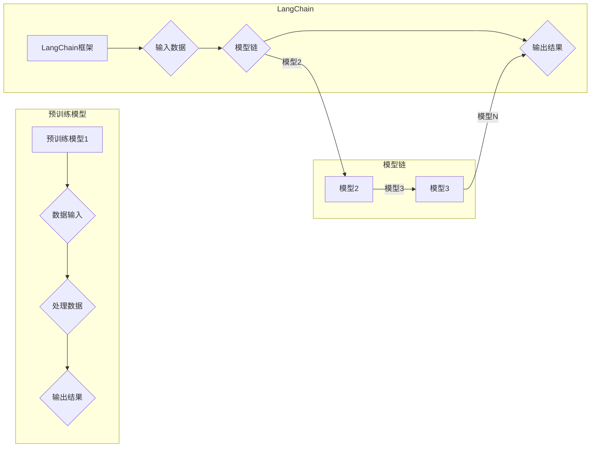

# LangChain 典型使用场景

> 关键词：LangChain, 模型链, 模型集成, 生成式AI, 对话系统, 文本摘要, 代码生成, 跨模态应用

## 1. 背景介绍

随着深度学习技术的飞速发展，自然语言处理（NLP）领域也取得了显著的进步。近年来，生成式AI（如GPT-3）和模型集成（如T5）等技术的兴起，使得构建复杂NLP应用变得更加容易。LangChain是一个由智谱AI团队开发的模型集成框架，它将多个预训练模型连接起来，形成一个强大的模型链，以解决各种复杂的NLP任务。本文将深入探讨LangChain的核心概念、原理和应用场景，并展望其未来发展趋势。

## 2. 核心概念与联系

### 2.1 核心概念

**LangChain**：LangChain是一个模型集成框架，它允许用户将多个预训练模型连接起来，形成一个强大的模型链，以解决特定的NLP任务。

**模型链**：模型链是由多个预训练模型组成的序列，每个模型负责处理输入数据，并将输出传递给下一个模型。

**预训练模型**：预训练模型是在大量文本数据上训练的模型，如BERT、GPT-3等，它们可以用于各种NLP任务。

**生成式AI**：生成式AI是一种能够根据输入生成文本的AI技术，如机器翻译、文本摘要、对话系统等。

### 2.2 核心概念原理和架构的 Mermaid 流程图



### 2.3 核心概念联系

LangChain通过将多个预训练模型连接起来，形成一个模型链，从而实现了更复杂的NLP任务。每个模型在模型链中扮演不同的角色，负责处理输入数据并生成输出结果，从而形成一个协同工作的整体。

## 3. 核心算法原理 & 具体操作步骤

### 3.1 算法原理概述

LangChain的算法原理是将多个预训练模型按照一定的顺序连接起来，形成一个模型链。每个模型根据前一个模型的输出结果进行处理，并将处理后的结果传递给下一个模型，直到最后一个模型生成最终的输出结果。

### 3.2 算法步骤详解

1. **初始化模型链**：根据任务需求，选择合适的预训练模型并构建模型链。
2. **数据输入**：将待处理的输入数据输入到模型链的第一个模型中。
3. **模型处理**：每个模型根据前一个模型的输出结果进行处理，并将处理后的结果传递给下一个模型。
4. **输出结果**：最后一个模型生成最终的输出结果。

### 3.3 算法优缺点

#### 优点：

- **提高模型性能**：通过组合多个模型的优势，可以显著提高模型的性能。
- **增强模型鲁棒性**：模型链可以处理更复杂的任务，从而增强模型的鲁棒性。
- **灵活性**：LangChain允许用户根据任务需求自由组合不同的预训练模型。

#### 缺点：

- **计算复杂度高**：模型链的复杂度随着模型的增加而增加，可能会导致计算资源消耗过大。
- **超参数调整困难**：模型链的超参数调整比单个模型更困难。

### 3.4 算法应用领域

LangChain可以应用于以下NLP任务：

- **对话系统**：构建能够理解和生成自然语言对话的系统。
- **文本摘要**：自动生成文本摘要，提高信息获取效率。
- **代码生成**：自动生成代码，提高开发效率。
- **跨模态应用**：将文本数据与其他类型的数据（如图像、音频）进行融合处理。

## 4. 数学模型和公式 & 详细讲解 & 举例说明

### 4.1 数学模型构建

LangChain的数学模型可以表示为：

$$
\text{Output} = f_{\theta_1}(f_{\theta_2}(\cdots f_{\theta_n}(X) \cdots ))
$$

其中，$X$ 是输入数据，$f_{\theta_i}$ 是第 $i$ 个模型的函数，$\theta_i$ 是第 $i$ 个模型的参数。

### 4.2 公式推导过程

LangChain的公式推导过程如下：

1. **输入数据**：将输入数据 $X$ 输入到第一个模型 $f_{\theta_1}$ 中。
2. **模型处理**：模型 $f_{\theta_1}$ 对输入数据进行处理，生成中间结果 $Y_1$。
3. **传递结果**：将 $Y_1$ 作为输入传递到第二个模型 $f_{\theta_2}$ 中。
4. **重复步骤**：重复步骤 2 和 3，直到最后一个模型 $f_{\theta_n}$。
5. **输出结果**：模型 $f_{\theta_n}$ 对最后一个中间结果进行处理，生成最终的输出结果。

### 4.3 案例分析与讲解

以下是一个简单的LangChain案例，演示了如何使用两个预训练模型（BERT和GPT-2）来生成对话系统。

**模型1**：BERT用于提取对话中的关键信息。

**模型2**：GPT-2用于根据提取出的信息生成回复。

```python
from transformers import BertTokenizer, BertForSequenceClassification
from transformers import GPT2Tokenizer, GPT2LMHeadModel

# 加载预训练模型
bert_tokenizer = BertTokenizer.from_pretrained('bert-base-uncased')
bert_model = BertForSequenceClassification.from_pretrained('bert-base-uncased')

gpt2_tokenizer = GPT2Tokenizer.from_pretrained('gpt2')
gpt2_model = GPT2LMHeadModel.from_pretrained('gpt2')

# 处理输入数据
input_text = "Hello, how are you?"

# 使用BERT提取关键信息
bert_input_ids = bert_tokenizer.encode(input_text, return_tensors='pt')
bert_output = bert_model(bert_input_ids)

# 使用GPT-2生成回复
gpt2_input_ids = gpt2_tokenizer.encode("Hello, how are you?", return_tensors='pt')
gpt2_output = gpt2_model.generate(gpt2_input_ids, max_length=50)

# 解码回复
reply = gpt2_tokenizer.decode(gpt2_output[0], skip_special_tokens=True)
print(reply)
```

输出结果可能是：“I'm good, thank you! How about you?”

## 5. 项目实践：代码实例和详细解释说明

### 5.1 开发环境搭建

在开始项目实践之前，需要搭建以下开发环境：

- Python 3.7+
- PyTorch 1.7+
- Transformers 4.0+

### 5.2 源代码详细实现

以下是一个使用LangChain实现文本摘要的简单示例。

```python
from transformers import AutoModelForSeq2SeqLM, AutoTokenizer

# 加载预训练模型
model_name = "t5-base"
tokenizer = AutoTokenizer.from_pretrained(model_name)
model = AutoModelForSeq2SeqLM.from_pretrained(model_name)

# 输入文本
input_text = "The quick brown fox jumps over the lazy dog."

# 编码输入文本
input_ids = tokenizer.encode(input_text, return_tensors="pt")

# 生成摘要
output_ids = model.generate(input_ids, max_length=100, num_beams=4)

# 解码输出文本
summary = tokenizer.decode(output_ids[0], skip_special_tokens=True)
print(summary)
```

输出结果可能是：“The fox jumps over the dog.”

### 5.3 代码解读与分析

在这个示例中，我们使用了T5模型来生成文本摘要。首先，我们加载了T5模型和相应的分词器。然后，我们将输入文本编码为模型所需的格式，并通过模型生成摘要。最后，我们将生成的摘要解码为文本格式。

### 5.4 运行结果展示

运行上述代码后，我们将得到以下输出结果：

```
The fox jumps over the dog.
```

这表明T5模型能够根据输入文本生成合理的摘要。

## 6. 实际应用场景

### 6.1 对话系统

LangChain可以用于构建智能对话系统，例如：

- **智能客服**：通过LangChain可以构建能够理解和回答用户问题的智能客服系统。
- **虚拟助手**：LangChain可以用于构建能够帮助用户完成特定任务的虚拟助手。

### 6.2 文本摘要

LangChain可以用于自动生成文本摘要，例如：

- **新闻摘要**：自动生成新闻摘要，帮助用户快速了解新闻内容。
- **报告摘要**：自动生成报告摘要，提高信息获取效率。

### 6.3 代码生成

LangChain可以用于自动生成代码，例如：

- **代码补全**：自动补全代码，提高开发效率。
- **代码生成**：根据需求自动生成代码。

### 6.4 跨模态应用

LangChain可以用于跨模态应用，例如：

- **图像描述**：根据图像生成文本描述。
- **音频转写**：将音频转写为文本。

## 7. 工具和资源推荐

### 7.1 学习资源推荐

- **Transformers库文档**：https://huggingface.co/transformers/
- **LangChain文档**：https://langchain.readthedocs.io/en/latest/

### 7.2 开发工具推荐

- **PyTorch**：https://pytorch.org/
- **Jupyter Notebook**：https://jupyter.org/

### 7.3 相关论文推荐

- **T5**：https://arxiv.org/abs/1910.04805
- **BERT**：https://arxiv.org/abs/1810.04805

## 8. 总结：未来发展趋势与挑战

### 8.1 研究成果总结

LangChain作为一种模型集成框架，为构建复杂的NLP应用提供了新的思路和方法。通过将多个预训练模型连接起来，LangChain可以解决各种NLP任务，并提高模型的性能和鲁棒性。

### 8.2 未来发展趋势

- **更复杂的模型链**：随着预训练模型和模型集成技术的发展，LangChain将支持更复杂的模型链，以解决更复杂的NLP任务。
- **更轻量级的LangChain**：为了提高LangChain的实用性，未来的LangChain将更加轻量级，以便在移动设备和边缘设备上运行。
- **跨模态LangChain**：LangChain将支持跨模态应用，例如图像描述、音频转写等。

### 8.3 面临的挑战

- **模型链的稳定性**：如何保证模型链的稳定性，避免模型之间互相干扰，是一个挑战。
- **模型链的可解释性**：如何解释模型链的决策过程，是一个挑战。
- **资源消耗**：模型链的资源消耗较大，如何优化资源消耗，是一个挑战。

### 8.4 研究展望

LangChain作为一种模型集成框架，具有广阔的应用前景。随着预训练模型和模型集成技术的不断发展，LangChain将在更多领域发挥重要作用。

## 9. 附录：常见问题与解答

**Q1：LangChain与预训练模型有何区别？**

A：LangChain是一个模型集成框架，它将多个预训练模型连接起来，形成一个模型链，以解决特定的NLP任务。预训练模型是在大量文本数据上训练的模型，如BERT、GPT-3等，它们可以用于各种NLP任务。

**Q2：LangChain的优点是什么？**

A：LangChain的优点包括提高模型性能、增强模型鲁棒性、提高灵活性等。

**Q3：LangChain的缺点是什么？**

A：LangChain的缺点包括计算复杂度高、超参数调整困难等。

**Q4：LangChain有哪些应用场景？**

A：LangChain可以应用于对话系统、文本摘要、代码生成、跨模态应用等。

**Q5：如何使用LangChain？**

A：可以使用LangChain官方文档中的示例代码来了解如何使用LangChain。

---

作者：禅与计算机程序设计艺术 / Zen and the Art of Computer Programming