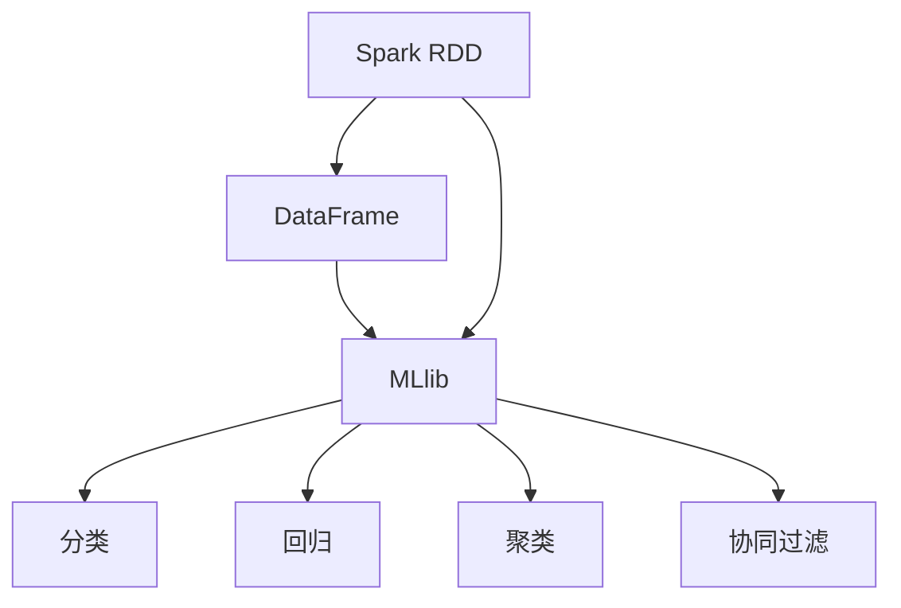

# Spark MLlib机器学习库原理与代码实例讲解

> 关键词：Spark MLlib，机器学习，分布式计算，数据挖掘，算法库，Python API，R API，Scala API，案例实践

## 1. 背景介绍

随着大数据时代的到来，如何高效地处理和分析海量数据成为了一个迫切需要解决的问题。Apache Spark作为一款强大的分布式计算框架，以其高吞吐量、容错性、易用性等优势，在数据处理和分析领域得到了广泛应用。Spark MLlib作为Spark生态系统中的一部分，为用户提供了一个丰富的机器学习库，支持多种机器学习算法，能够帮助用户轻松构建和部署智能应用程序。

## 2. 核心概念与联系

### 2.1 核心概念原理

Apache Spark MLlib包含以下几个核心概念：

- **RDD (Resilient Distributed Dataset)**: Spark的基本抽象，用于表示一个不可变的、可并行操作的分布式数据集。
- **DataFrame**: 在Spark中，DataFrame提供了一种以列式存储结构来组织数据的方式，方便进行复杂的数据操作。
- **MLlib**: Spark的机器学习库，提供了一系列机器学习算法，包括分类、回归、聚类、协同过滤等。
- **Pipeline**: MLlib中的Pipeline将多个步骤连接起来，形成一个端到端的机器学习工作流。

### 2.2 架构的 Mermaid 流程图



从图中可以看出，Spark RDD和DataFrame作为数据存储和处理的基础，MLlib提供了一系列机器学习算法，包括分类、回归、聚类和协同过滤等，用户可以根据具体需求选择合适的算法进行模型训练和预测。

## 3. 核心算法原理 & 具体操作步骤

### 3.1 算法原理概述

Spark MLlib提供了多种机器学习算法，以下是一些常见算法的概述：

- **分类**：用于预测离散标签，如逻辑回归、决策树、随机森林等。
- **回归**：用于预测连续值，如线性回归、岭回归等。
- **聚类**：用于将数据分组，如K-means、层次聚类等。
- **协同过滤**：用于预测用户偏好，如基于用户的协同过滤、基于物品的协同过滤等。

### 3.2 算法步骤详解

以下以逻辑回归为例，介绍Spark MLlib中机器学习算法的具体操作步骤：

1. **数据准备**：将数据集加载为DataFrame格式。
2. **特征工程**：对数据进行预处理，如分箱、特征选择等。
3. **模型训练**：使用MLlib中的逻辑回归算法训练模型。
4. **模型评估**：使用测试数据评估模型的性能。
5. **模型应用**：使用训练好的模型进行预测。

### 3.3 算法优缺点

- **优点**：Spark MLlib算法具有以下优点：
  - 分布式计算：能够高效处理海量数据。
  - 易用性：提供Python API、R API和Scala API，方便用户使用。
  - 扩展性：支持多种机器学习算法，满足不同应用需求。
- **缺点**：Spark MLlib算法可能存在以下缺点：
  - 依赖Spark环境：需要搭建Spark集群，对环境要求较高。
  - 算法库相对较小：与一些成熟的机器学习框架（如scikit-learn）相比，算法库较为有限。

### 3.4 算法应用领域

Spark MLlib算法在以下领域有广泛应用：

- 金融市场分析
- 搜索引擎推荐
- 社交网络分析
- 客户关系管理
- 医疗健康

## 4. 数学模型和公式 & 详细讲解 & 举例说明

### 4.1 数学模型构建

以下以逻辑回归为例，介绍其数学模型构建过程：

假设我们有一个包含m个特征的数据集X，每个样本的标签为y。逻辑回归的目标是找到一个线性模型，使得对于输入x，模型的预测值能够尽可能地接近真实标签y。

逻辑回归的预测函数为：

$$
\hat{y} = \sigma(w^T x + b)
$$

其中，$\sigma$为sigmoid函数，$w$为模型参数，$b$为偏置项。

### 4.2 公式推导过程

逻辑回归的目标是最小化预测值与真实标签之间的损失函数。常见的损失函数有对数损失和平方损失。

对数损失为：

$$
L(\theta) = -\sum_{i=1}^m [y_i \log(\hat{y}_i) + (1 - y_i) \log(1 - \hat{y}_i)]
$$

平方损失为：

$$
L(\theta) = \frac{1}{2m} \sum_{i=1}^m [y_i - \hat{y}_i]^2
$$

### 4.3 案例分析与讲解

以下使用PySpark进行逻辑回归的案例：

```python
from pyspark.sql import SparkSession
from pyspark.ml.classification import LogisticRegression
from pyspark.ml.evaluation import BinaryClassificationEvaluator

# 创建SparkSession
spark = SparkSession.builder.appName("Spark MLlib Example").getOrCreate()

# 加载数据
data = spark.read.format("libsvm").load("path/to/data")

# 切分数据集
train_data, test_data = data.randomSplit([0.7, 0.3])

# 创建逻辑回归模型
lr = LogisticRegression(maxIter=10, regParam=0.01)

# 训练模型
model = lr.fit(train_data)

# 评估模型
predictions = model.transform(test_data)
evaluator = BinaryClassificationEvaluator()
accuracy = evaluator.evaluate(predictions)

# 打印准确率
print("Accuracy: %f" % accuracy)

# 关闭SparkSession
spark.stop()
```

以上代码使用PySpark实现逻辑回归，并评估了模型的准确率。

## 5. 项目实践：代码实例和详细解释说明

### 5.1 开发环境搭建

在进行Spark MLlib项目实践前，需要搭建Spark开发环境。以下是使用PySpark进行开发的步骤：

1. 安装Anaconda：从官网下载并安装Anaconda，用于创建独立的Python环境。
2. 创建并激活虚拟环境：
```bash
conda create -n spark-env python=3.8
conda activate spark-env
```
3. 安装PySpark：
```bash
conda install pyspark -c conda-forge
```
4. 安装Python库：
```bash
pip install pandas numpy matplotlib
```

### 5.2 源代码详细实现

以下是一个使用PySpark进行逻辑回归的完整代码示例：

```python
from pyspark.sql import SparkSession
from pyspark.ml.classification import LogisticRegression
from pyspark.ml.evaluation import BinaryClassificationEvaluator

# 创建SparkSession
spark = SparkSession.builder.appName("Spark MLlib Example").getOrCreate()

# 加载数据
data = spark.read.format("libsvm").load("path/to/data")

# 切分数据集
train_data, test_data = data.randomSplit([0.7, 0.3])

# 创建逻辑回归模型
lr = LogisticRegression(maxIter=10, regParam=0.01)

# 训练模型
model = lr.fit(train_data)

# 评估模型
predictions = model.transform(test_data)
evaluator = BinaryClassificationEvaluator()
accuracy = evaluator.evaluate(predictions)

# 打印准确率
print("Accuracy: %f" % accuracy)

# 关闭SparkSession
spark.stop()
```

### 5.3 代码解读与分析

以上代码实现了以下功能：

1. 创建SparkSession：初始化Spark会话。
2. 加载数据：将libsvm格式的数据集加载为DataFrame。
3. 切分数据集：将数据集随机分为训练集和测试集。
4. 创建逻辑回归模型：创建一个逻辑回归模型，并设置最大迭代次数和正则化参数。
5. 训练模型：使用训练集数据训练模型。
6. 评估模型：使用测试集数据评估模型的性能，并打印准确率。
7. 关闭SparkSession：关闭Spark会话。

### 5.4 运行结果展示

假设我们在测试集上得到的准确率为0.85，表示模型在测试数据上的表现良好。

## 6. 实际应用场景

### 6.1 金融市场分析

Spark MLlib可以用于金融市场的风险评估、欺诈检测、投资组合优化等任务。通过构建机器学习模型，可以对市场数据进行预测和分析，帮助金融机构做出更明智的决策。

### 6.2 搜索引擎推荐

Spark MLlib可以用于构建个性化推荐系统，通过对用户历史行为的分析，预测用户可能感兴趣的内容，从而提高用户满意度。

### 6.3 社交网络分析

Spark MLlib可以用于分析社交网络中的用户关系，发现网络结构，识别关键节点，从而为社交网络平台的运营提供支持。

### 6.4 未来应用展望

随着Spark MLlib功能的不断完善和优化，其在实际应用场景中的应用将更加广泛。以下是一些未来应用展望：

- **多模态数据分析**：将Spark MLlib与其他大数据技术（如图像处理、语音识别等）结合，实现多模态数据分析。
- **实时机器学习**：将Spark MLlib与流处理技术结合，实现实时机器学习应用。
- **深度学习**：将Spark MLlib与深度学习框架结合，实现深度学习应用。

## 7. 工具和资源推荐

### 7.1 学习资源推荐

- 《Spark快速大数据处理》：详细介绍了Spark的架构、API和实战案例。
- 《Spark MLlib机器学习库实战》：介绍了Spark MLlib的基本概念、算法和实战案例。
- Apache Spark官网文档：提供Spark的官方文档，包括API文档、教程和案例。

### 7.2 开发工具推荐

- PySpark：Spark的Python API，方便Python开发者使用Spark进行机器学习。
- SparkR：Spark的R API，方便R开发者使用Spark进行机器学习。
- Scala API：Spark的Scala API，方便Scala开发者使用Spark进行机器学习。

### 7.3 相关论文推荐

- 《Large-scale Distributed Machine Learning: Mechanism and Algorithms》：介绍了大规模分布式机器学习的机制和算法。
- 《Distributed Optimization of Deep Learning via Decentralized Optimization》：介绍了分布式深度学习优化算法。
- 《Efficient Distributed Optimization by Decentralized Optimization and Mini-batch Learning》：介绍了高效分布式优化的机制和算法。

## 8. 总结：未来发展趋势与挑战

### 8.1 研究成果总结

本文介绍了Apache Spark MLlib机器学习库的原理、算法和实战案例。通过本文的学习，读者可以了解到Spark MLlib的强大功能和广泛应用，并能够使用Spark MLlib进行实际项目的开发。

### 8.2 未来发展趋势

随着大数据和人工智能技术的不断发展，Spark MLlib将呈现以下发展趋势：

- **算法多样化**：Spark MLlib将支持更多种类的机器学习算法，满足不同应用需求。
- **易用性提升**：Spark MLlib将提供更加简洁、易用的API，降低用户使用门槛。
- **性能优化**：Spark MLlib将进行性能优化，提高算法的运行效率。

### 8.3 面临的挑战

Spark MLlib在发展过程中也面临着一些挑战：

- **算法库扩展**：需要不断扩展Spark MLlib的算法库，满足更多应用需求。
- **易用性提升**：需要进一步提升Spark MLlib的易用性，降低用户使用门槛。
- **性能优化**：需要不断优化Spark MLlib的性能，提高算法的运行效率。

### 8.4 研究展望

展望未来，Spark MLlib将在以下方面进行深入研究：

- **算法创新**：开发新的机器学习算法，提高模型性能。
- **跨平台支持**：支持更多编程语言和操作系统。
- **与深度学习结合**：将Spark MLlib与深度学习框架结合，实现深度学习应用。

## 9. 附录：常见问题与解答

**Q1：Spark MLlib与scikit-learn有何区别？**

A：Spark MLlib和scikit-learn都是机器学习库，但它们有以下区别：

- **平台**：Spark MLlib是Apache Spark生态系统的一部分，适合处理海量数据；scikit-learn是Python生态系统的机器学习库，适合小规模数据。
- **算法库**：Spark MLlib提供了更多分布式机器学习算法；scikit-learn提供了更多的经典机器学习算法。
- **易用性**：Spark MLlib的易用性相对较低，需要搭建Spark环境；scikit-learn的易用性较高，适合初学者。

**Q2：如何使用Spark MLlib进行特征工程？**

A：Spark MLlib提供了多种特征工程工具，如VectorAssembler、OneHotEncoder、StringIndexer等，可以方便地进行特征转换、编码和选择。

**Q3：如何评估Spark MLlib模型性能？**

A：Spark MLlib提供了多种评估指标，如准确率、召回率、F1分数等，可以用于评估模型性能。

**Q4：Spark MLlib是否支持深度学习？**

A：Spark MLlib目前不支持深度学习，但与深度学习框架（如TensorFlow、PyTorch等）结合，可以实现深度学习应用。

**Q5：Spark MLlib如何与Hive、Pig等Spark组件结合使用？**

A：Spark MLlib可以与Hive、Pig等Spark组件结合使用，实现对大数据集的机器学习分析。

作者：禅与计算机程序设计艺术 / Zen and the Art of Computer Programming