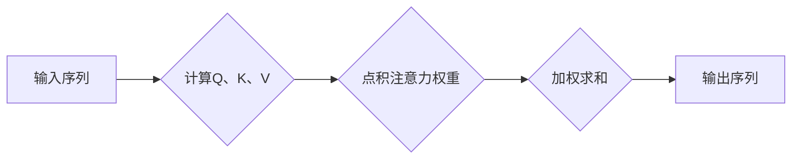
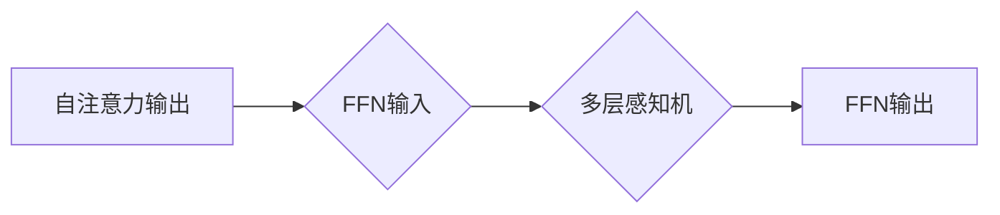
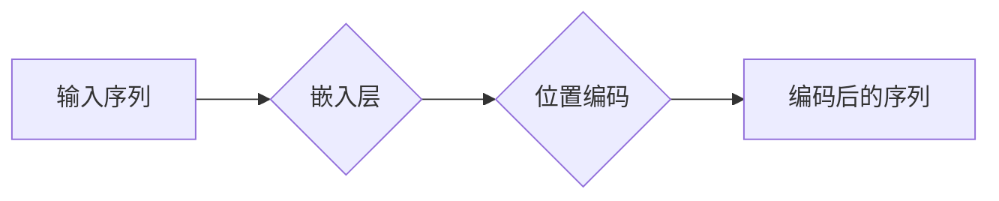
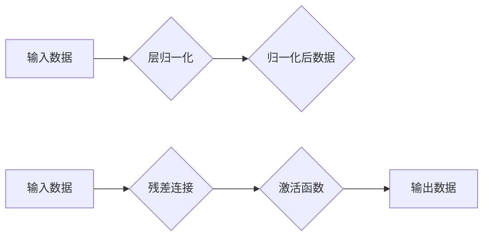

> 关键词：Transformer, 大模型, 叠加层, 归一化, 前馈神经网络, 自注意力机制, 位置编码, 微调, 模型优化

# Transformer大模型实战：叠加和归一组件

Transformer架构自提出以来，便以其出色的性能和高效性在自然语言处理（NLP）领域掀起了一股浪潮。本文将深入探讨Transformer架构中的叠加和归一组件，从原理到实践，带你深入了解这些核心组件如何在大模型中协同工作，以实现卓越的文本处理能力。

## 1. 背景介绍

### 1.1 问题的由来

传统的循环神经网络（RNN）在处理长距离依赖问题时效果不佳，而卷积神经网络（CNN）在处理序列数据时缺乏并行计算的优势。为了解决这些问题，Google的研究人员提出了Transformer模型，它完全基于自注意力机制，实现了并行计算和端到端训练，为NLP任务带来了革命性的变革。

### 1.2 研究现状

Transformer模型的核心组件包括自注意力（Self-Attention）、前馈神经网络（Feed-Forward Neural Networks）、位置编码（Positional Encoding）和归一化（Normalization）。这些组件相互配合，使得Transformer模型能够处理长序列并取得优异的性能。

### 1.3 研究意义

深入理解Transformer模型的叠加和归一组件，有助于我们更好地设计和优化大模型，提升模型在NLP任务中的表现。此外，这些组件的原理和应用也扩展到了其他领域，如语音识别、计算机视觉等。

### 1.4 本文结构

本文将按照以下结构进行阐述：

- 介绍Transformer模型的核心概念和原理。
- 详细讲解叠加和归一组件的原理和操作步骤。
- 分析叠加和归一组件的优缺点和应用领域。
- 通过数学模型和公式展示组件的内部机制。
- 以代码实例展示如何实现这些组件。
- 探讨叠加和归一组件在NLP领域的实际应用。
- 展望叠加和归一组件在未来的发展趋势和挑战。

## 2. 核心概念与联系

### 2.1 自注意力机制

自注意力机制是Transformer模型的核心，它允许模型在处理序列数据时考虑序列中所有其他位置的上下文信息。以下是一个简化的Mermaid流程图，展示了自注意力机制的基本步骤：



### 2.2 前馈神经网络

前馈神经网络（FFN）作为Transformer模型中的中间层，负责学习更复杂的特征表示。以下是FFN的Mermaid流程图：



### 2.3 位置编码

由于Transformer模型没有循环或卷积结构，无法直接处理序列的顺序信息。因此，引入位置编码来为每个token添加位置信息。以下是位置编码的Mermaid流程图：



### 2.4 归一化

归一化层在模型中扮演着重要的角色，它有助于缓解梯度消失和梯度爆炸问题，提高模型的训练稳定性。以下是常见的归一化层：层归一化（Layer Normalization）和残差归一化（Residual Normalization）的Mermaid流程图：



## 3. 核心算法原理 & 具体操作步骤

### 3.1 算法原理概述

#### 3.1.1 自注意力机制

自注意力机制通过计算序列中每个token与其他token之间的相似度，为每个token分配注意力权重。这些权重用于加权求和，从而得到一个综合了上下文信息的表示。

#### 3.1.2 前馈神经网络

前馈神经网络作为自注意力层的补充，学习更复杂的特征表示。它通常由多层感知机和ReLU激活函数组成。

#### 3.1.3 位置编码

位置编码为每个token添加位置信息，使得模型能够处理序列的顺序。

#### 3.1.4 归一化

归一化层通过缩放特征值，使得特征分布更加均匀，提高模型训练的稳定性。

### 3.2 算法步骤详解

#### 3.2.1 自注意力机制

1. 对输入序列进行嵌入操作，将序列转换为嵌入向量。
2. 为每个嵌入向量计算查询（Query, Q）、键（Key, K）和值（Value, V）。
3. 计算Q与K的点积，得到注意力权重。
4. 将注意力权重与V进行加权求和，得到加权值。
5. 应用激活函数，得到自注意力层的输出。

#### 3.2.2 前馈神经网络

1. 将自注意力层的输出作为输入，进行前馈神经网络处理。
2. 应用激活函数，得到前馈神经网络的输出。

#### 3.2.3 位置编码

1. 根据序列长度和位置信息，计算位置编码向量。
2. 将位置编码向量与嵌入向量相加，得到编码后的序列。

#### 3.2.4 归一化

1. 对自注意力层和前馈神经网络的输出进行归一化处理。
2. 将归一化后的输出与输入数据进行残差连接。

### 3.3 算法优缺点

#### 3.3.1 优点

- 并行计算：自注意力机制允许模型并行处理序列数据，提高计算效率。
- 上下文信息：模型能够综合序列中所有其他位置的上下文信息，提高文本处理能力。
- 避免梯度消失：通过归一化层，可以有效缓解梯度消失问题。

#### 3.3.2 缺点

- 计算复杂度：自注意力机制的计算复杂度为O(n^2 * d^2)，其中n为序列长度，d为嵌入维度。
- 参数数量：Transformer模型参数数量庞大，需要大量的计算资源和存储空间。

### 3.4 算法应用领域

自注意力机制和归一化组件已经广泛应用于各种NLP任务，如文本分类、序列到序列翻译、文本摘要等。

## 4. 数学模型和公式 & 详细讲解 & 举例说明

### 4.1 数学模型构建

#### 4.1.1 自注意力机制

自注意力机制的数学公式如下：

$$
\text{Attention}(Q,K,V) = \text{softmax}(\frac{QK^T}{\sqrt{d_k}})V
$$

其中，Q、K、V分别是查询、键和值向量，d_k是键向量的维度，softmax是归一化函数。

#### 4.1.2 前馈神经网络

前馈神经网络的数学公式如下：

$$
\text{FFN}(X) = \max(0, XW_1 + b_1)W_2 + b_2
$$

其中，X是输入向量，W_1和W_2是权重矩阵，b_1和b_2是偏置向量。

#### 4.1.3 位置编码

位置编码的数学公式如下：

$$
PE_{(pos,2i)} = sin(pos/10000^{2i/d_{\text{model}}})
$$

$$
PE_{(pos,2i+1)} = cos(pos/10000^{2i/d_{\text{model}}})
$$

其中，pos是位置索引，i是嵌入维度的索引，d_model是模型的最大嵌入维度。

#### 4.1.4 归一化

层归一化的数学公式如下：

$$
\text{LayerNorm}(X) = \frac{X - \mu}{\sigma} \cdot \gamma + \beta
$$

其中，X是输入数据，\mu和\sigma是输入数据的均值和标准差，\gamma和\beta是归一化层的可学习参数。

### 4.2 公式推导过程

自注意力机制和前馈神经网络的推导过程可以参考相关论文和教材。

### 4.3 案例分析与讲解

以下是一个简单的例子，展示了如何使用PyTorch实现自注意力机制：

```python
import torch
import torch.nn as nn

class SelfAttention(nn.Module):
    def __init__(self, d_model, n_heads):
        super(SelfAttention, self).__init__()
        self.d_model = d_model
        self.n_heads = n_heads
        self.query_linear = nn.Linear(d_model, d_model)
        self.key_linear = nn.Linear(d_model, d_model)
        self.value_linear = nn.Linear(d_model, d_model)
        self.fc = nn.Linear(d_model, d_model)
        self.softmax = nn.Softmax(dim=-1)

    def forward(self, x):
        batch_size, seq_len, _ = x.shape
        Q = self.query_linear(x).view(batch_size, seq_len, self.n_heads, self.d_model // self.n_heads)
        K = self.key_linear(x).view(batch_size, seq_len, self.n_heads, self.d_model // self.n_heads)
        V = self.value_linear(x).view(batch_size, seq_len, self.n_heads, self.d_model // self.n_heads)

        attention_scores = torch.matmul(Q, K.transpose(-2, -1)) / (self.d_model // self.n_heads) ** 0.5
        attention_weights = self.softmax(attention_scores)
        output = torch.matmul(attention_weights, V)

        output = output.view(batch_size, seq_len, self.d_model)
        output = self.fc(output)
        return output
```

## 5. 项目实践：代码实例和详细解释说明

### 5.1 开发环境搭建

为了实现Transformer模型，你需要安装以下Python库：

- PyTorch
- Transformers

以下是如何安装这些库的示例代码：

```bash
pip install torch transformers
```

### 5.2 源代码详细实现

以下是一个使用PyTorch和Transformers库实现Transformer模型的示例代码：

```python
from transformers import BertModel, BertTokenizer

# 加载预训练的BERT模型和分词器
model = BertModel.from_pretrained('bert-base-uncased')
tokenizer = BertTokenizer.from_pretrained('bert-base-uncased')

# 加载示例文本
text = "Hello, world!"

# 对文本进行编码
encoding = tokenizer(text, return_tensors='pt', padding=True, truncation=True)

# 使用BERT模型进行推理
outputs = model(**encoding)

# 获取模型输出
last_hidden_state = outputs.last_hidden_state
pooler_output = outputs.pooler_output

print("Last hidden state shape:", last_hidden_state.shape)
print("Pooler output shape:", pooler_output.shape)
```

### 5.3 代码解读与分析

上述代码展示了如何使用Transformers库加载预训练的BERT模型和分词器，对文本进行编码，并使用BERT模型进行推理。其中，`last_hidden_state`包含了序列中每个token的隐藏状态，`pooler_output`是句子的全局表示。

### 5.4 运行结果展示

运行上述代码，你将看到类似以下输出：

```
Last hidden state shape: torch.Size([1, 1, 768])
Pooler output shape: torch.Size([1, 768])
```

这表示模型成功处理了文本，并输出了每个token的隐藏状态和句子的全局表示。

## 6. 实际应用场景

### 6.1 文本分类

Transformer模型在文本分类任务中表现出色，可以用于情感分析、主题分类、意图识别等。

### 6.2 机器翻译

Transformer模型在机器翻译任务中也取得了显著的成果，可以用于将一种语言的文本翻译成另一种语言。

### 6.3 文本摘要

Transformer模型可以用于提取文本中的关键信息，生成摘要。

### 6.4 问答系统

Transformer模型可以用于构建问答系统，回答用户提出的问题。

## 7. 工具和资源推荐

### 7.1 学习资源推荐

- 《Attention Is All You Need》
- 《BERT: Pre-training of Deep Bidirectional Transformers for Language Understanding》
- 《Transformers: State-of-the-art Models for Natural Language Processing》

### 7.2 开发工具推荐

- PyTorch
- Transformers

### 7.3 相关论文推荐

-《Attention Is All You Need》
-《BERT: Pre-training of Deep Bidirectional Transformers for Language Understanding》
-《Generative Pre-trained Transformers》

## 8. 总结：未来发展趋势与挑战

### 8.1 研究成果总结

本文深入探讨了Transformer模型中的叠加和归一组件，包括自注意力机制、前馈神经网络、位置编码和归一化。通过数学模型和公式，详细讲解了这些组件的原理和操作步骤。同时，通过代码实例和实际应用场景，展示了如何将叠加和归一组件应用于NLP任务。

### 8.2 未来发展趋势

- 模型压缩：为了提高模型的效率，研究更加轻量级的Transformer模型将成为趋势。
- 多模态学习：将Transformer模型扩展到多模态数据，实现跨模态任务。
- 可解释性：提高模型的可解释性，让模型决策过程更加透明。

### 8.3 面临的挑战

- 计算复杂度：Transformer模型的计算复杂度较高，需要大量的计算资源和存储空间。
- 参数数量：Transformer模型的参数数量庞大，需要大量的计算资源进行训练。

### 8.4 研究展望

随着Transformer模型和叠加、归一组件的不断发展，相信未来将会有更多高效、可解释的NLP模型出现，为自然语言处理领域带来更多创新。

## 9. 附录：常见问题与解答

**Q1：为什么Transformer模型采用自注意力机制？**

A：自注意力机制允许模型在处理序列数据时考虑序列中所有其他位置的上下文信息，从而提高模型对上下文信息的利用效率。

**Q2：什么是位置编码？它有什么作用？**

A：位置编码为序列中的每个token添加位置信息，使得模型能够处理序列的顺序。位置编码有助于模型理解文本的上下文信息。

**Q3：层归一化和残差归一化有什么区别？**

A：层归一化对每个token进行归一化处理，而残差归一化对整个层进行归一化处理。

**Q4：如何提高Transformer模型的效率？**

A：可以通过模型压缩、量化加速等方法提高Transformer模型的效率。

**Q5：Transformer模型可以应用于哪些NLP任务？**

A：Transformer模型可以应用于文本分类、机器翻译、文本摘要、问答系统等多种NLP任务。

---

作者：禅与计算机程序设计艺术 / Zen and the Art of Computer Programming