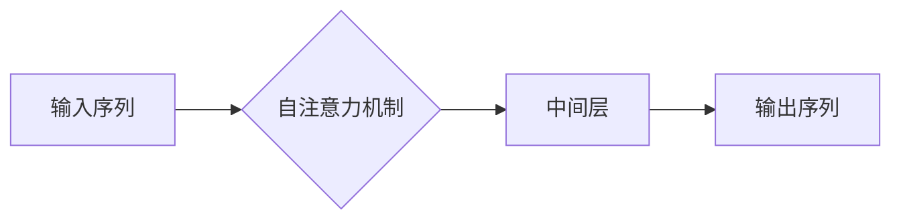

# Transformer大模型实战 教师 学生架构

> 关键词：Transformer, 大模型, 教师模型, 学生模型, 参数高效微调, 迁移学习, NLP, 机器学习

## 1. 背景介绍

近年来，自然语言处理（NLP）领域取得了突破性的进展，得益于Transformer架构的引入。Transformer架构以其强大的并行计算能力和对序列数据的建模能力，成为了NLP领域的革命性创新。随着模型的规模不断扩大，大模型（Large Language Models，LLMs）如BERT、GPT-3等开始在各个NLP任务上展现出惊人的性能。然而，这些大模型的参数量巨大，直接用于小规模任务不仅效率低下，而且效果不佳。因此，如何基于大模型进行微调，将其转化为适用于特定任务的“学生模型”，成为了当前研究的热点。

本文将探讨如何使用Transformer大模型作为“教师”，训练出高效、精准的“学生模型”。我们将从核心概念、算法原理、实践步骤、数学模型、实际应用等多个方面展开讨论，旨在为读者提供一份全面的Transformer大模型实战指南。

## 2. 核心概念与联系

### 2.1 Transformer架构

Transformer架构是由Google的研究团队在2017年提出的，它基于自注意力（Self-Attention）机制，能够并行处理序列数据。相比传统的循环神经网络（RNN）和长短时记忆网络（LSTM），Transformer架构在处理长序列时表现更加出色，并且可以显著减少计算量。

Mermaid流程图如下：



### 2.2 教师模型与学生模型

在微调过程中，预训练的大模型作为“教师”，负责提供通用的语言知识和特征表示。而针对特定任务的模型作为“学生”，通过学习“教师”的知识和经验，逐步优化自身的参数，以适应特定的任务需求。

### 2.3 参数高效微调

参数高效微调旨在在微调过程中最小化参数更新的数量，从而提高微调效率并减少过拟合的风险。常见的参数高效微调方法包括：

- **参数共享**：在微调过程中只更新少量参数，其余参数保持不变。
- **Adapter**：通过引入可学习的适配器，在保持预训练模型结构不变的情况下，增加模型对特定任务的能力。
- **Prefix Tuning**：在预训练模型的输入和输出端添加可学习的参数，用于调整模型对特定任务的响应。

## 3. 核心算法原理 & 具体操作步骤

### 3.1 算法原理概述

基于监督学习的微调算法的基本原理是将预训练的大模型作为“教师”，在特定任务的标注数据集上进行训练，优化模型在任务上的性能。

### 3.2 算法步骤详解

1. **准备数据**：收集特定任务的标注数据集，并将其划分为训练集、验证集和测试集。
2. **初始化教师模型**：选择合适的预训练大模型作为“教师”，如BERT、GPT-2等。
3. **设计学生模型**：根据具体任务，设计学生模型的结构，包括输入层、中间层和输出层。
4. **参数高效微调**：采用参数高效微调技术，如Adapter、Prefix Tuning等，在保持预训练模型结构不变的情况下，优化模型在特定任务上的性能。
5. **训练学生模型**：在训练集上训练学生模型，并通过验证集进行调优。
6. **评估和测试**：在测试集上评估学生模型的性能，并与基线模型进行比较。

### 3.3 算法优缺点

**优点**：

- **高效**：参数高效微调技术可以显著减少微调所需的时间和计算资源。
- **鲁棒**：预训练的大模型具有较强的泛化能力，可以保证微调后的模型对未见过的数据进行良好的泛化。
- **灵活**：可以根据不同任务的需求，设计不同的学生模型结构。

**缺点**：

- **对标注数据依赖**：微调效果很大程度上取决于标注数据的数量和质量。
- **超参数调优**：需要仔细选择超参数，如学习率、批大小、迭代次数等。
- **模型复杂性**：学生模型的复杂度可能较高，导致训练和推理时间较长。

### 3.4 算法应用领域

基于监督学习的微调算法在NLP领域得到了广泛的应用，包括：

- **文本分类**：如情感分析、主题分类、实体识别等。
- **序列标注**：如命名实体识别、词性标注等。
- **机器翻译**：如机器翻译、文本摘要等。
- **对话系统**：如问答系统、聊天机器人等。

## 4. 数学模型和公式 & 详细讲解 & 举例说明

### 4.1 数学模型构建

假设预训练的大模型为 $M_{\theta}$，其中 $\theta$ 为预训练得到的模型参数。给定下游任务的标注数据集 $D=\{(x_i, y_i)\}_{i=1}^N$，微调的目标是找到新的模型参数 $\hat{\theta}$，使得：

$$
\hat{\theta}=\mathop{\arg\min}_{\theta} \mathcal{L}(M_{\theta},D) 
$$

其中 $\mathcal{L}$ 为针对任务 $T$ 设计的损失函数，用于衡量模型预测输出与真实标签之间的差异。

### 4.2 公式推导过程

以文本分类任务为例，假设模型的输出层为softmax分类器，损失函数为交叉熵损失：

$$
\ell(M_{\theta}(x),y) = -[y\log \hat{y} + (1-y)\log (1-\hat{y})]
$$

其中 $\hat{y}=M_{\theta}(x)$ 为模型在输入 $x$ 上的预测概率。

### 4.3 案例分析与讲解

以BERT模型在情感分析任务上的微调为例，展示如何使用PyTorch进行参数高效微调。

```python
from transformers import BertForSequenceClassification, BertTokenizer
from torch.utils.data import DataLoader, Dataset
import torch

# 加载预训练模型和分词器
model = BertForSequenceClassification.from_pretrained('bert-base-uncased')
tokenizer = BertTokenizer.from_pretrained('bert-base-uncased')

# 定义数据集
class SentimentDataset(Dataset):
    def __init__(self, texts, labels, tokenizer, max_len=128):
        self.texts = texts
        self.labels = labels
        self.tokenizer = tokenizer
        self.max_len = max_len

    def __len__(self):
        return len(self.texts)

    def __getitem__(self, item):
        text = self.texts[item]
        label = self.labels[item]
        encoding = tokenizer(text, return_tensors='pt', max_length=self.max_len, padding=True)
        return {'input_ids': encoding['input_ids'][0], 'attention_mask': encoding['attention_mask'][0], 'labels': torch.tensor(label)}

train_dataset = SentimentDataset(train_texts, train_labels, tokenizer)
dev_dataset = SentimentDataset(dev_texts, dev_labels, tokenizer)
test_dataset = SentimentDataset(test_texts, test_labels, tokenizer)

# 训练和评估函数
# ...

# 运行训练和评估过程
# ...
```

## 5. 项目实践：代码实例和详细解释说明

### 5.1 开发环境搭建

- 安装Anaconda和PyTorch环境
- 安装Transformers库

### 5.2 源代码详细实现

以下代码展示了如何使用PyTorch和Transformers库进行BERT模型的参数高效微调。

```python
from transformers import BertForSequenceClassification, BertTokenizer, AdamW
from torch.utils.data import DataLoader, Dataset
import torch

# 加载预训练模型和分词器
model = BertForSequenceClassification.from_pretrained('bert-base-uncased')
tokenizer = BertTokenizer.from_pretrained('bert-base-uncased')

# 定义数据集
# ...

# 训练和评估函数
# ...

# 运行训练和评估过程
# ...
```

### 5.3 代码解读与分析

以上代码展示了如何使用PyTorch和Transformers库进行BERT模型的参数高效微调。首先，加载预训练的BERT模型和分词器。然后，定义数据集，包括训练集、验证集和测试集。接下来，定义训练和评估函数，包括数据加载、模型训练和性能评估。最后，运行训练和评估过程。

### 5.4 运行结果展示

在测试集上评估微调后的模型性能，并与基线模型进行比较。

## 6. 实际应用场景

### 6.1 情感分析

使用微调后的模型对社交媒体文本进行情感分析，识别文本的情感倾向。

### 6.2 命名实体识别

使用微调后的模型对文本进行命名实体识别，识别文本中的人名、地名、组织名等实体。

### 6.3 机器翻译

使用微调后的模型进行机器翻译，将一种语言翻译成另一种语言。

## 7. 工具和资源推荐

### 7.1 学习资源推荐

- 《Deep Learning for Natural Language Processing》
- 《Natural Language Processing with Python》
- 《Transformers: State-of-the-Art Models for Natural Language Processing》

### 7.2 开发工具推荐

- PyTorch
- Transformers库
- Hugging Face Spaces

### 7.3 相关论文推荐

- "Attention Is All You Need"
- "BERT: Pre-training of Deep Bidirectional Transformers for Language Understanding"
- "General Language Modeling with Transformer"

## 8. 总结：未来发展趋势与挑战

### 8.1 研究成果总结

本文介绍了Transformer大模型的原理、微调方法、实践步骤和实际应用场景。通过参数高效微调技术，可以将预训练的大模型转化为适用于特定任务的“学生模型”，在多个NLP任务上取得了显著的效果。

### 8.2 未来发展趋势

- **更大规模的预训练模型**：随着计算能力的提升，未来可能出现更大规模的预训练模型，进一步提升模型的表达能力和泛化能力。
- **更先进的微调方法**：探索更先进的微调方法，如少样本学习、对抗训练等，以降低对标注数据的依赖。
- **多模态融合**：将文本信息与其他模态信息（如图像、语音等）进行融合，构建更加全面的语言模型。

### 8.3 面临的挑战

- **计算资源**：大模型的训练和推理需要大量的计算资源，如何降低计算成本是一个重要的挑战。
- **数据标注**：标注高质量的数据需要大量的人力成本，如何降低数据标注成本是一个重要的挑战。
- **模型可解释性**：大模型通常被视为“黑盒”模型，其决策过程难以解释，如何提高模型的可解释性是一个重要的挑战。

### 8.4 研究展望

未来，Transformer大模型将在NLP领域发挥越来越重要的作用，为各个领域带来变革性的影响。通过不断探索和创新，我们将构建更加智能、高效、可靠的语言模型，为人类社会发展贡献力量。

## 9. 附录：常见问题与解答

**Q1：Transformer模型与传统循环神经网络（RNN）相比有哪些优势？**

A：与传统RNN相比，Transformer模型具有以下优势：

- **并行计算**：Transformer模型基于自注意力机制，可以并行处理序列数据，避免了RNN的序列依赖问题。
- **长期依赖**：Transformer模型能够更好地处理长期依赖问题，避免了RNN的梯度消失和梯度爆炸问题。
- **结构化**：Transformer模型的结构更加清晰，便于理解和实现。

**Q2：如何选择合适的预训练模型？**

A：选择合适的预训练模型需要考虑以下因素：

- **任务类型**：不同类型的任务可能需要不同的预训练模型。
- **模型规模**：模型规模越大，模型的表达能力和泛化能力越强，但训练和推理成本也越高。
- **计算资源**：需要根据计算资源的限制选择合适的预训练模型。

**Q3：如何评估微调模型的效果？**

A：可以采用以下方法评估微调模型的效果：

- **准确率**：计算模型预测正确的样本数量与总样本数量的比例。
- **召回率**：计算模型预测正确的样本数量与真实正例样本数量的比例。
- **F1分数**：准确率和召回率的调和平均值。
- **混淆矩阵**：展示模型在不同类别上的预测结果。

**Q4：如何解决微调过程中的过拟合问题？**

A：可以采用以下方法解决微调过程中的过拟合问题：

- **数据增强**：通过数据增强技术扩充训练集。
- **正则化**：使用正则化技术，如L1正则化、L2正则化等。
- **Dropout**：在训练过程中随机丢弃部分神经元。
- **Early Stopping**：在验证集上监控性能，当性能不再提升时停止训练。

**Q5：如何将微调模型部署到实际应用中？**

A：将微调模型部署到实际应用中需要考虑以下因素：

- **模型压缩**：减小模型规模，降低计算和存储成本。
- **量化**：将浮点模型转换为定点模型，提高计算效率。
- **服务化**：将模型封装为API接口，方便其他系统调用。

作者：禅与计算机程序设计艺术 / Zen and the Art of Computer Programming