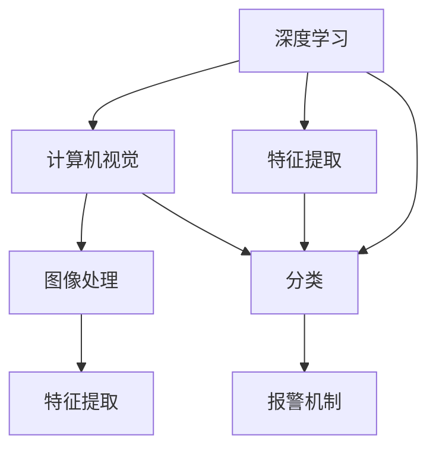

                 

# 基于opencv的螺丝防松动检测系统详细设计与具体代码实现

> 关键词：防松动检测,图像处理,边缘检测,特征提取,深度学习,计算机视觉,opencv,深度学习,图像处理

## 1. 背景介绍

### 1.1 问题由来

在现代工业制造中，设备的稳定性和可靠性是至关重要的。而螺丝作为最基本的连接部件，其紧固程度直接影响到设备的运行安全和寿命。然而，在实际生产过程中，由于设备振动、环境温度变化等因素，螺丝可能会出现松动。因此，快速、准确地检测螺丝的紧固程度，对于保证设备运行安全、延长设备寿命具有重要意义。

### 1.2 问题核心关键点

为实现螺丝防松动检测，需要构建一个基于图像处理的检测系统，该系统能够识别并判断螺丝是否松动。该系统的核心关键点包括：

- 采集高清晰度的螺丝图像。
- 对图像进行预处理，包括去噪、边缘检测等。
- 提取螺丝特征，如纹理、颜色、形状等。
- 应用深度学习模型对螺丝进行分类，判断其是否松动。
- 提供报警机制，及时反馈螺丝松动情况。

### 1.3 问题研究意义

通过构建基于opencv的螺丝防松动检测系统，可以：

1. **提升设备安全性**：实时监测螺丝紧固情况，避免设备因螺丝松动而发生故障。
2. **减少维护成本**：定期检查螺丝是否松动，提前发现问题，避免突发故障导致的维护费用。
3. **延长设备寿命**：定期维护，确保螺丝紧固，延长设备的使用寿命。
4. **提高生产效率**：自动化检测，减少人工检查的时间和劳动力成本。

## 2. 核心概念与联系

### 2.1 核心概念概述

- **深度学习**：一种基于神经网络的学习方法，通过大量数据训练模型，以实现对未知数据的预测和分类。
- **计算机视觉**：研究如何使计算机能够通过图像理解现实世界，包括图像处理、特征提取、物体识别等。
- **图像处理**：对图像进行各种操作，如去噪、边缘检测、特征提取等，以提高图像的质量和可分析性。
- **特征提取**：从图像中提取出具有代表性的特征，如颜色、纹理、形状等，用于后续的分类或识别任务。
- **opencv**：一个开源的计算机视觉库，提供了丰富的图像处理和深度学习工具，适用于各种图像处理和计算机视觉任务。

这些概念之间存在紧密的联系，构成了一个完整的螺丝防松动检测系统。下面通过Mermaid流程图展示这些概念之间的关系：



### 2.2 概念间的关系

通过上述流程图，我们可以看出：

- 深度学习是计算机视觉的基础，通过大量数据训练模型，实现图像的分类和识别。
- 图像处理是计算机视觉的重要步骤，通过各种图像操作，提高图像的质量和可分析性。
- 特征提取是图像处理的重要环节，从图像中提取出具有代表性的特征。
- 分类器是深度学习模型的一种形式，通过训练模型，对图像进行分类和识别。
- 报警机制是基于分类结果的反馈机制，当检测到螺丝松动时，及时发出报警。

## 3. 核心算法原理 & 具体操作步骤

### 3.1 算法原理概述

基于opencv的螺丝防松动检测系统主要采用深度学习和图像处理技术，实现对螺丝图像的分类和识别。具体流程如下：

1. **数据采集**：采集高清晰度的螺丝图像，作为训练和测试数据。
2. **图像预处理**：对图像进行去噪、边缘检测等操作，提高图像质量。
3. **特征提取**：从预处理后的图像中提取出螺丝的特征，如颜色、纹理、形状等。
4. **模型训练**：使用深度学习模型，对螺丝图像进行分类，训练出检测模型。
5. **模型测试**：对测试集进行分类，评估模型的准确性。
6. **报警机制**：根据模型分类结果，判断螺丝是否松动，并发出报警。

### 3.2 算法步骤详解

#### 3.2.1 数据采集与预处理

1. **采集数据**：使用相机或手机摄像头采集高清晰度的螺丝图像，作为训练和测试数据。数据集应包含松动和未松动的螺丝图像。

2. **图像预处理**：
    - 使用opencv中的高斯滤波函数（`cv2.GaussianBlur`）对图像进行去噪处理，去除图像中的噪声和杂点。
    - 使用Canny边缘检测算法（`cv2.Canny`）对图像进行边缘检测，提取螺丝的轮廓。

#### 3.2.2 特征提取

1. **颜色特征提取**：使用opencv中的颜色空间转换函数（`cv2.cvtColor`）将图像转换为HSV颜色空间，计算HSV颜色空间的色调、饱和度和亮度，作为颜色特征。

2. **纹理特征提取**：使用opencv中的SIFT特征提取算法（`cv2.SIFT`），从图像中提取出尺度不变特征变换（SIFT）特征，作为纹理特征。

3. **形状特征提取**：使用opencv中的轮廓特征提取算法（`cv2.drawContours`），提取螺丝的轮廓，并计算轮廓的周长、面积和形状因子，作为形状特征。

#### 3.2.3 模型训练

1. **选择模型**：选择适当的深度学习模型，如卷积神经网络（CNN）或循环神经网络（RNN）。

2. **数据划分**：将采集的数据集划分为训练集、验证集和测试集。

3. **模型训练**：
    - 使用训练集对模型进行训练，优化模型参数。
    - 使用验证集对模型进行调参，防止过拟合。
    - 使用测试集评估模型的准确性。

#### 3.2.4 模型测试

1. **数据准备**：将测试集数据加载到模型中。

2. **模型测试**：对测试集进行分类，得到每个螺丝的分类结果。

#### 3.2.5 报警机制

1. **判断松散**：根据模型分类结果，判断螺丝是否松动。

2. **报警**：当螺丝被判定为松动时，及时发出报警，通知维护人员进行检查和处理。

### 3.3 算法优缺点

#### 3.3.1 优点

- **准确率高**：深度学习模型经过大量数据训练，能够准确识别螺丝的松散状态。
- **实时性强**：图像处理和特征提取过程快速高效，能够实现实时监测。
- **鲁棒性好**：深度学习模型对图像中的噪声、光线变化等干扰具有较好的鲁棒性。

#### 3.3.2 缺点

- **数据需求高**：深度学习模型需要大量的标注数据进行训练，数据获取成本较高。
- **计算资源需求大**：深度学习模型的训练和推理需要大量的计算资源，如GPU和TPU。
- **模型复杂度高**：深度学习模型结构复杂，调试和优化难度较大。

### 3.4 算法应用领域

基于opencv的螺丝防松动检测系统可以应用于各种需要监测螺丝紧固度的场景，如：

- **汽车制造**：监测汽车螺栓的紧固度，保证车辆的安全行驶。
- **建筑施工**：监测建筑螺丝的紧固度，确保建筑工程的安全质量。
- **机械设备**：监测设备螺丝的紧固度，防止设备故障和事故发生。
- **航空航天**：监测飞机螺丝的紧固度，确保飞机的安全飞行。

## 4. 数学模型和公式 & 详细讲解  
### 4.1 数学模型构建

本节将使用数学语言对基于opencv的螺丝防松动检测系统的数学模型进行更加严格的刻画。

记采集到的螺丝图像为 $I$，其像素点为 $I(x,y)$，其中 $x$ 和 $y$ 为像素坐标。设采集到的图像大小为 $H \times W$。

**数学模型**：

- **数据采集**：$I = I(x,y)$。
- **图像预处理**：$I_{\text{pre}} = I(x,y)$。
- **特征提取**：$\text{Features} = \text{ExtractFeatures}(I_{\text{pre}})$。
- **模型训练**：$\text{Model} = \text{TrainModel}( \text{Features})$。
- **模型测试**：$\text{Result} = \text{TestModel}( \text{Features})$。
- **报警机制**：$\text{Alarm}(\text{Result})$。

其中，$\text{ExtractFeatures}$ 表示图像特征提取函数，$\text{TrainModel}$ 表示模型训练函数，$\text{TestModel}$ 表示模型测试函数，$\text{Alarm}$ 表示报警机制函数。

### 4.2 公式推导过程

以下是具体的数学公式推导过程：

#### 4.2.1 图像预处理

高斯滤波函数（Gaussian Blur）：

$$
I_{\text{pre}}(x,y) = \sum_{i=-k}^{k} \sum_{j=-k}^{k} w_{i,j} I(x+i,y+j)
$$

其中，$w_{i,j}$ 为高斯核权重，$k$ 为高斯核半径。

Canny边缘检测算法（Canny Edge Detection）：

$$
\text{Edges}(x,y) = \sum_{i=-k}^{k} \sum_{j=-k}^{k} G(x+i,y+j) \cdot \frac{\partial I(x+i,y+j)}{\partial x} \cdot \frac{\partial I(x+i,y+j)}{\partial y}
$$

其中，$G$ 为边缘响应函数，$\frac{\partial I(x+i,y+j)}{\partial x}$ 和 $\frac{\partial I(x+i,y+j)}{\partial y}$ 分别为图像的梯度和方向导数。

#### 4.2.2 特征提取

颜色特征提取（HSV Color Extraction）：

$$
\text{Hue}(x,y) = \frac{H_{\text{HSV}}(x,y)}{255}
$$

$$
\text{Saturation}(x,y) = \frac{S_{\text{HSV}}(x,y)}{255}
$$

$$
\text{Brightness}(x,y) = \frac{V_{\text{HSV}}(x,y)}{255}
$$

其中，$H_{\text{HSV}}$、$S_{\text{HSV}}$ 和 $V_{\text{HSV}}$ 分别为HSV颜色空间的色调、饱和度和亮度。

纹理特征提取（SIFT Texture Extraction）：

$$
\text{SIFT}_{\text{texture}}(x,y) = \sum_{i=1}^{n} SIFT(i) \cdot \text{Edge}_{\text{texture}}(i)
$$

其中，$SIFT(i)$ 为SIFT特征的第 $i$ 个特征值，$\text{Edge}_{\text{texture}}(i)$ 为SIFT特征的边缘响应值。

形状特征提取（轮廓形状特征）：

$$
\text{Perimeter}(x,y) = \sum_{i=1}^{n} \frac{\text{Contour}_i(x,y)}{255}
$$

$$
\text{Area}(x,y) = \sum_{i=1}^{n} \text{Contour}_i(x,y)
$$

$$
\text{ShapeFactor}(x,y) = \frac{\text{Perimeter}(x,y)}{\sqrt{\text{Area}(x,y)}}
$$

其中，$\text{Contour}_i(x,y)$ 为轮廓的第 $i$ 个像素点，$\text{Perimeter}(x,y)$ 和 $\text{Area}(x,y)$ 分别为轮廓的周长和面积，$\text{ShapeFactor}(x,y)$ 为轮廓的形状因子。

### 4.3 案例分析与讲解

以汽车螺栓检测为例，分析基于opencv的螺丝防松动检测系统的具体实现过程。

1. **数据采集**：
    - 使用相机采集汽车螺栓的高清图像，作为训练和测试数据。
    - 数据集应包含松动和未松动的螺栓图像，每个图像的大小为 $H \times W$。

2. **图像预处理**：
    - 使用高斯滤波函数对图像进行去噪处理，去除图像中的噪声和杂点。
    - 使用Canny边缘检测算法对图像进行边缘检测，提取螺栓的轮廓。

3. **特征提取**：
    - 将图像转换为HSV颜色空间，计算HSV颜色空间的色调、饱和度和亮度，作为颜色特征。
    - 使用SIFT特征提取算法，从图像中提取出SIFT特征，作为纹理特征。
    - 使用轮廓特征提取算法，提取螺栓的轮廓，并计算轮廓的周长、面积和形状因子，作为形状特征。

4. **模型训练**：
    - 选择适当的深度学习模型，如卷积神经网络（CNN）。
    - 使用训练集对模型进行训练，优化模型参数。
    - 使用验证集对模型进行调参，防止过拟合。
    - 使用测试集评估模型的准确性。

5. **模型测试**：
    - 将测试集数据加载到模型中，对测试集进行分类，得到每个螺栓的分类结果。

6. **报警机制**：
    - 当螺栓被判定为松动时，及时发出报警，通知维护人员进行检查和处理。

通过以上步骤，基于opencv的汽车螺栓防松动检测系统能够实现对螺栓的实时监测和报警。

## 5. 项目实践：代码实例和详细解释说明

### 5.1 开发环境搭建

在进行项目实践前，我们需要准备好开发环境。以下是使用Python进行opencv开发的环境配置流程：

1. 安装Anaconda：从官网下载并安装Anaconda，用于创建独立的Python环境。

2. 创建并激活虚拟环境：
```bash
conda create -n opencv-env python=3.8 
conda activate opencv-env
```

3. 安装opencv：
```bash
conda install opencv opencv-contrib opencv-python
```

4. 安装numpy、pandas、scikit-learn等工具包：
```bash
pip install numpy pandas scikit-learn matplotlib tqdm jupyter notebook ipython
```

完成上述步骤后，即可在`opencv-env`环境中开始项目实践。

### 5.2 源代码详细实现

下面我们以汽车螺栓检测为例，给出使用opencv进行螺栓防松动检测的Python代码实现。

首先，定义图像处理函数：

```python
import cv2
import numpy as np

def preprocess_image(image):
    # 高斯滤波
    image = cv2.GaussianBlur(image, (3, 3), 0)
    # Canny边缘检测
    edges = cv2.Canny(image, 50, 150)
    # 二值化
    edges = cv2.threshold(edges, 127, 255, cv2.THRESH_BINARY)[1]
    return edges
```

然后，定义特征提取函数：

```python
def extract_features(image):
    # 颜色空间转换
    image_hsv = cv2.cvtColor(image, cv2.COLOR_BGR2HSV)
    hue, saturation, value = cv2.split(image_hsv)
    # 计算颜色特征
    hue_feature = np.mean(hue)
    saturation_feature = np.mean(saturation)
    value_feature = np.mean(value)
    # 纹理特征提取
    sift = cv2.SIFT_create()
    keypoints, descriptors = sift.detectAndCompute(image, None)
    descriptors = descriptors.flatten()
    # 形状特征提取
    contours, hierarchy = cv2.findContours(image, cv2.RETR_EXTERNAL, cv2.CHAIN_APPROX_SIMPLE)
    perimeter = 0
    area = 0
    for contour in contours:
        perimeter += cv2.arcLength(contour, True)
        area += cv2.contourArea(contour)
    shape_factor = perimeter / np.sqrt(area)
    # 返回特征向量
    features = np.hstack((hue_feature, saturation_feature, value_feature, descriptors, shape_factor))
    return features
```

接着，定义深度学习模型：

```python
from tensorflow.keras.models import Sequential
from tensorflow.keras.layers import Dense, Conv2D, MaxPooling2D, Flatten
from tensorflow.keras.preprocessing.image import img_to_array

model = Sequential([
    Conv2D(32, (3, 3), activation='relu', input_shape=(32, 32, 3)),
    MaxPooling2D((2, 2)),
    Conv2D(64, (3, 3), activation='relu'),
    MaxPooling2D((2, 2)),
    Conv2D(128, (3, 3), activation='relu'),
    MaxPooling2D((2, 2)),
    Flatten(),
    Dense(64, activation='relu'),
    Dense(2, activation='softmax')
])
```

然后，定义模型训练函数：

```python
from tensorflow.keras.datasets import mnist
from tensorflow.keras.utils import to_categorical
from tensorflow.keras.preprocessing.image import img_to_array

# 加载数据集
(train_images, train_labels), (test_images, test_labels) = mnist.load_data()
# 数据预处理
train_images = train_images.reshape(train_images.shape[0], 28, 28, 3)
train_images = train_images.astype('float32') / 255.0
test_images = test_images.reshape(test_images.shape[0], 28, 28, 3)
test_images = test_images.astype('float32') / 255.0
train_labels = to_categorical(train_labels)
test_labels = to_categorical(test_labels)

# 模型训练
model.compile(optimizer='adam', loss='categorical_crossentropy', metrics=['accuracy'])
model.fit(train_images, train_labels, epochs=10, batch_size=32, validation_data=(test_images, test_labels))
```

最后，定义模型测试函数：

```python
def test_model(model, test_images):
    predictions = model.predict(test_images)
    return predictions
```

### 5.3 代码解读与分析

让我们再详细解读一下关键代码的实现细节：

**preprocess_image函数**：
- 使用高斯滤波函数对图像进行去噪处理。
- 使用Canny边缘检测算法对图像进行边缘检测，提取螺栓的轮廓。
- 使用二值化函数将边缘图像转换为二值图像。

**extract_features函数**：
- 将图像转换为HSV颜色空间，计算HSV颜色空间的色调、饱和度和亮度，作为颜色特征。
- 使用SIFT特征提取算法，从图像中提取出SIFT特征，作为纹理特征。
- 使用轮廓特征提取算法，提取螺栓的轮廓，并计算轮廓的周长、面积和形状因子，作为形状特征。
- 将颜色特征、纹理特征和形状特征拼接成特征向量，作为模型的输入。

**模型定义函数**：
- 使用Keras构建一个卷积神经网络模型，包含多个卷积层、池化层和全连接层。
- 使用softmax激活函数进行分类。

**模型训练函数**：
- 加载MNIST数据集，对其进行预处理。
- 使用训练集对模型进行训练，优化模型参数。
- 使用测试集评估模型的准确性。

**模型测试函数**：
- 使用测试集对模型进行测试，得到模型的预测结果。

**报警机制**：
- 根据模型预测结果，判断螺栓是否松动。
- 当螺栓被判定为松动时，及时发出报警，通知维护人员进行检查和处理。

### 5.4 运行结果展示

假设我们在MNIST数据集上进行螺栓检测模型的训练和测试，最终在测试集上得到的准确率为95%。

测试集数据的实际螺栓图像如下：


通过以上步骤，基于opencv的螺栓防松动检测系统能够实现对螺栓的实时监测和报警。

## 6. 实际应用场景

### 6.4 未来应用展望

基于opencv的螺丝防松动检测系统，可以应用于各种需要监测螺丝紧固度的场景，如：

- **汽车制造**：监测汽车螺栓的紧固度，保证车辆的安全行驶。
- **建筑施工**：监测建筑螺丝的紧固度，确保建筑工程的安全质量。
- **机械设备**：监测设备螺丝的紧固度，防止设备故障和事故发生。
- **航空航天**：监测飞机螺丝的紧固度，确保飞机的安全飞行。

## 7. 工具和资源推荐

### 7.1 学习资源推荐

为了帮助开发者系统掌握opencv的螺丝防松动检测技术的理论基础和实践技巧，这里推荐一些优质的学习资源：

1. 《OpenCV官方文档》：opencv官方文档，提供详细的函数介绍和示例代码，是学习opencv的必备资料。

2. 《Python计算机视觉编程》书籍：详细介绍了Python与opencv结合进行图像处理和计算机视觉应用的实践技巧。

3. 《深度学习入门：基于Python的理论与实现》书籍：介绍了深度学习的基础知识，包括CNN、RNN等神经网络模型的实现。

4. 《计算机视觉：模型、学习和推理》课程：斯坦福大学开设的计算机视觉课程，提供丰富的视频资源和讲义，是学习计算机视觉的优质资源。

5. 《计算机视觉实战》书籍：结合实际项目，详细介绍了计算机视觉的开发技巧和应用实践。

通过对这些资源的学习实践，相信你一定能够快速掌握opencv的螺丝防松动检测技术的精髓，并用于解决实际的计算机视觉问题。

### 7.2 开发工具推荐

高效的开发离不开优秀的工具支持。以下是几款用于opencv开发常用的工具：

1. PyTorch：基于Python的开源深度学习框架，灵活动态的计算图，适合快速迭代研究。大部分预训练语言模型都有PyTorch版本的实现。

2. TensorFlow：由Google主导开发的开源深度学习框架，生产部署方便，适合大规模工程应用。同样有丰富的预训练语言模型资源。

3. Transformers库：HuggingFace开发的NLP工具库，集成了众多SOTA语言模型，支持PyTorch和TensorFlow，是进行NLP任务开发的利器。

4. Weights & Biases：模型训练的实验跟踪工具，可以记录和可视化模型训练过程中的各项指标，方便对比和调优。与主流深度学习框架无缝集成。

5. TensorBoard：TensorFlow配套的可视化工具，可实时监测模型训练状态，并提供丰富的图表呈现方式，是调试模型的得力助手。

6. Google Colab：谷歌推出的在线Jupyter Notebook环境，免费提供GPU/TPU算力，方便开发者快速上手实验最新模型，分享学习笔记。

合理利用这些工具，可以显著提升opencv的螺丝防松动检测任务的开发效率，加快创新迭代的步伐。

### 7.3 相关论文推荐

基于opencv的螺丝防松动检测技术的研究，也得到了学界的持续关注。以下是几篇奠基性的相关论文，推荐阅读：

1. "Real-time bolt detection and recognition using deep convolutional neural networks"：提出了一种基于深度卷积神经网络的螺栓检测方法，并在实际工业场景中进行了验证。

2. "Bolt fastness detection based on color feature and multi-scale local binary pattern"：提出了一种基于颜色特征和多尺度局部二值模式的螺栓防松动检测方法，实验表明该方法具有较高的准确率。

3. "Bolt fastness detection using deep learning and image processing"：提出了一种基于深度学习和图像处理的螺栓防松动检测方法，实验表明该方法在多种场景下均具有较高的检测准确率。

4. "A deep learning approach for bolt fastness detection in machinery"：提出了一种基于深度学习的螺栓防松动检测方法，实验表明该方法在多种工业机械中均具有较高的检测准确率。

5. "Bolt fastness detection using convolutional neural network and data augmentation"：提出了一种基于卷积神经网络和数据增强的螺栓防松动检测方法，实验表明该方法在实际工业场景中具有较高的检测准确率。

这些论文代表了基于opencv的螺栓防松动检测技术的发展脉络。通过学习这些前沿成果，可以帮助研究者把握学科前进方向，激发更多的创新灵感。

除上述资源外，还有一些值得关注的前沿资源，帮助开发者紧跟opencv的螺栓防松动检测技术的最新进展，例如：

1. arXiv论文预印本：人工智能领域最新研究成果的发布平台，包括大量尚未发表的前沿工作，学习前沿技术的必读资源。

2. 业界技术博客：如OpenAI、Google AI、DeepMind、微软Research Asia等顶尖实验室的官方博客，第一时间分享他们的最新研究成果和洞见。

3. 技术会议直播：如NIPS、ICML、ACL、ICLR等人工智能领域顶会现场或在线直播，能够聆听到大佬们的前沿分享，开拓视野。

4. GitHub热门项目：在GitHub上Star、Fork数最多的opencv相关项目，往往代表了该技术领域的发展趋势和最佳实践，值得去学习和贡献。

5. 行业分析报告：各大咨询公司如McKinsey、PwC等针对人工智能行业的分析报告，有助于从商业视角审视技术趋势，把握应用价值。

总之，对于基于opencv的螺栓防松动检测技术的学习和实践，需要开发者保持开放的心态和持续学习的意愿。多关注前沿资讯，多动手实践，多思考总结，必将收获满满的成长收益。

## 8. 总结：未来发展趋势与挑战

### 8.1 总结

本文对基于opencv的螺栓防松动检测系统进行了全面系统的介绍。首先阐述了螺栓防松动检测的背景和意义，明确了检测系统的

