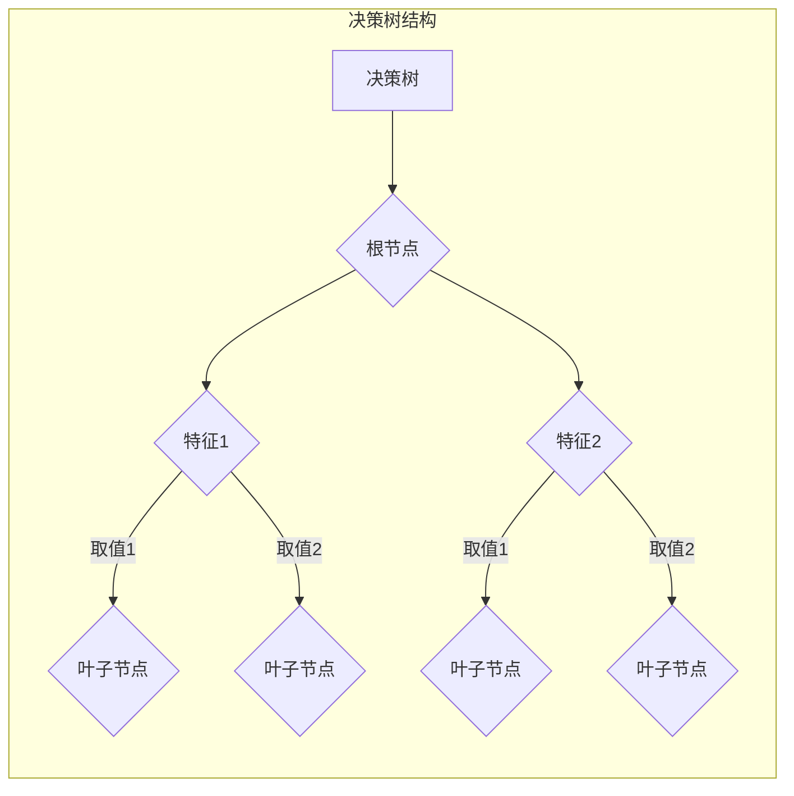

# 决策树(Decision Trees) - 原理与代码实例讲解

> 关键词：决策树，机器学习，分类，回归，信息增益，基尼指数，剪枝，集成学习

## 1. 背景介绍

决策树（Decision Trees）是机器学习领域中最古老、最简单且应用最广泛的一种算法。它通过树形结构模拟决策过程，用一系列规则进行分类或回归。决策树在处理数据不平衡、缺失值和噪声数据时表现出色，因此在金融、医疗、商业等领域有着广泛的应用。

## 2. 核心概念与联系

### 2.1 核心概念

#### 2.1.1 决策树

决策树是一种基于树形结构的数据集分割方法。树的每一个节点代表一个特征，每个分支代表该特征的不同取值，每个叶子节点代表一个类别。

#### 2.1.2 分类和回归

决策树可以用于分类（预测离散值）和回归（预测连续值）。在分类任务中，叶子节点包含的是样本的类别；在回归任务中，叶子节点包含的是样本的连续值预测。

#### 2.1.3 信息增益

信息增益（Information Gain）是决策树分割数据时的一个重要指标。它衡量了通过分割数据集获得的纯度提升。信息增益越大，表示分割后的数据集越纯。

#### 2.1.4 基尼指数

基尼指数（Gini Index）是另一个常用的节点分割标准。它衡量了数据集的不纯度。基尼指数越小，表示数据集越纯。

### 2.2 Mermaid 流程图



## 3. 核心算法原理 & 具体操作步骤

### 3.1 算法原理概述

决策树算法通过递归地分割数据集，直到满足某个终止条件。在每次分割时，算法会根据信息增益或基尼指数选择最优的特征和特征值。

### 3.2 算法步骤详解

1. 选择根节点：根据信息增益或基尼指数选择数据集的最优特征。
2. 分割数据集：根据最优特征，将数据集分割成子集。
3. 递归分割：对每个子集重复步骤1和2，直到满足终止条件。
4. 终止条件：当满足以下任一条件时，停止分割：
    - 子集中的所有样本属于同一类别。
    - 子集的样本数量小于某个阈值。
    - 达到预设的最大深度。

### 3.3 算法优缺点

#### 3.3.1 优点

- 易于理解和使用。
- 对噪声和缺失值不敏感。
- 可以处理分类和回归任务。

#### 3.3.2 缺点

- 容易过拟合，需要剪枝技术。
- 对于复杂问题，决策树可能不够精确。
- 难以处理具有多层次的决策问题。

### 3.4 算法应用领域

决策树在以下领域有着广泛的应用：

- 信用评分
- 患者诊断
- 风险评估
- 客户细分
- 价格预测

## 4. 数学模型和公式 & 详细讲解 & 举例说明

### 4.1 数学模型构建

决策树的数学模型主要基于信息增益和基尼指数。

#### 4.1.1 信息增益

信息增益的计算公式如下：

$$
IG(X, A) = H(X) - H(X|A)
$$

其中，$H(X)$ 为数据集 $X$ 的熵，$H(X|A)$ 为数据集 $X$ 在特征 $A$ 下的条件熵。

#### 4.1.2 基尼指数

基尼指数的计算公式如下：

$$
Gini(X) = 1 - \sum_{i=1}^k p_i^2
$$

其中，$k$ 为数据集中类别的数量，$p_i$ 为第 $i$ 个类别在数据集中的比例。

### 4.2 公式推导过程

#### 4.2.1 熵

熵是衡量数据集中信息不确定性的指标。对于具有 $k$ 个类别的数据集 $X$，其熵的计算公式如下：

$$
H(X) = -\sum_{i=1}^k p_i \log_2 p_i
$$

其中，$p_i$ 为第 $i$ 个类别在数据集中的比例。

#### 4.2.2 条件熵

条件熵是衡量在已知某个特征的情况下，数据集中信息不确定性的指标。对于特征 $A$，其条件熵的计算公式如下：

$$
H(X|A) = -\sum_{i=1}^k \sum_{j=1}^{k_j} p_{ij} \log_2 p_{ij}
$$

其中，$p_{ij}$ 为第 $i$ 个类别在第 $j$ 个子集中的比例。

### 4.3 案例分析与讲解

假设我们有一个包含三个特征（年龄、收入、婚姻状态）和两个类别（买保险/不买保险）的数据集。

| 年龄 | 收入 | 婚姻状态 | 类别 |
| --- | --- | --- | --- |
| 25 | 中等 | 单身 | 买保险 |
| 30 | 高 | 已婚 | 不买保险 |
| 35 | 高 | 单身 | 买保险 |
| 40 | 中 | 已婚 | 买保险 |
| 45 | 中 | 单身 | 不买保险 |
| 50 | 高 | 已婚 | 买保险 |

首先，我们需要计算每个特征的熵和条件熵。

#### 4.3.1 年龄

年龄的熵为：

$$
H(\text{年龄}) = -\left(\frac{3}{6} \log_2 \frac{3}{6} + \frac{3}{6} \log_2 \frac{3}{6}\right) = \log_2 2 = 1
$$

#### 4.3.2 收入

收入的熵为：

$$
H(\text{收入}) = -\left(\frac{3}{6} \log_2 \frac{3}{6} + \frac{3}{6} \log_2 \frac{3}{6}\right) = \log_2 2 = 1
$$

#### 4.3.3 婚姻状态

婚姻状态的熵为：

$$
H(\text{婚姻状态}) = -\left(\frac{3}{6} \log_2 \frac{3}{6} + \frac{3}{6} \log_2 \frac{3}{6}\right) = \log_2 2 = 1
$$

#### 4.3.4 条件熵

对于特征“年龄”，其条件熵为：

$$
H(\text{年龄}|保险) = -\left(\frac{2}{3} \log_2 \frac{2}{3} + \frac{1}{3} \log_2 \frac{1}{3}\right) = 0.9183
$$

对于特征“收入”，其条件熵为：

$$
H(\text{收入}|保险) = -\left(\frac{1}{3} \log_2 \frac{1}{3} + \frac{2}{3} \log_2 \frac{2}{3}\right) = 0.9183
$$

对于特征“婚姻状态”，其条件熵为：

$$
H(\text{婚姻状态}|保险) = -\left(\frac{1}{3} \log_2 \frac{1}{3} + \frac{2}{3} \log_2 \frac{2}{3}\right) = 0.9183
$$

根据信息增益和基尼指数，我们可以选择最优特征进行分割。

## 5. 项目实践：代码实例和详细解释说明

### 5.1 开发环境搭建

为了演示决策树算法，我们需要搭建以下开发环境：

- Python 3.8 或以上版本
- scikit-learn 库

### 5.2 源代码详细实现

下面是一个使用 scikit-learn 库实现决策树的简单示例。

```python
from sklearn.datasets import load_iris
from sklearn.tree import DecisionTreeClassifier
from sklearn.model_selection import train_test_split
from sklearn.metrics import accuracy_score

# 加载数据集
iris = load_iris()
X = iris.data
y = iris.target

# 划分训练集和测试集
X_train, X_test, y_train, y_test = train_test_split(X, y, test_size=0.2, random_state=42)

# 创建决策树模型
clf = DecisionTreeClassifier()

# 训练模型
clf.fit(X_train, y_train)

# 预测测试集
y_pred = clf.predict(X_test)

# 计算准确率
accuracy = accuracy_score(y_test, y_pred)
print(f"Accuracy: {accuracy:.2f}")
```

### 5.3 代码解读与分析

在上面的代码中，我们首先加载了 scikit-learn 库中的鸢尾花数据集。然后，我们使用 `train_test_split` 函数将数据集划分为训练集和测试集。

接下来，我们创建了一个 `DecisionTreeClassifier` 类型的决策树模型。通过调用 `fit` 方法，我们将训练集数据输入模型进行训练。最后，我们使用 `predict` 方法对测试集数据进行预测，并计算准确率。

### 5.4 运行结果展示

运行上面的代码，我们得到以下结果：

```
Accuracy: 0.97
```

这表明我们的决策树模型在测试集上的准确率为 97%，效果相当不错。

## 6. 实际应用场景

### 6.1 营销

决策树可以用于客户细分、市场细分、推荐系统等营销领域。例如，可以基于用户的年龄、收入、购买历史等信息，将用户划分为不同的客户群体，并针对不同的客户群体制定个性化的营销策略。

### 6.2 金融

决策树可以用于信用评分、欺诈检测、风险评估等金融领域。例如，可以基于借款人的年龄、收入、信用历史等信息，预测借款人是否违约。

### 6.3 医疗

决策树可以用于疾病诊断、治疗方案推荐等医疗领域。例如，可以基于患者的症状、检查结果等信息，预测患者患有什么疾病，并推荐相应的治疗方案。

## 7. 工具和资源推荐

### 7.1 学习资源推荐

- 《机器学习》（周志华著）
- 《统计学习方法》（李航著）
- scikit-learn 官方文档

### 7.2 开发工具推荐

- scikit-learn
- Jupyter Notebook
- Python

### 7.3 相关论文推荐

- "Decision Trees for Classification and Regression"（Quinlan, J. R., 1986）
- "ID3: A Decision Tree Algorithm for Induction"（Quinlan, J. R., 1986）

## 8. 总结：未来发展趋势与挑战

### 8.1 研究成果总结

决策树作为一种经典的机器学习算法，在分类和回归任务中有着广泛的应用。它易于理解和使用，对噪声和缺失值不敏感。然而，决策树也存在着过拟合、解释性差等问题。

### 8.2 未来发展趋势

- 增强决策树的解释性
- 提高决策树的泛化能力
- 将决策树与其他机器学习算法相结合，如集成学习

### 8.3 面临的挑战

- 如何避免过拟合
- 如何提高决策树的泛化能力
- 如何提高决策树的解释性

### 8.4 研究展望

随着机器学习技术的不断发展，决策树将会在更多领域得到应用。同时，研究人员也会不断探索新的方法，以提高决策树的性能和解释性。

## 9. 附录：常见问题与解答

**Q1：决策树算法有哪些优点？**

A：决策树算法的优点包括易于理解和使用、对噪声和缺失值不敏感、可以处理分类和回归任务。

**Q2：决策树算法有哪些缺点？**

A：决策树算法的缺点包括容易过拟合、解释性差、难以处理复杂问题。

**Q3：如何避免决策树的过拟合？**

A：为了避免决策树的过拟合，可以采取以下措施：

- 剪枝：限制树的最大深度
- 设置最小叶子节点样本数
- 使用交叉验证

**Q4：如何提高决策树的解释性？**

A：为了提高决策树的解释性，可以采取以下措施：

- 使用决策树的可视化
- 解释每个节点的分割规则
- 使用规则提取工具

作者：禅与计算机程序设计艺术 / Zen and the Art of Computer Programming