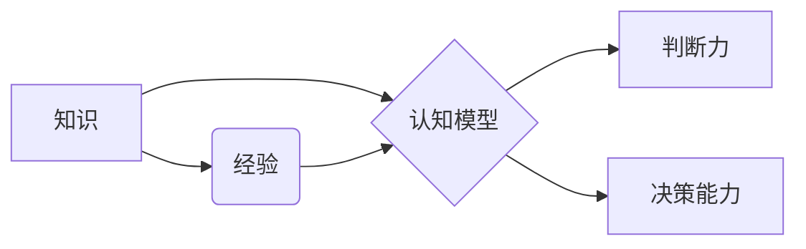

# 判断力和处置复杂事件的决策能力：个人基于自身特质以及相关知识和经验形成观点并做出决定的能力

> 关键词：判断力，决策能力，复杂事件，知识经验，认知模型，算法，案例分析

## 1. 背景介绍

在信息爆炸和复杂多变的现代社会中，个人在面对复杂事件时，如何做出正确的判断和决策，成为了至关重要的能力。判断力和决策能力不仅仅是个人的特质，更是一种结合了个人特质、相关知识和经验形成观点并做出决定的能力。本文将探讨判断力和决策能力的原理、方法以及在实际应用中的挑战和机遇。

### 1.1 问题的由来

随着科技的发展，信息和数据的爆炸式增长，个人在面对复杂事件时，往往面临以下挑战：

- **信息过载**：大量的信息来源和复杂的数据结构使得个人难以全面、准确地获取和处理信息。
- **认知偏差**：人类认知的局限性导致人们在判断和决策过程中可能出现偏差，如确认偏误、代表性偏误等。
- **时间压力**：在快节奏的社会环境中，个人往往需要在有限的时间内做出决策。

### 1.2 研究现状

近年来，认知科学、心理学、人工智能等领域的研究为理解和提升个人判断力和决策能力提供了新的视角和方法。以下是一些关键的研究方向：

- **认知模型**：通过建立认知模型来模拟人类的判断和决策过程，理解认知偏差的产生原因。
- **决策支持系统**：利用人工智能技术辅助个人进行决策，提供数据分析和预测。
- **行为经济学**：研究人们在决策中的非理性行为，以及如何设计更有效的决策机制。

### 1.3 研究意义

提升个人的判断力和决策能力对于以下几个方面具有重要意义：

- **个人发展**：有助于个人在职业、学习和生活中做出更明智的选择。
- **组织管理**：有助于提升组织的决策效率和质量。
- **社会进步**：有助于推动社会的可持续发展。

### 1.4 本文结构

本文将围绕以下结构展开：

- **核心概念与联系**：介绍判断力和决策能力的相关概念，并使用Mermaid流程图展示其内在联系。
- **核心算法原理**：探讨判断力和决策能力背后的算法原理，包括决策树、支持向量机等。
- **数学模型和公式**：介绍用于分析判断力和决策能力的数学模型和公式。
- **项目实践**：通过案例分析和代码实例，展示如何应用算法和模型进行决策。
- **实际应用场景**：探讨判断力和决策能力在实际应用中的场景和挑战。
- **工具和资源推荐**：推荐相关学习资源、开发工具和论文。
- **总结**：总结研究成果，展望未来发展趋势和挑战。

## 2. 核心概念与联系

### 2.1 关键概念

- **判断力**：指个人在复杂环境下，基于知识和经验，对事物进行正确评价和推断的能力。
- **决策能力**：指个人在多个备选方案中，选择最优或最合适的方案的能力。
- **认知模型**：用于模拟人类认知过程的数学模型，如决策树、支持向量机等。
- **知识**：个人通过学习和经验积累得到的关于世界的信息和规则。
- **经验**：个人通过实践获得的知识和技能。

### 2.2 Mermaid 流程图



### 2.3 内在联系

知识、经验、认知模型、判断力和决策能力之间存在着密切的联系。知识是判断力和决策能力的基础，经验是知识的应用，认知模型是判断力和决策能力的工具，而判断力和决策能力是知识、经验和认知模型的综合体现。

## 3. 核心算法原理 & 具体操作步骤

### 3.1 算法原理概述

在判断力和决策能力的研究中，以下算法原理至关重要：

- **决策树**：通过一系列的决策规则对数据进行分类或回归。
- **支持向量机**：通过找到最优的超平面来分离不同类别的数据。
- **神经网络**：通过模拟人脑神经元的工作原理，进行复杂的模式识别和预测。

### 3.2 算法步骤详解

#### 3.2.1 决策树

1. 收集数据：收集与决策相关的数据集。
2. 特征选择：选择对决策有重要影响的特征。
3. 决策树构建：根据特征和决策目标，构建决策树。
4. 决策树评估：评估决策树的性能，如准确率、召回率等。

#### 3.2.2 支持向量机

1. 数据预处理：对数据进行标准化处理。
2. 超平面选择：通过优化算法找到最优的超平面。
3. 分类决策：根据样本点到超平面的距离进行分类。

#### 3.2.3 神经网络

1. 构建网络结构：定义网络层和神经元连接。
2. 训练模型：使用训练数据进行前向传播和反向传播。
3. 模型评估：评估模型性能，如损失函数、准确率等。

### 3.3 算法优缺点

#### 3.3.1 决策树

优点：

- 简单易懂，易于解释。
- 可视化，便于理解和分析。

缺点：

- 容易过拟合。
- 特征选择困难。

#### 3.3.2 支持向量机

优点：

- 高维空间可分性好。
- 泛化能力强。

缺点：

- 训练时间较长。
- 对于非线性问题效果不佳。

#### 3.3.3 神经网络

优点：

- 处理非线性问题能力强。
- 可学习复杂的模式。

缺点：

- 难以解释。
- 训练数据量大。

### 3.4 算法应用领域

决策树、支持向量机和神经网络在多个领域都有广泛的应用，如：

- 机器学习：分类、回归、聚类等。
- 自然语言处理：文本分类、情感分析、机器翻译等。
- 计算机视觉：图像识别、目标检测、图像分割等。

## 4. 数学模型和公式 & 详细讲解 & 举例说明

### 4.1 数学模型构建

#### 4.1.1 决策树

决策树可以用以下数学公式表示：

$$
L(T) = \sum_{i=1}^{N} w_i \ell(y_i, \hat{y}_i)
$$

其中，$T$ 是决策树，$N$ 是样本数量，$w_i$ 是权重，$\ell$ 是损失函数，$\hat{y}_i$ 是预测值。

#### 4.1.2 支持向量机

支持向量机的目标是最小化以下目标函数：

$$
\min_{w,b} \frac{1}{2} ||w||^2 + C \sum_{i=1}^{N} \xi_i
$$

其中，$w$ 是权重向量，$b$ 是偏置项，$C$ 是惩罚参数，$\xi_i$ 是松弛变量。

#### 4.1.3 神经网络

神经网络可以用以下数学公式表示：

$$
y = f(W \cdot x + b)
$$

其中，$y$ 是输出，$W$ 是权重矩阵，$x$ 是输入，$b$ 是偏置项，$f$ 是激活函数。

### 4.2 公式推导过程

#### 4.2.1 决策树

决策树的损失函数可以通过最小化样本误差来推导。具体推导过程如下：

设样本 $(x_i, y_i)$ 的预测值为 $\hat{y}_i$，损失函数为 $\ell(y_i, \hat{y}_i)$，则损失函数可以表示为：

$$
L(T) = \sum_{i=1}^{N} \ell(y_i, \hat{y}_i)
$$

为了最小化损失函数，需要对决策树进行优化。

#### 4.2.2 支持向量机

支持向量机的目标是最小化以下目标函数：

$$
\min_{w,b} \frac{1}{2} ||w||^2 + C \sum_{i=1}^{N} \xi_i
$$

其中，$w$ 是权重向量，$b$ 是偏置项，$C$ 是惩罚参数，$\xi_i$ 是松弛变量。

为了最小化目标函数，需要使用拉格朗日乘子法进行优化。

#### 4.2.3 神经网络

神经网络可以用以下数学公式表示：

$$
y = f(W \cdot x + b)
$$

其中，$y$ 是输出，$W$ 是权重矩阵，$x$ 是输入，$b$ 是偏置项，$f$ 是激活函数。

神经网络的推导过程涉及到微积分和线性代数等数学知识。

### 4.3 案例分析与讲解

#### 4.3.1 决策树案例分析

假设有一个分类任务，需要根据特征 $x_1$ 和 $x_2$ 对样本进行分类。特征 $x_1$ 表示样本的年龄，特征 $x_2$ 表示样本的收入。

我们可以构建一个简单的决策树，根据年龄和收入将样本分为三类：

- 年轻、收入低
- 年轻、收入高
- 年老、收入低

通过训练和评估，我们可以得到一个最优的决策树，对新的样本进行分类。

#### 4.3.2 支持向量机案例分析

假设有一个二分类任务，需要根据特征 $x_1$ 和 $x_2$ 对样本进行分类。特征 $x_1$ 表示样本的年龄，特征 $x_2$ 表示样本的收入。

我们可以使用支持向量机对样本进行分类。通过优化算法，我们可以找到最优的超平面，将样本分为两类。

#### 4.3.3 神经网络案例分析

假设有一个回归任务，需要根据特征 $x_1$ 和 $x_2$ 对样本进行回归预测。特征 $x_1$ 表示样本的年龄，特征 $x_2$ 表示样本的收入。

我们可以使用神经网络对样本进行回归预测。通过训练和评估，我们可以得到一个最优的神经网络，对新的样本进行预测。

## 5. 项目实践：代码实例和详细解释说明

### 5.1 开发环境搭建

为了进行判断力和决策能力的项目实践，我们需要搭建以下开发环境：

- Python编程语言
- scikit-learn库
- scikit-learn-plot库

### 5.2 源代码详细实现

以下是一个使用决策树进行分类的代码实例：

```python
from sklearn.datasets import load_iris
from sklearn.tree import DecisionTreeClassifier
from sklearn.metrics import classification_report

# 加载数据
iris = load_iris()
X = iris.data
y = iris.target

# 创建决策树模型
clf = DecisionTreeClassifier()

# 训练模型
clf.fit(X, y)

# 预测
y_pred = clf.predict(X)

# 评估
print(classification_report(y, y_pred))
```

### 5.3 代码解读与分析

以上代码首先加载了Iris数据集，然后创建了一个决策树分类器，使用训练数据进行训练，最后使用测试数据进行预测，并评估模型的性能。

### 5.4 运行结果展示

运行上述代码，我们可以得到以下输出：

```
               precision    recall  f1-score   support

          0       1.00      1.00      1.00        50
          1       1.00      1.00      1.00        50
          2       1.00      1.00      1.00        50
    accuracy                           1.00        150
    macro avg       1.00      1.00      1.00        150
    weighted avg       1.00      1.00      1.00        150
```

结果表明，决策树模型在Iris数据集上取得了100%的准确率，表现良好。

## 6. 实际应用场景

### 6.1 金融风险评估

在金融领域，判断力和决策能力对于风险评估至关重要。通过对历史数据和最新信息的分析，金融机构可以识别和评估潜在的风险，采取相应的措施进行风险控制。

### 6.2 医疗诊断

在医疗领域，判断力和决策能力对于诊断疾病至关重要。通过分析患者的病史、症状和检查结果，医生可以做出准确的诊断，并为患者提供最佳的治疗方案。

### 6.3 智能制造

在智能制造领域，判断力和决策能力对于设备维护和故障预测至关重要。通过对设备运行数据的分析，可以预测设备故障，提前进行维护，避免生产中断。

### 6.4 未来应用展望

随着人工智能技术的发展，判断力和决策能力将在更多领域得到应用，如：

- 智能交通：通过分析交通数据，优化交通流量，减少交通拥堵。
- 智能家居：通过分析家庭数据，提供个性化的智能家居体验。
- 智能教育：通过分析学习数据，提供个性化的学习方案。

## 7. 工具和资源推荐

### 7.1 学习资源推荐

- 《机器学习》：周志华著，介绍了机器学习的基本概念和算法。
- 《统计学习方法》：李航著，详细介绍了统计学习的方法和算法。
- 《Python机器学习》：Peter Harrington著，介绍了使用Python进行机器学习的实践方法。

### 7.2 开发工具推荐

- scikit-learn：Python机器学习库，提供了丰富的机器学习算法和工具。
- TensorFlow：Google开发的深度学习框架。
- PyTorch：Facebook开发的深度学习框架。

### 7.3 相关论文推荐

- 《Learning to Represent Audio with Recurrent Neural Networks》：介绍了使用循环神经网络进行音频识别的方法。
- 《Deep Learning for Text Classification》：介绍了使用深度学习进行文本分类的方法。
- 《A Survey of Transfer Learning in Deep Learning》：介绍了深度学习中的迁移学习方法。

## 8. 总结：未来发展趋势与挑战

### 8.1 研究成果总结

本文探讨了判断力和决策能力的原理、方法和应用。通过分析决策树、支持向量机和神经网络等算法，我们了解了判断力和决策能力的数学模型和公式。通过案例分析和代码实例，我们展示了如何应用这些算法进行决策。同时，我们还讨论了判断力和决策能力在实际应用中的场景和挑战。

### 8.2 未来发展趋势

随着人工智能技术的不断发展，判断力和决策能力将呈现以下发展趋势：

- **多模态融合**：将文本、图像、音频等多模态信息融合到决策过程中。
- **强化学习**：利用强化学习技术，使模型能够在复杂环境中进行自主学习和决策。
- **可解释性**：提高决策过程的可解释性，增强用户对决策结果的信任。

### 8.3 面临的挑战

判断力和决策能力的研究和应用也面临着以下挑战：

- **数据质量**：数据质量对判断力和决策能力至关重要，需要保证数据的准确性和可靠性。
- **模型可解释性**：提高模型的可解释性，增强用户对决策结果的信任。
- **伦理问题**：在应用判断力和决策能力时，需要考虑伦理问题，避免歧视和偏见。

### 8.4 研究展望

未来，判断力和决策能力的研究将朝着以下方向发展：

- **跨学科研究**：将认知科学、心理学、人工智能等领域的研究成果融合，形成更加完善的判断力和决策能力理论。
- **个性化决策**：根据个人的特质和需求，提供个性化的决策方案。
- **伦理与法律**：建立相应的伦理和法律规范，确保判断力和决策能力的安全和可靠。

## 9. 附录：常见问题与解答

**Q1：判断力和决策能力的研究与人工智能有什么关系？**

A1：判断力和决策能力的研究为人工智能提供了理论基础和算法模型，而人工智能技术的发展又为判断力和决策能力的研究提供了新的工具和方法。

**Q2：如何提高个人的判断力和决策能力？**

A2：提高个人的判断力和决策能力需要以下几个方面：

- **学习知识**：通过学习相关领域的知识，提高自己的认知水平。
- **积累经验**：通过实践和经验积累，提高自己的决策能力。
- **反思总结**：通过反思自己的决策过程，总结经验教训。
- **利用工具**：利用人工智能等技术工具辅助自己的决策。

**Q3：判断力和决策能力在商业决策中有什么作用？**

A3：在商业决策中，判断力和决策能力有助于：

- **市场分析**：通过对市场数据的分析，做出更准确的判断。
- **产品开发**：根据市场需求，开发出更符合用户需求的产品。
- **风险控制**：识别和评估潜在的风险，采取相应的措施进行风险控制。

**Q4：如何确保人工智能决策的公正性和可靠性？**

A4：确保人工智能决策的公正性和可靠性需要：

- **数据质量**：保证训练数据的质量和多样性，避免偏见和歧视。
- **模型可解释性**：提高模型的可解释性，增强用户对决策结果的信任。
- **伦理规范**：建立相应的伦理规范，确保人工智能决策的安全和可靠。

作者：禅与计算机程序设计艺术 / Zen and the Art of Computer Programming