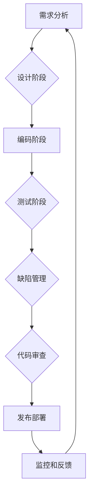

# 反思和改进：提高任务质量

> 关键词：任务质量，质量改进，敏捷开发，DevOps，持续集成，缺陷管理，自动化测试，质量保证

## 1. 背景介绍

在信息技术行业，任务质量一直是软件开发和维护的关键因素。随着敏捷开发和DevOps文化的兴起，对任务质量的关注也日益提高。然而，如何在快速迭代和不断变化的环境中保证任务质量，成为了软件开发团队面临的重要挑战。本文将探讨提高任务质量的策略、方法和工具，旨在帮助开发者和团队在当今快速发展的技术环境中保持高质量的产品和服务。

### 1.1 问题的由来

软件质量问题可能导致一系列问题，包括用户满意度下降、维护成本增加、声誉受损等。以下是导致软件质量问题的一些常见原因：

- 缺乏明确的需求规格说明书。
- 代码质量低下，缺乏单元测试。
- 项目管理不善，时间紧迫。
- 缺乏有效的质量保证和测试流程。
- 对持续集成和持续部署的忽视。

### 1.2 研究现状

为了提高任务质量，许多组织采用了以下方法：

- 敏捷开发方法，如Scrum和Kanban，以实现快速迭代和持续改进。
- DevOps文化，以促进开发、运营和质量保证团队的紧密合作。
- 持续集成和持续部署（CI/CD），以自动化和加速软件交付流程。
- 自动化测试，以减少人工测试的工作量并提高测试效率。

### 1.3 研究意义

提高任务质量对于组织的成功至关重要。以下是一些提高任务质量的意义：

- 增加用户满意度，提高客户忠诚度。
- 降低维护成本，减少缺陷修复时间。
- 提升组织声誉，增强市场竞争力。
- 促进团队协作，提高开发效率。

### 1.4 本文结构

本文将按照以下结构进行：

- 第2部分，介绍提高任务质量的核心概念和流程。
- 第3部分，探讨提高任务质量的方法和工具。
- 第4部分，通过数学模型和公式来分析和解释提高任务质量的方法。
- 第5部分，提供代码实例，展示如何实现自动化测试和持续集成。
- 第6部分，讨论任务质量在实际应用场景中的应用。
- 第7部分，展望任务质量技术的未来发展趋势和挑战。
- 第8部分，总结全文，提出研究展望。

## 2. 核心概念与联系

### 2.1 核心概念

以下是一些提高任务质量的核心概念：

- **需求规格说明书**：详细描述软件系统的功能、性能、界面和约束。
- **代码质量**：代码的可读性、可维护性、可测试性和效率。
- **缺陷管理**：识别、记录、优先级排序、修复和验证软件缺陷的过程。
- **自动化测试**：使用软件工具自动执行测试用例，以验证软件的功能和性能。
- **持续集成**：将代码更改自动集成到主代码库，并进行自动化测试，以确保代码质量。
- **持续部署**：将经过测试和验证的代码自动部署到生产环境。

### 2.2 架构流程图

以下是一个Mermaid流程图，展示了提高任务质量的流程：



## 3. 核心算法原理 & 具体操作步骤

### 3.1 算法原理概述

提高任务质量的核心原理是通过一系列的流程和技术来确保软件产品的可靠性、安全性和可用性。

### 3.2 算法步骤详解

以下是提高任务质量的详细步骤：

1. **需求分析**：与利益相关者合作，明确软件系统的需求和预期功能。
2. **设计阶段**：根据需求规格说明书进行系统设计，包括架构设计、数据库设计等。
3. **编码阶段**：根据设计文档编写代码，并遵循编码规范。
4. **测试阶段**：编写测试用例，执行单元测试、集成测试和系统测试。
5. **缺陷管理**：记录和跟踪缺陷，分配修复任务，并验证修复效果。
6. **代码审查**：对代码进行审查，确保代码质量。
7. **发布部署**：将代码部署到生产环境。
8. **监控和反馈**：监控软件系统的性能和稳定性，收集用户反馈，并据此进行改进。

### 3.3 算法优缺点

#### 优点：

- **提高软件质量**：通过测试和审查，减少软件中的缺陷。
- **提高效率**：自动化测试和持续集成可以加快开发流程。
- **提高团队协作**：明确的责任分配和沟通机制可以增强团队协作。

#### 缺点：

- **实施成本高**：需要投入大量的时间和资源来建立和维护测试基础设施。
- **学习曲线陡峭**：需要团队成员具备一定的技术知识和技能。

### 3.4 算法应用领域

提高任务质量的方法和工具适用于所有软件开发项目，无论是在小型团队还是大型企业中。

## 4. 数学模型和公式 & 详细讲解 & 举例说明

### 4.1 数学模型构建

为了评估软件质量，可以使用以下数学模型：

- **缺陷密度**：缺陷数除以代码行数。
- **缺陷发现率**：在特定时间间隔内发现的缺陷数除以总缺陷数。
- **缺陷修复率**：在特定时间间隔内修复的缺陷数除以总缺陷数。

### 4.2 公式推导过程

以下是缺陷密度的公式推导：

$$
缺陷密度 = \frac{缺陷数}{代码行数}
$$

### 4.3 案例分析与讲解

假设一个项目有1000行代码，在测试阶段发现了10个缺陷，则缺陷密度为：

$$
缺陷密度 = \frac{10}{1000} = 0.01
$$

这意味着每100行代码中就有一个缺陷。

## 5. 项目实践：代码实例和详细解释说明

### 5.1 开发环境搭建

为了演示自动化测试和持续集成，我们需要搭建以下开发环境：

- **源代码管理工具**：如Git。
- **自动化测试工具**：如JUnit。
- **持续集成工具**：如Jenkins。

### 5.2 源代码详细实现

以下是一个简单的JUnit测试用例示例：

```java
import static org.junit.Assert.*;

public class CalculatorTest {
    @Test
    public void testAddition() {
        assertEquals(5, Calculator.add(2, 3));
    }
}
```

### 5.3 代码解读与分析

上述代码定义了一个测试类`CalculatorTest`，其中包含一个测试方法`testAddition`。该方法测试计算器类`Calculator`的`add`方法，确保其能够正确地执行加法运算。

### 5.4 运行结果展示

通过Jenkins或其他持续集成工具运行测试，可以查看测试结果。如果所有测试都通过，则可以继续部署代码到生产环境。

## 6. 实际应用场景

提高任务质量的方法和工具在以下实际应用场景中非常重要：

- **金融系统**：确保金融交易的准确性和安全性。
- **医疗系统**：保证医疗记录的准确性和患者隐私保护。
- **电子商务平台**：确保购物体验的流畅性和数据安全。

### 6.4 未来应用展望

未来，随着人工智能和机器学习技术的发展，软件质量保证将更加智能化。以下是一些可能的趋势：

- **预测性质量保证**：使用机器学习算法预测潜在的质量问题。
- **自动化回归测试**：使用人工智能技术自动生成测试用例。
- **质量自动化平台**：集成多种质量保证工具，提供端到端的质量保证服务。

## 7. 工具和资源推荐

### 7.1 学习资源推荐

- 《敏捷软件开发：原则、模式与实践》
- 《DevOps实践指南》
- 《软件质量保证》

### 7.2 开发工具推荐

- **源代码管理工具**：Git、SVN
- **自动化测试工具**：JUnit、Selenium
- **持续集成工具**：Jenkins、Travis CI

### 7.3 相关论文推荐

- 《软件质量保证：理论与实践》
- 《DevOps：一种文化、实践和技术的融合》
- 《敏捷开发：原理和实践》

## 8. 总结：未来发展趋势与挑战

### 8.1 研究成果总结

本文探讨了提高任务质量的策略、方法和工具，包括敏捷开发、DevOps、持续集成、自动化测试和质量保证。通过数学模型和公式，我们分析了软件质量的重要指标，并提供了实际应用场景和未来趋势的展望。

### 8.2 未来发展趋势

未来，软件质量保证将更加智能化、自动化和高效。随着人工智能和机器学习技术的发展，我们将能够更好地预测和预防质量问题。

### 8.3 面临的挑战

尽管有诸多进步，但提高任务质量仍然面临以下挑战：

- **技术复杂性**：随着技术的发展，软件系统变得更加复杂，质量保证变得更加困难。
- **团队协作**：确保所有团队成员都遵循质量保证流程。
- **资源分配**：在有限资源的情况下，如何优先考虑质量保证工作。

### 8.4 研究展望

未来的研究应该关注以下方向：

- 开发更加智能化的质量保证工具。
- 研究跨领域质量保证方法。
- 探索质量保证与人工智能技术的融合。

## 9. 附录：常见问题与解答

**Q1：如何确保代码质量？**

A：确保代码质量的方法包括编写清晰、简洁、可维护的代码，使用代码审查工具，编写单元测试和集成测试。

**Q2：什么是DevOps？**

A：DevOps是一种文化和实践，旨在促进开发、运维和质量保证团队的紧密合作，以实现快速、可靠的软件交付。

**Q3：如何进行自动化测试？**

A：自动化测试是通过使用自动化测试工具执行一系列预定义的测试用例来验证软件功能的过程。

**Q4：什么是持续集成？**

A：持续集成是一种软件开发实践，涉及将代码更改自动集成到主代码库，并执行自动化测试，以确保代码质量。

**Q5：如何提高软件质量？**

A：提高软件质量的方法包括采用敏捷开发、DevOps、持续集成、自动化测试和质量保证流程。

---

作者：禅与计算机程序设计艺术 / Zen and the Art of Computer Programming