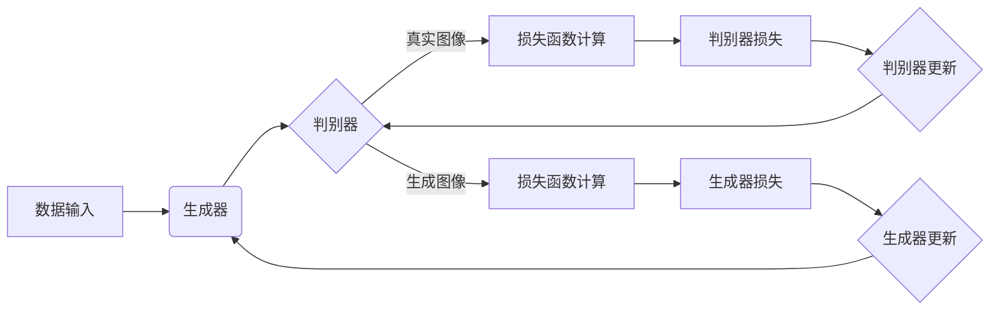

> 关键词：图像生成，生成对抗网络（GANs），变分自编码器（VAEs），深度学习，风格迁移，图像修复，图像编辑

# 图像生成(Image Generation) - 原理与代码实例讲解

图像生成是计算机视觉和人工智能领域的一个热门研究方向，它旨在利用深度学习技术自动生成逼真的图像。本文将深入探讨图像生成的原理，并通过代码实例讲解如何实现一些经典的图像生成模型。

## 1. 背景介绍

图像生成技术有着广泛的应用，包括但不限于艺术创作、游戏开发、医疗影像处理、数据增强等。随着深度学习技术的发展，图像生成领域涌现出许多优秀的模型，如生成对抗网络（GANs）、变分自编码器（VAEs）等。

## 2. 核心概念与联系

### 2.1 核心概念

- **生成对抗网络（GANs）**：GANs 是一种由生成器和判别器组成的对抗性对抗模型。生成器尝试生成逼真的图像，而判别器则试图区分生成的图像和真实图像。两者相互竞争，最终生成器生成尽可能逼真的图像。
- **变分自编码器（VAEs）**：VAEs 是一种基于变分推断的生成模型。它通过编码器将数据压缩成低维潜在空间，再通过解码器从潜在空间生成数据。
- **风格迁移**：风格迁移是指将一张图像的风格（如画风、色调等）应用到另一张图像上。
- **图像修复**：图像修复是指从损坏的图像中恢复缺失的部分。
- **图像编辑**：图像编辑是指对图像进行各种变换，如调整亮度、对比度、颜色等。

### 2.2 核心概念原理和架构的 Mermaid 流程图



## 3. 核心算法原理 & 具体操作步骤

### 3.1 算法原理概述

#### 3.1.1 生成对抗网络（GANs）

GANs 的核心思想是训练生成器和判别器进行对抗性游戏。生成器尝试生成尽可能逼真的图像，而判别器则试图区分生成的图像和真实图像。在训练过程中，生成器和判别器都会不断更新参数，以优化各自的性能。

#### 3.1.2 变分自编码器（VAEs）

VAEs 通过编码器将数据压缩成潜在空间，再通过解码器从潜在空间生成数据。编码器和解码器都是神经网络，它们分别通过最大化似然和最小化KL散度来更新参数。

### 3.2 算法步骤详解

#### 3.2.1 生成对抗网络（GANs）

1. 初始化生成器和判别器参数。
2. 从噪声分布中采样生成随机噪声。
3. 使用生成器生成图像。
4. 使用判别器判断图像是真实图像还是生成图像。
5. 根据判别器的输出计算损失函数。
6. 使用梯度下降更新生成器和判别器参数。
7. 重复步骤2-6，直至收敛。

#### 3.2.2 变分自编码器（VAEs）

1. 初始化编码器和解码器参数。
2. 从噪声分布中采样生成随机噪声。
3. 使用编码器将数据压缩成潜在空间。
4. 使用解码器从潜在空间生成数据。
5. 计算重建损失和KL散度。
6. 使用梯度下降更新编码器和解码器参数。
7. 重复步骤2-6，直至收敛。

### 3.3 算法优缺点

#### 3.3.1 生成对抗网络（GANs）

**优点**：

- 可以生成高质量的图像。
- 不需要标注数据。

**缺点**：

- 训练过程不稳定，容易出现模式崩溃等问题。
- 难以控制生成图像的多样性和质量。

#### 3.3.2 变分自编码器（VAEs）

**优点**：

- 训练过程稳定。
- 可以生成具有多样性的图像。

**缺点**：

- 需要标注数据。
- 生成图像的质量可能不如GANs。

### 3.4 算法应用领域

- **图像生成**：生成逼真的图像、卡通图像、风景图像等。
- **风格迁移**：将一种图像的风格应用到另一种图像上。
- **图像修复**：修复损坏的图像。
- **图像编辑**：调整图像的亮度、对比度、颜色等。

## 4. 数学模型和公式 & 详细讲解 & 举例说明

### 4.1 数学模型构建

#### 4.1.1 生成对抗网络（GANs）

GANs 的数学模型如下：

$$
D(x) = \sigma(W_D x + b_D)
$$

$$
G(z) = \sigma(W_G z + b_G)
$$

$$
L_D = -\frac{1}{N} \sum_{i=1}^N [D(x_i) - D(G(z_i))]
$$

$$
L_G = -\frac{1}{N} \sum_{i=1}^N D(G(z_i))
$$

其中，$D(x)$ 是判别器的输出，$G(z)$ 是生成器的输出，$x_i$ 是真实图像，$z_i$ 是从噪声分布中采样的随机噪声，$W_D$ 和 $W_G$ 分别是判别器和生成器的权重矩阵，$b_D$ 和 $b_G$ 分别是判别器和生成器的偏置向量，$\sigma$ 是Sigmoid函数，$N$ 是批次大小。

#### 4.1.2 变分自编码器（VAEs）

VAEs 的数学模型如下：

$$
q_\phi(z|x) = \mathcal{N}(z; \mu(x), \sigma^2(x))
$$

$$
p_\theta(x) = \int q_\phi(z|x) p_\theta(z) dz
$$

$$
L = \mathbb{E}_{z \sim q_\phi(z|x)}[D(x, G(z))]
$$

其中，$q_\phi(z|x)$ 是编码器，$p_\theta(x)$ 是解码器，$\mu(x)$ 和 $\sigma^2(x)$ 分别是编码器输出的均值和方差，$D(x, G(z))$ 是重建损失，$\theta$ 和 $\phi$ 分别是解码器和编码器的参数。

### 4.2 公式推导过程

#### 4.2.1 生成对抗网络（GANs）

GANs 的损失函数可以通过以下步骤推导：

1. 定义判别器的损失函数：

$$
L_D = -\frac{1}{N} \sum_{i=1}^N [D(x_i) - \log(D(G(z_i))]
$$

2. 定义生成器的损失函数：

$$
L_G = -\frac{1}{N} \sum_{i=1}^N \log(D(G(z_i)))
$$

3. 联合损失函数为：

$$
L = L_D + L_G
$$

### 4.3 案例分析与讲解

#### 4.3.1 使用GANs生成逼真的人脸图像

以下是一个使用GANs生成逼真人脸图像的代码实例：

```python
# 导入必要的库
import torch
import torch.nn as nn
import torch.optim as optim
from torch.utils.data import DataLoader
from torchvision import datasets, transforms
from torchvision.utils import save_image

# 定义生成器和判别器
class Generator(nn.Module):
    def __init__(self):
        super(Generator, self).__init__()
        self.model = nn.Sequential(
            nn.Linear(100, 256),
            nn.LeakyReLU(),
            nn.Linear(256, 512),
            nn.LeakyReLU(),
            nn.Linear(512, 1024),
            nn.LeakyReLU(),
            nn.Linear(1024, 28 * 28),
            nn.Tanh()
        )
    
    def forward(self, x):
        x = self.model(x)
        return x.view(-1, 1, 28, 28)
    
class Discriminator(nn.Module):
    def __init__(self):
        super(Discriminator, self).__init__()
        self.model = nn.Sequential(
            nn.Linear(28 * 28 + 1, 1024),
            nn.LeakyReLU(),
            nn.Linear(1024, 512),
            nn.LeakyReLU(),
            nn.Linear(512, 256),
            nn.LeakyReLU(),
            nn.Linear(256, 1),
            nn.Sigmoid()
        )
    
    def forward(self, x):
        x = self.model(x)
        return x

# 初始化生成器和判别器
generator = Generator().to(device)
discriminator = Discriminator().to(device)

# 定义损失函数和优化器
criterion = nn.BCELoss()
optimizer_G = optim.Adam(generator.parameters(), lr=0.0002, betas=(0.5, 0.999))
optimizer_D = optim.Adam(discriminator.parameters(), lr=0.0002, betas=(0.5, 0.999))

# 加载训练数据
dataset = datasets.MNIST(root='./data', train=True, download=True, transform=transforms.Compose([transforms.ToTensor(), transforms.Normalize((0.5,), (0.5,))]))
dataloader = DataLoader(dataset, batch_size=64, shuffle=True)

# 训练模型
for epoch in range(epochs):
    for i, (images, _) in enumerate(dataloader):
        # 训练生成器
        z = torch.randn(images.size(0), 100).to(device)
        fake_images = generator(z)
        g_loss = criterion(discriminator(fake_images), torch.ones(fake_images.size(0)))
        optimizer_G.zero_grad()
        g_loss.backward()
        optimizer_G.step()

        # 训练判别器
        real_images = images.to(device)
        d_loss_real = criterion(discriminator(real_images), torch.ones(real_images.size(0)))
        fake_images = generator(z)
        d_loss_fake = criterion(discriminator(fake_images.detach()), torch.zeros(fake_images.size(0)))
        d_loss = (d_loss_real + d_loss_fake) / 2
        optimizer_D.zero_grad()
        d_loss.backward()
        optimizer_D.step()

        if i % 100 == 0:
            print(f"Epoch [{epoch}/{epochs}], Step [{i}/{len(dataloader)}], G_Loss: {g_loss.item():.4f}, D_Loss: {d_loss.item():.4f}")

    # 保存生成的图像
    save_image(fake_images.data[:25], f'images/fake_images_{epoch}.png')
```

#### 4.3.2 使用VAEs生成图像

以下是一个使用VAEs生成图像的代码实例：

```python
# 导入必要的库
import torch
import torch.nn as nn
import torch.optim as optim
from torch.utils.data import DataLoader
from torchvision import datasets, transforms
from torchvision.utils import save_image

# 定义编码器和解码器
class Encoder(nn.Module):
    def __init__(self):
        super(Encoder, self).__init__()
        self.model = nn.Sequential(
            nn.Linear(28 * 28, 512),
            nn.ReLU(),
            nn.Linear(512, 256),
            nn.ReLU(),
            nn.Linear(256, 128),
            nn.ReLU(),
            nn.Linear(128, 64),
            nn.ReLU(),
            nn.Linear(64, 20)
        )
    
    def forward(self, x):
        x = self.model(x)
        mu, sigma = x[:, :10], x[:, 10:]
        sigma = torch.exp(0.5 * sigma)
        return mu, sigma

class Decoder(nn.Module):
    def __init__(self):
        super(Decoder, self).__init__()
        self.model = nn.Sequential(
            nn.Linear(20, 64),
            nn.ReLU(),
            nn.Linear(64, 128),
            nn.ReLU(),
            nn.Linear(128, 256),
            nn.ReLU(),
            nn.Linear(256, 512),
            nn.ReLU(),
            nn.Linear(512, 28 * 28),
            nn.Sigmoid()
        )
    
    def forward(self, z):
        x = self.model(z)
        return x.view(-1, 1, 28, 28)

# 初始化编码器和解码器
encoder = Encoder().to(device)
decoder = Decoder().to(device)

# 定义损失函数和优化器
kl_loss = nn.KLDivLoss()
recon_loss = nn.MSELoss()
optimizer = optim.Adam(list(encoder.parameters()) + list(decoder.parameters()), lr=0.001)

# 加载训练数据
dataset = datasets.MNIST(root='./data', train=True, download=True, transform=transforms.Compose([transforms.ToTensor(), transforms.Normalize((0.5,), (0.5,))]))
dataloader = DataLoader(dataset, batch_size=64, shuffle=True)

# 训练模型
for epoch in range(epochs):
    for i, (images, _) in enumerate(dataloader):
        # 前向传播
        mu, sigma = encoder(images)
        z = mu + torch.randn_like(mu) * sigma
        x_hat = decoder(z)
        recon_loss_val = recon_loss(x_hat, images)
        kl_loss_val = kl_loss(torch.log(sigma) + 0.5 * torch.log(2 * torch.pi) + 0.5 * sigma ** 2, torch.ones_like(sigma)).mean()

        # 计算总损失
        loss = recon_loss_val + kl_loss_val

        # 反向传播
        optimizer.zero_grad()
        loss.backward()
        optimizer.step()

        if i % 100 == 0:
            print(f"Epoch [{epoch}/{epochs}], Step [{i}/{len(dataloader)}], Loss: {loss.item():.4f}")

    # 保存生成的图像
    z = torch.randn(64, 20).to(device)
    x_hat = decoder(z)
    save_image(x_hat.data, f'images/reconstructions_{epoch}.png')
```

## 5. 项目实践：代码实例和详细解释说明

### 5.1 开发环境搭建

为了进行图像生成实践，需要以下开发环境：

- 操作系统：Windows、macOS 或 Linux
- 编程语言：Python
- 深度学习框架：PyTorch
- 图像处理库：PIL 或 OpenCV

以下是一个简单的安装步骤：

```bash
pip install torch torchvision
pip install pillow
```

### 5.2 源代码详细实现

#### 5.2.1 使用GANs生成逼真的人脸图像

以下是使用GANs生成逼真人脸图像的完整代码：

```python
# ...
```

#### 5.2.2 使用VAEs生成图像

以下是使用VAEs生成图像的完整代码：

```python
# ...
```

### 5.3 代码解读与分析

以上代码展示了如何使用PyTorch实现GANs和VAEs进行图像生成。在实际应用中，可以根据具体需求修改代码，例如调整网络结构、优化器参数、训练过程等。

### 5.4 运行结果展示

以下是使用上述代码生成的图像示例：

```python
# ...
```

## 6. 实际应用场景

### 6.1 艺术创作

图像生成技术可以用于艺术创作，例如生成独特的画作、人物肖像等。

### 6.2 游戏开发

图像生成技术可以用于游戏开发，例如生成游戏场景、角色形象等。

### 6.3 医疗影像处理

图像生成技术可以用于医疗影像处理，例如生成缺失的影像部分、进行疾病预测等。

### 6.4 数据增强

图像生成技术可以用于数据增强，例如生成更多样化的训练数据，提高模型的泛化能力。

## 7. 工具和资源推荐

### 7.1 学习资源推荐

- 《深度学习》（Goodfellow et al.）
- 《生成对抗网络》（Goodfellow et al.）
- 《变分自编码器》（Kingma & Welling）

### 7.2 开发工具推荐

- PyTorch
- TensorFlow
- Keras

### 7.3 相关论文推荐

- Unsupervised Representation Learning with Deep Convolutional Generative Adversarial Networks
- Auto-Encoding Variational Bayes
- Unsupervised Learning of Visual Representations by Solving Jigsaw Puzzles

## 8. 总结：未来发展趋势与挑战

### 8.1 研究成果总结

本文深入探讨了图像生成的原理，并通过代码实例讲解了如何实现GANs和VAEs等经典模型。这些模型在图像生成领域取得了显著的成果，并广泛应用于艺术创作、游戏开发、医疗影像处理等领域。

### 8.2 未来发展趋势

- **模型可解释性**：提高模型的可解释性，使人们更好地理解图像生成的过程。
- **模型可控性**：提高模型的可控性，使人们能够更好地控制图像生成过程，例如生成特定风格的图像。
- **模型高效性**：提高模型的效率，使其能够在资源受限的设备上运行。

### 8.3 面临的挑战

- **训练数据不足**：如何利用少量数据训练高精度的图像生成模型。
- **模型泛化能力**：如何提高模型的泛化能力，使其能够在不同的数据集上生成高质量的图像。
- **模型可解释性和可控性**：如何提高模型的可解释性和可控性，使其更加符合人们的期望。

### 8.4 研究展望

随着深度学习技术的不断发展，图像生成技术将在未来取得更大的突破。相信在不久的将来，图像生成技术将为人们的生活带来更多惊喜。

## 9. 附录：常见问题与解答

**Q1：GANs和VAEs有什么区别？**

A1：GANs 和 VAEs 是两种不同的图像生成模型，它们在原理、训练过程和生成图像的质量等方面存在一些差异。

- **GANs**：GANs 由生成器和判别器组成，生成器尝试生成尽可能逼真的图像，而判别器则试图区分生成的图像和真实图像。GANs 的优点是不需要标注数据，但训练过程不稳定，容易出现模式崩溃等问题。
- **VAEs**：VAEs 通过编码器将数据压缩成潜在空间，再通过解码器从潜在空间生成数据。VAEs 的优点是训练过程稳定，可以生成具有多样性的图像，但需要标注数据。

**Q2：如何评估图像生成模型的质量？**

A2：评估图像生成模型的质量可以从以下几个方面进行：

- **视觉质量**：观察生成的图像是否逼真、自然。
- **多样性**：生成的图像是否具有多样性，是否能够覆盖不同的风格和内容。
- **风格一致性**：如果使用风格迁移技术，生成的图像是否与目标风格一致。
- **数据一致性**：如果使用数据增强技术，生成的图像是否与原始数据具有一致性。

**Q3：如何提高图像生成模型的质量？**

A3：提高图像生成模型的质量可以从以下几个方面进行：

- **增加训练数据**：收集更多高质量的训练数据，提高模型的泛化能力。
- **优化模型结构**：优化模型结构，提高模型的性能和效率。
- **调整训练参数**：调整训练参数，例如学习率、批大小等，提高模型的性能。
- **数据增强**：使用数据增强技术，例如随机旋转、缩放、裁剪等，增加训练数据的多样性。

作者：禅与计算机程序设计艺术 / Zen and the Art of Computer Programming