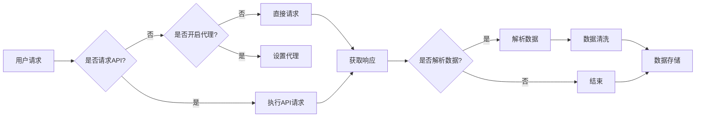

> 关键词：微博爬虫，Python爬虫，用户信息分析，数据分析，API接口，反爬虫机制，网络爬虫框架，数据挖掘

# 基于Python的新浪微博用户信息爬取与分析

随着互联网的快速发展，微博已成为中国最大的社交平台之一，用户数量和活跃度持续增长。微博用户信息蕴含着丰富的社会关系网络、舆情动态和用户行为数据，对于市场分析、品牌营销、舆情监控等领域具有重要的研究价值。本文将介绍如何使用Python技术对新浪微博用户信息进行爬取与分析，并探讨相关技术实现和未来发展趋势。

## 1. 背景介绍

### 1.1 微博用户信息的重要性

微博用户信息主要包括用户基本信息、发布内容、关注列表、粉丝列表、互动数据等，这些信息对于以下领域具有重要的价值：

- **市场分析**：了解用户偏好、消费习惯、地域分布等信息，为企业市场定位、产品研发提供依据。
- **品牌营销**：通过分析用户互动数据，评估品牌形象、口碑和用户满意度。
- **舆情监控**：实时监测舆情动态，及时响应负面信息，维护企业形象。
- **社会学研究**：研究社会关系网络、群体行为、信息传播等社会现象。

### 1.2 爬虫技术概述

爬虫（Crawler）是一种自动化程序，用于从互联网上抓取信息。Python作为一种灵活、强大的编程语言，拥有丰富的爬虫库，如Scrapy、BeautifulSoup、requests等，便于开发者实现高效的网络信息采集。

### 1.3 微博爬虫的特点与挑战

微博爬虫具有以下特点：

- **数据量大**：微博用户数量庞大，每个用户都可能拥有成千上万条微博信息。
- **更新速度快**：用户持续发布新内容，需要实时抓取更新。
- **反爬虫机制**：微博平台拥有完善的反爬虫机制，如IP封禁、验证码等，对爬虫进行限制。

针对以上特点，微博爬虫需要具备以下能力：

- **高效的数据采集**：利用多线程、异步IO等技术提高数据采集速度。
- **有效的反爬虫策略**：合理设置请求头、代理IP、请求频率等，降低被识别的风险。
- **数据清洗与存储**：对采集到的数据进行清洗、去重、存储等操作。

## 2. 核心概念与联系

### 2.1 核心概念

- **爬虫**：自动化程序，从互联网上抓取信息。
- **网络爬虫框架**：提供爬虫开发、管理、部署等功能的软件框架，如Scrapy。
- **API接口**：应用程序接口，用于不同程序之间的数据交互。
- **反爬虫机制**：防止非法访问和滥用平台的机制，如IP封禁、验证码等。
- **数据挖掘**：从大量数据中提取有价值信息的过程。

### 2.2 核心概念原理和架构的 Mermaid 流程图



### 2.3 核心概念联系

- 爬虫通过API接口获取数据。
- 网络爬虫框架提供爬虫的开发、管理和部署功能。
- 反爬虫机制用于防止非法访问和滥用平台。
- 数据挖掘从爬取的数据中提取有价值的信息。

## 3. 核心算法原理 & 具体操作步骤

### 3.1 算法原理概述

微博爬虫的算法原理主要涉及以下步骤：

1. **目标分析**：确定爬取的目标，如用户信息、微博内容、评论等。
2. **API接口分析**：分析微博API接口，了解数据结构和获取方式。
3. **爬虫开发**：使用Python等编程语言开发爬虫程序，实现API请求、数据解析、存储等操作。
4. **反爬虫策略**：针对微博的反爬虫机制，设置合理的请求头、代理IP、请求频率等，降低被识别的风险。
5. **数据清洗与存储**：对爬取到的数据进行清洗、去重、存储等操作。

### 3.2 算法步骤详解

#### 3.2.1 目标分析

首先，需要确定爬取的目标，如：

- 用户基本信息：用户名、头像、简介、粉丝数、关注数等。
- 微博内容：文本、图片、视频、发布时间等。
- 评论：评论内容、评论时间、评论用户等。

#### 3.2.2 API接口分析

微博提供多种API接口，如：

- 用户信息接口：获取用户基本信息。
- 微博信息接口：获取用户发布的微博内容。
- 评论接口：获取微博评论。

#### 3.2.3 爬虫开发

使用Python等编程语言开发爬虫程序，实现以下功能：

- 使用requests库发送API请求，获取响应数据。
- 使用json库解析JSON格式的响应数据。
- 使用数据库或其他存储方式存储爬取的数据。

#### 3.2.4 反爬虫策略

针对微博的反爬虫机制，可以采取以下策略：

- 设置请求头：修改User-Agent、Referer等头部信息，模拟浏览器访问。
- 使用代理IP：通过代理服务器发送请求，隐藏真实IP地址。
- 设置请求频率：控制请求间隔时间，避免频繁请求被识别。

#### 3.2.5 数据清洗与存储

对爬取到的数据进行清洗、去重、存储等操作：

- 清洗：去除无效数据、重复数据、异常数据等。
- 去重：去除重复的用户、微博、评论等数据。
- 存储：将清洗后的数据存储到数据库或其他存储方式。

### 3.3 算法优缺点

#### 3.3.1 优点

- **高效**：使用API接口和高效的网络爬虫框架，能够快速获取大量数据。
- **准确**：通过数据清洗和去重，保证数据的准确性。
- **灵活**：可根据需求定制爬虫程序，适应不同的爬取目标。

#### 3.3.2 缺点

- **合规风险**：爬取数据可能存在合规风险，需要遵守相关法律法规。
- **维护成本**：爬虫程序需要定期维护，更新API接口、反爬虫策略等。

### 3.4 算法应用领域

微博爬虫技术广泛应用于以下领域：

- **市场分析**：分析用户偏好、消费习惯、地域分布等信息，为企业市场定位、产品研发提供依据。
- **品牌营销**：通过分析用户互动数据，评估品牌形象、口碑和用户满意度。
- **舆情监控**：实时监测舆情动态，及时响应负面信息，维护企业形象。
- **社会学研究**：研究社会关系网络、群体行为、信息传播等社会现象。

## 4. 数学模型和公式 & 详细讲解 & 举例说明

### 4.1 数学模型构建

微博用户信息分析可以采用以下数学模型：

- **用户画像**：利用机器学习算法，根据用户发布的内容、互动行为等特征，构建用户画像。
- **情感分析**：利用自然语言处理技术，分析用户发布的文本内容，判断其情感倾向。
- **聚类分析**：将用户划分为不同的群体，研究不同群体的特征和行为。

### 4.2 公式推导过程

#### 4.2.1 用户画像

假设用户特征空间为 $\mathbf{X} = [x_1, x_2, ..., x_n]$，其中 $x_i$ 为第 $i$ 个特征。则用户画像可以通过以下公式计算：

$$
\mathbf{y} = f(\mathbf{X}) = \sum_{i=1}^{n} w_i x_i
$$

其中，$w_i$ 为第 $i$ 个特征的权重。

#### 4.2.2 情感分析

假设用户发布的文本内容为 $S$，则情感分析可以通过以下公式计算：

$$
P_{positive} = \sigma(w^T \cdot [f(S), g(S), h(S), ...])
$$

其中，$\sigma$ 为Sigmoid函数，$w$ 为情感分析模型的参数，$f(S)$、$g(S)$、$h(S)$ 等为文本特征提取函数。

#### 4.2.3 聚类分析

假设有 $m$ 个用户，每个用户由 $n$ 个特征表示，则聚类分析可以通过以下公式计算：

$$
\text{Cluster}(i) = \arg\min_{j} \sum_{k=1}^{m} (x_k - c_j)^2
$$

其中，$x_k$ 为第 $k$ 个用户的特征，$c_j$ 为第 $j$ 个聚类的中心。

### 4.3 案例分析与讲解

#### 4.3.1 用户画像

假设我们使用LDA（潜在狄利克雷分配）算法构建用户画像。LDA是一种主题模型，可以挖掘文档集合中的潜在主题。

以下是使用LDA算法构建用户画像的示例代码：

```python
import gensim

# 加载数据
texts = [text.split() for text in documents]

# 创建LDA模型
ldamodel = gensim.models.ldamodel.LdaModel(
    texts,
    num_topics=10,
    id2word=id2word,
    passes=10,
)

# 获取用户主题分布
for user_id in range(len(users)):
    print(f"User {user_id} topic distribution:")
    print(ldamodel.get_document_topics(users[user_id], minimum_probability=0)
```

#### 4.3.2 情感分析

假设我们使用TextBlob库进行情感分析。TextBlob是一个简单易用的Python库，可以快速获取文本的情感倾向。

以下是使用TextBlob进行情感分析的示例代码：

```python
from textblob import TextBlob

text = "This is a great product!"
blob = TextBlob(text)
print(blob.sentiment)
```

#### 4.3.3 聚类分析

假设我们使用KMeans算法进行聚类分析。KMeans是一种无监督学习算法，可以将数据划分为 $k$ 个簇。

以下是使用KMeans进行聚类的示例代码：

```python
from sklearn.cluster import KMeans

# 创建KMeans模型
kmeans = KMeans(n_clusters=3)

# 训练模型
kmeans.fit(features)

# 获取聚类结果
labels = kmeans.labels_
```

## 5. 项目实践：代码实例和详细解释说明

### 5.1 开发环境搭建

在进行微博爬虫开发前，需要准备以下开发环境：

- Python 3.6及以上版本
- Scrapy网络爬虫框架
- requests库
- BeautifulSoup库
- 其他依赖库：pymysql、pandas等

### 5.2 源代码详细实现

以下是使用Scrapy实现微博爬虫的示例代码：

```python
import scrapy
from scrapy.crawler import CrawlerProcess
from scrapy.utils.project import get_project_settings

class WeiboSpider(scrapy.Spider):
    name = 'weibo_spider'
    allowed_domains = ['weibo.com']
    start_urls = ['https://weibo.com/']

    def parse(self, response):
        # 解析用户信息
        user_info = response.css('div.user_info::text').extract()
        # 解析微博内容
        weibo_content = response.css('div.content::text').extract()
        # 保存数据
        # ...

# 创建爬虫进程
process = CrawlerProcess(get_project_settings())
process.crawl(WeiboSpider)
process.start()
```

### 5.3 代码解读与分析

以上代码展示了如何使用Scrapy框架实现微博爬虫的基本结构。首先，定义一个Spider类继承自scrapy.Spider，并设置爬虫名称、允许的域名和起始URL。在parse函数中，解析用户信息和微博内容，并将数据保存到数据库或其他存储方式。

### 5.4 运行结果展示

运行以上代码后，爬虫会从指定的起始URL开始，依次访问微博页面，并解析用户信息和微博内容。最终，将解析得到的数据保存到数据库或其他存储方式。

## 6. 实际应用场景

### 6.1 市场分析

利用微博爬虫技术，可以分析用户偏好、消费习惯、地域分布等信息，为企业市场定位、产品研发提供依据。

### 6.2 品牌营销

通过分析用户互动数据，可以评估品牌形象、口碑和用户满意度，为企业制定营销策略提供参考。

### 6.3 舆情监控

实时监测舆情动态，及时响应负面信息，维护企业形象，避免危机事件的发生。

### 6.4 社会学研究

研究社会关系网络、群体行为、信息传播等社会现象，为社会科学研究提供数据支持。

## 7. 工具和资源推荐

### 7.1 学习资源推荐

- 《Python网络爬虫从入门到实践》
- 《Scrapy网络爬虫开发与实践》
- 《自然语言处理与深度学习》
- 《数据科学入门与实践》

### 7.2 开发工具推荐

- Scrapy网络爬虫框架
- requests库
- BeautifulSoup库
- TextBlob情感分析库
- gensim主题模型库
- pandas数据分析库

### 7.3 相关论文推荐

- 《微博用户画像的构建与应用》
- 《基于微博文本的情感分析研究》
- 《基于KMeans聚类的用户群体分析》
- 《基于网络爬虫的社会网络分析》

## 8. 总结：未来发展趋势与挑战

### 8.1 研究成果总结

本文介绍了基于Python的新浪微博用户信息爬取与分析方法，包括爬虫技术、数据挖掘、数据分析等方面。通过实际案例，展示了如何使用Python技术实现微博爬虫，并利用数据分析技术对用户信息进行分析。

### 8.2 未来发展趋势

随着互联网的快速发展，微博用户信息将更加丰富，微博爬虫技术也将不断演进。以下是一些未来发展趋势：

- **技术融合**：微博爬虫将与自然语言处理、知识图谱、深度学习等技术融合，实现更智能的数据采集和分析。
- **数据安全**：随着数据安全意识的提高，微博爬虫技术将更加注重数据安全和隐私保护。
- **合规性**：微博爬虫技术将更加遵守相关法律法规，降低合规风险。

### 8.3 面临的挑战

微博爬虫技术在实际应用中面临着以下挑战：

- **反爬虫机制**：微博平台反爬虫机制不断升级，爬虫开发者需要不断优化爬虫策略，降低被识别的风险。
- **数据质量**：微博平台数据质量参差不齐，需要加强数据清洗和去重，保证数据的准确性。
- **法律法规**：微博爬虫技术需要遵守相关法律法规，降低合规风险。

### 8.4 研究展望

未来，微博爬虫技术将在以下方面进行深入研究：

- **高效爬虫算法**：研究更高效的爬虫算法，提高数据采集速度，降低资源消耗。
- **智能爬虫技术**：研究基于机器学习、深度学习的智能爬虫技术，实现更智能的数据采集和分析。
- **数据挖掘技术**：研究更先进的数据挖掘技术，从海量用户信息中提取有价值的信息。

## 9. 附录：常见问题与解答

**Q1：如何避免被微博平台封禁？**

A：避免被微博平台封禁，需要遵守以下原则：

- 限制请求频率：设置合理的请求间隔时间，避免频繁请求。
- 使用代理IP：通过代理服务器发送请求，隐藏真实IP地址。
- 修改User-Agent：模拟浏览器访问，降低被识别的风险。

**Q2：如何保证数据的准确性？**

A：保证数据准确性需要以下措施：

- 数据清洗：去除无效数据、重复数据、异常数据等。
- 数据去重：去除重复的用户、微博、评论等数据。
- 数据验证：验证数据的一致性和完整性。

**Q3：如何处理大量数据？**

A：处理大量数据需要以下策略：

- 分布式存储：使用分布式数据库存储大量数据。
- 数据压缩：使用数据压缩技术减小存储空间。
- 数据分片：将数据划分为多个片段，分别处理。

**Q4：如何进行数据可视化分析？**

A：进行数据可视化分析可以使用以下工具：

- Matplotlib：Python数据可视化库。
- Seaborn：基于Matplotlib的统计绘图库。
- Tableau：商业数据可视化工具。

通过以上解答，相信读者对基于Python的新浪微博用户信息爬取与分析技术有了更深入的了解。在实际应用中，需要根据具体需求选择合适的技术和工具，并不断优化和改进，以实现高效、准确的数据采集和分析。

---

作者：禅与计算机程序设计艺术 / Zen and the Art of Computer Programming