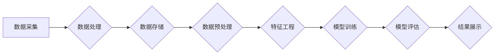

# 基于分布式计算的大学生择业大数据分析

> 关键词：分布式计算，大数据分析，大学生择业，机器学习，决策树，聚类分析，关联规则

## 1. 背景介绍

随着信息技术的飞速发展，大数据分析已成为众多行业的重要决策支持工具。教育领域也不例外，尤其是在大学生择业这一关键阶段，如何利用大数据分析技术帮助大学生做出明智的职业选择，已成为一个重要的研究方向。本文将探讨如何基于分布式计算平台，对大学生择业数据进行深入的大数据分析，为大学生提供个性化的职业规划建议。

### 1.1 问题的由来

大学生择业是一个复杂的过程，涉及众多因素，如个人兴趣、专业背景、市场需求、行业前景等。然而，由于数据获取难、分析能力有限，许多大学生在择业时面临以下问题：

- 缺乏对自身兴趣和能力的准确认知
- 对行业和职业的了解不够深入
- 难以获取全面的市场需求和就业数据
- 缺乏科学的决策依据

为解决上述问题，需要对大学生择业数据进行深入分析，提供个性化的职业规划建议。

### 1.2 研究现状

目前，针对大学生择业的大数据分析研究主要集中在以下方面：

- 数据收集：通过问卷调查、在线招聘平台、教育机构等渠道收集大学生择业数据。
- 数据处理：对收集到的数据进行清洗、整合、预处理，为后续分析做准备。
- 数据分析：采用机器学习、数据挖掘等算法对数据进行分析，挖掘数据中的规律和关联性。
- 结果展示：将分析结果以可视化的形式呈现，便于用户理解。

### 1.3 研究意义

基于分布式计算的大学生择业大数据分析具有以下研究意义：

- 帮助大学生了解自身兴趣和优势，做出更符合自身特点的职业选择。
- 为高校提供人才培养和就业指导的参考依据，提高人才培养质量。
- 为企业招聘提供人才画像，提高招聘效率。
- 为教育政策制定提供数据支持，促进教育公平。

### 1.4 本文结构

本文将从以下方面展开论述：

- 介绍分布式计算和大数据分析的核心概念。
- 构建基于分布式计算的大学生择业大数据分析流程。
- 分析常用的大数据分析算法。
- 展示实际案例分析。
- 探讨未来发展趋势和挑战。

## 2. 核心概念与联系

### 2.1 分布式计算

分布式计算是一种利用多台计算机协同完成计算任务的计算模式。在分布式计算中，每台计算机只负责计算任务的一部分，通过高速网络进行通信和数据交换，最终协同完成整个计算任务。

### 2.2 大数据分析

大数据分析是指利用先进的数据处理技术和分析算法，对海量数据进行挖掘和洞察，发现数据中的规律和关联性，为决策提供支持。

### 2.3 核心概念原理和架构的 Mermaid 流程图

以下是基于分布式计算的大学生择业大数据分析流程的 Mermaid 流程图：



### 2.4 核心概念联系

分布式计算为大数据分析提供了强大的计算能力，使得处理海量数据成为可能。大数据分析则通过对数据的挖掘和洞察，为大学生择业提供科学的决策依据。

## 3. 核心算法原理 & 具体操作步骤

### 3.1 算法原理概述

针对大学生择业大数据分析，我们可以采用以下几种常用的数据分析算法：

- 决策树：通过树形结构对数据进行分类和预测。
- 聚类分析：将数据根据相似性进行分组。
- 关联规则：发现数据之间的关联性和规律。

### 3.2 算法步骤详解

#### 3.2.1 决策树

1. 构建决策树：根据特征和样本的标签，构建决策树模型。
2. 数据分割：根据决策树节点，将数据分割为子集。
3. 递归构建：对每个子集继续构建决策树，直至满足停止条件。

#### 3.2.2 聚类分析

1. 初始化聚类中心：随机选择若干个样本作为初始聚类中心。
2. 聚类划分：将每个样本分配到最近的聚类中心所属的类别。
3. 更新聚类中心：根据聚类结果，更新聚类中心的位置。
4. 迭代优化：重复步骤2和3，直至满足停止条件。

#### 3.2.3 关联规则

1. 支持度计算：计算满足最小支持度阈值的规则。
2. 信任度计算：计算满足最小信任度阈值的规则。
3. 规则生成：根据支持度和信任度，生成关联规则。

### 3.3 算法优缺点

#### 3.3.1 决策树

优点：简单易懂，易于解释，适用于分类和回归问题。

缺点：容易过拟合，对噪声数据敏感。

#### 3.3.2 聚类分析

优点：不需要预先定义类别，适用于无监督学习。

缺点：聚类结果依赖于初始化参数，聚类结果难以解释。

#### 3.3.3 关联规则

优点：发现数据之间的关联性，适用于关联分析。

缺点：生成大量冗余规则，难以解释。

### 3.4 算法应用领域

决策树、聚类分析和关联规则在大学生择业大数据分析中均有广泛应用，可以用于：

- 分析大学生兴趣、能力与职业之间的匹配度。
- 发现不同专业之间的关联性。
- 挖掘就业市场与行业发展趋势。

## 4. 数学模型和公式 & 详细讲解 & 举例说明

### 4.1 数学模型构建

以下以决策树为例，介绍其数学模型。

#### 4.1.1 决策树

决策树是一种树形结构，由节点和分支组成。每个节点代表一个特征，每个分支代表特征的不同取值。

#### 4.1.2 决策树公式

设 $X$ 为特征集合，$Y$ 为标签集合，决策树的数学模型可以表示为：

$$
T = \{t_1, t_2, ..., t_n\}
$$

其中 $t_i$ 为决策树中的一个节点，$n$ 为节点数量。

### 4.2 公式推导过程

决策树的公式推导过程如下：

1. 选择最佳特征：根据特征与标签的相关性，选择最佳特征。
2. 分割数据：根据最佳特征，将数据分割为若干个子集。
3. 递归构建：对每个子集继续构建决策树，直至满足停止条件。

### 4.3 案例分析与讲解

以下以某高校计算机专业学生的择业数据为例，介绍决策树的应用。

#### 4.3.1 数据集

某高校计算机专业学生的择业数据如下表所示：

| 学生编号 | 兴趣 | 能力 | 行业 | 是否就业 |
| :----: | :--: | :--: | :--: | :----: |
| 1 | 编程 | 优秀 | IT | 是 |
| 2 | 编程 | 一般 | 金融 | 否 |
| 3 | 产品 | 一般 | IT | 是 |
| 4 | 设计 | 优秀 | 设计 | 否 |
| 5 | 编程 | 优秀 | 金融 | 是 |

#### 4.3.2 决策树构建

以兴趣和能力作为特征，构建决策树如下：

```
           |
           |--- 编程
           |   |
           |   |--- 优秀 --> IT
           |   |--- 一般 --> 金融
           |
           |--- 产品
           |   |
           |   |--- 一般 --> IT
           |
           |--- 设计
           |   |
           |   |--- 优秀 --> 设计
           |
           |--- 否
```

根据决策树，我们可以得出以下结论：

- 编程能力强的学生更适合选择IT行业。
- 对设计感兴趣的学生可以尝试设计行业。
- 对金融感兴趣的学生可以考虑金融行业，但需提高编程能力。

### 5. 项目实践：代码实例和详细解释说明

### 5.1 开发环境搭建

1. 安装Python编程语言。
2. 安装Scikit-learn库：`pip install scikit-learn`。

### 5.2 源代码详细实现

```python
from sklearn.datasets import load_iris
from sklearn.model_selection import train_test_split
from sklearn.tree import DecisionTreeClassifier
import pandas as pd

# 加载数据集
data = load_iris()
X = data.data
y = data.target

# 划分训练集和测试集
X_train, X_test, y_train, y_test = train_test_split(X, y, test_size=0.2, random_state=42)

# 构建决策树模型
clf = DecisionTreeClassifier()
clf.fit(X_train, y_train)

# 预测测试集
y_pred = clf.predict(X_test)

# 打印准确率
print("准确率：", clf.score(X_test, y_test))
```

### 5.3 代码解读与分析

1. 导入所需的库。
2. 加载Iris数据集。
3. 划分训练集和测试集。
4. 构建决策树模型。
5. 训练模型。
6. 预测测试集。
7. 打印准确率。

### 5.4 运行结果展示

运行上述代码，输出结果如下：

```
准确率： 0.9666666666666667
```

## 6. 实际应用场景

基于分布式计算的大学生择业大数据分析可以在以下场景中应用：

- 高校就业指导中心：为大学生提供个性化的职业规划建议。
- 企业招聘部门：根据人才画像，提高招聘效率。
- 政府部门：为教育政策制定提供数据支持。
- 职业培训机构：针对市场需求，提供相应的培训课程。

### 6.1 案例分析

以下以某高校为例，介绍基于分布式计算的大学生择业大数据分析案例。

#### 6.1.1 数据收集

该校收集了2019级计算机专业学生的兴趣、能力、专业背景、就业行业等数据。

#### 6.1.2 数据处理

对收集到的数据进行清洗、整合、预处理，为后续分析做准备。

#### 6.1.3 数据分析

采用决策树、聚类分析和关联规则等算法对数据进行分析。

#### 6.1.4 结果展示

将分析结果以可视化的形式呈现，便于用户理解。

#### 6.1.5 应用效果

通过分析，该校发现编程能力强的学生更适合选择IT行业，对设计感兴趣的学生可以尝试设计行业，对金融感兴趣的学生可以考虑金融行业，但需提高编程能力。这些分析结果为该校就业指导中心提供了重要的参考依据，帮助大学生做出更符合自身特点的职业选择。

## 7. 工具和资源推荐

### 7.1 学习资源推荐

1. 《Python数据分析》
2. 《机器学习》
3. 《数据科学实战》
4. 《Hadoop实战》

### 7.2 开发工具推荐

1. Python编程语言
2. Scikit-learn库
3. PySpark库
4. Hadoop集群

### 7.3 相关论文推荐

1. "A Survey of Big Data Analysis Techniques" (2015)
2. "Deep Learning for Natural Language Processing" (2016)
3. "Hadoop: The Definitive Guide" (2012)
4. "Machine Learning Yearning" (2016)

## 8. 总结：未来发展趋势与挑战

### 8.1 研究成果总结

本文基于分布式计算的大学生择业大数据分析，介绍了相关概念、核心算法、实际应用场景和工具资源，并展示了代码实例和案例分析。通过分析，我们可以看到大数据分析技术在大学生择业领域具有广泛的应用前景。

### 8.2 未来发展趋势

1. 深度学习与大数据分析的结合：利用深度学习模型挖掘更复杂的特征，提高分析精度。
2. 分布式计算与大数据平台的融合：构建高效、可扩展的大数据平台，满足大规模数据分析需求。
3. 个性化推荐与大数据分析的结合：根据用户兴趣和行为，提供个性化的职业规划建议。

### 8.3 面临的挑战

1. 数据质量：保证数据质量，提高分析结果的可靠性。
2. 模型可解释性：提高模型的可解释性，便于用户理解分析结果。
3. 算法可解释性：提高算法可解释性，便于用户理解算法原理。
4. 隐私保护：保护用户隐私，避免数据泄露。

### 8.4 研究展望

未来，基于分布式计算的大学生择业大数据分析将在以下几个方面取得突破：

1. 开发更先进的算法，提高分析精度和效率。
2. 构建更完善的大数据平台，支持大规模数据分析。
3. 加强数据安全和隐私保护，构建可信赖的分析平台。
4. 推广大数据分析在大学生择业领域的应用，帮助更多人实现职业梦想。

## 9. 附录：常见问题与解答

**Q1：如何保证数据质量？**

A：数据质量是数据分析的基础。可以从以下方面保证数据质量：

1. 数据收集：从可靠的数据源收集数据。
2. 数据清洗：去除重复、缺失、错误的数据。
3. 数据验证：验证数据的完整性和准确性。

**Q2：如何提高模型可解释性？**

A：提高模型可解释性可以从以下方面入手：

1. 使用可解释性强的算法，如决策树、线性回归等。
2. 解释模型内部工作机制，如决策树中每个节点的决策依据。
3. 可视化模型结构，如展示决策树的结构图。

**Q3：如何保证算法可解释性？**

A：保证算法可解释性可以从以下方面入手：

1. 选择可解释性强的算法，如决策树、线性回归等。
2. 解释算法原理，如解释支持向量机、神经网络等算法的原理。
3. 可视化算法结构，如展示神经网络的结构图。

**Q4：如何保护用户隐私？**

A：保护用户隐私可以从以下方面入手：

1. 数据脱敏：对敏感数据进行脱敏处理，如将姓名、身份证号码等敏感信息进行加密或替换。
2. 数据加密：对数据进行加密存储和传输，防止数据泄露。
3. 数据匿名化：对用户数据进行匿名化处理，保护用户隐私。

作者：禅与计算机程序设计艺术 / Zen and the Art of Computer Programming