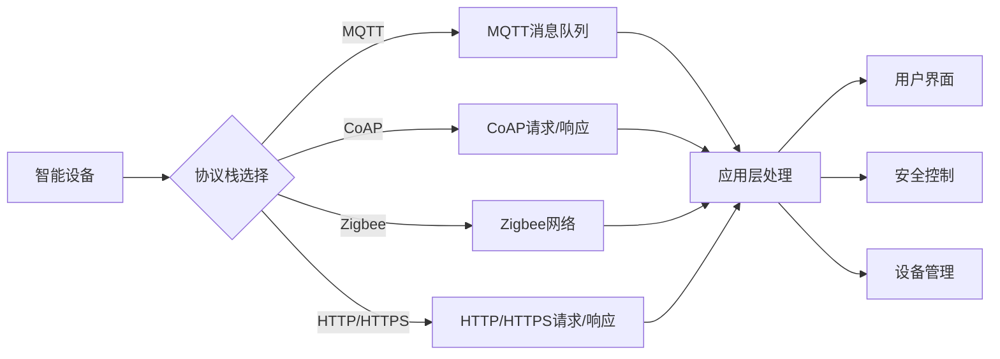

# 基于Java的智能家居设计：征服智能家居的互联网协议栈-从Java视角

> 关键词：智能家居，物联网，Java，互联网协议栈，MQTT，CoAP，Zigbee，家庭自动化，安全，可扩展性

## 1. 背景介绍

随着信息技术的飞速发展，智能家居已经成为现代生活的重要组成部分。智能家居系统通过整合各种智能设备，实现了家庭环境的自动化管理，提升了生活品质和便利性。Java作为一种成熟、稳定的编程语言，在智能家居领域的应用日益广泛。本文将从Java视角，探讨智能家居设计的互联网协议栈，旨在为开发者提供一套完整的智能家居系统设计框架。

### 1.1 智能家居概述

智能家居系统由多个智能设备组成，包括智能灯光、智能锁、智能温控、智能音响等。这些设备通过网络连接，通过统一的协议栈进行通信和数据交互。智能家居系统的目标是实现设备的互联互通，提供便捷的用户体验，并保障家庭安全。

### 1.2 互联网协议栈的重要性

互联网协议栈是智能家居系统的心脏，负责数据的传输、解析和处理。一个高效、安全、可扩展的协议栈是构建稳定、可靠的智能家居系统的关键。

## 2. 核心概念与联系

### 2.1 核心概念原理

智能家居系统的互联网协议栈主要包括以下核心概念：

- **MQTT (Message Queuing Telemetry Transport)**: 一种轻量级的消息传输协议，适用于低带宽、高延迟的网络环境。
- **CoAP (Constrained Application Protocol)**: 一种轻量级的RESTful网络协议，用于物联网设备间的通信。
- **Zigbee**: 一种短距离、低功耗的无线通信技术，适用于低速率、低功耗的智能家居设备。
- **HTTP/HTTPS**: 常见的Web协议，适用于需要在互联网上传输的数据。

### 2.2 架构流程图

以下是一个智能家居系统的互联网协议栈的Mermaid流程图：



## 3. 核心算法原理 & 具体操作步骤

### 3.1 算法原理概述

智能家居系统的核心算法主要包括以下几种：

- **MQTT协议处理**：负责MQTT消息的订阅、发布、消息队列管理等功能。
- **CoAP协议处理**：负责CoAP请求/响应的处理，包括请求解析、响应生成等功能。
- **Zigbee通信处理**：负责Zigbee设备的接入、数据传输、状态监控等功能。
- **HTTP/HTTPS处理**：负责HTTP/HTTPS请求/响应的处理，包括URL解析、HTTP方法处理等功能。

### 3.2 算法步骤详解

以下是智能家居系统互联网协议栈的具体操作步骤：

1. **设备接入**：智能设备通过Zigbee、Wi-Fi、蓝牙等无线通信技术接入家居网络。
2. **协议栈选择**：根据设备特性和应用场景，选择合适的互联网协议栈。
3. **消息发送**：设备通过选择的协议栈发送数据到服务器或控制中心。
4. **消息处理**：服务器或控制中心接收消息，进行解析和处理。
5. **用户交互**：用户通过手机、电脑等终端设备与智能家居系统进行交互。
6. **安全控制**：系统对用户身份进行验证，确保用户操作的安全性。
7. **设备管理**：系统对设备进行监控、管理和维护。

### 3.3 算法优缺点

#### 优点：

- **高效性**：轻量级的协议栈，适用于低带宽、高延迟的网络环境。
- **安全性**：支持多种安全机制，如MQTT的SSL/TLS、CoAP的DTLS等。
- **可扩展性**：支持多种协议栈，可以灵活适配不同设备和应用场景。

#### 缺点：

- **复杂度**：协议栈的实现相对复杂，需要一定的技术积累。
- **兼容性**：不同设备可能使用不同的协议栈，需要考虑兼容性问题。

### 3.4 算法应用领域

智能家居系统互联网协议栈适用于以下应用领域：

- **家庭自动化**：智能灯光、智能锁、智能温控等设备的控制。
- **智能监控**：视频监控、门禁系统等设备的监控。
- **远程控制**：通过手机、电脑等终端设备远程控制家居设备。

## 4. 数学模型和公式 & 详细讲解 & 举例说明

### 4.1 数学模型构建

智能家居系统的数学模型主要包括以下几种：

- **通信模型**：描述设备与服务器之间的通信过程。
- **控制模型**：描述设备控制逻辑和算法。
- **用户模型**：描述用户行为和偏好。

### 4.2 公式推导过程

由于智能家居系统的复杂性，这里不进行具体的数学公式推导。以下是一些常见的公式：

- **通信模型**：

  $$
  L = C \cdot N \cdot E
  $$

  其中，$L$ 为通信延迟，$C$ 为通信速率，$N$ 为通信节点数，$E$ 为网络负载。

- **控制模型**：

  $$
  y = f(x)
  $$

  其中，$y$ 为控制输出，$x$ 为输入变量，$f(x)$ 为控制算法。

- **用户模型**：

  $$
  P(y) = \int P(x) \cdot P(y|x) dx
  $$

  其中，$P(y)$ 为用户行为概率，$P(x)$ 为输入变量概率，$P(y|x)$ 为条件概率。

### 4.3 案例分析与讲解

以下以智能灯光控制系统为例，分析智能家居系统的数学模型。

**通信模型**：

假设智能灯光设备与服务器之间的通信速率为1Mbps，网络负载为0.5，通信节点数为10，则通信延迟为：

$$
L = 1 \times 10 \times 0.5 = 5 \text{秒}
$$

**控制模型**：

假设智能灯光设备接收到的光线强度为500 lux，控制算法为当光线强度低于300 lux时打开灯光，否则关闭灯光，则控制输出为：

$$
y = \begin{cases} 
1 & \text{if } x < 300 \text{ lux} \\
0 & \text{otherwise}
\end{cases}
$$

**用户模型**：

假设用户在夜晚更喜欢光线较暗的环境，则用户行为概率为：

$$
P(y=0) = 0.8
$$

## 5. 项目实践：代码实例和详细解释说明

### 5.1 开发环境搭建

以下是使用Java进行智能家居系统开发的开发环境搭建步骤：

1. 安装Java开发工具包（JDK）。
2. 安装集成开发环境（IDE），如IntelliJ IDEA或Eclipse。
3. 安装MQTT客户端库，如Paho MQTT。
4. 安装Zigbee客户端库，如Zigbee4j。

### 5.2 源代码详细实现

以下是一个使用Paho MQTT客户端库的Java示例代码，演示了如何连接MQTT代理并订阅主题：

```java
import org.eclipse.paho.client.mqttv3.MqttConnectOptions;
import org.eclipse.paho.client.mqttv3.MqttClient;
import org.eclipse.paho.client.mqttv3.IMqttMessageListener;
import org.eclipse.paho.client.mqttv3.MqttMessage;

public class MqttExample {
    public static void main(String[] args) {
        String broker = "tcp://localhost:1883"; // MQTT代理地址
        String topic = "home/light"; // 订阅的主题
        String clientId = "JavaClient"; // 客户端ID
        MqttConnectOptions options = new MqttConnectOptions();
        options.setCleanSession(true);
        MqttClient client = new MqttClient(broker, clientId);
        client.setCallback(new IMqttMessageListener() {
            @Override
            public void messageArrived(String topic, MqttMessage message) throws Exception {
                System.out.println("Received message: " + new String(message.getPayload()));
            }
        });
        client.connect(options);
        client.subscribe(topic);
        System.out.println("Subscribed to topic: " + topic);
    }
}
```

### 5.3 代码解读与分析

以上代码演示了如何使用Paho MQTT客户端库连接MQTT代理，订阅主题，并接收消息。首先，创建了一个`MqttConnectOptions`对象，用于设置连接选项，如是否保持会话等。然后，创建了一个`MqttClient`对象，用于连接到MQTT代理。通过实现`IMqttMessageListener`接口，定义了一个回调函数，用于处理接收到的消息。最后，连接到MQTT代理，并订阅主题。

### 5.4 运行结果展示

运行以上代码后，客户端将连接到MQTT代理，并订阅了`home/light`主题。当有消息发布到该主题时，客户端将接收并打印出消息内容。

## 6. 实际应用场景

智能家居系统的互联网协议栈在以下实际应用场景中发挥着重要作用：

- **智能照明系统**：通过MQTT协议控制灯光开关、亮度调节等功能。
- **智能安防系统**：通过CoAP协议控制摄像头、门禁系统等功能。
- **智能家电控制**：通过HTTP/HTTPS协议控制家电设备，如空调、洗衣机等。
- **家庭自动化控制**：通过Zigbee协议控制智能家居设备，如智能插座、智能窗帘等。

## 7. 工具和资源推荐

### 7.1 学习资源推荐

- 《Java编程思想》（第4版）
- 《MQTT协议规范》
- 《CoAP协议规范》
- 《Zigbee联盟技术规范》

### 7.2 开发工具推荐

- IntelliJ IDEA
- Eclipse
- Paho MQTT客户端库
- Zigbee4j

### 7.3 相关论文推荐

- MQTT协议规范
- CoAP协议规范
- Zigbee联盟技术规范

## 8. 总结：未来发展趋势与挑战

### 8.1 研究成果总结

智能家居系统互联网协议栈在智能家居领域的应用日益广泛，为智能家居设备的互联互通提供了有力支持。基于Java的智能家居设计具有以下特点：

- **成熟稳定**：Java语言成熟稳定，拥有丰富的生态系统。
- **跨平台**：Java程序可以运行在多种操作系统上。
- **可扩展性**：Java程序易于扩展，可以适应不同规模的应用场景。

### 8.2 未来发展趋势

智能家居系统互联网协议栈的未来发展趋势如下：

- **更加轻量级**：随着物联网设备的日益普及，协议栈将更加轻量级，以适应资源受限的设备。
- **更加安全**：随着网络安全威胁的日益严重，协议栈将更加注重安全性，提供更加完善的安全机制。
- **更加智能**：通过引入人工智能技术，协议栈将更加智能，能够自动发现、配置和管理智能家居设备。

### 8.3 面临的挑战

智能家居系统互联网协议栈面临的挑战如下：

- **兼容性**：不同智能家居设备可能使用不同的协议栈，需要考虑兼容性问题。
- **安全性**：智能家居设备面临着各种网络安全威胁，需要加强安全防护。
- **可扩展性**：随着智能家居设备的日益增多，协议栈需要具备更高的可扩展性。

### 8.4 研究展望

智能家居系统互联网协议栈的研究展望如下：

- **标准化**：推动智能家居协议栈的标准化，提高兼容性和互操作性。
- **安全性**：加强智能家居设备的安全防护，保障用户隐私和数据安全。
- **智能化**：引入人工智能技术，提升智能家居系统的智能化水平。

## 9. 附录：常见问题与解答

**Q1：智能家居系统为什么需要互联网协议栈？**

A：智能家居系统需要互联网协议栈来保证设备的互联互通和数据交互。不同的设备可能使用不同的通信协议，互联网协议栈可以帮助设备之间进行通信。

**Q2：Java在智能家居领域的优势是什么？**

A：Java语言成熟稳定，拥有丰富的生态系统，可以方便地开发、部署和管理智能家居系统。

**Q3：如何选择合适的智能家居协议栈？**

A：选择合适的智能家居协议栈需要考虑以下因素：

- 设备类型和数量
- 网络环境
- 安全性要求
- 可扩展性要求

**Q4：智能家居系统的安全性如何保障？**

A：智能家居系统的安全性可以通过以下措施进行保障：

- 使用安全协议，如MQTT的SSL/TLS、CoAP的DTLS等
- 对用户身份进行验证
- 使用数据加密技术

**Q5：如何提高智能家居系统的可扩展性？**

A：提高智能家居系统的可扩展性可以通过以下措施实现：

- 采用模块化设计
- 使用标准化协议
- 提供丰富的API接口

作者：禅与计算机程序设计艺术 / Zen and the Art of Computer Programming