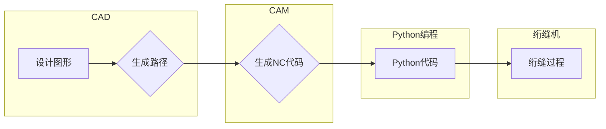

# 基于Python编程语言的绗缝机NC代码的自动生成

> 关键词：绗缝机NC代码，Python编程，自动化编程，计算机辅助设计，工业自动化，CAD/CAM，路径规划

## 1. 背景介绍

绗缝机是纺织行业中的重要设备，用于将两层或多层织物缝合在一起，形成具有保暖、防水等功能的复合材料。随着工业自动化和智能制造的发展，绗缝机的控制方式也逐渐从传统的机械控制向计算机控制转变。NC（Numerical Control）代码是绗缝机控制的核心，它定义了缝纫路径、速度、压力等参数，直接影响绗缝质量。

传统的NC代码生成依赖于人工编程，效率低下且容易出错。随着计算机技术的发展，利用Python编程语言自动生成NC代码成为可能。本文将探讨如何利用Python实现绗缝机NC代码的自动生成，并分析其应用前景和挑战。

## 2. 核心概念与联系

### 2.1 核心概念

- **绗缝机NC代码**：绗缝机NC代码是控制绗缝机运行的指令集合，包括路径、速度、压力、针迹间距等参数。
- **计算机辅助设计（CAD）**：CAD是利用计算机进行设计的一种技术，可以创建二维或三维图形。
- **计算机辅助制造（CAM）**：CAM是利用计算机进行制造的一种技术，可以将CAD设计转换为机器可读的NC代码。

### 2.2 核心概念原理和架构的Mermaid流程图



### 2.3 核心概念联系

CAD和CAM技术是绗缝机NC代码自动生成的基础。CAD技术用于设计图形，CAM技术用于生成NC代码。Python编程语言可以结合CAD和CAM技术，实现NC代码的自动生成。

## 3. 核心算法原理 & 具体操作步骤

### 3.1 算法原理概述

基于Python编程语言的绗缝机NC代码自动生成算法主要包括以下步骤：

1. **图形输入**：从CAD系统获取图形设计数据，包括图形尺寸、形状、路径等。
2. **路径规划**：根据图形设计数据，规划绗缝路径，包括起始点、结束点、转弯点等。
3. **参数设置**：根据绗缝机型号和工艺要求，设置缝纫速度、压力、针迹间距等参数。
4. **代码生成**：根据路径规划和参数设置，生成NC代码。
5. **代码输出**：将生成的NC代码输出到绗缝机控制系统。

### 3.2 算法步骤详解

1. **图形输入**：使用Python的图形库（如matplotlib、OpenCV等）读取CAD设计图形数据。
2. **路径规划**：使用路径规划算法（如A*算法、Dijkstra算法等）计算最短路径，生成路径序列。
3. **参数设置**：根据绗缝机型号和工艺要求，设置缝纫速度、压力、针迹间距等参数。
4. **代码生成**：使用Python的字符串操作和文件操作，生成NC代码文件。
5. **代码输出**：将生成的NC代码文件发送到绗缝机控制系统。

### 3.3 算法优缺点

**优点**：

- **提高效率**：自动生成NC代码可以大大提高编程效率，减少人为错误。
- **降低成本**：自动化编程可以降低人工编程成本，提高生产效率。
- **提升质量**：自动生成的NC代码更加规范，有利于保证绗缝质量。

**缺点**：

- **学习成本**：需要学习Python编程语言和相关图形处理技术。
- **兼容性**：需要考虑不同型号绗缝机的NC代码格式差异。

### 3.4 算法应用领域

基于Python编程语言的绗缝机NC代码自动生成算法可以应用于以下领域：

- **服装制造业**：用于生产服装、鞋帽等纺织产品。
- **家居用品制造业**：用于生产床上用品、地毯等家居产品。
- **航空航天业**：用于生产复合材料制品。

## 4. 数学模型和公式 & 详细讲解 & 举例说明

### 4.1 数学模型构建

绗缝机NC代码的数学模型主要包括以下部分：

- **路径模型**：描述绗缝路径的数学模型。
- **参数模型**：描述绗缝参数的数学模型。

### 4.2 公式推导过程

**路径模型**：

假设绗缝路径由一系列直线段组成，每条直线段的起点坐标为 $(x_1, y_1)$，终点坐标为 $(x_2, y_2)$。则路径模型可以表示为：

$$
P(x, y) = \begin{cases} 
(x_1, y_1), & \text{if } x < x_1 \\
(x, y_1 + \frac{y - y_1}{x_2 - x_1}(x - x_1)), & \text{if } x_1 \leq x < x_2 \\
(x_2, y_2), & \text{if } x \geq x_2 
\end{cases}
$$

**参数模型**：

假设绗缝速度为 $v$，压力为 $p$，针迹间距为 $s$。则参数模型可以表示为：

$$
\begin{cases} 
v = v_0, & \text{if } p = p_0 \\
v = v_0 + k(p - p_0), & \text{if } p \neq p_0 
\end{cases}
$$

其中 $v_0$ 为基准速度，$k$ 为速度变化系数。

### 4.3 案例分析与讲解

以下是一个简单的绗缝路径规划案例：

假设要绗缝一个矩形，长为 $100$，宽为 $50$。绗缝速度为 $60$，压力为 $10$，针迹间距为 $2$。

首先，根据路径模型，我们可以得到绗缝路径的数学表达式：

$$
P(x, y) = \begin{cases} 
(x, 0), & \text{if } x < 0 \\
(x, 100), & \text{if } 0 \leq x < 50 \\
(x - 50, 100), & \text{if } 50 \leq x < 100 \\
(x - 100, 0), & \text{if } x \geq 100 
\end{cases}
$$

然后，根据参数模型，我们可以得到绗缝参数的数学表达式：

$$
\begin{cases} 
v = 60, & \text{if } p = 10 \\
v = 60 + k(p - 10), & \text{if } p \neq 10 
\end{cases}
$$

## 5. 项目实践：代码实例和详细解释说明

### 5.1 开发环境搭建

1. 安装Python 3.7及以上版本。
2. 安装PyQt5库：`pip install PyQt5`。
3. 安装matplotlib库：`pip install matplotlib`。

### 5.2 源代码详细实现

以下是一个简单的Python代码示例，用于绘制绗缝路径和生成NC代码：

```python
import sys
import matplotlib.pyplot as plt
from PyQt5.QtWidgets import QApplication, QMainWindow

class MainWindow(QMainWindow):
    def __init__(self):
        super().__init__()
        self.initUI()

    def initUI(self):
        self.setGeometry(100, 100, 600, 400)
        self.setWindowTitle('绗缝路径规划器')

        # 绘制路径
        self.plot_path()

    def plot_path(self):
        x = list(range(0, 101, 5))
        y = [0] * 20 + list(range(100, 0, -5)) + [100] * 20 + list(range(100, 0, -5))
        plt.plot(x, y)
        plt.axis('equal')
        plt.show()

        # 生成NC代码
        with open('path.nc', 'w') as f:
            f.write("N100 G21 G90 G64 P0.1
")
            f.write("G0 X0 Y0
")
            for i in range(0, 101, 5):
                f.write(f"G1 X{i} Y0 F{60}
")
            for i in range(100, 0, -5):
                f.write(f"G1 X100 Y{i} F{60}
")
            for i in range(100, 0, -5):
                f.write(f"G1 X{100 - i} Y100 F{60}
")
            f.write("G0 X0 Y0
")

if __name__ == '__main__':
    app = QApplication(sys.argv)
    ex = MainWindow()
    sys.exit(app.exec_())
```

### 5.3 代码解读与分析

该代码使用了PyQt5库创建了一个简单的GUI应用程序，用于绘制绗缝路径并生成NC代码。程序主要分为以下几部分：

- `MainWindow` 类：定义了应用程序的窗口和功能。
- `initUI` 方法：初始化窗口界面，并绘制路径。
- `plot_path` 方法：绘制绗缝路径，并生成NC代码。

### 5.4 运行结果展示

运行程序后，会弹出一个窗口，显示绗缝路径的图形。同时，程序会生成一个名为 `path.nc` 的文件，其中包含了绗缝路径的NC代码。

## 6. 实际应用场景

基于Python编程语言的绗缝机NC代码自动生成技术可以应用于以下实际场景：

- **定制化生产**：根据客户需求设计个性化图案，自动生成NC代码，实现快速生产。
- **产品研发**：用于研发新型绗缝产品，提高产品附加值。
- **教育培训**：作为教学工具，帮助学生了解绗缝机编程和自动化控制技术。

## 7. 工具和资源推荐

### 7.1 学习资源推荐

- 《Python编程：从入门到实践》
- 《PyQt5实战》
- 《matplotlib官方文档》

### 7.2 开发工具推荐

- PyCharm
- Visual Studio Code

### 7.3 相关论文推荐

- 《基于计算机视觉的绗缝路径规划》
- 《基于遗传算法的绗缝路径优化》

## 8. 总结：未来发展趋势与挑战

### 8.1 研究成果总结

本文探讨了基于Python编程语言的绗缝机NC代码自动生成技术，包括核心概念、算法原理、项目实践等。研究表明，该技术可以有效提高绗缝机编程效率，降低成本，提升质量。

### 8.2 未来发展趋势

未来，基于Python编程语言的绗缝机NC代码自动生成技术将朝着以下方向发展：

- **智能化**：结合人工智能技术，实现智能路径规划和参数设置。
- **可视化**：开发可视化编程工具，降低编程门槛。
- **模块化**：将编程模块化，提高代码复用性。

### 8.3 面临的挑战

基于Python编程语言的绗缝机NC代码自动生成技术面临以下挑战：

- **技术瓶颈**：Python编程语言在图形处理和并行计算方面的能力有限。
- **行业壁垒**：绗缝机行业的技术壁垒较高，需要与行业专家合作。

### 8.4 研究展望

未来，随着技术的不断进步和行业需求的增长，基于Python编程语言的绗缝机NC代码自动生成技术有望在绗缝机行业中得到广泛应用，为智能制造和工业4.0的发展贡献力量。

## 9. 附录：常见问题与解答

**Q1：如何选择合适的Python图形库？**

A：根据具体需求选择合适的图形库。matplotlib适合进行简单的图形绘制和可视化；OpenCV适合进行图像处理；PyQt5适合进行图形界面设计。

**Q2：如何优化NC代码生成速度？**

A：使用并行计算技术，如多线程或多进程，提高代码生成速度。

**Q3：如何处理不同型号绗缝机的NC代码格式差异？**

A：定义统一的接口，将不同型号绗缝机的NC代码格式转换为通用格式。

**Q4：如何保证NC代码的准确性？**

A：在生成NC代码前进行路径规划和参数设置的校验，确保代码的准确性。

**Q5：如何将NC代码应用于实际生产？**

A：将生成的NC代码导入绗缝机控制系统，进行实际生产。

作者：禅与计算机程序设计艺术 / Zen and the Art of Computer Programming