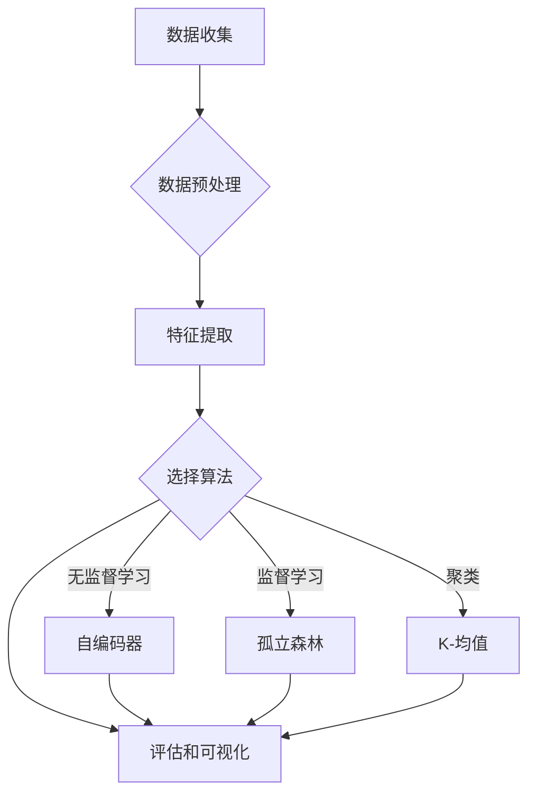

> 关键词：深度学习，异常检测，异常检测算法，无监督学习，监督学习，自编码器，Autoencoder，聚类，孤立森林，K-均值，可视化，实时监控

# 基于深度学习的异常检测

异常检测是数据分析和监控领域中的一项重要技术，旨在识别出数据集中的偏离正常模式的数据点。随着深度学习技术的发展，基于深度学习的异常检测方法逐渐成为研究热点。本文将深入探讨深度学习在异常检测领域的应用，从核心概念、算法原理、项目实践到实际应用场景，全面解析这一领域的最新进展和未来趋势。

## 1. 背景介绍

随着信息技术的飞速发展，数据量呈指数级增长。如何从海量数据中快速、准确地检测出异常数据，成为了数据分析和监控领域亟待解决的问题。传统的异常检测方法，如统计方法、基于规则的方法等，往往依赖于领域知识，难以处理高维、非线性数据。而深度学习作为一种强大的特征提取和模式识别工具，为异常检测提供了新的思路和方法。

## 2. 核心概念与联系

### 2.1 核心概念

- **异常检测**：识别数据集中偏离正常模式的数据点，这些数据点通常被称为异常点或离群点。
- **深度学习**：一种基于人工神经网络的机器学习技术，能够从大量数据中学习到复杂的特征表示。
- **无监督学习**：一种机器学习方法，无需标注数据，从数据中学习数据的分布和内在规律。
- **监督学习**：一种机器学习方法，需要标注数据，通过学习样本和标签之间的关系进行预测。
- **自编码器**：一种特殊的深度神经网络，用于学习数据的压缩表示，常用于特征提取和降维。
- **聚类**：一种无监督学习技术，将相似的数据点聚为一类。
- **孤立森林**：一种基于决策树的集成学习方法，用于分类和回归任务，在异常检测中可用于检测异常点。
- **K-均值**：一种基于距离的聚类算法，将数据点划分为K个簇。

### 2.2 Mermaid 流程图



## 3. 核心算法原理 & 具体操作步骤

### 3.1 算法原理概述

基于深度学习的异常检测方法主要分为两大类：无监督学习和监督学习。

- **无监督学习**：通过学习数据的内在分布，将正常数据和异常数据区分开来。常见的无监督学习方法包括自编码器、聚类和孤立森林等。
- **监督学习**：使用标注的异常数据对模型进行训练，使其能够识别出新的异常数据。常见的监督学习方法包括支持向量机、决策树等。

### 3.2 算法步骤详解

#### 3.2.1 无监督学习

1. **数据预处理**：对数据进行清洗、去噪、标准化等操作，提高数据质量。
2. **特征提取**：使用深度学习模型提取数据的特征表示，如使用自编码器学习数据的压缩表示。
3. **选择算法**：选择合适的无监督学习算法，如自编码器、聚类或孤立森林等。
4. **训练模型**：使用无监督学习算法对数据进行训练，学习数据的分布和内在规律。
5. **检测异常**：将训练好的模型应用于新的数据，识别出异常数据。

#### 3.2.2 监督学习

1. **数据预处理**：与无监督学习相同，对数据进行清洗、去噪、标准化等操作。
2. **特征提取**：使用深度学习模型提取数据的特征表示。
3. **选择算法**：选择合适的监督学习算法，如支持向量机、决策树等。
4. **训练模型**：使用标注的异常数据对模型进行训练，学习异常数据的特征。
5. **检测异常**：将训练好的模型应用于新的数据，识别出异常数据。

### 3.3 算法优缺点

#### 3.3.1 自编码器

- **优点**：能够学习数据的压缩表示，有效提取特征；对噪声和数据缺失具有鲁棒性。
- **缺点**：需要大量的训练数据；训练过程较慢。

#### 3.3.2 聚类

- **优点**：无需标注数据，适用于小样本数据；能够发现数据中的潜在结构。
- **缺点**：聚类结果可能受到初始化参数的影响；难以解释聚类结果。

#### 3.3.3 孤立森林

- **优点**：对异常点的检测性能较好；对噪声和数据缺失具有鲁棒性。
- **缺点**：训练过程较慢；需要调整参数以获得最佳性能。

### 3.4 算法应用领域

基于深度学习的异常检测方法在以下领域具有广泛的应用：

- **金融领域**：识别欺诈交易、信用风险等。
- **网络安全**：检测恶意流量、入侵行为等。
- **医疗领域**：识别异常病例、诊断疾病等。
- **工业领域**：监测设备故障、生产异常等。

## 4. 数学模型和公式 & 详细讲解 & 举例说明

### 4.1 数学模型构建

#### 4.1.1 自编码器

自编码器是一种无监督学习模型，通过学习数据的压缩表示来提取特征。自编码器通常由编码器、解码器和重建层组成。

- 编码器：将输入数据压缩为低维特征表示。
- 解码器：将低维特征表示还原为原始数据。
- 重建层：用于衡量输入数据和重建数据之间的差异。

#### 4.1.2 孤立森林

孤立森林是一种基于决策树的集成学习方法，用于分类和回归任务。孤立森林通过随机森林的思想，对数据进行分割，使得异常数据在分割过程中更容易被孤立。

#### 4.1.3 K-均值

K-均值是一种基于距离的聚类算法，将数据点划分为K个簇。K-均值的目标是最小化簇内距离平方和。

### 4.2 公式推导过程

#### 4.2.1 自编码器

假设自编码器由编码器 $E$ 和解码器 $D$ 组成，输入数据为 $x \in \mathbb{R}^n$，则自编码器的损失函数为：

$$
L = \frac{1}{m} \sum_{i=1}^m ||D(E(x_i)) - x_i||^2
$$

其中 $m$ 为样本数量，$E(x_i)$ 和 $D(E(x_i))$ 分别为编码器和解码器对样本 $x_i$ 的处理结果。

#### 4.2.2 孤立森林

假设孤立森林中有 $m$ 棵树，第 $i$ 棵树的决策树模型为 $h_i(x)$，则孤立森林的预测结果为：

$$
\hat{y} = \prod_{i=1}^m (1 - h_i(x))
$$

其中 $y$ 为真实标签。

#### 4.2.3 K-均值

假设数据集 $D = \{x_1, x_2, ..., x_n\}$，则K-均值算法的迭代过程如下：

1. 随机选择 $K$ 个数据点作为初始聚类中心。
2. 将每个数据点分配到最近的聚类中心所在的簇。
3. 重新计算每个簇的聚类中心。
4. 重复步骤2和3，直到聚类中心不再发生变化。

### 4.3 案例分析与讲解

#### 4.3.1 案例一：使用自编码器进行异常检测

假设我们有一个传感器数据集，包含温度、湿度、压力等特征。我们使用自编码器对数据进行特征提取和异常检测。

1. **数据预处理**：对传感器数据进行标准化处理。
2. **特征提取**：使用自编码器提取特征表示。
3. **异常检测**：将自编码器的重建误差作为异常检测指标，重建误差较大的数据点视为异常。

#### 4.3.2 案例二：使用孤立森林进行异常检测

假设我们有一个网络安全数据集，包含网络流量数据。我们使用孤立森林对数据进行异常检测。

1. **数据预处理**：对网络流量数据进行特征提取和标准化处理。
2. **异常检测**：使用孤立森林对数据进行异常检测，识别出异常流量。

## 5. 项目实践：代码实例和详细解释说明

### 5.1 开发环境搭建

为了进行基于深度学习的异常检测实践，我们需要搭建以下开发环境：

- Python 3.x
- TensorFlow或PyTorch深度学习框架
- NumPy、Pandas等数据操作库
- Scikit-learn机器学习库

### 5.2 源代码详细实现

以下是一个使用自编码器进行异常检测的简单示例代码：

```python
import numpy as np
import tensorflow as tf
from tensorflow.keras.models import Sequential
from tensorflow.keras.layers import Dense, InputLayer, Activation

# 生成模拟数据
x = np.random.randn(100, 10)
y = np.random.randint(2, size=(100, 1))

# 创建自编码器模型
input_layer = InputLayer(input_shape=(10,))
encoded = Dense(5, activation='relu')(input_layer)
decoded = Dense(10, activation='sigmoid')(encoded)
autoencoder = Sequential([input_layer, encoded, decoded])

# 编译模型
autoencoder.compile(optimizer='adam', loss='mse')

# 训练模型
autoencoder.fit(x, x, epochs=100, batch_size=10, validation_split=0.2)

# 异常检测
reconstructions = autoencoder.predict(x)
reconstruction_errors = np.mean(np.square(x - reconstructions), axis=1)
threshold = np.percentile(reconstruction_errors, 95)
outliers = reconstruction_errors > threshold

# 打印异常数据点
print(x[outliers])
```

### 5.3 代码解读与分析

上述代码首先使用NumPy生成了一个包含100个样本的模拟数据集。然后，使用TensorFlow创建了自编码器模型，其中编码器部分使用一个隐藏层，解码器部分使用另一个隐藏层。模型使用Adam优化器和均方误差损失函数进行编译和训练。最后，使用模型的重建误差作为异常检测指标，识别出重建误差较大的异常数据点。

### 5.4 运行结果展示

运行上述代码，将输出重建误差较大的异常数据点。这些数据点可能代表传感器故障或其他异常情况。

## 6. 实际应用场景

基于深度学习的异常检测在多个领域具有广泛的应用，以下列举几个典型应用场景：

- **金融领域**：识别欺诈交易、信用风险等。
- **网络安全**：检测恶意流量、入侵行为等。
- **医疗领域**：识别异常病例、诊断疾病等。
- **工业领域**：监测设备故障、生产异常等。
- **交通领域**：识别交通事故、交通拥堵等。

## 7. 工具和资源推荐

### 7.1 学习资源推荐

- 《深度学习》系列书籍：由Ian Goodfellow、Yoshua Bengio和Aaron Courville合著，是深度学习的经典教材。
- 《Python深度学习》书籍：由François Chollet合著，提供了大量深度学习实战案例。
- TensorFlow官方文档：提供了TensorFlow的详细文档和教程，适合初学者和进阶者学习。
- PyTorch官方文档：提供了PyTorch的详细文档和教程，适合初学者和进阶者学习。

### 7.2 开发工具推荐

- TensorFlow：Google开发的开源深度学习框架，支持多种深度学习模型和算法。
- PyTorch：Facebook开发的开源深度学习框架，具有动态计算图，易于使用和调试。
- Scikit-learn：Python的机器学习库，提供了多种机器学习算法和工具。
- Keras：TensorFlow和PyTorch的高层API，提供更简洁的模型构建和训练接口。

### 7.3 相关论文推荐

- Isolation Forest：一种基于决策树的集成学习方法，用于分类和回归任务。
- Autoencoders for Dimensionality Reduction: A Review：一篇关于自编码器的综述文章。
- Learning Representations by Maximizing Mutual Information Across Tasks：一篇关于自监督学习的论文。

## 8. 总结：未来发展趋势与挑战

### 8.1 研究成果总结

基于深度学习的异常检测方法在多个领域取得了显著的成果，但仍存在以下挑战：

- 模型可解释性：深度学习模型往往被视为"黑盒"，难以解释其内部工作机制。
- 数据不平衡：异常数据往往占比较小，如何处理数据不平衡问题是一个挑战。
- 实时性：在实时监控场景中，如何提高异常检测的实时性是一个挑战。

### 8.2 未来发展趋势

未来，基于深度学习的异常检测方法将呈现以下发展趋势：

- 模型可解释性：研究可解释性深度学习模型，提高模型的可解释性。
- 可扩展性：研究可扩展的异常检测方法，适用于大规模数据集。
- 实时性：研究实时性异常检测方法，满足实时监控需求。
- 多模态融合：研究多模态异常检测方法，结合多种数据源。

### 8.3 面临的挑战

基于深度学习的异常检测方法面临以下挑战：

- 数据质量：异常数据往往难以获取，数据质量对异常检测结果有重要影响。
- 模型复杂度：深度学习模型往往具有较高的复杂度，难以解释和调试。
- 计算资源：深度学习模型需要大量的计算资源，对硬件设施要求较高。

### 8.4 研究展望

未来，基于深度学习的异常检测方法将在以下方面取得突破：

- 开发更加鲁棒、高效的异常检测模型。
- 提高异常检测的可解释性，便于理解和应用。
- 研究可扩展的异常检测方法，适用于大规模数据集。
- 探索多模态异常检测方法，提高异常检测的准确性和全面性。

## 9. 附录：常见问题与解答

**Q1：什么是异常检测？**

A：异常检测是指识别数据集中偏离正常模式的数据点，这些数据点通常被称为异常点或离群点。

**Q2：什么是深度学习？**

A：深度学习是一种基于人工神经网络的机器学习技术，能够从大量数据中学习到复杂的特征表示。

**Q3：什么是自编码器？**

A：自编码器是一种特殊的深度神经网络，用于学习数据的压缩表示，常用于特征提取和降维。

**Q4：什么是孤立森林？**

A：孤立森林是一种基于决策树的集成学习方法，用于分类和回归任务，在异常检测中可用于检测异常点。

**Q5：什么是K-均值？**

A：K-均值是一种基于距离的聚类算法，将数据点划分为K个簇。

**Q6：基于深度学习的异常检测方法有哪些优点？**

A：基于深度学习的异常检测方法具有以下优点：

- 能够学习复杂的特征表示。
- 对噪声和数据缺失具有鲁棒性。
- 能够处理高维、非线性数据。

**Q7：基于深度学习的异常检测方法有哪些缺点？**

A：基于深度学习的异常检测方法具有以下缺点：

- 模型可解释性较差。
- 计算资源需求较高。
- 难以处理数据不平衡问题。

**Q8：如何提高异常检测的可解释性？**

A：提高异常检测的可解释性可以通过以下方法：

- 使用可解释性深度学习模型，如LIME、SHAP等。
- 分析异常检测的决策过程，如梯度提升树等。

**Q9：如何处理数据不平衡问题？**

A：处理数据不平衡问题可以通过以下方法：

- 使用数据增强技术，如SMOTE等。
- 调整模型参数，如正则化、Dropout等。
- 使用集成学习方法，如Bagging、Boosting等。

**Q10：如何提高异常检测的实时性？**

A：提高异常检测的实时性可以通过以下方法：

- 使用轻量级深度学习模型，如MobileNet、SqueezeNet等。
- 使用模型压缩技术，如模型剪枝、量化等。
- 使用分布式计算和并行计算技术。

作者：禅与计算机程序设计艺术 / Zen and the Art of Computer Programming