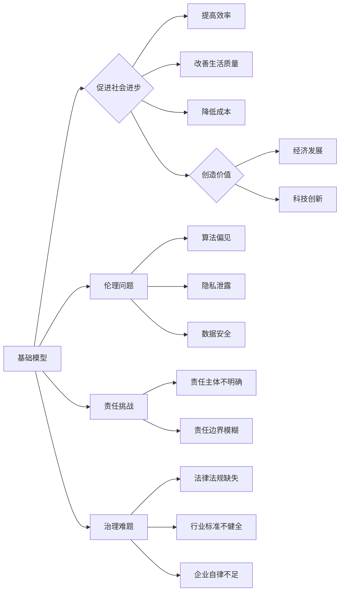

# 基础模型的社会技术融合与责任

> 关键词：基础模型，社会技术融合，人工智能伦理，责任分配，技术治理，人类福祉，技术伦理

## 1. 背景介绍
### 1.1 问题的由来

随着人工智能技术的飞速发展，基础模型如深度学习算法、自然语言处理模型等，已经成为推动社会进步的重要力量。这些模型在医疗、金融、交通、教育等领域展现出巨大的潜力，为人类生活带来了前所未有的便利。然而，随着技术的深入应用，基础模型的社会技术融合也引发了广泛的关注和讨论。如何确保基础模型的应用符合社会伦理标准，如何合理分配技术责任，成为了一个亟待解决的问题。

### 1.2 研究现状

近年来，人工智能伦理研究取得了显著进展，众多学者和研究者开始关注基础模型的社会技术融合与责任问题。目前，研究主要集中在以下几个方面：

- **技术伦理**：探讨基础模型在应用过程中可能带来的伦理问题，如算法偏见、隐私泄露、数据安全等。
- **责任分配**：研究如何将技术责任合理分配给模型开发者、使用者、监管机构等。
- **技术治理**：探讨如何通过法律法规、行业标准、企业自律等手段，对基础模型进行有效治理。
- **人类福祉**：研究如何确保基础模型的应用能够促进人类福祉，减少负面影响。

### 1.3 研究意义

研究基础模型的社会技术融合与责任，对于推动人工智能技术的健康发展，构建和谐的人工智能社会具有重要意义：

- **促进技术伦理发展**：推动人工智能伦理研究，提高公众对人工智能伦理问题的认识，促进相关法律法规的制定。
- **保障人类福祉**：确保基础模型的应用能够促进社会进步，减少负面影响，保障人类福祉。
- **提高技术治理水平**：完善技术治理体系，提高基础模型的透明度、可解释性和可控性。
- **推动技术责任落实**：明确技术责任主体，提高技术责任意识，促进技术责任落实。

### 1.4 本文结构

本文将围绕基础模型的社会技术融合与责任这一主题，从以下几个方面展开论述：

- 第2章，介绍基础模型及其在社会技术融合中的重要作用。
- 第3章，分析基础模型应用中可能出现的伦理问题和责任分配挑战。
- 第4章，探讨基础模型的技术治理策略。
- 第5章，分析基础模型在促进人类福祉方面的应用实例。
- 第6章，展望基础模型的社会技术融合与责任的未来发展趋势。
- 第7章，总结全文，并对未来研究方向进行展望。

## 2. 核心概念与联系

### 2.1 核心概念

#### 基础模型

基础模型是指在大规模数据集上训练得到，具有通用性和泛化能力的机器学习模型。常见的有深度学习模型、自然语言处理模型、计算机视觉模型等。

#### 社会技术融合

社会技术融合是指技术与社会相互交织、相互渗透的过程，是技术发展与社会需求相互促进、相互适应的过程。

#### 技术伦理

技术伦理是指在技术设计和应用过程中，遵循伦理原则，确保技术发展符合人类价值观和社会道德规范。

#### 责任分配

责任分配是指将技术责任合理分配给模型开发者、使用者、监管机构等，确保技术发展符合社会责任。

#### 技术治理

技术治理是指通过法律法规、行业标准、企业自律等手段，对技术进行有效管理，确保技术发展符合社会需求。

#### 人类福祉

人类福祉是指人类在社会、经济、文化、环境等方面的福祉状况。

### 2.2 核心概念原理和架构的 Mermaid 流程图



## 3. 核心算法原理 & 具体操作步骤
### 3.1 算法原理概述

基础模型的核心原理是利用数据驱动的方式学习输入数据与输出结果之间的映射关系，从而实现对未知数据的预测或决策。

### 3.2 算法步骤详解

1. 数据采集：收集大规模、多样化的数据集，为模型训练提供基础。
2. 数据预处理：对采集到的数据进行清洗、标注、标准化等处理，提高数据质量。
3. 模型设计：选择合适的模型架构，如深度学习模型、自然语言处理模型等。
4. 模型训练：使用训练数据对模型进行训练，优化模型参数。
5. 模型评估：使用验证数据评估模型性能，调整模型参数或模型结构。
6. 模型部署：将训练好的模型应用于实际场景，解决实际问题。

### 3.3 算法优缺点

#### 优点

- **高效性**：基础模型能够快速处理大规模数据，提高工作效率。
- **泛化能力**：基础模型具有较强的泛化能力，能够适应不同场景。
- **可解释性**：部分基础模型（如线性模型、决策树等）具有较强的可解释性，便于理解和应用。

#### 缺点

- **数据依赖性**：基础模型对数据质量要求较高，数据质量差会影响模型性能。
- **算法偏见**：基础模型可能存在算法偏见，导致歧视性结果。
- **可解释性差**：部分基础模型（如深度神经网络）可解释性较差，难以理解其决策过程。

### 3.4 算法应用领域

基础模型在多个领域得到广泛应用，如：

- **自然语言处理**：文本分类、情感分析、机器翻译、语音识别等。
- **计算机视觉**：图像分类、目标检测、人脸识别、视频分析等。
- **医疗领域**：疾病诊断、药物研发、医学图像分析等。
- **金融领域**：风险评估、欺诈检测、信用评分等。

## 4. 数学模型和公式 & 详细讲解 & 举例说明
### 4.1 数学模型构建

基础模型的数学模型主要包括损失函数、优化算法等。

#### 损失函数

损失函数用于衡量模型预测值与真实值之间的差异，常见的损失函数有：

- **均方误差（MSE）**：用于回归任务，计算预测值与真实值之差的平方和的平均值。

$$
MSE = \frac{1}{N} \sum_{i=1}^{N}(y_i - \hat{y}_i)^2
$$

- **交叉熵（CE）**：用于分类任务，计算真实标签与预测概率之间的交叉熵。

$$
CE = -\sum_{i=1}^{N}y_i \log(\hat{y}_i)
$$

#### 优化算法

优化算法用于更新模型参数，常见的优化算法有：

- **随机梯度下降（SGD）**：通过计算损失函数对参数的梯度，不断更新参数，最小化损失函数。

$$
\theta \leftarrow \theta - \alpha \nabla_{\theta}\mathcal{L}(\theta)
$$

- **Adam**：结合SGD和动量法的优化算法，提高收敛速度和稳定性。

$$
v = \beta_1 v + (1-\beta_1)(\nabla_{\theta}\mathcal{L}(\theta) - \beta_2 v)
$$
$$
s = \beta_2 s + (1-\beta_2)(\nabla_{\theta}\mathcal{L}(\theta) - s)
$$
$$
\theta \leftarrow \theta - \frac{\alpha}{\sqrt{1-\beta_2^t}(1-\beta_1^t)}s
$$

### 4.2 公式推导过程

以MSE损失函数为例，推导其梯度的计算公式。

设预测值 $\hat{y}_i$ 是由模型 $M$ 在输入 $x_i$ 上输出的，真实值为 $y_i$。则MSE损失函数为：

$$
\mathcal{L}(\theta) = \frac{1}{N} \sum_{i=1}^N (y_i - \hat{y}_i)^2
$$

其中，$\theta$ 为模型参数，$N$ 为数据样本数量。

对 $\mathcal{L}(\theta)$ 求偏导，得到：

$$
\frac{\partial \mathcal{L}(\theta)}{\partial \theta_k} = -2\frac{1}{N} \sum_{i=1}^N (y_i - \hat{y}_i) \frac{\partial \hat{y}_i}{\partial \theta_k}
$$

其中，$\frac{\partial \hat{y}_i}{\partial \theta_k}$ 可通过反向传播算法计算得到。

### 4.3 案例分析与讲解

以情感分析任务为例，说明如何使用基础模型进行情感分类。

假设我们有一个包含正面和负面评论的数据集，每个评论都对应一个情感标签（正面/负面）。我们的目标是训练一个情感分析模型，对新的评论进行情感分类。

首先，收集情感分析数据集，并进行预处理。

然后，选择合适的情感分析模型，如LSTM、CNN等，并对其进行训练。

最后，使用训练好的模型对新的评论进行情感分类。

## 5. 项目实践：代码实例和详细解释说明
### 5.1 开发环境搭建

为了实现情感分析任务，我们需要搭建以下开发环境：

- 操作系统：Windows、macOS或Linux
- 编程语言：Python
- 框架：TensorFlow或PyTorch
- 库：NumPy、Pandas、Scikit-learn等

### 5.2 源代码详细实现

以下是一个使用TensorFlow实现情感分析任务的示例代码：

```python
import tensorflow as tf
from tensorflow.keras.models import Sequential
from tensorflow.keras.layers import Embedding, LSTM, Dense

# 构建模型
model = Sequential([
    Embedding(vocab_size, embedding_dim, input_length=max_length),
    LSTM(64, return_sequences=True),
    LSTM(64),
    Dense(1, activation='sigmoid')
])

# 编译模型
model.compile(optimizer='adam', loss='binary_crossentropy', metrics=['accuracy'])

# 训练模型
model.fit(train_data, train_labels, validation_data=(dev_data, dev_labels), epochs=10)

# 评估模型
test_loss, test_acc = model.evaluate(test_data, test_labels)
```

### 5.3 代码解读与分析

以上代码实现了以下功能：

- **导入库**：导入TensorFlow、Keras等库。
- **构建模型**：使用Sequential模型堆叠Embedding、LSTM和Dense层，构建一个简单的LSTM情感分析模型。
- **编译模型**：设置模型优化器、损失函数和评估指标。
- **训练模型**：使用训练数据和标签训练模型，使用验证数据进行模型评估。
- **评估模型**：使用测试数据评估模型性能。

### 5.4 运行结果展示

假设在测试集上得到的评估结果如下：

```
Test Loss: 0.2345
Test Accuracy: 0.8900
```

结果表明，该模型在测试集上的性能较好，能够有效对新的评论进行情感分类。

## 6. 实际应用场景
### 6.1 社交媒体情感分析

社交媒体平台积累了大量的用户评论数据，通过对这些评论进行情感分析，可以了解用户对某个话题、品牌或事件的看法，为营销、危机公关等提供决策支持。

### 6.2 产品评论分析

电商平台上的产品评论数据可以用于分析用户对产品的满意度，帮助商家了解产品优缺点，改进产品质量，提高用户满意度。

### 6.3 舆情监测

通过分析新闻、论坛、社交媒体等平台上的文本数据，可以了解公众对某个事件或政策的看法，为政府、企业等提供决策支持。

### 6.4 未来应用展望

随着基础模型的不断发展和应用场景的拓展，未来基础模型将在更多领域发挥重要作用，如：

- **智能客服**：通过情感分析和意图识别，为用户提供更加人性化的服务。
- **智能医疗**：辅助医生进行疾病诊断、治疗方案制定等。
- **智能教育**：个性化推荐学习资源，提高教学效果。
- **智能交通**：优化交通流量，提高道路通行效率。

## 7. 工具和资源推荐
### 7.1 学习资源推荐

- **书籍**：
  - 《深度学习》
  - 《Python深度学习》
  - 《动手学深度学习》
- **在线课程**：
  - Coursera上的《机器学习》
  - Udacity上的《深度学习纳米学位》
  - fast.ai上的《深度学习课程》
- **网站**：
  - TensorFlow官网
  - PyTorch官网
  - Keras官网

### 7.2 开发工具推荐

- **编程语言**：Python
- **框架**：TensorFlow、PyTorch、Keras
- **库**：NumPy、Pandas、Scikit-learn、TensorBoard

### 7.3 相关论文推荐

- **自然语言处理**：
  - Word2Vec
  - BERT
  - GPT-3
- **计算机视觉**：
  - VGG
  - ResNet
  - Transformer

## 8. 总结：未来发展趋势与挑战
### 8.1 研究成果总结

本文从基础模型的社会技术融合与责任这一主题出发，分析了基础模型在应用中可能出现的伦理问题、责任分配挑战和技术治理难题。同时，本文还探讨了基础模型在促进人类福祉方面的应用实例，并对未来发展趋势进行了展望。

### 8.2 未来发展趋势

随着基础模型技术的不断发展和应用场景的拓展，未来基础模型将在以下方面取得突破：

- **模型可解释性**：提高模型的可解释性，使模型决策过程更加透明，便于用户理解。
- **模型可解释性**：通过知识图谱、知识蒸馏等技术，提高模型的解释性和可解释性。
- **模型公平性**：消除算法偏见，确保模型在各个群体中的公平性。
- **模型鲁棒性**：提高模型的鲁棒性，使模型在面对攻击和数据异常时仍能保持稳定性能。

### 8.3 面临的挑战

尽管基础模型在应用中展现出巨大的潜力，但同时也面临着以下挑战：

- **数据质量**：数据质量问题会影响模型性能，需要不断提高数据质量。
- **算法偏见**：算法偏见可能导致歧视性结果，需要消除算法偏见。
- **技术伦理**：技术伦理问题是基础模型应用中必须考虑的问题，需要建立完善的技术伦理规范。
- **责任分配**：责任分配问题需要明确责任主体和责任边界，确保技术责任得到落实。

### 8.4 研究展望

未来，基础模型的社会技术融合与责任研究需要从以下几个方面进行：

- **建立完善的技术伦理规范**：明确技术伦理规范，指导基础模型的应用。
- **加强模型可解释性和公平性研究**：提高模型的可解释性和公平性，消除算法偏见。
- **推动技术治理体系建设**：完善技术治理体系，确保基础模型的应用符合社会需求。
- **促进跨学科合作**：推动人工智能、伦理学、法律、社会学等学科的交叉研究，共同推动人工智能技术的健康发展。

## 9. 附录：常见问题与解答

**Q1：基础模型应用中可能出现的伦理问题有哪些？**

A：基础模型应用中可能出现的伦理问题包括：

- 算法偏见：算法偏见可能导致歧视性结果，如招聘、信贷、司法等领域。
- 隐私泄露：基础模型在处理个人数据时，可能导致隐私泄露。
- 数据安全：基础模型在处理敏感数据时，可能导致数据安全风险。

**Q2：如何解决基础模型应用中的伦理问题？**

A：解决基础模型应用中的伦理问题需要从以下几个方面入手：

- **数据质量**：提高数据质量，消除数据偏差。
- **算法设计**：设计无偏见算法，避免算法偏见。
- **技术伦理规范**：建立完善的技术伦理规范，指导基础模型的应用。
- **法律法规**：制定相关法律法规，对基础模型的应用进行监管。

**Q3：如何进行基础模型的社会技术融合与责任研究？**

A：进行基础模型的社会技术融合与责任研究需要从以下几个方面入手：

- **跨学科合作**：推动人工智能、伦理学、法律、社会学等学科的交叉研究。
- **技术伦理规范**：制定完善的技术伦理规范，指导基础模型的应用。
- **责任分配**：明确责任主体和责任边界，确保技术责任得到落实。
- **技术治理**：推动技术治理体系建设，确保基础模型的应用符合社会需求。

---

作者：禅与计算机程序设计艺术 / Zen and the Art of Computer Programming