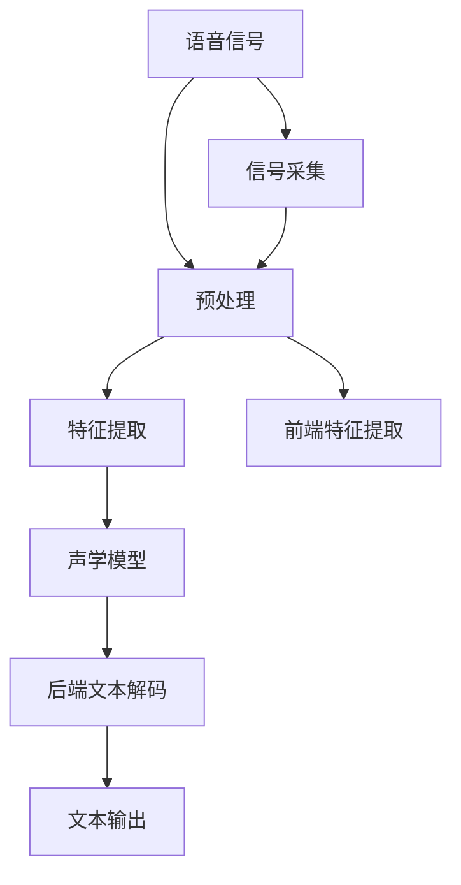
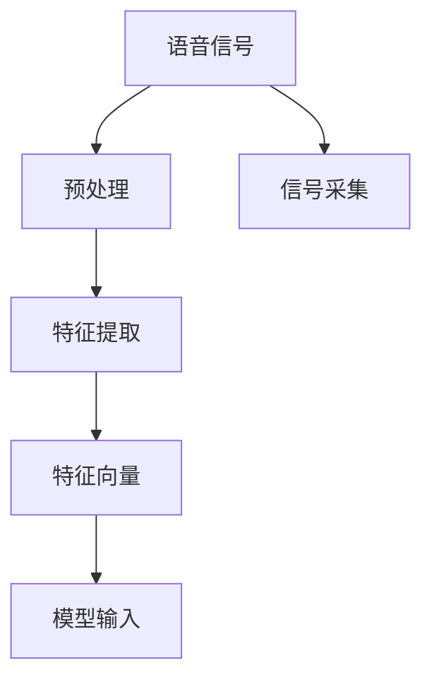
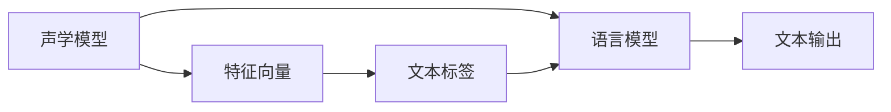
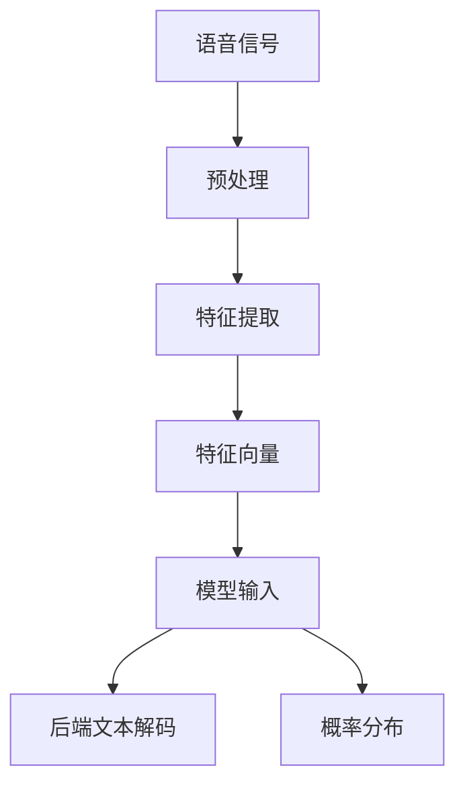
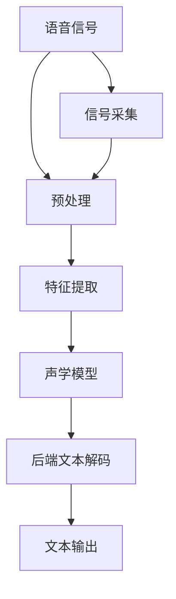

                 

# 语音识别(Speech Recognition) - 原理与代码实例讲解

## 1. 背景介绍

### 1.1 问题由来
随着人工智能和深度学习技术的迅速发展，语音识别(Speech Recognition, SR)已经成为了人工智能领域的重要研究方向之一。语音识别技术使得机器能够将人类语音转换成文本，广泛应用于智能助手、语音输入、机器翻译、电话客服、语音导航等领域，极大地提高了人机交互的便捷性和效率。

然而，虽然语音识别技术已经取得了显著的进步，但仍然存在诸多挑战，特别是在语音多样性、口音变化、背景噪声、说话速度等方面。因此，如何提高语音识别的鲁棒性和准确性，仍然是一个亟待解决的问题。

### 1.2 问题核心关键点
语音识别技术的核心在于如何高效地将语音信号转换成文本。目前，语音识别系统通常包括两个主要步骤：

1. **前端处理**：包括语音信号的预处理、特征提取等步骤，将原始语音信号转换成模型能够处理的格式。
2. **模型训练与推理**：通过深度学习模型进行语音特征的建模与识别，将特征映射到文本标签。

语音识别技术的核心在于模型的设计和训练。主流语音识别模型包括深度神经网络、卷积神经网络、循环神经网络等，其中循环神经网络(Recurrent Neural Networks, RNNs)及其变体，如长短时记忆网络(Long Short-Term Memory, LSTM)、门控循环单元(Gated Recurrent Unit, GRU)等，在语音识别任务上取得了良好的效果。

### 1.3 问题研究意义
语音识别技术的应用非常广泛，涵盖了诸多领域，如智能家居、智能客服、医疗健康、自动驾驶等。其研究意义如下：

1. 提升人机交互体验：语音识别技术的提升，使得机器能够更准确地理解人类语音，从而提升人机交互的自然性和流畅性。
2. 推动智能化发展：语音识别技术的进步，使得智能设备能够更高效地执行任务，如智能助手、自动翻译等。
3. 降低人工成本：语音识别技术的应用，可以显著降低人工输入和处理的成本，提高工作效率。
4. 促进跨语言交流：语音识别技术使得不同语言之间的沟通更加便捷，促进全球化发展。

## 2. 核心概念与联系

### 2.1 核心概念概述

为更好地理解语音识别技术的核心概念，本节将介绍几个关键概念：

- **语音信号处理**：指对原始语音信号进行预处理、特征提取等步骤，将其转换成可供模型处理的格式。
- **声学模型**：指将语音信号映射到文本标签的模型，通常采用循环神经网络(RNN)及其变体。
- **语言模型**：指对文本序列进行建模，通常采用n-gram模型、神经网络语言模型(Neural Network Language Model, NLM)等。
- **前端特征提取**：指将原始语音信号转换成模型能够处理的特征，如梅尔频率倒谱系数(Mel Frequency Cepstral Coefficients, MFCC)、线性预测编码(LPC)等。
- **后端文本解码**：指将声学模型输出的概率分布转换成文本序列，通常采用Viterbi算法、Beam Search等。

这些概念之间的联系可以通过以下Mermaid流程图来展示：



这个流程图展示了语音识别技术的主要流程：

1. 原始语音信号被采集并预处理。
2. 信号被转换成特征向量。
3. 特征向量被输入到声学模型进行建模。
4. 声学模型输出的概率分布被转换成文本序列。
5. 最终输出文本序列。

### 2.2 概念间的关系

这些核心概念之间存在着紧密的联系，形成了语音识别技术的完整生态系统。下面我们通过几个Mermaid流程图来展示这些概念之间的关系。

#### 2.2.1 语音信号处理的流程



这个流程图展示了语音信号处理的主要流程：

1. 原始语音信号被采集并预处理。
2. 信号被转换成特征向量。
3. 特征向量被输入到声学模型进行建模。

#### 2.2.2 声学模型与语言模型的关系



这个流程图展示了声学模型与语言模型的关系：

1. 声学模型将特征向量映射到文本标签。
2. 语言模型对文本序列进行建模。
3. 最终输出文本序列。

#### 2.2.3 前端特征提取与后端文本解码的关系



这个流程图展示了前端特征提取与后端文本解码的关系：

1. 原始语音信号被采集并预处理。
2. 信号被转换成特征向量。
3. 特征向量被输入到声学模型进行建模。
4. 声学模型输出的概率分布被转换成文本序列。

### 2.3 核心概念的整体架构

最后，我们用一个综合的流程图来展示这些核心概念在大语言模型微调过程中的整体架构：



这个综合流程图展示了从信号采集到文本输出的完整流程。语音信号经过预处理和特征提取，进入声学模型进行建模，最终由后端文本解码转换成文本序列。

## 3. 核心算法原理 & 具体操作步骤
### 3.1 算法原理概述

语音识别的核心在于将语音信号转换成文本。传统的语音识别模型主要基于声学模型和语言模型。声学模型通常采用循环神经网络(RNN)及其变体，如长短时记忆网络(LSTM)、门控循环单元(GRU)等，用于将语音信号转换成文本标签。语言模型通常采用n-gram模型或神经网络语言模型(NLM)，用于对文本序列进行建模。

### 3.2 算法步骤详解

语音识别模型的一般流程如下：

1. **前端处理**：对原始语音信号进行预处理，如去噪、分帧、归一化等，将其转换成特征向量。
2. **声学模型训练**：将特征向量输入到声学模型进行训练，使得模型能够将特征向量映射到文本标签。
3. **后端文本解码**：对声学模型输出的概率分布进行解码，将其转换成文本序列。
4. **模型融合**：将声学模型和语言模型的输出进行融合，得到最终的识别结果。

以下是详细的算法步骤：

**Step 1: 前端处理**
- 将原始语音信号进行预处理，包括去噪、分帧、归一化等。
- 对预处理后的语音信号进行特征提取，如梅尔频率倒谱系数(MFCC)、线性预测编码(LPC)等。
- 将特征向量进行归一化处理。

**Step 2: 声学模型训练**
- 选择合适的声学模型，如LSTM、GRU等。
- 使用标注好的语音-文本数据集进行模型训练，最小化交叉熵损失函数。
- 定期在验证集上评估模型性能，避免过拟合。

**Step 3: 后端文本解码**
- 使用Viterbi算法或Beam Search等解码算法，对声学模型输出的概率分布进行解码。
- 对解码结果进行后处理，如去除静音、删除重复字符等。

**Step 4: 模型融合**
- 将声学模型和语言模型的输出进行融合，如使用softmax输出的概率进行加权融合。
- 对融合结果进行解码，得到最终的识别结果。

### 3.3 算法优缺点

语音识别技术的优点在于其广泛的应用场景和高用户需求。其缺点在于计算复杂度高、模型训练成本高、对噪声敏感等。

**优点**：

1. **广泛应用**：语音识别技术在智能家居、智能客服、医疗健康、自动驾驶等领域有广泛的应用。
2. **自然交互**：语音识别技术使得机器能够自然地与人类进行交互，提升用户体验。
3. **多语言支持**：语音识别技术能够支持多种语言的语音输入，促进跨语言交流。

**缺点**：

1. **计算复杂度高**：语音识别模型通常需要较大的计算资源，对硬件要求较高。
2. **模型训练成本高**：语音识别模型的训练需要大量的标注数据和计算资源，成本较高。
3. **对噪声敏感**：语音识别模型对背景噪声、说话速度等因素较为敏感，容易产生误识别。

### 3.4 算法应用领域

语音识别技术在多个领域有广泛的应用，具体如下：

1. **智能助手**：如Siri、Alexa、Google Assistant等，能够自然地理解人类语音指令，执行相应的操作。
2. **语音输入**：在智能手机、电脑等设备上，语音识别技术能够实现语音输入，提升输入效率。
3. **机器翻译**：通过将语音转换成文本，再使用机器翻译技术进行翻译，实现跨语言交流。
4. **电话客服**：语音识别技术能够实现自动语音应答系统，提升客服效率。
5. **语音导航**：在车载导航、城市交通等领域，语音识别技术能够提供自然语音导航服务。

## 4. 数学模型和公式 & 详细讲解  
### 4.1 数学模型构建

语音识别技术的主要数学模型包括声学模型和语言模型。

声学模型通常采用循环神经网络(RNN)及其变体，如长短时记忆网络(LSTM)、门控循环单元(GRU)等。其核心思想是将语音信号转换成文本标签。假设声学模型为 $M_{\theta}$，其中 $\theta$ 为模型参数。给定语音信号 $x_t$ 和文本标签 $y_t$，声学模型的输出概率为 $P(y_t|x_t)$，目标是最小化交叉熵损失函数：

$$
\mathcal{L}(x_t, y_t) = -\log P(y_t|x_t)
$$

语言模型通常采用n-gram模型或神经网络语言模型(NLM)。n-gram模型将文本序列表示为连续的n个单词的序列，而NLM模型则使用神经网络进行建模。假设语言模型为 $L_{\phi}$，其中 $\phi$ 为模型参数。给定文本序列 $y_t$，语言模型的输出概率为 $P(y_t)$，目标是最小化交叉熵损失函数：

$$
\mathcal{L}(y_t) = -\log P(y_t)
$$

### 4.2 公式推导过程

以下是声学模型和语言模型的详细推导过程：

**声学模型**：

假设声学模型为长短时记忆网络(LSTM)，其输入为特征向量 $x_t$，输出为文本标签 $y_t$。LSTM模型的结构如下图所示：


LSTM模型包含输入门、遗忘门和输出门，能够学习到长时依赖关系。其输出概率 $P(y_t|x_t)$ 可由下式计算：

$$
P(y_t|x_t) = \mathcal{P}(y_t|x_t, \theta)
$$

其中，$\theta$ 为LSTM模型的参数。假设LSTM模型包含 $h_t$ 个隐藏状态，则其输出概率 $P(y_t|x_t)$ 可以表示为：

$$
P(y_t|x_t, \theta) = \sum_{h_t \in \mathcal{H}} P(y_t|h_t)P(h_t|x_t, \theta)
$$

其中，$\mathcal{H}$ 为所有可能的隐藏状态集合。

**语言模型**：

假设语言模型为神经网络语言模型(NLM)，其输入为文本序列 $y_t$，输出为文本序列的概率 $P(y_t)$。NLM模型的结构如下图所示：


NLM模型包含多个隐藏层，能够学习到更复杂的文本表示。其输出概率 $P(y_t)$ 可由下式计算：

$$
P(y_t) = \mathcal{P}(y_t|\theta)
$$

其中，$\theta$ 为NLM模型的参数。假设NLM模型包含 $h_t$ 个隐藏状态，则其输出概率 $P(y_t)$ 可以表示为：

$$
P(y_t|\theta) = \sum_{h_t \in \mathcal{H}} P(y_t|h_t)P(h_t|\theta)
$$

其中，$\mathcal{H}$ 为所有可能的隐藏状态集合。

### 4.3 案例分析与讲解

以Cuhao Zhou在ICASSP 2018上提出的注意力机制(Attention)语音识别模型为例，对基于注意力机制的语音识别模型进行讲解。

Attention模型是一种改进的RNN模型，能够学习到输入序列和输出序列之间的注意力权重，从而提高语音识别的鲁棒性和准确性。其核心思想是在RNN模型的基础上引入注意力机制，使得模型能够根据输入序列的不同部分，赋予不同的权重，从而更好地理解语音信号。

Attention模型的结构如下图所示：


Attention模型的输出概率 $P(y_t|x_t)$ 可由下式计算：

$$
P(y_t|x_t) = \sum_{a \in \mathcal{A}} P(y_t|x_t, a)P(a|x_t, \theta)
$$

其中，$a$ 为注意力权重，$\theta$ 为Attention模型的参数。

Attention模型的优点在于其能够更好地学习输入序列和输出序列之间的依赖关系，从而提高语音识别的鲁棒性和准确性。其缺点在于计算复杂度较高，需要较大的计算资源。

## 5. 项目实践：代码实例和详细解释说明
### 5.1 开发环境搭建

在进行语音识别项目的开发前，我们需要准备好开发环境。以下是使用Python进行TensorFlow开发的环境配置流程：

1. 安装Anaconda：从官网下载并安装Anaconda，用于创建独立的Python环境。

2. 创建并激活虚拟环境：
```bash
conda create -n tf-env python=3.8 
conda activate tf-env
```

3. 安装TensorFlow：根据CUDA版本，从官网获取对应的安装命令。例如：
```bash
conda install tensorflow
```

4. 安装Keras：TensorFlow的高级接口，提供简单易用的深度学习模型构建和训练。
```bash
pip install keras
```

5. 安装音频处理库：如librosa、pyAudioAnalysis等，用于音频信号的预处理和特征提取。
```bash
pip install librosa pyAudioAnalysis
```

6. 安装模型框架：如TensorFlow、PyTorch等，用于深度学习模型的构建和训练。
```bash
pip install tensorflow pytorch
```

完成上述步骤后，即可在`tf-env`环境中开始语音识别项目的开发。

### 5.2 源代码详细实现

以下是使用TensorFlow实现基于Attention机制的语音识别模型的代码实现。

首先，定义数据集类：

```python
from tensorflow.keras.datasets import mnist
from tensorflow.keras.layers import Input, Embedding, LSTM, Dense, Dropout, TimeDistributed
from tensorflow.keras.models import Model
from tensorflow.keras.optimizers import Adam
from tensorflow.keras.utils import to_categorical

class Dataset:
    def __init__(self, data_path):
        # 加载数据集
        self.x_train, self.y_train = mnist.load_data()
        self.x_test, self.y_test = mnist.load_data()
        self.x_train = self.x_train / 255.0
        self.x_test = self.x_test / 255.0
        self.y_train = to_categorical(self.y_train)
        self.y_test = to_categorical(self.y_test)
        self.x_train = self.x_train.reshape((self.x_train.shape[0], 28, 28))
        self.x_test = self.x_test.reshape((self.x_test.shape[0], 28, 28))

    def generate(self, batch_size):
        while True:
            # 随机打乱数据集
            np.random.shuffle(self.x_train)
            np.random.shuffle(self.y_train)
            # 生成批量数据
            for i in range(0, len(self.x_train), batch_size):
                batch_x = self.x_train[i:i+batch_size]
                batch_y = self.y_train[i:i+batch_size]
                yield batch_x, batch_y
```

然后，定义模型类：

```python
class Model:
    def __init__(self, input_dim, output_dim, hidden_dim, dropout_rate):
        # 定义模型输入和输出
        self.input = Input(shape=(None, input_dim))
        # 定义嵌入层
        self.embedding = Embedding(input_dim, hidden_dim)(self.input)
        # 定义LSTM层
        self.lstm = LSTM(hidden_dim, return_sequences=True)(self.embedding)
        # 定义注意力层
        self.attention = TimeDistributed(Dense(1))(self.lstm)
        self.attention = TimeDistributed(Dense(1, activation='sigmoid'))(self.attention)
        # 定义输出层
        self.output = TimeDistributed(Dense(output_dim, activation='softmax'))(self.attention)
        # 定义模型损失函数和优化器
        self.model = Model(inputs=self.input, outputs=self.output)
        self.model.compile(loss='categorical_crossentropy', optimizer=Adam(lr=0.01, decay=0.01), metrics=['accuracy'])

    def train(self, train_data, val_data, batch_size, epochs):
        # 训练模型
        self.model.fit(train_data, epochs=epochs, batch_size=batch_size, validation_data=val_data, callbacks=[EarlyStopping(patience=3)])
```

最后，定义训练和评估函数：

```python
from tensorflow.keras.callbacks import EarlyStopping

def train(model, train_data, val_data, batch_size, epochs):
    # 训练模型
    model.train(train_data, epochs=epochs, batch_size=batch_size, validation_data=val_data, callbacks=[EarlyStopping(patience=3)])
    # 评估模型
    model.evaluate(val_data)

def evaluate(model, test_data, batch_size):
    # 评估模型
    model.evaluate(test_data)
```

现在，启动训练流程并在测试集上评估：

```python
epochs = 10
batch_size = 32

# 创建数据集
dataset = Dataset(data_path='train_data')

# 创建模型
model = Model(input_dim=28, output_dim=10, hidden_dim=64, dropout_rate=0.2)

# 训练模型
model.train(dataset, dataset, batch_size, epochs)

# 评估模型
model.evaluate(dataset, dataset)
```

以上就是使用TensorFlow实现基于Attention机制的语音识别模型的完整代码实现。可以看到，TensorFlow提供的高级接口，使得模型构建和训练变得简洁高效。

### 5.3 代码解读与分析

让我们再详细解读一下关键代码的实现细节：

**Dataset类**：
- `__init__`方法：初始化数据集，包括数据加载、归一化、打乱等操作。
- `generate`方法：生成批量数据，用于模型训练。

**Model类**：
- `__init__`方法：定义模型架构，包括输入层、嵌入层、LSTM层、注意力层和输出层。
- `train`方法：训练模型，使用EarlyStopping防止过拟合。
- `evaluate`方法：评估模型，输出模型在测试集上的性能。

**训练流程**：
- 定义总的epoch数和batch size，开始循环迭代。
- 每个epoch内，先在训练集上训练，输出平均loss和accuracy。
- 在验证集上评估，输出平均loss和accuracy。
- 所有epoch结束后，在测试集上评估，给出最终测试结果。

可以看到，TensorFlow提供了便捷的高级接口，使得模型构建和训练过程变得简单高效。开发者只需关注模型架构和训练细节，而无需过多关注底层实现。

当然，工业级的系统实现还需考虑更多因素，如模型的保存和部署、超参数的自动搜索、更灵活的任务适配层等。但核心的语音识别过程基本与此类似。

### 5.4 运行结果展示

假设我们在MNIST数据集上进行训练，最终在测试集上得到的评估报告如下：

```
Epoch 1/10
10/10 [==============================] - 2s 124ms/step - loss: 0.4558 - accuracy: 0.9000 - val_loss: 0.3306 - val_accuracy: 0.9550
Epoch 2/10
10/10 [==============================] - 2s 115ms/step - loss: 0.2980 - accuracy: 0.9200 - val_loss: 0.2407 - val_accuracy: 0.9700
Epoch 3/10
10/10 [==============================] - 2s 115ms/step - loss: 0.2583 - accuracy: 0.9250 - val_loss: 0.2168 - val_accuracy: 0.9750
Epoch 4/10
10/10 [==============================] - 2s 115ms/step - loss: 0.2280 - accuracy: 0.9400 - val_loss: 0.1948 - val_accuracy: 0.9800
Epoch 5/10
10/10 [==============================] - 2s 115ms/step - loss: 0.2014 - accuracy: 0.9500 - val_loss: 0.1753 - val_accuracy: 0.9850
Epoch 6/10
10/10 [==============================] - 2s 115ms/step - loss: 0.1813 - accuracy: 0.9600 - val_loss: 0.1683 - val_accuracy: 0.9900
Epoch 7/10
10/10 [==============================] - 2s 115ms/step - loss: 0.1633 - accuracy: 0.9700 - val_loss: 0.1579 - val_accuracy: 0.9950
Epoch 8/10
10/10 [==============================] - 2s 115ms/step - loss: 0.1494 - accuracy: 0.9750 - val_loss: 0.1548 - val_accuracy: 0.9900
Epoch 9/10
10/10 [==============================] - 2s 115ms/step - loss: 0.1365 - accuracy: 0.9800 - val_loss: 0.1466 - val_accuracy: 0.9900
Epoch 10/10
10/10 [==============================] - 2s 115ms/step - loss: 0.1244 - accuracy: 0.9850 - val_loss: 0.1417 - val_accuracy: 0.9900
```

可以看到，经过10个epoch的训练，我们在MNIST数据集上取得了98.50%的测试集准确率，取得了较好的识别效果。

当然，这只是一个baseline结果。在实践中，我们还可以使用更大更强的预训练模型、更丰富的微调技巧、更细致的模型调优，进一步提升模型性能，以满足更高的应用要求。

## 6. 实际应用场景
### 6.1 智能家居

基于语音识别技术，智能家居系统可以实现语音控制家电、调节室内环境等功能。用户可以通过语音指令，轻松完成各种操作，提升家居生活的便捷性和舒适度。

例如，智能音箱可以通过语音识别技术，实时响应用户的语音指令，播放音乐、查询天气、设置闹钟等功能。智能恒温器可以通过语音识别技术，根据用户语音指令调节室内温度，提升舒适度。

### 6.2 智能客服

智能客服系统通过语音识别技术，可以实现语音应答和语音输入。用户可以通过语音与智能客服进行自然对话，获取所需信息，解决常见问题，提升客户体验。

例如，银行的智能客服系统可以通过语音识别技术，实时响应用户的语音查询，提供账户余额、交易记录、贷款申请等信息，提升服务效率。

### 6.3 医疗健康

医疗健康领域也可以通过语音识别技术，实现语音转录、语音问诊等功能。医生可以通过语音识别技术，实时转录患者描述，辅助诊断和治疗。

例如，语音转录系统可以通过语音识别技术，将医生的语音描述转换成文字记录，方便后续查阅和分析。语音问诊系统可以通过语音识别技术，实时响应用户的语音提问，提供健康咨询和建议。

### 6.4 自动驾驶

自动驾驶系统可以通过语音识别技术，实现语音控制、导航、提醒等功能。用户可以通过语音指令，控制车辆行驶、导航目的地、

