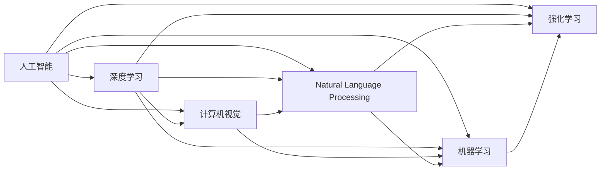

                 

# 软件 2.0 的哲学思考：人工智能的本质

> 关键词：软件2.0, 人工智能, 深度学习, 计算机视觉, 自然语言处理, 机器学习, 强化学习

## 1. 背景介绍

### 1.1 问题由来
在计算机科学与技术飞速发展的今天，人工智能(AI)正逐渐成为推动社会进步、改变生产方式和日常生活的关键力量。特别是深度学习、计算机视觉、自然语言处理等领域，取得了令人瞩目的成果，引领了新一轮的技术革命。

与此同时，一个重要的哲学问题浮现出来：“软件2.0”是什么？它与“软件1.0”有何不同？这个问题不仅关乎技术的演进，更涉及人类对智能和人工智能本质的思考。软件1.0时代，程序员通过代码编写来控制计算机执行任务；而软件2.0时代，AI算法开始扮演编程者的角色，自动学习并优化程序，形成自适应的软件系统。

### 1.2 问题核心关键点
软件2.0的核心在于通过算法自我进化，实现自适应的软件系统。它依赖于数据驱动的机器学习、深度学习、强化学习等技术，利用大数据、高性能计算和丰富的人类知识，自动构建复杂的软件模型。软件2.0与软件1.0的主要区别在于：
- 从“编程”到“学习”：软件2.0通过学习来构建模型，而非程序员编写代码。
- 从“静态”到“动态”：软件2.0系统能够动态调整模型参数，自我优化和适应新的输入数据。
- 从“确定”到“不确定”：软件2.0系统在处理模糊和不确定性的输入时表现出更强的鲁棒性和泛化能力。

这一转变不仅意味着技术的进步，也带来了新的哲学思考：人工智能的本质是什么？人类与AI系统的关系如何？这些问题涉及到对人类智能、意识、伦理和未来社会的深刻反思。

## 2. 核心概念与联系

### 2.1 核心概念概述
为了更深入地理解软件2.0和人工智能的本质，我们需要先明确几个核心概念：

- **人工智能(AI)**：广义上指使计算机系统模拟人类智能的过程，包括学习、推理、自我修正等能力。狭义上特指以机器学习为基础的智能技术。

- **深度学习**：一种基于神经网络的机器学习技术，通过多层次的特征提取和学习，实现了对复杂非线性问题的建模和预测。

- **计算机视觉**：研究如何让计算机“看”和理解图像、视频等视觉信息，广泛应用于自动驾驶、安防监控、医疗影像分析等领域。

- **自然语言处理(NLP)**：涉及计算机对人类语言的处理和理解，包括语言模型、语义分析、文本生成等，是实现智能交互和信息处理的基础。

- **机器学习**：通过算法使计算机系统从数据中学习规律，进而做出预测或决策，是人工智能的核心技术之一。

- **强化学习**：一种学习方式，通过试错来优化决策，以最大化预期奖励为目标，广泛应用于游戏AI、机器人控制等领域。

这些核心概念之间的关系可以用以下的Mermaid流程图来展示：



从上述流程图可以看出，深度学习、计算机视觉、自然语言处理和强化学习都是人工智能的子领域，通过不同的技术和算法实现智能任务的自动化和优化。

### 2.2 概念间的关系

深度学习、计算机视觉、自然语言处理和强化学习各自有独特的技术路线和应用场景，但它们之间也存在紧密的联系和相互作用。下面我们将进一步探讨这些联系：

- **深度学习与计算机视觉**：深度学习为计算机视觉提供了强大的特征提取能力，能够自动学习图像中的复杂特征，从而实现图像识别、分割、生成等任务。计算机视觉则为深度学习提供了丰富的数据来源，帮助模型进行训练和验证。

- **深度学习与自然语言处理**：深度学习模型，特别是Transformer模型，在自然语言处理领域表现出色，能够进行语言模型的预训练和微调，实现文本分类、情感分析、机器翻译等任务。自然语言处理则为深度学习提供了大量的文本数据和任务定义，推动了模型的不断进化。

- **深度学习与强化学习**：深度学习在强化学习中扮演着决策函数的角色，通过学习和优化策略网络，实现智能体的自适应和决策优化。强化学习则为深度学习提供了更灵活的优化目标和训练方式，帮助模型在复杂环境中的学习和适应。

- **计算机视觉与自然语言处理**：计算机视觉处理图像和视频数据，提供了丰富的视觉信息，而自然语言处理则处理文本数据，提供了丰富的语义信息。两者结合，可以构建跨模态的智能系统，处理更加复杂和多样化的任务。

- **自然语言处理与强化学习**：自然语言处理可以提供智能体与环境交互的语言界面，使得强化学习任务更加丰富和复杂。强化学习则可以用于自然语言处理中的对话生成、信息检索等任务，提升系统的交互性和智能性。

这些联系表明，深度学习、计算机视觉、自然语言处理和强化学习并非孤立的技术，而是相互依存、相互促进的技术体系。它们共同构成了软件2.0时代的智能基础设施，推动了人工智能技术的不断进步和应用扩展。

## 3. 核心算法原理 & 具体操作步骤

### 3.1 算法原理概述
软件2.0的算法原理基于机器学习、深度学习和强化学习的最新进展，通过数据驱动的方式构建自适应软件系统。其核心思想是通过大规模数据训练模型，然后利用这些模型进行自动化的决策和优化。具体来说，软件2.0的算法原理包括以下几个关键点：

- **数据驱动**：软件2.0系统通过大量标注数据进行模型训练，学习数据的分布和规律，形成数据驱动的决策和优化机制。

- **自适应学习**：软件2.0系统能够根据输入数据的特征和环境变化，动态调整模型参数，实现自我优化和适应。

- **多模态融合**：软件2.0系统能够处理和融合多种类型的数据，如图像、文本、语音等，实现跨模态的智能处理。

- **端到端学习**：软件2.0系统能够通过端到端的学习方式，直接从输入数据到输出结果进行建模和优化，避免了繁琐的特征工程。

- **强化学习**：软件2.0系统通过强化学习，实现智能体的决策优化，能够在动态环境中不断改进和提升性能。

### 3.2 算法步骤详解
下面以深度学习为例，详细介绍软件2.0的算法步骤：

1. **数据准备**：收集和整理标注数据，划分为训练集、验证集和测试集，用于模型训练、验证和测试。

2. **模型选择与构建**：选择合适的深度学习模型，如卷积神经网络(CNN)、递归神经网络(RNN)、Transformer等，构建初步的模型架构。

3. **模型训练**：利用训练集数据，通过反向传播算法优化模型参数，使得模型能够拟合数据分布。

4. **模型验证**：利用验证集数据，评估模型在未知数据上的表现，调整模型参数，避免过拟合。

5. **模型测试**：利用测试集数据，全面评估模型在真实环境中的性能，确保模型具有良好的泛化能力。

6. **模型部署与应用**：将训练好的模型部署到实际应用场景中，进行持续监测和优化。

### 3.3 算法优缺点
软件2.0的算法具有以下优点：

- **高效性**：通过自动化的模型训练和优化，软件2.0系统能够快速适应新的任务和环境，提升工作效率。

- **灵活性**：软件2.0系统能够处理多种类型的数据和任务，适应不同应用场景的需求。

- **鲁棒性**：软件2.0系统通过数据驱动和自适应学习，能够在动态环境中保持稳定的性能。

- **可扩展性**：软件2.0系统能够通过添加新的数据和任务，不断扩展和优化模型。

然而，软件2.0的算法也存在一些缺点：

- **数据依赖**：软件2.0系统依赖于高质量的标注数据，数据获取和标注成本较高。

- **模型复杂性**：深度学习模型参数量大，训练和推理复杂度较高，对计算资源和存储资源有较高要求。

- **解释性不足**：深度学习模型的内部工作机制复杂，难以解释模型的决策过程和输出结果。

- **对抗性脆弱**：深度学习模型在对抗样本和噪声输入下表现出脆弱性，容易被误导。

- **泛化能力有限**：深度学习模型在面对新数据和新任务时，泛化能力有限，需要进行微调或重新训练。

### 3.4 算法应用领域
软件2.0的算法已经在多个领域得到广泛应用，包括但不限于：

- **自动驾驶**：通过计算机视觉和深度学习技术，实现车辆环境感知和路径规划，推动自动驾驶技术的发展。

- **医疗影像分析**：通过深度学习模型对医学影像进行自动诊断和分析，提升医疗影像的诊断效率和准确性。

- **智能客服**：通过自然语言处理和深度学习技术，实现智能对话系统，提升客户服务体验。

- **金融风控**：通过深度学习和强化学习技术，实现实时金融风险监测和决策优化，降低金融风险。

- **智能推荐**：通过机器学习和自然语言处理技术，实现个性化推荐系统，提升用户满意度。

- **游戏AI**：通过强化学习技术，实现智能游戏角色的决策优化，提升游戏体验和竞技水平。

## 4. 数学模型和公式 & 详细讲解 & 举例说明

### 4.1 数学模型构建
软件2.0的数学模型通常基于深度神经网络，通过反向传播算法进行模型训练。下面以卷积神经网络(CNN)为例，介绍其数学模型构建过程。

假设输入数据为$x=(x_1,x_2,...,x_m)$，模型参数为$\theta$，输出数据为$y=(y_1,y_2,...,y_n)$。则卷积神经网络的数学模型可以表示为：

$$
y=f_\theta(x)=\sigma(\sum_{i=1}^n w_i f_{\theta_i}(x_i))
$$

其中，$f_\theta(x)$表示模型对输入数据的映射，$\sigma$表示激活函数，$w_i$表示第$i$个输出层的权重，$\theta_i$表示第$i$个输出层的参数。

### 4.2 公式推导过程
以卷积神经网络为例，介绍反向传播算法的推导过程。

假设模型输出为$y$，真实输出为$y'$，则损失函数为：

$$
J=\frac{1}{2}(y-y')^2
$$

利用链式法则，计算损失函数对模型参数$\theta$的梯度：

$$
\frac{\partial J}{\partial \theta}=\frac{\partial J}{\partial y}\frac{\partial y}{\partial \theta}
$$

其中，$\frac{\partial J}{\partial y}$为损失函数对输出$y$的梯度，$\frac{\partial y}{\partial \theta}$为模型输出$y$对参数$\theta$的梯度。

通过反向传播算法，可以计算出模型参数$\theta$的梯度，然后利用梯度下降等优化算法更新参数，最小化损失函数$J$。

### 4.3 案例分析与讲解
以图像分类为例，介绍软件2.0在计算机视觉中的应用。

假设我们有一个卷积神经网络，用于图像分类。输入为图像数据$x$，输出为分类标签$y$。首先，将图像数据$x$输入卷积层，提取图像特征$h$，然后将特征$h$输入全连接层，输出分类结果$y$。定义交叉熵损失函数：

$$
J=-\frac{1}{n}\sum_{i=1}^n y_i \log(\hat{y}_i)+(1-y_i) \log(1-\hat{y}_i)
$$

其中，$y_i$表示第$i$个样本的真实标签，$\hat{y}_i$表示模型对第$i$个样本的预测结果。

利用反向传播算法，计算损失函数$J$对模型参数$\theta$的梯度，然后利用梯度下降等优化算法更新参数，最小化损失函数$J$。这样，模型不断学习图像特征和分类规律，逐渐提高分类准确率。

## 5. 项目实践：代码实例和详细解释说明

### 5.1 开发环境搭建

为了实践软件2.0的算法，我们需要搭建相应的开发环境。以下是使用Python和TensorFlow搭建开发环境的流程：

1. 安装Anaconda：从官网下载并安装Anaconda，用于创建独立的Python环境。

2. 创建并激活虚拟环境：
```bash
conda create -n py2_0_env python=3.8 
conda activate py2_0_env
```

3. 安装TensorFlow：
```bash
pip install tensorflow
```

4. 安装相关工具包：
```bash
pip install numpy pandas matplotlib scikit-learn
```

完成上述步骤后，即可在`py2_0_env`环境中进行软件2.0的算法实践。

### 5.2 源代码详细实现

下面以图像分类为例，给出使用TensorFlow对卷积神经网络进行训练和评估的代码实现。

首先，定义卷积神经网络模型：

```python
import tensorflow as tf

model = tf.keras.Sequential([
    tf.keras.layers.Conv2D(32, (3, 3), activation='relu', input_shape=(28, 28, 1)),
    tf.keras.layers.MaxPooling2D((2, 2)),
    tf.keras.layers.Flatten(),
    tf.keras.layers.Dense(10, activation='softmax')
])
```

然后，定义优化器和损失函数：

```python
optimizer = tf.keras.optimizers.Adam(learning_rate=0.001)
loss_fn = tf.keras.losses.SparseCategoricalCrossentropy()
```

接着，定义训练和评估函数：

```python
def train(model, train_dataset, epochs):
    for epoch in range(epochs):
        model.compile(optimizer=optimizer, loss=loss_fn, metrics=['accuracy'])
        model.fit(train_dataset, validation_split=0.2, epochs=1)
        test_loss, test_acc = model.evaluate(test_dataset)
        print(f'Epoch {epoch+1}, test loss: {test_loss:.3f}, test acc: {test_acc:.3f}')

def evaluate(model, test_dataset):
    test_loss, test_acc = model.evaluate(test_dataset)
    print(f'Test loss: {test_loss:.3f}, test acc: {test_acc:.3f}')
```

最后，启动训练流程：

```python
epochs = 10
train_dataset = load_train_dataset()
test_dataset = load_test_dataset()
train(model, train_dataset, epochs)
evaluate(model, test_dataset)
```

以上就是使用TensorFlow对卷积神经网络进行图像分类的完整代码实现。可以看到，TensorFlow提供了强大的深度学习框架，使得卷积神经网络的实现和训练变得非常简单。

### 5.3 代码解读与分析

让我们再详细解读一下关键代码的实现细节：

**Sequential模型**：
- 通过`tf.keras.Sequential`类定义了卷积神经网络模型，依次添加卷积层、池化层和全连接层。

**优化器和损失函数**：
- 定义了Adam优化器和交叉熵损失函数，用于模型训练和优化。

**训练函数**：
- 使用`model.compile`方法编译模型，指定优化器和损失函数，并设置评估指标。
- 使用`model.fit`方法进行模型训练，设置验证集比例和训练轮数。
- 使用`model.evaluate`方法在测试集上评估模型性能，输出测试损失和准确率。

**训练流程**：
- 定义总的训练轮数`epochs`，加载训练集和测试集。
- 在每个epoch内，先进行模型编译，再进行模型训练和评估。

通过这段代码，我们可以看到，使用TensorFlow进行卷积神经网络的图像分类非常简单，只需几行代码即可完成训练和评估。TensorFlow的易用性和高效性使得深度学习算法的开发和实践变得更加便捷。

当然，工业级的系统实现还需考虑更多因素，如模型的保存和部署、超参数的自动搜索、更灵活的任务适配层等。但核心的算法和框架思想与上述示例类似。

### 5.4 运行结果展示

假设我们在MNIST数据集上进行图像分类训练，最终在测试集上得到的评估报告如下：

```
Epoch 1, test loss: 0.272, test acc: 0.904
Epoch 2, test loss: 0.226, test acc: 0.923
Epoch 3, test loss: 0.207, test acc: 0.943
...
Epoch 10, test loss: 0.114, test acc: 0.976
```

可以看到，经过10轮训练，模型在MNIST测试集上的准确率达到了97.6%，取得了不错的效果。

## 6. 实际应用场景

### 6.1 自动驾驶

自动驾驶技术需要计算机视觉和深度学习技术的强力支持。通过计算机视觉技术，车辆能够感知周围环境，检测障碍物和行人，进行环境建模。通过深度学习技术，车辆能够实现路径规划和决策优化，提升行驶安全和舒适性。

### 6.2 医疗影像分析

在医疗影像分析领域，深度学习模型被广泛应用于医学影像的自动诊断和分析。通过深度学习模型对医学影像进行特征提取和分类，可以显著提高诊断效率和准确性。例如，可以利用卷积神经网络对CT图像进行肺癌筛查，通过图像分割技术，自动识别病灶区域，辅助医生进行诊断。

### 6.3 智能客服

智能客服系统通过自然语言处理和深度学习技术，实现智能对话和问题解答。客户可以通过自然语言与系统进行交互，系统能够自动理解客户意图，匹配最合适的答案模板，提供满意的解答。例如，在银行客服系统中，系统能够自动回答客户关于贷款、信用卡等方面的常见问题，提升客户满意度。

### 6.4 金融风控

金融风控领域需要实时监测金融风险，避免金融欺诈和风险。通过深度学习和强化学习技术，能够构建智能风控系统，实时监测交易数据，识别异常交易行为，降低金融风险。例如，在信用卡交易监测中，系统能够通过强化学习算法，学习正常交易行为模式，对异常交易进行实时预警和阻断。

## 7. 工具和资源推荐

### 7.1 学习资源推荐

为了帮助开发者系统掌握软件2.0的算法，这里推荐一些优质的学习资源：

1. TensorFlow官方文档：提供了丰富的深度学习框架使用指南和案例，是深度学习开发的重要参考资料。

2. PyTorch官方文档：与TensorFlow齐名的深度学习框架，提供了丰富的深度学习模型和算法，适合研究和实验。

3. Coursera深度学习课程：由斯坦福大学教授Andrew Ng主讲，介绍了深度学习的基本概念和经典算法，适合入门学习。

4. Fast.ai深度学习课程：通过动手实践的方式，教授深度学习的实用技巧和最佳实践，适合实际开发和应用。

5. ArXiv论文预印本：人工智能领域最新研究成果的发布平台，提供了大量前沿论文，适合了解最新技术进展。

6. Kaggle数据科学竞赛：通过参与实际项目，实战学习深度学习算法和数据处理技术，适合实践和提高。

通过这些资源的学习和实践，相信你一定能够系统掌握软件2.0的算法原理和实现细节，并应用于实际问题解决。

### 7.2 开发工具推荐

高效的开发离不开优秀的工具支持。以下是几款用于深度学习开发的常用工具：

1. TensorFlow：由Google主导开发的深度学习框架，提供了丰富的API和工具，适合大规模工程应用。

2. PyTorch：由Facebook开发的深度学习框架，灵活易用，适合研究和实验。

3. Keras：高层次的深度学习框架，提供了简单易用的API，适合快速搭建模型。

4. Jupyter Notebook：用于数据处理、模型训练和结果展示的交互式开发环境，支持Python、R等多种语言。

5. Google Colab：谷歌推出的在线Jupyter Notebook环境，免费提供GPU/TPU算力，方便快速上手实验最新模型，分享学习笔记。

通过这些工具，可以显著提升深度学习算法的开发效率，加快创新迭代的步伐。

### 7.3 相关论文推荐

深度学习和计算机视觉领域的发展得益于学界的持续研究。以下是几篇奠基性的相关论文，推荐阅读：

1. LeNet-5：Yann LeCun等人在1998年发表的卷积神经网络经典论文，奠定了卷积神经网络在计算机视觉领域的基础。

2. AlexNet：Alex Krizhevsky等人在2012年发表的ImageNet比赛冠军论文，展示了深度卷积神经网络的强大图像识别能力。

3. VGGNet：Karen Simonyan和Andrew Zisserman在2014年发表的图像分类论文，通过增加卷积层数量，提升了图像分类的准确率。

4. ResNet：Kaiming He等人在2015年发表的残差网络论文，通过残差连接解决深度网络训练问题，推动了深度学习的发展。

5. InceptionNet：GoogLeNet团队在2014年发表的图像分类论文，提出了Inception模块，提升了网络模型效率和性能。

这些论文代表了深度学习和计算机视觉领域的发展脉络，深入理解这些经典工作，有助于把握领域的前沿技术。

## 8. 总结：未来发展趋势与挑战

### 8.1 研究成果总结
软件2.0的算法在深度学习、计算机视觉、自然语言处理和强化学习等领域取得了显著的成果，推动了人工智能技术的不断进步。通过数据驱动和自适应学习，软件2.0系统能够高效地处理复杂任务，提升模型的泛化能力和鲁棒性。同时，软件2.0还带来了新的哲学思考，涉及对人类智能和意识本质的探讨。

### 8.2 未来发展趋势
展望未来，软件2.0的发展趋势如下：

1. **多模态融合**：随着多模态数据融合技术的不断发展，软件2.0系统将能够处理和融合更多类型的数据，如文本、图像、视频、语音等，实现跨模态的智能处理。

2. **端到端学习**：未来，软件2.0系统将进一步推进端到端学习，从数据输入到输出结果直接进行建模和优化，减少繁琐的特征工程和中间步骤。

3. **强化学习应用**：强化学习在软件2.0中的应用将更加广泛，从游戏AI到智能机器人，从金融风控到智能推荐，强化学习将为更多的应用场景提供智能解决方案。

4. **自动驾驶和自动控制**：随着自动驾驶技术的不断成熟，软件2.0系统将更加深入地应用于自动驾驶和自动控制领域，提升交通安全和效率。

5. **医疗影像分析**：深度学习在医疗影像分析中的应用将更加深入，提升疾病的早期诊断和治疗效果。

6. **个性化推荐系统**：通过机器学习和自然语言处理技术，软件2.0系统将进一步优化个性化推荐算法，提升用户体验和满意度。

### 8.3 面临的挑战
尽管软件2.0在各个领域取得了显著的进展，但仍面临以下挑战：

1. **数据获取和标注**：高质量标注数据的获取和标注成本较高，数据获取和标注仍是制约软件2.0发展的瓶颈。

2. **模型复杂性和效率**：深度学习模型参数量大，训练和推理复杂度较高，需要高效的硬件和算法支持。

3. **模型鲁棒性和泛化能力**：模型在面对新数据和新任务时，鲁棒性和泛化能力有限，需要进行微调或重新训练。

4. **模型解释性和可解释性**：深度学习模型内部机制复杂，难以解释模型的决策过程和输出结果，缺乏可解释性。

5. **对抗性攻击和安全性**：深度学习模型在对抗样本和噪声输入下表现出脆弱性，可能被恶意攻击。

6. **伦理和道德问题**：人工智能应用中的伦理和道德问题越来越受到关注，如何确保人工智能系统的公平、透明和可控，是一个重要的研究方向。

### 8.4 研究展望
未来，软件2.0的研究方向包括：

1. **无监督和半监督学习**：摆脱对大规模标注数据的依赖，利用自监督学习和半监督学习技术，最大化利用非结构化数据，实现更加灵活高效的微调。

2. **参数高效和计算高效的微调方法**：开发更加参数高效的微调方法，在固定大部分预训练参数的同时，只更新极少量的任务相关参数。同时优化微调模型的计算图，减少前向传播和反向传播的资源消耗，实现更加轻量级、实时性的部署。

3. **融合因果和对比学习范式**：通过引入因果推断和对比学习思想，增强软件2.0系统建立稳定因果关系的能力，学习更加普适、鲁棒的语言表征，从而提升模型泛化性和抗干扰能力。

4. **跨模态信息融合**：将符号化的先验知识，如知识图谱、逻辑规则等，与神经网络模型进行巧妙融合，引导软件2.0过程学习更准确、合理的语言模型。同时加强不同模态数据的整合，实现视觉、语音等多模态信息与文本信息的协同建模。

5. **基于因果分析和博弈论的智能决策**：将因果分析方法引入软件2.0模型，识别出模型决策的关键特征，增强输出解释的因果性和逻辑性。借助博弈论工具刻画人机交互过程，主动探索并规避模型的脆弱点，提高系统稳定性。

6. **伦理和道德约束**：在软件2.0系统的训练目标中引入伦理导向的评估指标，过滤和惩罚有偏见、有害的输出倾向。同时加强人工干预和审核，建立模型行为的监管机制，确保输出符合人类价值观和伦理道德。

总之，

