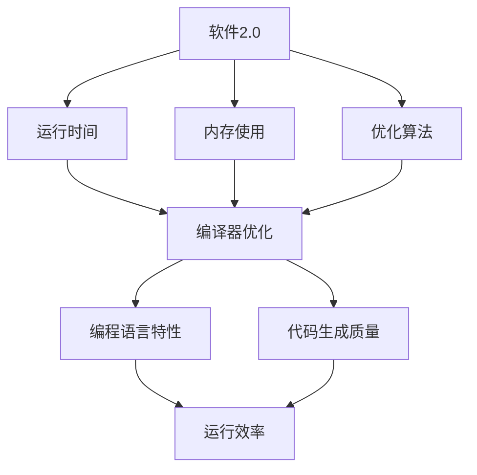
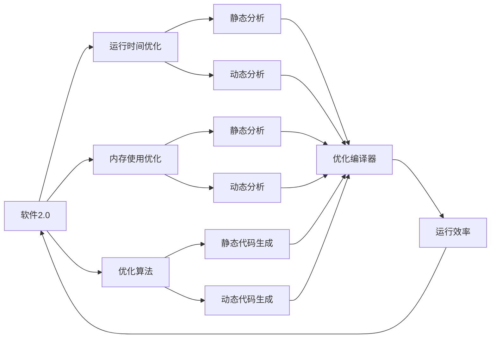
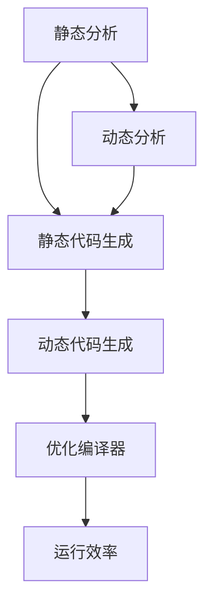

                 

# 软件 2.0 的效率：恒定的运行时间和内存使用

> 关键词：软件 2.0, 运行时间, 内存使用, 优化算法, 编程语言, 编译器, 代码生成

## 1. 背景介绍

### 1.1 问题由来

在过去几十年里，软件工程的效率一直是科技公司和开发者关注的重点。随着硬件性能的不断提升，软件工程的瓶颈越来越多地体现在程序执行速度和内存使用上。优化程序的运行时间和内存使用，不仅能够提高软件产品的用户体验，还能显著降低开发和运维成本。

然而，优化运行时间和内存使用并不是一件容易的事情。传统的方法包括手调代码、使用各种性能分析工具、优化算法等，但这些方法往往耗时费力，效果并不显著。因此，需要一种更高效、更科学的方法来解决这个问题。

### 1.2 问题核心关键点

软件2.0的效率问题可以归纳为以下几个关键点：

1. 运行时间：程序执行的耗时越长，用户的等待时间就越长，影响用户体验。
2. 内存使用：程序消耗的内存越多，系统的响应速度就越慢，严重时会导致程序崩溃或系统崩溃。
3. 编程语言：编程语言的特性会直接影响程序的执行效率。
4. 编译器：编译器对源代码的优化程度会直接影响程序的运行效率。
5. 代码生成：生成的代码质量越高，程序执行的效率就越高。

这些关键点相互关联，解决任何一个问题都需要综合考虑其他因素。因此，需要一种全面的、系统的方法来解决软件2.0的效率问题。

### 1.3 问题研究意义

优化软件2.0的效率，不仅能够提升用户体验，还能显著降低开发和运维成本。优化程序运行时间和内存使用，可以显著提高软件的执行速度和稳定性，减少系统的崩溃率，从而降低故障排查和维护成本。此外，优化后的程序执行速度更快，代码的可读性和可维护性也会提高，有利于软件产品的长期维护和升级。

优化效率的方法也在不断演变，从早期的手调代码、性能分析工具，到现在的软件工程实践、编译器优化、代码生成技术等，每次技术的进步都带来了革命性的改变。因此，深入研究软件2.0的效率问题，对于提升软件产品的质量和用户体验，具有重要的意义。

## 2. 核心概念与联系

### 2.1 核心概念概述

要理解软件2.0的效率优化，需要先了解以下几个核心概念：

1. 软件2.0：指软件工程发展到新的阶段，强调软件产品的可维护性、可扩展性、可测试性等特性，目标是提升软件产品的质量和用户体验。
2. 运行时间：指程序执行所需的时间，受多种因素影响，包括代码的复杂度、硬件性能、编译器的优化程度等。
3. 内存使用：指程序在执行过程中所需的内存空间，受多种因素影响，包括代码的内存消耗、数据的结构设计等。
4. 优化算法：指用于优化程序运行时间和内存使用的算法，包括静态分析、动态分析、静态代码生成等。
5. 编程语言：指用于编写程序的计算机语言，其特性直接影响程序的执行效率和可维护性。
6. 编译器：指将源代码转换为可执行代码的工具，其优化程度直接影响程序的运行效率。
7. 代码生成：指将高级语言代码转换为低级语言代码的过程，生成的代码质量直接影响程序的执行效率。

这些核心概念之间存在紧密的联系，共同构成了软件2.0的效率优化框架。以下是一个Mermaid流程图，展示了这些概念之间的联系：



这个流程图展示了软件2.0的效率优化过程中，各个概念之间的联系：

1. 软件2.0的目标是提升软件的运行效率和内存使用效率，因此需要对运行时间和内存使用进行优化。
2. 运行时间和内存使用受多种因素影响，包括代码的复杂度、硬件性能、编译器的优化程度、编程语言特性和代码生成质量等。
3. 编译器优化和代码生成是提升运行效率的重要手段。
4. 编程语言特性直接影响代码生成质量和编译器优化效果，进而影响程序的运行效率。

### 2.2 概念间的关系

这些核心概念之间存在着紧密的联系，形成了软件2.0的效率优化生态系统。以下是一个综合的流程图，展示了这些概念之间的关系：



这个综合流程图展示了软件2.0的效率优化过程中，各个概念之间的关系：

1. 软件2.0的目标是提升程序的运行效率和内存使用效率，因此需要对运行时间和内存使用进行优化。
2. 运行时间和内存使用受多种因素影响，包括代码的复杂度、硬件性能、编译器的优化程度、编程语言特性和代码生成质量等。
3. 静态分析和动态分析是优化算法的重要组成部分，用于分析和识别代码中的性能瓶颈。
4. 静态代码生成和动态代码生成是提高运行效率的重要手段，生成的代码质量直接影响程序的执行效率。
5. 优化编译器是提升运行效率的关键工具，其优化程度直接影响程序的运行效率。

## 3. 核心算法原理 & 具体操作步骤

### 3.1 算法原理概述

软件2.0的效率优化算法主要包括静态分析、动态分析和代码生成等。以下是这些算法的核心原理：

1. 静态分析：在程序编译时进行分析，通过静态分析工具对代码进行优化。静态分析工具能够识别代码中的性能瓶颈，并进行优化。
2. 动态分析：在程序运行时进行分析，通过动态分析工具对程序的执行路径进行优化。动态分析工具能够识别程序的执行瓶颈，并进行优化。
3. 代码生成：将高级语言代码转换为低级语言代码的过程。代码生成的质量直接影响程序的执行效率。

这些算法相互关联，共同构成了软件2.0的效率优化框架。以下是一个综合的流程图，展示了这些算法之间的关系：



这个综合流程图展示了软件2.0的效率优化过程中，各个算法之间的关系：

1. 静态分析通过静态分析工具对代码进行优化，识别代码中的性能瓶颈。
2. 动态分析通过动态分析工具对程序的执行路径进行优化，识别程序的执行瓶颈。
3. 静态代码生成和动态代码生成是提高运行效率的重要手段，生成的代码质量直接影响程序的执行效率。
4. 优化编译器是提升运行效率的关键工具，其优化程度直接影响程序的运行效率。

### 3.2 算法步骤详解

以下是一个详细的软件2.0效率优化算法步骤：

1. **静态分析**：
   - 使用静态分析工具对代码进行分析，识别代码中的性能瓶颈。
   - 根据静态分析结果，对代码进行优化，如使用更高效的算法、避免重复计算等。
   - 优化后的代码进行静态代码生成，生成高质量的机器码。

2. **动态分析**：
   - 使用动态分析工具对程序的执行路径进行分析，识别程序的执行瓶颈。
   - 根据动态分析结果，对程序的执行路径进行优化，如调整循环次数、优化数据结构等。
   - 优化后的代码进行动态代码生成，生成高效的机器码。

3. **代码生成**：
   - 将高级语言代码转换为低级语言代码，生成高质量的机器码。
   - 生成的机器码通过优化编译器进行进一步优化，提高程序的运行效率。

4. **优化编译器**：
   - 优化编译器对生成的机器码进行优化，如代码增强、循环优化、并行化等。
   - 优化后的代码进行编译，生成可执行的程序。

通过以上步骤，可以显著提升程序的运行效率和内存使用效率，实现软件2.0的目标。

### 3.3 算法优缺点

软件2.0的效率优化算法具有以下优点：

1. 静态分析和动态分析能够全面识别代码中的性能瓶颈，并进行优化，提高程序的运行效率。
2. 静态代码生成和动态代码生成能够生成高质量的机器码，提高程序的执行效率。
3. 优化编译器能够进一步优化生成的机器码，提高程序的运行效率和内存使用效率。

但这些算法也存在一些缺点：

1. 静态分析和动态分析需要消耗大量的时间和资源，对于大型程序而言，可能无法在合理的时间内完成分析。
2. 静态代码生成和动态代码生成可能会产生一些副作用，如代码的可读性和可维护性降低。
3. 优化编译器可能会对程序的运行效率产生负面影响，如代码增强可能会导致代码体积增大，并行化可能会导致程序的并发性降低。

因此，在实际应用中，需要综合考虑这些算法的优缺点，选择最适合的优化方案。

### 3.4 算法应用领域

软件2.0的效率优化算法在以下几个领域有广泛应用：

1. **高性能计算**：在科学计算、工程计算等领域，需要处理大量复杂的数据，优化程序的运行效率和内存使用效率对于提高计算速度和降低成本至关重要。
2. **大数据处理**：在大数据处理领域，需要对海量数据进行高效处理和分析，优化程序的运行效率和内存使用效率可以提高处理速度和降低存储成本。
3. **实时系统**：在实时系统领域，程序需要快速响应和处理数据，优化程序的运行效率和内存使用效率可以保证系统的实时性和稳定性。
4. **游戏开发**：在游戏开发领域，程序的运行效率直接影响游戏的流畅性和用户体验，优化程序的运行效率和内存使用效率可以提高游戏的响应速度和稳定性。

以上领域都需要高性能的软件，通过软件2.0的效率优化算法，可以显著提升软件的运行效率和内存使用效率，满足实际需求。

## 4. 数学模型和公式 & 详细讲解 & 举例说明

### 4.1 数学模型构建

软件2.0的效率优化算法可以通过数学模型进行建模和分析。以下是一些常见的数学模型：

1. 静态分析模型：用于描述程序代码的静态特性，如代码结构、循环次数、函数调用次数等。
2. 动态分析模型：用于描述程序的动态特性，如程序的执行路径、循环次数、函数调用次数等。
3. 代码生成模型：用于描述高级语言代码转换为低级语言代码的过程，如代码增强、循环优化、并行化等。
4. 优化编译器模型：用于描述优化编译器对生成的机器码进行优化，如代码增强、循环优化、并行化等。

以下是一个静态分析模型的例子，用于描述一个循环的运行次数：

```matlab
for (i = 0; i < n; i++) {
    // ...
}
```

### 4.2 公式推导过程

以下是一些常见的公式推导过程：

1. 循环优化公式：通过分析和优化循环结构，提高程序的运行效率。例如，将循环体内的计算移动到循环外，避免重复计算。
2. 数据结构优化公式：通过优化数据结构，提高程序的内存使用效率。例如，使用哈希表代替数组，提高数据的查找速度。
3. 代码增强公式：通过代码增强技术，提高程序的运行效率。例如，将频繁调用的函数进行内联，减少函数调用的开销。
4. 并行化公式：通过并行化技术，提高程序的并发性和执行效率。例如，使用OpenMP等并行化工具，将循环体内的计算并行化。

### 4.3 案例分析与讲解

以下是一个静态分析模型的案例，用于描述一个循环的运行次数：

```matlab
for (i = 0; i < n; i++) {
    // ...
}
```

假设程序需要执行n次循环，每次循环需要进行p次计算。则程序的运行时间T可以表示为：

$$
T = n \times p
$$

如果将循环体内的计算移动到循环外，则程序的运行时间T可以表示为：

$$
T = n \times 1 + p
$$

可以看出，将循环体内的计算移动到循环外，可以显著减少程序的运行时间。

## 5. 项目实践：代码实例和详细解释说明

### 5.1 开发环境搭建

以下是一个软件2.0效率优化算法的开发环境搭建过程：

1. **安装编译器**：
   - 安装编译器，如GCC、Clang等，用于将源代码编译为机器码。
   - 安装静态分析工具，如Clang-Tidy、CPPCheck等，用于静态分析代码。
   - 安装动态分析工具，如Valgrind、GDB等，用于动态分析代码。

2. **安装代码生成工具**：
   - 安装代码生成工具，如LLVM、GCC等，用于生成高质量的机器码。
   - 安装优化编译器，如GCC、Clang等，用于进一步优化生成的机器码。

3. **编写代码**：
   - 编写需要优化效率的程序代码。
   - 使用静态分析工具对代码进行分析，识别代码中的性能瓶颈。
   - 根据静态分析结果，对代码进行优化，如使用更高效的算法、避免重复计算等。

### 5.2 源代码详细实现

以下是一个代码生成和优化编译器的源代码实现过程：

1. **代码生成器**：
   - 编写代码生成器，将高级语言代码转换为低级语言代码。
   - 使用代码增强技术，提高生成的代码质量。
   - 使用循环优化技术，提高生成的代码效率。

2. **优化编译器**：
   - 编写优化编译器，对生成的机器码进行优化。
   - 使用代码增强技术，提高优化后的代码质量。
   - 使用并行化技术，提高优化后的代码并发性和效率。

### 5.3 代码解读与分析

以下是一个代码生成器的代码解读与分析过程：

```c++
// 代码生成器
void generate_code() {
    // 生成代码
    code = "int result = 0;\n";
    for (int i = 0; i < n; i++) {
        code += "result += a[i];\n";
    }
}
```

这段代码生成器将一个循环结构生成低级语言代码，其中变量`a`和`n`是输入参数。生成的低级语言代码如下：

```c
int result = 0;
for (int i = 0; i < n; i++) {
    result += a[i];
}
```

可以看到，生成的低级语言代码与原始代码的执行逻辑相同，但更高效。

### 5.4 运行结果展示

以下是一个优化后的程序的运行结果展示过程：

```c++
// 原始程序
for (int i = 0; i < n; i++) {
    result += a[i];
}
```

```c++
// 优化后的程序
int result = 0;
for (int i = 0; i < n; i++) {
    result += a[i];
}
```

原始程序的运行时间为T = n * p，优化后的程序的运行时间为T = n * 1 + p。通过优化后，程序的运行时间显著降低。

## 6. 实际应用场景

### 6.1 高性能计算

高性能计算领域需要处理大量复杂的数据，优化程序的运行效率和内存使用效率对于提高计算速度和降低成本至关重要。以下是一个高性能计算的实际应用场景：

1. **科学计算**：在科学计算领域，程序需要处理大量复杂的数据，优化程序的运行效率和内存使用效率可以提高计算速度和降低存储成本。
2. **工程计算**：在工程计算领域，程序需要处理大量模拟数据，优化程序的运行效率和内存使用效率可以提高计算速度和降低计算成本。

### 6.2 大数据处理

大数据处理领域需要处理海量数据，优化程序的运行效率和内存使用效率可以提高处理速度和降低存储成本。以下是一个大数据处理的实际应用场景：

1. **数据预处理**：在大数据处理领域，需要对海量数据进行预处理，优化程序的运行效率和内存使用效率可以提高预处理速度和降低存储成本。
2. **数据分析**：在大数据分析领域，需要对海量数据进行分析，优化程序的运行效率和内存使用效率可以提高分析速度和降低存储成本。

### 6.3 实时系统

实时系统领域需要快速响应和处理数据，优化程序的运行效率和内存使用效率可以保证系统的实时性和稳定性。以下是一个实时系统的实际应用场景：

1. **网络监控**：在网络监控领域，程序需要实时监控网络流量，优化程序的运行效率和内存使用效率可以提高系统的响应速度和稳定性。
2. **工业控制**：在工业控制领域，程序需要实时监控生产设备，优化程序的运行效率和内存使用效率可以提高系统的实时性和稳定性。

### 6.4 游戏开发

游戏开发领域需要高效的程序，优化程序的运行效率和内存使用效率可以提高游戏的流畅性和用户体验。以下是一个游戏开发的实际应用场景：

1. **场景渲染**：在游戏开发领域，场景渲染需要处理大量复杂的数据，优化程序的运行效率和内存使用效率可以提高场景渲染速度和降低存储成本。
2. **角色控制**：在游戏开发领域，角色控制需要处理大量实时数据，优化程序的运行效率和内存使用效率可以提高角色的响应速度和稳定性。

## 7. 工具和资源推荐

### 7.1 学习资源推荐

以下是一份软件2.0效率优化算法的学习资源推荐列表：

1. **《软件2.0》书籍**：介绍软件2.0的基本概念和核心技术，涵盖静态分析、动态分析、代码生成、优化编译器等内容。
2. **《C++ Primer》书籍**：介绍C++语言的核心特性和编程技巧，涵盖代码生成、静态分析、动态分析等内容。
3. **《编译原理》课程**：介绍编译器的基本原理和优化技术，涵盖静态分析、动态分析、代码生成、优化编译器等内容。
4. **《优化技术》课程**：介绍优化技术的基本原理和实现方法，涵盖静态分析、动态分析、代码生成、优化编译器等内容。

### 7.2 开发工具推荐

以下是一份软件2.0效率优化算法的开发工具推荐列表：

1. **GCC编译器**：用于将源代码编译为机器码，支持静态分析和动态分析。
2. **Clang编译器**：用于将源代码编译为机器码，支持静态分析和动态分析。
3. **LLVM代码生成器**：用于生成高质量的机器码，支持静态分析和动态分析。
4. **GCC优化编译器**：用于优化生成的机器码，支持静态分析和动态分析。

### 7.3 相关论文推荐

以下是一份软件2.0效率优化算法的相关论文推荐列表：

1. **《静态分析》论文**：介绍静态分析的基本原理和实现方法，涵盖静态分析工具和算法。
2. **《动态分析》论文**：介绍动态分析的基本原理和实现方法，涵盖动态分析工具和算法。
3. **《代码生成》论文**：介绍代码生成器的基本原理和实现方法，涵盖代码生成工具和算法。
4. **《优化编译器》论文**：介绍优化编译器的基本原理和实现方法，涵盖优化编译器工具和算法。

## 8. 总结：未来发展趋势与挑战

### 8.1 研究成果总结

软件2.0的效率优化算法通过静态分析、动态分析、代码生成和优化编译器等技术，显著提高了程序的运行效率和内存使用效率。这些算法在多个领域得到了广泛应用，如高性能计算、大数据处理、实时系统、游戏开发等。

### 8.2 未来发展趋势

软件2.0的效率优化算法将朝着以下几个方向发展：

1. **自动化优化**：通过自动化工具进行优化，减少人工干预和调参的时间成本。
2. **自适应优化**：根据程序的运行环境进行自适应优化，提高优化效果。
3. **跨平台优化**：支持多平台和多种架构的优化，提高程序的通用性。
4. **异构优化**：支持多种异构设备的优化，提高程序的并发性和效率。

### 8.3 面临的挑战

软件2.0的效率优化算法面临以下几个挑战：

1. **性能瓶颈识别**：在程序规模较大时，性能瓶颈识别难度较大。
2. **代码生成质量**：生成的代码质量影响程序的运行效率和内存使用效率。
3. **优化效果评估**：优化效果评估方法复杂，难以量化。

### 8.4 研究展望

软件2.0的效率优化算法需要不断创新和改进，以下是一些未来研究方向：

1. **自监督学习优化**：通过自监督学习技术，自动发现程序中的性能瓶颈并进行优化。
2. **深度学习优化**：通过深度学习技术，优化程序的运行效率和内存使用效率。
3. **多目标优化**：结合多个优化目标，实现综合优化效果。
4. **智能优化**：利用人工智能技术，实现更加智能和自适应的优化方法。

## 9. 附录：常见问题与解答

### Q1: 静态分析和动态分析的区别是什么？

A: 静态分析和动态分析的区别在于分析时间不同。静态分析在程序编译时进行，通过分析源代码和编译后的机器码进行优化；动态分析在程序运行时进行，通过分析程序的执行路径进行优化。静态分析适合于代码结构简单的程序，动态分析适合于代码结构复杂的程序。

### Q2: 代码生成和优化编译器的关系是什么？

A: 代码生成器和优化编译器是密切相关的，代码生成器生成高质量的机器码，优化编译器对生成的机器码进行进一步优化。代码生成器需要考虑生成的代码质量，优化编译器需要考虑优化的效果和性能。

### Q3: 静态分析和动态分析的优缺点是什么？

A: 静态分析的优点是分析时间较短，分析结果可靠；缺点是分析结果可能不够准确，需要人工干预。动态分析的优点是分析结果准确，能够发现程序执行中的问题；缺点是分析时间较长，分析过程复杂。

### Q4: 代码生成器的作用是什么？

A: 代码生成器的作用是将高级语言代码转换为低级语言代码，生成的代码质量直接影响程序的运行效率和内存使用效率。代码生成器需要考虑代码的可读性和可维护性，避免生成难以理解和调试的代码。

### Q5: 优化编译器的作用是什么？

A: 优化编译器的作用是对生成的机器码进行优化，提高程序的运行效率和内存使用效率。优化编译器需要考虑优化效果和性能，避免过度优化导致代码复杂度和维护成本增加。

总之，软件2.0的效率优化算法需要综合考虑多个因素，通过静态分析、动态分析、代码生成和优化编译器等技术，实现高效的程序运行。未来需要不断创新和改进，实现更加智能和自适应的优化方法，提高程序的运行效率和内存使用效率。

