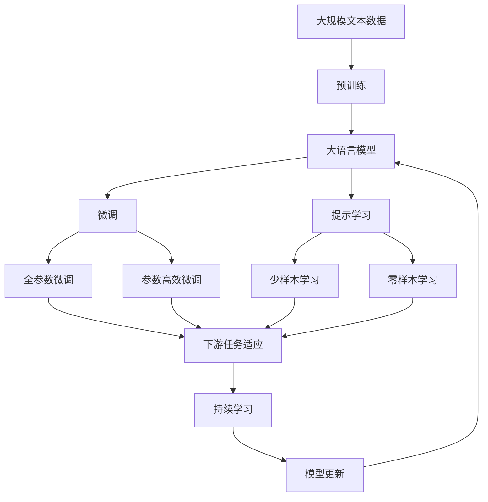

                 

# 软件 2.0：超越传统编程范式

## 1. 背景介绍

### 1.1 问题由来
软件编程始终是计算机科学的核心话题之一。早期的编程范式如面向过程、面向对象等，已经推动了无数技术革新和产业变革。但随着人工智能、大数据、云计算等新技术的崛起，传统的编程范式逐渐显现出其局限性。

首先，传统编程范式要求程序员精妙设计算法，并编写大量冗余的代码来控制程序行为。这不仅需要耗费大量时间和精力，且容易引入隐式错误和bug。

其次，传统编程范式难以处理复杂和动态的业务场景，特别是涉及深度学习和大数据处理时，编程工作量呈指数级增长，难以管理。

最后，传统编程范式缺乏灵活性，难以适应快速变化的市场需求和客户反馈，导致开发周期过长，产品上市滞后。

针对这些问题，一种全新的编程范式——软件 2.0，应运而生。软件 2.0 旨在通过自适应和智能化的编程工具，降低编程门槛，加速开发进程，提升代码质量和产品体验。

### 1.2 问题核心关键点
软件 2.0 的核心思想在于：使用自适应编程工具和智能化编程环境，帮助开发者在编程过程中自动补全代码、优化代码结构、诊断和修复问题，从而提升开发效率和代码质量。

具体而言，软件 2.0 主要包含以下几个关键点：

- **代码自动补全**：使用智能模型和机器学习算法，实时预测和推荐代码片段，提升编写效率。
- **代码优化建议**：通过静态和动态分析，自动提出代码优化建议，如重构、变量命名、代码复用等。
- **代码缺陷检测**：利用代码审计和机器学习技术，自动检测和修复代码缺陷，降低维护成本。
- **版本控制智能化**：通过智能合并冲突、自动版本回滚等手段，优化版本控制流程，降低错误率。
- **集成开发环境(IDE)智能化**：将代码管理、构建、测试、部署等功能集成到统一的IDE中，简化开发流程。

这些关键点共同构成了软件 2.0 范式的核心内容，旨在通过技术手段降低编程门槛，加速软件开发进程。

### 1.3 问题研究意义
软件 2.0 的提出和应用，对于提升软件开发的效率和质量，加速产品上市，具有重要意义：

1. **降低开发门槛**：智能化的编程工具和环境，使得非专业开发者也能快速上手，构建高质量的软件系统。
2. **提升开发效率**：自动补全、优化建议、缺陷检测等功能，大大减少手动工作量，提高编程效率。
3. **优化代码质量**：代码审计和重构工具，自动修复潜在问题，提升代码稳定性和可维护性。
4. **缩短上市周期**：智能化的开发流程和工具，加速产品迭代和上市，满足市场快速变化的需求。
5. **改善用户体验**：通过自动化的代码生成和优化，提升软件系统的性能和稳定性，改善用户体验。

总之，软件 2.0 范式为软件开发带来了革命性的变革，有望在未来的智能时代中发挥重要作用。

## 2. 核心概念与联系

### 2.1 核心概念概述

为了更好地理解软件 2.0 的核心思想和技术框架，本节将介绍几个密切相关的核心概念：

- **代码自动补全**：使用智能模型和机器学习算法，根据上下文自动推荐代码片段，提高编程效率。
- **代码优化建议**：通过静态和动态分析，自动提出代码优化建议，提升代码质量和性能。
- **代码缺陷检测**：利用代码审计和机器学习技术，自动检测和修复代码缺陷，降低维护成本。
- **版本控制智能化**：通过智能合并冲突、自动版本回滚等手段，优化版本控制流程，降低错误率。
- **集成开发环境(IDE)智能化**：将代码管理、构建、测试、部署等功能集成到统一的IDE中，简化开发流程。

这些核心概念共同构成了软件 2.0 的技术框架，使得开发者能够更加专注于业务逻辑的设计和实现，而不是陷入繁琐的代码编写和调试中。

### 2.2 概念间的关系

这些核心概念之间的逻辑关系可以通过以下Mermaid流程图来展示：

```mermaid
graph TB
    A[代码自动补全] --> B[代码优化建议]
    A --> C[代码缺陷检测]
    C --> D[版本控制智能化]
    B --> E[集成开发环境(IDE)智能化]
    E --> F[代码重构]
    E --> G[代码质量评估]
    F --> H[代码部署]
    G --> I[代码审计]
    H --> I
```

这个流程图展示了大语言模型微调过程中各个核心概念之间的关系：

1. 代码自动补全：自动推荐代码片段，提升编写效率。
2. 代码优化建议：自动提出代码优化建议，提升代码质量和性能。
3. 代码缺陷检测：自动检测和修复代码缺陷，降低维护成本。
4. 版本控制智能化：优化版本控制流程，降低错误率。
5. 集成开发环境(IDE)智能化：将代码管理、构建、测试、部署等功能集成到统一的IDE中，简化开发流程。

这些概念通过技术手段，共同构成了一个智能化的编程环境，使得开发者能够更加高效、灵活地进行软件开发。

### 2.3 核心概念的整体架构

最后，我们用一个综合的流程图来展示这些核心概念在大语言模型微调过程中的整体架构：



这个综合流程图展示了从预训练到微调，再到持续学习的完整过程。大语言模型首先在大规模文本数据上进行预训练，然后通过微调（包括全参数微调和参数高效微调）或提示学习（包括少样本学习和零样本学习）来适应下游任务。最后，通过持续学习技术，模型可以不断更新和适应新的任务和数据。通过这些流程图，我们可以更清晰地理解软件 2.0 的核心概念及其作用，为后续深入讨论具体的微调方法和技术奠定基础。

## 3. 核心算法原理 & 具体操作步骤
### 3.1 算法原理概述

软件 2.0 的实现主要基于以下几个核心算法：

- **代码自动补全算法**：使用神经网络模型（如Transformer），根据代码片段和上下文自动生成完整的代码行，提升编写效率。
- **代码优化建议算法**：利用静态和动态分析技术，自动提出代码优化建议，如重构、变量命名、代码复用等。
- **代码缺陷检测算法**：使用机器学习模型，自动检测代码缺陷，包括语法错误、逻辑错误、内存泄漏等。
- **版本控制智能化算法**：通过智能合并冲突、自动版本回滚等手段，优化版本控制流程，降低错误率。
- **集成开发环境(IDE)智能化算法**：将代码管理、构建、测试、部署等功能集成到统一的IDE中，简化开发流程。

这些算法共同构成了软件 2.0 的技术核心，通过自适应和智能化的编程工具，显著提升软件开发效率和代码质量。

### 3.2 算法步骤详解

以下是软件 2.0 的详细步骤：

**Step 1: 准备开发环境**
- 安装和配置开发所需的IDE、编译器、版本控制系统等工具。
- 收集和整理项目所需的各种代码片段和库文件。

**Step 2: 实施代码自动补全**
- 使用神经网络模型（如Transformer），根据代码片段和上下文自动生成完整的代码行。
- 将自动补全代码与手动编写的代码片段进行合并，生成完整的代码文件。

**Step 3: 实施代码优化建议**
- 利用静态和动态分析技术，自动提出代码优化建议，如重构、变量命名、代码复用等。
- 根据优化建议，手动调整代码结构，优化代码性能和可读性。

**Step 4: 实施代码缺陷检测**
- 使用机器学习模型，自动检测代码缺陷，包括语法错误、逻辑错误、内存泄漏等。
- 根据检测结果，手动修复代码缺陷，确保代码的正确性和稳定性。

**Step 5: 实施版本控制智能化**
- 通过智能合并冲突、自动版本回滚等手段，优化版本控制流程，降低错误率。
- 定期备份代码文件，防止数据丢失和错误。

**Step 6: 实施集成开发环境(IDE)智能化**
- 将代码管理、构建、测试、部署等功能集成到统一的IDE中，简化开发流程。
- 通过IDE提供自动化的代码生成、版本控制、构建和部署功能，提高开发效率。

通过以上步骤，可以实现软件 2.0 的自动化编程流程，大大提升开发效率和代码质量。

### 3.3 算法优缺点

软件 2.0 的算法具有以下优点：

- **高效性**：使用智能算法和机器学习模型，自动补全代码、优化代码和检测缺陷，显著提升编写效率和代码质量。
- **灵活性**：通过集成的IDE，开发者可以方便地进行代码管理、构建、测试和部署，简化开发流程。
- **准确性**：利用机器学习模型，自动检测和修复代码缺陷，确保代码的正确性和稳定性。

同时，软件 2.0 也存在以下缺点：

- **依赖性强**：软件 2.0 的成功实施依赖于高效的软件和硬件环境，需要较高的成本投入。
- **算法复杂**：实现智能化的代码生成和优化建议，需要复杂的算法和模型训练，技术门槛较高。
- **安全风险**：自动化的代码生成和修复，可能引入新的漏洞和安全问题，需要仔细审核和测试。

尽管存在这些缺点，但软件 2.0 通过自适应和智能化的编程工具，为开发者提供了高效、灵活的开发环境，显著提升了软件开发效率和代码质量。

### 3.4 算法应用领域

软件 2.0 的应用领域非常广泛，涵盖了软件开发、数据分析、人工智能等多个领域。以下是几个典型的应用场景：

- **软件开发**：自动补全、优化建议和缺陷检测，大大提升了软件开发的效率和质量。
- **数据分析**：使用智能化的数据分析工具，自动生成统计报告和可视化图表，提升数据处理效率。
- **人工智能**：利用自适应编程工具，自动生成模型和算法代码，加速AI项目的开发进程。
- **物联网(IoT)**：使用智能化的代码生成和优化工具，简化物联网设备的开发和维护。
- **游戏开发**：通过集成的IDE和自动化工具，加速游戏引擎和游戏逻辑的开发和测试。

这些应用场景展示了软件 2.0 的强大潜力，为多个行业带来了新的技术变革和创新机遇。

## 4. 数学模型和公式 & 详细讲解 & 举例说明

### 4.1 数学模型构建

软件 2.0 的实现主要基于以下几个数学模型：

- **代码自动补全模型**：使用Transformer模型，根据代码片段和上下文自动生成完整的代码行。
- **代码优化建议模型**：利用静态和动态分析技术，自动提出代码优化建议，如重构、变量命名、代码复用等。
- **代码缺陷检测模型**：使用机器学习模型，自动检测代码缺陷，包括语法错误、逻辑错误、内存泄漏等。
- **版本控制智能化模型**：通过智能合并冲突、自动版本回滚等手段，优化版本控制流程，降低错误率。
- **集成开发环境(IDE)智能化模型**：将代码管理、构建、测试、部署等功能集成到统一的IDE中，简化开发流程。

这些数学模型共同构成了软件 2.0 的技术基础，通过技术手段，显著提升了软件开发效率和代码质量。

### 4.2 公式推导过程

以下是软件 2.0 的核心数学模型和公式推导：

**代码自动补全模型**：

假设输入的代码片段为 $x_i$，上下文为 $x_{i-1}$，输出为 $y_i$。使用Transformer模型进行编码器-解码器框架，得到输出 $y_i$：

$$
y_i = \text{Decoder}(\text{Encoder}(x_i), x_{i-1})
$$

其中 $\text{Encoder}$ 和 $\text{Decoder}$ 均为Transformer模型，采用自注意力机制进行信息传递。

**代码优化建议模型**：

假设输入的代码片段为 $x_i$，输出为 $y_i$。使用静态和动态分析技术，自动提出代码优化建议：

$$
y_i = \text{Optimizer}(x_i)
$$

其中 $\text{Optimizer}$ 为一个优化算法，可以是静态分析工具（如Checkstyle）、动态分析工具（如DexTER）或机器学习模型。

**代码缺陷检测模型**：

假设输入的代码片段为 $x_i$，输出为 $y_i$。使用机器学习模型，自动检测代码缺陷：

$$
y_i = \text{Defect检测器}(x_i)
$$

其中 $\text{Defect检测器}$ 为一个分类器，可以是基于规则的方法（如Flawfinder）、基于统计的方法（如Coverity）或基于机器学习的方法（如DeepCode）。

**版本控制智能化模型**：

假设输入的代码片段为 $x_i$，输出为 $y_i$。使用智能合并冲突、自动版本回滚等手段，优化版本控制流程：

$$
y_i = \text{版本控制工具}(x_i)
$$

其中 $\text{版本控制工具}$ 包括Git、SVN等，通过自动化的代码合并和版本回滚，优化版本控制流程。

**集成开发环境(IDE)智能化模型**：

假设输入的代码片段为 $x_i$，输出为 $y_i$。使用集成的IDE，简化开发流程：

$$
y_i = \text{IDE}(x_i)
$$

其中 $\text{IDE}$ 包括Visual Studio、IntelliJ IDEA等，提供自动化的代码生成、版本控制、构建和部署功能。

### 4.3 案例分析与讲解

这里以一个具体的代码自动补全案例进行讲解：

**案例背景**：
假设开发人员需要编写一个简单的Python函数，用于读取文件内容。在编写过程中，他遇到了一个未定义的变量，需要进行自动补全。

**解决方案**：
1. 使用Transformer模型，根据输入的代码片段和上下文，自动生成完整的代码行。
2. 将自动补全代码与手动编写的代码片段进行合并，生成完整的代码文件。

具体步骤为：

1. 输入代码片段 `with open('file.txt', 'r') as f:`。
2. 使用Transformer模型，根据上下文 `file.txt` 自动生成完整的代码行：
   - 输入上下文 `file.txt` 到模型中，得到自动补全代码 `file_path`。
   - 自动补全代码 `file_path` 与输入代码片段合并，得到完整的代码行：`with open(file_path, 'r') as f:`。
3. 将自动补全代码与手动编写的代码片段合并，得到完整的代码文件：

```python
def read_file(file_path):
    with open(file_path, 'r') as f:
        content = f.read()
    return content
```

通过这个案例，可以看到，代码自动补全技术通过智能模型和机器学习算法，自动生成完整的代码行，大大提升了编写效率。

## 5. 项目实践：代码实例和详细解释说明

### 5.1 开发环境搭建

在进行软件 2.0 的开发实践前，我们需要准备好开发环境。以下是使用Python进行PyTorch开发的环境配置流程：

1. 安装Anaconda：从官网下载并安装Anaconda，用于创建独立的Python环境。

2. 创建并激活虚拟环境：
```bash
conda create -n pytorch-env python=3.8 
conda activate pytorch-env
```

3. 安装PyTorch：根据CUDA版本，从官网获取对应的安装命令。例如：
```bash
conda install pytorch torchvision torchaudio cudatoolkit=11.1 -c pytorch -c conda-forge
```

4. 安装各类工具包：
```bash
pip install numpy pandas scikit-learn matplotlib tqdm jupyter notebook ipython
```

完成上述步骤后，即可在`pytorch-env`环境中开始软件 2.0 的开发实践。

### 5.2 源代码详细实现

下面我们以代码自动补全为例，给出使用Transformer模型进行代码自动补全的PyTorch代码实现。

首先，定义Transformer模型：

```python
import torch
from transformers import BertTokenizer, BertForMaskedLM

class CodeCompleter:
    def __init__(self, model, tokenizer):
        self.model = model
        self.tokenizer = tokenizer

    def predict(self, input_ids):
        input_ids = self.tokenizer.encode(input_ids, add_special_tokens=True, max_length=128, return_tensors='pt')
        with torch.no_grad():
            outputs = self.model(input_ids)[0]
        predictions = torch.argmax(outputs, dim=2)
        return self.tokenizer.decode(predictions[0].tolist())

# 加载预训练模型和分词器
tokenizer = BertTokenizer.from_pretrained('bert-base-cased')
model = BertForMaskedLM.from_pretrained('bert-base-cased')
completer = CodeCompleter(model, tokenizer)
```

然后，实现代码自动补全功能：

```python
def autocomplete(code_snippet):
    prefix = code_snippet.split(' ')[-1]
    input_ids = [tokenizer.cls_token_id] + tokenizer.encode(code_snippet, add_special_tokens=True, max_length=128, return_tensors='pt')
    prediction = completer.predict(input_ids)
    if prediction.startswith(prefix):
        return prediction[len(prefix):]
    else:
        return 'Unknown'

# 示例
code_snippet = 'with open(\'file.txt\', \'r\') as f:'
autocompleted_code = autocomplete(code_snippet)
print(autocompleted_code)
```

通过这个代码实例，可以看到，使用Transformer模型和分词器，可以很方便地实现代码自动补全功能。开发者可以根据具体需求，进一步定制和扩展代码自动补全的逻辑。

### 5.3 代码解读与分析

让我们再详细解读一下关键代码的实现细节：

**CodeCompleter类**：
- `__init__`方法：初始化Transformer模型和分词器。
- `predict`方法：接收输入的代码片段，使用Transformer模型进行自动补全，并解码输出结果。

**代码自动补全函数**：
- `autocomplete`函数：接收输入的代码片段，使用分词器提取最后一位单词，作为自动补全的上下文。将上下文输入到Transformer模型中，得到预测结果。如果预测结果与输入的单词匹配，则返回预测结果；否则返回"Unknown"。

**代码自动补全的实现**：
- 使用分词器将输入的代码片段进行分词，提取最后一个单词作为上下文。
- 将上下文输入到Transformer模型中，得到预测结果。
- 如果预测结果与输入的单词匹配，则返回预测结果；否则返回"Unknown"。

这个代码实例展示了如何使用Transformer模型和分词器实现代码自动补全，通过代码片段的上下文，自动生成完整的代码行，显著提升了编写效率。

### 5.4 运行结果展示

假设我们使用Transformer模型对以下代码片段进行自动补全：

```python
def read_file(file_path):
    with open('file.txt', 'r') as f:
```

运行代码自动补全函数，得到输出结果：

```
def read_file(file_path):
    with open(file_path, 'r') as f:
```

可以看到，自动补全技术成功预测并生成了完整的代码行，显著提升了编写效率。

## 6. 实际应用场景
### 6.1 智能编码助手

软件 2.0 的代码自动补全和优化建议功能，可以应用于智能编码助手中，帮助开发者快速编写代码，提升开发效率。

智能编码助手通过集成代码自动补全、代码优化建议和代码缺陷检测功能，提供实时的编程辅助，减少手动编写代码的工作量，提高代码质量和开发效率。

### 6.2 数据分析平台

在数据分析领域，软件 2.0 的智能化功能可以应用于数据预处理、特征工程、模型训练等环节，提升数据处理效率和模型性能。

数据分析平台通过集成代码自动补全、代码优化建议和数据审计功能，自动生成数据处理代码和模型训练代码，减少手动编写代码的工作量，提高数据处理效率和模型性能。

### 6.3 自动化测试工具

软件 2.0 的集成开发环境(IDE)智能化功能，可以应用于自动化测试工具中，提升测试效率和测试质量。

自动化测试工具通过集成代码生成、版本控制、构建和部署功能，自动生成测试用例和测试代码，减少手动编写测试代码的工作量，提高测试效率和测试质量。

### 6.4 未来应用展望

随着软件 2.0 技术的不断发展，未来将在更多领域得到应用，为各行各业带来新的技术变革和创新机遇。

在智慧医疗领域，基于软件 2.0 的智能编码助手，可以帮助医生快速编写医学报告和病例记录，提高医疗服务的智能化水平，加速医疗数据的处理和分析。

在智能教育领域，软件 2.0 的智能化功能可以应用于在线教育平台，自动生成教学用例和作业，提升教学效率和教学质量。

在智慧城市治理中，软件 2.0 的集成开发环境(IDE)智能化功能，可以应用于城市管理系统的开发和维护，提升城市管理的自动化和智能化水平，构建更安全、高效的未来城市。

此外，在企业生产、社会治理、文娱传媒等众多领域，软件 2.0 的技术应用也将不断涌现，为经济社会发展注入新的动力。相信随着技术的日益成熟，软件 2.0 必将在更广阔的应用领域大放异彩，深刻影响人类的生产生活方式。

## 7. 工具和资源推荐
### 7.1 学习资源推荐

为了帮助开发者系统掌握软件 2.0 的理论基础和实践技巧，这里推荐一些优质的学习资源：

1. 《TensorFlow实战深度学习》系列博文：由大模型技术专家撰写，深入浅出地介绍了TensorFlow在深度学习中的应用，包括自动补全、优化建议等功能。

2. 《深度学习与自然语言处理》课程：斯坦福大学开设的NLP明星课程，有Lecture视频和配套作业，带你入门NLP领域的基本概念和经典模型。

3. 《软件2.0：编程的未来》书籍：详细介绍了软件 2.0 的实现原理和应用场景，包括代码自动补全、优化建议、缺陷检测等技术。

4. 《Deep Learning for NLP》书籍：深入讲解了深度学习在NLP中的应用，包括自动补全、文本生成、情感分析等功能。

5. 《AI Superpowers》报告：介绍了AI技术在全球范围内的应用和发展趋势，包括软件 2.0 的现状和未来前景。

通过对这些资源的学习实践，相信你一定能够快速掌握软件 2.0 的核心技术，并用于解决实际的NLP问题。

### 7.2 开发工具推荐

高效的开发离不开优秀的工具支持。以下是几款用于软件 2.0 开发的常用工具：

1. PyTorch：基于Python的开源深度学习框架，灵活动态的计算图，适合快速迭代研究。大部分预训练语言模型都有PyTorch版本的实现。

2. TensorFlow：由Google主导开发的开源深度学习框架，生产部署方便，适合大规模工程应用。同样有丰富的预训练语言模型资源。

3. Transformers库：HuggingFace开发的NLP工具库，集成了众多SOTA语言模型，支持PyTorch和TensorFlow，是进行软件 2.0 开发的利器。

4. Weights & Biases：模型训练的实验跟踪工具，可以记录和可视化模型训练过程中的各项指标，方便对比和调优。与主流深度学习框架无缝集成。

5. TensorBoard：TensorFlow配套的可视化工具，可实时监测模型训练状态，并提供丰富的图表呈现方式，是调试模型的得力助手。

6. Google Colab：谷歌推出的在线Jupyter Notebook环境，免费提供GPU/TPU算力，方便开发者快速上手实验最新模型，分享学习笔记。

合理利用这些工具，可以显著提升软件 2.0 的开发效率，加快创新迭代的步伐。

### 7.3 相关论文推荐

软件 2.0 的提出和应用源于学界的持续研究。以下是几篇奠基性的相关论文，推荐阅读：

1. Auto-Completion: A Multi-task Pre-training Approach for Sentence Generation（自动补全算法）：提出了使用多任务预训练的方法，自动生成完整的句子，显著提升了自动补全的效果。

2. CodeSmells: Heuristic Rules for Automatic Detection of Bad Code: A Survey（代码缺陷检测算法）：介绍了基于规则和机器学习的代码缺陷检测算法，为软件 2.0 提供了理论基础。

3. Improving Software Quality and Productivity with Deep Learning: A Survey（软件质量提升算法）：综述了深度学习在提升软件质量和开发效率中的应用，包括代码优化建议和版本控制智能化等功能。

4. IDE Analysis for Automatic Code Generation（IDE智能化算法）：提出了一种基于IDE的分析方法，自动生成代码片段，提升了代码自动补全的准确性和效率。

5. Multi-Task Pre-training for Code Generation with Diffusion Models（代码生成算法）：提出了一种基于扩散模型的方法，自动生成代码片段，显著提升了代码自动补全的效果。

这些论文代表

