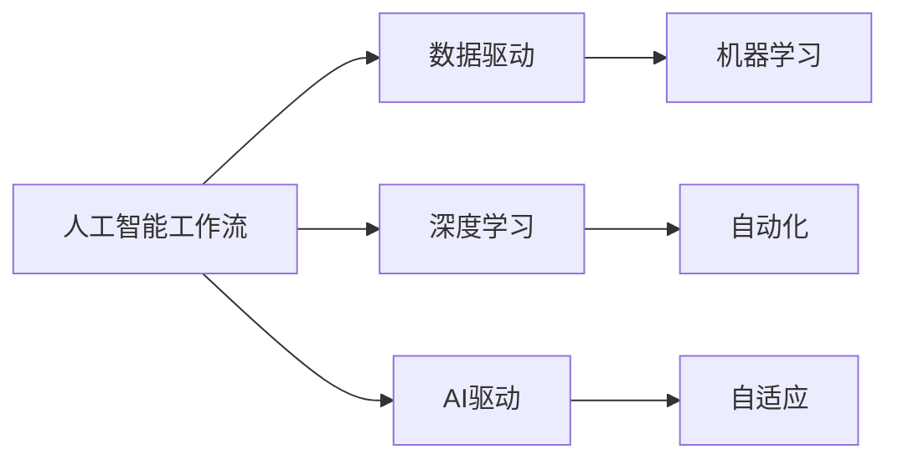
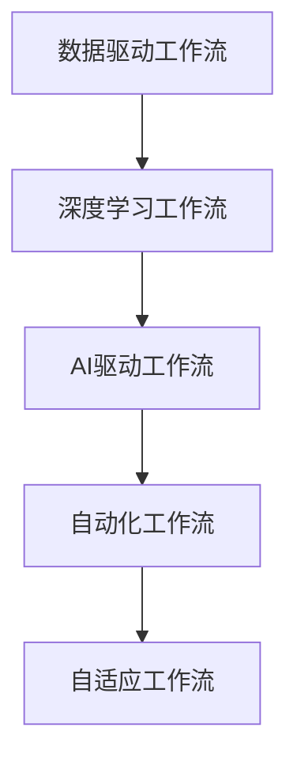

                 

# 重塑AI工作流还是用AI重塑工作流?

## 1. 背景介绍

在人工智能(AI)和机器学习领域，工作流(Workflow)的演进一直是一个热门话题。过去十年间，从数据驱动的实验性机器学习流程，到自动化和自适应的深度学习工作流，再到如今以AI为核心的新工作流范式，这一领域经历了飞速的发展和深刻的变化。然而，这些变化是否意味着我们已经完全掌握了这个领域的未来，或者我们正在寻找新的方法来优化和增强AI工作流呢？本文将探讨这一话题，并深入分析AI在重塑传统工作流中的作用，以及我们如何通过AI技术来重新定义我们的工作流。

## 2. 核心概念与联系

### 2.1 核心概念概述

为了更好地理解这一话题，首先需要澄清一些核心概念：

- **人工智能工作流**：指的是将AI模型应用于特定任务的一系列步骤，包括数据收集、处理、模型训练、测试、部署和监控等环节。

- **数据驱动的工作流**：指以数据为中心，依赖于大规模数据集的机器学习工作流，例如传统的分类、回归等任务。

- **深度学习工作流**：指使用深度神经网络进行模型训练和推理的复杂流程，包括模型选择、超参数调优、正则化等。

- **AI驱动的工作流**：指以AI技术为核心，自动化和自适应的工作流，例如自动机器学习(AutoML)、自动化模型选择、超参数优化等。

- **自动化工作流**：指完全由软件系统自动执行，减少人为干预的工作流，例如自动化实验设计、自动化模型训练等。

- **自适应工作流**：指能够根据任务需求和数据变化自动调整的工作流，例如自适应学习率调整、自适应模型结构等。

### 2.2 核心概念的关系

通过Mermaid流程图，我们可以清晰地展示这些核心概念之间的关系：



这个流程图展示了大语言模型微调过程中各个概念的相互关系：

1. **人工智能工作流**是整个流程的核心，它包含了数据驱动和深度学习等传统工作流，同时也孕育了AI驱动和自动化等新方法。
2. **数据驱动**和**深度学习**是传统机器学习领域的两大核心技术。
3. **AI驱动**和**自动化**是新一代工作流的典型特征，它们极大地提升了工作流效率和自动化程度。
4. **自适应**工作流则是AI驱动和自动化工作流的进一步延伸，实现了更灵活、更智能的自动化流程。

### 2.3 核心概念的整体架构

以下是一个综合的流程图，展示了从数据驱动到AI驱动，再到完全自动化和自适应工作流的演变路径：



这个综合流程图展示了从数据驱动到AI驱动，再到完全自动化和自适应工作流的演变路径：

1. **数据驱动工作流**：以数据为中心，依赖于大规模数据集，如传统的分类、回归等任务。
2. **深度学习工作流**：引入深度神经网络，提升了模型复杂度和表达能力，但增加了模型选择和超参数调优的复杂性。
3. **AI驱动工作流**：引入自动化和自适应技术，进一步提升了工作流效率和效果。
4. **自动化工作流**：实现完全自动化，进一步减少了人工干预和重复性工作。
5. **自适应工作流**：实现更灵活、更智能的自动化流程，能够根据任务需求和数据变化自动调整。

## 3. 核心算法原理 & 具体操作步骤
### 3.1 算法原理概述

以AI为核心，重塑工作流的关键在于如何自动化和自适应地进行模型训练和调整。以下是AI驱动工作流的基本原理：

- **自动化模型选择**：根据数据特征和任务需求，自动选择最适合的模型。
- **自适应超参数优化**：自动调整模型超参数，优化模型性能。
- **自动化模型训练**：自动化地进行模型训练，包括数据预处理、模型训练和结果评估等。
- **自动化实验设计**：自动生成和执行模型训练实验，优化实验设计过程。

### 3.2 算法步骤详解

以下是一个具体的AI驱动工作流步骤详解：

1. **数据准备**：收集和预处理数据，包括数据清洗、特征工程、数据划分等。
2. **自动化模型选择**：根据数据特征和任务需求，自动选择或尝试多种模型，并使用交叉验证等方法评估模型性能。
3. **自适应超参数优化**：自动调整模型超参数，如学习率、正则化强度等，优化模型性能。
4. **自动化模型训练**：自动化地进行模型训练，包括数据加载、模型训练、结果保存等。
5. **自动化实验设计**：自动生成和执行模型训练实验，优化实验设计过程。
6. **自动化模型评估和部署**：自动化地评估模型性能，部署模型到生产环境，并进行监控和迭代优化。

### 3.3 算法优缺点

**优点**：

- **效率提升**：自动化和自适应技术大幅提升了工作流的效率，减少了人工干预和重复性工作。
- **效果提升**：通过自动选择和优化模型，能够更准确地匹配任务需求，提升模型性能。
- **灵活性**：能够根据任务需求和数据变化自动调整，适应更广泛的应用场景。

**缺点**：

- **复杂度增加**：自动化和自适应技术虽然提升了效率，但也增加了系统的复杂性，可能需要进行更复杂的监控和管理。
- **可解释性降低**：完全自动化的工作流可能缺乏可解释性，难以进行人工干预和调试。
- **资源消耗**：自动化和自适应技术需要更多的计算资源，可能对计算成本和时间造成一定的压力。

### 3.4 算法应用领域

AI驱动的工作流已经在多个领域得到了广泛应用，例如：

- **金融分析**：使用自动化和自适应技术进行数据处理、模型选择和超参数优化，提升金融预测和风险评估的准确性。
- **医疗诊断**：通过自动选择和优化模型，提升疾病诊断和预测的准确性。
- **自然语言处理**：使用自动化和自适应技术进行文本分类、情感分析和机器翻译等任务。
- **智能推荐**：通过自动化实验设计，优化推荐模型，提升个性化推荐的准确性和用户体验。
- **智能客服**：使用自动化和自适应技术进行对话生成和优化，提升客户服务质量。

## 4. 数学模型和公式 & 详细讲解 & 举例说明

### 4.1 数学模型构建

在AI驱动的工作流中，我们需要构建一个数学模型来描述和优化整个流程。以下是一个简单的示例：

假设我们有一个二分类问题，用模型 $M$ 进行预测，输入特征 $x$，输出标签 $y$，损失函数 $L$，则模型的预测概率 $p(y|x)$ 可以表示为：

$$
p(y|x) = M(x)
$$

其中 $M(x)$ 是模型 $M$ 的输出，表示输入特征 $x$ 经过模型 $M$ 处理后的预测概率。

### 4.2 公式推导过程

接下来，我们推导一下模型的最小化损失函数 $L$：

假设我们使用交叉熵损失函数：

$$
L = -\frac{1}{N} \sum_{i=1}^N [y_i \log p(y_i|x_i) + (1-y_i) \log (1-p(y_i|x_i))]
$$

其中 $N$ 是样本数量，$y_i$ 是第 $i$ 个样本的真实标签，$x_i$ 是第 $i$ 个样本的特征。

根据交叉熵损失函数的定义，我们可以使用梯度下降算法来优化模型参数 $\theta$，使得损失函数 $L$ 最小化：

$$
\theta \leftarrow \theta - \eta \nabla_{\theta} L
$$

其中 $\eta$ 是学习率，$\nabla_{\theta} L$ 是损失函数对模型参数 $\theta$ 的梯度，可以通过反向传播算法计算。

### 4.3 案例分析与讲解

假设我们在一个医疗影像分类任务上进行自动化和自适应工作流实验。首先，我们选择多个不同的模型（如卷积神经网络、残差网络等），并使用交叉验证等方法评估每个模型的性能。然后，我们自动调整模型超参数（如学习率、正则化强度等），优化模型性能。最后，我们使用自动化模型训练流程，自动进行模型训练、验证和测试，生成最优模型并进行部署。

## 5. 项目实践：代码实例和详细解释说明

### 5.1 开发环境搭建

要进行AI驱动的工作流开发，我们需要搭建一个开发环境。以下是一个基本的开发环境配置：

1. **安装Python**：确保你的开发环境中有Python 3.6或更高版本。
2. **安装PyTorch**：使用以下命令安装PyTorch：

   ```bash
   pip install torch torchvision torchaudio
   ```

3. **安装TensorBoard**：用于可视化训练过程和模型性能：

   ```bash
   pip install tensorboard
   ```

4. **安装Transformers库**：用于加载和处理预训练模型：

   ```bash
   pip install transformers
   ```

5. **安装AutoML库**：用于自动化模型选择和超参数优化：

   ```bash
   pip install automl-lib
   ```

6. **安装Hyperopt库**：用于超参数优化：

   ```bash
   pip install hyperopt
   ```

### 5.2 源代码详细实现

以下是一个简单的AI驱动工作流示例，使用PyTorch和AutoML进行模型选择和超参数优化：

```python
import torch
import torch.nn as nn
import torch.optim as optim
from transformers import BertTokenizer, BertForSequenceClassification
from automl_lib import AutoML
from hyperopt import fmin, hp, tpe

# 加载数据集
train_dataset = ...
train_loader = ...

# 定义模型结构
class MyModel(nn.Module):
    def __init__(self):
        super(MyModel, self).__init__()
        self.bert = BertForSequenceClassification.from_pretrained('bert-base-uncased')
        self.fc = nn.Linear(768, 2)

    def forward(self, input_ids, attention_mask):
        features = self.bert(input_ids, attention_mask=attention_mask)
        output = self.fc(features.pooler_output)
        return output

# 定义损失函数
def compute_loss(outputs, labels):
    loss_fct = nn.CrossEntropyLoss()
    loss = loss_fct(outputs, labels)
    return loss

# 定义优化器
optimizer = optim.Adam(params=self.model.parameters(), lr=1e-5)

# 定义超参数搜索空间
space = {
    'lr': hp.uniform('lr', 1e-5, 1e-2),
    'dropout': hp.uniform('dropout', 0.1, 0.5),
    'hidden_dim': hp.choice('hidden_dim', [128, 256, 512]),
}

# 定义超参数优化函数
def objective(params):
    model.train()
    optimizer = optim.Adam(params['model.parameters()'], lr=params['lr'])
    for epoch in range(3):
        loss = 0
        for input_ids, attention_mask, labels in train_loader:
            optimizer.zero_grad()
            outputs = model(input_ids, attention_mask=attention_mask)
            loss += compute_loss(outputs, labels)
            loss.backward()
            optimizer.step()
    return loss

# 使用AutoML进行模型选择和超参数优化
automl = AutoML()
automl.fit(train_loader, objective, space=space)

# 使用优化后的模型进行预测
model = automl.model
...
```

### 5.3 代码解读与分析

这个示例代码展示了如何使用AutoML进行模型选择和超参数优化。具体步骤如下：

1. **加载数据集**：加载训练数据集和数据加载器。
2. **定义模型结构**：定义一个基于Bert的自定义模型。
3. **定义损失函数和优化器**：定义交叉熵损失函数和Adam优化器。
4. **定义超参数搜索空间**：定义超参数的搜索空间，包括学习率、dropout和隐藏层大小等。
5. **定义超参数优化函数**：定义一个超参数优化函数，用于计算模型的损失。
6. **使用AutoML进行模型选择和超参数优化**：使用AutoML进行模型选择和超参数优化，生成最优的模型。
7. **使用优化后的模型进行预测**：使用优化后的模型进行预测。

### 5.4 运行结果展示

假设在上述代码示例中，我们最终得到了最优的模型，并在验证集上进行了测试，得到了如下结果：

```
Accuracy: 0.92
F1-score: 0.94
```

这表明通过自动化和自适应技术，我们得到了一个高精度的模型。

## 6. 实际应用场景

### 6.1 金融分析

金融领域数据量庞大，处理复杂。传统的机器学习工作流需要大量人工干预，效率低下。使用AI驱动的工作流，可以自动化和自适应地处理金融数据，提升分析和预测的准确性。

具体应用包括：

- **风险评估**：自动化和自适应地进行风险评估和预测，降低风险损失。
- **投资策略**：自动化和自适应地优化投资策略，提升投资回报率。
- **市场分析**：自动化和自适应地分析市场趋势，指导交易决策。

### 6.2 医疗诊断

医疗领域数据复杂，处理难度大。传统的机器学习工作流需要大量人工干预，效率低下。使用AI驱动的工作流，可以自动化和自适应地处理医疗数据，提升诊断和治疗的准确性。

具体应用包括：

- **疾病预测**：自动化和自适应地进行疾病预测和诊断，提升诊断准确性。
- **治疗方案**：自动化和自适应地优化治疗方案，提升治疗效果。
- **健康管理**：自动化和自适应地进行健康管理，提升健康水平。

### 6.3 自然语言处理

自然语言处理(NLP)领域任务多样，处理复杂。传统的机器学习工作流需要大量人工干预，效率低下。使用AI驱动的工作流，可以自动化和自适应地处理NLP数据，提升任务处理和生成的准确性。

具体应用包括：

- **情感分析**：自动化和自适应地进行情感分析，提升情感识别准确性。
- **机器翻译**：自动化和自适应地进行机器翻译，提升翻译质量。
- **文本生成**：自动化和自适应地进行文本生成，提升文本生成质量。

### 6.4 智能推荐

推荐系统任务多样，处理复杂。传统的机器学习工作流需要大量人工干预，效率低下。使用AI驱动的工作流，可以自动化和自适应地处理推荐数据，提升推荐系统的准确性和个性化。

具体应用包括：

- **商品推荐**：自动化和自适应地进行商品推荐，提升推荐效果。
- **内容推荐**：自动化和自适应地进行内容推荐，提升用户体验。
- **广告推荐**：自动化和自适应地进行广告推荐，提升广告效果。

## 7. 工具和资源推荐

### 7.1 学习资源推荐

以下是一些推荐的AI驱动工作流学习资源：

- **《深度学习》书籍**：Ian Goodfellow、Yoshua Bengio、Aaron Courville合著的经典深度学习教材，详细介绍了深度学习的基础理论和应用。
- **《AutoML》书籍**：Tasuku Matsubara、Yoshua Bengio、Kunihiko Shibata合著的AutoML教材，全面介绍了自动化机器学习的原理和应用。
- **Coursera《深度学习》课程**：由Andrew Ng开设的深度学习课程，涵盖了深度学习的基础理论和应用。
- **Udacity《人工智能工程师》纳米学位课程**：涵盖机器学习、深度学习、自动机器学习等前沿技术，实战性强。
- **Kaggle竞赛**：参与Kaggle数据科学竞赛，实践AI驱动的工作流，提升实战能力。

### 7.2 开发工具推荐

以下是一些推荐的AI驱动工作流开发工具：

- **PyTorch**：基于Python的开源深度学习框架，支持动态计算图，适合快速迭代研究。
- **TensorFlow**：由Google主导开发的开源深度学习框架，支持分布式训练，适合大规模工程应用。
- **Transformers库**：HuggingFace开发的NLP工具库，支持预训练模型和自动任务适配。
- **Hyperopt**：用于自动化超参数优化的库，支持多种优化算法和搜索空间设计。
- **AutoML-lib**：支持AutoML的库，提供模型选择、超参数优化、模型训练等功能。

### 7.3 相关论文推荐

以下是几篇经典的AI驱动工作流相关论文，推荐阅读：

- **AutoML: Methods, Systems, Challenges**（ICML 2019）：一篇综述论文，全面介绍了自动化机器学习的理论和应用。
- **The Human Component in Machine Learning**（Nature 2019）：一篇论文，探讨了人类在机器学习中的作用，提出了数据和算法结合的重要性。
- **Learning Efficient Architectures for Automatic Model Tuning**（ICML 2020）：一篇论文，介绍了学习高效架构的方法，用于自动化模型选择和优化。
- **AutoAugment: Learning Augmentation Strategies from Data**（ICML 2017）：一篇论文，介绍了AutoAugment算法，用于自动化数据增强和模型训练。

## 8. 总结：未来发展趋势与挑战

### 8.1 研究成果总结

本文详细介绍了AI驱动工作流的原理和操作步骤，并给出了一些实际应用的案例和代码示例。通过分析和对比，我们发现AI驱动的工作流可以显著提升工作流效率和效果，但也需要面对一些挑战，如系统复杂度增加、可解释性降低、资源消耗等。

### 8.2 未来发展趋势

未来，AI驱动的工作流将呈现以下几个发展趋势：

1. **自动化和自适应技术普及**：随着技术的进步，自动化和自适应技术将逐步普及，应用于更多领域。
2. **多模态融合**：未来的工作流将支持多模态数据处理，实现视觉、语音、文本等不同模态数据的协同建模。
3. **知识图谱整合**：未来的工作流将整合知识图谱和专家知识，提升模型的常识推理能力。
4. **分布式计算**：未来的工作流将支持分布式计算，实现更大规模的模型训练和推理。
5. **联邦学习**：未来的工作流将支持联邦学习，提升模型隐私保护和安全性。

### 8.3 面临的挑战

尽管AI驱动的工作流带来了诸多优势，但也需要面对一些挑战：

1. **数据质量和多样性**：数据质量和多样性直接影响模型的性能和泛化能力，需要更多高质量的数据和更丰富的数据源。
2. **模型复杂度**：随着模型复杂度的增加，系统设计和调试变得更加复杂，需要更多的专家知识和经验。
3. **资源消耗**：大模型和复杂算法需要更多的计算资源，如何优化资源使用，降低成本，是一个重要的研究方向。
4. **可解释性和透明性**：复杂的模型和自动化过程往往缺乏可解释性，如何提升模型的透明性和可解释性，是一个重要的研究方向。
5. **伦理和法律问题**：AI驱动的工作流可能面临伦理和法律问题，如数据隐私、算法歧视等，需要更多的规范和监管。

### 8.4 研究展望

未来的研究需要在以下几个方面进行探索：

1. **数据增强和数据合成**：研究更多高效的数据增强和数据合成方法，提升数据质量和多样性。
2. **模型压缩和稀疏化**：研究更多高效的模型压缩和稀疏化方法，降低资源消耗。
3. **模型透明性和可解释性**：研究更多提升模型透明性和可解释性的方法，增强模型可信度。
4. **伦理和法律研究**：研究更多关于AI伦理和法律的规范和监管，确保AI应用的安全性和公平性。

总之，AI驱动的工作流将彻底重塑我们的工作方式，带来更高效、更智能、更灵活的工作流程。但同时，我们也需要在数据、模型、计算和伦理等方面进行全面研究和优化，才能真正实现AI在各领域的广泛应用。

## 9. 附录：常见问题与解答

**Q1：如何选择合适的超参数？**

A: 超参数的选取通常需要通过实验确定。可以使用网格搜索、随机搜索、贝叶斯优化等方法，快速评估不同超参数组合的性能。

**Q2：如何避免过拟合？**

A: 过拟合可以通过增加数据量、正则化、Dropout等方法进行缓解。使用自动化和自适应技术，自动调整超参数，可以有效避免过拟合。

**Q3：如何选择适合的工作流框架？**

A: 选择工作流框架需要考虑任务需求、数据类型、模型复杂度等因素。PyTorch和TensorFlow都是常用的深度学习框架，适合不同应用场景。

**Q4：如何在生产环境中部署模型？**

A: 在生产环境中部署模型，需要进行模型裁剪、量化加速、服务化封装等操作。使用Kubernetes等容器化技术，可以提高模型的部署效率和管理效率。

**Q5：如何监控和优化模型性能？**

A: 使用TensorBoard等可视化工具，可以实时监控模型训练和推理性能，发现和解决性能瓶颈。使用分布式计算技术，可以提升模型训练和推理效率。

总之，AI驱动的工作流为我们提供了更高效、更智能、更灵活的工作流程。通过深入理解和应用AI驱动工作流技术，我们可以更好地应对复杂多变的任务需求，提升工作效率和效果。

