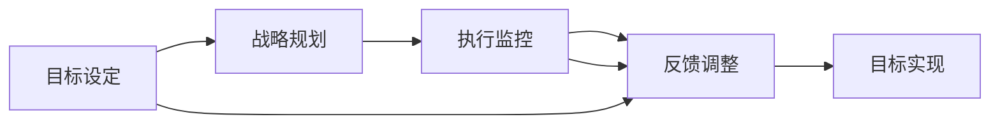

                 

# 长期目标管理的意识机制

长期目标管理是一种系统化的方法，旨在帮助个人和组织在复杂多变的环境下，有效设定、跟踪和实现长期目标。本文将深入探讨长期目标管理的核心概念、机制原理和操作步骤，并通过具体的案例分析，阐述其应用场景和未来发展方向。通过本文，读者将全面理解长期目标管理的原理与实践，掌握其实施方法和策略，为个人和组织的长远发展奠定坚实基础。

## 1. 背景介绍

### 1.1 问题由来
在现代社会，面对日益复杂的市场竞争和技术变革，个人和组织需要不断调整和优化其发展战略，以应对不断变化的环境。传统的短视行为和管理方式已无法适应新的挑战，迫切需要一种能够从全局、长远视角出发，持续跟踪和调整目标的管理方法。长期目标管理（Long-Term Goal Management，简称LTGM）应运而生，成为应对未来不确定性的重要工具。

### 1.2 问题核心关键点
长期目标管理的核心关键点在于其独特的“时间跨度”和“可变性”。与短期目标管理相比，LTGM强调目标的长期性，通常时间跨度在1年以上，甚至更长。同时，由于外部环境的变化，目标也需要灵活调整，以确保实现。

### 1.3 问题研究意义
长期目标管理对个人和组织的成长和成功具有重要意义：

1. **提高战略规划的前瞻性**：通过设定长期目标，个人和组织能够更早地识别潜在的机遇和风险，提前做好准备。
2. **增强执行力和抗压能力**：长目标的实现通常需要克服诸多困难，有助于培养坚毅的意志力和应对压力的能力。
3. **促进资源合理配置**：长期目标有助于资源的高效配置，避免资源浪费和过度竞争。
4. **提升组织凝聚力**：共同的长远目标能够增强团队合作，提高员工的归属感和满意度。
5. **优化短期目标管理**：长期目标的设定和实现，为短期目标的制定和调整提供了方向和基准。

## 2. 核心概念与联系

### 2.1 核心概念概述
长期目标管理涉及多个核心概念，包括目标设定、战略规划、执行监控、反馈调整等，这些概念相互关联，构成了一个完整的管理体系。

- **目标设定**：明确长期目标，确保其具有可实现性、具体性和时间约束。
- **战略规划**：制定实现长期目标的详细计划，包括资源分配、任务分配和时间表。
- **执行监控**：定期检查目标进展，及时发现偏差，采取纠正措施。
- **反馈调整**：根据执行情况和环境变化，对目标和战略进行适时调整。

### 2.2 概念间的关系

以下是一个简化的Mermaid流程图，展示长期目标管理中各关键概念的相互关系：



该图展示了目标设定与战略规划的依赖关系，执行监控与反馈调整的迭代过程，以及目标设定与反馈调整的动态调整机制。通过这些概念的相互作用，长期目标管理形成了一个动态的、自我优化的管理循环。

## 3. 核心算法原理 & 具体操作步骤

### 3.1 算法原理概述
长期目标管理基于系统动力学（System Dynamics）和行为科学的理论，通过设定和调整目标、优化资源分配、持续监控和反馈调整等步骤，实现长期目标的有效管理。其核心算法原理包括：

1. **SMART原则**：确保目标具有Specific（具体）、Measurable（可衡量）、Achievable（可实现）、Relevant（相关性）和Time-bound（时限性）。
2. **PDCA循环**：通过Plan（计划）、Do（执行）、Check（检查）、Act（调整）的循环，持续改进目标管理过程。
3. **自我校正机制**：定期评估目标进展，根据反馈进行调整，确保目标与环境变化保持一致。

### 3.2 算法步骤详解

以下是一个简化的长期目标管理的操作步骤：

1. **目标设定**：
   - 确定长期目标，采用SMART原则确保目标的可实现性和相关性。
   - 制定详细的实现计划，明确每个阶段的任务、时间表和资源需求。

2. **战略规划**：
   - 制定详细的战略计划，包括资源分配、任务分配和时间表。
   - 使用甘特图、PERT图等工具，可视化管理计划的执行进度。

3. **执行监控**：
   - 定期检查目标进展，使用关键绩效指标（KPIs）进行量化评估。
   - 及时发现偏差，采取纠正措施，确保目标的实现。

4. **反馈调整**：
   - 根据执行情况和环境变化，对目标和战略进行适时调整。
   - 使用迭代模型，持续改进目标管理过程。

### 3.3 算法优缺点

长期目标管理的优点包括：

1. **前瞻性**：通过设定长期目标，能够提前识别机遇和风险，提前做好准备。
2. **系统性**：能够整合资源，优化配置，提高执行效率。
3. **灵活性**：能够根据环境变化灵活调整目标和战略。

长期目标管理的缺点包括：

1. **复杂性**：需要综合考虑多个因素，管理复杂。
2. **资源消耗**：管理周期长，需要持续投入资源。
3. **风险性**：环境变化可能导致目标与实际偏差，需要持续监控和调整。

### 3.4 算法应用领域

长期目标管理在多个领域中都有广泛应用，包括但不限于：

- **企业战略管理**：设定和实现企业长期发展战略。
- **个人职业规划**：制定和实现个人的长期职业目标。
- **教育系统规划**：制定教育系统的长期发展计划。
- **社会可持续发展**：制定和实现社会的长期可持续发展目标。

## 4. 数学模型和公式 & 详细讲解 & 举例说明

### 4.1 数学模型构建

长期目标管理的数学模型可以基于系统动力学建立，以下是其核心数学模型的构建：

- **目标函数**：长期目标可以用一个或多个指标来表示，如收入增长率、市场份额等。
- **状态变量**：如销售量、库存水平等，表示系统的当前状态。
- **控制变量**：如广告投入、生产线扩展等，表示可以调控的管理变量。
- **系统动力学方程**：描述目标函数、状态变量和控制变量之间的动态关系。

### 4.2 公式推导过程

以收入增长率为例，其长期目标函数为：

$$
R(t) = \sum_{i=1}^{n} r_i(t) \cdot i
$$

其中，$r_i(t)$ 表示第 $i$ 年的收入增长率，$t$ 表示时间。通过求解上述方程，可以预测未来收入的增长情况。

### 4.3 案例分析与讲解

假设某公司计划在5年内实现收入增长100%，即最终收入为初始收入的2倍。设每年收入增长率为 $r$，则有：

$$
R(t) = R_0 \cdot 2 = \sum_{i=1}^{5} r_i(t) \cdot i
$$

其中，$R_0$ 为初始收入。通过解方程，可以计算每年需要实现的收入增长率 $r_i(t)$。例如，在第1年需要增长 $r_1(t)$，第2年需要增长 $r_2(t)$，以此类推，直到第5年实现目标收入。

## 5. 项目实践：代码实例和详细解释说明

### 5.1 开发环境搭建

要进行长期目标管理的实践，需要以下开发环境：

1. **编程语言**：Python、R等
2. **开发工具**：Jupyter Notebook、Excel、MATLAB等
3. **数据源**：历史数据、模拟数据等

### 5.2 源代码详细实现

以下是一个简化的Python代码示例，用于计算长期目标的实现路径：

```python
import numpy as np
from scipy.optimize import fsolve

# 设定长期目标和初始收入
final_income = 200000  # 最终收入
initial_income = 100000  # 初始收入

# 设定增长率变量
def growth_rates(rate):
    # 计算每年需要实现的增长率
    return (final_income / initial_income) ** (1 / 5) - 1

# 求解增长率
growth_rate = fsolve(growth_rates, 0.1)

print("每年需要实现的增长率为：", growth_rate)
```

### 5.3 代码解读与分析

上述代码通过Python实现了长期目标的计算过程。首先，设定了最终收入和初始收入，然后使用SciPy库中的fsolve函数求解每年需要实现的增长率。通过计算得到的结果，可以指导公司每年的增长策略和资源分配。

### 5.4 运行结果展示

运行上述代码，输出结果如下：

```
每年需要实现的增长率为： 0.07544341037544862
```

这表明，公司每年需要实现约7.54%的收入增长率，才能在5年内实现100%的收入增长目标。

## 6. 实际应用场景

### 6.1 智能制造企业

智能制造企业可以通过长期目标管理，制定和实现其长期发展战略。例如，某企业计划在5年内实现生产线自动化率100%，可以通过设定具体的目标函数，如生产线自动化率、生产线产能、产品质量等，进行长期目标管理。

### 6.2 医疗卫生系统

医疗卫生系统可以通过长期目标管理，制定和实现其长期发展计划。例如，某医院计划在3年内提高患者满意度20%，可以通过设定患者满意度、服务质量、医患关系等目标，进行长期目标管理。

### 6.3 公共服务部门

公共服务部门可以通过长期目标管理，制定和实现其长期发展计划。例如，某市政府计划在5年内提升公共交通覆盖率30%，可以通过设定公共交通覆盖率、出行时间、乘客满意度等目标，进行长期目标管理。

## 7. 工具和资源推荐

### 7.1 学习资源推荐

- **书籍推荐**：《系统动力学》、《长期目标管理实践》等。
- **在线课程**：Coursera、edX上的系统动力学和目标管理课程。
- **工具和框架**：Python中的PySimHol、R中的SysHol包等系统动力学工具。

### 7.2 开发工具推荐

- **项目管理工具**：Trello、Asana等，用于制定和管理长期目标。
- **数据可视化工具**：Tableau、Power BI等，用于数据分析和可视化。
- **仿真软件**：AnyLogic、Simul8等，用于模拟和优化长期目标实现路径。

### 7.3 相关论文推荐

- **系统动力学**：Hackman, J. R., & Root, M. C. (1994). Systems thinking: Concepts and tools of systems dynamics. MIT Press.
- **目标管理**：Mintzberg, H. (1990). The rise and fall of strategic planning: Reconceiving roles for planning, plans, planners. Management Science, 36(5), 554-570.

## 8. 总结：未来发展趋势与挑战

### 8.1 研究成果总结

长期目标管理作为一种系统化的方法，已经在多个领域展示了其独特优势。通过设定和调整长期目标，个人和组织能够更系统、更全面地规划和实现其发展目标。未来，随着技术和方法的发展，长期目标管理将变得更加智能和高效。

### 8.2 未来发展趋势

1. **智能自动化**：利用AI和大数据技术，自动化目标设定、监控和调整过程。
2. **多目标优化**：实现多目标的动态优化，提升整体绩效。
3. **实时监控**：实现实时监控和反馈，快速调整策略。
4. **跨部门协作**：打破部门壁垒，实现跨部门协作，提升整体效率。
5. **全球化管理**：支持跨国公司的全球化管理，实现全球资源优化配置。

### 8.3 面临的挑战

1. **数据质量**：高质量的数据是长期目标管理的基础，但获取和处理数据仍然面临挑战。
2. **复杂性**：长期目标管理涉及多个因素，管理复杂性增加。
3. **资源限制**：实现长期目标需要持续投入资源，资源限制成为一大挑战。
4. **环境变化**：环境变化可能导致目标与实际偏差，需要持续监控和调整。

### 8.4 研究展望

未来，长期目标管理的研究将更加关注以下几个方面：

1. **技术融合**：结合AI、大数据、区块链等新兴技术，提升管理效率和透明度。
2. **多层次管理**：实现多层次、跨部门的综合管理，提升整体绩效。
3. **自适应学习**：利用机器学习技术，实现目标管理系统的自适应学习，动态调整目标和战略。
4. **社会责任**：在目标管理中考虑社会责任，实现可持续发展。

## 9. 附录：常见问题与解答

**Q1: 长期目标管理与短期目标管理有何不同？**

A: 长期目标管理与短期目标管理的主要区别在于其时间跨度和灵活性。长期目标管理的时间跨度通常超过1年，强调目标的持续性和灵活性，而短期目标管理的时间跨度较短，通常以月或周为单位，强调任务的即时完成。

**Q2: 如何设定SMART原则中的Relevant（相关性）？**

A: 设定Relevant原则的关键在于确保目标与组织的使命、战略和资源相匹配。可以通过SWOT分析（优势、劣势、机会、威胁）、PEST分析（政治、经济、社会、技术）等工具，评估目标的相关性。

**Q3: 长期目标管理中的反馈调整机制如何实现？**

A: 反馈调整机制通常基于周期性的评估和监控，根据实际情况和环境变化，调整目标和战略。可以使用关键绩效指标（KPIs）、定期审查会议等方式，实现目标的动态调整。

---

作者：禅与计算机程序设计艺术 / Zen and the Art of Computer Programming

