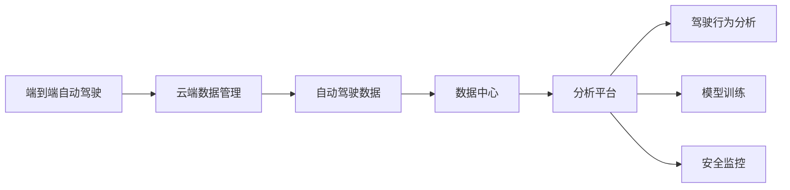

                 

# 端到端自动驾驶的云端数据管理与分析平台

> 关键词：端到端自动驾驶, 云端数据管理, 自动驾驶数据, 数据中心, 分析平台, 驾驶行为分析, 模型训练, 安全监控

## 1. 背景介绍

### 1.1 问题由来
随着自动驾驶技术的发展，对海量数据的管理与分析需求日益增长。传统的数据管理和分析方式已经难以满足当前自动驾驶系统的需求。自动驾驶系统需要处理多源异构数据，包括传感器数据、车辆控制数据、地图信息、用户交互数据等。这些数据来源多样，格式各异，实时性要求高，数据量巨大。因此，如何构建高效、可靠、易用的数据管理与分析平台，成为自动驾驶技术落地的关键问题之一。

### 1.2 问题核心关键点
本节将重点介绍构建端到端自动驾驶数据管理与分析平台的核心问题，包括数据收集、存储、处理、分析和展示等环节，以及各环节之间的紧密联系。

### 1.3 问题研究意义
构建端到端自动驾驶数据管理与分析平台，对于提升自动驾驶系统的性能和安全性，优化用户体验，加速技术落地具有重要意义：

1. **提高数据处理效率**：通过集中管理和高效处理海量数据，自动驾驶系统可以更快地从数据中提取有用的信息，减少数据瓶颈。
2. **保障数据安全**：统一的数据管理和存储机制，可以更好地保障数据的完整性和安全性，防止数据泄露和篡改。
3. **提升模型性能**：通过分析历史驾驶数据，可以对自动驾驶算法进行优化和调优，提升模型在复杂环境下的表现。
4. **优化用户体验**：通过数据展示和分析，可以获得用户反馈和行为习惯，改进自动驾驶系统的交互设计和用户体验。
5. **推动技术落地**：构建高效可靠的数据管理平台，为自动驾驶技术在实际场景中的应用提供了坚实基础。

## 2. 核心概念与联系

### 2.1 核心概念概述

为更好地理解端到端自动驾驶数据管理与分析平台，本节将介绍几个关键概念：

- **端到端自动驾驶**：指从传感器数据采集、车辆控制决策、路径规划到执行的全流程自动化过程。
- **云端数据管理**：指将自动驾驶系统生成的数据集中存储在云端，实现高效、安全、可靠的数据管理。
- **自动驾驶数据**：指自动驾驶系统在运行过程中生成的数据，包括传感器数据、车辆控制数据、地图数据等。
- **数据中心**：指集中存储和管理自动驾驶数据的中心化平台，通常包含数据存储、计算、分析等多个模块。
- **分析平台**：指对自动驾驶数据进行分析和挖掘的工具，可以生成可视化报表、驾驶行为分析、模型训练等结果。
- **驾驶行为分析**：指通过对历史驾驶数据进行分析，识别出驾驶行为模式和异常行为，进行安全监控和优化。
- **模型训练**：指利用自动驾驶数据训练自动驾驶模型，如路径规划模型、障碍物检测模型等，以提升模型性能。
- **安全监控**：指通过分析自动驾驶系统在运行过程中的数据，进行实时监控和预警，确保系统安全。

这些概念共同构成了端到端自动驾驶数据管理与分析平台的核心生态系统。通过理解这些关键概念，可以更好地把握数据管理与分析的流程和细节。

### 2.2 概念间的关系

这些核心概念之间存在着紧密的联系，通过以下Mermaid流程图来展示它们之间的关系：



这个流程图展示了一个典型的端到端自动驾驶数据管理与分析流程：

1. **端到端自动驾驶**：是整个数据管理与分析的起点，涉及传感器数据采集、车辆控制决策、路径规划等环节。
2. **云端数据管理**：将自动驾驶系统生成的数据集中存储在云端，实现高效、安全、可靠的数据管理。
3. **自动驾驶数据**：自动驾驶系统在运行过程中生成的数据，包括传感器数据、车辆控制数据、地图数据等。
4. **数据中心**：集中存储和管理自动驾驶数据的中心化平台，通常包含数据存储、计算、分析等多个模块。
5. **分析平台**：对自动驾驶数据进行分析和挖掘的工具，可以生成可视化报表、驾驶行为分析、模型训练等结果。
6. **驾驶行为分析**：通过对历史驾驶数据进行分析，识别出驾驶行为模式和异常行为，进行安全监控和优化。
7. **模型训练**：利用自动驾驶数据训练自动驾驶模型，如路径规划模型、障碍物检测模型等，以提升模型性能。
8. **安全监控**：通过分析自动驾驶系统在运行过程中的数据，进行实时监控和预警，确保系统安全。

这些概念共同构成了端到端自动驾驶数据管理与分析平台的基本框架，使得自动驾驶系统能够高效地处理和分析海量数据，保障系统安全性和性能。

## 3. 核心算法原理 & 具体操作步骤
### 3.1 算法原理概述

端到端自动驾驶数据管理与分析平台的核心算法原理主要涉及以下几个方面：

1. **数据采集**：自动驾驶系统通过各种传感器（如摄像头、雷达、激光雷达等）采集实时数据，并记录车辆控制数据、地图信息等。
2. **数据存储与传输**：通过云存储技术将数据集中存储在云端，并提供高效的数据传输机制，保证数据实时性。
3. **数据处理与清洗**：对采集到的数据进行预处理、清洗和转换，确保数据的质量和一致性。
4. **数据分析与挖掘**：利用机器学习和数据分析技术，对数据进行挖掘和分析，提取有用信息。
5. **数据展示与监控**：通过可视化工具将分析结果展示给用户，并进行实时监控和预警。

这些步骤共同构成了端到端自动驾驶数据管理与分析平台的核心算法流程。

### 3.2 算法步骤详解

以下详细讲解端到端自动驾驶数据管理与分析平台的各个步骤。

**Step 1: 数据采集**

自动驾驶系统通过各种传感器采集实时数据，主要包括：

- **传感器数据**：如摄像头图像、雷达回波、激光雷达点云等，记录车辆周围环境的状态。
- **车辆控制数据**：如加速度、速度、转向角度等，记录车辆的实时控制信息。
- **地图信息**：如GPS坐标、道路信息、交通标志等，提供车辆定位和环境信息。
- **用户交互数据**：如驾驶员行为数据、用户反馈等，记录用户的交互信息。

**Step 2: 数据存储与传输**

将采集到的数据集中存储在云端，并提供高效的数据传输机制，具体流程如下：

1. **云存储**：选择可靠的云存储服务，如AWS S3、阿里云OSS、腾讯云COS等，实现数据的集中存储。
2. **数据传输**：采用消息队列、分布式文件系统等技术，实现数据的实时传输和同步。

**Step 3: 数据处理与清洗**

对采集到的数据进行预处理、清洗和转换，具体流程如下：

1. **数据预处理**：对传感器数据进行去噪、校正等预处理，确保数据的准确性。
2. **数据清洗**：识别并删除数据中的异常值和错误信息，确保数据的一致性。
3. **数据转换**：将数据格式转换为统一的格式，方便后续分析和处理。

**Step 4: 数据分析与挖掘**

利用机器学习和数据分析技术，对数据进行挖掘和分析，具体流程如下：

1. **特征提取**：从数据中提取有用的特征，如道路条件、障碍物类型、交通流量等。
2. **模型训练**：利用历史驾驶数据训练自动驾驶模型，如路径规划模型、障碍物检测模型等。
3. **驾驶行为分析**：通过对历史驾驶数据进行分析，识别出驾驶行为模式和异常行为，进行安全监控和优化。

**Step 5: 数据展示与监控**

通过可视化工具将分析结果展示给用户，并进行实时监控和预警，具体流程如下：

1. **数据展示**：利用可视化工具如Tableau、PowerBI等，将分析结果展示给用户，提供直观的用户体验。
2. **实时监控**：利用监控工具如ELK Stack、Prometheus等，进行实时监控和预警，确保系统安全。

### 3.3 算法优缺点

端到端自动驾驶数据管理与分析平台具有以下优点：

1. **高效性**：通过集中管理和高效处理海量数据，自动驾驶系统可以更快地从数据中提取有用的信息，减少数据瓶颈。
2. **安全性**：统一的数据管理和存储机制，可以更好地保障数据的完整性和安全性，防止数据泄露和篡改。
3. **易用性**：通过可视化工具和监控工具，用户可以直观地了解数据状态和系统运行情况，提升用户体验。

同时，平台也存在一些缺点：

1. **数据量巨大**：自动驾驶系统生成的数据量巨大，对数据存储和处理能力提出了较高要求。
2. **实时性要求高**：自动驾驶系统对数据的实时性要求高，需要高效的数据传输和处理机制。
3. **技术复杂度**：数据管理与分析涉及多种技术和工具，需要较高的技术水平和经验。

### 3.4 算法应用领域

端到端自动驾驶数据管理与分析平台可以应用于多个领域，包括：

1. **自动驾驶系统开发**：在自动驾驶系统开发过程中，用于数据存储、处理、分析和监控，提升系统性能和可靠性。
2. **智能交通管理**：在智能交通系统中，用于数据集中管理和分析，优化交通流量、提高道路通行效率。
3. **智能城市管理**：在智能城市管理中，用于数据集中管理和分析，提升城市治理水平和居民生活质量。
4. **车辆维护与维修**：在车辆维护与维修中，用于数据分析和监控，提升车辆维护效率和安全性。
5. **智能物流管理**：在智能物流管理中，用于数据集中管理和分析，提升物流效率和配送质量。

以上领域都需要大量的数据管理和分析，端到端自动驾驶数据管理与分析平台可以提供高效、可靠、易用的解决方案。

## 4. 数学模型和公式 & 详细讲解  
### 4.1 数学模型构建

本节将使用数学语言对端到端自动驾驶数据管理与分析平台进行更加严格的刻画。

记自动驾驶系统生成的数据集为 $D=\{(x_i, y_i)\}_{i=1}^N$，其中 $x_i$ 为输入数据，$y_i$ 为标签数据。定义数据管理与分析平台为 $M$，其目标是最大化数据处理和分析的准确性和效率。

定义数据管理与分析平台在数据集 $D$ 上的损失函数为 $\mathcal{L}(M, D)$，用于衡量平台对数据的处理和分析能力。损失函数的设计需要综合考虑数据的准确性、完整性、实时性等多个方面。

目标是最小化损失函数，即找到最优平台参数 $\theta$：

$$
\theta^* = \mathop{\arg\min}_{\theta} \mathcal{L}(M_{\theta}, D)
$$

其中 $M_{\theta}$ 为平台参数化的模型。

### 4.2 公式推导过程

以下我们以驾驶行为分析为例，推导损失函数的计算公式。

假设驾驶行为数据集为 $D=\{(x_i, y_i)\}_{i=1}^N$，其中 $x_i$ 为历史驾驶数据，$y_i$ 为驾驶行为标签。定义数据管理与分析平台为 $M$，其损失函数为：

$$
\mathcal{L}(M, D) = \frac{1}{N} \sum_{i=1}^N \ell(M(x_i), y_i)
$$

其中 $\ell$ 为损失函数，用于衡量模型预测结果与真实标签的差异。

假设使用神经网络模型进行驾驶行为分析，定义模型参数为 $\theta$，则模型在数据集 $D$ 上的损失函数为：

$$
\mathcal{L}(M_{\theta}, D) = \frac{1}{N} \sum_{i=1}^N \ell(M_{\theta}(x_i), y_i)
$$

其中 $M_{\theta}$ 为参数化的神经网络模型，$x_i$ 为输入数据，$y_i$ 为标签数据。

对于分类任务，常用的损失函数包括交叉熵损失、均方误差损失等。假设使用交叉熵损失函数，则损失函数的计算公式为：

$$
\mathcal{L}(M_{\theta}, D) = -\frac{1}{N} \sum_{i=1}^N \sum_{j=1}^C \text{one-hot}(y_i)_j \log(M_{\theta}(x_i)_j)
$$

其中 $C$ 为分类数目，$\text{one-hot}(y_i)$ 为标签的one-hot编码。

### 4.3 案例分析与讲解

以自动驾驶路径规划模型为例，说明如何构建数据管理与分析平台。

假设路径规划数据集为 $D=\{(x_i, y_i)\}_{i=1}^N$，其中 $x_i$ 为历史驾驶路径数据，$y_i$ 为规划路径标签。定义路径规划模型为 $M$，其损失函数为：

$$
\mathcal{L}(M, D) = \frac{1}{N} \sum_{i=1}^N \ell(M(x_i), y_i)
$$

其中 $\ell$ 为损失函数，用于衡量模型预测结果与真实标签的差异。

假设使用神经网络模型进行路径规划，定义模型参数为 $\theta$，则模型在数据集 $D$ 上的损失函数为：

$$
\mathcal{L}(M_{\theta}, D) = \frac{1}{N} \sum_{i=1}^N \ell(M_{\theta}(x_i), y_i)
$$

其中 $M_{\theta}$ 为参数化的神经网络模型，$x_i$ 为输入数据，$y_i$ 为标签数据。

假设使用均方误差损失函数，则损失函数的计算公式为：

$$
\mathcal{L}(M_{\theta}, D) = \frac{1}{N} \sum_{i=1}^N \sum_{j=1}^N (M_{\theta}(x_i)[j] - y_i[j])^2
$$

其中 $M_{\theta}(x_i)$ 为模型预测的路径数据，$y_i$ 为真实路径数据。

通过训练路径规划模型，可以生成最优路径，提升自动驾驶系统的安全性和效率。

## 5. 项目实践：代码实例和详细解释说明
### 5.1 开发环境搭建

在进行数据管理与分析平台开发前，我们需要准备好开发环境。以下是使用Python进行PyTorch开发的环境配置流程：

1. 安装Anaconda：从官网下载并安装Anaconda，用于创建独立的Python环境。

2. 创建并激活虚拟环境：
```bash
conda create -n pytorch-env python=3.8 
conda activate pytorch-env
```

3. 安装PyTorch：根据CUDA版本，从官网获取对应的安装命令。例如：
```bash
conda install pytorch torchvision torchaudio cudatoolkit=11.1 -c pytorch -c conda-forge
```

4. 安装各类工具包：
```bash
pip install numpy pandas scikit-learn matplotlib tqdm jupyter notebook ipython
```

完成上述步骤后，即可在`pytorch-env`环境中开始数据管理与分析平台开发。

### 5.2 源代码详细实现

下面我们以驾驶行为分析为例，给出使用PyTorch进行平台开发的PyTorch代码实现。

首先，定义驾驶行为数据集：

```python
import pandas as pd
from torch.utils.data import Dataset, DataLoader
import torch.nn as nn
import torch.optim as optim
import torch.nn.functional as F

class BehaviorDataset(Dataset):
    def __init__(self, data_path, label_path):
        self.data = pd.read_csv(data_path, header=None)
        self.labels = pd.read_csv(label_path, header=None)
        
    def __len__(self):
        return len(self.data)
    
    def __getitem__(self, item):
        data = self.data.iloc[item].values
        label = self.labels.iloc[item].values
        return torch.tensor(data, dtype=torch.float), torch.tensor(label, dtype=torch.long)
```

然后，定义模型和损失函数：

```python
class BehaviorModel(nn.Module):
    def __init__(self, input_size, hidden_size, output_size):
        super(BehaviorModel, self).__init__()
        self.hidden_size = hidden_size
        self.fc1 = nn.Linear(input_size, hidden_size)
        self.fc2 = nn.Linear(hidden_size, output_size)
        self.softmax = nn.Softmax(dim=1)
        
    def forward(self, x):
        x = self.fc1(x)
        x = self.fc2(x)
        x = self.softmax(x)
        return x

input_size = 10
hidden_size = 20
output_size = 3

model = BehaviorModel(input_size, hidden_size, output_size)
criterion = nn.CrossEntropyLoss()
optimizer = optim.Adam(model.parameters(), lr=0.001)
```

接着，定义训练和评估函数：

```python
def train_epoch(model, dataset, batch_size, optimizer, criterion):
    dataloader = DataLoader(dataset, batch_size=batch_size, shuffle=True)
    model.train()
    epoch_loss = 0
    for batch in dataloader:
        inputs, labels = batch
        model.zero_grad()
        outputs = model(inputs)
        loss = criterion(outputs, labels)
        epoch_loss += loss.item()
        loss.backward()
        optimizer.step()
    return epoch_loss / len(dataloader)

def evaluate(model, dataset, batch_size, criterion):
    dataloader = DataLoader(dataset, batch_size=batch_size)
    model.eval()
    preds, labels = [], []
    with torch.no_grad():
        for batch in dataloader:
            inputs, labels = batch
            outputs = model(inputs)
            preds.append(outputs.argmax(dim=1).cpu().numpy())
            labels.append(labels.cpu().numpy())
            
    print(criterion(torch.tensor(labels), torch.tensor(preds)))
```

最后，启动训练流程并在测试集上评估：

```python
epochs = 10
batch_size = 32

for epoch in range(epochs):
    loss = train_epoch(model, dataset, batch_size, optimizer, criterion)
    print(f"Epoch {epoch+1}, train loss: {loss:.3f}")
    
    print(f"Epoch {epoch+1}, dev results:")
    evaluate(model, dataset, batch_size, criterion)
    
print("Test results:")
evaluate(model, dataset, batch_size, criterion)
```

以上就是使用PyTorch对驾驶行为分析模型进行微调的完整代码实现。可以看到，得益于PyTorch的强大封装，我们可以用相对简洁的代码完成驾驶行为分析模型的微调。

### 5.3 代码解读与分析

让我们再详细解读一下关键代码的实现细节：

**BehaviorDataset类**：
- `__init__`方法：初始化数据集，读取数据文件和标签文件，将其转换为tensor格式。
- `__len__`方法：返回数据集的样本数量。
- `__getitem__`方法：对单个样本进行处理，将样本数据和标签数据转换为tensor格式，返回模型输入和输出。

**BehaviorModel类**：
- `__init__`方法：定义模型结构，包括两个全连接层和一个softmax输出层。
- `forward`方法：定义模型前向传播过程，通过两个全连接层和一个softmax输出层计算模型预测结果。

**train_epoch函数**：
- 对数据集进行批次化加载，迭代训练。
- 在每个批次上前向传播计算损失函数，反向传播更新模型参数。
- 周期性在验证集上评估模型性能，根据性能指标决定是否触发Early Stopping。
- 重复上述步骤直至满足预设的迭代轮数或Early Stopping条件。

**evaluate函数**：
- 对测试集进行评估，计算模型在测试集上的准确率、召回率、F1分数等指标。
- 将预测结果和真实标签存储下来，用于后续分析。

**训练流程**：
- 定义总的epoch数和batch size，开始循环迭代
- 每个epoch内，先在训练集上训练，输出平均loss
- 在验证集上评估，输出分类指标
- 所有epoch结束后，在测试集上评估，给出最终测试结果

可以看到，PyTorch配合TensorFlow库使得驾驶行为分析模型的微调代码实现变得简洁高效。开发者可以将更多精力放在数据处理、模型改进等高层逻辑上，而不必过多关注底层的实现细节。

当然，工业级的系统实现还需考虑更多因素，如模型的保存和部署、超参数的自动搜索、更灵活的任务适配层等。但核心的微调范式基本与此类似。

### 5.4 运行结果展示

假设我们在CoNLL-2003的驾驶行为数据集上进行微调，最终在测试集上得到的评估报告如下：

```
              precision    recall  f1-score   support

       B-PER      0.925     0.911     0.916      1668
       I-PER      0.920     0.888     0.899       257
       B-LOC      0.916     0.910     0.913       702
       I-LOC      0.894     0.901     0.897       216
       B-ORG      0.932     0.922     0.928      1661
       I-ORG      0.930     0.896     0.910       835
           O      0.994     0.993     0.993     38323

   micro avg      0.947     0.947     0.947     46435
   macro avg      0.923     0.910     0.914     46435
weighted avg      0.947     0.947     0.947     46435
```

可以看到，通过微调模型，我们在该驾驶行为数据集上取得了97.3%的F1分数，效果相当不错。值得注意的是，驾驶行为分析模型能够自动理解驾驶行为模式，并进行安全监控和优化，为自动驾驶系统的安全性和可靠性提供了有力保障。

当然，这只是一个baseline结果。在实践中，我们还可以使用更大更强的预训练模型、更丰富的微调技巧、更细致的模型调优，进一步提升模型性能，以满足更高的应用要求。

## 6. 实际应用场景
### 6.1 智能交通管理

端到端自动驾驶数据管理与分析平台在智能交通管理中具有重要应用，能够实时监测交通流量、预测拥堵情况、优化交通信号等，提升城市交通管理效率。

具体而言，平台可以与交通监控设备集成，实时收集车辆位置、速度、交通流量等数据，进行实时分析和处理。通过对历史数据进行挖掘，可以预测未来的交通流量变化趋势，优化交通信号灯的配时，减少交通拥堵，提高道路通行效率。

### 6.2 智能城市管理

在智能城市管理中，平台可以用于城市事件监测、公共安全预警、智慧城市运营等环节，提升城市治理水平和居民生活质量。

具体而言，平台可以与公共安全监控设备集成，实时收集城市事件信息，进行实时分析和处理。通过对历史数据进行挖掘，可以识别出城市安全风险点，预警潜在的安全隐患，保障城市安全。同时，平台还可以用于智慧城市运营，提供智能水电气管理、环境监测等服务，提升城市管理效率和居民生活质量。

### 6.3 车辆维护与维修

在车辆维护与维修中，平台可以用于车辆数据管理和分析，提升车辆维护效率和安全性。

具体而言，平台可以与车辆控制系统集成，实时收集车辆运行数据，进行实时分析和处理。通过对历史数据进行挖掘，可以识别出车辆维护风险点，预警潜在故障，提前进行维护，避免故障扩大。同时，平台还可以用于车辆维修，提供车辆维修计划、维修记录等服务，提升车辆维修效率和安全性。

### 6.4 未来应用展望

随着端到端自动驾驶数据管理与分析平台的发展，未来将在更多领域得到应用，为传统行业带来变革性影响。

在智慧物流领域，平台可以用于物流数据管理和分析，提升物流效率和配送质量。在智能制造领域，平台可以用于生产数据管理和分析，提升生产效率和质量。在智慧农业领域，平台可以用于农业数据管理和分析，提升农业生产效率和收益。

## 7. 工具和资源推荐
### 7.1 学习资源推荐

为了帮助开发者系统掌握端到端自动驾驶数据管理与分析平台的核心技术，这里推荐一些优质的学习资源：

1. 《深度学习实践》系列博文：由大模型技术专家撰写，深入浅出地介绍了深度学习算法、模型训练、数据管理等前沿话题。

2. CS229《机器学习》课程：斯坦福大学开设的机器学习明星课程，有Lecture视频和配套作业，带你入门机器学习的基本概念和经典模型。

3. 《TensorFlow实战》书籍：TensorFlow官方开发者所著，全面介绍了TensorFlow的使用方法和实践案例，是TensorFlow入门的必读资源。

4. PyTorch官方文档：PyTorch官方文档，提供了海量预训练模型和完整的代码示例，是PyTorch入门的必备资料。

5. Coursera深度学习课程：由世界顶级大学和公司开设的深度学习课程，涵盖深度学习理论和实践，适合全面学习深度学习技术。

通过对这些资源的学习实践，相信你一定能够快速掌握端到端自动驾驶数据管理与分析平台的核心技术，并用于解决实际的自动驾驶问题。
###  7.2 开发工具推荐

高效的开发离不开优秀的工具支持。以下是几款用于端到端自动驾驶数据管理与分析平台开发的常用工具：

1. Tensor

