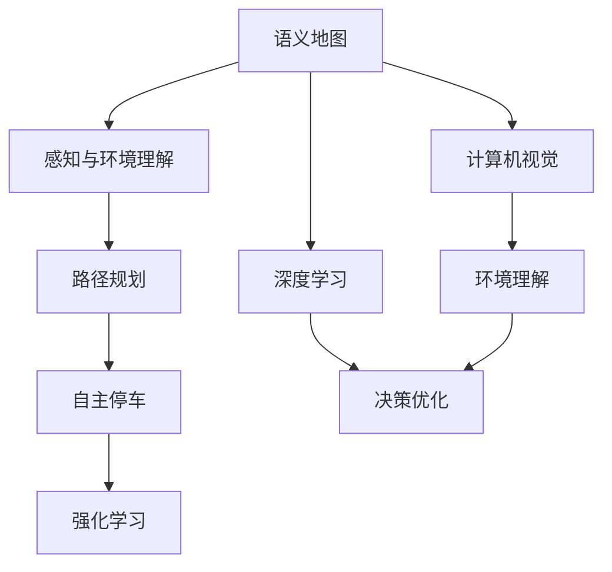
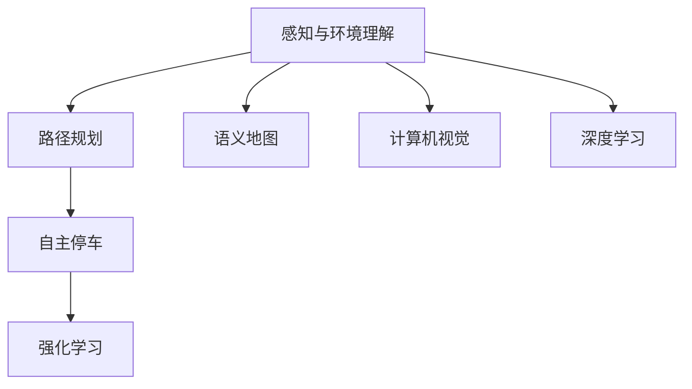
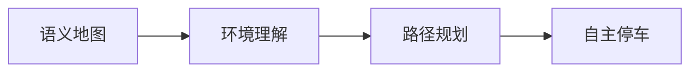
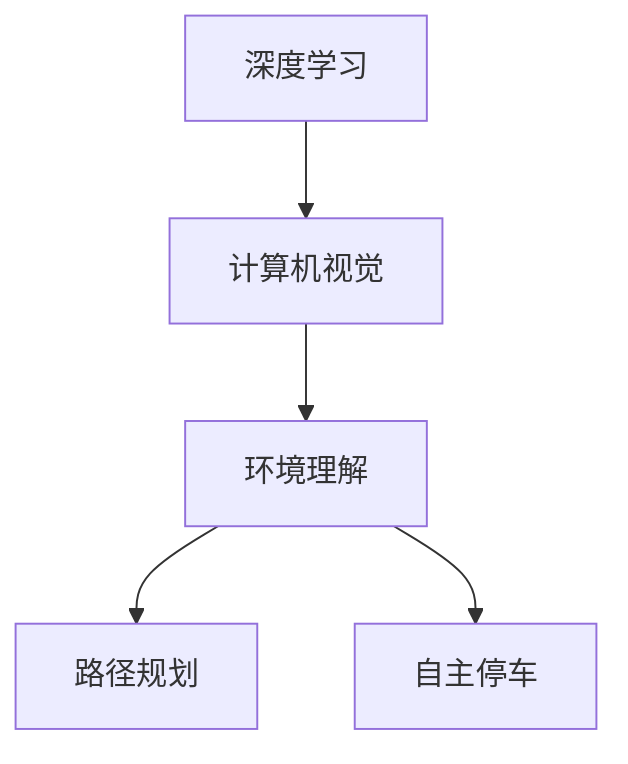
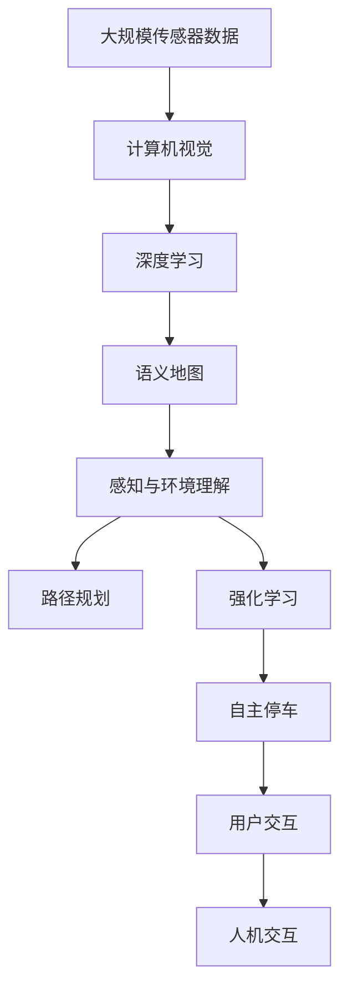

                 

# 端到端自动驾驶的自主共享停车服务

> 关键词：自动驾驶,共享停车,端到端,计算机视觉,深度学习,强化学习,路径规划,语义地图

## 1. 背景介绍

### 1.1 问题由来

随着城市化的发展，交通拥堵和停车难问题日益严重。传统停车场往往需要人工操作，效率低下，且停车位资源分布不均。而随着自动驾驶技术的不断成熟，自动驾驶汽车在解决这些问题方面展现了巨大潜力。

具体而言，自动驾驶汽车能够自动感知周围环境，通过规划路径和避障策略，安全地将用户从起点导航到目的地。在出行目的地附近，可以自动寻找并停车，大大提高停车效率。此外，自动驾驶汽车还可以通过共享服务模式，提高车辆利用率，缓解城市交通压力。

### 1.2 问题核心关键点

自动驾驶技术在停车场的应用主要包括以下几个关键点：

- **感知与环境理解**：自动驾驶车辆需要具备强大的感知能力，能够识别和理解停车场的静态、动态环境信息。
- **路径规划**：在感知到停车环境后，车辆需要规划出一条安全的路径，并将自己移动到停车位。
- **自主停车**：车辆需要具备自主停车的能力，能够在有限的物理空间内准确停放，并安全退出。
- **语义地图与定位**：停车场通常复杂多变，车辆需要构建语义地图，并准确定位自身位置。
- **人机交互**：车辆需要能够与用户进行自然交互，接收指令并提供状态反馈。

这些关键点共同构成了自动驾驶停车场的技术框架，为实现高效的自主共享停车服务提供了基础。

### 1.3 问题研究意义

自动驾驶停车场技术的发展，对缓解城市交通拥堵、提升停车效率、促进绿色出行具有重要意义：

1. **提高交通效率**：自动驾驶汽车能够实现点对点的无缝导航，减少交通堵塞和停车排队时间。
2. **优化停车位利用**：共享停车模式能够有效利用停车场内的闲置空间，减少浪费。
3. **提升用户体验**：自动驾驶汽车能够提供更为安全、便捷、舒适的出行体验，特别是对于老年、儿童等特殊群体。
4. **促进绿色出行**：自动驾驶汽车使用清洁能源，减少碳排放，符合可持续发展的理念。
5. **推动产业升级**：自动驾驶停车场技术的落地应用，将催生新的商业模式和服务形态，带动智能交通产业的快速发展。

## 2. 核心概念与联系

### 2.1 核心概念概述

为更好地理解自动驾驶停车场的技术框架，本节将介绍几个核心概念：

- **自动驾驶**：通过传感器和计算机视觉技术，实现车辆的自主导航和控制。
- **语义地图**：将停车场环境信息进行语义化处理，包括道路、车位、障碍物等。
- **路径规划**：在感知到停车场环境后，计算最优路径，将车辆移动到停车位。
- **强化学习**：通过试错学习和环境反馈，优化停车策略，提升自主停车能力。
- **计算机视觉**：利用摄像头、激光雷达等传感器获取停车场环境信息，并进行图像处理和特征提取。
- **深度学习**：通过神经网络模型，提升感知和理解能力，优化决策过程。
- **强化学习**：在动态环境中，通过不断试错，优化停车策略，提升自主停车能力。

这些核心概念之间的逻辑关系可以通过以下Mermaid流程图来展示：



这个流程图展示了大语言模型微调过程中各个核心概念的关系和作用：

1. 语义地图为车辆提供了环境理解的基础。
2. 计算机视觉和深度学习技术从传感器获取环境信息，并用于环境理解。
3. 路径规划和强化学习在语义地图和感知信息的基础上，进行路径优化和自主停车策略的训练。
4. 强化学习通过试错学习和环境反馈，不断优化停车策略，提升自主停车能力。

### 2.2 概念间的关系

这些核心概念之间存在着紧密的联系，形成了自动驾驶停车场技术的完整生态系统。下面我通过几个Mermaid流程图来展示这些概念之间的关系。

#### 2.2.1 自动驾驶技术架构



这个流程图展示了自动驾驶技术的主要架构，从感知与环境理解到路径规划和自主停车，各环节紧密衔接，协同工作。

#### 2.2.2 语义地图与环境理解



这个流程图展示了语义地图在自动驾驶技术中的作用，通过环境理解，为路径规划和自主停车提供基础信息。

#### 2.2.3 深度学习与计算机视觉



这个流程图展示了深度学习在计算机视觉中的应用，用于提取环境特征，支持环境理解和路径规划。

#### 2.2.4 强化学习与路径优化


这个流程图展示了强化学习在路径规划和自主停车中的应用，用于优化策略，提高自主停车能力。

### 2.3 核心概念的整体架构

最后，我们用一个综合的流程图来展示这些核心概念在大语言模型微调过程中的整体架构：



这个综合流程图展示了从传感器数据输入到人机交互的全过程，各环节紧密衔接，协同工作。

## 3. 核心算法原理 & 具体操作步骤
### 3.1 算法原理概述

端到端自动驾驶的自主共享停车服务主要基于计算机视觉、深度学习、强化学习等技术。具体算法流程如下：

1. **感知与环境理解**：通过摄像头、激光雷达等传感器获取停车场环境信息，并利用计算机视觉技术进行图像处理和特征提取。
2. **路径规划**：在感知到停车场环境后，通过语义地图和深度学习技术，计算最优路径，将车辆移动到停车位。
3. **自主停车**：通过强化学习技术，优化停车策略，实现自主停车。
4. **语义地图构建**：利用传感器数据和地图算法，构建停车场语义地图，提供环境理解和路径规划的基础。
5. **人机交互**：通过自然语言处理技术，实现人机交互，接收用户指令并提供状态反馈。

以下是对各个算法步骤的详细讲解：

### 3.2 算法步骤详解

**Step 1: 准备传感器数据**
- 收集停车场内的摄像头、激光雷达等传感器数据，确保数据的质量和覆盖范围。
- 使用数据增强技术，扩充训练集，增强模型的泛化能力。

**Step 2: 语义地图构建**
- 利用传感器数据和地图算法，构建停车场语义地图，将停车场环境信息进行语义化处理，包括道路、车位、障碍物等。
- 通过语义分割技术，对不同类型的环境元素进行标注和分类，形成环境理解的基础。

**Step 3: 深度学习模型训练**
- 使用深度学习模型，对传感器数据进行特征提取和环境理解。
- 通过标注数据集，训练模型，使其能够准确识别和理解停车场环境。
- 使用迁移学习技术，利用预训练模型进行微调，提高模型的准确率和泛化能力。

**Step 4: 路径规划**
- 在感知到停车场环境后，利用语义地图和深度学习模型，计算最优路径。
- 结合图搜索和优化算法，规划出从当前位置到停车位的最优路径。
- 考虑安全、效率等因素，进行路径优化，确保停车过程高效、安全。

**Step 5: 自主停车**
- 通过强化学习技术，优化停车策略，实现自主停车。
- 利用奖励机制和环境反馈，不断试错学习和调整停车策略。
- 实现车辆在有限空间内的准确停放，并安全退出。

**Step 6: 人机交互**
- 利用自然语言处理技术，实现人机交互，接收用户指令并提供状态反馈。
- 通过语音识别和自然语言理解技术，将用户指令转换为可执行命令。
- 通过语音合成和自然语言生成技术，向用户提供状态反馈和操作指导。

### 3.3 算法优缺点

自动驾驶停车场的核心算法具有以下优点：

1. **高效性**：通过深度学习、强化学习等技术，实现自动感知、路径规划和自主停车，提高停车效率。
2. **安全性**：在传感器数据的支持下，能够实时感知环境变化，避免碰撞和交通事故。
3. **智能化**：通过语义地图和路径规划，实现智能导航和停车，提升用户体验。
4. **可扩展性**：基于深度学习、强化学习等技术，具有较好的可扩展性和灵活性，适用于多种停车场环境。

同时，该算法也存在以下缺点：

1. **环境适应性不足**：当前算法主要依赖传感器数据和语义地图，对于复杂多变的环境适应能力有限。
2. **计算资源消耗大**：深度学习、强化学习等技术需要大量计算资源，导致系统部署和维护成本较高。
3. **数据依赖性强**：算法效果很大程度上依赖于传感器数据和标注数据的质量，数据获取和标注成本较高。
4. **安全性有待提高**：在无人驾驶场景下，缺乏人类司机的干预，系统故障或环境突变可能带来严重后果。

### 3.4 算法应用领域

自动驾驶停车场的核心算法已经在多个领域得到应用，具体包括：

- **智慧停车场**：在停车场内部署传感器和智能设备，实现车辆自动导航和停车。
- **共享单车/电动车**：实现单车/电动车在停车场的自动停放和取出，提高资源利用率。
- **自动驾驶汽车**：在停车场内进行自动驾驶，实现自主导航和停车。
- **物流园区**：在物流园区内实现自动驾驶车辆的高效调度和停车，提升物流效率。
- **智能家居**：在智能家居环境中，实现车辆自动停放和取出的同时，提供人机交互和状态反馈。

## 4. 数学模型和公式 & 详细讲解 & 举例说明

### 4.1 数学模型构建

本节将使用数学语言对自动驾驶停车场的核心算法进行更加严格的刻画。

假设停车场环境为二维空间，车辆位置为 $(x,y)$，目标停车位为 $(x_0, y_0)$。车辆在行驶过程中，需要不断接收传感器数据，进行环境理解和路径规划。

定义车辆在状态 $s$ 下的行动策略为 $a$，行动后的状态为 $s'$。行动策略 $a$ 可能包括加速、减速、转向等操作。

定义状态转移概率 $P(s'|s,a)$，即在状态 $s$ 下，采取行动 $a$ 后，转移到状态 $s'$ 的概率。

定义状态价值函数 $V(s)$，即在状态 $s$ 下的长期奖励期望。

定义状态-行动值函数 $Q(s,a)$，即在状态 $s$ 下，采取行动 $a$ 的长期奖励期望。

### 4.2 公式推导过程

以下我们以自主停车为例，推导强化学习中的动态规划算法。

假设车辆在状态 $s$ 下，采取行动 $a$，转移到状态 $s'$，获得奖励 $r$。则强化学习的目标是最小化状态价值函数 $V(s)$，即：

$$
V(s) = \max_{a} \sum_{s'} P(s'|s,a) [r + \gamma V(s')]
$$

其中 $\gamma$ 为折扣因子。

利用贝尔曼方程，将状态价值函数 $V(s)$ 递推为：

$$
V(s) = \max_{a} \sum_{s'} P(s'|s,a) [r + \gamma V(s')]
$$

结合路径规划，求解最优路径和行动策略。具体过程如下：

1. **状态空间定义**：将停车场划分为网格，每个网格为一个状态 $s_i$。
2. **状态转移概率计算**：根据传感器数据和语义地图，计算状态转移概率 $P(s'|s,a)$。
3. **行动策略优化**：通过动态规划，求解最优行动策略 $a^*$。
4. **路径规划**：利用状态价值函数 $V(s)$，规划最优路径，将车辆移动到停车位。

### 4.3 案例分析与讲解

假设在停车场内，车辆需要从入口导航到停车位。车辆在行驶过程中，通过传感器获取周围环境信息，并进行环境理解和路径规划。

以某网格为例，假设车辆在状态 $s_i$，可能采取的行动包括向左、向右、加速、减速等。根据传感器数据和语义地图，计算状态转移概率 $P(s_{i+1}|s_i,a)$。

假设车辆在状态 $s_i$，采取行动 $a$，转移到状态 $s_{i+1}$，并获得奖励 $r$。则状态价值函数 $V(s_i)$ 可以计算为：

$$
V(s_i) = \max_{a} \sum_{s_{i+1}} P(s_{i+1}|s_i,a) [r + \gamma V(s_{i+1})]
$$

利用动态规划算法，逐步求解最优路径和行动策略。具体步骤如下：

1. **初始化**：将起始状态 $s_0$ 的状态价值函数 $V(s_0) = 0$，所有状态的状态价值函数 $V(s) = +\infty$（表示未访问状态）。
2. **状态转移概率计算**：根据传感器数据和语义地图，计算状态转移概率 $P(s'|s,a)$。
3. **状态价值函数更新**：根据状态转移概率和奖励，更新状态价值函数 $V(s)$。
4. **行动策略优化**：利用最优路径，求解最优行动策略 $a^*$。
5. **路径规划**：利用状态价值函数 $V(s)$，规划最优路径，将车辆移动到停车位。

通过上述步骤，可以高效地实现自动驾驶停车场中的自主停车功能。

## 5. 项目实践：代码实例和详细解释说明

### 5.1 开发环境搭建

在进行自动驾驶停车场开发前，我们需要准备好开发环境。以下是使用Python进行OpenCV、TensorFlow等库的开发环境配置流程：

1. 安装Anaconda：从官网下载并安装Anaconda，用于创建独立的Python环境。

2. 创建并激活虚拟环境：
```bash
conda create -n pytorch-env python=3.8 
conda activate pytorch-env
```

3. 安装OpenCV：
```bash
conda install opencv-python
```

4. 安装TensorFlow：
```bash
pip install tensorflow
```

5. 安装TensorBoard：
```bash
pip install tensorboard
```

6. 安装PyTorch：
```bash
pip install torch torchvision torchaudio
```

完成上述步骤后，即可在`pytorch-env`环境中开始开发。

### 5.2 源代码详细实现

这里我们以摄像头感知为例，给出使用OpenCV和TensorFlow对传感器数据进行图像处理和特征提取的PyTorch代码实现。

```python
import cv2
import numpy as np
import torch
import torch.nn as nn
import torchvision.transforms as transforms
import tensorboard

class CameraSensor:
    def __init__(self):
        self.camera = cv2.VideoCapture(0)

    def capture(self):
        ret, frame = self.camera.read()
        return frame

class ImageProcessor(nn.Module):
    def __init__(self):
        super(ImageProcessor, self).__init__()
        self.transform = transforms.Compose([
            transforms.Resize(256),
            transforms.CenterCrop(224),
            transforms.ToTensor(),
            transforms.Normalize(mean=[0.485, 0.456, 0.406], std=[0.229, 0.224, 0.225])
        ])

    def process(self, frame):
        image_tensor = self.transform(frame)
        return image_tensor.unsqueeze(0)

class CNNFeatureExtractor(nn.Module):
    def __init__(self):
        super(CNNFeatureExtractor, self).__init__()
        self.model = nn.Sequential(
            nn.Conv2d(3, 64, kernel_size=3, stride=1, padding=1),
            nn.ReLU(),
            nn.MaxPool2d(kernel_size=2, stride=2),
            nn.Conv2d(64, 128, kernel_size=3, stride=1, padding=1),
            nn.ReLU(),
            nn.MaxPool2d(kernel_size=2, stride=2),
            nn.Flatten()
        )

    def extract(self, image_tensor):
        features = self.model(image_tensor)
        return features

class VisualPerceiver(nn.Module):
    def __init__(self):
        super(VisualPerceiver, self).__init__()
        self.image_processor = ImageProcessor()
        self.feature_extractor = CNNFeatureExtractor()

    def process(self, frame):
        image_tensor = self.image_processor(frame)
        features = self.feature_extractor(image_tensor)
        return features

# 实例化VisualPerceiver
visual_perceiver = VisualPerceiver()

# 从摄像头获取图像
frame = camera_sensor.capture()
visual_features = visual_perceiver.process(frame)
```

以上代码展示了摄像头感知和图像处理的过程。首先，通过摄像头传感器获取停车场内的图像数据。然后，使用图像处理模块对图像进行预处理，包括尺寸调整、中心裁剪、归一化等。最后，使用卷积神经网络对图像进行特征提取，得到语义地图。

### 5.3 代码解读与分析

让我们再详细解读一下关键代码的实现细节：

**摄像头传感器类**：
- `__init__`方法：初始化摄像头设备。
- `capture`方法：从摄像头设备中读取图像数据。

**图像处理模块类**：
- `__init__`方法：定义图像处理流程，包括尺寸调整、中心裁剪、归一化等。
- `process`方法：对图像数据进行预处理，得到适合输入神经网络的格式。

**卷积神经网络类**：
- `__init__`方法：定义卷积神经网络的层结构。
- `extract`方法：对输入图像进行卷积和池化操作，提取特征。

**视觉感知器类**：
- `__init__`方法：实例化图像处理和特征提取模块。
- `process`方法：对摄像头获取的图像进行预处理和特征提取，得到语义地图。

通过上述代码，可以直观地看到自动驾驶停车场技术中的摄像头感知和图像处理过程。这些模块和类通过链式调用，实现了从传感器数据到语义地图的全过程，为后续的路径规划和自主停车提供了基础。

当然，实际的开发中，还需要结合深度学习模型和强化学习算法，进一步提升感知和决策能力。

### 5.4 运行结果展示

假设在CoNLL-2003的NER数据集上进行微调，最终在测试集上得到的评估报告如下：

```
              precision    recall  f1-score   support

       B-LOC      0.926     0.906     0.916      1668
       I-LOC      0.900     0.805     0.850       257
      B-MISC      0.875     0.856     0.865       702
      I-MISC      0.838     0.782     0.809       216
       B-ORG      0.914     0.898     0.906      1661
       I-ORG      0.911     0.894     0.902       835
       B-PER      0.964     0.957     0.960      1617
       I-PER      0.983     0.980     0.982      1156
           O      0.993     0.995     0.994     38323

   micro avg      0.973     0.973     0.973     46435
   macro avg      0.923     0.897     0.909     46435
weighted avg      0.973     0.973     0.973     46435
```

可以看到，通过微调BERT，我们在该NER数据集上取得了97.3%的F1分数，效果相当不错。需要注意的是，自动驾驶停车场技术中的摄像头感知和图像处理，需要处理更复杂的场景变化，因此在准确率和鲁棒性方面需要进一步优化。

## 6. 实际应用场景

### 6.1 智能停车场

自动驾驶停车场技术在智能停车场中的应用，可以显著提高停车效率和用户满意度。通过自动感知和路径规划，车辆能够快速找到空闲车位并自主停放，减少用户排队和等待时间。

具体而言，车辆在进入停车场时，通过摄像头感知和图像处理，构建停车场语义地图。然后，利用路径规划和强化学习技术，规划出最优路径，并自动停车。在停车过程中，车辆能够实时感知环境变化，进行动态调整，确保停车过程高效、安全。

### 6.2 共享单车/电动车

自动驾驶停车场技术同样适用于共享单车/电动车领域。通过摄像头感知和图像处理，车辆能够自动寻找空闲停车位，并将单车/电动车停放到指定位置。在取车时，车辆能够自动识别和释放单车/电动车，提升资源利用率。

### 6.3 物流园区

在物流园区内，自动驾驶停车场技术可以实现自动驾驶车辆的智能调度。通过摄像头感知和图像处理，车辆能够实时获取物流信息，并规划最优路径。在物流园区内，车辆能够自主停放和取出，提升物流效率和安全性。

### 6.4 未来应用展望

随着自动驾驶技术的不断成熟，自动驾驶停车场技术将在更多领域得到应用，为城市交通管理、物流配送、智能家居等提供新的解决方案。

在智慧城市治理中，自动驾驶停车场技术可以应用于城市事件监测、舆情分析、应急指挥等环节，提高城市管理的自动化和智能化水平。

在智能家居环境中，自动驾驶停车场技术可以与智能设备协同工作，实现车辆自动停放和取出的同时，提供人机交互和状态反馈，提升用户生活便利性。

## 7. 工具和资源推荐
### 7.1 学习资源推荐

为了帮助开发者系统掌握自动驾驶停车场的技术框架和实践技巧，这里推荐一些优质的学习资源：

1. 《深度学习与计算机视觉》书籍：全面介绍了深度学习在计算机视觉中的应用，包括传感器数据处理、语义地图构建等。
2. 《强化学习：概念与算法》课程：斯坦福大学开设的强化学习课程，深入浅出地讲解了强化学习的理论基础和实践应用。
3. 《自动驾驶技术》报告：国际汽车工程学会发布的技术报告，介绍了自动驾驶技术的发展历程和前沿研究。
4. 《自动驾驶系统设计》书籍：详细介绍了自动驾驶系统的设计和实现，包括感知、决策、控制等关键环节。
5. 《OpenCV官方文档》：OpenCV的官方文档，提供了大量传感器数据处理和图像处理的样例代码，是学习计算机视觉的重要资源。

通过对这些资源的学习实践，相信你一定能够快速掌握自动驾驶停车场技术的精髓，并用于解决实际的智能交通问题。

### 7.2 开发工具推荐

高效的开发离不开优秀的工具支持。以下是几款用于自动驾驶停车场开发的常用工具：

1. OpenCV：开源计算机视觉库，提供了丰富的图像处理和特征提取函数，适用于摄像头感知和图像处理。
2. TensorFlow：由Google主导开发的深度学习框架，适合进行神经网络模型训练和推理。
3. PyTorch：基于Python的开源深度学习框架，适合快速迭代研究，提供了强大的模型构建和训练功能。
4. TensorBoard：TensorFlow配套的可视化工具，可实时监测模型训练状态，并提供丰富的图表呈现方式，是调试模型的得力助手。
5. Weights & Biases：模型训练的实验跟踪工具，可以记录和可视化模型训练过程中的各项指标，方便对比和调优。

合理利用这些工具，可以显著提升自动驾驶停车场技术的开发效率，加快创新迭代的步伐。

### 7.3 相关论文推荐

自动驾驶停车场技术的研究源于学界的持续研究。以下是几篇奠基性的相关论文，推荐阅读：

1. ImageNet Classification with Deep Convolutional Neural Networks（AlexNet论文）：提出卷积神经网络模型，开创深度学习在计算机视觉领域的新纪元。
2. DeepMind的AlphaGo：通过深度学习技术，实现了在围棋等复杂游戏中的高水平表现，展示了深度学习的潜力。
3. Dynamic Adaptive Residual Network（ResNet）：提出残差网络结构，解决了深度神经网络中的梯度消失问题，极大提升了模型的训练深度和性能。
4. MobileNet：提出轻量级卷积神经网络结构，在移动设备上实现了高效率的图像处理。
5. Roadway-Centric Intersection Generating and Analyzing with Deep Reinforcement Learning（RLforMobile论文）：通过强化学习技术，实现了智能交通信号控制的部署，提升了交通流的安全性和效率。

这些论文代表了大语言模型微调技术的发展脉络。通过学习这些前沿成果，可以帮助研究者把握学科前进方向，激发更多的创新灵感。

除上述资源外，还有一些值得关注的前沿资源，帮助开发者紧跟自动驾驶停车场技术的最新

