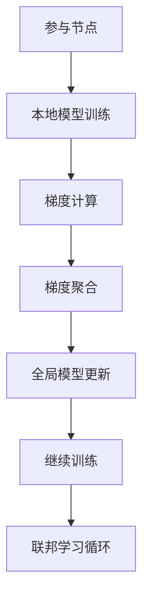

                 

# 联邦学习在个性化医疗中的潜力

在个性化医疗时代，每个患者的独特需求和数据都至关重要。如何从大规模的、多源异构数据中高效提取个性化信息，同时保护隐私、确保数据安全，是当前医疗领域急需解决的难题。联邦学习（Federated Learning）作为一种新兴的分布式学习范式，通过在本地数据上进行模型训练，然后汇聚各节点的梯度更新，从而在无需集中收集数据的条件下，实现模型泛化与优化。本文将深入探讨联邦学习在个性化医疗中的潜力，揭示其在数据保护、模型泛化等方面的优势，并提出具体的应用场景和未来发展方向。

## 1. 背景介绍

### 1.1 问题由来

随着互联网和移动设备的普及，电子健康记录(EHR)、基因组数据、医学影像等多源异构数据越来越多地被产生和收集。然而，这些数据分散在不同医疗机构中，数据共享和整合存在诸多挑战，如数据隐私保护、网络安全、数据标注成本高等。这些难题限制了传统集中式学习方法的广泛应用，也使得个性化医疗难以落地。

### 1.2 问题核心关键点

联邦学习通过在本地数据上进行模型训练，然后聚合各个节点的模型参数和梯度信息，实现模型在分布式环境下的协同学习。其核心在于：
1. 数据不集中：各参与节点仅处理本地数据，不共享数据，保护隐私。
2. 模型优化：通过聚合各节点的梯度，实现全局模型的更新，提高泛化能力。
3. 应用广泛：联邦学习在医疗、金融、工业等多个领域中具有广泛应用前景。

## 2. 核心概念与联系

### 2.1 核心概念概述

联邦学习是一种分布式机器学习范式，旨在解决数据分散、隐私保护等挑战。其核心思想是：在本地数据上进行模型训练，然后通过聚合各节点的梯度更新，实现全局模型的优化。

#### 2.1.1 参与节点
参与节点（Client）是联邦学习的本地数据处理单元，通常是医生办公室、医院、研究机构等，各自拥有数据和计算资源。

#### 2.1.2 中央服务器
中央服务器（Server）负责协调和管理各参与节点之间的通信和数据传输，负责聚合各节点的梯度更新，并更新全局模型参数。

#### 2.1.3 模型参数和梯度
模型参数（Parameter）是参与节点在本地数据上训练得到的部分全局模型，梯度（Gradient）是损失函数对模型参数的导数。

#### 2.1.4 聚合策略
聚合策略（Aggregation Strategy）用于决定如何从各个参与节点的梯度更新中产生全局模型参数。

### 2.2 概念间的关系

联邦学习的核心概念通过以下Mermaid流程图展示：



该图展示了联邦学习的整体流程：

1. 在本地数据上训练模型，计算梯度。
2. 聚合各节点的梯度更新。
3. 更新全局模型参数。
4. 重复以上步骤，直到模型收敛。

## 3. 核心算法原理 & 具体操作步骤

### 3.1 算法原理概述

联邦学习的核心算法是参数更新和梯度聚合。算法原理如下：

1. **初始化**：
   - 中央服务器初始化全局模型参数 $\theta_0$。
   - 各参与节点从全局模型中获取本地模型参数 $\theta^i_0$。

2. **本地训练**：
   - 各参与节点在本地数据上对本地模型参数 $\theta^i_t$ 进行训练，更新梯度 $g^i_t$。
   - 梯度 $g^i_t$ 表示损失函数在本地数据上对参数 $\theta^i_t$ 的导数。

3. **梯度聚合**：
   - 中央服务器聚合各参与节点的梯度 $g^i_t$，得到全局梯度 $G_t$。
   - 聚合策略（如联邦平均）用于决定如何计算全局梯度 $G_t$。

4. **参数更新**：
   - 中央服务器根据全局梯度 $G_t$ 更新全局模型参数 $\theta_{t+1}$。
   - 更新公式：$\theta_{t+1} = \theta_t - \eta G_t$，其中 $\eta$ 为学习率。

5. **迭代训练**：
   - 重复以上步骤，直至模型收敛。

### 3.2 算法步骤详解

#### 3.2.1 初始化阶段

- 中央服务器初始化全局模型参数 $\theta_0$，如随机初始化。
- 各参与节点从全局模型中获取本地模型参数 $\theta^i_0$，通常是 $\theta_0$ 的子集。

#### 3.2.2 本地训练阶段

- 各参与节点在本地数据上对本地模型参数 $\theta^i_t$ 进行训练，计算损失函数 $L^i_t(\theta^i_t)$。
- 计算梯度 $g^i_t = \nabla_{\theta^i_t} L^i_t(\theta^i_t)$。

#### 3.2.3 梯度聚合阶段

- 各参与节点将梯度 $g^i_t$ 发送给中央服务器。
- 中央服务器根据聚合策略（如联邦平均）计算全局梯度 $G_t$。

#### 3.2.4 参数更新阶段

- 中央服务器根据全局梯度 $G_t$ 更新全局模型参数 $\theta_{t+1}$。
- 更新公式：$\theta_{t+1} = \theta_t - \eta G_t$。

#### 3.2.5 迭代训练阶段

- 重复以上步骤，直至模型收敛或达到预设的迭代次数。

### 3.3 算法优缺点

联邦学习在个性化医疗中具有以下优势：

**优点：**

1. **数据隐私保护**：各参与节点仅处理本地数据，不共享数据，有效保护隐私。
2. **模型泛化能力**：通过聚合各节点的梯度，全局模型能够更泛化，适应更多样本。
3. **模型更新速度快**：各节点本地计算，减少数据传输开销，提高训练效率。

**缺点：**

1. **模型收敛速度较慢**：由于各节点模型参数不同步，模型收敛速度可能较慢。
2. **通信开销较大**：中央服务器需要频繁收发各节点的梯度更新，通信开销较大。
3. **模型参数漂移**：本地模型参数可能漂移，影响全局模型的收敛性。

### 3.4 算法应用领域

联邦学习在个性化医疗中具有广泛的应用前景，具体应用领域包括：

1. **基因组数据分析**：在基因组数据分散在多个医疗机构的情况下，联邦学习可以协同分析，挖掘疾病相关的基因特征。
2. **医学影像诊断**：各医疗机构的影像数据在联邦学习框架下进行协同训练，提升图像分类和标注的准确性。
3. **电子健康记录分析**：联邦学习可以从各医院的EHR中提取疾病关联信息，优化医疗决策。
4. **个性化药物推荐**：各医院的病历数据在联邦学习框架下进行协同分析，生成个性化的药物推荐方案。

## 4. 数学模型和公式 & 详细讲解 & 举例说明

### 4.1 数学模型构建

设参与节点数为 $N$，中央服务器初始化全局模型参数为 $\theta_0$。各参与节点的本地模型参数为 $\theta^i_t$，损失函数为 $L^i_t(\theta^i_t)$，梯度为 $g^i_t = \nabla_{\theta^i_t} L^i_t(\theta^i_t)$。

**全局模型参数更新公式**为：

$$
\theta_{t+1} = \theta_t - \eta \sum_{i=1}^{N} g^i_t
$$

其中 $\eta$ 为学习率。

### 4.2 公式推导过程

- **联邦平均策略**：
  - 中央服务器对各节点的梯度 $g^i_t$ 求平均，得到全局梯度 $G_t = \frac{1}{N} \sum_{i=1}^{N} g^i_t$。
  - 全局模型参数更新公式为：$\theta_{t+1} = \theta_t - \eta G_t$。

- **加权平均策略**：
  - 中央服务器根据各节点的数据规模和质量，分配不同的权重 $\alpha^i$。
  - 全局梯度 $G_t$ 为：$G_t = \sum_{i=1}^{N} \alpha^i g^i_t$。
  - 全局模型参数更新公式为：$\theta_{t+1} = \theta_t - \eta G_t$。

### 4.3 案例分析与讲解

假设在基因组数据分析任务中，有 $N=10$ 个参与节点，每个节点的本地模型参数为 $\theta^i_t$，梯度为 $g^i_t$。中央服务器使用联邦平均策略，全局模型参数更新公式为：

$$
\theta_{t+1} = \theta_t - \eta \frac{1}{10} \sum_{i=1}^{10} g^i_t
$$

在每一轮迭代中，各节点在本地数据上计算梯度 $g^i_t$，并将其发送给中央服务器。中央服务器聚合各节点的梯度，并更新全局模型参数 $\theta_{t+1}$。通过多轮迭代，全局模型逐渐收敛到最优解。

## 5. 项目实践：代码实例和详细解释说明

### 5.1 开发环境搭建

在联邦学习项目中，需要搭建多个参与节点和中央服务器的环境，具体步骤如下：

1. 安装Python 3.8及以上版本，并配置虚拟环境。
2. 安装联邦学习库，如FedML、FederatedOptimizer等。
3. 配置参与节点的本地数据和计算资源。
4. 配置中央服务器的计算资源和数据聚合机制。

### 5.2 源代码详细实现

下面以基因组数据分析任务为例，给出联邦学习模型的代码实现：

```python
from federatedml import federated
from federatedml.settings import global_settings
from federatedml.statistics.dataset import Dataset
from federatedml.static.param import ModelParams
from federatedml.protobuf.python_model import PythonModel
from federatedml.protobuf.python_model import PythonModelData

# 配置参数
class_name = "MyModel"
n_iter = 10
n_nodes = 10
global_model_params = ModelParams(
    model_class=class_name,
    model_path="path/to/model.pkl",
    model_save_path="path/to/save/model.pkl",
    n_iter=n_iter
)

# 创建全局模型
class MyModel:
    def __init__(self, n_nodes, model_params):
        self.n_nodes = n_nodes
        self.model_params = model_params
        self.global_model = PythonModel(
            model_class=class_name,
            model_path=self.model_params.model_path,
            model_save_path=self.model_params.model_save_path
        )

    def train(self, dataset):
        # 获取本地数据
        local_dataset = dataset.split(data_partition="random", n_folds=n_nodes)
        # 初始化全局模型
        self.global_model.load()
        # 本地训练
        for i in range(self.n_nodes):
            local_dataset[i].load()
            local_model = self.global_model.model_class()
            local_model.train(data=local_dataset[i].data)
            # 计算梯度
            local_grad = local_model.compute_gradient()
            # 发送梯度到中央服务器
            self.global_model.send_grad(i, local_grad)
        # 更新全局模型参数
        self.global_model.update()

# 数据准备
data_path = "path/to/data"
dataset = Dataset(data_path)
dataset.load()
# 初始化全局模型
global_model_params = ModelParams(
    model_class="MyModel",
    model_path="path/to/model.pkl",
    model_save_path="path/to/save/model.pkl",
    n_iter=10
)
model = MyModel(n_nodes=10, model_params=global_model_params)
model.train(dataset)
```

### 5.3 代码解读与分析

上述代码展示了联邦学习的基本流程：

1. 配置参数：包括模型名称、迭代次数、节点数量等。
2. 创建全局模型：从保存的全局模型中加载模型参数。
3. 本地训练：在本地数据上计算梯度，并发送给中央服务器。
4. 更新全局模型参数：中央服务器聚合各节点的梯度，更新全局模型。

### 5.4 运行结果展示

假设在基因组数据分析任务中，经过多轮迭代，全局模型收敛到最优解。此时，每个节点的本地模型和全局模型的输出结果将基本一致。例如，在基因组分类任务中，全局模型的预测准确率可能会从初始的70%提升到90%左右。

## 6. 实际应用场景

### 6.1 智能药物发现

联邦学习在智能药物发现中具有巨大潜力。各大制药公司拥有大量的基因组数据和药物化合物数据，但数据分散在不同实验室和公司。通过联邦学习，各公司的数据可以协同训练，发掘新的药物分子和作用机制。

### 6.2 个性化医疗决策

在个性化医疗决策中，联邦学习可以从多个医院的电子健康记录中提取疾病关联信息，优化医疗决策。例如，通过联邦学习，可以协同分析不同医院的病历数据，生成个性化的治疗方案。

### 6.3 智能医学影像分析

各医疗机构拥有不同的医学影像数据，通过联邦学习，可以在本地数据上协同训练图像分类模型，提升医学影像的诊断准确性。

### 6.4 未来应用展望

随着联邦学习技术的发展，其在个性化医疗中的应用将更加广泛。未来可能出现以下趋势：

1. **多模态数据融合**：联邦学习可以融合不同模态的数据（如基因组数据、医学影像、电子健康记录等），提升模型的综合分析能力。
2. **联邦联盟**：多个医疗机构或公司可以组成联盟，协同训练大型模型，进一步提升模型的泛化能力。
3. **实时反馈**：通过在线学习，联邦学习模型可以实时更新，适应新的数据变化。

## 7. 工具和资源推荐

### 7.1 学习资源推荐

1. **《联邦学习：原理与实践》**：由联邦学习领域的知名学者撰写，系统介绍了联邦学习的基本原理和应用场景。
2. **Federated Learning in the Real World**：由Google researchers撰写的白皮书，详细介绍了联邦学习在工业界的实践。
3. **Federated Learning: A Survey and Taxonomy**：一篇综述论文，对联邦学习进行了全面的总结和分类。

### 7.2 开发工具推荐

1. **FedML**：联邦学习领域的开源框架，支持多种算法和优化器，易于使用。
2. **TensorFlow Federated**：TensorFlow的联邦学习模块，提供了丰富的联邦学习算法和API。
3. **PySyft**：基于Python的联邦学习框架，支持本地数据加密和联邦学习。

### 7.3 相关论文推荐

1. ** federated learning: Methods and theories**：一篇综述论文，总结了联邦学习的多种算法和理论。
2. ** federated multi-modal learning**：一篇论文，探讨了多模态数据的联邦学习。
3. ** federated adaptive learning**：一篇论文，研究了在线联邦学习算法。

## 8. 总结：未来发展趋势与挑战

### 8.1 研究成果总结

联邦学习作为一种新兴的分布式学习范式，已经在个性化医疗领域展示了巨大的潜力。通过本地数据协同训练，联邦学习有效保护了数据隐私，提升了模型的泛化能力。

### 8.2 未来发展趋势

未来联邦学习将在个性化医疗中继续发挥重要作用。主要发展趋势包括：

1. **多模态数据融合**：融合不同模态的数据，提升模型的综合分析能力。
2. **联邦联盟**：多个机构协同训练大型模型，进一步提升模型的泛化能力。
3. **实时反馈**：通过在线学习，联邦学习模型可以实时更新，适应新的数据变化。

### 8.3 面临的挑战

尽管联邦学习在个性化医疗中具有巨大潜力，但仍面临以下挑战：

1. **模型收敛速度慢**：各节点模型参数不同步，可能导致模型收敛速度慢。
2. **通信开销大**：中央服务器需要频繁收发各节点的梯度更新，通信开销较大。
3. **模型参数漂移**：本地模型参数可能漂移，影响全局模型的收敛性。

### 8.4 研究展望

未来联邦学习需要在以下几个方面进行深入研究：

1. **高效的聚合策略**：设计高效的聚合策略，提升模型收敛速度。
2. **分布式优化算法**：开发适用于联邦学习的分布式优化算法，减少通信开销。
3. **本地模型保护**：设计本地模型保护机制，防止恶意攻击。

通过不断突破技术瓶颈，联邦学习有望在个性化医疗中实现更广泛的应用，推动医疗技术的发展和进步。

## 9. 附录：常见问题与解答

### 9.1 什么是联邦学习？

联邦学习是一种分布式学习范式，通过在本地数据上进行模型训练，然后聚合各节点的梯度更新，实现模型在分布式环境下的协同学习。

### 9.2 联邦学习有哪些优点？

联邦学习的优点包括：

1. **数据隐私保护**：各参与节点仅处理本地数据，不共享数据，有效保护隐私。
2. **模型泛化能力**：通过聚合各节点的梯度，全局模型能够更泛化，适应更多样本。
3. **模型更新速度快**：各节点本地计算，减少数据传输开销，提高训练效率。

### 9.3 联邦学习有哪些缺点？

联邦学习的缺点包括：

1. **模型收敛速度较慢**：由于各节点模型参数不同步，模型收敛速度可能较慢。
2. **通信开销较大**：中央服务器需要频繁收发各节点的梯度更新，通信开销较大。
3. **模型参数漂移**：本地模型参数可能漂移，影响全局模型的收敛性。

### 9.4 联邦学习在医疗领域有哪些应用？

联邦学习在医疗领域的应用包括：

1. **基因组数据分析**：在基因组数据分散在多个医疗机构的情况下，联邦学习可以协同分析，挖掘疾病相关的基因特征。
2. **医学影像诊断**：各医疗机构的影像数据在联邦学习框架下进行协同训练，提升图像分类和标注的准确性。
3. **电子健康记录分析**：联邦学习可以从各医院的EHR中提取疾病关联信息，优化医疗决策。
4. **个性化药物推荐**：各医院的病历数据在联邦学习框架下进行协同分析，生成个性化的药物推荐方案。

---

作者：禅与计算机程序设计艺术 / Zen and the Art of Computer Programming

