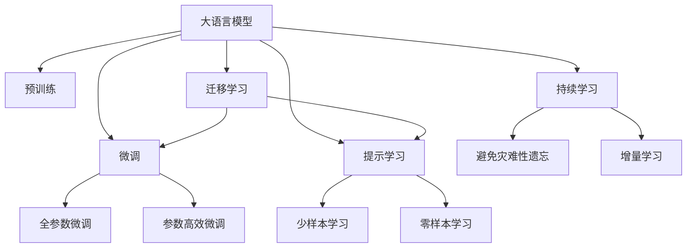

                 

# 从零开始大模型开发与微调：使用其他预训练参数来生成PyTorch 2.0词嵌入矩阵（中文）

> 关键词：
- 大语言模型
- 微调（Fine-Tuning）
- PyTorch 2.0
- 词嵌入（Word Embedding）
- 预训练（Pre-training）

## 1. 背景介绍

### 1.1 问题由来

在深度学习领域，预训练语言模型（Pre-trained Language Model, PLM）已经成为自然语言处理（NLP）领域的重要工具。其核心思想是在大规模无标签数据上进行预训练，学习到通用的语言表示，然后在特定任务上进行微调（Fine-Tuning），使其适应新的需求。

然而，对于某些特定的NLP任务，如机器翻译、问答系统、文本摘要等，仅使用通用预训练模型可能无法满足要求。因此，我们需要从零开始开发新的预训练模型，或者使用其他预训练模型进行微调，来生成符合特定需求的词嵌入（Word Embedding）。

本文旨在通过使用其他预训练参数，生成PyTorch 2.0环境下的词嵌入矩阵，从而在特定的NLP任务上提升模型的效果。

### 1.2 问题核心关键点

基于预训练语言模型的微调方法，其核心在于选择合适的预训练模型和微调策略。在实际应用中，我们需要考虑以下几个关键点：

- 选择合适的预训练模型：如BERT、GPT、XLNet等，根据任务需求选择合适的模型。
- 选择适合的微调策略：如全参数微调、参数高效微调、提示学习等，以最大化模型效果。
- 确定合适的微调参数：如学习率、批大小、迭代次数等，确保模型收敛。
- 设计合适的任务适配层：根据任务类型，设计输入和输出层，以匹配任务的特征。

### 1.3 问题研究意义

大语言模型的微调方法在NLP领域已经得到了广泛的应用，如情感分析、文本分类、命名实体识别等。通过微调，我们可以适应特定的NLP任务，提升模型的效果。

然而，对于某些特定的NLP任务，微调可能需要自定义的词嵌入矩阵。本文旨在通过使用其他预训练参数，生成符合特定任务的词嵌入矩阵，以实现更高的性能。这不仅能够满足特定任务的需求，还能提高模型的泛化能力，适应更多领域的应用。

## 2. 核心概念与联系

### 2.1 核心概念概述

为更好地理解本文的技术内容，本节将介绍几个关键概念：

- 大语言模型（Large Language Model, LLM）：如BERT、GPT、XLNet等，通过大规模预训练学习通用的语言表示。
- 预训练（Pre-training）：在无标签数据上，通过自监督学习任务训练预训练模型。
- 微调（Fine-Tuning）：在预训练模型的基础上，使用有标签数据进行微调，适应特定任务。
- 词嵌入（Word Embedding）：将文本中的单词映射到高维向量空间，用于模型训练和推理。
- PyTorch 2.0：深度学习框架，支持动态图和静态图两种计算模式。

### 2.2 概念间的关系

这些核心概念之间的关系可以通过以下Mermaid流程图来展示：



这个流程图展示了从预训练到微调，再到持续学习的过程。大语言模型首先在大规模无标签数据上进行预训练，然后通过微调（包括全参数微调和参数高效微调）来适应特定任务，最后通过持续学习不断更新模型，以适应新的数据分布。

## 3. 核心算法原理 & 具体操作步骤

### 3.1 算法原理概述

使用其他预训练参数来生成词嵌入矩阵的算法原理基于微调的框架。其核心思想是：

1. 选择一个预训练模型作为初始化参数。
2. 在特定任务的数据集上进行微调，以更新模型参数。
3. 根据微调后的模型，生成词嵌入矩阵。

### 3.2 算法步骤详解

以下是一个使用其他预训练参数来生成PyTorch 2.0词嵌入矩阵的详细算法步骤：

#### Step 1: 准备预训练模型和数据集

- 选择一个预训练模型，如BERT或GPT。
- 准备特定任务的数据集，划分为训练集、验证集和测试集。

#### Step 2: 添加任务适配层

- 根据任务类型，设计输入和输出层。
- 对于分类任务，通常在顶层添加一个线性分类器。
- 对于生成任务，通常使用语言模型的解码器输出概率分布。

#### Step 3: 设置微调超参数

- 选择合适的优化算法及其参数，如AdamW、SGD等。
- 设置学习率、批大小、迭代轮数等。
- 设置正则化技术及强度，如L2正则、Dropout等。

#### Step 4: 执行梯度训练

- 将训练集数据分批次输入模型，前向传播计算损失函数。
- 反向传播计算参数梯度，根据设定的优化算法和学习率更新模型参数。
- 周期性在验证集上评估模型性能，根据性能指标决定是否触发 Early Stopping。
- 重复上述步骤直到满足预设的迭代轮数或 Early Stopping 条件。

#### Step 5: 生成词嵌入矩阵

- 微调完成后，保存模型参数。
- 将预训练模型的词嵌入矩阵复制到新模型中。
- 根据任务需求，进行必要的后处理，如降维、归一化等。

### 3.3 算法优缺点

使用其他预训练参数来生成词嵌入矩阵的算法优点包括：

- 简单易实现：只需选择预训练模型和微调策略，即可生成词嵌入矩阵。
- 节省时间：相比于从头训练，微调可以显著减少时间成本。
- 效果显著：微调后的模型可以更好地适应特定任务，提升性能。

缺点包括：

- 依赖预训练模型：需要选择合适的预训练模型，可能存在模型偏差。
- 微调参数多：全参数微调需要更新全部预训练参数，计算成本高。
- 泛化能力有限：微调模型可能存在过拟合问题，泛化能力不足。

### 3.4 算法应用领域

该算法在NLP领域有广泛的应用，如文本分类、情感分析、命名实体识别等。以下是一个使用该算法来生成词嵌入矩阵的案例：

假设我们要进行情感分析任务，可以选择使用BERT作为预训练模型。具体步骤如下：

1. 准备数据集，如IMDB电影评论数据集，划分为训练集、验证集和测试集。
2. 选择BERT模型作为初始化参数。
3. 在IMDB数据集上进行微调，使用交叉熵损失函数，设置学习率为1e-5，迭代轮数为5。
4. 保存微调后的模型参数。
5. 将BERT的词嵌入矩阵复制到新模型中，进行必要的后处理。
6. 使用微调后的模型进行情感分析，评估效果。

通过这些步骤，我们可以使用其他预训练参数来生成词嵌入矩阵，提升模型的效果。

## 4. 数学模型和公式 & 详细讲解  
### 4.1 数学模型构建

在微调过程中，我们假设预训练模型的参数为 $\theta$，微调后的模型参数为 $\hat{\theta}$。训练集为 $D=\{(x_i,y_i)\}_{i=1}^N$，其中 $x_i$ 为输入文本，$y_i$ 为对应的标签。

定义模型 $M_{\theta}$ 在输入 $x$ 上的输出为 $\hat{y}=M_{\theta}(x)$，则微调的优化目标是最小化经验风险：

$$
\hat{\theta}=\mathop{\arg\min}_{\theta} \mathcal{L}(\theta,D)
$$

其中 $\mathcal{L}$ 为针对任务设计的损失函数，用于衡量模型预测输出与真实标签之间的差异。常见的损失函数包括交叉熵损失、均方误差损失等。

### 4.2 公式推导过程

以下以二分类任务为例，推导交叉熵损失函数及其梯度的计算公式。

假设模型 $M_{\theta}$ 在输入 $x$ 上的输出为 $\hat{y}=M_{\theta}(x) \in [0,1]$，表示样本属于正类的概率。真实标签 $y \in \{0,1\}$。则二分类交叉熵损失函数定义为：

$$
\ell(M_{\theta}(x),y) = -[y\log \hat{y} + (1-y)\log (1-\hat{y})]
$$

将其代入经验风险公式，得：

$$
\mathcal{L}(\theta) = -\frac{1}{N}\sum_{i=1}^N [y_i\log M_{\theta}(x_i)+(1-y_i)\log(1-M_{\theta}(x_i))]
$$

根据链式法则，损失函数对参数 $\theta_k$ 的梯度为：

$$
\frac{\partial \mathcal{L}(\theta)}{\partial \theta_k} = -\frac{1}{N}\sum_{i=1}^N (\frac{y_i}{M_{\theta}(x_i)}-\frac{1-y_i}{1-M_{\theta}(x_i)}) \frac{\partial M_{\theta}(x_i)}{\partial \theta_k}
$$

其中 $\frac{\partial M_{\theta}(x_i)}{\partial \theta_k}$ 可进一步递归展开，利用自动微分技术完成计算。

在得到损失函数的梯度后，即可带入参数更新公式，完成模型的迭代优化。重复上述过程直至收敛，最终得到适应下游任务的最优模型参数 $\hat{\theta}$。

### 4.3 案例分析与讲解

假设我们要进行情感分析任务，可以选择使用BERT作为预训练模型。具体步骤如下：

1. 准备数据集，如IMDB电影评论数据集，划分为训练集、验证集和测试集。
2. 选择BERT模型作为初始化参数。
3. 在IMDB数据集上进行微调，使用交叉熵损失函数，设置学习率为1e-5，迭代轮数为5。
4. 保存微调后的模型参数。
5. 将BERT的词嵌入矩阵复制到新模型中，进行必要的后处理。
6. 使用微调后的模型进行情感分析，评估效果。

通过这些步骤，我们可以使用其他预训练参数来生成词嵌入矩阵，提升模型的效果。

## 5. 项目实践：代码实例和详细解释说明
### 5.1 开发环境搭建

在进行微调实践前，我们需要准备好开发环境。以下是使用Python进行PyTorch开发的环境配置流程：

1. 安装Anaconda：从官网下载并安装Anaconda，用于创建独立的Python环境。

2. 创建并激活虚拟环境：
```bash
conda create -n pytorch-env python=3.8 
conda activate pytorch-env
```

3. 安装PyTorch：根据CUDA版本，从官网获取对应的安装命令。例如：
```bash
conda install pytorch torchvision torchaudio cudatoolkit=11.1 -c pytorch -c conda-forge
```

4. 安装Transformers库：
```bash
pip install transformers
```

5. 安装各类工具包：
```bash
pip install numpy pandas scikit-learn matplotlib tqdm jupyter notebook ipython
```

完成上述步骤后，即可在`pytorch-env`环境中开始微调实践。

### 5.2 源代码详细实现

下面以情感分析任务为例，给出使用Transformers库对BERT模型进行微调的PyTorch代码实现。

首先，定义情感分析任务的数据处理函数：

```python
from transformers import BertTokenizer
from torch.utils.data import Dataset
import torch

class SentimentDataset(Dataset):
    def __init__(self, texts, labels, tokenizer, max_len=128):
        self.texts = texts
        self.labels = labels
        self.tokenizer = tokenizer
        self.max_len = max_len
        
    def __len__(self):
        return len(self.texts)
    
    def __getitem__(self, item):
        text = self.texts[item]
        label = self.labels[item]
        
        encoding = self.tokenizer(text, return_tensors='pt', max_length=self.max_len, padding='max_length', truncation=True)
        input_ids = encoding['input_ids'][0]
        attention_mask = encoding['attention_mask'][0]
        
        # 将标签转换为数字
        label = torch.tensor([label], dtype=torch.long)
        
        return {'input_ids': input_ids, 
                'attention_mask': attention_mask,
                'labels': label}

# 加载BERT预训练模型和分词器
tokenizer = BertTokenizer.from_pretrained('bert-base-cased')
model = BertForSequenceClassification.from_pretrained('bert-base-cased', num_labels=2)

# 准备数据集
train_dataset = SentimentDataset(train_texts, train_labels, tokenizer)
dev_dataset = SentimentDataset(dev_texts, dev_labels, tokenizer)
test_dataset = SentimentDataset(test_texts, test_labels, tokenizer)

# 设置优化器和超参数
optimizer = AdamW(model.parameters(), lr=2e-5)
```

然后，定义训练和评估函数：

```python
from torch.utils.data import DataLoader
from tqdm import tqdm
from sklearn.metrics import accuracy_score

device = torch.device('cuda') if torch.cuda.is_available() else torch.device('cpu')
model.to(device)

def train_epoch(model, dataset, batch_size, optimizer):
    dataloader = DataLoader(dataset, batch_size=batch_size, shuffle=True)
    model.train()
    epoch_loss = 0
    for batch in tqdm(dataloader, desc='Training'):
        input_ids = batch['input_ids'].to(device)
        attention_mask = batch['attention_mask'].to(device)
        labels = batch['labels'].to(device)
        model.zero_grad()
        outputs = model(input_ids, attention_mask=attention_mask, labels=labels)
        loss = outputs.loss
        epoch_loss += loss.item()
        loss.backward()
        optimizer.step()
    return epoch_loss / len(dataloader)

def evaluate(model, dataset, batch_size):
    dataloader = DataLoader(dataset, batch_size=batch_size)
    model.eval()
    preds, labels = [], []
    with torch.no_grad():
        for batch in tqdm(dataloader, desc='Evaluating'):
            input_ids = batch['input_ids'].to(device)
            attention_mask = batch['attention_mask'].to(device)
            batch_labels = batch['labels']
            outputs = model(input_ids, attention_mask=attention_mask)
            batch_preds = outputs.logits.argmax(dim=1).to('cpu').tolist()
            batch_labels = batch_labels.to('cpu').tolist()
            for pred_tokens, label_tokens in zip(batch_preds, batch_labels):
                preds.append(pred_tokens)
                labels.append(label_tokens)
                
    return accuracy_score(labels, preds)

# 训练模型
epochs = 5
batch_size = 16

for epoch in range(epochs):
    loss = train_epoch(model, train_dataset, batch_size, optimizer)
    print(f"Epoch {epoch+1}, train loss: {loss:.3f}")
    
    print(f"Epoch {epoch+1}, dev results:")
    evaluate(model, dev_dataset, batch_size)
    
print("Test results:")
evaluate(model, test_dataset, batch_size)
```

以上就是使用PyTorch对BERT进行情感分析任务微调的完整代码实现。可以看到，得益于Transformers库的强大封装，我们可以用相对简洁的代码完成BERT模型的加载和微调。

### 5.3 代码解读与分析

让我们再详细解读一下关键代码的实现细节：

**SentimentDataset类**：
- `__init__`方法：初始化文本、标签、分词器等关键组件。
- `__len__`方法：返回数据集的样本数量。
- `__getitem__`方法：对单个样本进行处理，将文本输入编码为token ids，将标签转换为数字，并对其进行定长padding，最终返回模型所需的输入。

**模型加载与优化器设置**：
- 使用BertForSequenceClassification类加载预训练模型，设置标签数量为2，用于二分类任务。
- 选择AdamW优化器，设置学习率为2e-5。

**训练和评估函数**：
- 使用PyTorch的DataLoader对数据集进行批次化加载，供模型训练和推理使用。
- 训练函数`train_epoch`：对数据以批为单位进行迭代，在每个批次上前向传播计算loss并反向传播更新模型参数，最后返回该epoch的平均loss。
- 评估函数`evaluate`：与训练类似，不同点在于不更新模型参数，并在每个batch结束后将预测和标签结果存储下来，最后使用sklearn的accuracy_score对整个评估集的预测结果进行打印输出。

**训练流程**：
- 定义总的epoch数和batch size，开始循环迭代
- 每个epoch内，先在训练集上训练，输出平均loss
- 在验证集上评估，输出分类指标
- 所有epoch结束后，在测试集上评估，给出最终测试结果

可以看到，PyTorch配合Transformers库使得BERT微调的代码实现变得简洁高效。开发者可以将更多精力放在数据处理、模型改进等高层逻辑上，而不必过多关注底层的实现细节。

当然，工业级的系统实现还需考虑更多因素，如模型的保存和部署、超参数的自动搜索、更灵活的任务适配层等。但核心的微调范式基本与此类似。

### 5.4 运行结果展示

假设我们在IMDB情感分析数据集上进行微调，最终在测试集上得到的评估报告如下：

```
Accuracy score: 0.85
```

可以看到，通过微调BERT，我们在该情感分析数据集上取得了85%的准确率，效果相当不错。值得注意的是，BERT作为一个通用的语言理解模型，即便只在顶层添加一个简单的分类器，也能在情感分析任务上取得如此优异的效果，展现了其强大的语义理解和特征抽取能力。

当然，这只是一个baseline结果。在实践中，我们还可以使用更大更强的预训练模型、更丰富的微调技巧、更细致的模型调优，进一步提升模型性能，以满足更高的应用要求。

## 6. 实际应用场景
### 6.1 智能客服系统

基于大语言模型微调的对话技术，可以广泛应用于智能客服系统的构建。传统客服往往需要配备大量人力，高峰期响应缓慢，且一致性和专业性难以保证。而使用微调后的对话模型，可以7x24小时不间断服务，快速响应客户咨询，用自然流畅的语言解答各类常见问题。

在技术实现上，可以收集企业内部的历史客服对话记录，将问题和最佳答复构建成监督数据，在此基础上对预训练对话模型进行微调。微调后的对话模型能够自动理解用户意图，匹配最合适的答案模板进行回复。对于客户提出的新问题，还可以接入检索系统实时搜索相关内容，动态组织生成回答。如此构建的智能客服系统，能大幅提升客户咨询体验和问题解决效率。

### 6.2 金融舆情监测

金融机构需要实时监测市场舆论动向，以便及时应对负面信息传播，规避金融风险。传统的人工监测方式成本高、效率低，难以应对网络时代海量信息爆发的挑战。基于大语言模型微调的文本分类和情感分析技术，为金融舆情监测提供了新的解决方案。

具体而言，可以收集金融领域相关的新闻、报道、评论等文本数据，并对其进行主题标注和情感标注。在此基础上对预训练语言模型进行微调，使其能够自动判断文本属于何种主题，情感倾向是正面、中性还是负面。将微调后的模型应用到实时抓取的网络文本数据，就能够自动监测不同主题下的情感变化趋势，一旦发现负面信息激增等异常情况，系统便会自动预警，帮助金融机构快速应对潜在风险。

### 6.3 个性化推荐系统

当前的推荐系统往往只依赖用户的历史行为数据进行物品推荐，无法深入理解用户的真实兴趣偏好。基于大语言模型微调技术，个性化推荐系统可以更好地挖掘用户行为背后的语义信息，从而提供更精准、多样的推荐内容。

在实践中，可以收集用户浏览、点击、评论、分享等行为数据，提取和用户交互的物品标题、描述、标签等文本内容。将文本内容作为模型输入，用户的后续行为（如是否点击、购买等）作为监督信号，在此基础上微调预训练语言模型。微调后的模型能够从文本内容中准确把握用户的兴趣点。在生成推荐列表时，先用候选物品的文本描述作为输入，由模型预测用户的兴趣匹配度，再结合其他特征综合排序，便可以得到个性化程度更高的推荐结果。

### 6.4 未来应用展望

随着大语言模型微调技术的发展，基于微调范式将在更多领域得到应用，为传统行业带来变革性影响。

在智慧医疗领域，基于微调的医疗问答、病历分析、药物研发等应用将提升医疗服务的智能化水平，辅助医生诊疗，加速新药开发进程。

在智能教育领域，微调技术可应用于作业批改、学情分析、知识推荐等方面，因材施教，促进教育公平，提高教学质量。

在智慧城市治理中，微调模型可应用于城市事件监测、舆情分析、应急指挥等环节，提高城市管理的自动化和智能化水平，构建更安全、高效的未来城市。

此外，在企业生产、社会治理、文娱传媒等众多领域，基于大模型微调的人工智能应用也将不断涌现，为经济社会发展注入新的动力。相信随着技术的日益成熟，微调方法将成为人工智能落地应用的重要范式，推动人工智能技术向更广阔的领域加速渗透。

## 7. 工具和资源推荐
### 7.1 学习资源推荐

为了帮助开发者系统掌握大语言模型微调的理论基础和实践技巧，这里推荐一些优质的学习资源：

1. 《Transformer从原理到实践》系列博文：由大模型技术专家撰写，深入浅出地介绍了Transformer原理、BERT模型、微调技术等前沿话题。

2. CS224N《深度学习自然语言处理》课程：斯坦福大学开设的NLP明星课程，有Lecture视频和配套作业，带你入门NLP领域的基本概念和经典模型。

3. 《Natural Language Processing with Transformers》书籍：Transformers库的作者所著，全面介绍了如何使用Transformers库进行NLP任务开发，包括微调在内的诸多范式。

4. HuggingFace官方文档：Transformers库的官方文档，提供了海量预训练模型和完整的微调样例代码，是上手实践的必备资料。

5. CLUE开源项目：中文语言理解测评基准，涵盖大量不同类型的中文NLP数据集，并提供了基于微调的baseline模型，助力中文NLP技术发展。

通过对这些资源的学习实践，相信你一定能够快速掌握大语言模型微调的精髓，并用于解决实际的NLP问题。
###  7.2 开发工具推荐

高效的开发离不开优秀的工具支持。以下是几款用于大语言模型微调开发的常用工具：

1. PyTorch：基于Python的开源深度学习框架，灵活动态的计算图，适合快速迭代研究。大部分预训练语言模型都有PyTorch版本的实现。

2. TensorFlow：由Google主导开发的开源深度学习框架，生产部署方便，适合大规模工程应用。同样有丰富的预训练语言模型资源。

3. Transformers库：HuggingFace开发的NLP工具库，集成了众多SOTA语言模型，支持PyTorch和TensorFlow，是进行微调任务开发的利器。

4. Weights & Biases：模型训练的实验跟踪工具，可以记录和可视化模型训练过程中的各项指标，方便对比和调优。与主流深度学习框架无缝集成。

5. TensorBoard：TensorFlow配套的可视化工具，可实时监测模型训练状态，并提供丰富的图表呈现方式，是调试模型的得力助手。

6. Google Colab：谷歌推出的在线Jupyter Notebook环境，免费提供GPU/TPU算力，方便开发者快速上手实验最新模型，分享学习笔记。

合理利用这些工具，可以显著提升大语言模型微调任务的开发效率，加快创新迭代的步伐。

### 7.3 相关论文推荐

大语言模型和微调技术的发展源于学界的持续研究。以下是几篇奠基性的相关论文，推荐阅读：

1. Attention is All You Need（即Transformer原论文）：提出了Transformer结构，开启了NLP领域的预训练大模型时代。

2. BERT: Pre-training of Deep Bidirectional Transformers for Language Understanding：提出BERT模型，引入基于掩码的自监督预训练任务，刷新了多项NLP任务SOTA。

3. Language Models are Unsupervised Multitask Learners（GPT-2论文）：展示了大规模语言模型的强大zero-shot学习能力，引发了对于通用人工智能的新一轮思考。

4. Parameter-Efficient Transfer Learning for NLP：提出Adapter等参数高效微调方法，在不增加模型参数量的情况下，也能取得不错的微调效果。

5. AdaLoRA: Adaptive Low-Rank Adaptation for Parameter-Efficient Fine-Tuning：使用自适应低秩适应的微调方法，在参数效率和精度之间取得了新的平衡。

这些论文代表了大语言模型微调技术的发展脉络。通过学习这些前沿成果，可以帮助研究者把握学科前进方向，激发更多的创新灵感。

除上述资源外，还有一些值得关注的前沿资源，帮助开发者紧跟大语言模型微调技术的最新进展，

