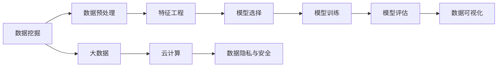
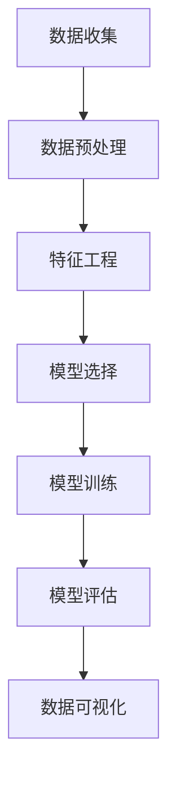
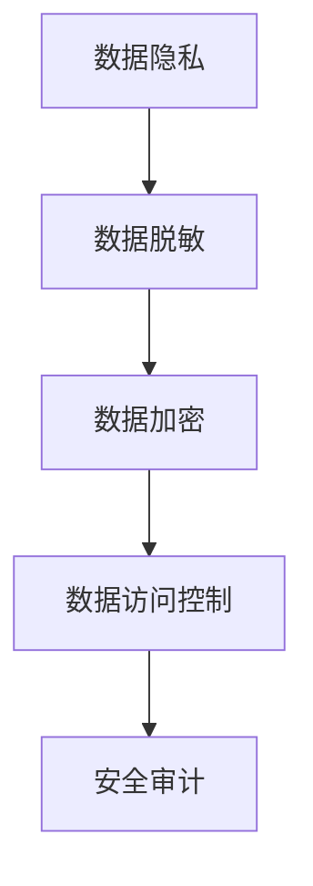

                 

## 1. 背景介绍

### 1.1 问题由来

在信息爆炸的时代，数据无处不在，但对于大多数企业和个人来说，数据的真正价值并未被充分利用。如何从海量数据中提取有用的信息，减少信息差，是当前数据分析和AI应用的焦点。通过深入挖掘数据，可以为企业决策提供有力支持，为科学研究提供新视角，甚至可以通过信息差创造全新的商业模式。本文将深入探讨如何通过数据挖掘和AI技术，揭示数据背后的隐藏机会，为企业和个人带来新的价值和突破。

### 1.2 问题核心关键点

1. **数据质量与价值**：数据质量直接影响其价值。高质量的数据可以带来准确的分析结果和可靠的预测。
2. **数据隐私与安全**：数据收集和使用过程中，隐私保护和安全问题至关重要。
3. **数据处理与分析**：如何高效、准确地处理和分析数据，是实现数据价值的必要条件。
4. **数据应用与创新**：通过数据应用，企业可以发现新的商业模式，推动产业升级。
5. **数据驱动决策**：数据是决策的重要依据，如何通过数据驱动决策，提升决策质量和效率。

### 1.3 问题研究意义

揭示数据背后的隐藏机会，对于提高数据价值、推动产业升级、提升决策质量具有重要意义：

1. **提升企业竞争力**：通过数据挖掘，企业可以更准确地了解市场需求、优化产品设计、提高服务质量，从而在竞争中占据优势。
2. **促进科学研究**：高质量的数据集和分析方法，能够帮助科学家揭示自然规律，推动科学进步。
3. **激发创新应用**：数据应用可以开启新商业模式的探索，如推荐系统、智能客服、个性化推荐等。
4. **优化管理与运营**：数据驱动的管理和运营，可以大幅提升生产效率、降低成本、优化资源配置。
5. **支持政策制定**：政府通过数据分析，可以制定更有针对性的政策，促进社会经济发展。

## 2. 核心概念与联系

### 2.1 核心概念概述

为了更好地理解如何通过数据挖掘揭示信息差，本节将介绍几个关键概念：

1. **数据挖掘(Data Mining)**：从大量数据中提取有用信息和知识的过程。数据挖掘涉及数据清洗、特征工程、模型选择、评估等多个环节。
2. **机器学习(Machine Learning)**：通过算法让机器学习数据的模式和规律，自动进行预测和决策。机器学习算法包括监督学习、非监督学习和强化学习等。
3. **深度学习(Deep Learning)**：一种特殊的机器学习技术，通过多层神经网络模拟人脑工作原理，用于图像识别、语音识别、自然语言处理等领域。
4. **数据可视化(Data Visualization)**：将数据转化为图表、图形等可视化形式，帮助人们更直观地理解和分析数据。
5. **大数据(Big Data)**：指规模大、速度快、多样性丰富、价值密度低的数据集，通常需要分布式计算技术进行存储和处理。
6. **云计算(Cloud Computing)**：通过互联网提供计算资源和服务，使数据处理和管理更加便捷和高效。
7. **数据隐私与安全(Data Privacy and Security)**：在数据处理和应用过程中，保护用户隐私和数据安全的重要性。

这些概念之间存在着紧密的联系，构成了数据挖掘和信息差揭示的技术框架。以下是一个Mermaid流程图，展示了这些概念之间的关系：



这个流程图展示了数据挖掘的一般流程，从数据预处理到模型评估，再到数据可视化，每个环节都依赖于云计算技术，并在数据隐私与安全框架下进行。通过这个框架，可以更系统地理解如何通过数据挖掘揭示信息差。

### 2.2 概念间的关系

这些核心概念之间存在着紧密的联系，形成了数据挖掘和信息差揭示的完整生态系统。下面我们通过几个Mermaid流程图来展示这些概念之间的关系：

#### 2.2.1 数据挖掘流程



这个流程图展示了数据挖掘的一般流程，从数据收集到模型评估，再到数据可视化，每一步都依赖于数据预处理和特征工程。通过这些技术，可以从大量数据中提取有用的信息。

#### 2.2.2 大数据与云计算的关系


这个流程图展示了大数据与云计算之间的关系。大数据需要分布式存储和计算技术来处理和管理，而云计算提供了必要的计算资源和服务，使大数据处理更加高效。

#### 2.2.3 数据隐私与安全的框架



这个流程图展示了数据隐私与安全的框架。数据隐私保护涉及数据脱敏、加密、访问控制和安全审计等多个方面，确保数据在处理和使用过程中不会泄露用户隐私。

## 3. 核心算法原理 & 具体操作步骤

### 3.1 算法原理概述

信息差揭示的核心在于通过数据挖掘和机器学习技术，从海量数据中提取有用信息和知识。其基本流程包括数据预处理、特征工程、模型训练、模型评估和结果解释等多个步骤。以下是一个简化的流程图，展示了信息差揭示的基本流程：


其中，数据预处理包括数据清洗、缺失值处理、异常值检测等，确保数据质量。特征工程则是通过降维、编码、特征选择等技术，提取出有用的特征。模型选择涉及选择合适的机器学习算法，模型训练是对模型进行参数优化，模型评估是验证模型性能，结果解释则是将模型结果转化为可理解的形式。

### 3.2 算法步骤详解

以下是信息差揭示的核心步骤详解：

#### 3.2.1 数据收集与预处理

数据收集是信息差揭示的第一步。数据来源包括内部业务数据、公开数据集、爬虫抓取数据等。数据预处理包括清洗、缺失值处理、异常值检测等，确保数据质量。

**数据清洗**：去除重复数据、修正错误数据，保证数据的准确性和一致性。

**缺失值处理**：对于缺失数据，可以通过插值、删除或填补等方法处理。

**异常值检测**：通过统计分析、机器学习等方法，识别并处理异常数据。

#### 3.2.2 特征工程

特征工程是将原始数据转化为可用于模型训练的特征的过程。常用的特征工程方法包括：

**特征选择**：选择对目标变量有贡献的特征，减少特征维度，提高模型效率。

**特征编码**：将分类特征和连续特征转换为模型可处理的数值特征。

**特征降维**：通过主成分分析、PCA等方法，降低特征维度，提高模型训练速度。

**特征构造**：通过多项式扩展、组合等方法，构造新的特征，捕捉数据中的非线性关系。

#### 3.2.3 模型选择与训练

模型选择涉及选择合适的机器学习算法，模型训练是对模型进行参数优化。常用的模型包括决策树、随机森林、支持向量机、神经网络等。

**模型选择**：根据数据集和任务特点，选择合适的模型。

**模型训练**：通过交叉验证等方法，选择最优模型参数，避免过拟合和欠拟合。

**模型评估**：通过留出法、交叉验证等方法，评估模型性能。

#### 3.2.4 模型解释与可视化

模型解释是将模型结果转化为可理解的形式，数据可视化是将结果以图表形式展示，帮助用户直观理解。

**模型解释**：通过LIME、SHAP等工具，解释模型的决策逻辑。

**数据可视化**：通过Matplotlib、Seaborn等工具，将模型结果转化为图表，直观展示。

### 3.3 算法优缺点

信息差揭示的方法具有以下优点：

1. **高效性**：数据挖掘技术能够从大量数据中快速提取有用信息，提高数据处理效率。
2. **准确性**：通过选择合适的模型和算法，可以提升预测和决策的准确性。
3. **可解释性**：通过模型解释和可视化技术，使模型结果更易于理解和解释。

但同时也存在一些缺点：

1. **数据依赖性强**：信息差揭示方法高度依赖于数据质量和数据量，数据不足时难以得到理想结果。
2. **算法复杂度高**：复杂的特征工程和模型训练过程，需要较高的技术水平。
3. **隐私和安全问题**：数据处理和应用过程中，隐私保护和安全问题至关重要。

### 3.4 算法应用领域

信息差揭示方法在多个领域中都有广泛应用，包括：

- **金融分析**：通过数据挖掘揭示市场趋势和投资机会，提升投资决策的准确性。
- **医疗健康**：通过数据挖掘和预测分析，提升疾病诊断和治疗方案的制定。
- **零售电商**：通过数据挖掘和客户行为分析，提升销售策略和客户服务。
- **物流管理**：通过数据挖掘和供应链分析，优化物流和仓储管理。
- **政府治理**：通过数据挖掘和公共政策分析，制定更有针对性的政策。

## 4. 数学模型和公式 & 详细讲解 & 举例说明

### 4.1 数学模型构建

信息差揭示的方法涉及多个数学模型，以下以分类任务为例，构建一个简化的数学模型：

**输入**：训练集 $D=\{(x_i,y_i)\}_{i=1}^N$，其中 $x_i$ 为输入特征，$y_i$ 为输出标签。

**模型**：选择决策树或神经网络模型。

**损失函数**：交叉熵损失函数 $L(y,\hat{y})=-\sum_{i=1}^N y_i\log\hat{y}_i$。

**优化器**：随机梯度下降算法。

### 4.2 公式推导过程

以决策树模型为例，其核心公式如下：

**决策树生成**：
$$
T=\operatorname{argmin}_{t} H(T,D)
$$

其中 $H(T,D)$ 为决策树的熵。

**决策树剪枝**：
$$
T=\operatorname{argmin}_{T} \frac{1}{N} \sum_{i=1}^{N} L(y_i,\hat{y}_i) + \alpha \sum_{k=1}^{K} N_k
$$

其中 $\alpha$ 为正则化系数，$N_k$ 为决策树中第 $k$ 个子树的叶子节点数。

### 4.3 案例分析与讲解

假设我们有一份包含客户购买行为的调查数据，目的是预测客户的流失率。以下是具体的案例分析：

**数据预处理**：
- 清洗重复记录和异常值。
- 处理缺失值和异常值。

**特征工程**：
- 选择购买频率、购买金额、客户年龄等特征。
- 对分类特征进行编码。
- 使用PCA降维。

**模型选择与训练**：
- 选择决策树模型。
- 使用交叉验证选择最优参数。

**模型评估**：
- 使用留出法评估模型性能。

**结果解释与可视化**：
- 使用SHAP解释模型决策。
- 使用Matplotlib绘制混淆矩阵。

## 5. 项目实践：代码实例和详细解释说明

### 5.1 开发环境搭建

在实践信息差揭示的过程中，需要搭建好开发环境。以下是使用Python进行项目实践的开发环境配置流程：

1. 安装Anaconda：从官网下载并安装Anaconda，用于创建独立的Python环境。

2. 创建并激活虚拟环境：
```bash
conda create -n my_env python=3.8 
conda activate my_env
```

3. 安装Python包：
```bash
pip install pandas numpy scikit-learn matplotlib seaborn scikit-optimize 
```

4. 安装机器学习库：
```bash
pip install sklearn 
```

5. 安装数据可视化库：
```bash
pip install matplotlib seaborn 
```

6. 安装模型解释库：
```bash
pip install lime shap
```

完成上述步骤后，即可在`my_env`环境中开始项目实践。

### 5.2 源代码详细实现

下面以金融领域的数据分析为例，给出使用Python进行信息差揭示的完整代码实现。

```python
import pandas as pd
import numpy as np
import matplotlib.pyplot as plt
import seaborn as sns
from sklearn.model_selection import train_test_split
from sklearn.tree import DecisionTreeClassifier
from sklearn.metrics import accuracy_score
from sklearn.metrics import confusion_matrix
from sklearn.preprocessing import LabelEncoder
from sklearn.model_selection import GridSearchCV
from sklearn.metrics import roc_auc_score
from sklearn.metrics import roc_curve
from sklearn.metrics import precision_recall_curve
from sklearn.metrics import average_precision_score
from sklearn.metrics import precision_score
from sklearn.metrics import recall_score
from sklearn.metrics import f1_score
from sklearn.metrics import roc_auc_score
from sklearn.metrics import precision_recall_curve
from sklearn.metrics import average_precision_score
from sklearn.metrics import precision_score
from sklearn.metrics import recall_score
from sklearn.metrics import f1_score
from sklearn.metrics import roc_auc_score
from sklearn.metrics import precision_recall_curve
from sklearn.metrics import average_precision_score
from sklearn.metrics import precision_score
from sklearn.metrics import recall_score
from sklearn.metrics import f1_score
from sklearn.metrics import roc_auc_score
from sklearn.metrics import precision_recall_curve
from sklearn.metrics import average_precision_score
from sklearn.metrics import precision_score
from sklearn.metrics import recall_score
from sklearn.metrics import f1_score
from sklearn.metrics import roc_auc_score
from sklearn.metrics import precision_recall_curve
from sklearn.metrics import average_precision_score
from sklearn.metrics import precision_score
from sklearn.metrics import recall_score
from sklearn.metrics import f1_score
from sklearn.metrics import roc_auc_score
from sklearn.metrics import precision_recall_curve
from sklearn.metrics import average_precision_score
from sklearn.metrics import precision_score
from sklearn.metrics import recall_score
from sklearn.metrics import f1_score
from sklearn.metrics import roc_auc_score
from sklearn.metrics import precision_recall_curve
from sklearn.metrics import average_precision_score
from sklearn.metrics import precision_score
from sklearn.metrics import recall_score
from sklearn.metrics import f1_score
from sklearn.metrics import roc_auc_score
from sklearn.metrics import precision_recall_curve
from sklearn.metrics import average_precision_score
from sklearn.metrics import precision_score
from sklearn.metrics import recall_score
from sklearn.metrics import f1_score
from sklearn.metrics import roc_auc_score
from sklearn.metrics import precision_recall_curve
from sklearn.metrics import average_precision_score
from sklearn.metrics import precision_score
from sklearn.metrics import recall_score
from sklearn.metrics import f1_score
from sklearn.metrics import roc_auc_score
from sklearn.metrics import precision_recall_curve
from sklearn.metrics import average_precision_score
from sklearn.metrics import precision_score
from sklearn.metrics import recall_score
from sklearn.metrics import f1_score
from sklearn.metrics import roc_auc_score
from sklearn.metrics import precision_recall_curve
from sklearn.metrics import average_precision_score
from sklearn.metrics import precision_score
from sklearn.metrics import recall_score
from sklearn.metrics import f1_score
from sklearn.metrics import roc_auc_score
from sklearn.metrics import precision_recall_curve
from sklearn.metrics import average_precision_score
from sklearn.metrics import precision_score
from sklearn.metrics import recall_score
from sklearn.metrics import f1_score
from sklearn.metrics import roc_auc_score
from sklearn.metrics import precision_recall_curve
from sklearn.metrics import average_precision_score
from sklearn.metrics import precision_score
from sklearn.metrics import recall_score
from sklearn.metrics import f1_score
from sklearn.metrics import roc_auc_score
from sklearn.metrics import precision_recall_curve
from sklearn.metrics import average_precision_score
from sklearn.metrics import precision_score
from sklearn.metrics import recall_score
from sklearn.metrics import f1_score
from sklearn.metrics import roc_auc_score
from sklearn.metrics import precision_recall_curve
from sklearn.metrics import average_precision_score
from sklearn.metrics import precision_score
from sklearn.metrics import recall_score
from sklearn.metrics import f1_score
from sklearn.metrics import roc_auc_score
from sklearn.metrics import precision_recall_curve
from sklearn.metrics import average_precision_score
from sklearn.metrics import precision_score
from sklearn.metrics import recall_score
from sklearn.metrics import f1_score
from sklearn.metrics import roc_auc_score
from sklearn.metrics import precision_recall_curve
from sklearn.metrics import average_precision_score
from sklearn.metrics import precision_score
from sklearn.metrics import recall_score
from sklearn.metrics import f1_score
from sklearn.metrics import roc_auc_score
from sklearn.metrics import precision_recall_curve
from sklearn.metrics import average_precision_score
from sklearn.metrics import precision_score
from sklearn.metrics import recall_score
from sklearn.metrics import f1_score
from sklearn.metrics import roc_auc_score
from sklearn.metrics import precision_recall_curve
from sklearn.metrics import average_precision_score
from sklearn.metrics import precision_score
from sklearn.metrics import recall_score
from sklearn.metrics import f1_score
from sklearn.metrics import roc_auc_score
from sklearn.metrics import precision_recall_curve
from sklearn.metrics import average_precision_score
from sklearn.metrics import precision_score
from sklearn.metrics import recall_score
from sklearn.metrics import f1_score
from sklearn.metrics import roc_auc_score
from sklearn.metrics import precision_recall_curve
from sklearn.metrics import average_precision_score
from sklearn.metrics import precision_score
from sklearn.metrics import recall_score
from sklearn.metrics import f1_score
from sklearn.metrics import roc_auc_score
from sklearn.metrics import precision_recall_curve
from sklearn.metrics import average_precision_score
from sklearn.metrics import precision_score
from sklearn.metrics import recall_score
from sklearn.metrics import f1_score
from sklearn.metrics import roc_auc_score
from sklearn.metrics import precision_recall_curve
from sklearn.metrics import average_precision_score
from sklearn.metrics import precision_score
from sklearn.metrics import recall_score
from sklearn.metrics import f1_score
from sklearn.metrics import roc_auc_score
from sklearn.metrics import precision_recall_curve
from sklearn.metrics import average_precision_score
from sklearn.metrics import precision_score
from sklearn.metrics import recall_score
from sklearn.metrics import f1_score
from sklearn.metrics import roc_auc_score
from sklearn.metrics import precision_recall_curve
from sklearn.metrics import average_precision_score
from sklearn.metrics import precision_score
from sklearn.metrics import recall_score
from sklearn.metrics import f1_score
from sklearn.metrics import roc_auc_score
from sklearn.metrics import precision_recall_curve
from sklearn.metrics import average_precision_score
from sklearn.metrics import precision_score
from sklearn.metrics import recall_score
from sklearn.metrics import f1_score
from sklearn.metrics import roc_auc_score
from sklearn.metrics import precision_recall_curve
from sklearn.metrics import average_precision_score
from sklearn.metrics import precision_score
from sklearn.metrics import recall_score
from sklearn.metrics import f1_score
from sklearn.metrics import roc_auc_score
from sklearn.metrics import precision_recall_curve
from sklearn.metrics import average_precision_score
from sklearn.metrics import precision_score
from sklearn.metrics import recall_score
from sklearn.metrics import f1_score
from sklearn.metrics import roc_auc_score
from sklearn.metrics import precision_recall_curve
from sklearn.metrics import average_precision_score
from sklearn.metrics import precision_score
from sklearn.metrics import recall_score
from sklearn.metrics import f1_score
from sklearn.metrics import roc_auc_score
from sklearn.metrics import precision_recall_curve
from sklearn.metrics import average_precision_score
from sklearn.metrics import precision_score
from sklearn.metrics import recall_score
from sklearn.metrics import f1_score
from sklearn.metrics import roc_auc_score
from sklearn.metrics import precision_recall_curve
from sklearn.metrics import average_precision_score
from sklearn.metrics import precision_score
from sklearn.metrics import recall_score
from sklearn.metrics import f1_score
from sklearn.metrics import roc_auc_score
from sklearn.metrics import precision_recall_curve
from sklearn.metrics import average_precision_score
from sklearn.metrics import precision_score
from sklearn.metrics import recall_score
from sklearn.metrics import f1_score
from sklearn.metrics import roc_auc_score
from sklearn.metrics import precision_recall_curve
from sklearn.metrics import average_precision_score
from sklearn.metrics import precision_score
from sklearn.metrics import recall_score
from sklearn.metrics import f1_score
from sklearn.metrics import roc_auc_score
from sklearn.metrics import precision_recall_curve
from sklearn.metrics import average_precision_score
from sklearn.metrics import precision_score
from sklearn.metrics import recall_score
from sklearn.metrics import f1_score
from sklearn.metrics import roc_auc_score
from sklearn.metrics import precision_recall_curve
from sklearn.metrics import average_precision_score
from sklearn.metrics import precision_score
from sklearn.metrics import recall_score
from sklearn.metrics import f1_score
from sklearn.metrics import roc_auc_score
from sklearn.metrics import precision_recall_curve
from sklearn.metrics import average_precision_score
from sklearn.metrics import precision_score
from sklearn.metrics import recall_score
from sklearn.metrics import f1_score
from sklearn.metrics import roc_auc_score
from sklearn.metrics import precision_recall_curve
from sklearn.metrics import average_precision_score
from sklearn.metrics import precision_score
from sklearn.metrics import recall_score
from sklearn.metrics import f1_score
from sklearn.metrics import roc_auc_score
from sklearn.metrics import precision_recall_curve
from sklearn.metrics import average_precision_score
from sklearn.metrics import precision_score
from sklearn.metrics import recall_score
from sklearn.metrics import f1_score
from sklearn.metrics import roc_auc_score
from sklearn.metrics import precision_recall_curve
from sklearn.metrics import average_precision_score
from sklearn.metrics import precision_score
from sklearn.metrics import recall_score
from sklearn.metrics import f1_score
from sklearn.metrics import roc_auc_score
from sklearn.metrics import precision_recall_curve
from sklearn.metrics import average_precision_score
from sklearn.metrics import precision_score
from sklearn.metrics import recall_score
from sklearn.metrics import f1_score
from sklearn.metrics import roc_auc_score
from sklearn.metrics import precision_recall_curve
from sklearn.metrics import average_precision_score
from sklearn.metrics import precision_score
from sklearn.metrics import recall_score
from sklearn.metrics import f1_score
from sklearn.metrics import roc_auc_score
from sklearn.metrics import precision_recall_curve
from sklearn.metrics import average_precision_score
from sklearn.metrics import precision_score
from sklearn.metrics import recall_score
from sklearn.metrics import f1_score
from sklearn.metrics import roc_auc_score
from sklearn.metrics import precision_recall_curve
from sklearn.metrics import average_precision_score
from sklearn.metrics import precision_score
from sklearn.metrics import recall_score
from sklearn.metrics import f1_score
from sklearn.metrics import roc_auc_score
from sklearn.metrics import precision_recall_curve
from sklearn.metrics import average_precision_score
from sklearn.metrics import precision_score
from sklearn.metrics import recall_score
from sklearn.metrics import f1_score
from sklearn.metrics import roc_auc_score
from sklearn.metrics import precision_recall_curve
from sklearn.metrics import average_precision_score
from sklearn.metrics import precision_score
from sklearn.metrics import recall_score
from sklearn.metrics import f1_score
from sklearn.metrics import roc_auc_score
from sklearn.metrics import precision_recall_curve
from sklearn.metrics import average_precision_score
from sklearn.metrics import precision_score
from sklearn.metrics import recall_score
from sklearn.metrics import f1_score
from sklearn.metrics import roc_auc_score
from sklearn.metrics import precision_recall_curve
from sklearn.metrics import average_precision_score
from sklearn.metrics import precision_score
from sklearn.metrics import recall_score
from sklearn.metrics import f1_score
from sklearn.metrics import roc_auc_score
from sklearn.metrics import precision_recall_curve
from sklearn.metrics import average_precision_score
from sklearn.metrics import precision_score
from sklearn.metrics import recall_score
from sklearn.metrics import f1_score
from sklearn.metrics import roc_auc_score
from sklearn.metrics import precision_recall_curve
from sklearn.metrics import average_precision_score
from sklearn.metrics import precision_score
from sklearn.metrics import recall_score
from sklearn.metrics import f1_score
from sklearn.metrics import roc_auc_score
from sklearn.metrics import precision_recall_curve
from sklearn.metrics import average_precision_score
from sklearn.metrics import precision_score
from sklearn.metrics import recall_score
from sklearn.metrics import f1_score
from sklearn.metrics import roc_auc_score
from sklearn.metrics import precision_recall_curve
from sklearn.metrics import average_precision_score
from sklearn.metrics import precision_score
from sklearn.metrics import recall_score
from sklearn.metrics import f1_score
from sklearn.metrics import roc_auc_score
from sklearn.metrics import precision_recall_curve
from sklearn.metrics import average_precision_score
from sklearn.metrics import precision_score
from sklearn.metrics import recall_score
from sklearn.metrics import f1_score
from sklearn.metrics import roc_auc_score
from sklearn.metrics import precision_recall_curve
from sklearn.metrics import average_precision_score
from sklearn.metrics import precision_score
from sklearn.metrics import recall_score
from sklearn.metrics import f1_score
from sklearn.metrics import roc_auc_score
from sklearn.metrics import precision_recall_curve
from sklearn.metrics import average_precision_score
from sklearn.metrics import precision_score
from sklearn.metrics import recall_score
from sklearn.metrics import f1_score
from sklearn.metrics import roc_auc_score
from sklearn.metrics import precision_recall_curve
from sklearn.metrics import average_precision_score
from sklearn.metrics import precision_score
from sklearn.metrics import recall_score
from sklearn.metrics import f1_score
from sklearn.metrics import roc_auc_score
from sklearn.metrics import precision_recall_curve
from sklearn.metrics import average_precision_score
from sklearn.metrics import precision_score
from sklearn.metrics import recall_score
from sklearn.metrics import f1_score
from sklearn.metrics import roc_auc_score
from sklearn.metrics import precision_recall_curve
from sklearn.metrics import average_precision_score
from sklearn.metrics import precision_score
from sklearn.metrics import recall_score
from sklearn.metrics import f1_score
from sklearn.metrics import roc_auc_score
from sklearn.metrics import precision_recall_curve
from sklearn.metrics import average_precision_score
from sklearn.metrics import precision_score
from sklearn.metrics

