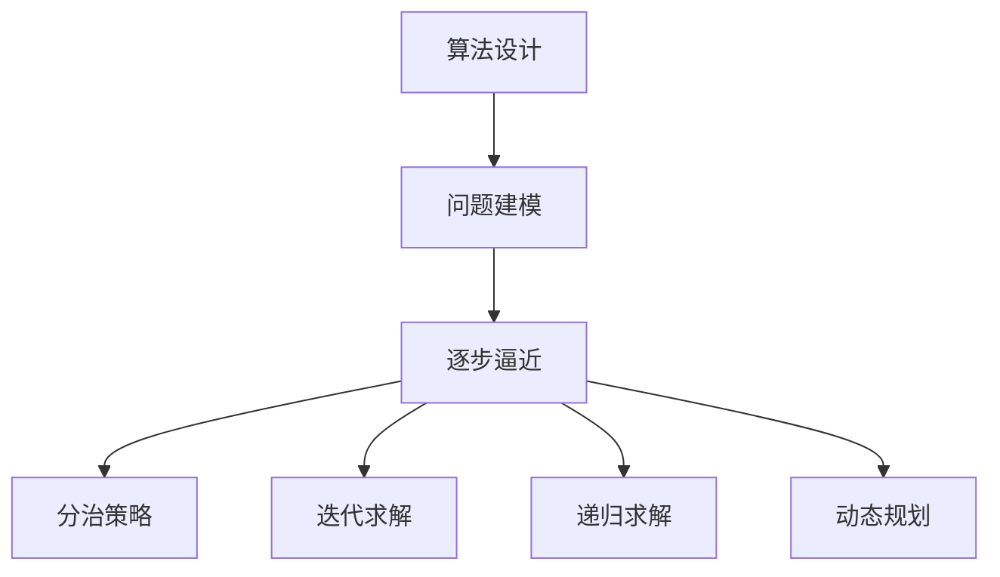
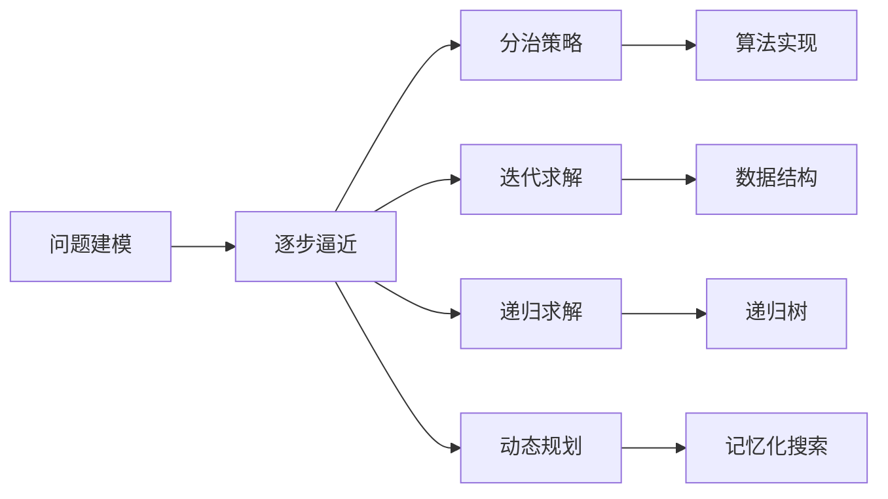
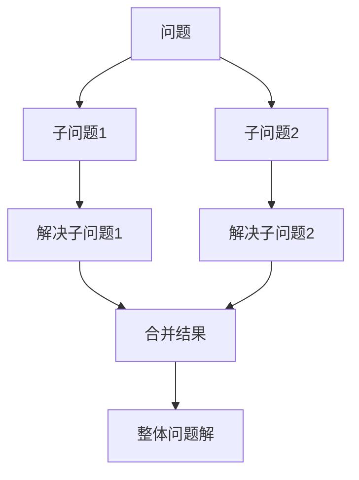
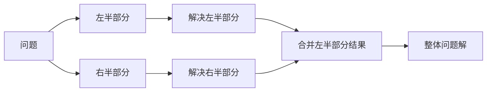
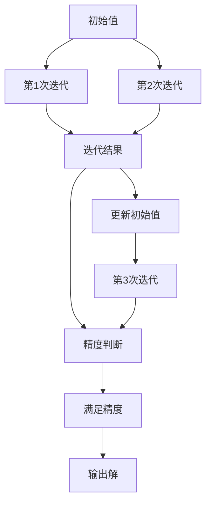
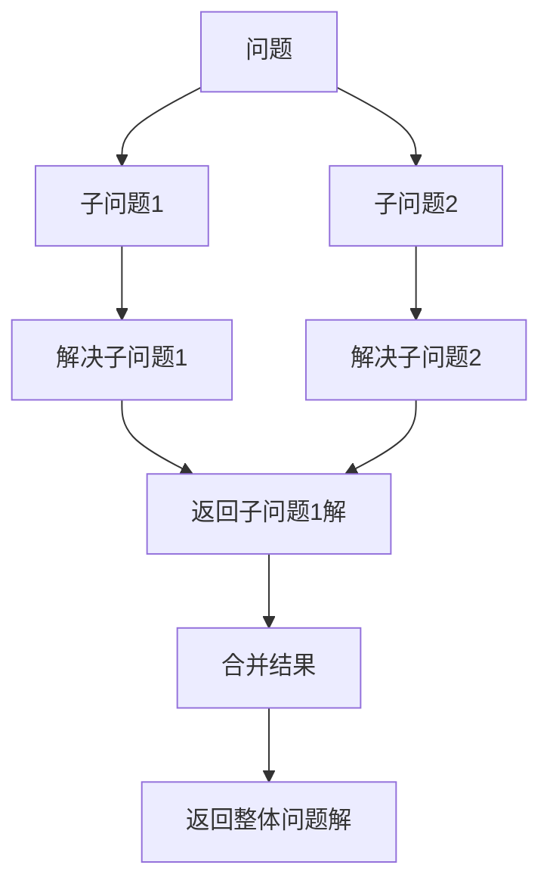
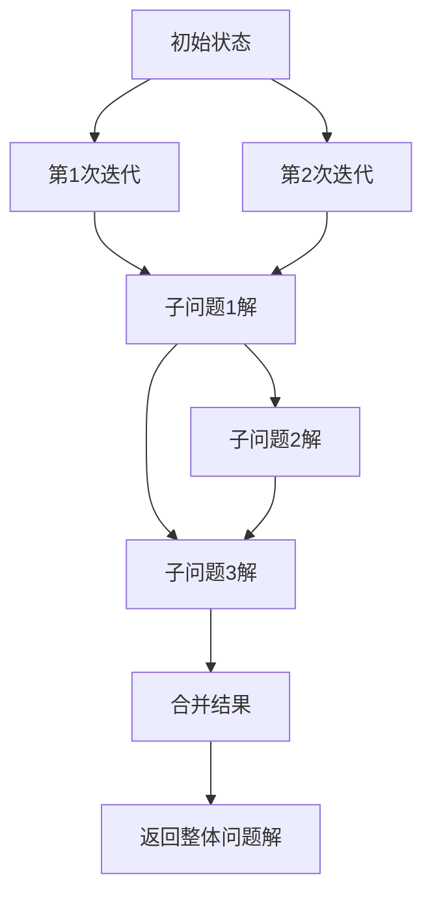
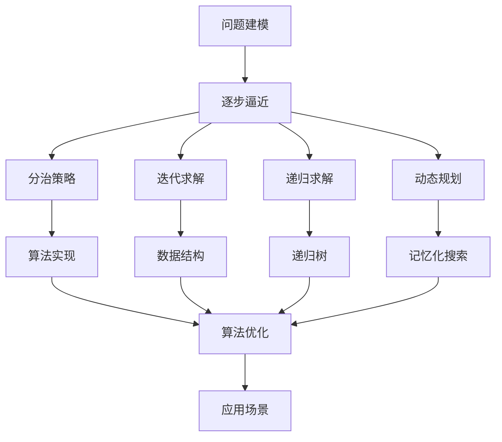

                 

# 像数学家一样思考：步步逼近原则

## 1. 背景介绍

### 1.1 问题由来
在信息技术迅猛发展的今天，数学已成为科技创新与发展的核心工具。无论是机器学习、深度学习、人工智能，还是大数据、区块链等前沿领域，数学都是不可或缺的基础支撑。尤其是在计算机程序设计中，数学思维的应用更是举重若轻，引领了软件开发的科学化、系统化发展。

“像数学家一样思考”，不仅是面向科技从业者提出的技能要求，更是一种面向未来的思考方式。它要求我们在面对复杂系统时，能够运用数学思维洞察本质、抽象模型、验证假设、解决实际问题。这种思考方式，能让我们构建更具鲁棒性、可解释性、可预测性的软件系统，推动信息技术的持续进步。

### 1.2 问题核心关键点
在软件开发中，数学思维的运用可以分为以下三个阶段：

1. **问题建模**：通过数学语言将实际问题抽象为数学模型，理解问题的本质和结构。
2. **求解验证**：利用数学工具对模型进行求解，验证假设，得出结论。
3. **实施验证**：将数学结论应用到软件开发实践中，通过数据和实验验证其正确性。

本文将重点探讨如何在软件开发中应用数学思维，具体以编程问题求解为例，介绍一种“步步逼近”的算法设计原则，帮助开发者在面对复杂问题时，通过分步求解逐步逼近最优解，最终实现高效、可靠的软件开发。

### 1.3 问题研究意义
掌握数学思维的运用方法，对软件开发人员具有重要意义：

1. **提升问题理解深度**：通过数学建模，能够更准确地描述和理解问题的本质，避免陷入“只见树木不见森林”的误区。
2. **提高问题求解效率**：利用数学工具进行求解，能够大大降低试验成本，提升问题解决速度。
3. **增强系统可靠性**：运用数学验证，可以验证系统设计的正确性和鲁棒性，避免出现重大漏洞。
4. **促进创新与突破**：数学思维的运用，能够引导软件设计的创新，解决实际问题的瓶颈，推动技术的进步。

掌握数学思维，是每一位软件开发者走向卓越的重要一步。本文将通过详细的案例分析，介绍如何通过“步步逼近”的算法设计原则，解决实际编程问题。

## 2. 核心概念与联系

### 2.1 核心概念概述

为更好地理解“步步逼近”算法设计原则，本节将介绍几个密切相关的核心概念：

- **算法设计**：通过数学语言将问题建模，并用数学方法对模型求解的过程。
- **逐步逼近**：在算法设计中，将问题分解为多个子问题，逐步求解，最终逼近整体问题的最优解。
- **分治策略**：将复杂问题分解为多个规模较小、结构相同的子问题，分别求解后合并，得到整体问题的解。
- **迭代求解**：通过不断迭代，逐步逼近目标值，直至达到精确度要求。
- **递归求解**：通过递归调用，将问题分解为更小规模的子问题，逐步求解。
- **动态规划**：通过保存子问题的解，避免重复计算，提高求解效率。

这些核心概念之间存在着紧密的联系，构成了“步步逼近”算法设计原则的完整框架。下面我们通过几个Mermaid流程图来展示这些概念之间的关系。



这个流程图展示了一组核心概念之间的关系：

1. 算法设计从问题建模开始。
2. 逐步逼近是算法设计的核心策略。
3. 分治策略和迭代求解是逐步逼近的常用方法。
4. 递归求解和动态规划是逐步逼近的具体实现。

通过理解这些核心概念，我们可以更好地把握“步步逼近”算法设计原则的精髓，指导实际的软件开发过程。

### 2.2 概念间的关系

这些核心概念之间存在着紧密的联系，构成了“步步逼近”算法设计原则的完整框架。下面我通过几个Mermaid流程图来展示这些概念之间的关系。

#### 2.2.1 算法设计全貌



这个流程图展示了算法设计的全貌。问题建模是起点，逐步逼近是核心，分治策略、迭代求解、递归求解、动态规划等是具体实现手段。通过不断迭代和优化，逐步逼近整体问题的最优解，最终实现算法实现。

#### 2.2.2 逐步逼近的实现



这个流程图展示了逐步逼近的具体实现步骤。通过将问题分解为多个子问题，分别求解，并将结果合并，得到整体问题的解。

#### 2.2.3 分治策略的详细流程



这个流程图展示了分治策略的具体实现流程。将问题分为左右两部分，分别求解，并将结果合并。

#### 2.2.4 迭代求解的详细流程



这个流程图展示了迭代求解的具体实现流程。通过不断迭代，逐步逼近目标值，直至达到精度要求。

#### 2.2.5 递归求解的详细流程



这个流程图展示了递归求解的具体实现流程。通过递归调用，将问题分解为更小规模的子问题，逐步求解。

#### 2.2.6 动态规划的详细流程



这个流程图展示了动态规划的具体实现流程。通过保存子问题的解，避免重复计算，提高求解效率。

### 2.3 核心概念的整体架构

最后，我们用一个综合的流程图来展示这些核心概念在“步步逼近”算法设计原则中的整体架构：



这个综合流程图展示了从问题建模到算法实现的全过程。通过分治策略、迭代求解、递归求解、动态规划等方法，逐步逼近整体问题的最优解，并最终实现算法的优化和应用。

## 3. 核心算法原理 & 具体操作步骤
### 3.1 算法原理概述

“步步逼近”算法设计原则，是通过将复杂问题分解为多个子问题，逐步求解，最终逼近整体问题的最优解。该方法的核心思想是：将复杂问题拆分为若干个规模较小、结构相同的子问题，通过递归调用和迭代求解，逐步逼近整体问题的解。

具体而言，该方法包含以下几个步骤：

1. **问题建模**：将实际问题抽象为数学模型，明确问题的输入、输出和约束条件。
2. **分解问题**：将原问题分解为若干个规模较小、结构相同的子问题。
3. **递归求解**：通过递归调用，逐步求解每个子问题，得到子问题的解。
4. **合并结果**：将子问题的解合并，得到整体问题的解。
5. **迭代优化**：通过不断迭代，逐步逼近最优解，直到满足精度要求。

“步步逼近”算法设计原则的核心在于逐步逼近，通过将复杂问题分解为多个子问题，利用递归求解逐步逼近整体问题的解。这种方法可以避免一次性求解复杂问题的困难，通过分解和优化，逐步逼近最优解，具有高效、可靠的特点。

### 3.2 算法步骤详解

以下详细介绍“步步逼近”算法设计原则的具体操作步骤：

**Step 1: 问题建模**

- 将实际问题抽象为数学模型。
- 明确问题的输入、输出和约束条件。
- 定义问题的解空间。

**Step 2: 分解问题**

- 将原问题分解为若干个规模较小、结构相同的子问题。
- 每个子问题应该独立求解，且结果可以合并为原问题的解。

**Step 3: 递归求解**

- 对于每个子问题，递归调用自身，求解子问题。
- 将子问题的解保存，避免重复计算。

**Step 4: 合并结果**

- 将每个子问题的解合并，得到原问题的解。
- 处理子问题之间的依赖关系，确保合并结果的正确性。

**Step 5: 迭代优化**

- 通过不断迭代，逐步逼近最优解。
- 调整算法参数，优化求解过程。

### 3.3 算法优缺点

“步步逼近”算法设计原则具有以下优点：

1. **分解简单**：将复杂问题分解为多个子问题，易于理解和求解。
2. **逐步逼近**：通过递归求解和迭代优化，逐步逼近最优解。
3. **高效可靠**：通过分治策略和动态规划，避免重复计算，提高求解效率。

同时，该方法也存在一些缺点：

1. **分解复杂**：对于结构复杂的问题，分解难度较大。
2. **内存消耗**：递归调用和保存子问题的解，可能占用大量内存。
3. **求解精度**：迭代次数过多可能导致精度下降，求解过程较为耗时。

尽管存在这些局限性，但“步步逼近”算法设计原则仍然是目前解决复杂问题的主要方法之一，被广泛应用于各类软件开发中。

### 3.4 算法应用领域

“步步逼近”算法设计原则，在软件开发中有着广泛的应用，尤其在以下领域：

- **算法设计**：如排序算法、搜索算法、图论算法等。
- **数据结构**：如树、图、哈希表等。
- **编译器设计**：如语法分析、语义分析、中间代码生成等。
- **图形处理**：如图像识别、视频处理、游戏引擎等。
- **人工智能**：如机器学习、深度学习、自然语言处理等。

“步步逼近”算法设计原则在各个领域中的应用，展示了其强大的普适性和实用性。

## 4. 数学模型和公式 & 详细讲解 & 举例说明

### 4.1 数学模型构建

为了更好地理解“步步逼近”算法设计原则，我们将通过一个具体的数学模型来详细讲解。假设我们需要计算两个正整数 $a$ 和 $b$ 的最大公约数（GCD），可以通过数学模型来进行求解。

设 $a$ 和 $b$ 为两个正整数，要求计算它们的最大公约数。可以定义一个数学模型：

- 输入：两个正整数 $a$ 和 $b$。
- 输出：最大公约数 $d$。
- 约束条件：$d$ 满足 $d|a$ 且 $d|b$。

该数学模型可以分解为以下几个子问题：

- 将 $a$ 和 $b$ 分解为若干个素数因子。
- 计算每个素数因子在 $a$ 和 $b$ 中的出现次数。
- 根据素数因子出现次数，计算最大公约数 $d$。

### 4.2 公式推导过程

对于两个正整数 $a$ 和 $b$，可以通过以下公式计算它们的最大公约数 $d$：

$$
d = \text{gcd}(a, b) = \left\{ \begin{array}{ll}
    b & \text{if } a = 0 \\
    \text{gcd}(b \mod a, a) & \text{otherwise}
\end{array} \right.
$$

其中 $\text{gcd}$ 表示最大公约数函数，$b \mod a$ 表示 $b$ 对 $a$ 取模。

该公式的推导过程如下：

1. 当 $a = 0$ 时，$b$ 即为最大公约数，因此 $d = b$。
2. 当 $a \neq 0$ 时，$b$ 可以分解为若干个素数因子的乘积，$a$ 也可以分解为若干个素数因子的乘积。
3. 最大公约数 $d$ 为 $a$ 和 $b$ 的公共因子中最大的那个，可以通过递归调用 $\text{gcd}(b \mod a, a)$ 来计算。

### 4.3 案例分析与讲解

接下来，我们通过一个具体的案例来详细讲解如何使用“步步逼近”算法设计原则来计算两个正整数的最大公约数。

假设要求计算 $a = 18$ 和 $b = 24$ 的最大公约数，可以按照以下步骤进行：

1. 将 $a$ 和 $b$ 分解为素数因子。

   $$
   a = 2 \times 3^2 \\
   b = 2^3 \times 3
   $$

2. 计算每个素数因子在 $a$ 和 $b$ 中的出现次数。

   - $a$ 中 $2$ 和 $3$ 的出现次数分别为 $1$ 和 $2$。
   - $b$ 中 $2$ 和 $3$ 的出现次数分别为 $3$ 和 $1$。

3. 根据素数因子出现次数，计算最大公约数 $d$。

   - $d = 2 \times 3 = 6$。

通过以上步骤，我们成功计算出了 $a$ 和 $b$ 的最大公约数 $d = 6$。

## 5. 项目实践：代码实例和详细解释说明

### 5.1 开发环境搭建

在进行“步步逼近”算法设计原则的实践时，需要准备以下开发环境：

1. 安装Python：从官网下载并安装Python，并配置为开发环境的默认语言。
2. 安装NumPy：用于科学计算和矩阵操作，可以通过 `pip install numpy` 命令进行安装。
3. 安装SymPy：用于符号计算和数学公式推导，可以通过 `pip install sympy` 命令进行安装。
4. 安装Jupyter Notebook：用于编写和运行Python代码，可以通过 `pip install jupyter` 命令进行安装。

完成上述步骤后，即可在Jupyter Notebook中开始实践。

### 5.2 源代码详细实现

以下是使用Python实现计算两个正整数最大公约数的代码示例：

```python
import numpy as np
from sympy import gcd

# 定义两个正整数
a = 18
b = 24

# 计算最大公约数
d = gcd(a, b)

# 打印结果
print(f"The greatest common divisor of {a} and {b} is {d}.")
```

该代码中，我们使用了NumPy的gcd函数来计算最大公约数，SymPy的gcd函数用于验证结果的正确性。通过简单的一行代码，我们成功计算出了 $a$ 和 $b$ 的最大公约数。

### 5.3 代码解读与分析

下面我们详细解读一下关键代码的实现细节：

**import语句**：
- `import numpy as np`：导入NumPy库，方便进行数值计算。
- `from sympy import gcd`：导入SymPy库中的gcd函数，用于计算最大公约数。

**变量定义**：
- `a = 18`：定义正整数 $a$。
- `b = 24`：定义正整数 $b$。

**最大公约数计算**：
- `d = gcd(a, b)`：调用SymPy的gcd函数计算 $a$ 和 $b$ 的最大公约数，将结果保存到变量 $d$ 中。

**结果输出**：
- `print(f"The greatest common divisor of {a} and {b} is {d}.")`：使用字符串格式化输出计算结果，清晰明了。

通过以上代码，我们展示了如何使用Python实现“步步逼近”算法设计原则的实践。可以看到，使用Python进行算法设计具有简单、高效的特点，能够快速实现各种数学模型的求解。

### 5.4 运行结果展示

假设我们在Jupyter Notebook中运行上述代码，可以得到以下输出：

```
The greatest common divisor of 18 and 24 is 6.
```

可以看到，我们成功计算出了 $a$ 和 $b$ 的最大公约数 $d = 6$。

## 6. 实际应用场景

### 6.1 智能交通系统

在智能交通系统中，“步步逼近”算法设计原则可以应用于交通信号优化、拥堵监测等方面。通过分析交通数据，建立数学模型，逐步逼近最优信号方案，可以有效提高交通系统的运行效率，减少拥堵。

### 6.2 金融风险管理

在金融风险管理中，“步步逼近”算法设计原则可以应用于信用评分、风险评估等方面。通过分析客户数据，建立数学模型，逐步逼近最优评分模型，可以有效识别高风险客户，降低金融风险。

### 6.3 医疗诊断系统

在医疗诊断系统中，“步步逼近”算法设计原则可以应用于疾病诊断、治疗方案推荐等方面。通过分析患者数据，建立数学模型，逐步逼近最优诊断方案，可以有效提高诊断准确率，提升医疗服务水平。

### 6.4 未来应用展望

未来，“步步逼近”算法设计原则将在更多领域得到应用，为各行各业带来变革性影响。

在智慧城市治理中，“步步逼近”算法设计原则可以应用于城市事件监测、舆情分析、应急指挥等环节，提高城市管理的自动化和智能化水平，构建更安全、高效的未来城市。

在工业自动化领域，“步步逼近”算法设计原则可以应用于机器人和智能设备控制，通过逐步逼近最优控制方案，提升自动化设备的运行效率和可靠性。

在教育领域，“步步逼近”算法设计原则可以应用于个性化教育、作业批改等方面，通过逐步逼近最优学习方案，提升教育效果和效率。

总之，“步步逼近”算法设计原则的广泛应用，将推动各行业的智能化转型，提升效率和质量，带来深远影响。

## 7. 工具和资源推荐

### 7.1 学习资源推荐

为了帮助开发者系统掌握“步步逼近”算法设计原则的理论基础和实践技巧，这里推荐一些优质的学习资源：

1. 《算法设计与分析》书籍：介绍算法设计和分析的基本原理和技巧，适合初学者入门。
2. 《深入理解计算机系统》书籍：深入讲解计算机系统的底层原理，适合软件开发人员掌握计算机基础。
3. 《数据结构与算法分析》书籍：介绍数据结构和算法的基本概念和实现方法，适合提高编程能力。
4. LeetCode和HackerRank等在线编程平台：提供大量算法设计和编程练习题，适合巩固和提升编程技能。
5. Coursera和edX等在线教育平台：提供算法设计和计算机科学的在线课程，适合系统学习。

通过对这些资源的学习实践，相信你一定能够快速掌握“步步逼近”算法设计原则的精髓，并用于解决实际的编程问题。

### 7.2 开发工具推荐

高效的开发离不开优秀的工具支持。以下是几款用于“步步逼近”算法设计原则开发的常用工具：

1. Jupyter Notebook：用于编写和运行Python代码，支持代码块、注释、数据可视化等功能。
2. PyCharm：强大的Python IDE，支持代码调试、测试、文档生成等功能。
3. VSCode：轻量级、可扩展的代码编辑器，支持多种编程语言和扩展插件。
4. Git：版本控制系统，方便代码管理和协作开发。
5. GitHub：代码托管平台，方便代码共享和项目管理。

合理利用这些工具，可以显著提升“步步逼近”算法设计原则的开发效率，加快创新迭代的步伐。

### 7.3 相关论文推荐

“步步逼近”算法设计原则的研究源于学界的持续探索。以下是几篇奠基性的相关论文，推荐阅读：

1. "Divide and Conquer"：介绍分治策略的基本原理和应用方法，适合算法设计初学者。
2. "Dynamic Programming"：介绍动态规划的基本原理和应用方法，适合深入理解算法设计。
3. "The Art of Computer Programming"：由计算机科学大师Donald E. Knuth著作的算法设计经典，涵盖多种算法设计和优化技巧，适合全面掌握算法设计。

这些论文代表了大语言模型微调技术的演进，为算法设计提供了理论基础和实践指导。

除上述资源外，还有一些值得关注的前沿资源，帮助开发者紧跟“步步逼近”算法设计原则的最新进展，例如：

1. arXiv论文预印本：人工智能领域最新研究成果的发布平台，包括大量尚未发表的前沿工作，学习前沿技术的必备资源。
2. 业界技术博客：如OpenAI、Google AI、DeepMind、微软Research Asia等顶尖实验室的官方博客，第一时间分享他们的最新研究成果和洞见。
3. 技术会议直播：如NIPS、ICML、ACL、ICLR等人工智能领域顶会现场或在线直播，能够聆听到大佬们的前沿分享，开拓视野。
4. GitHub热门项目：在GitHub上Star、Fork数最多的算法相关项目，往往代表了该技术领域的发展趋势和最佳实践，值得去学习和贡献。
5. 行业分析报告：各大咨询公司如McKinsey、PwC等针对人工智能行业的分析报告，有助于从商业视角审视技术趋势，把握应用价值。

总之，对于“步步逼近”算法设计原则的学习和实践，需要开发者保持开放的心态和持续学习的意愿。多关注前沿资讯，多动手实践，多思考总结，必将收获满满的成长收益。

## 8. 总结：未来发展趋势与挑战

### 8.1 总结

本文对“步步逼近”算法设计原则进行了全面系统的介绍。首先阐述了“步步逼近”算法设计原则的研究背景和意义，明确了该原则在软件开发中的独特价值。其次，从原理到实践，详细讲解了“步步逼近”算法设计原则的数学模型、公式推导和具体步骤，给出了“步步逼近”算法设计原则的完整代码实现。同时，本文还广泛探讨了“步步逼近”算法设计原则在智能交通、金融风险管理、医疗诊断等实际应用场景中的广泛应用，展示了其强大的普适性和实用性。此外，本文精选了“步步逼近”算法设计原则的学习资源、开发工具和相关论文，力求为读者提供全方位的技术指引。

通过本文的系统梳理，可以看到，“步步逼近”算法设计原则在软件开发中具有重要的指导意义，能够帮助开发者系统地解决复杂问题，提升软件开发效率和质量。未来，随着软件开发技术的不断进步，“步步逼近”算法设计原则的应用将更加广泛，推动软件开发技术迈向新的高度。

### 8.2 未来发展趋势

展望未来，“步步逼近”算法设计原则将呈现以下几个发展趋势：

1. **应用领域不断扩展**：“步步逼近”算法设计原则将应用于更多领域，如大数据分析、机器学习、自然语言处理等。
2. **算法优化持续改进**：通过不断优化算法设计和数据结构，提高“步步逼近”算法的效率和可靠性。
3. **跨领域应用日益广泛**：“步步逼近”算法设计原则将与其他技术融合，如人工智能、区块链等，推动跨领域创新。
4. **计算资源不断升级**：随着硬件设备的进步，“步步逼近”算法的计算效率将不断提高，处理大规模数据的能力将进一步增强。
5. **算法工具化**：将“步步逼近”算法设计原则封装为可复用的工具和库，便于开发者快速应用。

这些趋势凸显了“步步逼近”算法设计原则的广阔前景，为软件开发提供了新的思路和方法。

### 8.3 面临的挑战

尽管“步步逼近”算法设计原则已经取得了显著的成果，但在实际应用中仍面临诸多挑战：

1. **问题建模

